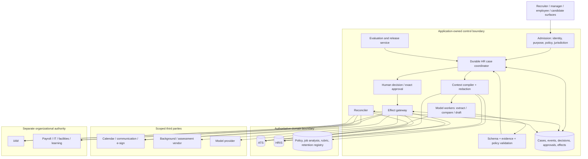
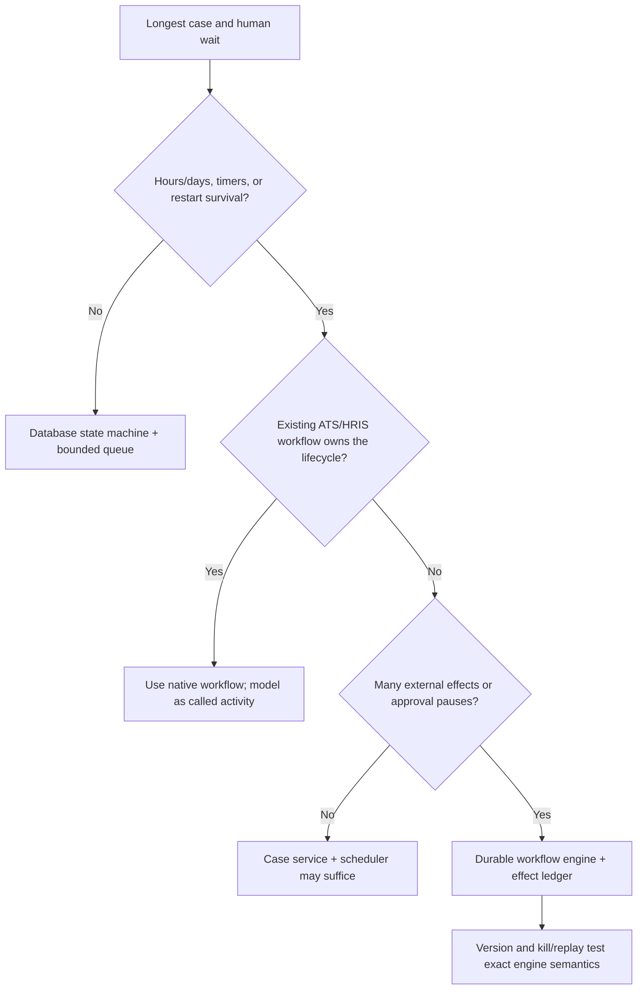
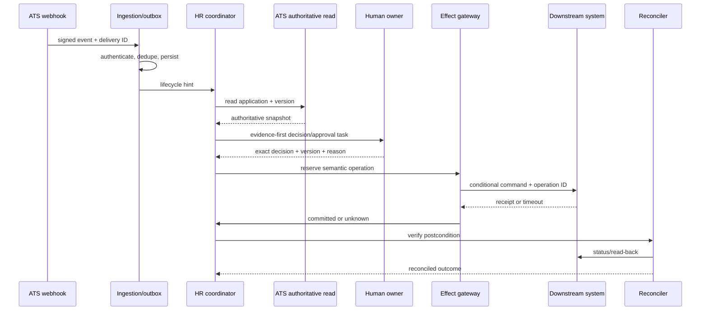

# Reference Architecture, Runtime, Models, and Integrations

> **Purpose:** Select the simplest architecture that preserves employment decision ownership, durable lifecycle truth, narrow third-party authority, and workload-specific operability.

## Recommended production shape

Use a hybrid: keep the ATS and HRIS as authoritative domain systems; keep stable steps and rules in their native workflow or a durable coordinator; invoke a model only through typed, bounded activities; route all writes through an application-owned effect gateway; reconcile real downstream state.



The control database is authoritative for agent runs, approvals, operation identities, and reconciliation—not for the underlying employment fact. HRIS/ATS reads must carry source ID, version or observation time, and freshness semantics.

## Architecture options

| Option | Strengths | Weaknesses | Suitable boundary |
|---|---|---|---|
| ATS/HRIS native workflow + deterministic rules | Lowest new operational burden; close to system of record | Limited semantic flexibility and cross-system recovery | Stable requisitions, approvals, reminders, task lists |
| Custom modular controller | Maximum policy/evidence control; easy small deployment | Must build waits, replay, UI, eval, and adapter lifecycle | Read-only/proposal pilot or short cases |
| Agent SDK/framework | Typed tools, structured outputs, sessions/tracing, fast iteration | Framework state/guardrails do not guarantee HR authorization or durability | Model worker and bounded interaction layer |
| Durable workflow/case engine | Timers, human waits, retries, cancellation, replay, assignment | Operational and versioning complexity | Multi-day recruiting/onboarding and partial external effects |
| Hybrid | Preserves native authority while adding semantic coordination | Requires explicit ownership across engines | Recommended production path |

### Selection rule

1. Keep an existing reliable ATS/HRIS step where it already owns the business transaction.
2. Use deterministic services for calculations, policy applicability, deadlines, permissions, and state transitions.
3. Use a model worker for variable-language interpretation whose output can be verified against evidence.
4. Add durable execution when process duration, human waits, or ambiguous effects exceed a simple database job's safe recovery boundary.
5. Never introduce another agent to represent an organizational role. Humans and policy services hold roles.

## Smallest deployable architecture

A Stage 1–2 deployment can be one service plus managed dependencies:

- HTTP admission/API and reviewer UI;
- PostgreSQL with cases, events, proposals, decisions, approvals, effects, and outbox tables;
- one bounded worker queue with per-tenant and per-person concurrency keys;
- encrypted object storage for source-linked artifacts;
- direct ATS/HRIS read adapters;
- one model adapter with structured output;
- one trace/metric exporter with content capture disabled by default.

Do not add Kafka, a service mesh, vector database, multi-region active-active, or a multi-agent framework merely because the future workforce is large. Promote only when measured bottlenecks or recovery requirements demand them.

## Runtime and language selection

| Choice | Good fit | Important cautions |
|---|---|---|
| TypeScript/Node.js | API-heavy SaaS adapters, interactive reviewer UX, good model SDK parity | Keep CPU-heavy parsing isolated; enforce runtime schemas in addition to TypeScript types |
| Python | Document/NLP/ML evaluation, data analysis, model ecosystem, fast experiments | Separate notebooks/eval work from production effects; use strict schemas and async discipline |
| JVM | Existing enterprise integration, strong typing, mature workflow/observability stack, large teams | Some model SDK features arrive later; isolate provider adapters |
| .NET | Microsoft enterprise identity/Graph ecosystem and existing corporate platform | Do not let application credentials become broad tenant authority |
| Go | High-throughput adapters, reconcilers, simple workers, strong deployment properties | Model/evaluation ecosystem may require a Python/TypeScript boundary |

Prefer one primary runtime. A practical polyglot boundary is a JVM/.NET/Go control plane with a stateless Python model/evaluation worker. Exchange versioned domain commands and evidence references, not arbitrary prompts or shared database internals.

## Workflow runtime decision



Durable workflow guarantees stop at their journal boundary. An ATS update, email, background-check request, IAM event, or HRIS commit still requires semantic idempotency, receipts, postcondition verification, and `unknown` outcome handling.

## Model strategy

### Capability profiles

Use task profiles, not one “HR model”:

| Profile | Required behavior | Default model class |
|---|---|---|
| Structured extraction | High schema adherence, exact citations, robust missingness | Small/medium model after deterministic parser |
| Evidence comparison | Long-context reading, contradiction detection, calibrated abstention | Stronger reasoning model |
| Candidate/employee communication draft | Tone/locale control, factual grounding, template compliance | Smaller drafting model with deterministic template |
| Policy explanation | Retrieval-grounded, version-aware, no legal conclusion | Strong model plus mandatory citations; human review when material |
| Planning | Bounded decomposition over allowed workflow transitions | Strong model only for exceptional cases; fixed plan otherwise |

### Routing rules

- deterministic parser/rule first;
- smallest model meeting critical-slice gates;
- stronger model only on explicit ambiguity classes;
- no fallback that silently changes data residency, retention, tool support, or safety posture;
- no provider alias upgrade without a behavior manifest and eval;
- no model confidence used as employment authority;
- budget by case and task, with a human escalation after bounded attempts.

### Structured output contract

```json
{
  "task_type": "requisition_evidence_check",
  "case_version": 17,
  "result": "needs_evidence",
  "findings": [
    {
      "requirement_id": "JOB-ANALYSIS-APPROVAL",
      "status": "not_present",
      "evidence_refs": [],
      "explanation": "No approved job-analysis artifact is linked."
    }
  ],
  "unsupported_claims": [],
  "next_action_proposal": "request_job_analysis",
  "completion": "escalate"
}
```

Schema validity does not prove factual support, policy applicability, or permission. Deterministic validation performs those checks after model generation.

## Third-party integration policy

Third-party tools are optional dependencies, never implicit extensions of agent authority.

| Integration | Default posture | Required production evidence | Reject when |
|---|---|---|---|
| ATS/HRIS API | Direct, versioned adapter | Stable IDs, scopes, pagination, versions/effective dates, rate limits, status/read-back, audit logs | Only generic admin access or no recovery query exists |
| ATS/HRIS webhook | Hint that triggers authoritative read | Signature, delivery ID, retries, dedupe, gap scan, full resync | Event is treated as complete ordered truth |
| Calendar/email | Draft or exact approved send | Visible actor, recipients, thread/event identity, provider acceptance vs delivery, cancellation semantics | Broad mailbox authority or no duplicate reconciliation |
| E-sign/offer | Human-owned transaction | Template/version, signer identity, expiry, status query, void/decline semantics | Agent can change material terms after approval |
| Assessment/interview AI | Disabled by default | Job-related validation, subgroup/error evidence, accessibility, notice, accommodation, version lock, local pilot | Emotion/personality inference, opaque features, no audit/deletion support |
| Background screening | Human-initiated after lawful prerequisites | Consent/authorization state, purpose, dispute/pre-adverse process, receipt/status, data minimization | Vendor output directly changes employment status |
| Model provider | Redacted, task-scoped input | Retention/training/residency/subprocessor terms, region, model version, deletion, security, availability | Provider needs full personnel file or trains on submitted HR data without approved basis |
| MCP/plugin/iPaaS | Treat as another vendor and effect boundary | Server/publisher trust, exact tools/scopes, token audience, schemas, egress, versioning, audit, kill | Tool annotations or marketplace presence are the only assurance |
| Browser/RPA | Last-resort, supervised bridge | Dedicated low-privilege session, deterministic target checks, screenshot/DOM evidence, no bulk mode, read-back | Consequential write, unreliable identity, or inaccessible UI is involved |

### Vendor admission packet

Require:

- intended use and explicitly prohibited uses;
- controller/processor/agent roles and subprocessor/data-flow map;
- training and evaluation data provenance at an appropriate disclosure level;
- construct definition, job-related validity, accuracy/error analysis, subgroup and intersectional analysis;
- accessibility conformance report plus disability-led usability evidence;
- model/rule/version change notification and rollback terms;
- API scopes, stable identities, rate/concurrency limits, retry/idempotency/status semantics;
- logging, incident notification, deletion/export/hold/backup behavior and proof;
- security testing, tenant isolation, support SLOs, business continuity, and exit/export plan;
- audit rights and sufficient evidence for the employer's own obligations.

A vendor bias audit does not transfer accountability to the employer or prove suitability for a different job, population, workflow, threshold, or jurisdiction. The UK ICO's recruitment-tool audits found, among other issues, gaps in accuracy testing and attempts by providers to pass responsibility to recruiters; local deployment assurance remains necessary.

## Connector contract

Each adapter has a contract test inventory:

| Field | Required answer |
|---|---|
| Domain operation | Exact business meaning, e.g. “stage interview invitation draft,” not `update_record` |
| Target | Tenant, legal entity, candidate/person/employment/application/requisition IDs |
| Preconditions | Expected status, effective date, source version, policy and approval hash |
| Identity | Delegated user or workload actor, scopes, token audience, expiry, visible acting identity |
| Idempotency | Provider key behavior or application semantic key and parameter equivalence |
| Receipt | Provider operation/resource ID, status, resulting version, query lifetime |
| Ambiguity query | Lookup by operation ID/business key or deterministic read-back |
| Consistency | Read-after-write, eventual consistency, replication and webhook lag |
| Limits | Rate/concurrency/page/batch limits, retry headers, quota owner |
| Data | Sent/returned fields, purpose, residency, retention, logs, subprocessors |
| Recovery | Retry classes, compensation/correction, manual procedure, support escalation |
| Lifecycle | Version, deprecation notice, sandbox parity, contract-test owner |

Greenhouse, for example, documents endpoint-level Harvest API permissions but notes that access within an endpoint can be all-or-nothing, rate limits via headers, ephemeral attachment URLs, signed webhooks, and multiple retry deliveries. These are useful mechanics—not an end-to-end correctness guarantee. Ingest the webhook once, then reread authoritative application state and deduplicate by event plus domain version.

Use the [adapter qualification and lifecycle playbooks](09-adapter-qualification-and-lifecycle-playbooks.md) for concrete HRIS/HCM, ATS, assessment/interview, calendar, IAM, payroll/benefits, e-sign, background, case/notification and observability dossiers, conformance gates and end-to-end examples. The generic connector checklist above is necessary but not sufficient for production qualification.

## Tool registry and discovery

Do not expose the model to every connector method. The application registry maps a canonical semantic operation to a tested adapter version and danger tier.

```yaml
operation: interview.invitation.stage
version: 2
mode: draft_only
inputs: [application_id, interview_plan_version, recipient_ids, time_window]
preconditions: [policy_resolved, accommodation_path_available]
approval: recruiter_exact_payload
idempotency_scope: tenant+application+interview_round
postcondition: draft_exists_with_expected_recipients_and_version
forbidden_fields: [medical_data, diversity_monitoring_data]
```

The model sees a small task-specific tool subset. Tool descriptions and MCP annotations are hints; application policy, observed behavior, and contract tests determine authority.

## Integration event topology



## Failure-aware adapter rules

- `400/422`: invalid; correct data, do not retry unchanged.
- `401/403`: authorization/configuration incident; never ask the model to work around it.
- `404`: distinguish absent, wrong tenant, eventual consistency, and deleted.
- `409/412`: stale version or conflicting operation; reread and replan.
- `429`: honor provider retry information and global budget; do not create per-worker retry storms.
- timeout/connection loss after dispatch: outcome is `unknown`; query before retry.
- `5xx`: bounded backoff only when the contract says retry is safe.
- webhook silence: scheduled gap scan/full sync is mandatory.

## Architecture acceptance checklist

- [ ] ATS/HRIS and application control records have distinct authority.
- [ ] Model, policy, human decision, approval, effect, and verification components are separable.
- [ ] The small deployment works without premature distributed infrastructure.
- [ ] Runtime selection includes in-flight workflow version tests.
- [ ] Third-party data, identity, effect, deletion, incident, and exit contracts are explicit.
- [ ] No connector gives the model generic HR administrator capability.
- [ ] IAM receives lifecycle facts but retains access-decision and execution ownership.
- [ ] Manual/deterministic operation survives model or connector outage.

## Sources and related guides

- [Greenhouse Harvest API](https://docs.greenhouse.io/harvest.html)
- [Greenhouse recruiting webhooks](https://docs.greenhouse.io/webhooks.html)
- [Workday business-process Events REST APIs](https://developer.workday.com/documentation/GUID-0df5cd55-e578-43d3-b58f-ae98825d1df0-enHYPHENus)
- [Adapter qualification and lifecycle playbooks](09-adapter-qualification-and-lifecycle-playbooks.md)
- [UK ICO recruitment AI audit outcomes](https://ico.org.uk/media/about-the-ico/documents/4031620/ai-in-recruitment-outcomes-report.pdf)
- [Tool contracts](../../tools/tool-contracts.md)
- [Tool registries, versioning, and lifecycle](../../tools/tool-registries-versioning-and-lifecycle.md)
- [Durable execution](../../runtime/durable-execution.md)
