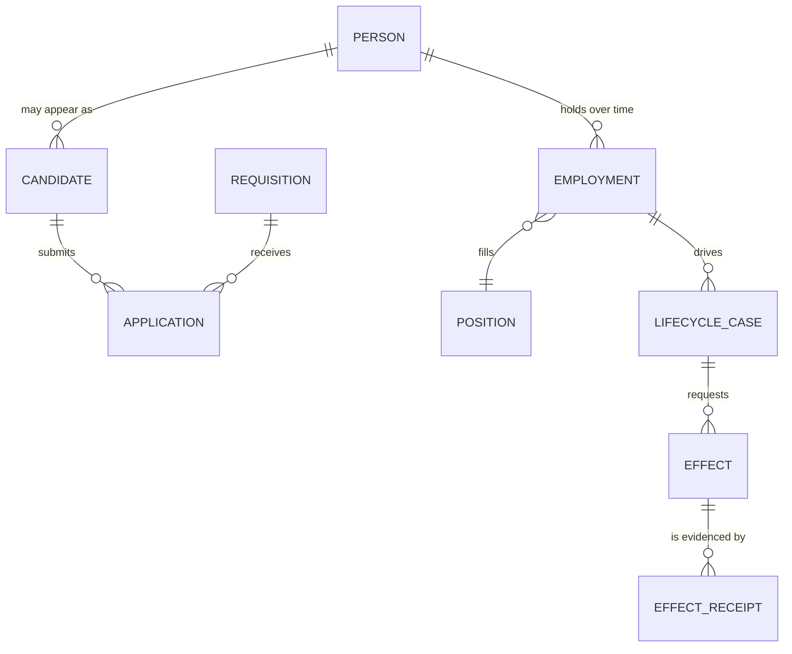
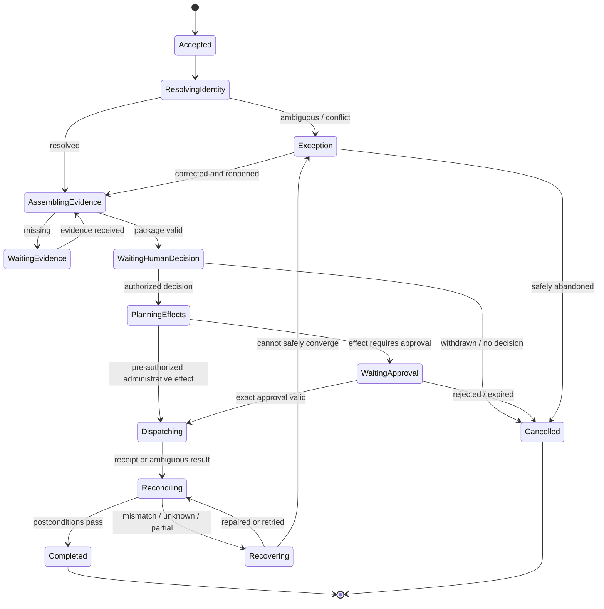
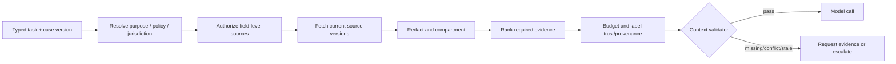

# Identity, Lifecycle State, Context, Memory, and Orchestration

> **Purpose:** Prevent cross-person errors, preserve effective-dated employment truth, and make long-running work resumable without turning chat history or memory into an HR system of record.

## Identity is a graph, not an email address

Keep these identities distinct:

| Identity | Meaning | Common collision |
|---|---|---|
| `candidate_id` | Natural person in a recruiting domain | Same person appears through referral and direct application |
| `application_id` | Candidate's candidacy for one requisition/path | Candidate has several active applications |
| `person_id` | Enterprise natural-person identity | Contractor becomes employee; rehire returns |
| `worker_id` | HRIS worker record | HRIS creates a new worker record after migration/rehire |
| `employment_id` | One employment relationship with legal entity and dates | Concurrent jobs or global transfer |
| `position_id` | Budgeted/organizational position | Worker and position are incorrectly treated as one |
| `requisition_id` | Approved hiring demand | Requisition is cloned or reopened |
| `interview_id` | One scheduled/evidence-producing interview instance | Calendar meeting, ATS interview, and interview round are collapsed |
| `assessment_definition_id` / `assessment_instance_id` | Approved procedure/version and one candidate administration | Score is detached from procedure, accommodation, cohort, or vendor version |
| `offer_id` | Versioned proposed employment terms for one application | Revised or rescinded offer overwrites the approved version |
| `assignment_id` | Effective-dated work assignment within an employment | Assignment, employment, position, and payroll relationship are treated as one |
| `manager_assignment_id` | Time-bounded manager relationship and source evidence | Current manager is applied to a historical or future-effective case |
| `legal_entity_id` / `location_id` | Employing entity and governed work-location identities | Display names hide cross-entity or remote-location policy differences |
| `policy_release_id` | Immutable approved policy/rule bundle with applicability interval | “Current policy” silently reinterprets an old decision |
| `notice_consent_id` | Exact notice/authorization/consent artifact, purpose, version and state | Checkbox presence is mistaken for valid or still-applicable permission |
| `decision_id` | Human-owned employment/process decision bound to evidence | Model proposal, recommendation, approval and decision are conflated |
| `effect_id` | One semantic external operation and its reconciliation history | HTTP request, retry, remote resource and business intent are conflated |
| `account_id` | Digital identity in an IAM/directory system | Email changes; old account remains |
| `case_id` / `run_id` | Agent workflow and execution attempts | Retry is mistaken for a new business intent |

Names, personal email, work email, phone, and model similarity are evidence—not canonical identifiers. Every ambiguous match becomes an explicit exception.



## Identity resolution contract

The resolver returns evidence and uncertainty, never a silent “best match.”

```json
{
  "resolution_id": "res_01...",
  "input_refs": ["ats:candidate:4711", "hris:person:8821"],
  "result": "matched",
  "canonical_person_id": "person_8821",
  "basis": [
    {"field": "verified_personal_email", "comparison": "exact"},
    {"field": "prior_employment_id", "comparison": "authoritative_link"}
  ],
  "conflicts": [],
  "resolved_by": "identity-steward:173",
  "resolved_at": "2026-08-31T09:15:00Z",
  "source_versions": {"ats": 44, "hris": "2026-08-31T09:14:21Z"}
}
```

Allowed results are `matched`, `new_person`, `ambiguous`, `conflict`, `stale`, and `out_of_scope`. A model may propose candidates; only deterministic unique keys or an authorized identity steward can resolve ambiguity.

## Person, worker, and employment schema

```yaml
person:
  person_id: immutable enterprise identifier
  identity_status: provisional | verified | disputed | merged | deceased
  source_links: versioned external identifiers

employment:
  employment_id: immutable relationship identifier
  person_id: foreign key
  legal_entity_id: required
  worker_type: employee | contingent | intern | other-governed-type
  position_id: nullable and versioned
  lifecycle_status: prehire | active | leave | suspended | ended | rescinded
  valid_from: effective timestamp
  valid_to: optional effective timestamp
  recorded_at: system transaction timestamp
  source_version: HRIS version or observation marker
  correction_of: optional prior record/event
```

Support bitemporal questions: “What was believed on date X?” and “What is effective on date Y?” A future termination recorded today, a backdated correction, and a rescinded termination are different facts. Never overwrite history to make the current row look simple.

## Authoritative records

| Record | Authority | Writer | Recovery source |
|---|---|---|---|
| Requisition, application, recruiting stage | ATS or governed recruiting service | ATS workflow/human/effect adapter | ATS read plus audit/change history |
| Person/employment/effective dates | HRIS/master data | HRIS business process | HRIS snapshot and business-process events |
| Job analysis/rubric/policy | Governed policy/assessment registry | Named owner with approval | Versioned source artifact |
| Model proposal | Agent application | Model worker through validator | Recompute or preserve signed proposal artifact |
| Human decision | Decision service | Authenticated authorized human | Immutable decision record |
| Approval | Approval service | Authenticated eligible approver | Approval ledger and exact intent hash |
| Effect state | Application effect ledger | Effect gateway/reconciler | Downstream receipt/read-back |
| Access state | IAM/directory | IAM only | IAM authoritative query |
| Diagnostic telemetry | Observability platform | Instrumented components | Never used to reconstruct authoritative state alone |

## Lifecycle state machine

One generic case state is useful if domain substates remain explicit.



`Completed` must be workload-specific. A new-hire case may close with accepted offer and all required task acknowledgements; an offboarding case may require HRIS ended state, IAM acknowledgement or explicit incident, asset/task disposition, and preserved hold/retention evidence.

## Event contract

Use application-owned events with stable identity and causal links. Provider webhooks are inputs, not the event ledger.

```json
{
  "event_id": "evt_01...",
  "event_type": "employment.end_confirmed.v1",
  "tenant_id": "tenant_17",
  "legal_entity_id": "entity_in_04",
  "case_id": "case_901",
  "run_id": "run_1198",
  "person_id": "person_8821",
  "employment_id": "emp_9102",
  "source": {"system": "hris", "record_id": "BP-771", "version": "v18"},
  "effective_at": "2026-09-15T18:00:00+05:30",
  "observed_at": "2026-08-31T09:20:00Z",
  "recorded_at": "2026-08-31T09:20:03Z",
  "correlation_id": "corr_44",
  "causation_id": "evt_00...",
  "policy_version": "jml-in-2026.08.4",
  "data_ref": "artifact://employment-projection/sha256:..."
}
```

Required invariants:

- event and case IDs are application-generated and immutable;
- source system, record, and version are retained;
- effective, observed, and recorded time are not conflated;
- corrections append a new event linked to the old one;
- event payloads minimize sensitive fields and use controlled references;
- every effect links to the decision/approval and causal event that authorized it;
- consumers are idempotent and tolerate duplicate/reordered inputs within declared rules.

## Case aggregate

The case record should contain references and control facts, not copied personnel files:

```yaml
case_id: case_901
case_type: offboarding_coordination
tenant_id: tenant_17
subject_refs:
  person_id: person_8821
  employment_id: emp_9102
state: reconciling
version: 28
jurisdiction_profile: in-ka-employee-v7
policy_versions: [offboarding-42, retention-19]
source_versions:
  hris: v18
decision_ref: dec_205
approval_refs: [apr_300]
open_questions: []
effect_refs: [eff_1, eff_2, eff_3]
blocking_exceptions: [iam_ack_overdue]
deadline: 2026-09-15T18:00:00+05:30
retention_class: employment-lifecycle-control
```

Update with compare-and-set on `version`. Serialize high-impact effects by `(tenant_id, person_id, employment_id, operation_class)` and requisition changes by `(tenant_id, requisition_id)`.

## Context assembly

Compile context for one task, not one person forever.



### Context layers

1. immutable task schema, autonomy ceiling, completion and stop rules;
2. resolved jurisdiction and effective-dated policy/rubric IDs;
3. minimum source facts and evidence excerpts with provenance;
4. open questions, previously rejected proposals, and human corrections from typed case state;
5. permitted tools and remaining budgets;
6. explicit untrusted-content labels.

Never place diversity-monitoring data, medical/accommodation records, background reports, complaints, whistleblowing, union activity, or unrelated performance data into ordinary recruiting context. A need-to-know workflow may reference a compartment status such as `accommodation_process_ready=true` without exposing why.

## Compaction and continuity

Provider conversation state is a cache, not continuity. At each resume or material transition, rebuild from authoritative records.

| Data | Compaction rule |
|---|---|
| Source facts | Keep structured value plus original evidence reference/version; do not summarize away conflicts |
| Policy/rubric | Keep exact version and relevant clauses/requirements; never replace with model recollection |
| Model proposals | Retain current and rejected proposal metadata; archive full content by retention class if needed |
| Human decision | Never compact the exact decision, reason, scope, actor, version, and time |
| Effects | Never compact operation ID, canonical payload hash, status, attempts, receipts, or reconciliation result |
| Conversation | Reduce to typed open questions and user-confirmed corrections; discard social chatter |
| Interview evidence | Preserve source-linked rubric observations; do not create speculative personality summaries |

Compaction tests must verify that identity, negative evidence, exceptions, effective dates, policy versions, approval scope, and unknown effects survive repeated long-session compression.

Every compaction writes a restart-safe typed continuity receipt:

```yaml
receipt_kind: compaction_receipt
receipt_version: 2
receipt_id: hr_cp_01K...
previous_receipt: {id: hr_cp_01J..., hash: "sha256:..."}
tenant_id: tenant_42
case_id: onboarding_118
case_type: onboarding_coordination
case_state: reconciling
case_state_version: 24
source_event_high_watermark:
  event: {after_sequence: 943, through_sequence: 991, event_set_digest: "sha256:..."}
  ats: {cursor: activity/551, verified_through: "2026-08-31T08:30:00Z"}
  hris: {cursor: worker-events/881, verified_through: "2026-08-31T08:28:00Z"}
  case_ledger: {through_version: 24}
identity_refs:
  person_id: person_73
  candidate_id: candidate_202
  application_id: application_991
  requisition_id: requisition_80
  worker_id: worker_52
  employment_id: employment_12
  assignment_id: assignment_31
  position_id: position_87
  manager_assignment_id: manager_assignment_44
  legal_entity_id: legal_entity_in_04
  location_id: location_blr_02
source_versions:
  candidate: ats://candidate/202@v18
  application: ats://application/991@v44
  worker: hris://worker/52@v9
  employment: hris://employment/12@v9
  assignment: hris://assignment/31@2026-09-03/seq-2
policy_and_procedure:
  purpose_id: onboarding_2026
  jurisdiction_profile: jurisdiction_8
  policy_release: hr_policy_17
  requisition_release: requisition_80/v7
  assessment_definition: null
  interview_plan_release: null
  offer_version: offer_71/v4
consent_and_notice:
  required: [notice_301]
  verified: [notice_301]
  pending: []
  revoked_or_expired: []
clocks:
  source_observed_through: "2026-08-31T08:30:00Z"
  employment_effective_at: "2026-09-03T09:00:00+05:30"
  approval_expires_at: "2026-09-02T12:00:00Z"
  next_reconciliation_at: "2026-08-31T08:45:00Z"
  case_deadline: "2026-09-03T09:00:00+05:30"
decisions:
  active: [decision_51]
  superseded_or_invalidated: [decision_47]
approvals:
  active: [approval_81]
  pending: []
  revoked_expired_or_invalidated: [approval_79]
effects:
  confirmed: [operation_90]
  pending: [operation_92]
  unknown: [operation_93]
  next_reconciliation: reconcile_operation_93_then_92
pending_effect_ids: [operation_92]
unknown_effect_ids: [operation_93]
exception_ids: []
next_safe_action: reconcile_operation_93
behavior_bundle_id: hr_agent_2026_08_31_3
context_compiler_release: hr-context/4
compactor_release: hr-compactor/2
omitted_items:
  - {class: raw_candidate_documents, reason: reload_under_current_purpose_and_rights}
  - {class: discarded_reasoning_prose, reason: non_authoritative}
retention_policy_refs: [retention://employment-lifecycle-control/19]
invariants:
  identity_graph_unambiguous: true
  effective_dated_state_reconstructable: true
  policy_notice_and_approval_scope_unchanged: true
  no_pending_or_unknown_effect_lost: true
  next_action_is_legal_from_case_state: true
invariant_hash: "sha256:..."
receipt_hash: "sha256:..."
```

Resume re-authenticates actor and purpose; verifies the receipt chain, event digest, and invariant hash; reloads the authoritative case through the event frontier; compares every source watermark and person/candidate/application/worker/assignment version; resolves current policy, jurisdiction, notice/consent, reviewer authority, approval scope and clocks; then reconciles every pending or `UNKNOWN` effect before executing `next_safe_action`. A concurrent event or correction causes compare-and-set failure or suffix replay before continuation. The receipt cannot carry employment-decision, approval, or downstream-system authority.

Continuity tests compact the same candidate, offer, onboarding, mover and offboarding cases repeatedly; crash before and after receipt commit; revoke consent or approval; backdate an assignment correction; change a manager or policy; cancel while a provider result is late; and lose an effect receipt after remote commit. Compare identity, effective-dated answers, negative/conflicting evidence, decision/approval state, clocks, effect frontier, explicit omissions and next safe action with an uncompacted oracle. Prose similarity is not the criterion.

## Memory decision matrix

| Memory class | Decision | Content and lifetime | Main control |
|---|---|---|---|
| Turn/scratch memory | **Use** | One model call's task-specific inputs | Field authorization, provenance, token budget, no sensitive spill |
| Working/run memory | **Use as typed state** | Open questions, plan progress, rejected proposals during one run | Schema, case-version binding, no free-form truth |
| Session memory | **Minimize** | UX continuity for authenticated operator session | Resume from case ledger; expire quickly; no authority |
| Durable workflow/task memory | **Required** | Case, events, decisions, approvals, effects, receipts, exceptions | Authoritative application storage, concurrency, retention |
| Domain knowledge memory | **Use governed sources** | Job analyses, policies, rubrics, templates, org structures | Owner, effective date, access, version, review cadence |
| Long-term/preference memory | **Reject by default** | No hidden recruiter preferences, “culture fit,” candidate/employee profiles | Explicit narrow preference only if non-consequential, editable, expiring |
| Episodic/outcome memory | **Curated only** | Reviewed incidents, corrections, contest outcomes as eval/process proposals | De-identify where possible; human promotion; anti-poisoning |

### Memory admission, rejection, and lifecycle tests

Exactly these seven lifetimes are recognized. An HR store, provider session, vector collection, prompt cache or product “memory” that cannot be assigned to one is disabled until classified:

| Lifetime | Use test | Reject test | Retention, correction, deletion and poisoning proof |
|---|---|---|---|
| Turn/scratch | Required only for one bounded model/tool step and reproducible from admitted inputs | Contains the only copy of evidence, decision, consent, approval, effect or identity resolution | Destroy after step/provider retention window; correct by rebuilding; prove prompt caches/support logs do not become hidden durable memory |
| Working/run | Typed material needed across bounded steps of one run and checkpointable | Free-form chain of thought or transcript is required to restore authority or employment truth | Expire/archive at run terminal state; correction invalidates checkpoint; deletion reaches run cache; inject hostile note and prove it cannot persist as instruction |
| Session | Minimal authenticated operator continuity rebuilt from case state | Implicit recall across people/cases, hidden recruiter preference or manager characterization | Expire at logout/inactivity; revoke actor and prove retrieval stops; corrected source appears on resume; deleted content cannot return from provider session |
| Durable workflow/task | Required to reconstruct case, events, clocks, decisions, approvals, effects and exceptions | Record lacks schema, owner, purpose, effective/recorded time or source version | Apply record-class schedule/hold with tombstones and backup proof; append correction; restore exact as-of state; poisoned model output cannot overwrite source truth |
| Domain knowledge | Approved policy, job analysis, rubric, template or organization fact with owner/version/applicability | Unreviewed note, stale policy, model-written rule or content without rights/access scope | Supersede/correct through owner workflow; propagate expiry/deletion to indexes and contexts; malicious document cannot alter precedence or tools |
| Long-term/preference | Narrow, explicit, non-consequential presentation or routing preference measurably helps | Candidate/worker profile, “culture fit,” selection threshold, manager bias, legal interpretation or preference affecting opportunity | Disabled by default; if enabled expose/edit/delete and expire it; poisoning and protected-proxy tests must prove no employment effect |
| Episodic/outcome | Reviewed incident, contest, correction or failure is useful as an evaluation/process example | Raw hiring outcome becomes precedent/training label, outcome is disputed, or rights/tenant/job scope are incompatible | Curate with owner/scope/expiry; correction or deletion invalidates derived fixture/index/export; adversarial episode cannot self-promote or cross cohort/tenant |

Negative tests cover cross-person and cross-tenant retrieval, wrong requisition/employment/legal entity, wrong effective date, superseded policy/rubric, revoked notice/consent, deleted subject/content, expired entitlement, poisoned resume/note/episode, and a preference attempting to change a decision or eligibility gate. Every retrieved item exposes lifetime, purpose, owner, source/version, subject/cohort scope, rights, effective interval, review state, retention policy and retrieval reason.

### Memory that must never self-form

- “Candidate seems evasive,” “employee is difficult,” personality, emotion, loyalty, health, disability, family, union, religion, political belief, or protected-characteristic inferences;
- informal manager preferences that alter opportunity;
- model-created performance or potential profiles;
- unreviewed interview notes promoted into cross-run facts;
- decisions inferred from historical hiring/termination outcomes.

Correction must update the source system or append a governed correction. Deletion must reach indexes, caches, artifacts, traces, eval corpora, fine-tuning candidates, backups according to policy; tombstones should prevent re-ingestion without retaining unnecessary content.

## Planning and orchestration

Use fixed workflows for normal cases. Dynamic planning is only for exception resolution within allowed transitions.

| Work | Orchestration |
|---|---|
| Requisition approvals | Fixed policy-driven workflow |
| Standard interview round | Template with deterministic prerequisites and scheduling |
| New-hire checklist | DAG from worker type/location/start date; deterministic tasks |
| Offboarding | Effective-time runbook with deterministic safety deadlines |
| Missing/conflicting evidence | Bounded model proposal for which evidence/tool to request next |
| Vendor outage/unknown effect | Recovery runbook and reconciler, not model improvisation |
| Novel policy conflict | Human HR/legal escalation |

### Plan contract

```json
{
  "plan_id": "plan_77",
  "case_version": 28,
  "goal": "obtain_verified_manager_and_start_location",
  "steps": [
    {"id": "s1", "operation": "hris.read_employment_projection", "mode": "read"},
    {"id": "s2", "operation": "request_hr_data_correction", "mode": "draft", "depends_on": ["s1"]}
  ],
  "limits": {"tool_calls": 4, "replans": 1, "deadline_seconds": 120},
  "stop_on": ["identity_conflict", "policy_unknown", "sensitive_data_boundary"]
}
```

The validator rejects unknown operations, cycles, broad selectors, unauthorized fields, missing human steps, and plans that attempt to satisfy an employment decision.

## Parallelism and delegation

Parallelize independent reads and reversible task status checks. Serialize identity resolution, human decision recording, ATS/HRIS status changes, and each effect class for one employment. Cancel sibling model/tool work on case cancellation.

Do not use multi-agent delegation by default. Separate model “roles” do not produce real segregation of duties. If a specialist worker is later justified, it receives a typed subtask, evidence scope, budget, and no inherited write authority; the coordinator remains accountable.

## Lifecycle edge cases

| Case | Required behavior |
|---|---|
| Rehire | Link person; preserve prior employment; create/reactivate according to HRIS/IAM policy, never by email match alone |
| Concurrent employment | Keep separate employment IDs, legal entities, managers, dates, and downstream scopes |
| Global transfer | Model as end/start or move per HR policy; explicit legal entity and effective-time semantics |
| Offer rescinded before start | Cancel pending tasks, issue correcting lifecycle event, reconcile any premature downstream effects |
| Termination reversed | New correction event; IAM handles restore under current policy, not blind undo |
| Backdated change | Record transaction time and effective time; assess already-executed effects and remediation |
| Leave/suspension | Distinct from termination; do not infer access effect; IAM policy decides |
| Worker type conversion | Preserve person; close/open or amend employment per HRIS rules; rerun policy and tasks |
| Duplicate candidate/person | Quarantine affected actions until steward resolution; preserve merge provenance |
| Deceased person | Restrict exposure and communications; follow policy/legal handling, never ordinary offboarding templates |

## State and memory acceptance tests

- [ ] Same-name, changed-email, shared-phone, rehire, contractor conversion, concurrent employment, and HRIS migration fixtures never cross-link incorrectly.
- [ ] Effective, observed, recorded, and approved timestamps remain distinct through compaction/replay.
- [ ] A deleted/corrected fact cannot reappear from cache, vector index, provider session, or episodic memory.
- [ ] Case resume produces the same allowed next transitions without relying on chat history.
- [ ] Duplicate and reordered lifecycle events converge; stale versions cannot commit.
- [ ] Diversity, medical, accommodation, background, complaint, and ordinary personnel compartments remain separated.
- [ ] Dynamic plans cannot invent tools, broaden scope, or bypass a human decision.

## Sources and related guides

- [SCIM core schema, RFC 7643](https://www.rfc-editor.org/info/rfc7643/)
- [SCIM protocol, RFC 7644](https://www.rfc-editor.org/info/rfc7644/)
- [Workday business-process event API](https://developer.workday.com/documentation/GUID-0df5cd55-e578-43d3-b58f-ae98825d1df0-enHYPHENus)
- [Agent state and event contracts](../../runtime/agent-state-and-event-contracts.md)
- [Context engineering](../../context-memory/context-engineering.md)
- [Compaction and continuity](../../context-memory/compaction-and-continuity.md)
- [Memory architecture](../../context-memory/memory-architecture.md)
