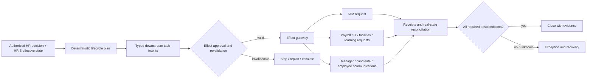
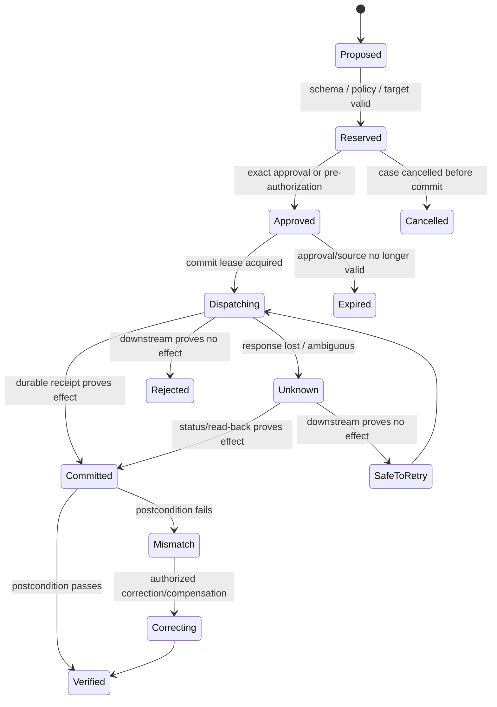
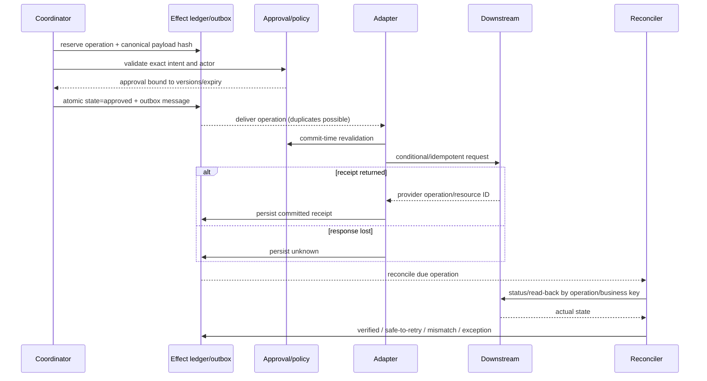

# Onboarding, Offboarding, Tools, Effects, and Recovery

> **Purpose:** Turn authorized lifecycle facts into one bounded set of verified administrative outcomes, without giving the model employment or access authority.

## Coordination, not delegated ownership

The HR agent owns a task graph and its evidence. It does not own the underlying identity, payroll, device, building, learning, or manager system. It sends the minimum authenticated lifecycle fact, records acknowledgement, and reconciles status. IAM independently maps those facts to access policy and executes account/entitlement effects.



## Lifecycle plan schema

```yaml
lifecycle_plan:
  plan_id: lp_901
  case_id: case_901
  case_version: 28
  person_id: person_8821
  employment_id: emp_9102
  lifecycle_event: end_employment
  effective_at: 2026-09-15T18:00:00+05:30
  source_ref: hris:BP-771:v18
  decision_ref: dec_205
  policy_versions: [offboarding-42, retention-19]
  tasks:
    - task_id: t_iam_1
      type: iam.lifecycle_fact.publish
      owner_system: iam
      deadline: 2026-09-15T18:00:00+05:30
      prerequisites: [hris_end_confirmed]
      completion_oracle: iam_acknowledges_event_and_reports_policy_execution_status
    - task_id: t_asset_1
      type: it.asset_return.request
      owner_system: it-service-management
      deadline: 2026-09-20T17:00:00+05:30
      prerequisites: [manager_confirmed]
      completion_oracle: asset_case_has_terminal_disposition
```

The task graph is produced from tested policy/rules. The model may explain exceptions or draft a nonstandard plan proposal; it may not add a new effect class or choose a termination effective time.

## Onboarding lifecycle

### Required states

1. **Selected** — authorized human decision exists.
2. **Offer approved** — structured terms and exact approvers are final.
3. **Offer issued** — e-sign/provider receipt exists; not equivalent to acceptance.
4. **Accepted** — provider/HRIS authoritative status verifies acceptance.
5. **Prehire verified** — person identity, employment, legal entity, worker type, location, manager, position, and start time resolved.
6. **Tasks reserved** — downstream operation identities exist but premature effects are gated.
7. **Tasks executing** — each owner acts under its own policy.
8. **Day-one ready or exception** — completion or explicit unresolved owner/deadline.
9. **Closed** — HRIS state and required downstream postconditions reconciled.

Do not provision solely from an ATS “hired” webhook. Reread ATS/HRIS truth, check acceptance and effective dates, and let IAM determine account actions.

## Offboarding lifecycle

Offboarding is safety-critical because late action can leave access active and premature action can harm a worker or disrupt an investigation.

| Phase | HR agent responsibility | Separate owner |
|---|---|---|
| Plan | Bind decision, employment, effective time, reason category access, holds, and tasks | HR decision owner/legal where applicable |
| Pre-effective | Send approved notices/tasks; reserve downstream intents; verify clocks/time zones | IAM/IT/facilities plan their execution |
| Effective-time | Publish authenticated minimal lifecycle fact and monitor acknowledgements | IAM executes access policy; payroll/IT perform their changes |
| Post-effective | Reconcile HRIS, IAM status, assets, payroll/task cases, retention/holds | Each downstream system is authoritative |
| Correction | Append rescind/correct event and coordinate new tasks | Human owner decides; IAM applies current access policy |

High-risk or involuntary offboarding may need restricted visibility, sealed timing, labor/legal review, security coordination, and independent incident fallback. The model should receive only what its administrative task requires; it does not need narrative reasons.

## Tool authority matrix

| Tool/operation | Read/write | Reversibility | Identity and scope | Approval | Idempotency and evidence | Danger |
|---|---|---|---|---|---|---|
| `ats.get_application_projection` | Read | N/A | Tenant + application + allowed fields | Purpose admission | Source ID/version/time | D1 |
| `hris.get_employment_projection` | Read | N/A | Tenant + person/employment + field policy | Purpose admission | Source version/effective time | D1/D2 by fields |
| `lifecycle.propose_task_plan` | Internal proposal | Replaceable | One case/version | No external approval | Proposal ID and source refs | D1 |
| `communication.stage_draft` | Reversible draft | Yes | Exact sender/recipients/template | Recruiter/HR based on class | Semantic key + draft read-back | D2 |
| `ats.stage_interview` | Write/pending | Usually correctable | One application/round | Exact or pre-authorized policy | Operation ID + ATS resource/version | D2/D3 |
| `offer.populate_approved_template` | Draft | Yes before issue | One selected application + approved terms | Offer/comp approvals already final; issue separately approved | Template hash + field provenance | D3 |
| `hris.submit_business_process` | System-of-record write | Correction, not simple undo | Exact person/employment/event/version | Exact authorized HR approval | Provider process ID + status/read-back | D3 |
| `iam.publish_lifecycle_fact` | Cross-domain request | Correcting event | Minimal person/employment/effective state | HR source decision; IAM owns access | Event ID + IAM acknowledgement | D3 |
| `background.request_screen` | External sensitive request | Limited | Exact candidate/package/purpose | Required authorization/consent and human initiation | Vendor case ID + status | D3 |
| `employment.decide_*` | Consequential decision | Often harmful/time-sensitive | Natural person | **Human only** | Decision evidence | D4/prohibited to model |
| `iam.change_access` | Privileged effect | Variable | Account/entitlement | IAM policy/approval | IAM receipt | Outside HR agent |

The danger tier rises with bulk selectors, sensitive fields, external recipients, legal effect, low reversibility, weak receipts, or cross-tenant reach. A low-risk method becomes high risk when applied to a cohort.

## Narrow tool contract

Avoid `update_candidate`, `update_employee`, `send_message`, or `run_offboarding`. Use semantic commands.

```json
{
  "operation": "iam.lifecycle_fact.publish.v1",
  "operation_id": "op_tenant17_emp9102_end_20260915_v18",
  "case_id": "case_901",
  "subject": {
    "person_id": "person_8821",
    "employment_id": "emp_9102",
    "legal_entity_id": "entity_in_04"
  },
  "fact": {
    "type": "employment_end_confirmed",
    "effective_at": "2026-09-15T18:00:00+05:30",
    "source_ref": "hris:BP-771:v18"
  },
  "preconditions": {
    "case_version": 28,
    "decision_id": "dec_205",
    "policy_version": "offboarding-42"
  },
  "expires_at": "2026-09-15T18:15:00+05:30"
}
```

Do not include medical data, performance narrative, termination narrative, protected characteristics, personal email, or full HR record. IAM needs stable subject and employment facts, not the story.

## Approval contract

```yaml
approval:
  approval_id: apr_300
  actor_id: hr_operator_51
  actor_authority_ref: grant_2026_991
  operation_id: op_tenant17_emp9102_end_20260915_v18
  canonical_intent_hash: sha256:...
  target_versions:
    case: 28
    hris: v18
  policy_version: offboarding-42
  decision: approve
  reason_code: verified_authorized_offboarding
  approved_at: 2026-09-15T17:50:00+05:30
  expires_at: 2026-09-15T18:15:00+05:30
```

At commit, re-evaluate actor authority, revocation, current restrictive policy, target identity, source version, effective time, hold/safety state, payload hash, and operation status. A changed payload or stale version needs a new approval.

## Effect state machine



Never mark `completed` from an HTTP success alone. Some APIs return acceptance for asynchronous processing; some writes are eventually consistent; some notification APIs do not prove recipient delivery.

## Semantic idempotency

Build the operation key from business identity, not an attempt number:

```text
operation_id = H(
  tenant_id,
  legal_entity_id,
  person_id,
  employment_id,
  semantic_operation,
  effective_at,
  source_version,
  policy_version
)
```

Store the canonical parameter hash. Reuse of the key with different parameters is a conflict, not a retry. Provider idempotency keys are useful only within their documented scope and retention; keep the application ledger longer when the workflow requires it.

## Safe commit sequence



The transactional outbox closes the local state/message gap. It does not make the remote effect exactly once.

## Reconciliation contracts

| Effect | Authoritative postcondition | Ambiguity query | Correction |
|---|---|---|---|
| Interview draft | ATS/calendar draft exists with exact participants, round, time, and version | Lookup by resource/operation ID | Update/cancel draft with new effect |
| Offer issued | E-sign/ATS offer instance has approved template/terms and intended signer | Provider status by envelope/offer ID | Void and issue corrected offer under approval |
| HRIS lifecycle business process | Provider process terminal and resulting employment state/effective date match | Business-process status + employment read | Rescind/correct via supported HR process |
| IAM lifecycle fact | IAM acknowledges same event/source version and reports execution status | Event/status endpoint or audit search | Publish linked correction; IAM determines access remediation |
| Asset task | ITSM case terminal with asset disposition | Case ID read | Reopen/new corrective case |
| Notification | Provider accepted expected message; delivery/bounce status if required | Message ID/log search | Follow-up or alternate channel under policy |
| Deletion request | All scoped systems/vendors report deleted, held, absent, or exception | Erasure job/status and inventory scan | Retry, vendor escalation, manual purge, documented hold |

Run event-driven reconciliation quickly after dispatch and scheduled sweeps for stale effects, missing webhook windows, and aged unknowns. Keep a reserved recovery capacity so a normal hiring surge cannot starve corrections.

## Cancellation and correction

Cancellation stops future work; it does not erase completed effects.

1. mark the case `cancelling` and revoke pending approvals;
2. stop undispatched model/tool work;
3. classify every effect as cancelable, committed, unknown, or already terminal;
4. cancel pending provider objects when supported;
5. reconcile unknown/committed effects;
6. issue new linked correcting/compensating effects under current authority;
7. notify affected owners/people using approved policy;
8. close only when residual consequences have explicit owners.

An offer rescission, reversed termination, or changed start date is a new governed fact. Do not “undo” by deleting evidence or replaying an inverse command without policy review.

## Failure matrix

| Failure | Detection | Containment | Retry safety | Recovery and owner |
|---|---|---|---|---|
| Duplicate webhook | Delivery/domain ID already seen | Acknowledge; no duplicate plan | Ingestion idempotent | Reread source; integration owner |
| Webhook gap/disabled endpoint | Cursor/audit gap, freshness SLO | Freeze dependent deadlines if material | Poll/full sync safe | Reconcile full authoritative window |
| Crash before dispatch | Reserved/approved, no dispatch marker | Worker lease expires | Safe after precondition recheck | Redeliver outbox |
| Effect happened, receipt write failed | Dispatch attempt with no terminal record | Mark `unknown`; no blind retry | Unsafe until queried | Lookup/read-back; persist recovered receipt |
| API timeout | Ambiguous result | Stop retries | Contract-dependent | Status by operation/business key |
| Stale source or approval | Version/expiry mismatch | Reject commit | New intent required | Reread/replan/reapprove |
| Partial onboarding | Some task receipts terminal | Preserve successful work; block false “ready” | Per-task only | Continue/correct; named task owners |
| Premature IAM effect | Real access state conflicts with effective event | Security incident; preserve evidence | No automatic inverse | IAM/security applies current remediation policy |
| Late access removal | IAM acknowledgement/SLO breach | Escalate independent security path | N/A to HR agent | IAM incident response and verification |
| Rehire mapped to old employment | ID/effective-state conflict | Quarantine plan | Unsafe | HR data steward resolves graph; IAM reevaluates |
| Vendor rate limit/outage | 429/health/error budget | Backpressure and manual fallback | Bounded per contract | Queue by deadline; vendor owner |
| Bulk task selector too broad | Count/scope policy violation | Deny before approval | N/A | Split/confirm exact cohort; HR operator |
| Downstream result contradicts HRIS | Reconciliation mismatch | Do not close case | Depends on owner | Joint HRIS/downstream repair |

## IAM boundary in practice

The HR agent may:

- assert that HRIS currently records an authorized lifecycle fact;
- include source version, effective time, person/employment/legal entity IDs;
- track whether IAM acknowledged and completed/failed its workflow;
- escalate a missed effective-time SLO;
- issue a linked correction when HR changes the lifecycle fact.

It must not:

- select accounts by guessed email;
- compute entitlements or segregation-of-duties policy;
- enable, disable, delete, grant, revoke, or restore accounts directly;
- claim IAM completion from event delivery;
- include sensitive HR narrative in IAM payloads;
- bypass IAM because its policy rejected the request.

## Case reconciliation dashboard

Operators need structured queues:

| Queue | Sort key | Required view |
|---|---|---|
| Effective-time risk | Time to start/end deadline | Subject IDs, event/source version, downstream ack, owner |
| Unknown effects | Risk tier then age | Operation, last attempt, ambiguity query, no-retry warning |
| Identity conflicts | Deadline and affected effects | Candidate/person/employment candidates and evidence |
| Partial cases | Blocking task and age | Completed/failed/pending effects and compensation options |
| Vendor gaps | Connector/tenant/window | Missing event cursor, resync status, impacted cases |
| Deletion/hold exceptions | Deadline and data class | System/vendor status, hold basis reference, owner |

Never put free-form termination reasons, medical data, full interview notes, or candidate documents on operational dashboards.

## Effect acceptance checklist

- [ ] Every operation has semantic identity, canonical parameters, exact target, preconditions, danger tier, and postcondition.
- [ ] Human decisions and approvals are separate records.
- [ ] Commit revalidates identity, authority, source version, policy, expiry, and aggregate scope.
- [ ] `unknown` is durable and cannot be auto-retried without proof.
- [ ] Compensation/correction creates a linked effect and preserves history.
- [ ] Reconciliation covers normal, stale, duplicate, partial, late, and missing-event cases.
- [ ] IAM—not the HR agent—owns access policy and effects.
- [ ] Onboarding/offboarding completion is based on real state or explicit exceptions.

## Sources and related guides

- [Adapter qualification and lifecycle playbooks](09-adapter-qualification-and-lifecycle-playbooks.md)

- [Microsoft Entra HR-driven provisioning](https://learn.microsoft.com/en-us/entra/identity/app-provisioning/what-is-hr-driven-provisioning)
- [SCIM protocol, RFC 7644](https://www.rfc-editor.org/info/rfc7644/)
- [AWS: Making retries safe with idempotent APIs](https://aws.amazon.com/builders-library/making-retries-safe-with-idempotent-APIs/)
- [Idempotency and side effects](../../reliability/idempotency-and-side-effects.md)
- [Identity and access governance agent](../identity-access-governance-agent/README.md)
- [Back-office tools and reconciliation](../back-office-workflow-agent/05-tools-effects-idempotency-and-reconciliation.md)
