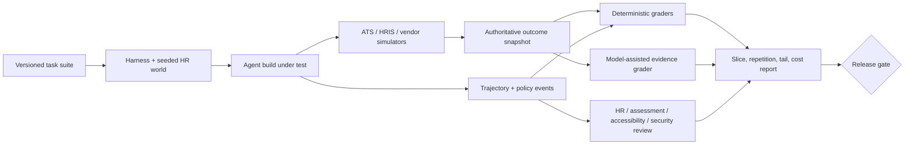

# Fairness, Accessibility, Evaluation, and Observability

> **Purpose:** Prove that the system performs its bounded task, preserves human authority, avoids measurable barriers and harmful disparities, survives failures, and produces privacy-safe operational evidence.

## Fairness is a system property

Do not ask whether “the model is unbiased.” Evaluate the complete employment process: job analysis, sourcing, application UX, parser, criteria, assessment, accommodation, interview, human review, model aid, threshold, workflow, outcome, and contest.

NIST SP 1270 distinguishes systemic, human, and computational sources of bias. The engineering consequence is that a technically equal model error rate cannot certify a process whose job criteria are invalid, applicant funnel is exclusionary, assessment is inaccessible, reviewers are anchored, or historical labels encode prior discrimination.

## Governance roles

| Role | Responsibility | Independence rule |
|---|---|---|
| HR/workflow owner | Intended use, process, staffing, remedy | Cannot self-certify technical/fairness evidence alone |
| Job/assessment expert | Job analysis, construct, procedure, validity | Qualified for the procedure and population |
| Fairness/evaluation owner | Metrics, samples, slices, uncertainty, failure analysis | Access separated from individual selection |
| Accessibility owner | Standards, assistive-tech tests, accommodation/equivalent path | Includes affected users; vendor report is insufficient |
| Privacy owner | Lawful purpose, minimization, DPIA/assessment, rights | Demographic/medical data compartment controls |
| Legal/labor owner | Jurisdiction and employment/labor interpretation | Agent provides evidence, not advice |
| Human decision owner | Individual consequential decision | Sees evidence and can reject model aid |
| Compliance/audit | Independent control assessment | Does not operate the control it audits |
| Engineering/SRE/security | Reliability, release, access, incident controls | Cannot waive employment hard gates for uptime |

## Metric selection protocol

Choose metrics from the harm and decision process before seeing results.

| Question | Possible measures | Important limits |
|---|---|---|
| Who reaches each stage? | Selection/advancement rates, impact ratios, funnel drop-off | Aggregate rate can hide job, route, location, and intersection effects |
| Who is incorrectly screened or burdened? | False negative/positive rates, error severity, manual overturn | Requires defensible labels; historical decisions may be biased |
| Is the procedure job-related? | Content/criterion/construct validity evidence, reliability | Vendor/global evidence may not transfer to local use |
| Is performance calibrated? | Calibration curves, abstention by slice | Calibration does not prove fairness or appropriate use |
| Are reviewers consistent? | Inter-rater agreement, score dispersion, deviation rate | Agreement can reflect shared bias; inspect evidence quality |
| Is the process accessible? | Completion, error, abandonment, time, accommodation success by disability-led scenarios | Disability is heterogeneous; one aggregate group is inadequate |
| Is human oversight meaningful? | Independent-score timing, model adoption/overturn, review duration, evidence views | Low overturn may mean quality or automation bias |
| Can people contest/correct? | Notice reach, request volume, resolution time, correction/decision-change rate | Low volume may mean an invisible or unsafe process |

The U.S. Uniform Guidelines' four-fifths comparison is a screening rule of thumb, not a universal pass threshold. The Guidelines themselves note circumstances where smaller differences matter and where small samples require care. NYC Local Law 144 defines particular bias-audit calculations and notice obligations for covered AEDTs; satisfying that audit does not establish validity, accessibility, or compliance everywhere. Jurisdiction profiles must keep legal calculations distinct from broader product-safety metrics.

## Fairness evaluation layers

### 1. Procedure and construct

- Is each feature/criterion defined by current job analysis and essential functions?
- Does the evidence actually measure the named competency rather than communication style, access to technology, accent, disability, career continuity, or socioeconomic opportunity?
- Are alternative procedures with similar utility and less adverse impact considered where required/appropriate?
- Are thresholds/weights locked before use and supported by evidence?
- Are historical labels appropriate, documented, and independently reviewed?

### 2. Data and representation

- coverage and missingness by source, format, language, location, worker/candidate route, and relevant group;
- label/measurement error and who created the labels;
- temporal and job-family drift;
- proxy leakage and duplicate identities;
- sample-size and intersectional limitations;
- separation of monitoring attributes from selection inputs.

### 3. Component behavior

Test parser, retrieval, model, rule, and reviewer UI separately for evidence support, omissions, hallucinations, forbidden inference, robustness, and subgroup/error differences.

### 4. End-to-end outcomes

Replay the real sequence with realistic humans/tools: notices, accessibility, accommodation, retries, review, decision, communication, contest, correction, and downstream state. A component pass cannot replace this.

### 5. Longitudinal impact

Monitor funnel and quality outcomes, candidate/employee experience, contest/remedy, retention where job-relevant and carefully interpreted, drift, policy changes, and feedback loops. Do not optimize retention by profiling people or treating departure as proof a hiring decision was wrong.

## Accessibility contract

Use WCAG 2.2 AA as a strong web target where applicable, but do not claim it covers every disability or legal obligation. W3C explicitly notes WCAG does not address every user need. Combine automated checks, keyboard/screen-reader/zoom/voice-input tests, cognitive and mobile scenarios, disability-led usability testing, and a responsive accommodation process.

### Candidate/employee path requirements

- clear notice of automated/model-assisted steps and what is evaluated where required/appropriate;
- consistent, accessible help and accommodation contact that does not disadvantage the requester;
- alternate channel/format and equivalent procedure when technology creates a barrier;
- accessible authentication without unnecessary cognitive tests;
- no video/audio/face/voice requirement unless job-related, validated, lawful, and an equivalent path exists;
- retry/reschedule policy for assistive-tech, connectivity, or vendor failure with no negative scoring;
- accessible decision/notice/correction/contest surfaces;
- support for language/localization needs under policy without treating fluency/accent as evidence unless genuinely job-related.

### Accessibility release matrix

| Surface | Automated checks | Required human tests | Hard failure examples |
|---|---|---|---|
| Careers/application | WCAG scanner, labels, contrast, focus, error association | Keyboard, major screen readers, zoom/reflow, voice input, mobile | Cannot submit without mouse; timeout loses data; unlabeled required field |
| Assessment | Vendor conformance + integration checks | People with relevant disabilities; alternate procedure | Measures sensory/motor/speech limitation instead of target skill |
| Interview | Caption/transcript/controls test | Deaf/hard-of-hearing, blind/low-vision, speech/neurodivergent scenarios as relevant | Candidate penalized for accommodation or tool failure |
| Reviewer UI | Semantic structure and focus | Keyboard/screen-reader; cognitive load | Evidence or conflict visible only by color/hover |
| Notices/contest | Template and document accessibility | End-to-end request with assistive tech | No accessible way to understand or correct material data |

## Evaluation environment

Build a simulated but realistic ATS/HRIS/effect environment with synthetic or appropriately governed de-identified fixtures. It must expose authoritative state, versions, effective times, webhooks, rate limits, errors, and ambiguous outcomes.



The harness records the behavior bundle: model/provider/version, prompt/instructions, schemas, tool/adapter versions, rules/policies/rubrics, jurisdiction profile, runtime, data fixture, seed/sampling controls, and evaluator versions.

### Baseline ladder and outcome design

Compare the same frozen task/world state against:

1. current qualified human process with measured disagreement and workload;
2. deterministic ATS/HRIS/workflow/rules/templates/search/parser/scheduler path;
3. the smallest single model call with no dynamic tools;
4. current production behavior bundle;
5. candidate agent bundle; and
6. a no-model or no-alert counterfactual record for operator-load analysis.

The no-alert record is descriptive, not causal proof that the agent reduced discrimination, time-to-hire or employment harm. Predeclare primary outcome, guardrails, unit of analysis, cohort/procedure/version, observation window, exclusions, missing-data handling and stop criteria. Measure supported evidence, correct workflow state and downstream defect/remediation—not only draft preference. Retain untouched temporal and organizational holdouts so later releases cannot optimize every known fixture.

## Task suite

| Family | Representative cases |
|---|---|
| Normal | Approved requisition check, interview-kit draft, onboarding plan, routine reminder |
| Boundary | Rehire, concurrent employment, future start/end, global transfer, multiple applications |
| Missing/conflict | No job analysis, manager mismatch, contradictory effective dates, unreadable resume |
| Fairness | Nontraditional career history, employment gap, name/accent variation, equivalent evidence phrasing, intersection slices |
| Disability/accessibility | Screen reader, alternative format, speech/vision/mobility/cognitive barriers, accommodation status isolation |
| Adversarial | Resume prompt injection, malicious link/file, protected-attribute inference request, manager policy bypass |
| Authority | Unauthorized approver, stale grant, changed payload, bulk selector, wrong legal entity |
| Tool failure | 429, 5xx, schema drift, expired token, delayed consistency, missing webhook |
| Partial effect | Remote commit/receipt loss, some onboarding tasks succeed, reversed termination |
| Cancellation/correction | Candidate withdrawal, offer rescission, data correction, deletion with hold |
| Privacy | Cross-person/tenant query, trace leakage, deletion resurrection, vendor retention mismatch |
| Novelty | New job family, jurisdiction conflict, unregistered assessment/version | 

## Grader assignment

| Assertion | Best grader | Release consequence |
|---|---|---|
| No prohibited employment decision/tool call | Deterministic trajectory/policy grader | Any violation blocks release |
| Correct person/employment/requisition/effective version | Deterministic state/invariant grader | Any critical mismatch blocks release |
| Evidence citation supports claim | Deterministic span checks plus model/human sampling | Threshold plus zero fabricated critical facts |
| Job-related interpretation | Qualified human/assessment review | Critical slice must pass |
| Fairness/disparity | Statistical analysis with uncertainty and governance review | Predeclared use-specific gate; severe harm blocks |
| Accessibility | Automated plus disability-led human test | Critical path barrier blocks |
| Meaningful human oversight | Trajectory/UI audit and reviewer studies | Hidden/default decision or model-first anchoring blocks |
| Recovery convergence | Deterministic fault harness | No lost/duplicate/wrong terminal state |
| Communication quality | Template checks plus human review | Harmful/invented reason blocks; aggregate quality threshold |
| Cost/latency | Instrumented measurement | Budget/SLO gate |

Use model graders only with a rubric, evidence visibility, blind validation against expert labels, drift monitoring, and human adjudication for consequential disagreements. Never let the same model family self-certify prohibited inference or fairness.

### Human-review calibration protocol

1. Draw a stratified, blinded set covering job family/level, stage, location, route, vendor/procedure/version, ordinary and nontraditional histories, missing/conflicting evidence, intersections, assistive-technology and accommodation paths, abstentions and severe tails.
2. Use two qualified independent reviewers where the local procedure requires professional or assessment judgment; prevent the model proposal from becoming the first visible anchor on the calibration subset.
3. Record evidence support, rubric item, disposition, confidence, reason code, missing information, recusal/conflict and review time. Never infer protected traits merely to manufacture a slice.
4. Measure agreement with uncertainty overall and by decision/error class. High aggregate agreement cannot hide low agreement on exclusion, accommodation, contest, adverse communication or high-risk effect cases.
5. Adjudicate disagreements through the named HR/assessment/accessibility/policy owner; preserve dissent and whether the rubric, source facts, UI or task was genuinely ambiguous.
6. Compare evidence-first, model-first and model-hidden UI orders to detect anchoring, default acceptance, rubber-stamping, fatigue and time-pressure effects.
7. Expire labels when job analysis, procedure, cohort, policy, vendor/model or legal context changes. Corrections/deletions propagate through fixture lineage.

Reviewer calibration proves consistency with the approved protocol, not that the underlying selection procedure is valid, lawful, accessible or fair. Those remain separate local evidence questions.

## Failure injection plan

Inject faults at each seam:

- before and after case checkpoint;
- before dispatch and after remote commit before receipt persistence;
- duplicate/reordered/delayed webhook;
- stale ATS/HRIS snapshot between approval and commit;
- approval revoked/expired after queueing;
- model timeout, malformed JSON, tool-call loop, context truncation, provider fallback;
- connector 401/403/404/409/412/429/500 and schema/version change;
- eventual consistency and status endpoint outage;
- trace exporter failure and redaction failure;
- deletion while task/model request is in flight;
- fairness evaluator missing a slice or demographic join is incomplete;
- accessibility vendor path unavailable during assessment;
- region/tenant routing fault.

For every injection assert final authoritative state, effect count, approval validity, privacy boundary, escalation, and time to reconciliation—not just that an exception was logged.

## Release gates

Example gates must be calibrated to the deployed task; numbers below show the form, not universal thresholds.

| Gate | Required evidence |
|---|---|
| Authority | Zero model-made/committed H5 employment decisions; zero unauthorized or stale commits across all critical repetitions |
| Identity/state | Zero cross-person/tenant/legal-entity effects; zero illegal lifecycle transitions |
| Evidence | Zero fabricated critical facts; predeclared supported-finding and abstention thresholds |
| Fairness | Use-specific subgroup/intersection analysis, uncertainty, validity, and mitigation review; no unresolved severe disparity/barrier |
| Accessibility | Critical flows pass target conformance and human scenarios; equivalent accommodation/manual path tested |
| Reliability | Duplicate/crash/unknown/partial/cancel/correction cases converge within risk deadline |
| Privacy/security | No forbidden-field/model/trace leakage; injection/egress/credential/deletion tests pass |
| Human oversight | Independent assessment captured; evidence visible; correction/recusal/contest work; automation-bias study acceptable |
| Operations | SLOs, runbooks, manual fallback, kill/revoke, rollback, and recovery load pass |
| Cost | Per correctly completed case and severe-failure review cost within approved budget |

Report repetitions and severe tails. A 99% success rate can be unacceptable if the 1% contains wrong-person termination events or systematic exclusion.

## Observability record separation

| Record plane | Purpose | Typical content | Must never replace |
|---|---|---|---|
| Metrics | Aggregated service, queue, outcome and governed fairness/accessibility indicators | Counts, durations, ages, ratios, errors, sampled cost with bounded labels | Individual case/evidence, decision, approval or effect state |
| Traces | Causal execution path and dependency latency/failure | Trace/span IDs, typed operation, controlled references, versions, status and timing | Event ledger, source snapshot, decision or reconciliation receipt |
| Diagnostic logs | Local/provider diagnosis and incident support | Structured error class, retry/limit/redaction/config state under short retention | Audit trail or narrative employment record |
| Audit records | Who/what/why authority and control evidence | Actor/workload, purpose, policy, source/decision/approval/effect IDs, versions and disposition | Raw telemetry sampled for operations |
| Evidence records | Source-linked material used by accountable humans | Access-controlled documents, spans, rubrics, notices and signed artifacts | General search/log storage |

An SLO query reads authoritative case/effect/source coverage state or a completeness-controlled projection; it does not infer completion from missing logs or a successful span. Telemetry exporter loss must be visible while the control and evidence planes continue safely or pause according to risk. Metrics avoid person IDs and uncontrolled high-cardinality labels; trace baggage contains no HR content; logs are redacted before export; audit/evidence access and retention follow their own policies.

## Online monitoring

### SLO candidates

| Service level indicator | Why it matters |
|---|---|
| Cases completed or safely escalated before employment deadline | Outcome, not model latency |
| High-risk effects reconciled within risk-tier window | Limits ambiguous/partial harm |
| Offboarding lifecycle fact acknowledged by IAM by effective-time objective | Cross-domain safety seam |
| Identity/policy ambiguity routed without effect | Fail-closed integrity |
| Candidate/employee notice, correction, accommodation, contest resolution time | Affected-person control |
| Required evidence bundles reconstructable | Audit/remedy readiness |
| Connector freshness and webhook gap age | Prevents silent stale state |
| Cost per correctly completed case | Avoids cheap but harmful automation |

Do not publish one global SLO that averages low-risk drafts with termination/onboarding deadlines. Slice by workflow, risk, tenant/region, vendor, and deadline class.

### Fairness/accessibility signals

- funnel/selection and error measures by job, stage, route, location, procedure/version, and governed slices;
- parser/abstention/missingness and human-overturn rates;
- assessment/integration failure and reschedule rates;
- accommodation request process timing and success without exposing details;
- candidate/employee complaints, contests, corrections, opt-outs, and decision changes;
- model-summary adoption/overturn and review-time shifts;
- vendor model/rubric/data drift and unannounced changes.

Apply privacy thresholds and qualified review. Do not suppress important small-group harm merely to make a dashboard stable; use protected analysis environments and qualitative evidence.

## Trace topology

```text
hr.run
├── admission.authorize
├── context.compile
│   ├── ats.read_projection
│   └── hris.read_projection
├── model.generate_proposal
├── proposal.validate
├── human.decision_wait
├── effect.reserve
├── effect.approve
├── adapter.dispatch
└── effect.reconcile
```

Correlate `tenant_id`, `case_id`, `run_id`, `person_id`/`employment_id` as controlled or hashed references, `decision_id`, `approval_id`, `operation_id`, adapter/vendor/model/rule/policy versions, and trace ID. Never put names, emails, resumes, medical data, interview content, secrets, or legal narrative in span attributes/baggage.

## Incident queries

Operators must be able to answer without reading every prompt:

- Which effects used a revoked approval, stale source version, affected model/vendor, or policy/rubric version?
- Which cases have `unknown` high-risk effects older than the reconciliation objective?
- Which lifecycle events near an effective time lack IAM acknowledgement?
- Which source webhook windows or API pages are missing?
- Which outputs contained forbidden-field or injection detector hits?
- Which cohorts and decisions may be affected by a fairness/accessibility regression?
- Which copies of a contested/deleted record exist and what is their disposition?

## Online-to-offline failure mining

1. capture a minimum incident/contest/correction record with source references;
2. triage whether root cause is process, job analysis, data, model, prompt, policy, UI, human factors, adapter, vendor, or operations;
3. create a sanitized deterministic fixture and the relevant slice;
4. add a code, statistical, model, and/or human grader;
5. verify the proposed change on the full critical suite, not only the reproducer;
6. review remediation for affected people/cases;
7. canary and monitor the changed behavior bundle.

Raw production decisions and complaints do not automatically become training data.

## Evaluation checklist

- [ ] Deterministic, single-call, current workflow, and human baselines are measured.
- [ ] Task fixtures include state, people impact, accessibility, and real tool failure semantics.
- [ ] Fairness analysis covers process, validity, data, components, end-to-end outcomes, and drift.
- [ ] Legal metric calculations are separated from product-safety claims.
- [ ] Accessibility combines standards, assistive-tech, disability-led, and accommodation-path testing.
- [ ] Critical authority, identity, privacy, fairness, and accessibility failures block release.
- [ ] Repetitions and tail failures are reported, not hidden by averages.
- [ ] Online signals feed governed offline fixtures and affected-case review.

## Sources and related guides

- [NIST SP 1270: Identifying and managing AI bias](https://www.nist.gov/publications/towards-standard-identifying-and-managing-bias-artificial-intelligence)
- [EEOC Uniform Guidelines Q&A](https://www.eeoc.gov/laws/guidance/questions-and-answers-clarify-and-provide-common-interpretation-uniform-guidelines)
- [NYC AEDT rules and resources](https://www.nyc.gov/site/dca/about/automated-employment-decision-tools.page)
- [W3C WCAG 2.2](https://www.w3.org/TR/WCAG22/)
- [U.S. DOJ AI hiring disability guidance](https://www.ada.gov/resources/ai-guidance/)
- [Trajectory and reliability evaluation](../../evaluation/trajectory-and-reliability-evaluation.md)
- [Observability and tracing](../../evaluation/observability-and-tracing.md)
