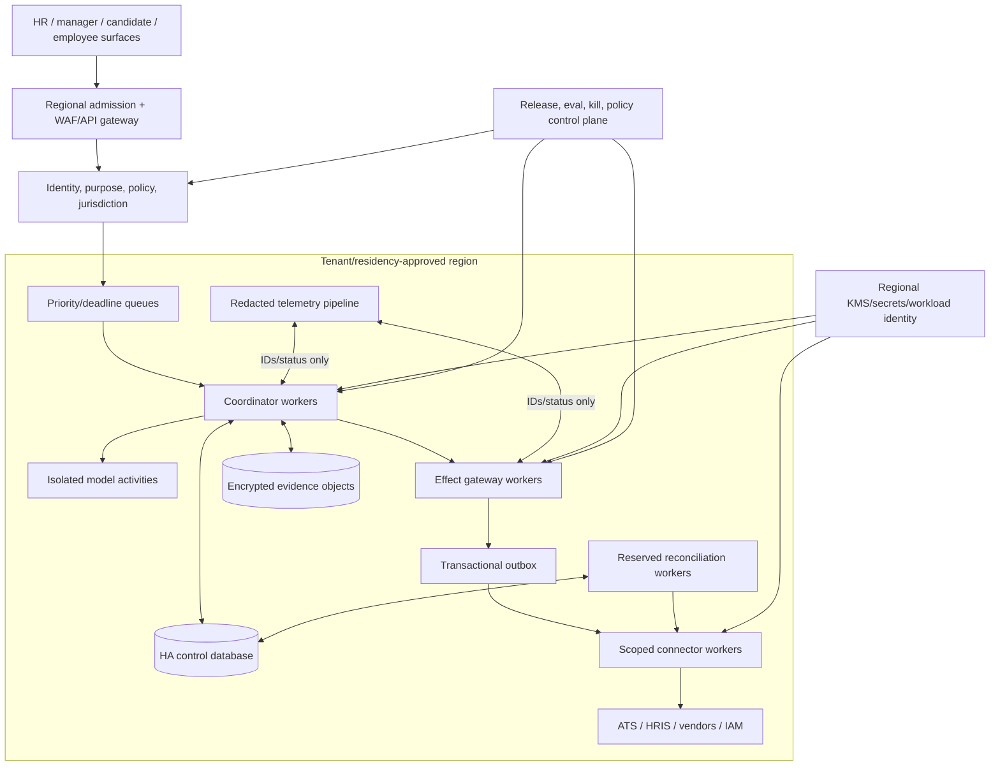
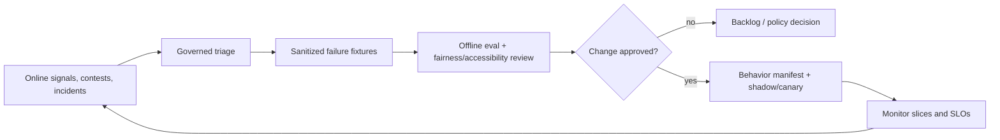

# Deployment, Scale, Incidents, and Governed Evolution

> **Purpose:** Deploy the bounded HR workflow safely, size normal and recovery capacity, degrade without losing lifecycle truth, respond to employment-impacting incidents, and govern every behavioral change.

## Deployment principles

1. The agent is not the only path through a required employment process.
2. Lifecycle state, human decisions, approvals, and effects survive model/provider loss.
3. Capacity is bounded by tenant, workflow, risk, deadline, person/employment, vendor, and region.
4. Reconciliation and incident recovery have reserved capacity.
5. A release is the whole behavior bundle, not only application code.
6. Expand authority only after measured evidence; never because queue pressure rises.

## Environment progression

| Environment | Data | Effects | Purpose |
|---|---|---|---|
| Local/unit | Synthetic | Simulator only | Schema, policy, state, tool, and grader development |
| Integration | Synthetic/vendor sandbox | Sandbox or fake | Connector contracts, auth, rate, webhook, reconciliation |
| Evaluation | Versioned governed fixture | Fully controlled simulator | Repeated normal/adversarial/fault/fairness/accessibility gates |
| Shadow | Production projections under approved purpose | No external effect | Compare proposals and operator workflow without influencing outcome |
| Canary | Small tenant/workflow/cohort slice | Low-risk approved effects only | Observe real operation and rollback |
| Production | Purpose-scoped production data | Authority by registered effect class | SLO-backed operation |

Do not copy production personnel files into lower environments. Use synthetic fixtures or a separately approved, minimized, transformed evaluation dataset with access, purpose, retention, and deletion controls.

## Production topology



Use logical tenant isolation for low/medium risk only after field and connector tests. Consider dedicated databases/keys/workers/accounts or deployments for jurisdictions, high-sensitivity compartments, high-profile populations, acquisitions, or contractual/regulatory isolation. Never route a region failover to an unapproved data-residency/model endpoint.

## Admission control

Admission must reject or queue work before model/tool execution when:

- tenant, person/employment/application/requisition, purpose, policy, or jurisdiction is unresolved;
- case/workflow authority is disabled or in incident containment;
- cardinality or data volume exceeds the registered operation;
- queue deadline cannot be met safely;
- required downstream status/reconciliation is unavailable for a high-risk effect;
- the vendor/model/adapter/rule version is not in the tenant release manifest;
- privacy, retention, legal hold, fairness, accessibility, or assessment gate is missing;
- budget or aggregate authority limit is exhausted.

Return a structured reason and safe manual path. Do not let the model persuade the admission service.

## Queue and worker design

Separate queues by operational semantics:

| Queue | Priority basis | Concurrency key | Degradation |
|---|---|---|---|
| Effective-time lifecycle | Time to start/end and risk | Person + employment + operation class | Preserve; page owner if capacity risk |
| High-risk reconciliation | Effect danger + age | Operation ID/target | Preserve reserved capacity |
| Human-decision waits | Decision deadline | Case | No worker held while waiting |
| Candidate communication drafts | Scheduled send/deadline | Application/thread | Delay or manual fallback |
| Read-only evidence/model work | Business deadline/cost | Tenant + case | Reduce enrichment/model tier |
| Bulk monitoring/evaluation | Freshness objective | Tenant/job/procedure/version | Pause first |
| Deletion/correction/rights | Legal/policy deadline | Subject + request | Protected priority and escalation |

Use leases with fencing tokens. A worker losing its lease cannot commit. Keep model/tool deadlines below the case deadline, propagate cancellation, cap retries/replans, and clean temporary artifacts.

## Capacity model

Estimate each resource separately:

```text
arrival_rate_peak = cases_per_second
model_concurrency ≈ arrival_rate_peak × model_service_time × calls_per_case / utilization_target
adapter_concurrency ≈ effect_rate × adapter_service_time / utilization_target
reconcile_capacity ≥ expected_unknown_rate + incident_backlog_recovery_rate
queue_age_budget = business_deadline - review_time - effect_time - reconcile_margin
```

Include seasonal recruiting, campus hiring, acquisition/migration, annual review cycles, mass onboarding/offboarding, vendor throttling, model latency tails, human review availability, full-sync traffic, and recovery after outage. Average daily volume is inadequate.

### Load tests

- exact peak tenant plus noisy neighbor;
- same-person duplicate events and concurrent employment;
- connector 429/slowdown with deadline-aware backpressure;
- model/provider outage while human/manual workflow continues;
- webhook gap followed by full resync;
- effect receipt loss causing reconciliation surge;
- mass offboarding with aggregate approval and independent IAM capacity;
- regional failover/restore under residency constraints;
- deletion/correction backlog during incident preservation.

## Recovery-load engineering

Recovery is a separately admitted workload, not an unlimited retry queue. Enumerate exact missed or uncertain source pages/events, people/applications/employments, case suffixes, decisions/approvals, effective-time tasks, external effects, notices/deletions and derived indexes from authoritative state. Classify each as live deadline-critical, still valid but late, evidence-only replay, superseded/cancelled, blocked on identity/policy/rights, or unsafe until downstream reconciliation.

Reserve independent capacity for live candidate corrections/withdrawals, effective-time onboarding/offboarding/mover work, IAM acknowledgement, consent/approval expiry, `UNKNOWN` effects, privacy/security incidents and accessible manual paths. Admit recovery by people-harm and employment deadline, tenant/legal-entity fairness, source coverage gap, connector quota, reviewer capacity, downstream capacity and privacy/accessibility obligations. Do not let seasonal backfill starve a same-day termination reversal or candidate contest.

```text
recovery amplification = recovery reads + parses + model calls + reviews + effects + reconciliations
                         / missed logical source items
projected drain time = queued recovery service demand
                       / capacity available after live and incident reserves
```

Load-test a week-long ATS/HRIS webhook outage combined with provider schema drift, one noisy tenant, assessment/e-sign/background throttling, reviewer shortage, destination inconsistency and an in-flight deletion. Recovery passes only when live work meets its safety deadlines, coverage watermarks close, expired/cancelled cases do not trigger ordinary communications/effects, no person is duplicated/cross-linked, downstream writes are reconciled before retry, protected compartments remain isolated and drain time is bounded.

## Cost model

Track cost per **correctly completed case**, not per model call:

```text
case_cost =
  model_tokens_and_requests
  + document_parse_and_storage
  + connector_calls
  + workflow_and_queue_compute
  + human_review
  + fairness_accessibility_privacy_evaluation
  + reconciliation_and_exception_work
  + vendor_licenses
  + allocated_incident_and_governance_cost
```

Cost controls:

- deterministic parser/rule/template before model;
- task-specific context, not full records;
- cache only immutable, non-personal or authorized/version-bound artifacts;
- smaller model for extraction/drafting after critical-slice evidence;
- one strong attempt plus escalation instead of cheap repeated guessing;
- batch read-only reconciliation where provider semantics allow;
- cost budget per tenant/workflow/case and anomaly alerts;
- include reviewer correction and severe-error remediation in ROI.

Never reduce fairness/accessibility testing, notices, review, or reconciliation to meet a token budget.

## Safe degradation ladder

| Trigger | Disable first | Preserve |
|---|---|---|
| Model latency/cost/error | Optional synthesis, drafting, dynamic exception plan | Authoritative workflow, human review, rules, effects/reconciliation |
| Assessment/vendor uncertainty | Vendor-derived score or feature | Manual/validated alternative, notices, candidate status |
| ATS/HRIS read freshness loss | Decisions/effects depending on stale fact | Intake queue, evidence of staleness, manual source verification |
| Connector write outage | New dispatch to affected system | Existing receipts, unknown queue, manual controlled action |
| Reconciliation overload | Low-risk monitoring/model work | High-risk unknown/effective-time recovery |
| Fairness/accessibility regression | Affected procedure/model/workflow | Manual/equivalent path and affected-case review |
| Privacy/security incident | Affected data route/model/vendor/tenant | Kill/revoke, control evidence, unaffected manual operation |

Do not degrade to a broader consumer model, unapproved region, generic service account, browser automation, or skipped human decision.

## SLO and alert design

| Objective | Fast alert | Slow-burn review |
|---|---|---|
| No unauthorized employment decision/effect | Any policy/trajectory violation | Human-overturn/anchoring trend |
| Correct identity/effective state | Cross-ID/version/precondition failure | Duplicate/merge backlog |
| Timely lifecycle coordination | Effective-time risk and missed IAM ack | Deadline/error-budget trend |
| Effect convergence | Aged high-risk `unknown`/mismatch | Reconciliation debt by connector |
| Source freshness | Webhook/cursor gap and stale projection | Connector drift and resync volume |
| Rights/retention | Deletion/correction/hold deadline risk | Orphan copies and backup expiry |
| Fairness/accessibility | Severe disparity/barrier/complaint signal | Cohort and version trend with uncertainty |
| Cost/capacity | Queue age, token/vendor surge | Cost per correct case and review burden |

Alerts carry IDs, versions, state, age, and runbook—not raw sensitive content.

## Behavior-bundle release manifest

```yaml
behavior_bundle:
  behavior_bundle_id: hr-agent-2026.08.31.3
  application_artifact: sha256:...
  software_sbom: artifact://release/hr/SBOM.cdx.json
  build_and_source_provenance: artifact://release/hr/provenance.intoto.jsonl
  database_schema: hr-control-ledger-14
  runtime_workflow_versions: [recruiting-v8, onboarding-v5, offboarding-v7]
  models:
    extraction: provider/model/snapshot
    reasoning: provider/model/snapshot
  instructions_hash: sha256:...
  context_compiler: hr-context/4
  compactor: hr-compactor/2
  state_machine_and_event_schema: [hr-case-flow-9, hr-events-7]
  tool_schemas: [ats-v3, hris-v4, iam-event-v1]
  adapter_versions: [greenhouse-2.4, workday-3.1]
  adapter_dossiers: [ats-greenhouse-2.4, hris-workday-3.1, iam-scim-2.2]
  policy_profiles: [profile-set-32]
  rubric_and_assessment_versions: [backend-p4-v6]
  notice_consent_templates: [notice-set-18]
  reviewer_ui_and_authority_policy: [evidence-ui-9, decision-policy-11]
  redaction_and_retention_versions: [privacy-v9, retention-v19]
  eval_suite: hr-agent-eval-2026.08.4
  capacity_and_recovery_profile: hr-capacity-2026.08.29
  runbook_bundle: hr-runbooks-13
  approved_tenants_regions_workflows: [manifest-ref]
  rollback_release: hr-agent-2026.08.20.2
```

Treat prompt, model alias, sampling, context compiler, compactor, memory retrieval, tool schema/description, connector, vendor feature, rule/policy, notice, rubric, UI defaults, evaluator, redaction, retention, capacity and deployment configuration as behavior. The bundle is the atomic unit of qualification and rollback. If a provider exposes only a mutable alias or continuously delivered API, pin a dated behavior fingerprint and conformance report, detect drift and continuously canary; do not claim exact reproducibility.

## Release sequence

1. produce signed artifacts and behavior manifest;
2. run unit, contract, migration, security, privacy, authority, fairness, accessibility, reliability, cost, and full critical eval suites;
3. replay in-flight workflow versions and decide pin/migrate/quarantine/restart;
4. shadow on representative approved production traffic;
5. canary by low-risk workflow/tenant/cohort with independent monitoring;
6. expand gradually only while hard gates and error budgets hold;
7. keep previous runtime/adapter/policy compatibility during rollback window;
8. verify rollback of both code and behavior configuration;
9. reconcile all effects and active cases after rollback.

Never change a selection procedure or rubric mid-cohort without an explicit cohort-impact decision.

## Behavioral change decision table

| Change | Minimum treatment |
|---|---|
| Patch with no behavior/state/schema change | Focused regression plus canary |
| Model/prompt/context change | Full task, authority, evidence, fairness, accessibility, latency, cost slices |
| Tool/connector/schema change | Contract, permission, idempotency, fault, reconciliation, migration tests |
| Rule/policy/jurisdiction change | Owner approval, effective-date tests, active-case policy, legal refresh |
| Rubric/assessment/vendor model change | Revalidation, cohort policy, subgroup/accessibility tests, notice update |
| Memory/index change | Retrieval, poisoning, privacy, correction/deletion, stale-context tests |
| New write authority/bulk selector | Threat model, aggregate scope, approval, recovery, incident drill |
| New region/tenant class | Residency, isolation, keys, vendors, DR, jurisdiction sign-off |

## Rollback and in-flight work

Rollback can stop new admissions or model/effect workers immediately. It cannot erase a sent email, issued offer, HRIS business process, or IAM action. Therefore:

- block new affected work and revoke approvals/credentials as appropriate;
- preserve cases and operation identities;
- classify in-flight model calls and effects;
- reconcile remote outcomes;
- pin compatible active cases or migrate through a tested transition;
- issue authorized correcting effects, not database rewrites;
- review affected human decisions/cohorts when behavior may have influenced them;
- communicate/remediate through HR/legal policy.

## Incident severity and ownership

| Severity | Example | Immediate owner/action |
|---|---|---|
| SEV-0 employment/security | Agent made or caused unauthorized hire/fire/pay/promotion decision; mass wrong offboarding; major sensitive-data exposure | Stop effects/model, IAM/security/HR/legal incident command, preserve and reconcile |
| SEV-1 affected-person harm | Wrong-person status/communication, inaccessible assessment blocked candidate, material unfair procedure/version | Quarantine workflow/cohort, provide manual/remedy path, impact review |
| SEV-2 control degradation | High-risk unknown backlog, webhook gap, stale policy, deletion deadline risk | Disable affected commits, reconcile/escalate, manual fallback |
| SEV-3 quality/cost | Draft quality regression, optional synthesis latency/cost | Roll back model/prompt, preserve deterministic workflow |

HR owns employment-process coordination; security owns containment; privacy/legal determine notification/obligation; IAM owns access remediation; SRE owns service recovery; compliance independently reviews controls. An incident commander coordinates without merging accountability.

## Incident runbook

### First 15 minutes

- kill affected effect classes and model/vendor routes;
- revoke or constrain credentials and freeze risky approvals;
- preserve control/effect evidence and trace identifiers;
- identify tenant, workflow, cohort, people, versions, and operation window;
- page HR, security, privacy, legal, IAM, integration, accessibility/fairness, and SRE owners as applicable;
- protect effective-time safety tasks with a verified manual channel.

### Stabilization

- classify source truth, pending decisions, effects, unknowns, and real downstream state;
- quarantine affected outputs and stop unreviewed decisions;
- reconcile every high-risk operation;
- establish accessible candidate/employee correction/contest/remedy route;
- prevent deletion jobs from destroying evidence under an authorized hold while limiting access;
- switch unaffected work to deterministic/manual mode.

### Recovery and learning

- restore correct HRIS/ATS/IAM/downstream state through owners and supported corrections;
- review affected employment decisions independently;
- notify/remediate under applicable policy and counsel direction;
- create sanitized regression and failure-injection fixtures;
- update threat model, capacity, SLO, runbook, vendor terms, policy, and release gates;
- re-enable through normal release sequence, never direct production patching alone.

## Disaster recovery

Set asset-specific objectives. Values below are examples for accountable owners to replace, not universal requirements:

| Asset | Illustrative RPO | Illustrative RTO | Recovery proof |
|---|---:|---:|---|
| Identity/purpose/policy/rubric/notice/behavior catalogs | 15 minutes | 1 hour | Exact signed active and historical versions, credentials and applicability intervals restore |
| Case/event/decision/approval/effect ledger | Near-zero in-region; 5 minutes cross-region | 30 minutes for critical cell | As-known/effective-time queries, event frontier and effect states reproduce |
| Source evidence and signed offer/document artifacts | 1 hour critical artifacts | 4 hours | Digests/signatures/versions and ledger references verify; missing-object inventory is explicit |
| Audit records and retention/hold/deletion proofs | Records-policy RPO with no silent scoped loss | 4 hours query access | Completeness frontier, tamper evidence and disposition restore |
| Queues/timers/index/cache | No independent durability assumed | 30 minutes reconstruction | Rebuilt from ledger/outbox/timers without duplicate person or external operation |
| Metrics, diagnostic logs and sampled traces | Risk-specific | 1 hour minimum safe operations view | Gaps visible; never used to reconstruct authority or employment truth |

Define and test:

- RPO/RTO separately for control ledger, evidence objects, policy registry, queue/outbox, and telemetry;
- point-in-time restore with operation/effect dedupe preserved;
- regional restore only to approved residency and vendor endpoints;
- encryption-key recovery and credential rotation;
- webhook cursor/resync recovery after restored time;
- reconciliation of remote effects that occurred after the restored snapshot;
- active human-decision/approval expiry and reassignment;
- manual effective-time lifecycle procedure during outage.

An RPO of minutes may still duplicate a remote HRIS or IAM request. After restore, reconcile by stable operation identity before dispatching anything.

Use single-writer ownership per tenant/legal-entity/workflow/effect partition unless active-active correctness is proven. Failover needs an independently verifiable fencing lease or equivalent proof that only one cell can advance a source cursor, timer or effect. Rehearse corrupted backups, unavailable keys, object-store loss, policy rollback, source outage during restore, provider commits after the recovery point, residency-constrained region loss and deletion/hold conflicts. Measure recovery amplification, drain time, live-work starvation and reviewer/downstream saturation—not only database start time.

## Continuous governance loop



Feedback sources have different authority. Candidate correction updates a source through a governed process. Reviewer edit is a proposal until verified. Incident outcome can become a test. None directly trains or rewrites memory/rules.

### Controlled failure mining

Mine only closed, reviewed incidents, contests, corrections, accessibility barriers, source gaps, reviewer overrides and effect mismatches under an allowed purpose. Emit a typed candidate with failure class, affected people/cohort/workflow, exact source and behavior versions, terminal outcome, adjudication/dissent, remediation, rights/retention decision and proposed evaluation slices. Do not emit a reusable candidate/worker characterization or legal conclusion.

Quarantine unresolved professional disagreement, raw privileged or specially protected material, licensed content without evaluation rights, cross-tenant examples, unverified outcomes and records under deletion/hold uncertainty. A quality owner admits a sanitized record into the failure registry; a separate release owner decides whether it becomes a deterministic regression, fault injection, accessibility scenario, operational control, policy/UI/parser/model change, training candidate or no action. Corrections, rights expiry and deletion invalidate all derived fixtures, indexes, metric baselines and exports through lineage.

Sample quiet cohorts, manual outcomes and no-alert windows so the registry does not learn only from visible complaints or reviewer-selected incidents. Promotion still requires untouched holdouts, repeated severe-tail evaluation, human/fairness/accessibility calibration, rights-safe replay, shadow, canary, cohort-impact decision, rollback and proof that authority did not expand.

## Refresh and deprecation

Refresh immediately on legal/regulatory/guidance change; model/vendor/tool/SDK/API behavior change; job analysis/rubric/policy update; fairness/accessibility/contest signal; incident; new region/worker type; or expanded authority. Assign owners and due dates.

Deprecation must address:

- replacement and compatibility window;
- in-flight case behavior;
- old model/rule/rubric/adapter evidence readability;
- connector credential and webhook removal;
- data export/deletion/hold and vendor exit;
- operator and affected-person communication;
- rollback until remote effects reconcile;
- removal verification.

## Production readiness checklist

- [ ] Admission, queues, workers, connectors, data, keys, and telemetry are tenant/region/risk bounded.
- [ ] Effective-time and reconciliation work retain capacity under surge/outage.
- [ ] Recovery workload is classified, fairly admitted and drained within a tested bound without starving live safety work.
- [ ] Cost includes human review, evaluation, exception, and incident burden.
- [ ] Safe degradation keeps HR truth and manual operation while disabling model enrichment.
- [ ] Full behavior bundle, active-case migration, shadow, canary, rollback, and effect reconciliation are tested.
- [ ] Kill, revoke, manual fallback, incident impact review, and DR drills pass.
- [ ] Continuous feedback cannot self-modify memory, policy, selection procedure, or model.
- [ ] Authority expansion requires a new threat/evaluation/release decision.

## Sources and related guides

- [NIST SP 800-61 Rev. 3 incident response](https://csrc.nist.gov/pubs/sp/800/61/r3/final)
- [Google SRE Workbook: Canarying releases](https://sre.google/workbook/canarying-releases/)
- [Google SRE Workbook: Incident response](https://sre.google/workbook/incident-response/)
- [Deployment, release, and incident response](../../operations/deployment-release-and-incident-response.md)
- [Scaling, capacity, and SLOs](../../operations/scaling-capacity-and-slos.md)
- [Model routing, cost, and latency](../../operations/model-routing-cost-and-latency.md)
