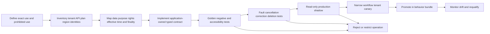

# Adapter Qualification and Lifecycle Playbooks

**Research/access date:** 2026-08-31  
**Scope:** HRIS/HCM, ATS, assessment/interview, calendar, identity, payroll/benefits handoff, e-signature, background-check handoff, case/workflow, notification and observability adapters

## Production decision

Treat every provider as a versioned source or effect boundary, never as a generic “HR tool.” A successful API call proves one protocol result. It does not prove correct person/application/employment identity, effective date, human authority, employment-law compliance, assessment validity, fairness, accessibility, consent, delivery, downstream completion or safe retry.

The application owns provider-neutral identity, purpose, policy, human decisions, effect intents and reconciliation. The ATS owns its recruiting records; the HRIS owns its worker/employment facts; assessment and background providers own their result artifacts/status; an e-sign provider owns agreement state; IAM owns accounts/access; payroll and benefits systems own their processing results. The agent may read bounded projections, draft, coordinate and stage approved operations. It does not turn a provider score/status into a hiring, firing, promotion, pay, accommodation or adverse decision.

## Qualification lifecycle



Qualification is per operation and data compartment. An ATS key approved to read requisition metadata is not approved to read demographic answers, download every resume, reject applications or modify offers. A background adapter approved to create a candidate-hosted invitation is not approved to adjudicate a report. A payroll export is not authorization to calculate or release pay.

## Adapter dossier

```yaml
adapter_release: ats-greenhouse-harvest/2.4
owner: team:talent-platform
qualified_at: 2026-08-31T10:00:00Z
refresh_due: 2026-11-29
deployment:
  provider: greenhouse_recruiting
  api_surface: harvest_v1_observed_2026_08_31
  tenant: tenant_acme_prod
  region_or_residency: contract://greenhouse/acme/region
  client_release: hr-adapter-greenhouse/2.4.0
identity:
  candidate: provider_candidate_id
  application: provider_application_id
  requisition: provider_job_id_plus_opening_id
  interview: scheduled_interview_id
  offer: offer_id_and_version_observation
authentication:
  principal: workload:hr-agent-ats-prod
  allowed_operations: [read_job, read_application, read_interview, read_scorecard]
  prohibited_operations: [reject_application, hire_application, update_offer, read_demographic_answers]
purpose_and_data:
  purpose_profile: recruiting-evidence-support/11
  allowed_fields: policy://ats-projection/recruiting-evidence-v7
  forbidden_compartments: [demographic_monitoring, accommodation_medical, background, employee_relations]
versions_and_freshness:
  source_version: updated_at_plus_activity_id_plus_object_digest
  webhook: authenticated_hint_only
  incremental_cursor: activity_feed_cursor
  overlap: PT24H
  full_reconciliation: daily
effects:
  none: read_only_qualification
limits:
  pagination: follow_link_header
  rate: measure_headers_and_tenant_plan
  attachment_urls: ephemeral_download_to_governed_store_if_purpose_allows
conformance_report: artifact://adapter-tests/ats-greenhouse/2.4
known_limitations:
  - endpoint permission can expose all data in the endpoint
  - provider documentation and sandbox do not prove production tenant configuration
rollback: ats-greenhouse-harvest/2.3
approvals: [hr-owner://17, privacy://81, security://210, accessibility://44]
```

For continuously delivered SaaS, pin the official API version when one exists, exact observation date, endpoint/OpenAPI or documentation digest, client release, tenant/plan/configuration, contract-test corpus and observed behavior fingerprint. A marketing product name or `latest` alias is not a release.

## Provider-neutral identity and version contract

| Object | Stable application identity | Provider/source version evidence | Never collapse into |
|---|---|---|---|
| Person/candidate | `person_id`, ATS-scoped `candidate_id` plus reviewed links | Provider ID, merge/history event, observed version/digest | Name, email or similarity match |
| Application | `application_id` for candidate × requisition/path | ATS application ID, stage/status version, activity frontier | Candidate or requisition |
| Requisition/opening | `requisition_id` plus opening identity | Approval/job/opening versions, open/close history | Job template or position |
| Interview | `interview_id` plus round/plan version | ATS scheduled interview ID, calendar event ID/change key, participant response state | Calendar meeting or scorecard |
| Assessment | Definition/version and administration instance IDs | Vendor test ID/version, instance ID, accommodation route, completion/result version | Score, candidate or human decision |
| Offer | `offer_id` and immutable offer version | ATS/HRIS document/template/version, approver packet digest, e-sign agreement/version | Acceptance, employment or start event |
| Worker/employment/assignment | Separate worker, employment and assignment IDs | HRIS resource/event/time-slice/version, correction and effective interval | Person, position or account |
| Position/manager/entity/location | Independent effective-dated IDs and relationships | Source time slice/sequence and recorded time | Display name or present-day hierarchy |
| Policy/notice/consent | Approved immutable artifact IDs and states | Owner, version, purpose, jurisdiction, effective/expiry/revocation time | Prompt text or checkbox Boolean |
| Decision/approval/effect | Separate human decision, exact-payload approval and semantic operation IDs | Actor/authority/evidence version; provider resource/receipt/read-back | Model proposal, HTTP request or provider acceptance |

Every read exposes `source_system`, `tenant`, stable provider ID, application ID mapping, source version, effective interval when applicable, observed/recorded time, purpose/field decision and freshness/coverage warnings. Every correction appends lineage; it does not rewrite the fact used by an old decision.

## Typed read contract

```yaml
read_request:
  request_id: read_01K...
  operation: ats.read_application_projection.v3
  tenant_id: tenant_acme
  purpose_id: interview_evidence_support_2026
  actor_or_workload: workload:hr-agent-ats-prod
  identity:
    candidate_id: candidate_202
    application_id: application_991
    requisition_id: requisition_80
  expected_source_version: ats://application/991@v44
  effective_as_of: 2026-08-31
  fields_policy: ats-projection/interview-evidence-v7
  adapter_release: ats-greenhouse-harvest/2.4
  budgets: {pages: 4, records: 100, bytes: 5000000, wall_time: PT20S}
```

```yaml
read_receipt:
  request_id: read_01K...
  state: complete       # complete | partial | failed | cancelled | unknown
  provider_request_ids: [provider_551]
  source_version: ats://application/991@v44
  observed_at: 2026-08-31T10:00:03Z
  effective_as_of: 2026-08-31
  pages: {consumed: 2, next: null, provider_complete: true}
  coverage: {watermark: activity/551, safe_to_advance: true}
  artifact_refs: [artifact://projections/application_991/v44]
  omitted_fields: [demographic_answers, medical_accommodation, background_report]
  warnings: []
```

An empty page, HTTP `200`, webhook or provider “current” label is not complete unless page/field coverage, identity, source version, effective time and permission semantics are proven. Cursor advancement is a durable decision after validation and overlap/full reconciliation.

## Representative provider qualification matrix

These official surfaces demonstrate different mechanics. They are not endorsements and do not establish local employment-policy or legal fitness:

| Surface observed on 2026-08-31 | Useful mechanic | Hard limitation and required qualification |
|---|---|---|
| Workday Events REST APIs | Business-process event IDs/status, effective/due/completed dates, steps and cancellation/rescind operations | Public docs are dynamically delivered and exact services depend on tenant/release/configuration; test the contracted tenant, business process, security domain, event history, rescind/correction and read-back |
| SAP SuccessFactors OData v2 effective-dated entities | `asOfDate`, `fromDate`/`toDate`, time slices, sequences and effective-dated navigation | Defaults can return today's effective record; nonstandard date parameters and `$expand` semantics can surprise; test retroactive/future/same-day changes and never infer historical completeness from current query |
| SAP CompoundEmployee API, documented as 1H 2026 | Approved employee master-data extraction with full/snapshot/effective-dated and period-delta modes for payroll/benefits replication | SOAP query API, supported fields and auditing/config matter; effective delta includes retroactive/future changes while period delta can omit future slices until relevant; consumer must preserve time slices and reconcile |
| Oracle Fusion Cloud HCM Workers/Relationships/Assignments REST `11.13.18.05` | Explicit worker relationship/assignment resources and as-of date behavior; assignment create/update/end actions | Resource path version is not proof of tenant quarterly-update behavior; current date may default; qualify `effective-Of`, privileges, ETags/versioning, correction/end action and audit/read-back |
| Greenhouse Harvest API | Candidate/application/job/interview/offer/scorecard reads/writes, endpoint permissions, Link pagination, rate headers and change log | An endpoint key can access all data in that endpoint; attachment URLs expire; fields/features are plan-specific; newest documented changes included 2025 fields—pin observed behavior and restrict operations |
| Greenhouse recruiting webhooks | Signed event hints, delivery identity and retries | Not an ordered complete ledger; authenticate/dedupe/persist, reread Harvest, maintain gap scan/full reconciliation and never treat stage event as human decision |
| Greenhouse Assessment Partner API | Test definition/instance distinction, explicit send/status mechanics; Jul 2025 added candidate/application IDs | Provider score/result and API completion do not establish job-related validity, fairness or accessibility; qualify test/version/accommodation/notice, result history and manual alternative; no automatic advance/reject |
| Microsoft Graph calendar v1.0 | Stable event resources, cancellation/update lifecycle and `transactionId` for avoiding duplicate create retries | Event creation/acceptance response is not attendance or interview completion; test delegated permissions, organizer/attendee identity, time zones/DST, recurrence, updates/cancellation and read-back |
| Microsoft Graph `sendMail` v1.0 | Delegated/application `Mail.Send`, Sent Items behavior and asynchronous acceptance | `202 Accepted` explicitly does not mean processing or delivery completed; stage sensitive communications, use a visible authorized sender and reconcile only claims the provider can prove |
| Slack `chat.postMessage` | Channel/message identity and response object for a posted chat message | Channel membership, retention, edits/deletion and rate limits are workspace-specific; no deduplication, confidential receipt, acknowledgement or durable records status is assumed |
| SCIM 2.0 RFC 7643/7644 plus RFC 9865 and RFC 9967 updates | User/enterprise attributes, conditional operations, cursor pagination and security-event profile | Provider support is discoverable/variable; `active` and manager attributes do not define HR employment or access policy; IAM owns entitlements and account outcome, with current permission applied on every page/cursor |
| Microsoft Entra HR-driven provisioning | HR facts can feed joiner/mover/leaver provisioning workflows | Product mapping/provisioning is an IAM operation; HR publishes minimal signed lifecycle facts and reconciles acknowledgement but cannot grant/revoke or bypass IAM policy |
| Checkr API v1 | Credentialed/staging integration, candidate-hosted invitation, report/webhook status and POST idempotency-key support | Work location affects provider compliance flow; invitation/report result is not employer adjudication; preserve authorization and human-owned pre-adverse/dispute/adverse process where applicable, minimize report access and test webhook/read-back |
| Acrobat Sign REST API v6 and webhooks | Agreement ID/status/history, webhook events and versioned document retrieval | Webhook payload details can be omitted by size/processing; creation/sent/signed status does not prove correct terms, signer authority or employer acceptance; reread agreement/version and validate signed artifact/audit trail |
| Jira Cloud REST API v3 issues | Mutable field/permission-aware case/task effects and changelog | Create metadata and schemas evolve; bulk can partially succeed; discover fields under the production identity, use one semantic operation marker and reconcile before retry |
| OpenTelemetry spec 1.60.0 / semantic conventions 1.44.0 | Trace context and vendor-neutral metrics/traces/logs | GenAI conventions moved to a separate repository and version-selection work is development status; pin emitted schemas and do not export HR content or use telemetry as employment truth |

Commercial assessment, interview-analysis, payroll, benefits and HCM AI features often lack a complete public API/validation contract. Do not invent one. Require tenant evidence for feature/construct/version, local job-related validation, subgroup/error results, accessibility and accommodation, notice/contest, input/output fields, model/data use, audit/history, deletion/export, API identity/finality, operational limits, support, change notice and exit. Opaque emotion, personality, disability, health, family, union, religion, political-belief or “culture fit” inference is rejected.

## External effect contract

Persist the exact intent before dispatch:

```yaml
effect_intent:
  effect_id: effect_01K...
  semantic_key: tenant_acme/application_991/offer_v4/esign_send
  effect_type: send_approved_offer_for_signature
  case_id: offer_case_71
  case_state_version: 27
  person_id: person_73
  candidate_id: candidate_202
  application_id: application_991
  offer_id_and_version: offer_71/v4
  template_and_document_digest: [offer-template/18, "sha256:..."]
  human_decision_id: decision_301
  approval_id: approval_901
  notice_consent_refs: [notice_301]
  policy_release: offer-policy/11
  adapter_release: acrobat-sign-v6/4.2
  destination_ref: esign-account://acme-prod
  payload_digest: "sha256:..."
  deadline: 2026-09-02T12:00:00Z
```

Normalize result as `CONFIRMED`, `DEFINITIVE_FAILURE` or `UNKNOWN`. Timeout after upload, connection loss after commit, asynchronous acceptance without durable remote identity, partial bulk response, cancellation race or unreadable webhook is `UNKNOWN`. Reconciliation returns `found_one`, `found_multiple`, `not_found_after_consistency_window`, `still_indeterminate` or `lookup_unsupported`. Retry only after proven absence and revalidation of identity, source/policy, consent/notice, decision, approval, effective clock, payload digest and cancellation. `found_multiple` is an incident.

For each material effect, test cancel-before-dispatch, cancel-after-commit, late success, revoke/expire approval, rescind offer, candidate withdrawal, worker correction, deletion during wait, wrong tenant/legal entity, stale effective time, provider 409/412/429/5xx, receipt loss, remote edit and provider outage. Compensation is a new authorized operation—never an assumed inverse.

## Worked flow: candidate and interview evidence

1. ATS webhook creates a hint; ingestion authenticates/deduplicates it and Harvest reread produces candidate/application/requisition versions. Identity ambiguity stops the flow.
2. Deterministic gates resolve approved requisition, job analysis, selection procedure/interview kit version, reviewer eligibility, notice and accommodation/manual path. Demographic, medical, background and unrelated personnel compartments are excluded.
3. A bounded model drafts evidence-linked questions or summarizes independent scorecard observations. It cannot rank, infer personality/protected traits, fill missing scores or select/reject.
4. Calendar adapter stages an invitation using exact application/interview identity, time zone, participants and transaction ID. Read-back verifies one event and cancellations/changes remain linked.
5. Interviewers record independent observations against the approved rubric before viewing aggregate/model synthesis. An authorized human owns stage/selection decision with evidence and dissent.
6. Candidate correction, accessibility failure, rubric change or missing reviewer evidence reopens/quarantines the case. The same cohort is not silently migrated to a new procedure.

## Worked flow: assessment and offer

1. Assessment owner admits exact construct/test/vendor/version for one job/cohort with validation, fairness, accessibility, notice, accommodation and retention evidence.
2. Candidate/application IDs bind one assessment instance. Vendor completion triggers reread; raw score and metadata remain provider evidence, not a decision.
3. Authorized reviewers consider the approved evidence protocol and record an independent human decision. The model may draft a reason/communication only from selected approved reason codes and evidence.
4. HR creates immutable offer version and exact approval packet. E-sign adapter sends only that digest/template/version to verified recipients.
5. Agreement webhook is a hint. Status/history/document version and audit trail are reread. `SIGNED` does not itself create employment; HR/HRIS business process confirms accepted offer/start state.
6. Revision, expiry, decline or rescission appends a new offer/effect state, cancels/reconciles downstream operations and preserves as-known history.

## Worked flow: onboarding and worker change

1. Accepted offer and HRIS business process produce verified person/worker/employment/assignment/position/entity/location/effective versions. Rehire, concurrent employment and global transfer remain distinct.
2. Policy engine deterministically derives required owner tasks. The model may explain or draft, never decide eligibility, pay, benefits, access, accommodation or manager authority.
3. Payroll/benefits receive a minimal versioned handoff or provider-native approved extract. Their acceptance is not enrollment/payroll completion; reconcile their own status/receipt and route exceptions to the domain owner.
4. IAM receives a signed minimal lifecycle fact. IAM maps policy and executes/proves accounts and entitlements; HR records acknowledgement only.
5. A mover/backdated correction creates new effective-dated assignment and manager relationships. Recompute affected future tasks, invalidate stale approval, and issue authorized corrections instead of overwriting history or blindly undoing downstream effects.

## Worked flow: offboarding and reversal

1. Verify authorized human decision and HRIS termination/end event, employment/assignment identity, legal entity, effective instant/time zone, reason-code visibility and hold/retention requirements.
2. Build a deterministic effective-time task graph for IAM, payroll/benefits, facilities/assets and communications. Each owner system retains its authority.
3. Reserve semantic operations and dispatch through narrow adapters. Queue scheduling protects the effective deadline and reconciliation capacity.
4. Unknown IAM, payroll or communication outcome blocks “complete.” Query by stable source/effect identity; never recreate by email or blind retry.
5. Reversal/backdated correction appends HRIS state, fences outstanding work, reconciles late commits and asks each owner for a current-policy correction. It does not simply run an inverse workflow.
6. Close only when the declared oracle passes or an explicit incident/manual exception owns every unresolved postcondition.

## Qualification and failure matrix

| Test | Required evidence | Promotion blocker |
|---|---|---|
| Service identity and field rights | Positive/negative operation, tenant, entity, person and compartment tests | Only admin credentials or UI behavior tested |
| Identity/version/effective time | Rehire, merge, concurrent assignment, correction, future/backdated and same-day sequence fixtures | Email/current row is used as identity/history |
| Incremental plus full reconciliation | Boundary duplicate/gap/reorder/delete, cursor expiry and full inventory | Cursor advances on empty/partial/schema-unknown result |
| Human authority | Decision/approval role, delegation, recusal, expiry, evidence and exact payload tests | Provider/model score or status commits decision |
| Fairness/accessibility | Local procedure/version/cohort, error/subgroup/intersection, assistive-tech and equivalent-path evidence | Vendor badge/audit alone or inaccessible manual path |
| Purpose/privacy/retention | Field map, provider/model/log copies, correction/deletion/hold/exit traversal | Data use, deletion, subprocessor or support access is unprovable |
| Effect ambiguity | Commit-then-timeout, late success, cancel race, lookup window and duplicate/conflict | Material effect has no semantic key/read-back |
| Drift/upgrade/rollback | Spec/schema/field/config diff, old/new replay, active-case/cohort/effect fencing | Candidate silently reinterprets old decisions or duplicates effects |
| Load/outage | Throttle, webhook gap, seasonal plus recovery surge, noisy tenant and reviewer/downstream capacity | Live safety work starves or degraded coverage appears complete |

## Exercises and promotion evidence

1. **ATS scope escape:** use a key whose endpoint includes demographic fields. Prove the projection blocks them before storage/context and the production principal cannot call forbidden operations.
2. **Effective-dated mover:** add future assignment, retroactive correction and two same-day sequences. Prove historical/as-known answers, manager/entity/location policy, downstream corrections and no duplicate effect.
3. **Assessment accessibility:** make the vendor route inaccessible and late. Prove no penalty, equivalent approved path, no automatic stage result and accurate cohort/version evidence.
4. **Lost offer receipt:** commit e-sign agreement then drop the response while the candidate withdraws. Prove `UNKNOWN`, cancellation fencing, one remote agreement, reconciliation and authorized void/correction.
5. **Background boundary:** complete a candidate-hosted invitation with a non-clear provider result. Prove restricted access, no automated decision/status change, accountable review/contest steps and minimal downstream copy.
6. **Recovery storm:** withhold a week of HRIS/ATS events, rotate schema, throttle IAM/payroll and preserve live termination reversals. Prove coverage closure, bounded drain, fairness, no blind replay and no identity/retention escape.

The release packet contains the adapter dossier, production-principal permission export, tenant/plan/region/config fingerprint, provider/source documentation and access date, field/data-flow map, local legal/policy/fairness/accessibility decisions, contract/fault/load results, sandbox-versus-production differences, known limitations, runbook/support contacts, drift alerts, rollback and exit/deletion proof.

## Primary references and current limitations

- [Greenhouse Harvest API](https://docs.greenhouse.io/harvest.html), [recruiting webhooks](https://docs.greenhouse.io/webhooks.html), and [Assessment Partner API](https://docs.greenhouse.io/assessment.html) — current public endpoint, permission, pagination, webhook and assessment mechanics; plan and tenant behavior still require qualification.
- [Workday Events REST APIs](https://developer.workday.com/documentation/GUID-0df5cd55-e578-43d3-b58f-ae98825d1df0-enHYPHENus) — official dynamically delivered documentation; exact service/release/tenant configuration was not publicly verifiable from this research environment.
- [SAP effective-dated OData queries](https://help.sap.com/docs/successfactors-platform/sap-successfactors-api-reference-guide-odata-v2/effective-dated-query-in-odata) and [CompoundEmployee API 1H 2026](https://help.sap.com/docs/successfactors-employee-central/employee-central-compound-employee-api/compoundemployee-api-general-information-about-full-snapshot-and-delta-transmission-modes) — provider-specific effective-time and replication semantics.
- [Oracle Fusion Cloud HCM assignment endpoints](https://docs.oracle.com/en/cloud/saas/human-resources/farws/api-workers-work-relationships-assignments.html) — current public `11.13.18.05` resource surface; quarterly tenant configuration and privileges remain deployment-specific.
- [Microsoft Graph create event v1.0](https://learn.microsoft.com/en-us/graph/api/calendar-post-events?view=graph-rest-1.0), [event resource](https://learn.microsoft.com/en-us/graph/api/resources/event?view=graph-rest-1.0), and [`sendMail`](https://learn.microsoft.com/en-us/graph/api/user-sendmail?view=graph-rest-1.0) — event lifecycle/client transaction identity and asynchronous mail acceptance, not interview completion or delivery.
- [Slack `chat.postMessage`](https://api.slack.com/methods/chat.postMessage) — representative chat-post response mechanics; workspace policy and read/retention evidence remain deployment-specific.
- [SCIM RFC 7643](https://www.rfc-editor.org/info/rfc7643/), [RFC 7644](https://www.rfc-editor.org/info/rfc7644/), [RFC 9865](https://www.rfc-editor.org/info/rfc9865/) and [RFC 9967](https://www.rfc-editor.org/info/rfc9967/) — the 2015 core/protocol now have 2025/2026 updates; deployed providers may not support either update.
- [Microsoft Entra HR-driven provisioning](https://learn.microsoft.com/en-us/entra/identity/app-provisioning/what-is-hr-driven-provisioning) — representative HR-to-IAM integration; IAM authority remains separate.
- [Checkr API v1](https://docs.checkr.com/) — representative credentialing, staging, invitation, webhook and idempotency mechanics; employer process and jurisdiction-specific duties require qualified local owners.
- [Acrobat Sign API usage](https://developer.adobe.com/acrobat-sign/docs/overview/developer_guide/apiusage), [agreement events](https://developer.adobe.com/acrobat-sign/docs/overview/acrobat_sign_events/webhookeventsagreements), and [best practices](https://developer.adobe.com/acrobat-sign/docs/overview/developer_guide/bestpractices) — REST v6 agreement/status/webhook/version behavior and documented payload/polling limits.
- [Jira Cloud REST API v3 issues](https://developer.atlassian.com/cloud/jira/platform/rest/v3/api-group-issues/) — representative case/task effects with tenant-specific schema and permissions.
- [OpenTelemetry specifications](https://opentelemetry.io/docs/specs/) and [semantic conventions](https://opentelemetry.io/docs/specs/semconv/) — specification 1.60.0 and semantic conventions 1.44.0 shown at research time; GenAI conventions and version selection remain moving surfaces.

Public documentation cannot prove production availability, complete history, local validity/fairness/accessibility, data residency, audit support, contractual rights, deletion/backup behavior, support SLOs or effect finality for a particular tenant. Obtain live-tenant evidence and qualified HR, assessment, accessibility, privacy, security, labor-relations and employment-law review. This guide is an engineering qualification method, not employment-law advice.

## Related guides

- [Reference architecture, runtime, models, and integrations](02-reference-architecture-runtime-models-and-integrations.md)
- [Identity, lifecycle state, context, memory, and orchestration](03-identity-lifecycle-state-context-memory-and-orchestration.md)
- [Requisitions, recruiting, interviews, and human decisions](04-requisitions-recruiting-interviews-and-human-decisions.md)
- [Onboarding, offboarding, tools, effects, and recovery](05-onboarding-offboarding-tools-effects-and-recovery.md)
- [Sensitive records, security, privacy, retention, and deletion](06-sensitive-records-security-privacy-retention-and-deletion.md)
- [Fairness, accessibility, evaluation, and observability](07-fairness-accessibility-evaluation-and-observability.md)
- [Deployment, scale, incidents, and governed evolution](08-deployment-scale-incidents-and-governed-evolution.md)
