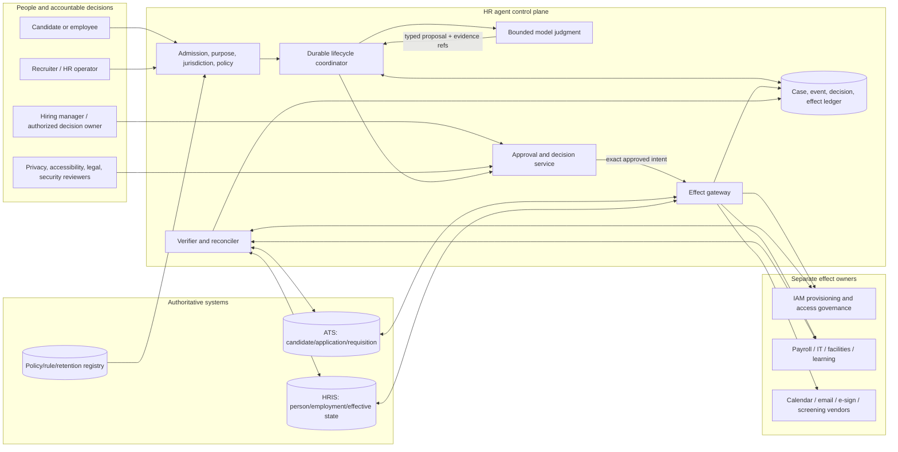

# Production HR and Talent Operations Agent Blueprint

> **Research date:** 2026-08-31  
> **Status:** Research-backed production design; employment counsel, privacy, accessibility, labor relations, security, and HR owners must validate each deployment jurisdiction and use case  
> **Scope:** Requisitions, candidate and worker identity, recruiting evidence, interview coordination, sensitive employment records, onboarding/offboarding task coordination, HRIS/ATS integration, reconciliation, and governed workforce-scale operation

## Bottom line

Build this agent as a **bounded coordinator inside a deterministic employment workflow**, not as an automated decision maker. It may assemble evidence, detect missing or inconsistent records, draft content, schedule approved steps, and coordinate reversible tasks. It must not autonomously hire, reject, fire, promote, demote, set compensation, rank people for consequential decisions, decide accommodations, or make another high-impact employment decision.

The useful production shape is one durable coordinator with typed model workers, jurisdiction- and policy-aware context, an application-owned case ledger, exact approval seams, narrow adapters, and reconcilers. A rules engine owns stable policy. An authorized human owns every consequential employment decision. IAM implements account and entitlement changes from authenticated lifecycle events. Legal gives legal advice; compliance performs independent audit.

## Who this is for

- HR platform and enterprise architects defining an HR automation boundary;
- recruiting operations, people operations, HRIS, privacy, accessibility, security, and reliability engineers;
- industrial-organizational psychologists and assessment owners validating selection procedures;
- engineering and product teams evaluating an LLM or agent feature in an ATS or HRIS;
- operators who need a staged path from read-only assistance to reliable, governed coordination.

This is an engineering reference, not legal advice and not a universal HR policy. Employment, labor, privacy, accessibility, works-council, retention, notice, audit, and contestability obligations vary by jurisdiction, employer, worker type, and use.

## Owned boundary and required separation

| Concern | This blueprint owns | Required handoff |
|---|---|---|
| Candidate and worker lifecycle | Identity resolution, employment-state evidence, effective dates, case coordination | HRIS remains authoritative for employment state |
| Requisitions and hiring workflow | Intake, completeness, policy consistency, routing, interview evidence, approval package | Authorized hiring owner makes selection decision |
| Onboarding and offboarding | Task plan, prerequisites, reminders, completion evidence, exceptions | IAM changes access; IT and facilities perform their effects |
| Sensitive records | Purpose-scoped projections, compartmentation, retention/deletion orchestration | Privacy/legal owners define obligations and holds |
| Fairness and accessibility | Measurement, test design, barrier detection, accommodation path, release gates | Qualified assessment, accessibility, HR, and legal owners determine acceptability |
| Generic cases | Employment-specific state and controls | [Back-office workflow](../back-office-workflow-agent/README.md) owns reusable case mechanics |
| Personal delegation | Organizational HR process only | [Executive operations](../executive-operations-agent/README.md) owns a principal's personal delegation |
| Access governance | Emit authenticated, minimal JML facts and reconcile acknowledgements | [IAM](../identity-access-governance-agent/README.md) decides and executes access changes |
| Advice and assurance | Evidence package and operational controls | Legal interprets law; [compliance audit](../compliance-audit-agent/README.md) independently tests controls |

## Definition of done

The agent has finished only when the authoritative workflow says the bounded operation is terminal and the completion oracle passes. A polished message is not completion.

For a representative new-hire coordination run, done means:

1. the approved requisition, selected candidate, authorized human decision, accepted offer, employment identity, work location, legal entity, worker type, and effective date are bound to immutable source versions;
2. required jurisdiction/policy checks and candidate notices are recorded;
3. each downstream task has a stable semantic identity, owner, deadline, and status;
4. IAM, payroll, IT, facilities, learning, and manager tasks are requests or acknowledgements—not falsely reported as completed from dispatch alone;
5. duplicates, stale effective dates, rehiring, rescinded offers, late terminations, and partial completion are reconciled;
6. sensitive artifacts are stored in the correct compartment with applicable retention and deletion rules;
7. the run closes with evidence, unresolved exceptions, and an accountable human owner.

## Decide whether an agent belongs

| Workload shape | Best default | Reason |
|---|---|---|
| Stable requisition routing, approvals, timers, and required fields | BPM/workflow plus rules | Cheaper, predictable, and auditable |
| FAQ or policy lookup with no personalized decision | Permission-aware retrieval | A model-directed action loop adds little value |
| Structured HRIS-to-IAM lifecycle synchronization | Event-driven integration or managed provisioning | Identity effects need deterministic mappings and reconciliation |
| Interview scheduling with complete constraints | Constraint solver and calendar APIs | Deterministic scheduling is easier to verify |
| Resume parsing into a fixed schema | Parser/OCR plus validation; model only for unresolved variation | Keep extraction separate from selection |
| Variable evidence, ambiguous exceptions, and changing task order | Workflow plus bounded model worker | Semantic judgment can reduce operator effort while workflow retains control |
| Open-ended cross-system coordination with incomplete evidence | Agent inside a durable workflow | Justified only after beating the deterministic baseline |

Do not build the agent when the proposed value is simply ranking people faster, when a vendor cannot expose its features and validation evidence, when affected people lack an accessible alternative or correction path, when the employer cannot separate protected/medical data, or when there is no accountable human with time and authority to review evidence independently.

## Non-negotiable autonomy boundary

| Level | Permitted capability | Production posture |
|---|---|---|
| **H0 — Observe** | Read a purpose-limited projection, summarize, identify missing/conflicting evidence | First safe target after privacy and access tests |
| **H1 — Propose** | Draft a requisition, interview kit, communication, task plan, or evidence summary | Default useful launch |
| **H2 — Stage** | Create a reversible draft or pending task with exact target and expiry | Only after policy, accessibility, and egress tests |
| **H3 — Approved coordination** | Execute an exact, low-impact administrative effect after authenticated approval and commit-time revalidation | Mature, narrow action classes only |
| **H4 — Pre-authorized administration** | Perform low-impact, reversible reminders or task bookkeeping within deterministic limits | Optional after strong repeated evidence |
| **H5 — Employment decision** | Hire, reject, fire, promote, demote, set pay, discipline, decide accommodation, or materially rank a person | **Prohibited; human-owned** |

Model output is never an approval, policy, legal interpretation, employment decision, medical conclusion, or proof of effect.

## Representative workflows

- qualify and open an approved requisition;
- assemble a job-related, accessible interview plan and evidence rubric;
- detect missing application evidence without inventing facts;
- coordinate interview panels, candidate notices, and accommodation routing;
- summarize evidence by rubric while hiding the model recommendation until independent scoring is recorded;
- produce an offer approval package after a human selection decision;
- create a new-hire task graph and reconcile downstream completion;
- process a future-dated move, leave, contract end, termination, rescission, or rehire;
- receive deletion/correction requests, apply holds, and prove propagation;
- detect policy-version inconsistency, integration drift, stale cases, duplicate identities, and unfair or inaccessible outcomes.

### Policy Q&A and employee case support

Use permission-aware search/template retrieval for ordinary policy questions. A bounded model may explain only cited clauses from the effective policy release and must expose jurisdiction, worker type, location/entity, effective date, source link and uncertainty. It does not decide personal eligibility, accommodation, leave, pay, discipline, grievance, investigation or legal rights. Missing applicability facts, conflicting policies or an individual outcome turns the interaction into a typed HR case with purpose-limited evidence, an accessible confidential channel, an accountable authorized human owner, clocks, correction/contest path and no model-owned decision. Do not let a chat transcript become the personnel record or hidden manager guidance.

## System context and trust boundaries

Authority changes hands only at admission, human decision/approval, effect commit, and downstream acknowledgement. The model remains in the proposal plane.

## Concise component map

| Component | Responsibility | Must not become |
|---|---|---|
| Admission gateway | Authenticate actor, purpose, tenant, workforce scope, jurisdiction, deadline, and authority ceiling | A chat endpoint accepting arbitrary HR requests |
| Context compiler | Build a minimal, versioned, redacted evidence bundle | A search over every employee record |
| Durable coordinator | Own lifecycle state, timers, retries, cancellations, and human waits | Provider conversation state |
| Model worker | Extract, compare, summarize, draft, and propose with citations and abstention | Decision authority or system of record |
| Rule/policy service | Apply effective-dated deterministic requirements | Prompt prose silently edited in production |
| Decision/approval service | Capture independent human decision, exact scope, reason, expiry, and conflicts | “Looks good” in chat |
| Effect gateway | Revalidate and dispatch narrow commands with stable operation IDs | Generic HRIS administrator tool |
| Reconciler | Read real state and resolve duplicate, late, missing, or unknown effects | Blind retry loop |
| Evidence service | Preserve minimum reconstructable provenance under field-level controls | Full prompt/transcript archive |

## Architecture and technology selection

| Path | Choose when | Reject when |
|---|---|---|
| Custom controller + database + queue | One or two short, low-write workflows; strong in-house control-plane capability | Long human waits or many partial external effects already dominate |
| Agent SDK/framework | Fast bounded-loop development, typed tools, tracing, and structured output are the primary need | Framework state is being mistaken for HR workflow durability or authorization |
| Durable workflow/case engine + model workers | Multi-day recruiting/onboarding, human decisions, timers, cancellation, replay, and reconciliation are core | Team cannot operate/version the engine and workload is still a read-only pilot |
| Hybrid, recommended | Existing ATS/HRIS workflow remains authoritative; durable coordinator adds cross-system semantic work and model workers | No reliable APIs, status queries, or evidence ownership exist |

Start with a modular monolith: TypeScript/Node.js or Python for model/adapters, PostgreSQL for application-owned control records, a bounded queue, object storage for encrypted artifacts, and OpenTelemetry. Add a durable workflow engine only when waits, recovery, and effect ambiguity justify it. JVM or .NET is often preferable when the existing HR platform, policy stack, and operations team already standardize there. Language choice follows connector parity, durable-runtime support, security libraries, diagnostics, and team ownership—not model popularity.

## Reader path

| Guide | Decision it supports |
|---|---|
| [Workload fit, authority, and staged requirements](01-workload-fit-authority-and-stages.md) | Whether an agent is justified and what Stage 0–6 must prove |
| [Reference architecture, runtime, models, and integrations](02-reference-architecture-runtime-models-and-integrations.md) | How to select a controller, workflow engine, model strategy, and third-party boundary |
| [Identity, lifecycle state, context, memory, and orchestration](03-identity-lifecycle-state-context-memory-and-orchestration.md) | What is authoritative and how long-running work resumes safely |
| [Requisitions, recruiting, interviews, and human decisions](04-requisitions-recruiting-interviews-and-human-decisions.md) | How evidence enters hiring without delegating the decision |
| [Onboarding, offboarding, tools, effects, and recovery](05-onboarding-offboarding-tools-effects-and-recovery.md) | How approved lifecycle facts become reconciled downstream work |
| [Sensitive records, security, privacy, retention, and deletion](06-sensitive-records-security-privacy-retention-and-deletion.md) | How to compartment sensitive employment data and meet lifecycle obligations |
| [Fairness, accessibility, evaluation, and observability](07-fairness-accessibility-evaluation-and-observability.md) | How to test outcomes, barriers, reliability, and release safety |
| [Deployment, scale, incidents, and governed evolution](08-deployment-scale-incidents-and-governed-evolution.md) | How to operate, recover, scale, control cost, and change behavior safely |
| [Adapter qualification and lifecycle playbooks](09-adapter-qualification-and-lifecycle-playbooks.md) | How to qualify HRIS/HCM, ATS, assessment, calendar, IAM, payroll/benefits, e-sign, background, workflow and telemetry adapters and run realistic lifecycle flows |

## Stage 0–6 roadmap summary

| Stage | Deliverable | Exit evidence |
|---|---|---|
| **0 — qualify** | Deterministic baseline, decision inventory, jurisdiction/data map, prohibited-use list | Model-directed work has measured benefit and no hidden decision authority |
| **1 — bounded loop** | Read-only/proposal loop, typed tools, citations, abstention, hard budgets | Representative offline tasks pass with no writes or policy bypass |
| **2 — useful MVP** | Real ATS/HRIS projections, context builder, drafts, approval seams, accessible human workflow | Shadow pilot beats baseline without subgroup, privacy, or accessibility regression |
| **3 — reliable v1** | Durable state, compaction, idempotent effects, receipts, reconciliation, cancellation, vendor contracts | Crash/duplicate/stale/partial-effect tests converge to correct state |
| **4 — production** | Identity, tenancy, least privilege, SLOs, tracing, release gates, rollback, incident runbooks | Threat, privacy, fairness, accessibility, recovery, and kill drills pass |
| **5 — scale** | Admission control, bounded queues/workers, tenant isolation, capacity/cost plan, DR, degradation | Peak and recovery load meet SLOs without widening authority |
| **6 — evolve** | Failure mining, drift monitoring, reviewed feedback, behavioral manifests, upgrade/deprecation gates | Every behavior change is evaluated, canaried, reversible, and evidence-backed |

## Top production risks and mandatory stops

Stop or escalate when identity is ambiguous; an applicable jurisdiction or policy cannot be resolved; required notice/consent/accommodation is missing; protected or medical data crosses its compartment; a reviewer lacks authority or independence; evidence conflicts; a decision rubric changed mid-cohort; a vendor version/feature is unapproved; an effect is `unknown`; a termination/move effective time is stale; a fairness/accessibility hard gate fails; or a candidate/employee contests the record.

Other dominant risks are automation bias, proxy discrimination, inaccessible assessments, selection-procedure drift, duplicate person/employment identities, premature access removal, failed revocation acknowledgement, offer/termination rescission races, excessive trace capture, and silent webhook loss.

## Refresh triggers

Review immediately when an employment/AI/privacy/accessibility law or regulator guidance changes; the EU AI Act timeline or high-risk guidance changes; a jurisdiction is added; an ATS/HRIS/assessment/background-check/model provider changes API, subprocessor, retention, or model behavior; an employment policy or job analysis changes; a disparity or accessibility signal appears; an incident or contest reveals a new failure; or authority expands. Otherwise review quarterly for consequential-selection support and at least semiannually for administrative-only use.

## Evidence and canonical dependencies

The dated [research packet](../../research/packets/hr-talent-operations-agent-blueprint.md) records claims, contradictions, limitations, and refresh conditions. Reusable mechanics live in:

- [Cross-cutting blueprint controls](../../research/packets/agent-blueprint-cross-cutting-controls.md)
- [Agent state and event contracts](../../runtime/agent-state-and-event-contracts.md)
- [Durable execution](../../runtime/durable-execution.md)
- [Idempotency and side effects](../../reliability/idempotency-and-side-effects.md)
- [Tool contracts](../../tools/tool-contracts.md)
- [Context engineering](../../context-memory/context-engineering.md)
- [Memory architecture](../../context-memory/memory-architecture.md)
- [Prompt injection and untrusted data](../../security/prompt-injection-and-untrusted-data.md)
- [Permissions, sandboxing, and secrets](../../security/permissions-sandboxing-and-secrets.md)
- [Trajectory and reliability evaluation](../../evaluation/trajectory-and-reliability-evaluation.md)
- [Deployment, release, and incident response](../../operations/deployment-release-and-incident-response.md)

## Selected primary sources

- [EEOC Uniform Guidelines Q&A](https://www.eeoc.gov/laws/guidance/questions-and-answers-clarify-and-provide-common-interpretation-uniform-guidelines)
- [U.S. DOJ: Algorithms, AI, and disability discrimination in hiring](https://www.ada.gov/resources/ai-guidance/)
- [NYC automated employment decision tools](https://www.nyc.gov/site/dca/about/automated-employment-decision-tools.page)
- [California employment automated-decision-system regulations](https://calcivilrights.ca.gov/2025/06/30/civil-rights-council-secures-approval-for-regulations-to-protect-against-employment-discrimination-related-to-artificial-intelligence/)
- [EU Artificial Intelligence Act](https://eur-lex.europa.eu/legal-content/EN/TXT/?uri=CELEX:32024R1689)
- [UK ICO audit outcomes for AI recruitment tools](https://ico.org.uk/media/about-the-ico/documents/4031620/ai-in-recruitment-outcomes-report.pdf)
- [NIST AI RMF Core](https://airc.nist.gov/airmf-resources/airmf/5-sec-core/)
- [W3C WCAG 2.2](https://www.w3.org/TR/WCAG22/)
