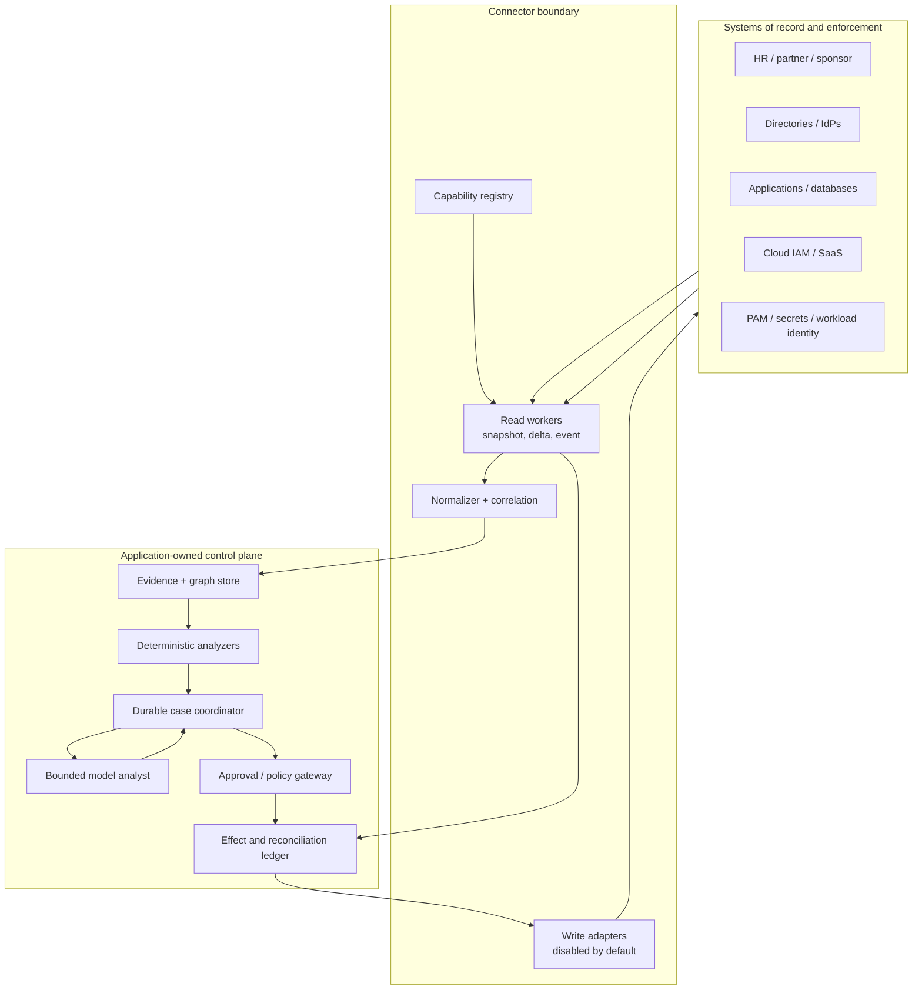
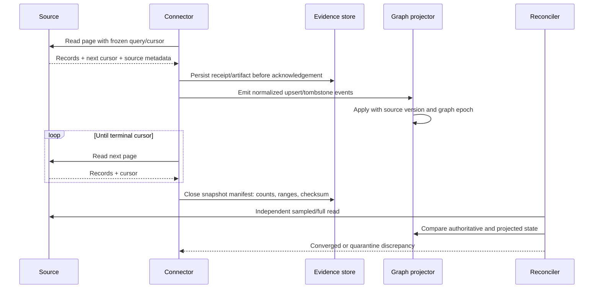

# Reference Architecture, Connectors, and the Entitlement Graph

> **Purpose:** Select the control/runtime split, integrate partial third-party systems safely, and construct explainable effective-access evidence.

## Recommended architecture

Use a **hybrid deterministic control plane**:

- the existing IGA/IAM/PAM product remains the policy and provisioning authority where it already fills that role;
- a durable workflow or explicit database state machine owns long-running cases, timers, approvals, and recovery;
- read adapters acquire source facts and a separate effect gateway performs the few enabled writes;
- a versioned graph projection explains direct, nested, inherited, eligible, active, and effective access;
- deterministic policy queries produce JML, expiry, ownership, and SoD findings;
- one bounded model worker summarizes paths and exceptions into typed outputs.

This does not require a graph database. A relational edge table, recursive query/materialized closure, or the chosen IGA's supported analytics can be sufficient. Adopt a dedicated relationship-authorization system only after benchmarks show that topology, consistency, or query latency requires it. The Zanzibar paper is evidence that relationship authorization can operate at extreme scale, not evidence that every enterprise governance deployment should reproduce Google's design or published measurements.



## Component ownership

| Component | Owns | Must not own |
| --- | --- | --- |
| Source registry | Tenant, endpoint identity, data purpose, schema/profile, owners, credential reference, limits, freshness SLO | Secrets or inferred capabilities |
| Read adapter | Capability discovery, paging/cursor, bounded retry, source receipt, raw artifact reference | Cross-source identity correlation or policy |
| Normalizer | Canonical types, stable source keys, deletion/tombstone semantics, validation | Silent lossy conversion |
| Correlation service | Evidence-backed candidate links and ambiguity state | Choosing an ambiguous person for an effect |
| Evidence store | Immutable source responses/events or governed references and hashes | Derived business decision |
| Graph projection | Versioned nodes, edges, paths, graph epoch, provenance | Claim of completeness without source/freshness state |
| Policy analyzer | Versioned JML, SoD, expiry, ownership, risk, and approval-route evaluation | Natural-language policy invention |
| Model analyst | Evidence-gap triage, explanation, packet preparation, closed-set proposal | Identity proof, authorization, attestation, direct connector access |
| Case coordinator | Lifecycle, deadlines, assignments, retries, cancellation, version pin/migration | Credentials or authorization policy |
| Approval/policy gateway | Current actor/tenant/resource/effect authorization and exact approval | Free-form model judgment |
| Effect gateway | Credential attachment, operation dispatch, receipt normalization | Deciding who deserves access |
| Reconciler | Target read-back, propagation wait, graph/source convergence, exception | Blind retry after an ambiguous response |

## Choose build versus product deliberately

| Option | Prefer when | Avoid or constrain when |
| --- | --- | --- |
| Existing IGA only | It already supports sources, lifecycle, review, SoD, request, approval, provisioning, evidence, and scale needed | Exceptions or evidence synthesis are the measured gap; do not rebuild working controls |
| Workflow plus IGA | Long-lived exception work, cross-product evidence, or custom reviewer packets are needed | The workflow would duplicate IGA state or bypass its decisions |
| Custom service plus adapters | Few systems, narrow workflows, strong engineering/operations ownership | Broad connector catalog, complex campaigns, regulated evidence, or enterprise role mining is required |
| Dedicated graph store | Deep/numerous relationships and path queries exceed relational/IGA performance | Used only because “identity is a graph”; operational cost and consistency may be unjustified |
| Model inside one workflow step | Variable evidence must be summarized or classified | Model becomes the coordinator, policy engine, or source of truth |
| Multi-agent topology | Independently secured domains have truly separate tools/state and measured handoff benefit | Department-role simulation adds identities, handoffs, and failure without isolation value |
| Browser/RPA connector | Temporary read-only bridge to a legacy system with no API and human verification | Access-changing writes, bulk lifecycle actions, or reliable reconciliation are required |

Default to one coordinator and one model worker. Specialized deterministic analyzers are modules, not agents.

## Third-party connector decision record

Treat every connector as a versioned product integration, not a generic `get_access` tool.

```yaml
connector_profile:
  connector_id: erp-prod-read-v3
  tenant_id: tenant-7
  system_owner: erp-platform
  connector_owner: identity-platform
  purpose: entitlement_governance
  protocol_or_api: vendor_rest
  documentation_revision: "2026-07-10"
  operations:
    - list_accounts
    - list_entitlements
    - list_assignments
    - get_assignment
  mutation_enabled: false
  pagination: opaque_cursor
  deletion_signal: explicit_tombstone
  consistency: vendor_documented_eventual
  max_page_size: configured_after_capability_test
  rate_limit_policy: provider_headers_and_local_budget
  credential_ref: broker://tenant-7/erp-prod-read
  required_full_reconciliation: P7D
```

Values in this profile are local declarations verified against the selected system; they are not universal API guarantees.

### Connector selection rules

1. Prefer an official, supported API or IGA connector with read-after-write/status capability.
2. Use SCIM where both sides implement the required profile, not merely where both advertise “SCIM 2.0.”
3. Discover and pin service-provider capabilities when the protocol supports it; also run conformance and workload tests.
4. Separate read and write credentials, deployments, queues, and approval paths.
5. Consume vendor events as latency hints, then confirm with authoritative reads. Webhooks and Security Event Tokens can be duplicated, delayed, reordered, or lost.
6. Persist opaque cursors exactly; never interpret them. Bind cursor state to the identical query/filter/profile.
7. Pair incremental feeds with scheduled full reconciliation and count/checksum manifests.
8. Do not make browser automation the mutation path for access governance.
9. Do not let the model discover, select, or authenticate connectors at runtime.

### SCIM is a foundation, not full governance interoperability

[RFC 7643](https://www.rfc-editor.org/rfc/rfc7643.html) defines extensible User and Group schemas; [RFC 7644](https://www.rfc-editor.org/rfc/rfc7644.html) defines protocol operations and service-provider configuration. Current additions include [RFC 9865](https://www.rfc-editor.org/rfc/rfc9865.html) for cursor pagination and [RFC 9967](https://www.rfc-editor.org/rfc/rfc9967.html) for SCIM provisioning events as Security Event Tokens.

Important limits:

- SCIM does not standardize an organization's role model, SoD semantics, approval workflow, HR authority, or proof that downstream access is fully revoked.
- Extensions and service profiles can differ. The receiver decides validation in the context of its schema and request.
- Cursor pagination is capability-dependent; older clients and providers may still use index pagination.
- RFC 9967 event capability is optional and new. An absent configuration means do not assume events. A received event still requires persistence, deduplication, ordering logic, and reconciliation.
- Vendor implementations expose real subsets. For example, AWS documents unsupported SCIM endpoints, filters, multivalued attributes, and group-member response behavior in its IAM Identity Center profile. Microsoft documents provisioning limitations such as immediate-member rather than nested-group processing for some flows. These are reasons for per-connector profiles and tests, not claims that either vendor is nonconforming in every use.

Use [OpenID Shared Signals Framework 1.0 Final](https://openid.net/specs/openid-sharedsignals-framework-1_0-final.html) or SCIM SETs only where supported and appropriate. They reduce detection latency; they do not eliminate snapshot reconciliation.

## Typed adapter boundary

Do not hide unlike products behind one untyped `manage_access` call. A connector implements only the capabilities that were qualified for one tenant and release. Keep read, decision/workflow, effect, and verification surfaces separate:

```yaml
adapter_contract:
  adapter_id: entra-governance-tenant7-v2
  product_profile: microsoft_entra_id_governance
  documentation_cutoff: 2026-08-31
  environment: production
  tenant_binding: tenant-7
  authentication:
    kind: oauth_client_credentials
    issuer: https://login.microsoftonline.com/<tenant-id>/v2.0
    audience: https://graph.microsoft.com
    credential_ref: broker://tenant-7/entra-governance-read
  capabilities:
    inventory:
      - list_subjects
      - list_direct_assignments
      - list_review_decisions
    workflow:
      - create_cataloged_access_request
      - read_request_status
    effects:
      - remove_direct_nonprivileged_assignment
    verification:
      - read_direct_assignment
      - read_effective_paths
  pagination:
    kind: provider_next_link
    cursor_is_opaque: true
  consistency:
    read_after_write: qualified_eventual
    measured_propagation_window_ref: qualification:entra-tenant7-2026q3
  idempotency:
    provider_key: not_assumed
    application_operation_ledger: required
  unsupported:
    - infer_nested_access_removal_from_direct_assignment_result
    - prove_application_session_termination
    - privileged_role_effect
```

Every operation returns a common evidence envelope plus a capability-specific typed body:

```yaml
adapter_result:
  adapter_release: entra-governance-tenant7-v2
  operation: read_review_decision
  provider_request_id: provider-specific-or-null
  provider_object_id: provider-specific-or-null
  observed_at: 2026-08-31T05:02:11Z
  source_version: etag-delta-token-or-null
  page_cursor_next: opaque-or-null
  outcome: found | not_found | accepted | conflict | partial | rate_limited | unknown
  retry_after: null
  artifact_ref: artifact://tenant-7/provider-response/...
  coverage:
    complete: false
    omissions: [nested_group_membership]
```

OAuth 2.0 protects API calls; OpenID Connect authenticates an interactive actor. Neither protocol is an entitlement inventory, access-decision, provisioning, or revocation-proof protocol. For interactive actor binding, key the person-facing login by exact `(issuer, subject)` and validate issuer, audience, signature, time, nonce/state/PKCE as applicable. For machine connectors, use a registered workload client with a resource/audience-bound token and the narrowest supported scopes. Never reinterpret an ID token, email, or display name as the target application's account ID. [OpenID Connect Core 1.0 with errata set 2](https://openid.net/specs/openid-connect-core-1_0.html) defines `iss`, `sub`, and `aud`; [RFC 9700](https://www.rfc-editor.org/rfc/rfc9700.html) is the current OAuth security BCP.

## Connector qualification matrix

The following systems are justified because they own different evidence or effects. An implementation may omit any row that is out of scope; it must not emulate the missing authority with a model.

| System class | Authoritative for | Minimum read contract | Allowed write posture | Qualification and proof tests |
| --- | --- | --- | --- | --- |
| HRIS / partner / sponsor | Person or affiliation record, lifecycle status, position, sponsor, source-effective date | Stable issuer ID, corrections/rescissions, future-effective changes, terminated and rehired cases, source watermark | None through the model; established HR lifecycle integration only | Backdated correction, rescinded termination, rehire, duplicate worker, missing manager, late event, source-vs-directory disagreement |
| Directory / IdP | Directory object, account enabled state, direct groups/roles it owns, authentication control state | Stable object IDs, direct membership, deletion/tombstone, delta and full inventory | Narrow approved account/group operation; domain/control-plane administration excluded | Nested group coverage, recycled names, soft/hard delete, group-origin ownership, replication delay, token/session scope |
| IAM / cloud IAM / application | Its local account, role, resource policy, assignment, entitlement definition, and enforcement state | Direct and inherited assignments or an explicit coverage gap; target versions; local grants | One qualified effect class at a time | Alternate access path, local/manual grant, optimistic conflict, async job, target read-back, cache/propagation window |
| IGA | Catalog, request, approval, review/certification, lifecycle and provisioning workflow status | Native identifiers, assignment origin, policy/review versions, remediation status | Create a cataloged request or invoke an already approved native action | Duplicate request, approval route, auto-assignment encapsulation, manual remediation, provider status versus target truth |
| PAM | Privileged eligibility, activation, privileged session and PAM-owned credential lifecycle | Eligible versus active assignments, activation/session IDs, expiry, target/account scope | I5 proposal-only from this agent; established PAM emergency path | Remove eligibility while session active, checked-out credential, emergency account preservation, session termination/read-back |
| ITSM | Ticket/task, accountable assignment, operator evidence and manual completion claim | Immutable ticket/task ID, state history, assignee, attachments/evidence refs | Create/update a bounded task only; ticket state is not access authority | Reopen, duplicate ticket, reassignment, forged comment, closed-without-target-change, attachment retention |
| Durable workflow | Case transition, timer, signal, retry/cancellation lineage | Event/history version, durable timer, workflow release, open effects | Orchestrates calls; never grants access itself | Crash at each boundary, replay/version migration, late signal, cancellation after dispatch, stuck wait |
| Audit/evidence store | Tamper-evident execution and control evidence under retention policy | Append/read by tenant, legal hold, integrity/hash, export lineage | Append/correct by supersession; never edit target state | Missing record, clock skew, unauthorized read, retention/deletion conflict, restore and integrity verification |

Before promotion, fill this product-specific sheet with observed evidence rather than `yes/no` marketing claims:

| Question | Required evidence | Fail-closed behavior |
| --- | --- | --- |
| Which stable object and relationship IDs survive rename? | Created/renamed/deleted/recreated fixture and returned IDs | Do not correlate or mutate by name |
| What exactly is direct, inherited, eligible, active, effective, or unknown? | Golden graph for nested/group/role/resource-policy cases | Mark coverage incomplete; block effects needing completeness |
| How are time, corrections, deletes, and ordering represented? | Future/backdated/corrected/delete fixtures plus watermark behavior | Preserve conflicting versions; rebuild or steward review |
| What makes a read complete? | Terminal cursor/delta token, count/checksum, documented filters and exclusions | Do not publish a complete graph epoch |
| What does `2xx`, `success`, or `completed` prove? | Provider receipt mapped to an independent target read | Keep `accepted`/`observed`; do not claim verified |
| Can a retry duplicate or broaden the action? | Timeout-after-commit and same/different-payload trials | Application ledger, reconcile, quarantine ambiguity |
| What revocation paths remain? | Direct root removal plus alternate-path and session/token checks | Report remaining path or out-of-scope session explicitly |
| Which licenses, clouds, previews, limits, and roles apply? | Tenant screenshots/exports, API capability calls, contract and official-doc revision | Disable unsupported capability in registry |

## Provider profiles and worked effect chains

These profiles describe current documented behavior accessed on 2026-08-31. They are starting hypotheses for a tenant qualification, not substitutes for it.

### SCIM 2.0 profile

Map `/Users` and `/Groups` only to the fields the service provider actually supports. Discover `/ServiceProviderConfig`, `/Schemas`, and `/ResourceTypes` where implemented; test filters, pagination, `PATCH`, `active`, membership, bulk, ETags, and error bodies. RFC 7644 permits ETags and conditional requests but does not require every provider to support them. Cursor pagination in RFC 9865 and provisioning events in RFC 9967 are optional capabilities.

Worked removal chain:

1. Resolve the canonical target User or Group membership from a previously observed stable SCIM `id`; do not search by display name at commit.
2. Re-read the target and capture `meta.version`/ETag when supported. Re-evaluate the approved relationship and effective paths.
3. Reserve the application operation ID, then submit the provider-qualified `PATCH`, `DELETE`, or `active=false` operation with `If-Match` when supported.
4. Store the full response artifact. A `2xx` proves only the protocol response documented by that provider.
5. Read the target until the direct postcondition holds or the measured propagation deadline expires. Recompute alternate paths and separately handle tokens/sessions.
6. Reconcile in the next full inventory because a successful point operation does not prove delta/deletion coverage.

### Microsoft Entra ID Governance profile

Keep Entra objects distinct: user/service principal, group membership, app-role assignment, directory-role eligibility/activation, access package, assignment policy, access package assignment/request, access-review definition/instance/decision, and lifecycle-workflow run/task result. Microsoft documents that access-review decisions normally apply after the review ends; nested-group or on-premises-origin access can remain, and application deprovisioning/session expiry are later mechanisms. Entra provisioning uses initial and incremental cycles with a stored watermark, while on-demand provisioning has narrower coverage such as direct rather than nested groups. Service limits, roles, licenses, clouds, and preview features are tenant qualifications, not constants.

Worked review-revocation chain:

1. Freeze the review definition/instance/decision IDs and the reviewed assignment origin.
2. Record the reviewer's decision separately from `apply` status.
3. Wait for or invoke the configured result-application path; read the direct group/app-role assignment.
4. If application provisioning is configured, observe its job/log and then read the application account/assignment. If it is not configured, create a manual task owned by the application owner.
5. Check nested/direct alternate paths. For urgent revocation, route token, refresh-token, device and application-session actions through the emergency identity process; Entra cannot revoke a session token issued and owned by an application.
6. Close only when the declared target and session/token postconditions are proved or explicitly exceptioned.

### Okta Identity Governance profile

Record user, app, group, entitlement/bundle, grant/assignment method, campaign, review item, decision, remediation action/status, request, and workflow task as different objects. Current Okta documentation says automated campaign revocation is limited by assignment origin: group rules, app-sourced groups, resource collections, some entitlement-policy paths, and service-account cases can require manual remediation. Event hooks are best-effort, at-least-once, may be delayed/out of order, and receive at most one retry; reconcile them with System Log/API reads. Prefer OAuth service applications and granular Governance API scopes where the needed endpoint supports them. Do not copy the separate legacy-token documentation's super-admin service-account suggestion into this design.

Worked campaign chain:

1. Read the campaign and review item; resolve the exact direct, group, rule, collection, entitlement, or service-account assignment origin.
2. Preserve the final reviewer level and decision. Determine the configured remediation action; do not interpret a generic `Successful` report value without its attempted-remediation field and target read.
3. For direct access, observe removal from the Okta resource and then the downstream app. For group access, identify all groups and whether the group is Okta-sourced, rule-managed, or app-sourced before proposing the revocation root.
4. Route unsupported origins to a bounded Workflows/ITSM task, and verify the authoritative group/app/PAM state after the operator completes it.
5. Recompute other group/entitlement paths and record any session/universal-logout scope separately.

### SailPoint Identity Security Cloud profile

Keep identity, source account, entitlement, access profile, role, lifecycle state, access request/status, certification/item, provisioning/account activity, and source aggregation task separate. SailPoint documents that access-request submission is asynchronous and rapid duplicate submissions might not error; query existing access and pending/status records before submitting and still use the application operation ledger. It also documents that account deletions are processed only during full aggregation, some role/access-profile roots cannot be revoked directly, and certification remediation can be automatic or a manual source-owner task.

Worked request/revocation chain:

1. Read current access and pending requests for the identity and exact access item; resolve whether the entitlement originates directly, through an access profile, role, lifecycle state, or overlapping source assignment.
2. Reserve one operation ID before submitting the cataloged request. Treat `202`/successful submission as queued, not granted or removed.
3. Follow request/account-activity/provisioning status. If the source is not directly writable, follow the manual remediation task without treating task closure as target proof.
4. Aggregate/read the target account and source entitlement. Use a full aggregation when deletion semantics require it; a single-account or delta read is not universal deletion proof.
5. Verify remaining role/profile overlaps and effective access before closing. Preserve contradictions between target state and SailPoint projection for reconciliation.

Provider documentation itself can conflict or describe adjacent layers. For example, SailPoint's current rate-limit page describes the default gateway limit by `client_id` and API version, while an older getting-started page still describes it per access token. Treat the narrower observed tenant behavior and response headers as operational truth, record the documentation contradiction, and do not hard-code either statement without a tenant load test.

## Evidence and graph model

### Canonical entity types

At minimum, represent:

- `subject`: workforce person, contractor, partner, guest, workload, service, agent, device;
- `account`: target-system security principal or local account;
- `group`, `role`, `access_package`, `entitlement`, `permission`;
- `resource`: application, tenant, account/subscription, database, repository, dataset, business function;
- `organization_unit`, `position`, `manager`, `sponsor`, `owner`;
- `policy`, `approval`, `review_item`, `effect`.

Do not force service accounts into a person schema or assume every account has exactly one person owner.

### Canonical vocabulary and identity

Use these terms consistently across adapters, policy, UI, audit, and evaluation. `Identity` is the key and lineage of an entity, not a synonym for a person or account.

| Term | Canonical meaning | Identity / authority rule |
| --- | --- | --- |
| Identity | Stable key and provenance for an entity: `(tenant, issuer/source, type, stable_id)` plus merge/split history | Never display name/email alone; a rename does not create a new identity, while delete/recreate may |
| Subject | Governable principal that can receive or exercise access | Typed as person, workload, service, guest, device, or other approved class |
| Person | Natural human represented by an authoritative workforce/partner record | Person and accounts stay one-to-many; proofing/recovery remains outside this agent |
| Workload | Non-human executing principal for software, automation, device, or agent | Must have owner, purpose, environment, credential authority, and lifecycle |
| Service account | Target-system account intended for a service/shared operational function | It may be used by a workload but is not the workload, owner, credential, or person |
| Group | Membership container whose direct edge can convey access or organization | Source owns membership; nested and rule-derived membership are separate derivations |
| Role | Named authorization/job abstraction that groups permissions or access profiles | Role definition and subject-role assignment are separate versioned objects |
| Resource | Protected application, tenant, subscription, account, database, dataset, repository, object, or business function | Canonical resource IDs include environment and owner; friendly names are labels |
| Entitlement | Assignable access unit defined by a source, such as a permission, group, app role, access profile, or capability | Definition changes can alter effective access without assignment change |
| Grant | Decision/authority record that permits an assignment or activation under constraints | A grant is not proof that the target assignment exists or was exercised |
| Assignment | Source/target record linking a subject/account to an entitlement, group, role, package, or resource | Direct target assignment is authoritative for its own existence; inherited access is derived |
| Access package | Cataloged bundle of resource roles/entitlements with request/lifecycle policy | Package, policy, request, assignment, and effective leaves remain distinct |
| Policy | Versioned deterministic rule over typed facts, actions, time, risk, and obligations | Model prose never becomes executable policy without control-owner change process |
| Review | One accountable decision task about a defined access root at a cutoff | Decision and subsequent remediation are separate records |
| Campaign | Scheduled/scoped collection of reviews plus assignment, deadline, and non-response rules | Campaign completion does not imply every remediation completed |
| SoD conflict | Derived result that versioned incompatible capabilities are simultaneously assigned, activatable, or exercised in the rule's scope | Rule owner defines semantics; finding can be potential, confirmed, excepted, or resolved |
| Approval | Exact, expiring delegation for one canonical intent and current authority context | Approval cannot be reused after material intent, policy, identity, target, or time change |
| Exception | Accountable, bounded deviation from policy with owner, justification, mitigation, expiry, and review | It changes disposition only within scope; it does not rewrite the policy or observed access |
| Credential | Secret, key, certificate, token, or authenticator used to prove an actor/workload/account | Never model context; lifecycle and revocation are owned by the issuing authority |
| Session | Active authenticated/authorized state at an IdP, PAM system, or application | Removing assignment/eligibility may not terminate a session or cached token |
| Effect | Durable intent and observed external state transition, such as create, grant, update, disable, revoke, or terminate | Proposal, approval, dispatch, receipt, target observation, and verification are separate states |

### Effective-time and knowledge-time semantics

Use half-open validity intervals `[valid_from, valid_until)` in UTC. `valid_until: null` means no known end, not permanent authorization. Preserve at least four clocks:

| Clock | Meaning | Never substitute |
| --- | --- | --- |
| `occurred_at` | When the source says an event happened | Queue arrival |
| `effective_at` / `valid_from` / `valid_until` | When the business fact, grant, assignment, policy, or exception applies | Observation or approval time |
| `observed_at` | When the connector read target state | Target effective time |
| `recorded_at` / `ingested_at` | When this system durably learned it | Source occurrence |

Every decision records both `decision_effective_at` and `knowledge_cutoff_at`, plus source watermarks and graph epoch. This permits two different questions: “what access should be effective at time T?” and “what could we prove at time K?” A future-dated joiner can be eligible before an assignment becomes active; a mover can require a controlled overlap; a leaver correction can supersede a future termination before it becomes effective; a late backdated correction can invalidate a historical conclusion without rewriting the evidence that was available then.

```yaml
temporal_relation:
  relation_id: assignment:erp:9912
  valid_from: 2026-08-01T00:00:00Z
  valid_until: 2026-09-01T00:00:00Z
  observed_at: 2026-08-31T04:15:20Z
  recorded_at: 2026-08-31T04:15:24Z
  source_version: "8821"
  supersedes: null
  status_as_of_cutoff: active
```

Apply policy versions by an explicit rule: case admission, decision boundary, or immediate safety enforcement. Never compare a future `effective_at` to a worker's local clock without a trusted time source and persisted timer. On clock disagreement or missing effective time, pause consequential effects and surface `UNKNOWN_TIME` rather than silently using arrival order.

### Canonical edge contract

```json
{
  "edge_id": "edge:tenant-7:erp:8c7f...",
  "tenant_id": "tenant-7",
  "subject": {"type": "account", "id": "erp:a-184"},
  "relation": "member_of",
  "object": {"type": "role", "id": "erp:invoice-approver"},
  "access_kind": "direct",
  "status": "active",
  "valid_from": "2026-08-01T00:00:00Z",
  "valid_until": null,
  "source": {
    "connector_id": "erp-prod-read-v3",
    "source_key": "assignment-9912",
    "source_version": "etag-or-vendor-version",
    "observed_at": "2026-08-31T04:15:20Z",
    "ingested_at": "2026-08-31T04:15:24Z",
    "evidence_ref": "artifact://tenant-7/evidence/2026-08-31/abc"
  },
  "derivation": {"class": "asserted", "rule_version": null},
  "schema_version": 1
}
```

This is an application contract, not a vendor API. For derived effective access, store or reproducibly compute the full path and graph epoch:

```text
subject:s42
  <-correlates_to- account:erp/a184
  -member_of-> group:finance-west
  -assigned_role-> role:invoice-approver
  -grants-> permission:invoice.release
  -on-> resource:ledger/prod
```

### Required distinctions

| Distinction | Why it matters |
| --- | --- |
| Direct vs inherited | A review decision may need to remove a group edge, not an effective permission |
| Eligible vs active | PAM/JIT eligibility is different from an activated session or standing grant |
| Granted vs exercised | Usage telemetry cannot prove business need and lack of use cannot prove safe removal |
| Asserted vs derived | Source truth and local inference have different correction paths |
| Current vs historical | Audit reconstruction and current authorization use different cutoffs |
| Positive vs negative evidence | “Not returned” is not a tombstone unless connector semantics say so |
| Correlated vs ambiguous | Incorrect identity merge can revoke the wrong person or expose another person's access |
| Entitlement definition vs assignment | A role may change permissions without the membership edge changing |

## Ingestion and convergence



### Snapshot manifest

```yaml
snapshot_id: snap-20260831-tenant7-erp
query_digest: sha256:...
connector_profile_version: 3
started_at: 2026-08-31T04:00:00Z
completed_at: 2026-08-31T04:18:00Z
pages: 184
records:
  accounts: 42191
  assignments: 735004
source_cutoff: vendor-specific-watermark
terminal_cursor_observed: true
normalization_errors: 3
quarantined_records: 3
status: complete_with_exceptions
```

Never publish a graph epoch as complete when a page failed, a cursor expired, a query changed, or quarantined records could affect the analyzed scope.

## Correlation and source precedence

Identity correlation is a high-risk deterministic pipeline:

1. use immutable issuer/tenant/source identifiers when available;
2. normalize only under documented rules;
3. require unique matches for automatic links;
4. keep candidate links and evidence when multiple matches remain;
5. route ambiguity to an authorized identity-data steward;
6. version merges and splits; never overwrite history;
7. block access-changing effects for unresolved subjects.

Email address, display name, manager text, conversation claims, and model similarity are not sufficient effect bindings. They may help prioritize a manual queue.

Define precedence by attribute, not by a universal source hierarchy. HR may own employment status; a directory owns its account enabled state; an application owns its local entitlement assignment; PAM owns privileged eligibility/activation; a sponsor registry owns a guest's sponsorship. Contradictions remain visible until resolved by the responsible owner.

## Tool contracts

Expose narrow analysis intents rather than raw vendor APIs:

```yaml
tool: get_effective_access_path
input:
  tenant_id: string
  subject_id: canonical_subject_id
  resource_id: canonical_resource_id
  graph_epoch: integer
output:
  status: found | not_found | incomplete | ambiguous
  paths: access_path[]
  source_freshness: source_freshness[]
  evidence_refs: artifact_ref[]
  omissions: string[]
limits:
  max_paths: 50
  max_edges_per_path: 20
side_effect: none
```

The model receives compact paths and references, not an unrestricted graph query language. Raw exports stay in governed artifacts outside the prompt.

## Failure matrix

| Failure | Detection | Safe response |
| --- | --- | --- |
| Cursor expires mid-snapshot | Provider error; missing terminal cursor | Discard incomplete epoch or resume only per documented semantics; full restart if required |
| Provider repeats a page | Page/record identities and manifest counts | Deduplicate idempotently; alert if ordering contract changed |
| Deletion omitted from delta | Full reconciliation differs | Create tombstone only after authoritative confirmation; quarantine affected analyses |
| Event arrives before source read is visible | Event version/read mismatch | Persist event, retry bounded read, keep source freshness explicit |
| Nested group unsupported | Capability test and known profile | Acquire membership from another authoritative API or mark effective graph incomplete |
| Entitlement definition changes | Definition digest/version changes | Recompute affected paths and SoD findings; invalidate pending approvals |
| Correlation produces two candidates | Uniqueness validator | `ambiguous`; no effect; steward review |
| Connector credential over-scoped | Permission inventory/test | Reject launch; use separate read/write credentials and resource scope |
| Source returns cross-tenant record | Tenant invariant | Quarantine connector/cell, preserve evidence, security incident review |
| Full rebuild disagrees with incrementals | Epoch comparison | Keep last known-good epoch for read-only context; pause effects in affected scope |

## Readiness checklist

- [ ] Existing IGA/product capability was evaluated before building custom control logic.
- [ ] Every connector has an owner, purpose, profile, documented API revision, credential boundary, limits, and freshness SLO.
- [ ] SCIM/vendor deviations and unsupported nested/inherited access are tested explicitly.
- [ ] Snapshot, delta, event, deletion, cursor, ordering, and reconciliation behavior is known.
- [ ] Evidence artifacts and normalized graph records are distinct.
- [ ] Direct, inherited, eligible, active, and effective access are explainable by path.
- [ ] Correlation ambiguity blocks effects.
- [ ] Graph epochs cannot be marked complete after partial ingestion.
- [ ] The model has only bounded read tools; it cannot access raw connector credentials or general vendor APIs.
- [ ] A full rebuild and comparison can recover from projector corruption.

## Related guides

- [Blueprint overview](README.md)
- [State, context, memory, and orchestration](03-state-context-memory-and-orchestration.md)
- [JML, access reviews, SoD, and time-bound proposals](04-jml-access-reviews-sod-and-time-bound-access.md)
- [Tool contracts](../../tools/tool-contracts.md)
- [Tool results, artifacts, and provenance](../../tools/tool-results-artifacts-and-provenance.md)

## Selected sources

- [RFC 7643: SCIM Core Schema](https://www.rfc-editor.org/rfc/rfc7643.html)
- [RFC 7644: SCIM Protocol](https://www.rfc-editor.org/rfc/rfc7644.html)
- [RFC 9865: SCIM Cursor Pagination](https://www.rfc-editor.org/rfc/rfc9865.html)
- [RFC 9967: SCIM Profile for Security Event Tokens](https://www.rfc-editor.org/rfc/rfc9967.html)
- [OpenID Connect Core 1.0 incorporating errata set 2](https://openid.net/specs/openid-connect-core-1_0.html)
- [OAuth 2.0 Security BCP, RFC 9700](https://www.rfc-editor.org/rfc/rfc9700.html)
- [Microsoft Entra: how application provisioning works](https://learn.microsoft.com/en-us/entra/identity/app-provisioning/how-provisioning-works)
- [Microsoft Entra access-review FAQ](https://learn.microsoft.com/en-us/entra/id-governance/access-reviews-faqs)
- [Microsoft Entra application access-review preparation](https://learn.microsoft.com/en-us/entra/id-governance/access-reviews-application-preparation)
- [AWS IAM Identity Center SCIM implementation limitations](https://docs.aws.amazon.com/singlesignon/latest/developerguide/limitations.html)
- [SailPoint: configuring sources](https://documentation.sailpoint.com/saas/help/sources/config_sources.html)
- [SailPoint: account aggregation behavior](https://documentation.sailpoint.com/saas/help/accounts/loading_data.html)
- [SailPoint: submit access request](https://developer.sailpoint.com/docs/api/v3/create-access-request/)
- [Okta: access-certification remediation](https://help.okta.com/oie/en-us/content/topics/identity-governance/access-certification/remediation.htm)
- [Okta: event-hook delivery behavior](https://developer.okta.com/docs/concepts/event-hooks/)
- [Zanzibar paper](https://www.usenix.org/conference/atc19/presentation/pang)
- [NIST SP 800-162: ABAC](https://csrc.nist.gov/pubs/sp/800/162/upd2/final)
