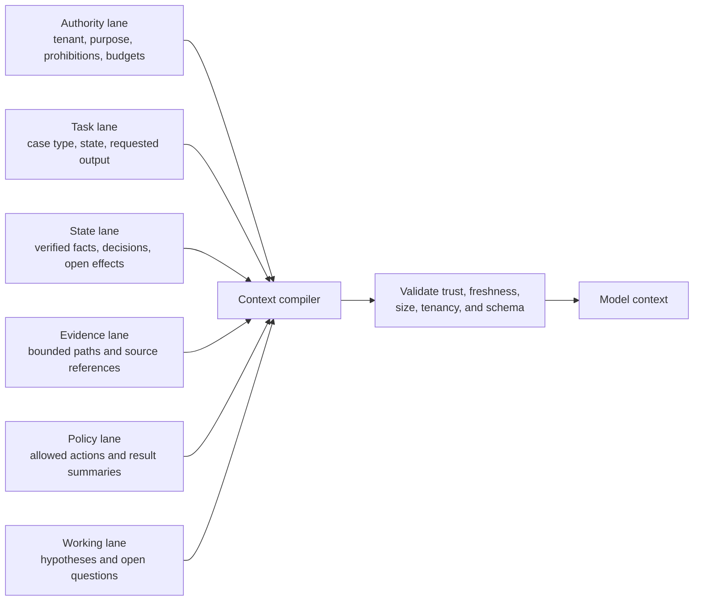

# State, Context, Memory, and Orchestration

> **Purpose:** Define authoritative records, prompt compilation, lossy compaction, durable waits, and the least dynamic adequate controller.

## Production position

The transcript is not the identity record, graph, review, approval, or effect ledger. Use structured durable state for every business invariant. Give the model a freshly compiled, purpose-limited projection for one decision.

Most work in this blueprint does not need open-ended planning. A versioned workflow should enumerate the valid lifecycle. The model may choose among a small set of read-only evidence actions while analyzing a bounded exception; it does not decide the workflow, approver, permission, or retry policy.

## Identity and record spine

Keep these identifiers independently queryable:

| Identifier | Purpose |
| --- | --- |
| `tenant_id` | Hard isolation and routing boundary |
| `case_id` | Durable governance work item |
| `run_id` / `attempt_id` | One model/control execution and retry lineage |
| `subject_id` | Canonical known identity entity; never display name |
| `account_id` | Target-system account identity |
| `graph_epoch` | Exact normalized relationship snapshot used |
| `evidence_id` | Source assertion/artifact and provenance |
| `observation_id` | Correctable normalized or derived conclusion |
| `decision_id` | Policy or human disposition |
| `approval_id` | Exact delegation artifact |
| `effect_id` / `operation_id` | Semantic external intent and dispatch lineage |
| `release_id` | Full behavior manifest |
| `trace_id` | Diagnostic correlation only |

See the canonical [agent state and event contracts](../../runtime/agent-state-and-event-contracts.md) for the general envelope. The schemas below specialize it.

## Typed case state

```yaml
governance_case:
  case_id: case-01K...
  tenant_id: tenant-7
  case_type: mover_reconciliation
  status: collecting_evidence
  subject:
    subject_id: workforce:004912
    correlation_status: unique
    authority_ref: hris-workforce/person/004912
  trigger:
    event_id: evt-01K...
    event_type: employment.position_changed
    source_version: "18422"
    effective_at: 2026-09-01T00:00:00Z
  graph:
    required_sources: [hris-workforce, workforce-directory, erp-prod]
    graph_epoch: 8831
    completeness: complete_within_declared_scope
    source_freshness: []
  observations: []
  decisions: []
  proposed_effects: []
  approval_refs: []
  open_effects: []
  deadlines:
    triage_by: 2026-09-01T01:00:00Z
    reconcile_by: 2026-09-01T04:00:00Z
  versions:
    workflow: mover-v4
    policy_bundle: iam-policy-2026-08-20
    graph_schema: 2
    context_compiler: 7
    release: iag-agent-2026-08-31.1
  revision: 17
```

Updates use optimistic concurrency or workflow serialization. A model output never replaces this record wholesale.

## Event envelope

```json
{
  "event_id": "evt-01K...",
  "event_type": "governance.observation_recorded",
  "occurred_at": "2026-08-31T04:19:02Z",
  "recorded_at": "2026-08-31T04:19:03Z",
  "tenant_id": "tenant-7",
  "case_id": "case-01K...",
  "subject_id": "workforce:004912",
  "actor": {"type": "workload", "id": "iag-control-plane"},
  "causation_id": "evt-source-18422",
  "correlation_id": "case-01K...",
  "schema_version": 1,
  "payload": {
    "observation_id": "obs-01K...",
    "kind": "retained_access_after_move",
    "evidence_refs": ["evidence:hr/18422", "evidence:erp/9912"],
    "graph_epoch": 8831
  }
}
```

Do not use event arrival order as business time. Preserve source occurrence/effective time, ingestion time, and ordering/version metadata. Late corrections may supersede earlier observations and invalidate approvals.

## Effect intent is a separate record

```yaml
effect_intent:
  effect_id: eff-01K...
  operation_id: tenant-7:remove-assignment:erp:assignment-9912:case-01K
  tenant_id: tenant-7
  case_id: case-01K
  operation: remove_entitlement_assignment
  subject_id: workforce:004912
  target:
    connector_id: erp-prod-write-v1
    account_id: erp:a-184
    assignment_id: erp:assignment-9912
  reason_code: mover_policy_no_longer_eligible
  evidence_refs: []
  policy_result_ref: decision:policy-778
  approval_ref: approval:991
  intent_digest: sha256:...
  preconditions:
    graph_epoch: 8831
    source_version: etag-or-vendor-version
    approval_not_after: 2026-09-01T03:00:00Z
  status: proposed
```

The model may propose fields from a closed schema. Deterministic code resolves canonical IDs, computes the digest, evaluates policy, and creates the effect record.

## Exactly seven memory lifetimes

Use exactly these seven lifetime names in design reviews, schemas, and tests. “Memory” describes retention and retrieval; it never grants authority.

| Lifetime | Use | Reject from live decisions | Retention | Correction and deletion | Poisoning test |
| --- | --- | --- | --- | --- | --- |
| **Turn/scratch** | Current instructions, purpose-limited evidence projection, tool schemas, temporary parse and output draft | Credentials, unrelated subjects, raw directory dumps, prior cases | Model call only; discard after the call and approved trace window | Recompile the call; delete captured content under diagnostic policy | Inject an instruction into every free-text field; it must remain data and cannot add a tool, identity, scope, policy, or approval |
| **Working/run** | Sourced hypotheses, evidence IDs checked, tool results, open questions, remaining budgets | Unsourced “facts,” approval authority, free-form identity correlation | Run lifetime with a hard TTL; checkpoint only typed notes needed for bounded retry | Supersede incorrect note with source reference; delete at run expiry or case/privacy request as policy requires | Seed a false hypothesis/tool result; validators must reject unsupported conclusions and a restart must rebuild from evidence |
| **Session** | Authenticated reviewer's current case, display state, and explicit clarification tied to purpose | Identity proof, approver authority, durable decision, cross-case preference | Short idle/absolute TTL, bound to tenant × actor × case × purpose | User can correct presentation/clarification; logout, revocation, case switch, or deletion request invalidates it | Attempt actor/tenant/case switch and replay an old clarification; binding must fail closed |
| **Durable workflow/task** | Case, events, clocks, deadlines, decisions, approvals, effects, cursors and restart receipt | Transcript as state, mutable replacement of evidence, model-generated authorization | Business/record schedule with legal holds and explicit terminal-state policy | Correct by append/supersession with actor and reason; propagate approved deletion while retaining required minimal audit proof | Replay/forge a late event, stale approval, or changed effect digest; revision/fencing and invariants must stop the transition |
| **Domain knowledge** | Governed graph, source profiles, owner registry, catalog, terminology and versioned policy | Unversioned prose, cross-tenant retrieval, stale owner/policy as current truth | Source-specific retention and historical-version schedule | Source-owner correction triggers reprojection/impact query; deletion/merge/split propagates to indexes and caches | Poison source description, owner, relationship, or policy text; provenance, schema, owner approval and deterministic policy tests must contain it |
| **Long-term/preference** | Disabled by default; if separately approved, only harmless presentation preferences that cannot affect access | “What this person usually needs,” inferred relationships, preferred approver, prior entitlement choices | None by default; otherwise short declared TTL with explicit purpose and opt/control | User correction and deletion must remove primary copy, cache and retrieval index subject to lawful retention | Insert a preference that asks to bypass SoD, route to a friendly approver, or expose another subject; output/authorization must be unchanged |
| **Episodic/outcome** | Disabled in production prompts; governed redacted incidents, appeals and corrected outcomes may feed offline evaluation | Past approval as precedent, nearest-neighbor authorization, raw reviewer history in live context | No live store by default; offline corpus has dataset version, retention, access and contamination controls | Correct labels by adjudicated version; honor deletion/hold across artifacts and derived sets; never rewrite released results silently | Add a successful but policy-violating prior case; live decisions must not retrieve it and offline evaluation must flag, not imitate, the violation |

The acceptance test for any proposed retrieval is: it has a named lifetime above, purpose, authority ceiling, tenant/subject boundary, provenance, TTL, correction owner, deletion path, poisoning fixture, and measured value over structured current state. If any field is absent, reject retrieval. Case analogues remain advisory even if later enabled; they never authorize access.

## Context compilation

Compile context at each decision boundary from authoritative records; never append indefinitely.



### Lane ordering and trust

1. system authority, tenant, task contract, prohibitions, and budgets;
2. current case state and allowed transition/action set;
3. deterministic policy results and unresolved requirements;
4. verified graph paths and source freshness;
5. untrusted source text, clearly delimited as data;
6. working notes, labeled as hypotheses.

The model does not receive raw credentials, full directory dumps, unrestricted policy repositories, unrelated subjects, private review comments, or prior-case outcomes by default.

### Context item contract

```json
{
  "context_item_id": "ctx-991",
  "lane": "evidence",
  "tenant_id": "tenant-7",
  "classification": "confidential-identity",
  "trust": "source_assertion",
  "source_ref": "evidence:erp/9912",
  "observed_at": "2026-08-31T04:15:20Z",
  "valid_for_decision_until": "2026-08-31T05:15:20Z",
  "transformation": "graph_path_projection_v2",
  "content": {"path_id": "path-188", "summary": "..."}
}
```

The compiler enforces per-lane token/row budgets and records omitted items with reasons. It should prefer structured relations and exact source excerpts over model-generated summaries.

## Lossy compaction and continuity

Long cases need compaction, but compaction cannot preserve authority by prose alone.

### Never compact away

- tenant, case, subject, and canonical resource/account identifiers;
- authoritative source references, versions, cutoffs, and freshness;
- explicit unknown, ambiguity, conflict, and missing-evidence states;
- policy result and version;
- decision/approval identity, scope, digest, expiry, and revocation;
- open effect status, operation ID, receipt, and verification requirement;
- deadlines, cancellation, incident holds, and prohibited actions;
- release/context-compiler/schema versions.

### Safe compaction pipeline

```text
select structured records
-> reject stale/cross-tenant items
-> preserve required fields verbatim
-> summarize only explanations and old interaction
-> emit omissions/conflicts
-> validate against the source state
-> store compaction artifact with compiler/version/digest
```

After compaction, run deterministic continuity checks such as:

```yaml
continuity_assertions:
  - tenant_id_unchanged
  - subject_id_unchanged
  - unresolved_ambiguities_preserved
  - approval_digest_and_expiry_preserved
  - no_effect_marked_success_without_postcondition
  - policy_and_graph_versions_present
  - forbidden_actions_present
```

If the check fails, rebuild context from durable state. A fresh run is safer than recursively summarizing a bad summary.

Persist the checked boundary as a restart-safe compaction receipt. The receipt is an index into durable records, not a prose substitute for them:

```yaml
receipt_schema_version: 2
tenant_id: tenant-7
case_id: access-review-2026-q3-42
case_state_version: 29
compacted_at: 2026-08-31T05:20:00Z
source_high_watermarks:
  hris-workforce: {event: 1182, source_version: "18422", observed_at: 2026-08-31T05:10:00Z}
  workforce-directory: {delta_token_digest: "sha256:...", observed_at: 2026-08-31T05:12:00Z}
  erp-prod: {snapshot_id: snap-20260831-erp, terminal_cursor: true, observed_at: 2026-08-31T05:14:00Z}
identity_ids:
  subjects: [workforce:004912]
  accounts: [erp:a-184]
resource_ids: [erp:ledger-prod]
entitlement_ids: [erp:invoice-release]
assignment_ids: [erp:assignment-9912]
graph_epoch: 8831
graph_schema_version: 2
policy_versions:
  core: iam-policy-44
  finance_sod: finance-v6
decision_ids: [decision:policy-778]
approvals:
  - approval_id: approval:991
    intent_digest: "sha256:..."
    granted_at: 2026-08-31T05:15:00Z
    not_before: 2026-08-31T05:15:00Z
    not_after: 2026-08-31T06:15:00Z
    consumed_at: null
clocks:
  trusted_now_at_compaction: 2026-08-31T05:20:00Z
  next_deadline: 2026-08-31T05:45:00Z
  lifecycle_effective_at: 2026-09-01T00:00:00Z
pending_effect_ids: [effect:remove-9912]
unknown_effect_ids: []
unresolved_ambiguity_ids: [identity-collision-19]
versions:
  workflow: access-review-v3
  context_compiler: iam-context/3.0.0
  tool_registry: iam-tools/11
  tool_adapters:
    erp-prod-read: 3
    erp-prod-write: 1
  model_route: model-deployment-snapshot-2026-08-20
  prompt_digest: "sha256:..."
  release: iag-agent-2026-08-31.1
next_safe_action: request_identity_steward_review
prohibited_actions: [dispatch_effect, infer_identity]
invariants_hash: "sha256:canonicalized-continuity-assertions-and-values"
receipt_hash: "sha256:canonicalized-receipt"
```

On resume, verify the receipt hash and invariants hash, then compare every source/event watermark, identity/resource/assignment key, graph and policy version, tool/model/release version, approval clock, deadline, and pending/`UNKNOWN` effect with the authoritative stores. Read events after each high-watermark before choosing an action. If a pending dispatch boundary cannot be proved pre-dispatch, promote it to `effect_unknown` and reconcile; never redispatch from the summary. If an approval, policy, identity binding, target version, trusted clock, or invariant changed, discard `next_safe_action`, recompile from durable state, and reauthorize. Compaction changes representation, never identity, policy, authority, temporal truth, or observed access state.

## Orchestration and planning

### Default controller

Use a deterministic state machine or durable workflow for:

- source refresh and case admission;
- evidence-completeness gates;
- policy analysis;
- human assignment, reminders, escalation, and expiry;
- effect reservation, dispatch, and reconciliation;
- terminal outcome and evidence-bundle creation.

The plan artifact is therefore small and typed:

```yaml
analysis_plan:
  case_id: case-01K
  goal: explain_effective_access_and_missing_evidence
  allowed_reads:
    - effective_access_path
    - source_freshness
    - resource_owner
  max_tool_calls: 6
  max_graph_paths: 20
  completion:
    - supported_finding
    - no_finding
    - abstain_missing_evidence
    - abstain_ambiguous_identity
```

The model can reorder or omit allowed reads based on returned evidence. It cannot add a connector, broaden tenant/resource scope, request a write, choose an approver, or change the completion states.

### Replanning triggers

Recompile and, if needed, restart analysis when:

- graph epoch changes in the case's affected subgraph;
- a required source becomes stale or incomplete;
- subject correlation changes;
- policy/resource ownership changes;
- a new SoD conflict appears;
- approval expires or is revoked;
- an effect returns unknown/partial state;
- tool budget or deadline is exhausted.

Do not let a stale plan continue because it is fluent or nearly complete.

## Concurrency

Serialize or fence work at the narrowest business key that protects invariants:

- JML case: tenant + subject + lifecycle-effective-time;
- review item: campaign + subject + entitlement/path root;
- grant/revoke: tenant + target assignment or canonical subject/resource/entitlement;
- connector sync: connector + query/profile + cursor stream;
- graph publication: tenant + source + epoch.

Parallelize read-only acquisition when sources are independent, but preserve per-source budgets and causal metadata. Never parallelize conflicting grant/revoke effects for the same assignment.

## Recovery rules

| Failure point | Resume behavior |
| --- | --- |
| Before evidence persisted | Repeat bounded read |
| Evidence persisted, graph projection missing | Replay normalized event idempotently |
| Model call lost | Re-run from compiled context; old response has no authority |
| Approval wait process dies | Resume from durable approval state and revalidate deadline/authority |
| Effect dispatch uncertain | Enter `effect_unknown`; reconcile before any retry |
| Context compiler version changes | Active case pins old version or performs explicit compatible migration |
| Graph epoch is corrupt/incomplete | Pause affected decisions/effects; rebuild from evidence/sources |
| Case revision conflict | Reload current state and recompute; do not merge model prose |

## Anti-patterns

| Anti-pattern | Failure | Replacement |
| --- | --- | --- |
| Chat history as identity evidence | Spoofing and stale facts | Authenticated canonical IDs and source evidence |
| Vector memory of prior approvals | Hidden precedent and bias | Versioned policy plus offline failure corpus |
| Full entitlement graph in prompt | Privacy, cost, attention loss | Deterministic subgraph/path projection |
| Model-written summary as checkpoint | Drops approvals, unknown effects, or ambiguity | Structured state plus validated compaction |
| Planner decides who approves | Policy bypass | Deterministic approval routing |
| One autonomous agent per department | Handoff and identity sprawl | One coordinator with typed workers and human roles |
| Continue after source freshness expires | Stale grant/revoke proposal | Re-fetch/recompile or abstain |
| Replay model output to restore state | Nondeterministic history rewrite | Persist typed proposals and decisions |

## Readiness checklist

- [ ] Every authoritative record and identifier is separate from the transcript and telemetry.
- [ ] State, event, effect, approval, and evidence schemas are versioned.
- [ ] Optimistic concurrency/fencing prevents stale transitions.
- [ ] Each memory class is explicitly enabled or disabled with retention and authority rules.
- [ ] Long-term personalization and live episodic precedent are disabled unless separately justified.
- [ ] Context lanes enforce tenant, purpose, trust, freshness, and size.
- [ ] Compaction preserves all invariants and validates against durable state.
- [ ] Workflow owns planning; the model has a bounded read-only analysis plan.
- [ ] Replanning triggers include graph, source, policy, approval, and effect changes.
- [ ] Crash/resume behavior is tested at every durable and external-effect boundary.

## Related guides

- [Blueprint overview](README.md)
- [Reference architecture, connectors, and entitlement graph](02-reference-architecture-connectors-and-entitlement-graph.md)
- [Approvals, effects, reconciliation, and recovery](05-approvals-effects-reconciliation-and-recovery.md)
- [Context engineering](../../context-memory/context-engineering.md)
- [Memory architecture](../../context-memory/memory-architecture.md)
- [Compaction and continuity](../../context-memory/compaction-and-continuity.md)
- [Planning and replanning](../../orchestration/planning-and-replanning.md)
