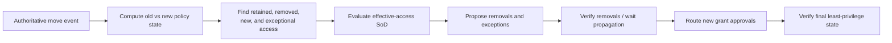

# JML, Access Reviews, SoD, and Time-Bound Access

> **Purpose:** Implement the identity-governance workflows this category owns while preserving human and IAM-system accountability.

## One evidence model, several workflows

Joiner/mover/leaver (JML) monitoring, access reviews, SoD analysis, time-bound access, and orphan reconciliation consume the same versioned relationship graph. They differ in trigger, deadline, decision owner, effect authority, and success oracle.

| Workflow | Primary trigger | Accountable decision owner | Terminal proof |
| --- | --- | --- | --- |
| Joiner | Authoritative affiliation becomes eligible/effective | Resource/policy owner through approved birthright/request policy | Intended low-risk access present; no extra access |
| Mover | Position, department, manager, location, project, risk, or contract change | Resource/control owners under mover policy | Old access removed/exceptioned and new approved access verified |
| Leaver | Authoritative termination/contract/sponsorship end | HR/sponsor event plus IAM/security policy | Accounts/access disabled or removed across declared scope, exceptions owned |
| Access review | Campaign schedule, risk event, role/resource change | Assigned reviewer/certifier | Every item has a recorded human/system disposition and remediation status |
| SoD analysis | Access proposal, graph change, campaign, transaction context | Control owner defines policy; approver resolves exception | Rule result and approved exception/mitigation, if any |
| Time-bound grant | Authenticated request or approved workflow | Resource owner and configured approvers; PAM for privilege | Grant active only within bounds and expiry/revocation verified |
| Orphan reconciliation | Uncorrelated/ownerless/stale account or access observation | Source owner, sponsor, IAM/security owner | Correct correlation/classification/ownership or approved disable/removal verified |

The agent prepares, monitors, and reconciles. It never replaces the accountable decision.

## Joiner, mover, and leaver monitoring

### Lifecycle event contract

```json
{
  "event_id": "hr-evt-18422",
  "tenant_id": "tenant-7",
  "event_type": "affiliation.position_changed",
  "subject_ref": {"issuer": "hris-workforce", "id": "004912"},
  "occurred_at": "2026-08-30T09:14:00Z",
  "effective_at": "2026-09-01T00:00:00Z",
  "recorded_at_source": "2026-08-30T09:14:02Z",
  "source_version": "18422",
  "changed_attributes": ["position_id", "department_id", "manager_id"],
  "evidence_ref": "evidence:hr/18422",
  "schema_version": 1
}
```

The event asserts a source change. It does not by itself say which permissions to grant or revoke. The workflow evaluates approved mappings and policies against the effective date.

### Joiner workflow

1. verify source authenticity, tenant, subject type, status, effective time, and sponsorship;
2. correlate or create the canonical subject through the established identity process;
3. compute deterministic birthright access from versioned policy;
4. compare desired and observed access without treating missing data as absence;
5. prepare any non-birthright request with minimum duration and exact resource scope;
6. route human/IAM approvals;
7. dispatch only enabled effect cells;
8. verify both presence of intended access and absence of unintended additions.

Do not use peer similarity to grant “what people like this usually have.” Peer analysis may identify a candidate for review, with protected attributes, sampling bias, and historical privilege creep considered. It cannot become an authorization rule by stealth.

### Mover workflow: subtract before add when risk requires it

A mover is not a new joiner with more access. It can accumulate old and new privileges into an SoD conflict.



The sequencing policy is workload-specific. High-risk moves may require revoking incompatible old access before granting new access. Other roles may need overlap to preserve operations. The control owner defines the overlap ceiling and expiration; the model cannot improvise it.

### Leaver workflow

Leavers use a priority lane because delayed access removal can be high consequence.

- distinguish scheduled, immediate, rescinded, extended, and corrected termination events;
- separate workforce identity disablement, application-account disablement, group/role removal, active sessions/tokens, physical access, devices, API keys, service ownership, and data handoff;
- route each class to its authoritative system; do not assume disabling a directory account closes local or federated sessions everywhere;
- preserve legal hold, record-retention, mailbox/data-transfer, and investigation requirements without preserving unnecessary interactive access;
- verify declared targets and surface systems outside connector coverage;
- handle rehire by policy and identity history, never by blindly reactivating every prior entitlement.

Urgent automated termination may be an established deterministic IAM control. The agent monitors and verifies that control; it should not become the only path on which termination depends.

### JML discrepancy record

```yaml
jml_discrepancy:
  kind: access_not_aligned_after_move
  subject_id: workforce:004912
  lifecycle_event_ref: hr-evt-18422
  effective_at: 2026-09-01T00:00:00Z
  expected_policy_ref: iam-policy-2026-08-20
  observed_graph_epoch: 8831
  access_paths:
    - path-188
  classification: confirmed | suspected | incomplete | ambiguous
  recommended_next_action: propose_removal | request_exception | refresh_source | steward_review
  evidence_refs: []
  decision_required_from: finance-resource-owner
```

The recommendation is a closed-set observation. The owner decides.

## Access-review preparation

### The review unit

A review item must be actionable. Reviewing every leaf permission separately creates noise; reviewing only a top-level group can hide dangerous inheritance. Choose a revocation root and expose the effective leaves and path.

```yaml
review_item:
  campaign_id: review-q3-erp
  item_id: item-7731
  cutoff_at: 2026-08-31T00:00:00Z
  graph_epoch: 8802
  subject_id: workforce:004912
  subject_status: active
  revocation_root:
    type: group_membership
    id: erp:finance-west/member/workforce:004912
  effective_access_summary:
    resources: [ledger-prod]
    permissions: [invoice.read, invoice.release]
    path_refs: [path-188, path-189]
  context:
    business_role: analyst-west
    manager_ref: workforce:000881
    resource_owner_ref: workforce:000227
    grant_origin: approved_request
    grant_decision_ref: decision-441
    valid_until: 2026-10-01T00:00:00Z
    last_exercised:
      observed_at: 2026-08-20T11:15:00Z
      scope_limitations: application_audit_log_only
  deterministic_findings:
    sod: none
    stale_owner: false
    source_incomplete: false
  model_summary_ref: observation-summary-993
  reviewer_decision: null
```

### Packet design

Show, in this order:

1. the subject, resource, access root, and exact consequence of retain/revoke;
2. direct and inherited paths with plain-language labels;
3. source cutoff, freshness, coverage, and missing evidence;
4. grant origin, approval, duration, owner, sponsor, and exception history;
5. relevant activity signals with their limitations;
6. deterministic SoD/policy findings;
7. the model recommendation, if shown, clearly labeled and optionally hidden until the reviewer forms an initial view;
8. `retain`, `revoke`, `modify/shorten`, `delegate/reassign`, and `cannot decide` paths with reason codes.

[Usable-security research on organizational access reviews](https://www.usenix.org/conference/soups2014/proceedings/presentation/jaferian) found that reviewers need user, job, access, and policy-history context, and that scale and exceptional cases matter. Treat recommendation acceptance rate as a possible automation-bias signal, not a success metric by itself.

### Campaign rules

- Freeze a review cutoff/graph epoch; disclose later changes and decide whether to restart affected items.
- Split campaigns by risk, owner, deadline, and reviewer capacity.
- Prevent self-review and model-assisted circular approval under the organization's SoD rules.
- Assign fallback reviewers before launch; do not silently route to an all-powerful administrator.
- Define non-response policy per risk class. “Auto-approve” is not a neutral default.
- Keep automated-role/lifecycle access distinct: the reviewer may need to acknowledge the role or change its policy, not revoke an encapsulated leaf that will be re-provisioned.
- Apply approved remediation through the normal effect path and report verified completion separately from campaign decision completion.
- Export evidence for audit, but do not have the agent attest control effectiveness.

Current Microsoft, Okta, and SailPoint documentation shows materially different review scopes, encapsulation behavior, limits, remediation paths, and self-review handling. Map the local product's exact behavior; never assume a portable “certification item” model.

## Segregation-of-duties analysis

### Policy belongs to the control owner

Represent a SoD rule as a versioned, testable object:

```yaml
sod_rule:
  rule_id: finance.invoice.create-vs-release
  version: 6
  owner: finance-controls
  scope:
    tenants: [tenant-7]
    resources: [ledger-prod]
    subject_types: [workforce_person, service_identity]
  kind: static_effective_access
  left_capability: invoice.create
  right_capability: invoice.release
  condition: same_legal_entity
  severity: high
  allowed_resolution:
    - remove_left
    - remove_right
    - time_bounded_exception_with_dual_approval_and_monitoring
  effective_from: 2026-07-01T00:00:00Z
  tests_ref: sod-tests/finance-v6
```

The model may translate a rule result into clear prose. It must not turn an unapproved policy document or reviewer comment into executable SoD semantics.

### Analyze effective paths, not role labels alone

SoD can arise through:

- direct assignments;
- nested groups and role hierarchies;
- resource policies and cross-account trusts;
- eligible plus active privileged assignments;
- service principals/workloads acting for a process;
- two different applications whose capabilities complete one business transaction;
- delegated administration and approval roles;
- an old role retained during a move.

Static SoD prevents an incompatible combination from being assigned. Dynamic SoD prevents incompatible activation or transaction steps in the relevant context. A standing entitlement graph may identify potential dynamic conflicts, but transaction-level enforcement belongs in the business/PAM/policy enforcement path. The governance agent must not claim it proved dynamic SoD from assignments alone.

### Finding contract

```json
{
  "finding_id": "sod-find-881",
  "rule_id": "finance.invoice.create-vs-release",
  "rule_version": 6,
  "subject_id": "workforce:004912",
  "status": "confirmed",
  "left_paths": ["path-201"],
  "right_paths": ["path-188"],
  "graph_epoch": 8831,
  "scope_facts": {"legal_entity": "entity-west"},
  "existing_exception_ref": null,
  "evidence_refs": ["evidence:..."],
  "recommended_resolutions": ["remove_left", "remove_right", "request_exception"],
  "decision_ref": null
}
```

Keep `confirmed`, `potential`, `incomplete`, `not_applicable`, `accepted_exception`, and `resolved` distinct.

## Time-bound access proposals

### Default posture

Use existing entitlement-management or PAM capabilities when they support request, approval, expiration, activation, and review. The agent prepares an exact proposal and evidence; the IAM/PAM system and accountable people decide and enforce it.

```yaml
grant_proposal:
  proposal_id: prop-991
  tenant_id: tenant-7
  requester_actor_ref: authenticated-workflow-actor
  beneficiary_subject_id: workforce:004912
  resource_id: ledger-reporting
  entitlement_id: report-viewer
  access_class: non_privileged
  requested_start: 2026-09-02T09:00:00Z
  requested_end: 2026-09-09T18:00:00Z
  maximum_policy_end: 2026-09-09T18:00:00Z
  purpose_code: quarter_close_support
  justification_evidence_refs: [ticket:FIN-8821]
  deterministic_results:
    eligibility: allow
    sod: no_conflict
    data_location: allowed
  approval_route:
    - resource_owner
  revocation_plan:
    effect_class: access_package_assignment_expiry
    verify_by: 2026-09-09T18:30:00Z
  graph_epoch: 8831
  policy_bundle: iam-policy-2026-08-20
```

### Proposal rules

- resolve the beneficiary from authenticated workflow state, never conversation;
- select only a cataloged entitlement/access package with a current owner;
- choose the minimum scope and duration allowed by policy;
- run effective-access SoD and existing-access checks before approval and again before commit;
- disclose all inherited permissions of a bundle, not only its friendly name;
- bind the approver route deterministically;
- ensure expiry has a supported enforcement path and an independent verification deadline;
- privileged, break-glass, policy-admin, role-management, credential, and audit-control changes remain I5 proposal-only and go through PAM/administrative processes;
- a denied or expired proposal cannot be “rephrased” into a new automatic attempt.

## Orphaned-access reconciliation

### Classification before action

An “orphan” signal can mean:

| Observation | Possible legitimate explanation | Required next step |
| --- | --- | --- |
| Account has no person correlation | Service/shared/emergency/vendor account; correlation lag; duplicate identity | Check account type, owner/sponsor, purpose, creation provenance, source coverage |
| Person is inactive but account is active | Leave/termination lag; legal/operational exception; wrong correlation | Verify lifecycle event and exception before proposing disable |
| Entitlement has no owner | Ownership reorganization; connector omitted owner; unmanaged privilege | Route to source/IAM governance owner; restrict new grants if policy says so |
| Service identity has no sponsor | Application retired or ownership data stale | Identify workload/use, credential activity, dependencies, and service owner |
| Account unused | Seasonal/batch/emergency use; telemetry incomplete | Record activity coverage and retention; never equate no observation with no need |
| Access absent from central IGA but present in target | Local/manual grant, sync lag, connector gap | Preserve as authoritative target observation; reconcile through target owner |

### Orphan case contract

```yaml
orphan_case:
  candidate_id: orphan-551
  account_id: legacy-db:svc_batch_17
  observed_account_type: service
  correlation_status: none
  source_freshness: []
  ownership:
    owner_ref: null
    sponsor_ref: null
    last_verified_at: null
  activity:
    last_observed_at: 2026-08-27T02:00:00Z
    coverage: database_authentication_logs_90d
  access_paths: [path-991]
  dependency_evidence_refs: [cmdb:service-82]
  classification: ownerless_service_identity
  proposed_action: assign_owner_and_review
  destructive_action_allowed: false
```

Never disclose credentials in this record. Credential rotation/revocation is a separate privileged process.

## Worked production scenarios

These examples show where deterministic controls stop and the bounded analyst begins. Exact policy, provider behavior, deadlines, and proof must be qualified in the deployment.

### Joiner: future-dated analyst with birthright and requested access

**Facts:** HR asserts person `004912`, start `2026-09-07T09:00:00Z`, department Finance-West, active sponsorship, and a stable worker ID. Policy `birthright-v12` maps that population to the directory employee group and reporting portal, but not invoice release. The ERP owner exposes a cataloged seven-day reporting package.

1. The deterministic lifecycle workflow validates the signed HR record, future effective time, tenant, unique correlation, source freshness, and birthright policy version.
2. It creates future-effective birthright assignments through the existing IAM path. It does not grant merely because similar analysts have access.
3. The model may explain that the ERP package is non-birthright and summarize ticket evidence; schema validation constrains it to `propose_cataloged_package` or `abstain`.
4. Deterministic eligibility, SoD, duration ceiling, requester/beneficiary binding, and approval-route checks run. The resource owner decides.
5. At the trusted activation clock, commit-time checks run again; each provider effect uses one operation ID.
6. Terminal proof is the intended direct assignments active no earlier than the start time, effective leaves recomputed, and no extra package/role. A queued job or account creation alone is insufficient.

**Failure branch:** if HR changes the start date or withdraws the hire before activation, cancel undispatched effects, reconcile in-flight effects, and verify no interactive access. Do not edit the original event.

### Mover: incompatible privilege accumulation

**Facts:** A finance analyst moves to vendor administration at `T`. Existing access reaches `invoice.release` through a nested group; new birthright would reach `vendor.create`. SoD rule `finance-v6` forbids both for one legal entity. Business policy permits at most a four-hour overlap only with dual approval and transaction monitoring.

1. Compute old-policy state at `T-ε` and new-policy state at `T`; enumerate retained, removed, new, overlapping, and unknown paths.
2. The deterministic graph/PDP confirms the conflict over effective permissions. The model only translates the two paths and missing evidence into a reviewer packet.
3. If no approved overlap exception exists, remove the old revocation root first and verify the `invoice.release` path is absent before routing the new grant.
4. If the accountable owners approve the bounded exception, persist scope, mitigation, not-before/not-after, review owner, and expiry effect. Recheck at each commit.
5. Close when the old access is absent or the exception is still valid, the new approved access is present, no alternate conflicting path remains, and the final graph converges.

**Failure branch:** if the nested-membership source is incomplete, classify `UNKNOWN_EFFECTIVE_ACCESS`, block the grant, and refresh or route to the directory owner. Fluency cannot compensate for missing nesting.

### Leaver: rescinded termination followed by an immediate termination

**Facts:** HR schedules termination for Friday, rescinds it Thursday, then issues an immediate signed termination on Monday. The subject has directory, SaaS, local ERP, PAM eligibility, one active privileged session, two OAuth grants, and ownership of a service account.

1. Preserve all three events with occurrence, effective, source-version, and recorded times. The rescission supersedes only the scheduled future event; it does not erase it.
2. The final immediate event enters the reserved P0 deterministic lane. Existing lifecycle/IAM controls disable accounts and remove assignments; this system must not depend on a model response.
3. In parallel, route PAM session termination, credential checkout invalidation, OAuth/refresh-token revocation, application-session termination, device/physical access, and service-account ownership transfer to their accountable systems.
4. The model may summarize uncovered systems and contradictory receipts, but cannot decide legal hold, data handoff, or emergency-account deletion.
5. Verify each declared target after its measured propagation window, recompute alternate paths, and list systems with no authoritative read as exceptions.

**Terminal proof:** disabled/removed state across the declared inventory, privileged session ended, token/session scope and residual lifetime recorded, service identity transferred, all unknown effects resolved or incident-owned, and periodic reconciliation scheduled. “Primary directory disabled” is not the terminal oracle.

### Review: quarterly ERP certification with an inherited root

**Facts:** A manager reviews 4,000 ERP items. One user has `invoice.release` through `finance-west`; the group also grants three benign permissions. The manager has changed, activity logs cover only 90 days, and the IGA can remove direct assignments but not an app-sourced group.

1. Freeze campaign cutoff, graph epoch, reviewer authority, source coverage, and the revocation root. Split workload to a ratified reviewer-capacity limit.
2. Show the group edge, all four effective leaves, grant origin, last approved exception, 90-day activity limitation, deterministic SoD result, and stale-manager warning.
3. The model may produce a cited summary. The reviewer chooses retain, revoke, modify, reassign, or cannot decide; recommendation acceptance is not the quality metric.
4. A revoke decision creates a manual source-owner task because the group is app-sourced. Ticket closure does not complete remediation.
5. Verify group membership in its source and effective ERP access, then report campaign decision completion separately from verified remediation completion.

### Emergency revocation: suspected token theft

**Facts:** Security detects credible token theft for a privileged operator. Some applications support continuous evaluation or universal logout; others own opaque sessions. Directory and application propagation are not synchronous.

1. The security incident commander invokes the pre-authorized break-glass runbook outside the model: block sign-in, revoke refresh/sign-in sessions, disable affected devices or credentials, terminate PAM sessions, and call supported application logout/deprovision paths.
2. Pause lower-priority grants for the subject and conflicting writes; preserve correlation, tokens-as-secret metadata only, session IDs, operation IDs, and clocks.
3. The governance workflow inventories assignments and alternate paths, monitors every issued effect, and promotes timeouts to `UNKNOWN` for reconciliation. The model may summarize gaps for responders.
4. Verify no new tokens can be minted under the affected identity, each PAM/application session postcondition, assignment state, and the residual lifetime of any bearer token or offline/local session that cannot be recalled.
5. Keep the incident open for uncovered or unprovable targets. Recovery/regrant uses a new authenticated decision and new intent; it never reverses the containment batch blindly.

Emergency authority is deliberately pre-established and deterministic. An agent recommendation is too slow and too weak an authority source for containment.

## Accountable review checklist

Before a reviewer or approver acts, the surface must answer:

- Who or what is the subject, and how was it identified?
- Which resource and exact effective permissions are in scope?
- Through which direct and inherited paths does access arise?
- Which sources, cutoffs, coverage limits, conflicts, and missing facts apply?
- Who owns the resource, policy, account, and exception?
- Why was access originally granted and when does it expire?
- What activity was observed, and what could the telemetry not observe?
- Which deterministic eligibility/SoD results apply, at which versions?
- What exact effect will approval authorize, and what will it not do?
- How will success, failure, partial effect, and expiry be verified?
- Can the reviewer choose `cannot decide` and route to the correct owner?

## Anti-patterns

| Anti-pattern | Why it fails |
| --- | --- |
| Peer-group similarity auto-grants access | Reproduces historical overprivilege and can encode protected-attribute proxies |
| Leaver equals “disable primary directory account” | Local accounts, sessions, tokens, apps, and privileged systems may remain |
| Mover adds the new role before analyzing old access | Creates privilege accumulation and SoD windows |
| Reviewers see only friendly package names | Hidden inherited permissions make decisions uninformed |
| “No activity” means revoke | Logging gaps, retention, seasonal use, and machine behavior make the inference unsafe |
| Model extracts SoD rules from policy prose at runtime | Unreviewed interpretation becomes enforcement policy |
| Review campaign completion equals remediation | Decisions can be complete while target access remains unchanged |
| Uncorrelated account auto-delete | Can break workloads or emergency access and target the wrong entity |
| Agent signs compliance attestation | Violates independence and exceeds evidence-preparation scope |

## Related guides

- [Blueprint overview](README.md)
- [Reference architecture, connectors, and entitlement graph](02-reference-architecture-connectors-and-entitlement-graph.md)
- [Approvals, effects, reconciliation, and recovery](05-approvals-effects-reconciliation-and-recovery.md)
- [Security, privacy, identity, and tenant isolation](06-security-privacy-identity-and-tenancy.md)

## Selected sources

- [NIST SP 800-53 Rev. 5 AC-2, AC-5, and AC-6](https://csrc.nist.gov/pubs/sp/800/53/r5/upd1/final)
- [NIST IR 6192: A Revised Model for RBAC](https://csrc.nist.gov/pubs/ir/6192/final)
- [NIST: Mutual Exclusion of Roles for Separation of Duty](https://tsapps.nist.gov/publication/get_pdf.cfm?pub_id=916538)
- [NCSC identity and access management](https://www.ncsc.gov.uk/collection/10-steps/identity-and-access-management)
- [Microsoft Entra entitlement management](https://learn.microsoft.com/en-us/entra/id-governance/entitlement-management-overview)
- [Microsoft Entra access reviews deployment](https://learn.microsoft.com/en-us/azure/active-directory/governance/deploy-access-reviews)
- [Okta Identity Governance campaigns](https://help.okta.com/oie/en-us/Content/Topics/identity-governance/access-certification/campaigns.htm)
- [SailPoint certification behavior](https://documentation.sailpoint.com/saas/help/certs/understanding_certifications.html)
- [USENIX SOUPS: Helping Users Review Access Policies](https://www.usenix.org/conference/soups2014/proceedings/presentation/jaferian)
