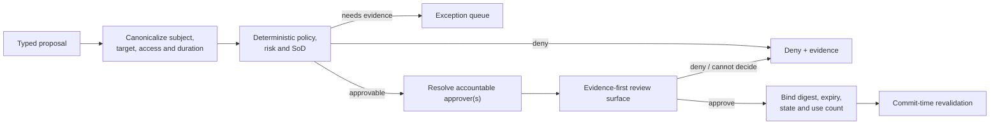
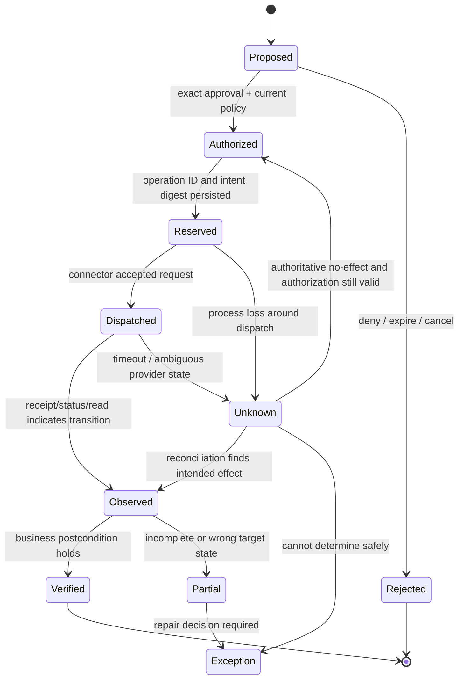
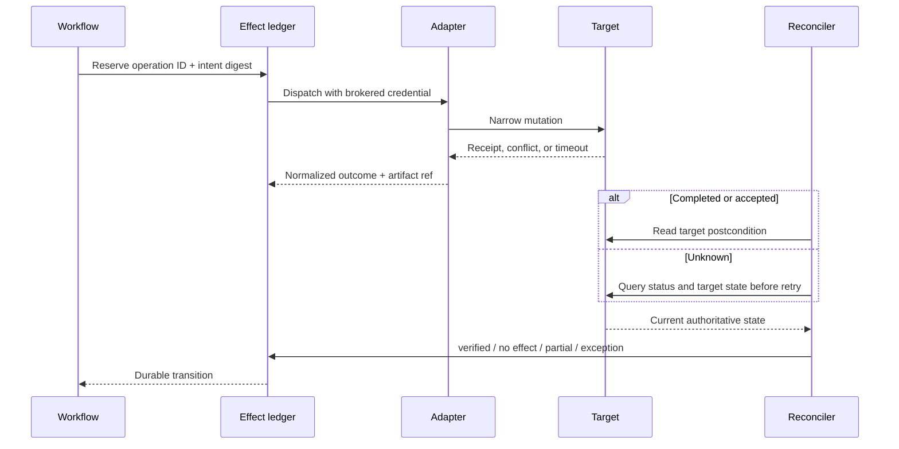

# Approvals, Effects, Reconciliation, and Recovery

> **Purpose:** Turn a permitted proposal into at most one authorized external transition and prove the target postcondition despite retries, crashes, propagation delay, and partial failure.

## Approval is a bounded delegation artifact

An approval is not a chat message, email phrase, ticket status, or generic permission to “fix access.” It authorizes one canonical intent under current policy.

```json
{
  "approval_id": "apr-01K...",
  "tenant_id": "tenant-7",
  "case_id": "case-01K...",
  "effect_id": "eff-01K...",
  "intent_digest": "sha256:...",
  "subject_id": "workforce:004912",
  "target": {
    "connector_id": "erp-prod-write-v1",
    "account_id": "erp:a-184",
    "assignment_id": "erp:assignment-9912"
  },
  "operation": "remove_entitlement_assignment",
  "constraints": {
    "not_before": "2026-09-01T00:00:00Z",
    "not_after": "2026-09-01T03:00:00Z",
    "max_uses": 1,
    "graph_epoch": 8831,
    "target_version": "etag-or-provider-version"
  },
  "policy_bundle": "iam-policy-2026-08-20",
  "approver": {
    "actor_id": "workforce:000227",
    "authenticated_session_ref": "auth-session:...",
    "authority_decision_ref": "authz:..."
  },
  "decision": "approved",
  "reason_code": "mover_access_no_longer_required",
  "approved_at": "2026-09-01T00:12:00Z",
  "schema_version": 1
}
```

The approval service—not the model—authenticates the approver and verifies that actor can approve this effect now.

## Approval route



### Required separation

- requester/beneficiary does not approve their own consequential access;
- a model or its operator cannot convert a recommendation into approval;
- connector/service identity is not an approver;
- privileged/PAM, control-plane, break-glass, role-policy, credential, and audit changes use the separate I5 administrative route;
- delegated/fallback approvers are explicitly authorized and visible;
- changing any material intent field invalidates the old approval.

Approval fatigue is an operational risk. Reduce noise by better scoping, batching only genuinely equivalent low-risk items, and improving evidence. Do not reduce fatigue by hiding access paths or treating non-response as consent without an approved policy.

## Commit-time checks

Immediately before credential issuance and dispatch, deterministic code revalidates:

1. tenant, case, effect, subject, target, operation, and intent digest match;
2. case and effect revisions are current and not cancelled/held;
3. subject correlation is unique and lifecycle state permits the action;
4. source freshness and graph completeness meet the effect cell's requirements;
5. target assignment/version still matches the approved precondition;
6. policy, SoD, resource owner, and approver authority remain valid;
7. approval has not expired, been revoked, or been consumed;
8. connector/release is admitted and not quarantined;
9. selector/batch scope resolves to the approved bounded manifest;
10. the operation ID has not completed with a different payload.

A newer policy can tighten or revoke authority immediately. A policy loosening does not silently authorize an old proposal; obtain a new approval where required.

## Effect lifecycle



`Dispatched` and `Observed` are not success. `Verified` means the effect-specific postcondition holds in the authoritative target after the required propagation behavior.

## Semantic operation identity

Derive the operation ID from stable business intent, not an attempt number:

```text
tenant
+ canonical operation
+ canonical subject/account
+ canonical target assignment/resource/entitlement
+ case or approved change identity
+ intended effective window
```

Persist the operation ID and intent digest before network dispatch. Reuse them on retry and resume. If the provider offers an idempotency key, pass a compatible key, but retain the application ledger because provider scopes, retention, and equivalence rules vary.

Reject:

- same operation ID with a different intent digest;
- new random ID for a retry;
- broad `update_user` operations whose semantic effect is unclear;
- retrying `DELETE` or `PATCH` merely because the HTTP method sounds idempotent;
- treating workflow replay as exactly-once external execution.

### Grant, revoke, and update semantics

Semantic idempotency means repeated attempts converge on the same approved business state; it does not mean every repeated HTTP request is harmless.

| Change kind | Stable semantic key and precondition | Verification | Important failure |
| --- | --- | --- | --- |
| Create account | Tenant + target + canonical subject + account purpose; prove no existing/candidate account | Exactly one intended account exists, correlated to the subject, with only approved attributes/access | Retry creates a second account under a different generated native ID |
| Grant assignment | Tenant + account/subject + resource + entitlement + effective window + grant decision | Intended direct assignment exists and effective leaves equal the approved consequence | Bundle definition changed, duplicate assignment exists, or new inherited permissions appeared |
| Revoke assignment | Tenant + exact revocation root/assignment + decision/case | Root is absent/inactive, alternate paths assessed, downstream/session obligations satisfied | Removing one leaf/root leaves another effective path or source policy re-provisions it |
| Update assignment | Tenant + exact assignment + desired normalized state digest; expected current target version | Full material assignment state equals desired state; no unapproved fields changed | A broad `PUT` clears provider-managed fields or overwrites a concurrent owner/policy change |
| Disable account | Tenant + exact account + lifecycle event/effect time | Target's documented disabled state prevents new authentication; local/federated paths listed | “Disabled” field is decorative, delayed, or unrelated sessions continue |
| Expire time-bound access | Original grant/assignment + recorded end + expiry policy | Assignment/effective path absent after end plus qualified propagation window | Scheduler fires but connector fails or policy immediately re-grants |
| Terminate token/session | Issuer/application/PAM + subject/session or grant + incident action | Issuer/application/PAM reports invalidation and any separately testable session is rejected | RFC 7009-style success can be intentionally non-disclosing; access tokens/application cookies may remain valid |

For updates, canonicalize only the fields the approval covers and use a compare-and-set/ETag when the provider supports it. If the provider offers only whole-object replacement, read the current object, reject unknown concurrent changes, preserve provider-managed fields, write the approved projection, and verify the material diff. Do not retry a conflict by silently re-basing the approved intent onto newer state.

## Narrow effect adapter

```yaml
operation: remove_entitlement_assignment
input:
  tenant_id: string
  account_id: canonical_account_id
  assignment_id: canonical_assignment_id
  expected_target_version: string | null
  operation_id: string
  intent_digest: string
runtime_envelope:
  deadline_ms: 10000
  credential_ref: broker_attached
  egress_destination: registered_connector_only
result:
  outcome: accepted | completed | rejected | not_found | conflict | unknown
  provider_request_id: string | null
  provider_status_ref: string | null
  source_version_after: string | null
  raw_artifact_ref: artifact_ref
  retry_class: never | after_reconcile | safe_same_operation_id
```

This is an application adapter contract. Map each provider's actual documented response, error, idempotency, status, and consistency semantics; do not invent a portable vendor API.

## Revocation verification

### Define the postcondition per access mechanism

| Access mechanism | Example verification | Important limit |
| --- | --- | --- |
| Direct application assignment | Assignment absent/inactive in authoritative target read | Cached permissions or sessions may outlive assignment |
| Group membership | Direct membership edge removed and downstream application projection converged | Nested/transitive membership may still grant access |
| Role hierarchy/bundle | Revocation root removed and effective permission path recomputed | Other paths may preserve the same effective access |
| Cloud role/policy | Binding/attachment removed and access-analysis or effective-policy check updated | Provider analysis and enforcement can be eventually consistent |
| PAM eligibility | Eligible assignment removed/expired; active sessions handled per PAM policy | Removing eligibility may not terminate an already active session |
| Local account | Account disabled/locked/removed as the target system defines | Directory disablement may not affect local accounts |
| OAuth/app consent | Grant/credential revoked by the responsible platform | Previously issued tokens and caches follow separate lifecycle semantics |
| Time-bound package | Assignment expiry recorded and target access removal verified | Scheduler completion alone is not target proof |

The declared governance scope must say whether session/token invalidation is owned here, by PAM/IdP, by the target application, or by an incident workflow. Do not imply a stronger revocation guarantee than the connected systems provide.

Revocation evidence has levels; report the strongest level actually observed:

| Level | Evidence | Claim allowed |
| --- | --- | --- |
| R0 — requested | Durable authorized intent only | Revocation was requested |
| R1 — accepted | Provider receipt/job accepted | Provider accepted work; outcome unknown |
| R2 — source object changed | Authoritative direct assignment/account/eligibility read meets postcondition | That direct source state changed at observation time |
| R3 — effective paths cleared | Declared graph recomputed with complete, fresh sources | No effective path in declared graph coverage |
| R4 — session/token handled | PAM/IdP/application-specific invalidation evidence and residual-lifetime analysis | Named sessions/tokens were handled within stated provider limits |
| R5 — negative-use check | Authorized synthetic/continuous control confirms access is rejected | Tested action failed at time of check; this is not universal proof for every action/cache |

Most integrations cannot produce global R5 proof. State the resource/action, coverage, observation time, propagation window, and residual uncertainty. Never collapse R1 into “revoked.”

### Verification record

```yaml
verification:
  effect_id: eff-01K
  connector_id: erp-prod-read-v3
  checked_at: 2026-09-01T00:15:20Z
  target_version: "v-8821"
  postconditions:
    assignment_absent: true
    alternate_effective_path_absent: true
    downstream_projection_confirmed: true
    session_handling: not_applicable_to_connector_scope
  evidence_refs:
    - evidence:erp/read/8821
  result: verified
  next_periodic_reconciliation_at: 2026-09-02T00:00:00Z
```

## Reconciliation loops

Use three complementary loops:

1. **Immediate effect reconciliation:** resolve a dispatched/unknown operation using provider status and target reads.
2. **Post-propagation verification:** recheck after the connector/system's validated propagation window.
3. **Periodic inventory reconciliation:** compare full authoritative target state with the governance graph to catch missed events, local grants, and drift.



The reconciler has read authority, not permission to invent repair. A corrective effect needs policy and approval appropriate to its risk.

## Batch and campaign effects

Never represent a batch as one opaque effect. Persist:

- immutable or cutoff-bound manifest of canonical items;
- one policy/approval decision whose scope is explicit;
- per-item operation ID, state, receipt, verification, and exception;
- batch summary derived from item states;
- cancellation and late-result behavior.

A bulk API call can optimize transport, but item-level truth and repair remain visible. Partial success is normal and must not trigger blind replay of the whole batch.

## Cancellation and late effects

Cancellation stops future dispatch where possible; it cannot erase an in-flight request. After cancellation:

- record which items were never dispatched;
- continue observing dispatched items;
- reconcile late success;
- prevent a late completion from reopening an expired grant or closing a cancelled case incorrectly;
- propose correction if the completed effect is no longer desired;
- preserve original and corrective effects.

## Recovery matrix

| Failure | Durable state | Recovery |
| --- | --- | --- |
| Crash before reservation | `proposed`/`authorized` | Revalidate and reserve once |
| Crash after reservation, before known dispatch | `reserved` | Inspect adapter/provider ledger if available; dispatch with same operation ID under bounded rule |
| Timeout after request sent | `unknown` | Status/read reconciliation; never immediate blind retry |
| Provider says accepted/async | `dispatched` | Poll/consume event plus target read until deadline; then exception |
| Provider receipt says success, target unchanged | `observed` then `partial`/`exception` | Wait documented propagation; verify; route source owner if divergent |
| Target changed differently | `partial` | Preserve diff; block automated repair; obtain corrective decision |
| Approval expires during retry | keep current effect state | Do not dispatch anew; reconcile anything already sent; new approval for new dispatch |
| Policy revokes operation during wait | hold/cancel future dispatch | Reconcile in-flight; incident/correction path if committed |
| Connector credentials revoked | queued/unknown as applicable | Pause source, retain cases, use manual/approved fallback, restore only after owner validation |
| Duplicate event opens duplicate case | existing semantic case key | Link event/evidence to existing case; do not duplicate effect |

## Runbooks

### Runbook: effect remains unknown

1. Pause new dispatches for the same assignment key.
2. Confirm tenant, effect, operation ID, intent digest, connector release, and attempt timestamps.
3. Query the provider's documented status mechanism if one exists.
4. Read the exact target assignment and recompute alternate effective paths.
5. Classify `effect_observed`, `authoritative_no_effect`, `partial`, or `cannot_determine`.
6. Retry only `authoritative_no_effect` with unchanged intent and still-valid authorization.
7. Assign an exception and escalate by risk/SLO if uncertainty remains.
8. Preserve evidence and add the failure to the evaluation corpus.

### Runbook: leaver revocation missed its SLO

1. Activate the high-risk identity incident route; do not wait for the model.
2. Identify affected subject, accounts, entitlements, active privileged sessions, and connector gaps.
3. Apply established out-of-band IdP/PAM/target containment through authorized operators.
4. Pause lower-priority connector work and prioritize verification reads.
5. Reconcile all target systems in declared scope and list uncovered systems explicitly.
6. Preserve lifecycle event, policy, connector, effect, approval, target, and timing evidence.
7. Communicate through the organization's incident and HR/privacy processes.
8. Add regression and capacity/backpressure tests before re-enable.

### Runbook: wrong subject or target suspected

1. Stop the affected effect class and quarantine the correlation or resolver version.
2. Revoke connector credentials if further unauthorized effects are possible.
3. Query all cases/effects using the affected correlation, graph, compiler, and release versions.
4. Compare authoritative identifiers—not names or model explanations.
5. Correct links by versioned split/merge; never rewrite old evidence.
6. Obtain accountable decisions for repair/compensation.
7. Notify security/privacy/legal owners according to impact.

### Runbook: break-glass containment and restoration

1. The incident commander invokes a pre-approved identity/PAM/target runbook outside the model and records the incident/action IDs.
2. Stop new grants for affected subject/resources; continue read-back and reconciliation.
3. Use separately protected emergency identities, require phishing-resistant authentication where deployed, and prevent the affected production identity from approving its own containment or restoration.
4. Disable/block, revoke issuer sessions/tokens, terminate PAM/application sessions, rotate affected credentials, and isolate devices according to each authority's supported action.
5. Verify every declared target and record residual token/cache/offline-session windows as `UNKNOWN` or owned exceptions.
6. Preserve evidence, monitor emergency-account use, and complete an after-use review.
7. Restore only from newly authenticated, policy-checked, independently approved intents. Re-enable connector/effect cells gradually and never replay the containment manifest in reverse.

## Effect readiness checklist

- [ ] Approval binds canonical identities, target, operation, duration, versions, digest, expiry, and use count.
- [ ] Approver authentication and authority are independently verified.
- [ ] Commit-time checks rerun policy, SoD, lifecycle, freshness, target version, and revocation state.
- [ ] Operation identity is semantic and stable across retries.
- [ ] Provider idempotency is treated as an adapter feature, not the whole guarantee.
- [ ] Unknown, accepted, observed, partial, and verified are separate states.
- [ ] Every revocation class has target postconditions and propagation handling.
- [ ] Alternate effective-access paths are checked.
- [ ] Batch items have individual state and repair paths.
- [ ] Cancellation and late effects are tested.
- [ ] Immediate and periodic reconciliation are both implemented.
- [ ] Runbooks and out-of-band pause/credential-revocation controls are drilled.

## Related guides

- [Blueprint overview](README.md)
- [State, context, memory, and orchestration](03-state-context-memory-and-orchestration.md)
- [JML, access reviews, SoD, and time-bound proposals](04-jml-access-reviews-sod-and-time-bound-access.md)
- [Idempotency and side-effect safety](../../reliability/idempotency-and-side-effects.md)
- [Durable execution](../../runtime/durable-execution.md)

## Selected sources

- [NIST SP 800-53 Rev. 5 account management, SoD, and least privilege](https://csrc.nist.gov/pubs/sp/800/53/r5/upd1/final)
- [RFC 7644: SCIM Protocol](https://www.rfc-editor.org/rfc/rfc7644.html)
- [RFC 9967: SCIM Profile for Security Event Tokens](https://www.rfc-editor.org/rfc/rfc9967.html)
- [RFC 7009: OAuth 2.0 Token Revocation](https://www.rfc-editor.org/rfc/rfc7009.html)
- [AWS: Making retries safe with idempotent APIs](https://aws.amazon.com/builders-library/making-retries-safe-with-idempotent-APIs/)
- [Microsoft Entra secure identity-governance deployment practices](https://learn.microsoft.com/en-us/entra/id-governance/best-practices-secure-id-governance)
- [Microsoft Entra emergency access revocation](https://learn.microsoft.com/en-us/entra/identity/users/users-revoke-access)
- [SailPoint lifecycle-state behavior](https://documentation.sailpoint.com/saas/help/provisioning/lifecycle.html)
