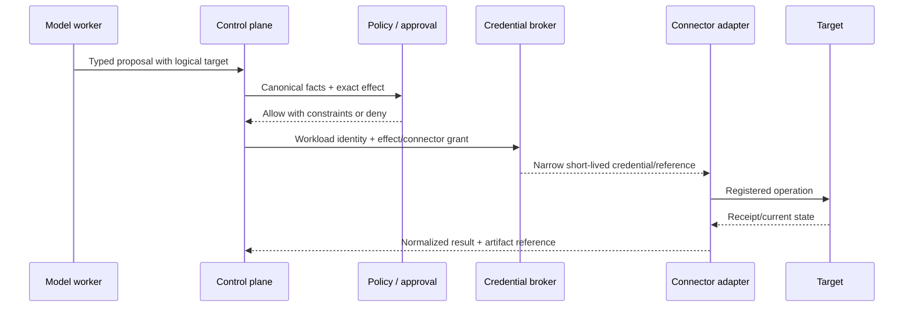

# Security, Privacy, Identity, and Tenant Isolation

> **Purpose:** Bound the blast radius of a system that can observe sensitive enterprise relationships and may submit access changes.

## Core security invariant

Untrusted content and model output cannot change identity, tenant, policy, approval, credential, connector, target, or effect authority.

Identity-governance data is unusually sensitive: it reveals privileged people and workloads, organizational relationships, application inventory, resource ownership, security roles, access paths, exceptions, and possible lateral-movement routes. A read-only compromise can be severe even when no grant is made.

## Separate identities

| Identity | Established by | Used for | Never substituted by |
| --- | --- | --- | --- |
| Initiating human/service | Organization's authentication/federation system | Task admission and requester lineage | Name, email text, chat claim, model inference |
| Beneficiary subject | Authoritative issuer + tenant + stable subject binding | Review/proposal target | Requester identity unless explicitly identical and policy permits |
| Reviewer/approver | Strong authenticated session + current authorization | Accountable decision | Email reply, delegated model, shared account |
| Agent workload | Workload identity platform | Calling control-plane services | Model name or friendly agent label |
| Run/case | Application-issued immutable IDs | Scope, budgets, audit, cancellation | Conversation/thread alone |
| Connector client | Credential broker and target registration | One source, tenant, operation set, audience, lifetime | Ambient host credentials or user bearer token |
| Downstream actor | Target's recorded principal/delegation representation | Target audit and enforcement | Generic shared administrator where avoidable |

[NIST SP 800-63-4](https://csrc.nist.gov/pubs/sp/800/63/4/final) covers identity proofing, authentication, and federation for users of online systems. It does not authorize this agent to recover accounts or infer identity from conversation. Those tasks stay with the organization's IdP/help-desk process.

## Authorization tuple

Evaluate at admission, proposal, approval, and commit:

```text
actor
× tenant
× purpose
× subject type and canonical subject
× resource and environment
× operation/effect class
× data fields
× constraints (time, amount/count, graph/target version)
× obligations (approval, logging, verification, retention)
× current policy/revocations
```

The model contributes no field to this tuple without deterministic resolution and validation.

NIST zero-trust guidance supports resource-focused, explicit authentication and authorization rather than implicit trust from network location. OAuth components can protect connector calls, but deployment details matter. [RFC 9700](https://www.rfc-editor.org/rfc/rfc9700.html) is the current OAuth 2.0 security BCP; use audience/resource restriction, secure client authentication, sender-constraining where supported and appropriate, short lifetimes, and least privilege. [RFC 8693](https://www.rfc-editor.org/rfc/rfc8693.html) defines token exchange mechanics; it does not by itself prove safe delegation. The authorization server and application policy must restrict who may exchange what for which target.

## Credential-broker pattern



- Credentials never enter prompts, working memory, tool results, traces, or review packets.
- Read and write credentials are separate; production and non-production are separate.
- Connector adapters allow only registered destinations and operations.
- Long-lived SCIM bearer tokens or vendor secrets, when unavoidable, stay in a secret manager and are rotated, monitored, and scoped as tightly as the provider supports.
- The broker can deny, revoke, and quarantine independently of the model/workflow.
- A connector cannot use a token intended for another audience/resource/tenant.

## Threat model

| Threat | Attack or failure path | Required controls |
| --- | --- | --- |
| Conversational identity spoofing | Request says “I am the CFO” or names another employee | Ignore for binding; authenticated actor and authoritative subject resolver only |
| Correlation collision | Same display name/email alias links wrong account/person | Stable issuer IDs, uniqueness checks, ambiguity state, steward review, effect block |
| Source compromise/poisoning | HR, sponsor, CMDB, or IGA data manipulated | Source authentication, provenance, anomaly/cross-source checks, high-risk event verification, incident route |
| Prompt injection | Application/group description, ticket, justification, owner comment, or document instructs the model | Treat all source text as data; typed lanes; no model-visible write tools; output validation; policy outside model |
| Entitlement-graph reconnaissance | Broad query reveals privileged users/resources across organization | Purpose/field/resource projection, row/path limits, per-tenant authorization, audit, anomaly detection |
| Cross-tenant confused deputy | Tool argument or source record changes tenant/target | Tenant derived from authenticated case, not model; adapter partitioning; hard row-level/cell isolation; invariant tests |
| SoD evasion | Grant through nested group, alternate role, service identity, or local target assignment | Effective-path analysis, full target reconciliation, policy over all subject types, source coverage disclosure |
| Approval manipulation | Model hides inherited permissions or changes payload after approval | Evidence-first UI, canonical effect digest, immutable proposal, commit-time comparison, approver authority check |
| Approval capture/self-review | Requester controls manager/owner/delegate route | Versioned authoritative ownership, self/related-party SoD rules, fallback governance, route audit |
| Stale approval | Termination, move, policy, graph, owner, or target changes after approval | Expiry and state/version binding; current-policy and target revalidation |
| Overbroad connector credential | Compromise grants directory/tenant administration | Separate identities/credentials, least scopes, registered endpoints, broker, network egress, I5 admin boundary |
| Blind effect retry | Timeout creates duplicate or reverses newer state | Semantic operation ID, expected version, unknown state, reconciliation |
| Local/manual grant invisible to IGA | Central graph says revoked while target still grants access | Target-authoritative reads, full reconciliation, coverage map, uncovered-system register |
| Privileged escalation via agent tools | Agent installs connector, changes role model, creates token, or alters audit | I5 proposal-only; separate admin workflow; immutable registry; no such tools in reasoning plane |
| Telemetry/evaluation leak | Prompts/traces/corpora replicate identity graph and review comments | Structured minimal telemetry, redaction before export, separate retention/access, governed eval extracts |
| Historical-bias laundering | Past approvals or peer access become model precedent | Disable live episodic memory; deterministic current policy; evaluate slices and reviewer independence |
| Denial of governance | Webhook storm, giant group, hot tenant, review flood blocks leaver lane | Admission control, quotas, priority queues, page/graph budgets, tenant cells, reserved critical capacity |
| Insider cover story | Fluent model summary is used to justify predetermined grant | Evidence links, visible uncertainty, recommendation provenance, independent reviewer, decision reason and audit |
| Privileged insider / audit tampering | Operator broadens a connector, edits an owner/approval, suppresses a denial, or deletes evidence | Dual control for I5 changes, append/supersede records, immutable release/connector registries, independent audit export, impact queries and alerts |
| Dependency or connector supply-chain compromise | SDK, workflow package, container, connector update, schema/spec artifact, or model-provider change gains data/effect reach | Pinned reviewed dependencies/images/specs, provenance/SBOM and signature policy, isolated build, secret scan, least egress/credential, staged conformance, rollback/quarantine |
| Stolen session/token/secret | Bearer token, refresh token, application cookie, PAT, client secret, key, or checked-out credential is replayed | Sender/audience restriction where supported, short lifetime, broker/HSM/secret manager, log redaction, rotation/revocation, issuer plus application/PAM session containment |

Map relevant real incidents/techniques from authoritative threat intelligence, but do not treat any catalog as complete. Valid accounts and account manipulation are useful MITRE ATT&CK categories; the workload threat model above remains application-owned.

## Prompt-injection and untrusted data

Every source can contain attacker-controlled text: HR free text, job titles, group/application descriptions, access-request justification, ticket comments, resource names, documentation, and connector errors.

Enforce:

1. connector results arrive in typed data structures with trust/provenance metadata;
2. authority instructions and allowed actions are compiled before untrusted content;
3. untrusted text cannot introduce tool names, targets, credentials, policy, or approvals;
4. the model has bounded read tools only; the control plane converts a proposal into a separate effect record;
5. identifiers and selectors are resolved outside the model;
6. outbound explanation is checked for secrets, unnecessary personal data, unsupported claims, and cross-subject disclosure;
7. injection attempts are preserved as security evidence and added to adversarial evaluation.

Model classifiers and instruction hierarchy reduce risk; they are not authorization controls. See [Prompt injection and untrusted data](../../security/prompt-injection-and-untrusted-data.md).

## Supply-chain and administrative integrity

The deployment trusts more than application code: connector images, SDKs, API schemas, workflow definitions, policy bundles, graph/normalizer rules, prompt/compiler artifacts, model endpoints, CI runners, base images, and vendor control planes can all change effective reach.

- Inventory every executable/configuration artifact in the release manifest with digest, origin, reviewer, build identity, dependency/SBOM reference, signature/attestation status where used, and promotion evidence.
- Pin connector SDK/API versions or generated schemas; review generated clients as code. A provider documentation update does not automatically change a capability registry.
- Build in an isolated, least-privileged pipeline; protect signing/release credentials; require review for workflow, policy, connector scope, egress, secret, and model-route changes.
- Scan dependencies, containers, templates, prompts, examples, and test artifacts for secrets and known vulnerabilities; define patch and emergency-quarantine ownership.
- Run connector conformance, negative authorization, tenant, pagination/deletion, effect, and reconciliation tests before any dependency or vendor-profile promotion.
- Restrict plugin/extension loading and outbound destinations. Runtime discovery cannot install a connector, follow an arbitrary URL, load remote code/schema, or add a tool.
- Keep effect workers unable to change their own registry, credentials, policy, audit sink, deployment, or release approval.
- Monitor administrative and support-plane changes independently of application traces. I5 changes require strong authentication, accountable actor, second-party control where policy requires it, before/after state, and tamper-evident export.
- Maintain a fast kill path by connector, dependency/image, model route, release, tenant, operation, and credential; test impact queries and rollback without deleting history.

[NIST SP 800-218](https://csrc.nist.gov/pubs/sp/800/218/final) provides secure-software-development practices; [NIST SP 800-161 Rev. 1 Update 1](https://csrc.nist.gov/pubs/sp/800/161/r1/upd1/final) addresses cybersecurity supply-chain risk management. Neither document proves a vendor or artifact is safe; local acquisition, build, release, and runtime evidence remains necessary.

## Tenant and environment isolation

### Minimum tenant boundary

- tenant comes from authenticated admission and immutable case state;
- every store key, queue message, cache key, artifact, event, trace, and connector registration includes tenant;
- graph queries require tenant at the API and storage layers;
- credentials and endpoints are tenant/environment specific;
- connector workers run in per-tenant or cell-scoped pools according to risk;
- no global semantic cache contains raw identity content;
- batch manifests cannot contain mixed tenants;
- support access is just-in-time, audited, time-limited, and separately approved;
- backup, restore, export, deletion, and DR preserve tenant boundaries.

For high-consequence customers or jurisdictions, separate cells/accounts/projects/keys and regional stores may be required. Row-level filters alone are not a universal isolation guarantee.

### Environment separation

Never copy production entitlement data to development by default. Use synthetic graphs or formally minimized/redacted test extracts. Production connectors, credentials, queues, artifacts, and model-provider projects/accounts are isolated from test. A release cannot promote by pointing a staging worker at production sources.

## Privacy and data governance

### Data inventory

| Data | Typical sensitivity | Default model-context posture |
| --- | --- | --- |
| Stable subject/account IDs | Linkable identity data | Pseudonymous canonical IDs where possible |
| Name/email/org/manager | Personal and organizational relationship data | Include only fields necessary for the review task |
| Roles/permissions/resources | Security-sensitive access map | Bounded paths, no broad dump |
| Activity/last used | Behavioral data with coverage limitations | Aggregate/minimize; disclose observation window |
| Access-request justification/comments | May contain personal, legal, health, or business-sensitive data | Extract approved fields; untrusted; redact irrelevant content |
| SoD/exception history | Control-sensitive and potentially accusatory | Need-to-know; separate allegation from confirmed result |
| Reviewer decision/comments | Personnel and control evidence | Restricted; do not use as live model memory |
| Credentials/tokens/secrets | Authentication secret | Never in model context or telemetry |

Where GDPR applies, Article 5 principles such as purpose limitation, minimization, accuracy, storage limitation, integrity/confidentiality, and accountability affect prompts, graph stores, artifacts, traces, caches, evaluation sets, and backups—not only the source database. Applicability, lawful basis, rights, employment rules, international transfer, retention, and automated-decision obligations require qualified privacy/legal review. This blueprint makes no compliance guarantee.

### Processing rules

- document purpose and allowed fields per workflow and connector;
- prefer references and structured facts over full records;
- keep model-provider data use, retention, residency, subprocessors, abuse monitoring, and deletion behavior in the deployment decision record;
- do not train or fine-tune on review history without a separate purpose, authority, minimization, and rights analysis;
- propagate correction, merge/split, retention, deletion, and legal hold across graph projections, artifacts, caches, evaluation corpora, and backups according to policy;
- make subject access/export outputs safe: access graphs can include information about other people, security controls, and confidential resources;
- separate audit retention from diagnostic retention;
- encrypt in transit and at rest with key ownership/isolation appropriate to the deployment;
- record access to the governance data itself.

## Privileged and non-person identities

Service principals, workloads, agents, API clients, shared accounts, and emergency identities require:

- typed identity class;
- accountable owner and sponsor;
- purpose and dependent service;
- credential authority/rotation reference without credential content;
- allowed resources and environments;
- lifecycle/expiry and review cadence;
- last-observed-use signal plus coverage;
- prohibited interactive use where applicable;
- break-glass monitoring and after-use review;
- owner-transfer procedure on personnel change.

An inactive-person heuristic must not be reused for service identities. Privileged access remains under PAM/security controls, with this agent proposal-only.

## Evidence, audit, and telemetry boundaries

Required control evidence should establish who/what/when/where/outcome and link:

- source and graph versions;
- model/prompt/context-compiler/tool/release versions;
- observations and evidence refs;
- policy/SoD results;
- reviewer/approver identity and authority result;
- exact effect digest and operation ID;
- provider receipt and target verification;
- exception, correction, and incident links.

Do not store private chain-of-thought. A concise typed rationale plus evidence and decision facts is more defensible and less sensitive. Traces can be sampled or dropped; audit evidence required by policy cannot.

## Security release checklist

- [ ] User, beneficiary, reviewer, workload, run, connector, and downstream identities are distinct.
- [ ] Conversation and model output cannot establish identity or tenant.
- [ ] Authorization evaluates actor, purpose, resource, operation, data, constraints, obligations, and current policy.
- [ ] Read/write and environment credentials are separated and brokered outside the model.
- [ ] Connector egress is allowlisted and credentials are audience/resource/tenant bounded where supported.
- [ ] Untrusted content is isolated from authority and effect creation.
- [ ] Graph/query/result limits prevent broad reconnaissance.
- [ ] Tenant isolation covers data, queues, caches, artifacts, telemetry, backup, restore, and support.
- [ ] Privileged/control-plane changes remain I5 proposal-only.
- [ ] Privacy purpose, minimization, retention, correction, deletion, residency, and provider processing are approved.
- [ ] Audit evidence is unsampled where required and separate from diagnostic traces.
- [ ] Incident controls can pause effects, revoke credentials, quarantine a connector/release, and query impact without the model.
- [ ] Dependencies, images, connectors, policy/workflow artifacts, model routes, and administrative changes have provenance, review, staged tests, rollback, and independent audit.

## Related guides

- [Blueprint overview](README.md)
- [Approvals, effects, reconciliation, and recovery](05-approvals-effects-reconciliation-and-recovery.md)
- [Evaluation, observability, and failure injection](07-evaluation-observability-and-failure-injection.md)
- [Agent threat model](../../security/agent-threat-model.md)
- [Permissions, sandboxing, and secrets](../../security/permissions-sandboxing-and-secrets.md)

## Selected sources

- [NIST SP 800-207: Zero Trust Architecture](https://csrc.nist.gov/pubs/sp/800/207/final)
- [NIST SP 800-63-4: Digital Identity Guidelines](https://csrc.nist.gov/pubs/sp/800/63/4/final)
- [NIST SP 800-53 Rev. 5](https://csrc.nist.gov/pubs/sp/800/53/r5/upd1/final)
- [OAuth 2.0 Security BCP, RFC 9700](https://www.rfc-editor.org/rfc/rfc9700.html)
- [OAuth 2.0 Token Exchange, RFC 8693](https://www.rfc-editor.org/rfc/rfc8693.html)
- [CISA/NSA IAM best practices](https://www.cisa.gov/sites/default/files/2023-12/ESF%20IDENTITY%20AND%20ACCESS%20MANAGEMENT%20RECOMMENDED%20BEST%20PRACTICES%20FOR%20ADMINISTRATORS%20PP-23-0248_508C.pdf)
- [NIST Privacy Framework](https://www.nist.gov/privacy-framework)
- [GDPR consolidated text](https://eur-lex.europa.eu/eli/reg/2016/679/2016-05-04)
- [W3C PROV overview](https://www.w3.org/TR/prov-overview/)
- [NIST SP 800-218: Secure Software Development Framework 1.1](https://csrc.nist.gov/pubs/sp/800/218/final)
- [NIST SP 800-161 Rev. 1 Update 1: Cybersecurity Supply Chain Risk Management](https://csrc.nist.gov/pubs/sp/800/161/r1/upd1/final)
