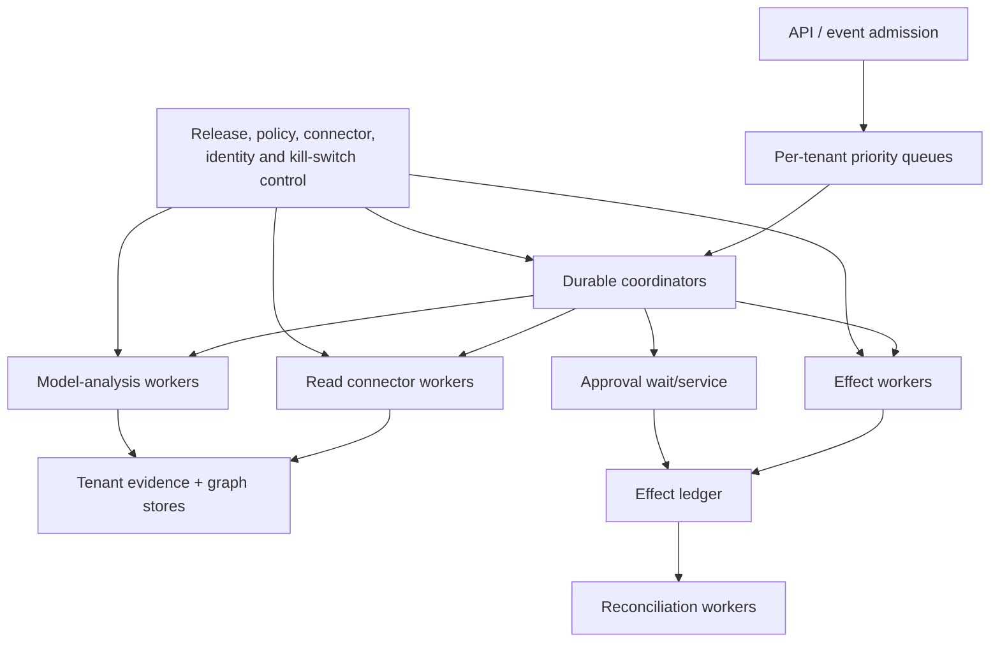
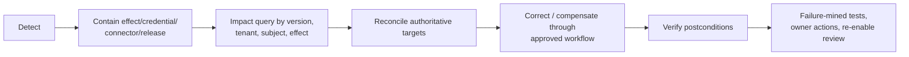
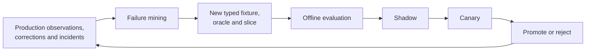

# Deployment, Scale, Operations, Cost, and Evolution

> **Purpose:** Deploy the blueprint as a recoverable multi-tenant service, operate it under connector and human constraints, and upgrade the complete behavior bundle safely.

## Deployment shape

Prefer a regional/cell-based service with separate control and execution planes.



Use separate deployments and identities for:

- admission/control coordination;
- read ingestion and graph projection;
- model analysis with no external write credential;
- approval integration;
- effect dispatch with narrow connector credentials;
- target reconciliation;
- offline evaluation and data preparation;
- administrative I5 changes.

A small single-tenant deployment may combine processes, but it must preserve logical identities, credential boundaries, durable state, and independent pause/revoke controls.

## Runtime selection

| Need | Suitable default |
| --- | --- |
| Few case types, short waits, strong database ownership | Explicit database state machine plus queue/workers |
| Long approval waits, timers, retries, signals, many active cases | Durable workflow runtime with tested replay/versioning semantics |
| Existing mature IGA campaign/lifecycle engine | Extend through supported APIs/events; avoid duplicating its state |
| High-throughput ingestion/projection | Stream/queue consumers plus idempotent projector and snapshot manifests |
| Open-ended model graph framework | Usually unnecessary; use only inside a bounded analysis step if evaluation proves value |

The workflow engine does not guarantee exactly-once target effects. Keep the effect ledger and reconciliation design regardless of runtime.

## Workload classes and priority

Partition work by consequence and latency, not only source:

| Lane | Examples | Scheduling policy |
| --- | --- | --- |
| P0 — critical containment/verification | Immediate leaver, privileged access still active, cross-tenant/unauthorized effect | Reserved capacity, short deadline, page/on-call escalation |
| P1 — expiry and approved revocation | Time-bound access expiry, mover conflict removal, unknown effect | Deadline-aware priority, protected from bulk starvation |
| P2 — interactive governance | Access request/review item preparation, reviewer refresh | User-visible latency objective, bounded concurrency |
| P3 — campaign/bulk analysis | Scheduled access reviews, orphan sweeps, full graph recompute | Chunked, preemptible, tenant-fair |
| P4 — maintenance/offline | Full reconciliation, evaluation replay, historical export | Lowest priority; run within freshness and recovery objectives |

Never allow a large quarterly campaign to starve termination, expiry, or unknown-effect reconciliation.

## Admission and backpressure

Admission validates tenant, case/event schema, source authenticity, duplicate key, current release, connector state, data purpose, deadline, and resource estimates before queueing.

### Backpressure ladder

1. reject invalid/unauthorized work;
2. coalesce repeated change hints for the same subject/source while preserving evidence IDs;
3. cap per-tenant and per-connector concurrency;
4. delay low-risk refresh and bulk analysis;
5. reduce model enrichment while preserving deterministic findings and human packets;
6. split/slow campaigns and suspend optional usage enrichment;
7. pause new grants before revocations/expiry/verification;
8. route critical cases to established manual/IAM runbooks;
9. shed only work whose business deadline/policy permits it, with explicit durable status.

Do not retry inside the adapter, workflow, queue, and SDK independently. Assign retry ownership per error class and enforce one total attempt/deadline budget.

### Fairness

Use weighted quotas and reserved critical capacity per tenant/cell. Track queue age by risk and deadline. A hot tenant's webhook storm or million-member group must not consume all connector/model/graph/reviewer capacity. Avoid global FIFO.

## Capacity model

Model each binding resource separately:

```text
source read demand = changed records + scheduled full-reconciliation records
graph demand = normalized edge writes + affected-path recomputation
model demand = cases requiring semantic analysis × trials/retries
human demand = review/approval items × median and tail handling time
effect demand = approved operations + reconciliation reads
```

Throughput is bounded by the minimum of provider quota, connector latency, worker capacity, database/graph write/query capacity, model quota, approval capacity, and target propagation. Human review is often the actual bottleneck.

Benchmark actual graph shape: nested depth, fan-out, number of alternate paths, policy count, tenant distribution, and churn. Published vendor or Zanzibar scale numbers are not capacity evidence for this implementation.

### Surge and recovery-load budget

Normal steady-state sizing is insufficient. Exercise each surge independently and in combination:

| Surge | Dominant resources | Required control |
| --- | --- | --- |
| Reorganization / HR correction | Subject correlation, affected-path recompute, mover cases, owner/approval routes | Coalesce by subject/source version, fence old effective time, subtract-before-add for high risk |
| Quarterly review launch | Frozen graph reads, packet generation, reviewer assignments/notifications, remediation tail | Precompute bounded paths, split by reviewer capacity, rate-limit notifications, preserve P0/P1 lanes |
| Immediate leaver/security event | Directory/PAM/application writes, token/session actions, high-frequency verification reads | Reserved effect/reconciliation capacity, pre-qualified emergency routes, target-specific fan-out budget |
| Provider recovery after outage | Queued writes plus status/read reconciliation and source refresh | Reconcile unknowns before new writes, ramp concurrency below provider quota, preserve ordering/fences |
| Graph rebuild / schema migration | Source reads, evidence replay, edge writes, path/policy recompute, validation | Build isolated candidate epoch, compare manifests/oracles, publish atomically, keep last good read-only epoch |
| Regional/cell recovery | State restore, workflow resume, credential re-establishment, unknown-effect scan, backlog replay | Recovery admission mode, tenant/region policy, priority restore, duplicate-effect fences and impact query |

Budget recovery explicitly:

```text
recovery work
  = unknown-effect reconciliation
  + missed source windows/full snapshots
  + workflow/timer catch-up
  + graph rebuild and affected-policy recompute
  + overdue approvals/reviews/expiry
  + required audit/telemetry backfill

safe recovery rate
  <= min(provider quota - reserved live demand,
         database/graph headroom,
         verifier capacity,
         human exception capacity)
```

Recovery traffic is not free headroom. If drain time threatens a critical deadline, pause new grants and bulk/campaign work before reducing verification or reconciliation. Publish backlog age and forecast by lane/tenant/connector, not only item count.

## Graceful degradation

| Dependency failure | Continue | Pause/disable |
| --- | --- | --- |
| Model provider unavailable | Source ingestion, graph, deterministic JML/SoD/expiry, queues, target verification, human review with structured facts | Model summaries and recommendations |
| One source stale | Unaffected tenants/sources; cases that do not require it | Decisions/effects whose completeness contract requires it |
| Graph projector degraded | Evidence ingestion; last known-good read-only graph with visible age | New effect proposals requiring changed scope; graph-based claims beyond cutoff |
| Approval service unavailable | Evidence preparation, queues, reconciliation | Consequential effect dispatch |
| Effect connector unavailable | Analysis, decisions, durable approved queue, other connector cells | Affected dispatch; escalate deadlines/manual fallback |
| Credential broker unavailable | Read-only functions whose separately brokered credentials remain valid by policy | New credential issuance/effects; never fall back to ambient credentials |
| Telemetry backend unavailable | Authoritative execution/audit records | Diagnostic export; alert locally |
| Region/cell unavailable | Other cells; approved failover | Cross-region processing that violates data/credential boundaries |

The degraded state must be visible in review packets and APIs.

## Data partitioning and graph scale

- partition first by tenant and environment;
- within a tenant, partition/source-index by canonical entity and resource domain while retaining cross-domain path capability where policy requires it;
- use incremental affected-subgraph recomputation rather than global closure on every edge;
- publish graph epochs only after completeness/integrity checks;
- bound interactive path count/depth and return `truncated`/`incomplete` explicitly;
- use offline/batch analysis for broad role mining or campaign construction;
- keep source evidence/artifacts in cheaper governed storage and compact normalized state separately;
- design full rebuild from authoritative sources/evidence as a recovery primitive;
- do not rely on an in-memory graph as the only state.

## Release manifest

Version the full behavior bundle:

```yaml
release_manifest:
  release_id: iag-agent-2026-08-31.1
  application_commit: sha256:...
  workflow_definitions:
    mover: mover-v4
    access_review: review-v3
  state_schema: 5
  event_schema: 3
  graph_schema: 2
  normalizer_rules: 9
  correlation_rules: 6
  policy_bundles:
    core: iam-policy-2026-08-20
    finance_sod: finance-v6
  connector_profiles:
    hris-workforce: 4
    erp-prod-read: 3
    erp-prod-write: 1
  context_compiler: 7
  model_route:
    provider_product: deployment-specific
    pinned_model_or_snapshot: deployment-specific
    parameters_digest: sha256:...
    prompt_digest: sha256:...
  tool_registry: 11
  approval_policy: 8
  credential_policy: 4
  telemetry_schema: 3
  evaluation_suite: eval-2026-08-31
```

Never use an unrecorded `latest` alias in a production behavior claim. Provider model identifiers, snapshots, availability, pricing, and data terms must be verified at deployment time.

## Release pipeline

1. schema, state-machine, policy, graph, and connector-fixture tests;
2. end-to-end representative and human-review evaluation;
3. adversarial, privacy, tenancy, effect, crash, load, and DR suites;
4. compatibility tests against active case/state/graph versions;
5. offline replay of frozen cases without changing historical decisions;
6. production shadow with read-only outputs and no effects;
7. canary by tenant, workflow, connector, subject/resource class, and authority level;
8. gradual ramp with explicit stop/rollback criteria;
9. independent promotion of any new I3/I4 effect cell.

Pin active cases or explicitly migrate them. Do not re-run old model decisions during replay. A policy change needs defined effective-time behavior: new cases only, next decision boundary, or immediate safety revocation. The control owner approves that semantic.

## Upgrade decision table

| Change | Minimum checks | Owner |
| --- | --- | --- |
| Model/prompt/parameters | Full model-analysis, adversarial, repeated, cost/latency, reviewer blind test; shadow/canary | Service/model owner |
| Context compiler/compaction | Preservation invariants, privacy/tenant projection, omission and continuity tests | Service/security/privacy owners |
| Connector/API/profile | Capability/conformance, pagination/deletion, rate/error, receipt/status, reconciliation, credential scope | Connector/IAM owner |
| Graph/normalizer/correlation | Rebuild comparison, path/correlation oracle, active-case impact, merge/split migration | Identity-data owner |
| Policy/SoD/approval route | Deterministic tests, control-owner sign-off, active approvals/cases impact | Control/resource owner |
| Tool/effect schema | Backward compatibility, risk tier, idempotency, target postconditions, replay | IAM/service owner |
| Workflow/runtime | Replay/versioning, timers/signals, crash boundaries, old-run migration | Platform/service owner |
| Privacy/retention/provider terms | Data map, purpose, residency, deletion/export, contract/legal review | Privacy/legal/vendor owner |

## Rollback and forward-recovery matrix

Rollback means restoring a safe behavior bundle; it cannot unmake an external effect already committed.

| Changed component | Safe rollback / forward recovery | What must remain pinned or reconciled |
| --- | --- | --- |
| Model, prompt or route | Stop route, use previous manifest or deterministic/no-model packet; re-run only non-authoritative analysis when appropriate | Historical proposal/rationale and original release; never rewrite decisions |
| Context compiler/compaction | Rebuild context from durable state with last good compiler; reject incompatible receipt | Source/event watermarks, approvals/clocks, pending/unknown effects, invariants hash |
| Connector/read normalizer | Quarantine new profile; keep raw evidence; rebuild candidate graph with previous parser or corrected forward parser | Source cursor/profile/query binding, last good epoch, affected-case impact set |
| Effect adapter/credential | Pause effect cell and revoke credential; reconcile every reserved/dispatched/unknown operation before re-enable | Operation ID/digest, provider request/receipt, exact target postcondition |
| Workflow/state schema | Route new cases to prior compatible worker; pin active cases or run reviewed state migration | Timers, signals, approvals, cancellations, effect boundaries and workflow history |
| Policy/SoD/approval route | Apply explicit effective-time rule; tighter emergency policy may hold future effects, while historical evidence remains immutable | Original decision policy plus current commit policy and owner approval |
| Graph schema/correlation | Stop affected effects, publish last good epoch read-only, split/merge by new version and impact-query all decisions | Source evidence, canonical identity lineage, assignments and alternate paths |
| Database/cell/region | Restore protected state, fence old writers, scan unknown effects, then admit by priority | RPO/RTO evidence, tenant/region/key boundaries and backlog/reconciliation state |

For a wrong external grant/revocation, use an independently authorized corrective effect with a new operation ID; do not delete the ledger row or call a reverse API as a software rollback. Record business impact, residual access, target verification and incident linkage.

## Incident operating model

Use the organization's incident process. Agent-specific incidents include:

- wrong subject/account correlation;
- cross-tenant or overbroad data exposure;
- unauthorized, duplicate, or wrong-target grant/revocation;
- failed/delayed critical leaver or expiry;
- connector compromise or poisoned source;
- graph epoch incorrectly marked complete;
- approval/SoD policy bypass;
- prompt injection causing unsafe proposal or disclosure;
- sensitive content in model provider, logs, traces, or evaluation store;
- systemic false recommendations or reviewer automation bias;
- evidence loss or inability to reconstruct decisions.

### Containment controls

Independent of the model:

- pause all effects, a tenant, connector, workflow, operation, or release;
- revoke/rotate connector and workload credentials;
- block a model/prompt/tool/connector/policy version;
- quarantine graph epochs or source events;
- force read-only/manual mode;
- enumerate affected cases, approvals, effects, subjects, resources, and evidence;
- preserve artifacts and prevent unsafe retention/deletion changes;
- route established IdP/PAM/target containment actions to authorized operators.

### Incident sequence



Stopping the model does not reverse committed access. Target reconciliation and approved correction are mandatory.

## Disaster recovery

### State priorities

| State | Example RPO posture | Recovery requirement |
| --- | --- | --- |
| Cases, decisions, approvals, effects | No acknowledged committed record loss where architecture permits | Synchronously durable or equivalently protected; restore integrity tested |
| Source evidence/manifest | Reacquirable only within provider retention/availability | Governed artifact storage or repeatable source snapshot |
| Graph projection | Rebuildable | Reconstruct from evidence/sources and compare before publish |
| Diagnostic telemetry | Loss may be acceptable within policy | Never required to execute/reconcile |
| Offline eval corpus | Versioned backup | Restore provenance and access controls |

DR exercises must restore a cell, resume approval waits, resolve unknown effects without duplication, rebuild a graph epoch, preserve tenant/region restrictions, and demonstrate backlog recovery within the business objective.

## Cost model and controls

Track cost per source record/edge, graph query, governed subject, review item, case, verified effect, and tenant—not only model tokens.

| Cost driver | Control |
| --- | --- |
| Full source aggregation | Delta/event ingestion plus risk-based scheduled full reconciliation; never eliminate full checks blindly |
| Graph expansion | Incremental affected paths, bounded interactive queries, materialize proven hot relations |
| Model context/calls | Deterministic prefilter, compact path projection, small-model route for classification only after eval, caching only non-sensitive/versioned results |
| Human review | Risk-based campaigns, actionable revocation roots, better evidence, owner hygiene; do not use auto-approval as a cost shortcut |
| Connector/provider | Quota-aware scheduling, coalescing, shared read snapshots within one authorized purpose, avoid redundant polling |
| Evidence/telemetry storage | Tiered storage, references over copies, separate audit/diagnostic retention, lawful deletion |
| Reconciliation | Prioritize high-risk/changed scopes while preserving a full coverage schedule |
| Incident/exception backlog | Treat as operational debt; surface cost and risk rather than hiding it |

Model spend is often smaller than connector licensing, IGA platform, human review, integration maintenance, evidence retention, and incident cost. Include all of them in build-versus-buy decisions.

## Continuous-evolution loop



### Drift monitors

- source schema/profile/capability and error distribution;
- graph size/depth/fan-out and unexplained paths;
- identity correlation ambiguity/merge/split rates;
- workflow mix, review decisions, correction/appeal rates;
- model abstention, evidence validation, tool usage, token/latency/cost;
- approval delegation/non-response and recommendation-following;
- effect unknown/partial/verification latency;
- tenant/risk slice quality and capacity;
- policy/role/owner churn and exception age.

A drift signal triggers investigation, not automatic policy or model adaptation.

## Operational readiness checklist

- [ ] Control, model, read, effect, reconciliation, evaluation, and I5 administration identities are separated.
- [ ] Queues prioritize critical leaver/expiry/unknown-effect work and enforce tenant fairness.
- [ ] Retry ownership and total budgets are explicit.
- [ ] Degraded modes keep deterministic governance and manual paths usable.
- [ ] Capacity tests include connectors, graph, model, human approval, and reconciliation.
- [ ] Graph rebuild and cell/region recovery are drilled.
- [ ] Combined graph, review, emergency-revocation, provider-recovery and DR load fits a measured recovery budget without starving verification.
- [ ] Full behavior bundle is pinned in a release manifest.
- [ ] Active-case migration and policy effective-time semantics are defined.
- [ ] Shadow/canary never expand authority implicitly.
- [ ] Rollback preserves active-case versions and reconciles committed/unknown external effects instead of pretending they were undone.
- [ ] Out-of-band effect pause, credential revoke, connector/release quarantine, and impact queries work.
- [ ] Cost includes people, products, connectors, storage, evaluation, and incidents.
- [ ] Drift/failure mining adds governed tests without auto-changing policy.

## Related guides

- [Blueprint overview](README.md)
- [Evaluation, observability, and failure injection](07-evaluation-observability-and-failure-injection.md)
- [Queues, scheduling, and backpressure](../../operations/queues-scheduling-and-backpressure.md)
- [Scaling, capacity, and SLOs](../../operations/scaling-capacity-and-slos.md)
- [Deployment, release, and incident response](../../operations/deployment-release-and-incident-response.md)
- [Model routing, cost, and latency](../../operations/model-routing-cost-and-latency.md)

## Selected sources

- [NIST SP 800-61 Rev. 3: Incident Response](https://csrc.nist.gov/pubs/sp/800/61/r3/final)
- [NIST SP 800-207: Zero Trust Architecture](https://csrc.nist.gov/pubs/sp/800/207/final)
- [CISA Zero Trust Maturity Model Version 2](https://www.cisa.gov/resources-tools/resources/zero-trust-maturity-model)
- [Google SRE: Service level objectives](https://sre.google/sre-book/service-level-objectives/)
- [Google SRE Workbook: Alerting on SLOs](https://sre.google/workbook/alerting-on-slos/)
- [Temporal worker versioning](https://docs.temporal.io/production-deployment/worker-deployments/worker-versioning)
- [AWS IAM Access Analyzer concepts and timing limits](https://docs.aws.amazon.com/IAM/latest/UserGuide/access-analyzer-concepts.html)
- [SailPoint account aggregation methods](https://documentation.sailpoint.com/saas/help/accounts/loading_data.html)
