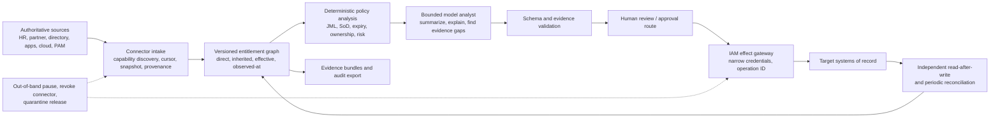
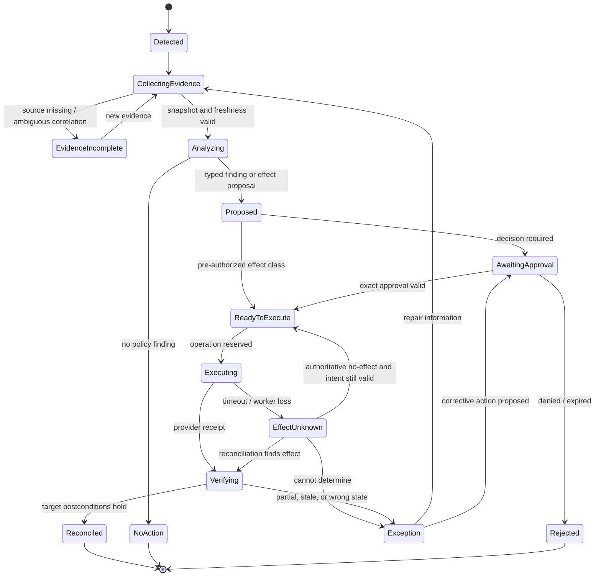

# Production Identity and Access Governance Agent Blueprint

> **Research date:** 2026-08-31  
> **Maturity:** Research-backed draft; requires organization-specific IAM, security, privacy, legal, control-owner, and connector validation  
> **Scope:** Entitlement and relationship-graph evidence, joiner/mover/leaver monitoring, access-review preparation, segregation-of-duties analysis, time-bound access proposals, approval routing, revocation verification, and orphaned-access reconciliation

## Bottom line

Build this system as a **durable identity-governance workflow with a deterministic entitlement graph and a bounded model analyst**. Do not build a conversational identity oracle or give an LLM a directory administrator token.

Authoritative HR, partner, directory, application, cloud-IAM, PAM, and IGA systems own identity and access facts. Versioned policy code owns eligibility, segregation-of-duties (SoD), approval routes, and authority ceilings. Accountable people and the target IAM system make access decisions. The model may explain effective-access paths, summarize evidence, identify missing or contradictory records, prepare a review item, and propose a permitted next action. It cannot establish a person's identity, change policy, attest control effectiveness, or unilaterally grant privileged access.

## The owned boundary

| This blueprint owns | This blueprint does not own |
| --- | --- |
| Preserve source-backed entitlement and relationship evidence | Help-desk password reset, MFA recovery, lost-device recovery, or account unlock |
| Correlate accounts to known identities while preserving ambiguity | Infer that a conversational user is the person named in a request |
| Monitor joiner, mover, leaver, contractor, guest, service-account, and sponsor changes | Become the authoritative HR, directory, PAM, or application system |
| Prepare access-review scope, paths, context, conflicts, and unresolved gaps | Make the reviewer's attestation or claim that a control is compliant |
| Evaluate versioned static and dynamic SoD rules over effective access | Invent SoD policy from prose or resolve business conflicts without the control owner |
| Propose time-bounded, least-privilege grants and route exact approvals | Grant privileged, break-glass, or policy-changing access unilaterally |
| Dispatch approved, bounded effects through an IAM system when enabled | Bypass target authorization, approval, PAM, or change-management controls |
| Verify revocation against authoritative target state and reconcile drift | Treat a queued job, HTTP success, or IGA status alone as proof of revocation |
| Investigate uncorrelated and ownerless accounts without destructive assumptions | Delete an unmatched account merely because correlation failed |

The [IT service desk category](../../research/agent-blueprint-category-registry.md) owns individual recovery incidents. The compliance-audit category tests controls and owns independent attestation. HR owns employment facts; resource and control owners own business need and policy; IAM/PAM platforms enforce approved decisions.

## Non-negotiable invariants

1. **Identity is never inferred from conversation.** Subject identity comes from an authenticated, authoritative binding with issuer, tenant, stable identifier, and freshness.
2. **An account is not a person.** People, workloads, agents, service accounts, shared accounts, break-glass identities, guests, devices, accounts, and credentials remain different entity types.
3. **The graph is evidence, not an omniscient truth claim.** Every node and edge names its source, source key, observation time, ingestion time, schema version, and confidence class (`asserted`, `derived`, `ambiguous`, or `superseded`).
4. **Direct, inherited, eligible, active, and effective access are distinct.** Review and SoD logic must retain the derivation path.
5. **Missing is not revoked.** A record absent from one incremental page can mean filtering, pagination loss, connector failure, delayed propagation, or actual deletion.
6. **Policy executes outside the model.** SoD rules, eligibility, risk tiers, expiry ceilings, approval routes, and protected-access restrictions are versioned deterministic inputs.
7. **Recommendation is not decision.** Model rationale is visibly separated from evidence and from the accountable human or IAM-system decision.
8. **Approval is exact and expiring.** It binds the canonical subject, resource, entitlement, duration, justification, graph/policy versions, target state version, effect digest, approver authority, and use count.
9. **Authorization is rechecked at commit.** Termination, policy change, owner change, new conflict, approval expiry, or target drift invalidates a pending effect.
10. **One semantic intent gets one operation ID.** Retry and resume reuse it; changed scope, duration, or target creates a new intent.
11. **Unknown effect is a durable state.** Timeout after dispatch is reconciled before retry.
12. **Revocation is complete only after postconditions hold.** Verify the target entitlement is absent or inactive, downstream sessions/tokens are handled by the responsible system, and required propagation has completed.
13. **Uncorrelated does not mean orphaned.** Shared, service, emergency, vendor, and intentionally unowned accounts need explicit classification and accountable sponsorship.
14. **The model never sees credentials.** A broker attaches narrow, short-lived connector credentials after authorization.
15. **Audit evidence is not sampled telemetry.** Required records are durable and protected; traces are redacted diagnostic data.
16. **The system degrades to queues and deterministic reports.** A model outage cannot prevent termination processing, expiry, revocation verification, or human review.

## Authority model

Authority is assigned per tenant × workflow × subject type × resource class × effect class, never to the deployment as a whole.

| Level | Permitted capability | Default use |
| --- | --- | --- |
| **I0 — observe** | Read purpose-limited facts and emit source-linked discrepancies | Stage 1 and every new connector |
| **I1 — prepare** | Build review packets, SoD findings, JML cases, and typed proposals | Default useful production posture |
| **I2 — stage** | Create a draft request or non-authoritative ticket; no access change | After target, privacy, and duplicate tests |
| **I3 — approved effect** | Submit an exact, independently approved low/non-privileged grant or revocation through the IGA/IAM system | Reliable v1, one effect class at a time |
| **I4 — pre-authorized low-risk reconciliation** | Repair a narrow, reversible drift class under deterministic policy and budgets | Only after repeated operational evidence and rollback drills |
| **I5 — privileged or control-plane change** | Privileged access, break glass, policy/role-model change, connector credential change, audit-control change | Proposal only; separate accountable administrative path |

Leaver disablement may be urgent and automated by an authoritative lifecycle system, but this agent still does not become the policy authority. It monitors, routes, dispatches only an already authorized effect class, and proves the postcondition.

## Keep four records separate

| Record | Meaning | Example |
| --- | --- | --- |
| **Evidence** | Immutable reference to what a source asserted or returned | HR status event, SCIM resource version, group membership response, policy document digest |
| **Observation** | Normalized interpretation that can be corrected | `account:a17 correlates_to subject:s42`, effective path, suspected orphan, stale connector |
| **Decision** | Policy or accountable human disposition | SoD rule result, reviewer retain/revoke decision, approval/denial with reason |
| **Side effect** | Requested and observed external state transition | Provisioning operation, provider receipt, target verification, compensating request |

An explanation may cite all four but never merge them. In particular, “the agent recommended revoke” is not a review decision, and “the IGA job succeeded” is not target-state evidence.

## Authoritative case lifecycle

Waiting states have deadlines, escalation, reassignment, cancellation, and policy-version behavior. `Reconciled` is a business outcome, not a transport outcome.

## Guide map

| Guide | Decision it supports |
| --- | --- |
| [Boundaries, authority, and stages 0–6](01-boundaries-authority-and-zero-to-production.md) | Whether to build an agent and how to expand capability without expanding authority accidentally |
| [Reference architecture, connectors, and entitlement graph](02-reference-architecture-connectors-and-entitlement-graph.md) | How to ingest partial vendor data and preserve effective-access provenance |
| [State, context, memory, and orchestration](03-state-context-memory-and-orchestration.md) | What survives, what enters a prompt, how compaction works, and why most “memory” is disabled |
| [JML, access reviews, SoD, and time-bound proposals](04-jml-access-reviews-sod-and-time-bound-access.md) | How core governance workflows operate with accountable human decisions |
| [Approvals, effects, reconciliation, and recovery](05-approvals-effects-reconciliation-and-recovery.md) | How one approved intent becomes one verified outcome across unreliable connectors |
| [Security, privacy, identity, and tenant isolation](06-security-privacy-identity-and-tenancy.md) | How to prevent confused-deputy, cross-tenant, injection, credential, and sensitive-graph failures |
| [Evaluation, observability, and failure injection](07-evaluation-observability-and-failure-injection.md) | How to gate capability, policy integrity, recovery, reviewer utility, and SLOs |
| [Deployment, scale, operations, cost, and evolution](08-deployment-scale-operations-cost-and-evolution.md) | How to release, degrade, respond, recover, control cost, and upgrade the behavior bundle |

The dated [research packet](../../research/packets/identity-access-governance-agent-blueprint.md) records the source baseline, decisions, contradictions, maturity limits, and refresh triggers.

## Minimal production slice

Start with one tenant, one authoritative workforce source, one directory, and one low-risk SaaS application. Run read-only. Produce:

- a source-freshness dashboard;
- subject/account correlation with an ambiguity queue;
- one mover or leaver discrepancy workflow;
- a review packet showing direct and inherited access paths;
- one deterministic SoD rule set supplied by a control owner;
- a proposed revocation with no automatic commit;
- target read-back and periodic full reconciliation;
- evidence manifests, redacted traces, and a labeled evaluation set.

Do not start with domain-wide administration, privileged roles, break-glass accounts, financial approval roles, high-volume automatic revocation, policy generation, or a multi-agent topology.

## Promotion gates

| Gate | Non-negotiable evidence |
| --- | --- |
| Identity integrity | No conversational or display-name identity resolution; ambiguous correlations always stop effect paths |
| Graph completeness | Direct/inherited paths, source watermarks, deletions, pagination, and full-reconciliation tests pass |
| Control integrity | Deterministic SoD/eligibility/approval/version tests have zero bypasses |
| Reviewer utility | Representative reviewers can decide from the packet without relying on the recommendation or transcript |
| Effect safety | Duplicate, timeout, crash-after-dispatch, partial provisioning, late event, and stale approval tests reconcile |
| Revocation proof | Target postconditions and maximum propagation windows are defined and measured per connector |
| Security/privacy | Tenant, purpose, field projection, egress, credential, trace, retention, deletion, and incident controls pass |
| Operations | SLOs, capacity, manual fallback, out-of-band pause, connector quarantine, DR, and backlog recovery are drilled |

## Canonical repository dependencies

This area specializes rather than repeats:

- [Agent state and event contracts](../../runtime/agent-state-and-event-contracts.md)
- [Durable execution](../../runtime/durable-execution.md)
- [Tool contracts](../../tools/tool-contracts.md)
- [Tool results, artifacts, and provenance](../../tools/tool-results-artifacts-and-provenance.md)
- [Context engineering](../../context-memory/context-engineering.md)
- [Memory architecture](../../context-memory/memory-architecture.md)
- [Compaction and continuity](../../context-memory/compaction-and-continuity.md)
- [Planning and replanning](../../orchestration/planning-and-replanning.md)
- [Agent threat model](../../security/agent-threat-model.md)
- [Permissions, sandboxing, and secrets](../../security/permissions-sandboxing-and-secrets.md)
- [Idempotency and side-effect safety](../../reliability/idempotency-and-side-effects.md)
- [Trajectory and reliability evaluation](../../evaluation/trajectory-and-reliability-evaluation.md)
- [Observability and tracing](../../evaluation/observability-and-tracing.md)
- [Queues, scheduling, and backpressure](../../operations/queues-scheduling-and-backpressure.md)
- [Scaling, capacity, and SLOs](../../operations/scaling-capacity-and-slos.md)
- [Deployment, release, and incident response](../../operations/deployment-release-and-incident-response.md)

## Selected primary sources

- [NIST SP 800-53 Rev. 5, Release 5.2.0](https://csrc.nist.gov/pubs/sp/800/53/r5/upd1/final)
- [NIST SP 800-162: Attribute Based Access Control](https://csrc.nist.gov/pubs/sp/800/162/upd2/final)
- [NIST SP 800-207: Zero Trust Architecture](https://csrc.nist.gov/pubs/sp/800/207/final)
- [NIST SP 800-63-4: Digital Identity Guidelines](https://csrc.nist.gov/pubs/sp/800/63/4/final)
- [RFC 7643: SCIM Core Schema](https://www.rfc-editor.org/rfc/rfc7643.html)
- [RFC 7644: SCIM Protocol](https://www.rfc-editor.org/rfc/rfc7644.html)
- [RFC 9865: SCIM Cursor Pagination](https://www.rfc-editor.org/rfc/rfc9865.html)
- [RFC 9967: SCIM Profile for Security Event Tokens](https://www.rfc-editor.org/rfc/rfc9967.html)
- [OpenID Shared Signals Framework 1.0 Final](https://openid.net/specs/openid-sharedsignals-framework-1_0-final.html)
- [GAO 2025 Green Book](https://www.gao.gov/greenbook)
- [NCSC identity and access management guidance](https://www.ncsc.gov.uk/collection/10-steps/identity-and-access-management)
- [Zanzibar: Google's Consistent, Global Authorization System](https://www.usenix.org/conference/atc19/presentation/pang)

