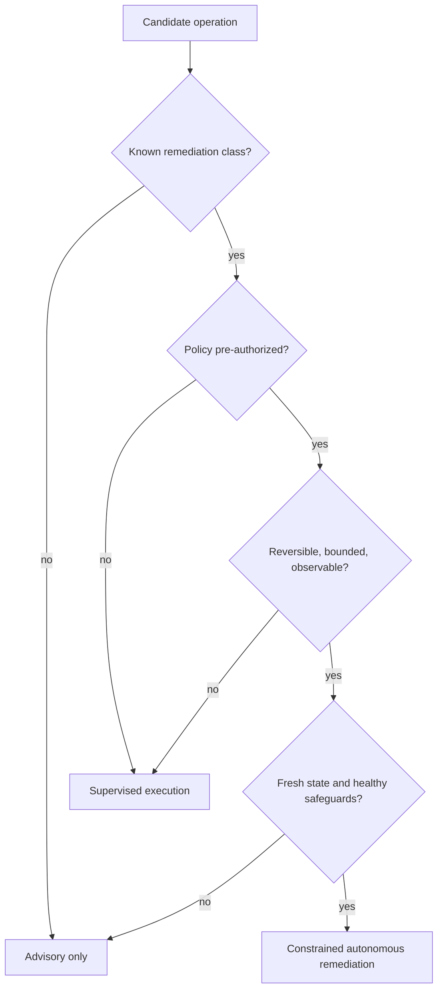

# Purpose, Operating Model, and Requirements

> **Status:** Research-backed production blueprint  
> **Last researched:** 2026-08-31  
> **Scope:** Product boundary, autonomy modes, requirements, and risk classification  
> **Research packet:** [Infrastructure Operations Agent research packet](../../research/packets/infrastructure-operations-agent-blueprint.md)

## Purpose

The agent turns an operator goal or a detected condition into a traceable infrastructure operation:

1. identify the principal, tenant, environment, and intended outcome;
2. gather current evidence through read-only tools;
3. propose a minimal plan against an authoritative inventory snapshot;
4. calculate risk and policy requirements;
5. obtain approval where required and re-authorize at execution time;
6. apply a bounded change through a typed adapter;
7. verify service health and desired postconditions;
8. reconcile ambiguity, record provenance, and communicate the outcome.

Its value is not unrestricted command generation. Its value is compressing investigation and coordination while preserving the controls of a mature operations system.

## Capability ladder

Do not start by implementing the rightmost column.

| Stage | Capability | Required proof before advancing |
|---|---|---|
| Deterministic baseline | Inventory query, dashboard, Terraform/Ansible/GitOps path, or fixed runbook without a model | Source authority, identity, audit, error handling, and operator ownership are known |
| Read-only agent | Compile evidence, diagnose, cite facts, draft a handoff or plan | Tenant isolation, freshness labels, injection resistance, and abstention are measured |
| Supervised single effect | Execute one reversible typed operation on one exact target | Sealed approval, short-lived credential, pre-dispatch record, reconciliation, and independent verification pass fault tests |
| Reliable v1 | Small catalog of single-target or tiny-canary operations in one trust domain | On-call, SLOs, kill switches, restore drill, provider audit correlation, and versioned release bundle are operational |
| Production rollout | Batches across fault domains with enforced budgets | Canary, pause/cancel, partial failure, drift, and telemetry-loss paths are proven |
| Fleet/multi-tenant | Multiple authorities through isolated cells | Fairness, noisy-neighbor, cross-tenant, cell-loss, key separation, and regional recovery tests pass |
| Constrained autonomy | One pre-authorized remediation class | Shadow evidence, low false-positive/harm rate, expiry, review owner, and fast disable path exist |

Advancement is per operation class and trust domain. A production-ready read-only agent does not imply that its write path is production ready.

### Read-only diagnosis runbook

1. Authenticate the requester and derive tenant/read scope before retrieval.
2. Resolve the named resource to canonical IDs; show ambiguity rather than guessing.
3. Compile inventory, desired revision, recent changes, provider status, and service-owned health with freshness/coverage.
4. Separate observations, conflicts, missing visibility, hypotheses, and suggested next checks.
5. Run only allowlisted bounded reads; never convert a “diagnostic” parameter into shell or query-language execution.
6. Cite evidence IDs and timestamps for each material claim.
7. Produce one of: `supported diagnosis`, `ranked hypotheses`, `insufficient evidence`, or `domain handoff`.
8. Store the evidence/context receipt and safe operator summary; do not create a write-capable continuation implicitly.

This flow is useful on its own and should be productionized before effects are added.

## Goals

- Reduce mean time to understand routine infrastructure conditions.
- Produce consistent, reviewable plans and diffs.
- Execute known operations with less credential exposure and smaller blast radius.
- Preserve tenant, environment, and fault-domain boundaries.
- Improve audit lineage from human intent to provider-side event.
- Detect stale plans, drift, partial failure, and uncertain outcomes.
- Escalate early when the evidence, permissions, or recovery path is inadequate.

## Non-goals

- Replacing cloud control planes, Kubernetes controllers, configuration management, or GitOps reconcilers.
- Allowing a model to hold standing administrator credentials.
- Treating arbitrary shell access as the universal infrastructure API.
- Automatically repairing novel incidents whose causal model and postconditions are unknown.
- Inferring authorization from chat text, repository content, alerts, logs, or retrieved documents.
- Providing a guaranteed inverse for every change.
- Using an LLM conversation as the system of record.
- Making destructive data-plane changes through the general operations agent.

## Actors and trust assumptions

| Actor | Trust position | Required control |
|---|---|---|
| Requesting human or service | Authenticated but not automatically authorized | Strong identity, tenant binding, purpose and ticket/incident context |
| Approver | Authorized for an approval class, not necessarily execution | Separation of duties, anti-self-approval, plan-bound decision |
| Model | Fallible and exposed to untrusted data | No credentials or policy authority; constrained inputs and outputs |
| Orchestrator | Trusted to enforce state transitions | Durable state, tamper-evident decisions, fencing and recovery |
| Policy decision point | Authoritative for current permission | Deny by default, versioned policy, decision evidence |
| Credential broker | High-trust security component | Short-lived scoped credentials, no model-visible secret material |
| Tool adapter | Trusted effect boundary | Typed contract, exact target validation, idempotency and verification |
| Provider control plane | External source of effect status | Treat acknowledgements and timeouts explicitly; correlate audit events |
| Target host or cluster | Potentially compromised | Do not trust target-provided instructions or credentials |
| Inventory source | Authoritative only for declared fields and freshness | Coverage, source, version, and observed-at metadata |

## Autonomy is graduated



### Advisory

The agent can query inventory, diagnostics, logs, metrics, change history, and policy documentation. It may draft a plan and commands, but it has no write path. Advisory mode is the correct default while inventory, audit, and verification coverage are being established.

### Supervised execution

The agent constructs and seals a plan. A distinct human approves that exact artifact. The control plane rechecks authorization, freshness, budgets, maintenance window, and health immediately before it issues an operation-scoped credential. This mode covers most routine production work.

### Constrained autonomous remediation

The control plane may execute without a per-run human approval only when a versioned policy has pre-authorized:

- one named remediation type;
- an exact resource class and tenant/environment scope;
- deterministic eligibility and preconditions;
- a maximum target count, concurrency, and disruption budget;
- an approved time window or incident condition;
- an idempotent or safely reconcilable effect;
- independent postconditions and circuit-breaker signals;
- a tested compensation or escalation path;
- an expiry and named owner.

Examples include replacing one unhealthy stateless replica or restarting one known-stuck worker after workload-level health and redundancy checks. IAM changes, network perimeter changes, database primary actions, backup deletion, or broad host patching do not qualify merely because they are common.

## Functional requirements

### FR-1: intent and scope

The system shall record principal, tenant, environment, business purpose, requested outcome, urgency, and relevant change or incident identifier. Ambiguous target expressions must resolve to a previewable, immutable target set before approval.

### FR-2: authoritative evidence

Every evidence item shall carry source, target identity, retrieval time, source version or resource version where available, classification, and freshness limit. The planner must distinguish absence from lack of visibility.

### FR-3: typed plans

A plan shall contain typed operations, dependencies, preconditions, expected effects, postconditions, risk, blast-radius budgets, estimated duration/cost, rollback or compensation, and evidence links. Free-form commands alone are not a plan.

### FR-4: policy and authorization

The system shall evaluate authorization independently of the model and approval UI. It shall bind the decision to the acting principal, tenant, plan digest, policy version, targets, effect class, environment, and expiry.

### FR-5: controlled effects

Writes shall use a registered adapter version and a contract that supports an operation ID, idempotency or reconciliation strategy, timeout, structured status, redacted result, and postcondition verification.

### FR-6: rollout

Multi-target plans shall define canary scope, concurrency, fault-domain distribution, error budget, stop conditions, and recovery behavior. The executor—not the model—enforces them.

### FR-7: recovery

After timeout, worker loss, provider throttling, or process restart, the workflow shall resume from durable state without blindly repeating an effect.

### FR-8: audit and provenance

The system shall join request, evidence, model/run version, plan, policy decisions, approvals, credential issuance, tool attempts, provider operation IDs, verification, and final disposition.

### FR-9: human controls

Operators shall be able to pause before new effects, cancel queued work, lower concurrency, revoke authorization, and invoke a separately secured break-glass procedure. Cancellation cannot be presented as undo.

### FR-10: tenant isolation

Every request, state lookup, credential, cache entry, queue message, telemetry record, and target shall be tenant scoped. High-risk or mutually distrustful tenants require separate execution cells and provider trust boundaries.

### FR-11: integration contracts

Provider, CMDB/service-catalog, desired-state, ticket, GitOps, and observability integrations shall declare authoritative fields, direction of writes, identity mapping, consistency/freshness semantics, pagination/checkpoint behavior, rate/size limits, failure posture, and audit correlation. A ticket comment, dashboard label, or model-produced integration payload cannot grant authority.

### FR-12: domain handoffs

Network, database, deployment, incident-command, FinOps, and IAM work shall retain its domain owner. Cross-domain work uses a typed handoff that records the accepted request, owner, scope, deadline, evidence returned, and whether the infrastructure workflow may resume. An infrastructure plan cannot silently expand into another domain's privileged operation.

## Quality requirements

| Property | Requirement |
|---|---|
| Safety | Deny on missing identity, stale plan, unknown target, unavailable policy, expired approval, or unhealthy safeguard |
| Reliability | Persist before and after effect dispatch; reconcile uncertain effects; fence concurrent writers |
| Availability | Read-only diagnosis may degrade independently from writes; write safety components fail closed |
| Performance | Interactive reads should favor bounded parallelism and cached inventory with explicit staleness |
| Scalability | Partition queues and limits by tenant, provider, account/project/subscription, region, and effect class |
| Security | No long-lived credentials in prompts, logs, traces, plan artifacts, or worker disks |
| Auditability | All decisions and effects correlate through stable IDs and immutable timestamps |
| Explainability | Operator output cites evidence and distinguishes observation, inference, proposal, and executed fact |
| Portability | Provider-specific behavior lives behind adapters without erasing provider semantics |
| Testability | Every effect adapter has contract, replay, fault-injection, and provider-sandbox tests |

## Risk model

Risk is evaluated from the operation and its current context:

```text
risk = effect severity
     × target breadth
     × privilege
     × uncertainty
     × irreversibility
     × tenant criticality
     × control-plane coupling
```

The implementation may use discrete scores, but a low numeric total must never override categorical prohibitions.

### Risk-raising conditions

- inventory coverage below the required threshold;
- an unbounded selector or target-set growth since approval;
- stale configuration or health evidence;
- direct shell required where a typed API exists;
- a change to identity, trust, routing, firewalls, admission, or the agent's own controls;
- unavailable provider audit or independent verification;
- an untested restore path;
- cross-region, cross-account, cross-cluster, or cross-tenant effect;
- control-plane degradation or an active incident that affects assumptions;
- tool, policy, model, or desired-state revision different from the approved plan.

## Decision matrix

| Change class | Advisory | Supervised | Autonomous | Notes |
|---|---:|---:|---:|---|
| Inventory and health query | Yes | Not needed | Yes | Redact secrets and rate limit |
| Restart one redundant stateless unit | Yes | Yes | Conditional | Must check redundancy, disruption budget, and recovery |
| Deploy an already-approved immutable release | Yes | Yes | Conditional | Native rollout controller remains authoritative |
| Patch a canary host group | Yes | Yes | Rare | Window semantics and reboot behavior require verification |
| Edit IAM/RBAC or trust policy | Yes | Yes | No | Separate privileged workflow and review |
| Firewall or route change | Yes | Yes | No | Connectivity loss can remove recovery path |
| Database failover or schema operation | Yes | Specialist only | No | Dedicated data-system runbook |
| Delete storage, backups, keys, or audit data | Yes | Dedicated ceremony | No | Keep out of the general tool registry |
| Break-glass elevation | Explain only | Human procedure | No | Agent cannot approve or mint it |

## Failure posture

| Condition | Required posture |
|---|---|
| Policy engine unavailable | No new write credentials; reads may continue within cached read policy |
| Inventory stale or partial | Explain coverage gap; block affected writes |
| Approval service unavailable | Do not infer approval from tickets or chat |
| Workflow worker restarts | Replay durable decisions; reconcile any dispatched effect |
| Provider returns timeout | Mark uncertain, query provider/target/audit, then decide |
| Verification signal unavailable | Stop rollout; do not claim success |
| Model unavailable | Continue deterministic in-flight recovery; do not start novel planning |
| Audit sink unavailable | Queue locally within bounded encrypted storage or fail closed for writes |
| Tenant identity missing | Reject before retrieval or model invocation |

## Acceptance criteria for the product boundary

The system is not ready for production writes until it can demonstrate:

- a prompt-injected log or host banner cannot widen tools or authorization;
- changing a target after approval invalidates the plan;
- concurrent operations on the same resource are fenced;
- timeout after dispatch does not cause duplicate mutation;
- loss of the model provider does not prevent deterministic recovery;
- provider-side audit events can be joined to the internal effect record;
- a tenant cannot retrieve another tenant's inventory, state, credentials, or traces;
- circuit breakers stop a rollout before the blast-radius budget is exceeded;
- operators can distinguish queued, dispatched, accepted, verified, failed, uncertain, and compensated states;
- break-glass works without the normal agent path and produces an alert and review record.

## Reliable-v1 launch checklist

A practical first write release should be deliberately small:

- [ ] One provider authority or cluster class, one production cell, and no cross-tenant selector.
- [ ] At most two named write tools, each reversible or safely reconcilable.
- [ ] One exact target by default; a canary set requires its own tested budget.
- [ ] No IAM, network perimeter, database, storage deletion, data migration, or interactive shell authority.
- [ ] The same executor can run from a deterministic runbook without an LLM.
- [ ] Every run has a ticket/incident reference for coordination, but authorization comes from identity and policy.
- [ ] Unknown outcome, duplicate delivery, worker crash, stale target, audit loss, and missing verification tests pass.
- [ ] On-call can disable the model, tool, tenant, cell, and provider role independently.
- [ ] A restore drill proves recovered state fences old workers and reconciles nonterminal effects before writes resume.

## Sources

- [NIST AI Risk Management Framework](https://www.nist.gov/itl/ai-risk-management-framework)
- [NIST SP 800-207: Zero Trust Architecture](https://csrc.nist.gov/pubs/sp/800/207/final)
- [OWASP LLM06:2025 Excessive Agency](https://genai.owasp.org/llmrisk/llm062025-excessive-agency/)
- [Google SRE: Automation at Google](https://sre.google/sre-book/automation-at-google/)
- [AWS Builders' Library: Automating safe, hands-off deployments](https://aws.amazon.com/builders-library/automating-safe-hands-off-deployments/)
- [Pydantic AI deferred tools and approvals](https://pydantic.dev/docs/ai/tools-toolsets/deferred-tools/)

## Related guides

- [Reference architecture and technology choices](02-reference-architecture-and-technology-choices.md)
- [Security boundaries, secrets, and threat model](06-security-boundaries-secrets-and-threat-model.md)
- [Observability, evaluation, and failure testing](08-observability-evaluation-and-failure-testing.md)
