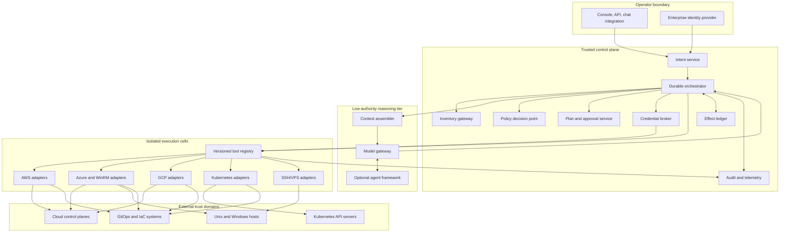
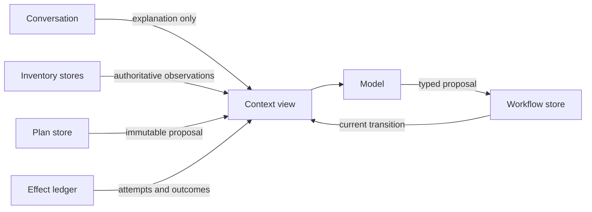

# Reference Architecture and Technology Choices

> **Status:** Research-backed production blueprint  
> **Last researched:** 2026-08-31  
> **Scope:** Components, trust boundaries, runtimes, languages, models, and build alternatives  
> **Research packet:** [Infrastructure Operations Agent research packet](../../research/packets/infrastructure-operations-agent-blueprint.md)

## Selected architecture

Use a **hybrid control plane**: application-owned security and effect semantics around a durable workflow engine, with an optional agent SDK confined to the reasoning tier.

The reasoning tier can suggest a transition. Only the orchestrator may commit one, and only after deterministic checks.

## Component responsibilities

| Component | Owns | Must not delegate to the model |
|---|---|---|
| Intent service | Authentication, tenant binding, request normalization | Principal identity or environment selection |
| Inventory gateway | Canonical resource identity, source precedence, freshness and coverage | Whether missing data means absence |
| Context assembler | Least-data evidence bundles, classification and redaction | Secret filtering based only on a prompt |
| Model gateway | Provider routing, structured response validation, budgets | Tool authorization or success determination |
| Durable orchestrator | State machine, waits, retries, timers, compensation, fencing | Recovery logic generated ad hoc per replay |
| Policy decision point | Current authorization, risk rules, blast-radius constraints | Natural-language permission interpretation |
| Plan service | Immutable plan versions, digests, diffs, expiry | Approval of a changing target selector |
| Approval service | Authenticated decisions and separation of duties | A conversational “yes” without plan binding |
| Credential broker | Operation-scoped credentials and revocation | Passing credentials into model context |
| Tool registry | Versioned schemas, effects, risk, adapter routing | Discovering arbitrary host commands |
| Execution adapter | Provider semantics, idempotency, status and verification | Treating text output as structured truth |
| Effect ledger | Attempts, provider IDs, outcomes, uncertain states | Reconstructing effects from chat history |
| Audit pipeline | Append-only lineage and provider correlation | Logging raw secrets or unbounded tool output |

## Integration contract map

Integrations are typed evidence/effect boundaries, not a shared bag of APIs. Each adapter publishes its owner, source authority, identity mapping, supported versions, consistency/freshness, pagination/checkpoint, rate/size limits, redaction, retry, reconciliation, and fail-open/fail-closed posture.

| Integration | Inbound to the control plane | Permitted outbound | Never infer |
|---|---|---|---|
| Cloud provider | Resource IDs/versions, operation status, audit/request IDs, quotas | Typed API effect with operation-scoped credential | That an acknowledgement means healthy or that a missing read means absent |
| CMDB/service catalog | Ownership, criticality, environment, maintenance metadata, dependency references | Proposed correction or reconciliation case; not silent overwrite | Authorization from an owner string or completeness from a successful query |
| IaC backend | Configuration revision, provider lock, workspace/state lineage, speculative/saved plan | Reviewed run/apply through the established runner | That a speculative plan is the applied artifact or that state is secret-free |
| Kubernetes | UID/resourceVersion, object/status, audit ID, discovery capabilities | Narrow API request using a dedicated service account | That a name identifies the same object or readiness proves service health |
| GitOps controller | Source revision, sync/health, ownership, hook/wave/prune policy | Commit/PR or bounded reconciliation request | That “Synced” means safe, or that forced/pruned changes are reversible |
| Ticket/change system | Human coordination, purpose, links, window request, approvals imported with verifiable identity | Status/evidence update with operation IDs and safe summaries | Authorization from ticket state, comments, labels, or webhook possession |
| Observability | Versioned metric/log/trace/synthetic observations and missing-data state | Correlation IDs, bounded audit-safe events | That silence is health or that telemetry access permits infrastructure access |

The adapter preserves the upstream object's immutable ID and version. If an external system accepts only text, store the text as an artifact and keep the authoritative typed fields in the control plane.

## Three planes

### Reasoning plane

The reasoning plane consumes a bounded evidence package and emits a typed proposal. It has read-only retrieval access through the orchestrator. It never holds a provider session and cannot call write adapters directly.

### Control plane

The control plane evaluates state, policy, approval, budgets, locks, and workflow transitions. It persists decisions before executing them and records effect results before exposing them to further reasoning.

### Execution plane

Execution cells are partitioned by trust domain. A cell exposes a narrow registry and network route for the accounts, subscriptions, projects, clusters, or hosts it owns. A compromised worker should not be able to move laterally to another cell.

## Deployment variants

| Variant | Advantages | Risks | Fit |
|---|---|---|---|
| Central control plane, regional cells | Consistent policy and audit; small regional credentials | Central dependency; cross-region metadata path | Most enterprises |
| Per-tenant full stack | Strong isolation and customization | Higher operational and cost overhead | Hostile or regulated tenants |
| Per-environment stack | Clear production/non-production boundary | Duplicated control services | Smaller organizations |
| On-host agent | Works through restricted networks | Large attack surface and fleet lifecycle | Only when pull-based/native agent is necessary |
| CI/GitOps-only executor | Strong review and desired-state history | Slow incident response; limited imperative repair | Declarative infrastructure |

Do not deploy a universal worker with network reach and credentials for the entire estate.

## Runtime selection

The orchestrator must support durable timers, external signals, deterministic replay or equivalent recovery, activity timeouts, bounded retries, cancellation semantics, versioning, and searchable workflow state.

| Option | Strength | Important limitation | Recommendation |
|---|---|---|---|
| Application database plus job queue | Simple dependencies and full ownership | Team must implement state transitions, timers, fencing, and recovery correctly | Good for a small, bounded operation set |
| Durable workflow engine | First-class waits, retries, signals, histories, and recovery | Replay constraints, history growth, versioning, and operational learning curve | Preferred for multi-step production execution |
| Agent framework persistence | Fast prototyping and human-in-the-loop ergonomics | Usually not an infrastructure transaction ledger or full effect reconciler | Confine to reasoning flows |
| CI/CD pipeline engine | Familiar approvals and artifacts | Awkward interactive diagnosis and long incident sessions | Good executor for predefined changes |

Temporal is a strong example of the durable-workflow category, not a mandate. A managed equivalent or a carefully built database state machine can satisfy the contract. If using replay-based workflows, non-deterministic model calls and infrastructure effects belong in activities; replay-safe workflow code contains decisions and state transitions only.

## Language choices

Use the language that best fits the trusted component rather than forcing one language across the system.

| Language | Best use | Strengths | Trade-offs |
|---|---|---|---|
| Go | Execution adapters, brokers, high-concurrency gateways | Static binaries, strong concurrency, cloud/Kubernetes ecosystem | Less convenient for model experimentation |
| Python | Reasoning services, evaluations, automation integrations | Mature model/ops libraries and fast iteration | Packaging and runtime isolation require discipline |
| TypeScript | Operator APIs, integrations, model orchestration | Strong schema tooling and web ecosystem | Long-running effect workers need careful runtime controls |
| C#/.NET | Windows/WinRM-heavy control and enterprise integrations | Native Windows/PowerShell ecosystem, strong service runtime | Smaller cross-provider agent ecosystem |
| Rust | High-assurance brokers or sandbox components | Memory safety and low overhead | Development cost and ecosystem fit |

A pragmatic baseline is Go or .NET for credential and effect boundaries, and Python or TypeScript for the low-authority reasoning tier. Shared contracts should be generated from versioned JSON Schema, Protobuf, or OpenAPI rather than copied types.

## Model choices

The architecture is model-provider neutral. Select models using measured task performance:

- planning correctness on the actual tool catalog;
- evidence citation and abstention when state is incomplete;
- resistance to instructions embedded in logs, banners, tickets, and resource names;
- structured-output validity and repair rate;
- latency and cost at the context sizes used;
- regional, retention, and data-processing requirements;
- predictable support for tool calls and model/version pinning.

Use separate routing policies:

| Work | Model policy |
|---|---|
| Classification and extraction | Small validated model or deterministic parser |
| Evidence synthesis | Mid-tier model with citations and bounded context |
| Novel plan proposal | Stronger model; supervised only |
| Policy, approval, target resolution, budgets | No model |
| Verification of typed postconditions | Deterministic checks; model may summarize |

Model fallback must not silently change the permitted operation class. A fallback version requires its own evaluation record and release policy.

## Custom, framework, and hybrid alternatives

| Approach | What it buys | What the application still must own | Decision |
|---|---|---|---|
| Custom loop | Minimal dependencies and exact semantics | Everything: schemas, pause/resume, traces, model routing, evaluation hooks | Viable for a small planner |
| Agent framework | Tool schema plumbing, agent loops, tracing, handoffs, approval UX | Identity, authorization, credential scope, effect ledger, recovery, tenancy, provider semantics | Do not use alone for writes |
| Workflow engine with deterministic planner | Strong control and recovery | Model integration and operator interaction | Excellent for predefined remediations |
| Hybrid workflow + agent framework | Fast reasoning development plus durable control | Clear boundary and duplicate-state avoidance | Recommended |

### Framework convenience versus application guarantee

| Framework feature | Useful convenience | Required application guarantee |
|---|---|---|
| “Tool requires approval” | Pauses a run and presents a request | Approver identity, separation of duties, immutable plan digest, expiry, authorization |
| Structured tool call | Parses a named argument object | Schema version, semantic validation, exact resource binding, policy and budgets |
| Checkpoint or thread memory | Resumes model conversation | Durable operation state, effect dispatch record, fencing and reconciliation |
| Retry | Recovers transient model/tool errors | Idempotency key, attempt policy, unknown-outcome handling |
| Guardrail | Screens model input/output | Security policy enforced at credential and adapter boundaries |
| Trace | Debugs agent steps | Append-only audit, tenant isolation, redaction, provider-event correlation |
| Handoff or subagent | Specializes reasoning | No privilege escalation, scoped context and tool registry |

OpenAI Agents SDK human-in-the-loop, LangGraph interrupts, and Pydantic AI deferred tools all provide useful pause mechanics. Their own documentation reinforces the need for application-owned handling: LangGraph restarts an interrupted node, making pre-interrupt effects require idempotency; Pydantic warns that approval is not an authorization boundary against an untrusted client.

## Tool protocol choices

MCP can standardize discovery and invocation at the reasoning boundary, but it must not become a shortcut around the internal registry and broker. The 2026-07-28 specification made the core stateless, moved long-running Tasks into a separately versioned extension, and hardened authorization. It requires explicit cross-request handles for application state, audience-bound access tokens, and no acceptance or transit of tokens intended for other resources. Treat remote MCP servers as external services:

- allowlist server identity and tool versions;
- pin the protocol and extension versions and migration behavior;
- place them behind the same policy and effect gateway;
- do not forward provider credentials;
- validate schemas and cap output;
- reject network `$ref` dereferencing by default and bound schema depth/validation time;
- classify server responses as untrusted data;
- record server, protocol, tool, and schema versions in the plan.

For the trusted executor, a small internal RPC contract is often safer and easier to version than exposing a broad general-purpose tool protocol.

## State ownership

The model sees projections. It never becomes the source of truth for identity, inventory, desired state, approvals, or effects.

## Context compiler

Build every model input from authoritative stores; do not append an ever-growing transcript.

The bundle has separate sections for trusted control facts, authoritative observations, untrusted evidence, prior model hypotheses, and unresolved unknowns. It includes only the tool subset valid for the tenant, phase, provider, target type, and operating mode. The compiler records query versions, included and omitted evidence IDs, token/byte budgets, truncation, redaction, freshness decisions, and output digest. A later compaction or model upgrade can then be audited and replayed without treating prose as state.

## Network and process boundaries

- Control-plane services authenticate with workload identities, preferably short-lived and mutually authenticated.
- Reasoning workers have no route to provider management endpoints or target networks.
- Execution workers have no general internet egress; allow only their broker, telemetry, provider endpoints, and assigned targets.
- High-risk adapters run in separate pools with stronger approval, logging, and concurrency limits.
- SSH and WinRM sessions are ephemeral and routed through provider-native/session gateways where practical.
- Artifact stores encrypt per tenant and enforce retention independently from model traces.
- Audit export crosses into a separately administered security account or project.

## Availability and failure domains

The model provider, inventory collectors, approval service, policy engine, credential broker, workflow engine, execution cell, and target provider must be modeled as independent failure domains. Reads may remain available when a write-safety dependency is down; writes fail closed. In-flight deterministic reconciliation should not require a model response.

## Sources

- [Temporal event history](https://docs.temporal.io/workflow-execution/event)
- [OpenAI Agents SDK human-in-the-loop](https://openai.github.io/openai-agents-python/human_in_the_loop/)
- [LangGraph interrupts](https://docs.langchain.com/oss/python/langgraph/interrupts)
- [LangGraph persistence](https://docs.langchain.com/oss/python/langgraph/persistence)
- [Pydantic AI deferred tools](https://pydantic.dev/docs/ai/tools-toolsets/deferred-tools/)
- [Model Context Protocol 2026-07-28 core](https://modelcontextprotocol.io/specification/2026-07-28/basic)
- [Model Context Protocol authorization](https://modelcontextprotocol.io/specification/draft/basic/authorization)
- [MCP Tasks extension](https://tasks.extensions.modelcontextprotocol.io/specification/draft/tasks)
- [Kubernetes controller pattern](https://kubernetes.io/docs/concepts/architecture/controller/)
- [NIST SP 800-207A: Cloud-native access control](https://csrc.nist.gov/pubs/sp/800/207/a/final)

## Related guides

- [Inventory, identity, and tenancy](03-inventory-identity-and-tenancy.md)
- [Tool, effect, and session contracts](04-tool-effect-and-session-contracts.md)
- [State, reliability, recovery, and break-glass](07-state-reliability-recovery-and-break-glass.md)
- [Custom loop versus framework versus workflow engine](../../comparisons/custom-loop-vs-framework-vs-workflow-engine.md)
