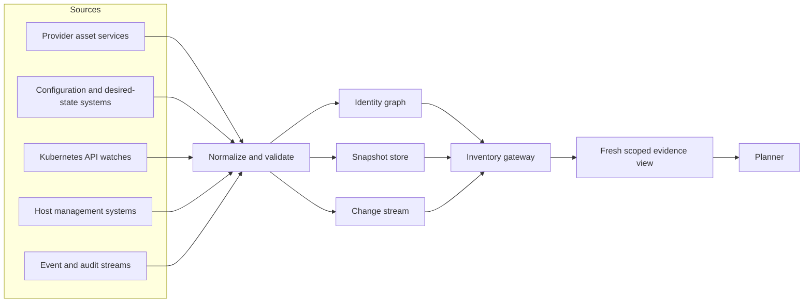
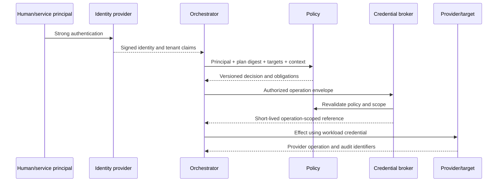

# Inventory, Identity, and Tenancy

> **Status:** Research-backed production blueprint  
> **Last researched:** 2026-08-31  
> **Scope:** Resource identity, inventory authority, credential brokerage, and tenant isolation  
> **Research packet:** [Infrastructure Operations Agent research packet](../../research/packets/infrastructure-operations-agent-blueprint.md)

## Production position

The agent can act safely only when it knows **who is asking, which trust domain is in scope, exactly which resources are targeted, and how current that knowledge is**. Inventory is not a list of names; it is an evidence system with provenance, coverage, and freshness. Identity is not a role written in a prompt; it is a chain from the requesting principal to an operation-scoped workload credential.

## Canonical resource identity

Human-friendly names are mutable and non-unique. Every resource record should use an immutable or provider-stable identity tuple:

| Field | Purpose |
|---|---|
| tenant_id | Internal isolation boundary |
| provider | aws, azure, gcp, kubernetes, vps, or another registered provider |
| authority | AWS organization/account, Azure tenant/subscription, GCP organization/project, Kubernetes cluster, or VPS trust domain |
| region_or_location | Provider region, zone, cluster, datacenter, or edge location |
| resource_type | Provider-qualified type |
| resource_id | Provider canonical ID, ARN, full resource name, UID, or managed host ID |
| generation | Resource generation/version if replacement can reuse a name |
| environment | Independently governed production/staging/development label |
| owner | Accountable service/team identity |
| criticality | Impact class used by policy |

Aliases, DNS names, tags, labels, and display names are selectors or attributes, not canonical identity.

### Identity lifecycle

Keep a tombstone when a resource disappears. A later object with the same name is new unless the provider-stable ID and generation prove continuity. Record `first_seen_at`, `last_seen_at`, `deleted_observed_at`, source observation, and replacement link. Never recycle an internal resource key merely because a hostname, Kubernetes name, or CMDB asset number was reused.

### Example inventory envelope

```yaml
resource:
  tenant_id: t-acme
  provider: aws
  authority: arn:aws:organizations::111122223333:organization/o-example
  account: "444455556666"
  region_or_location: ap-south-1
  resource_type: ec2:instance
  resource_id: arn:aws:ec2:ap-south-1:444455556666:instance/i-0123456789abcdef0
  generation: "launch-time:2026-08-29T10:14:00Z"
attributes:
  environment: production
  owner: payments-platform
  criticality: tier-1
  fault_domain: ap-south-1a
  management_channels: [ssm]
observation:
  source: aws-config
  observed_at: 2026-08-31T08:12:04Z
  source_version: "configuration-state-id:..."
  freshness_slo_seconds: 300
  coverage: complete
  permissions_fingerprint: sha256:...
```

The permissions fingerprint helps distinguish “resource absent” from “collector cannot see it.”

## Inventory architecture



Use both event-driven updates and periodic reconciliation. Events reduce latency; full scans repair missed, reordered, or permission-filtered events. Keep raw source records for forensic reconstruction and normalized projections for planning.

## Sources of truth

No single inventory source is authoritative for every field. Define field-level precedence.

| Domain | Strong sources | Important limitation |
|---|---|---|
| AWS resources | AWS Config, Resource Explorer, service APIs, Organizations | Resource Explorer completeness depends on setup/permissions; Config coverage varies by recorder and resource type |
| Azure resources | Azure Resource Graph, ARM APIs, Policy, Arc | Resource Graph change analysis covers ARM control plane, not resource data plane, and current change history is limited |
| Google Cloud | Cloud Asset Inventory, service APIs, organization policy | Asset history is time-limited; not every operational state is an asset field |
| Kubernetes | API server LIST/WATCH with resourceVersion | Cache can be stale; names can be recreated; watch gaps require relist |
| VPS/hosts | CMDB plus provider/virtualization API and management agent | Host self-report is not sufficient proof of identity or health |
| Desired state | Git, Terraform backend, GitOps controller, configuration management | Declared state may not match live state or may not own every field |
| Ownership/criticality | Service catalog and policy repository | Tags alone are mutable and often incomplete |
| Change history | Provider audit logs plus internal effect ledger | Default provider retention is not a durable cross-provider ledger |

Record which system owns each attribute. Conflicting observations are data, not something the model should silently merge.

### Field-ownership example

| Field | Authoritative writer | Corroborating sources | Conflict behavior |
|---|---|---|---|
| Provider resource identity | Provider control plane | Audit/event stream | Quarantine alias; provider ID wins |
| Kubernetes object identity | API server UID | GitOps inventory | UID mismatch invalidates plan |
| Desired configuration | Declared IaC/GitOps owner for the field | Live API and drift engine | Report drift; do not overwrite source from live state |
| Service owner/criticality | Service catalog governance | CMDB, tags, repository metadata | Block risk-sensitive write if required ownership is unresolved |
| Maintenance eligibility | Change policy/calendar | Ticket request | Ticket cannot widen the governing calendar |
| Runtime health | Service-owned observability/SLO definition | Provider and host checks | Missing primary signal is unknown, not healthy |

CMDB and service-catalog integrations should be bidirectional only through explicit workflows. Import governed fields into inventory; submit stale/missing data as a reconciliation case with both values and evidence. Do not let the agent silently “fix” ownership or criticality from a tag.

## Freshness and coverage

Every query response should state:

- observation time and maximum permitted age for the requested operation;
- whether the result is complete, partial, delayed, or permission-filtered;
- collector identity and source API version;
- resource version, ETag, generation, or digest where available;
- scan/watcher health and last successful full reconciliation;
- selector expansion count and any excluded authorities;
- conflicts between sources.

Write eligibility is stricter than diagnostic usability. A 20-minute-old ownership tag may be acceptable for a read; pod readiness, leader identity, route state, and desired revision usually require a just-in-time read.

Use three separate clocks:

- `source_observed_at`: when the provider/source says the state applied;
- `collector_received_at`: when the inventory pipeline received it;
- `query_evaluated_at`: when the consumer evaluated freshness.

Clock skew or an absent source timestamp is recorded explicitly. Freshness limits are operation-specific policy, not one estate-wide TTL.

| Evidence | Advisory use | Write precondition |
|---|---|---|
| Ownership/criticality | Cached if within governance SLO and coverage is complete | Refresh if changed since plan or required for approval class |
| Target ID/generation | Snapshot is useful for diagnosis | Just-in-time authoritative GET and exact identity match |
| Desired revision | Cached revision may explain intent | Exact commit/state/controller revision bound to plan |
| Health/capacity | Recent telemetry may guide a hypothesis | Operation-specific live check plus missing-data rule |
| Provider permissions | Last successful probe is diagnostic only | Current broker/policy authorization; no inference from prior success |

### Read-before-plan and read-before-commit

The planner reads a coherent snapshot. The executor later performs targeted reads for every precondition and binds writes to resource versions where supported. Kubernetes resourceVersion conflicts, HTTP ETags, Terraform plan staleness, and provider generation numbers should produce a replan, not a forced write.

An inventory snapshot is coherent when its manifest records the per-source watermarks used to build it; it is not necessarily a cross-provider transaction. The plan must disclose skew between sources and prohibit combinations whose maximum skew exceeds the operation policy.

## Selector safety

Selectors are resolved before approval into an ordered manifest of canonical resources. The sealed plan records:

- selector text and parser version;
- inventory snapshot ID;
- exact target identities and generations;
- include/exclude reasons;
- per-tenant, region, zone, environment, and criticality counts;
- maximum allowed set size;
- digest of the manifest.

At execution, a selector is not re-expanded silently. New matches require a new plan. Missing/replaced targets are reported and policy decides whether the unchanged subset may continue.

## Principal identity chain



The system must retain both the human/service initiator and the workload identity that performed the provider call.

## Credential brokerage

The broker should prefer:

- AWS STS AssumeRole with session policies, tags, short duration, and MFA where relevant;
- Azure managed identity or workload identity with a narrowly assigned role, with PIM for human elevation;
- Google Cloud service-account impersonation and short-lived credentials;
- Kubernetes TokenRequest or workload identity with audience and short TTL;
- short-lived OpenSSH user certificates with exact principals, validity, and constraints;
- JEA endpoints and constrained service identities for PowerShell remoting;
- Vault dynamic secrets and leases for systems without a native federation path.

### Credential envelope

A credential issuance request includes:

| Binding | Example |
|---|---|
| operation | immutable operation ID |
| plan | plan digest and version |
| principal | requester plus approver identities |
| tenant | internal tenant and provider authority |
| audience | exact provider/API/host gateway |
| capabilities | named API actions or adapter operation |
| resources | exact resource IDs or a provider-enforced boundary |
| conditions | time, source network, tags, session claims |
| duration | shortest practical TTL |
| budget | maximum calls/effects |

The worker receives a handle or ephemeral token after authorization, never a reusable credential stored in the workflow state.

### Issuance transaction

1. Verify workflow generation, plan digest, approval nonce/expiry, and tenant/cell binding.
2. Re-evaluate policy using current principal, target, risk, window, and safeguard state.
3. Reserve the operation/batch budget atomically.
4. Mint the shortest usable credential for the exact audience and smallest provider-enforceable scope.
5. Store only lease/reference metadata; deliver secret material directly to the assigned worker over an authenticated channel.
6. Record issuance before dispatch and refuse reuse by a different operation generation.
7. Revoke/expire on completion where supported; measure—not assume—revocation latency.

## Revocation realities

Short-lived does not mean instantly revocable. Provider token caches, active sessions, queued operations, and target-side authorization caches can outlive a policy change. Azure documents managed-identity authorization caching that can delay effective permission changes. Therefore:

- keep TTLs short;
- issue per operation or rollout batch;
- enforce a second budget in the adapter;
- stop issuing new credentials on cancellation;
- terminate active sessions where supported;
- include kill switches at queue, broker, cell, and provider layers;
- test actual revocation latency.

## Tenant model

### Soft isolation

Logical tenant columns, namespaces, tags, projects, or subscriptions may be adequate for teams inside one security boundary when combined with policy and encryption. They are not sufficient by themselves for mutually distrustful tenants.

### Hard isolation

Use separate provider accounts/subscriptions/projects, Kubernetes clusters or hardened virtual control planes, execution cells, queues, encryption keys, artifact prefixes, and workload identities. The control plane can be shared only if every access path enforces tenant identity before lookup.

| Layer | Required tenant binding |
|---|---|
| API | Tenant derived from authenticated identity, never caller-supplied alone |
| Workflow | Tenant in immutable workflow identity and every signal |
| Database | Row-level/key-prefix isolation plus authorization |
| Cache/vector store | Per-tenant namespace and key; no global semantic search |
| Queue | Tenant/cell partition and per-tenant fairness |
| Credential broker | Provider authority allowlist and plan-bound scope |
| Worker | One execution cell/trust domain; no cross-cell credentials |
| Logs/traces | Tenant field, access controls, redaction, export boundary |
| Artifacts | Per-tenant keys and retention policies |

Kubernetes namespaces provide useful soft multi-tenancy but must be combined with RBAC, network policy, quotas, Pod Security, admission policy, and node isolation. Kubernetes guidance recommends separate clusters when stronger isolation is required.

## Identity graph and delegation

Represent explicit edges:

- principal **member of** group;
- service **owned by** team;
- resource **belongs to** tenant/environment;
- role **may perform** operation class on a resource set;
- approver **may approve** risk class;
- workload identity **may impersonate** execution role;
- execution role **trusted by** provider authority.

Never infer delegation from similar names, email domains, resource tags, or model-generated ownership claims. Detect cycles, wildcard trust, dormant roles, and cross-tenant edges as security findings.

## Provider audit retention is not inventory history

CloudTrail event history currently exposes 90 days of management events for one account and region; Google Cloud Asset Inventory history is currently 35 days; Azure Resource Graph change analysis currently exposes 14 days and only ARM control-plane changes. Export events and snapshots to the organization's durable, independently controlled store. The internal effect ledger must not depend on a provider UI's default retention.

## Failure matrix

| Failure | Detection | Response |
|---|---|---|
| Collector loses permission | Coverage/fingerprint change and canary queries | Mark affected authority partial; block writes |
| Event stream gap | Sequence/checkpoint gap or watcher error | Relist/full scan; do not interpolate |
| Name reused | Canonical ID/generation mismatch | Treat as different resource; invalidate plan |
| Sources disagree | Field-level conflict | Apply declared precedence or require review |
| Selector unexpectedly grows | Manifest exceeds historic/budget threshold | Stop before approval |
| Tenant claim missing | API middleware check | Reject before any inventory query |
| Token issuance succeeds after cancellation | Broker/ledger race test | Fence on operation generation; revoke/expire |
| Host self-identifies incorrectly | Compare provider instance identity/attestation | Quarantine result; no privileged session |
| Inventory query is rate limited | Explicit incomplete result | Backoff with jitter; never return partial as complete |

## Implementation checklist

- [ ] Canonical IDs survive renames and detect replacement.
- [ ] Every attribute has source, observed-at, and precedence.
- [ ] Full scans repair event-stream gaps.
- [ ] Read-before-commit uses resource versions or equivalent preconditions.
- [ ] Selector manifests are immutable and digest bound.
- [ ] Credential issuance records initiator, approver, workload identity, audience, and TTL.
- [ ] Tenant scope is present in workflow, cache, queue, trace, artifact, and broker keys.
- [ ] Provider audit/history is exported beyond default retention.
- [ ] Inventory degradation blocks only the operations whose safety depends on it.

## Sources

- [AWS Resource Explorer](https://docs.aws.amazon.com/resource-explorer/latest/userguide/welcome.html)
- [AWS Config: How it works](https://docs.aws.amazon.com/config/latest/developerguide/how-does-config-work.html)
- [AWS STS AssumeRole](https://docs.aws.amazon.com/STS/latest/APIReference/API_AssumeRole.html)
- [Azure Resource Graph overview](https://learn.microsoft.com/en-us/azure/governance/resource-graph/overview)
- [Azure Resource Graph change analysis](https://learn.microsoft.com/en-us/azure/governance/resource-graph/changes/resource-graph-changes)
- [Azure managed identity best practices](https://learn.microsoft.com/en-us/entra/identity/managed-identities-azure-resources/managed-identity-best-practice-recommendations)
- [Google Cloud Asset Inventory](https://cloud.google.com/asset-inventory/docs/asset-inventory-overview)
- [Google Cloud service-account impersonation](https://cloud.google.com/iam/docs/service-account-impersonation)
- [Kubernetes API concepts](https://kubernetes.io/docs/reference/using-api/api-concepts/)
- [Kubernetes multi-tenancy](https://kubernetes.io/docs/concepts/security/multi-tenancy/)
- [SPIFFE concepts](https://spiffe.io/docs/latest/spiffe/concepts/)

## Related guides

- [Reference architecture and technology choices](02-reference-architecture-and-technology-choices.md)
- [Security boundaries, secrets, and threat model](06-security-boundaries-secrets-and-threat-model.md)
- [Tool results, artifacts, and provenance](../../tools/tool-results-artifacts-and-provenance.md)
