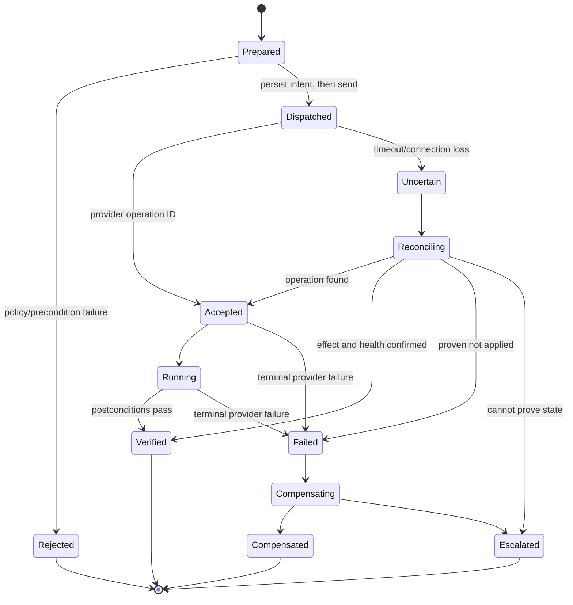

# Tool, Effect, and Session Contracts

> **Status:** Research-backed production blueprint  
> **Last researched:** 2026-08-31  
> **Scope:** Read/write tools, effect semantics, provider adapters, SSH, WinRM, and Kubernetes boundaries  
> **Research packet:** [Infrastructure Operations Agent research packet](../../research/packets/infrastructure-operations-agent-blueprint.md)

## Production position

A production tool is a versioned contract for one operational intent, not a thin wrapper around arbitrary command execution. The contract must tell the control plane what can change, how to constrain it, how to recognize duplicates, and how to determine the final state after a timeout.

## Tool classes

| Class | Authority | Examples | Default exposure |
|---|---|---|---|
| Observe | Read-only | inventory, health, logs, policy, plan, provider operation status | Reasoning tier through scoped gateway |
| Simulate | No intended persistence | Kubernetes dry-run, Terraform speculative plan, Ansible check mode | Planner, with limitations surfaced |
| Mutate | Bounded side effect | restart unit, update deployment image, run approved patch job | Executor only after plan and policy |
| Session | Interactive/streaming channel | SSH, Session Manager, WinRM/JEA, kubectl exec | Exceptional supervised workflow |
| Privilege | Changes authority/trust | IAM/RBAC, certificates, policy, firewall trust | Separate high-risk service, not general registry |
| Destructive | Data/key/audit deletion | delete backup, key, volume, log | Excluded or dedicated ceremony |

Read and write tools use separate identities and processes. A model that can call an observe tool must not be able to change a field or smuggle a command through a “filter” parameter.

## Contract schema

```yaml
tool:
  name: kubernetes.restart_workload
  version: 2.3.1
  class: mutate
  risk_floor: R2
  target_types: [apps/v1/Deployment]
  provider_capabilities:
    - get
    - patch:apps/deployments
input:
  operation_id: uuid
  tenant_id: string
  plan_digest: sha256
  target:
    cluster_uid: string
    namespace: string
    uid: string
    resource_version: string
  intent:
    strategy: rollout-restart
  preconditions:
    desired_replicas_min: 2
    available_replicas_min: 2
    max_unavailable: 1
  budgets:
    deadline_seconds: 900
    disruption_units: 1
execution:
  idempotency_scope: target_uid+operation_id
  cancellation: stop_new_effects
  reconcile: kubernetes.restart_workload.status
output:
  disposition: accepted|running|verified|failed|uncertain|compensated
  provider_operation_ids: [string]
  observations: [typed_reference]
  redactions: [path]
```

The schema shown is illustrative. The production schema should be machine validated and include compatibility rules.

## Required metadata

Every registered tool declares:

- semantic version and immutable implementation digest;
- owner, on-call, support tier, and deprecation date;
- read/write/session class and minimum risk;
- exact target types and provider actions;
- input/output schemas with size and classification limits;
- precondition and postcondition definitions;
- idempotency, retry, timeout, cancellation, and reconciliation semantics;
- maximum target count and provider call budget;
- credential audience and permissions;
- audit fields and secret redaction paths;
- approved deployment cells and provider/API versions;
- fault-injection and acceptance-test results.

Changing effect semantics, privilege, target resolution, or verification requires a new contract version and invalidates plans using the prior version.

## Effect lifecycle



“Command returned 0,” “HTTP 202,” and “request timed out” are intermediate observations, not verified outcomes.

## Idempotency and reconciliation

Use provider idempotency tokens where semantics are documented, but retain an application operation ID. AWS EC2, for example, supports client-token idempotency for selected actions and rejects reuse with different parameters. Providers vary in scope and retention.

For each effect, specify one strategy:

| Strategy | Example | Retry rule |
|---|---|---|
| Naturally idempotent desired-state write | Set an exact label/value with resource version | Re-read; repeat only if desired state absent and preconditions still hold |
| Provider idempotency key | Create provider operation with client token | Repeat exact request within provider guarantee |
| Operation marker | Annotate target or store provider job ID | Query marker/job before dispatch |
| Compare-and-swap | Patch using ETag/resourceVersion | Replan on conflict |
| Non-idempotent, reconcilable | Restart/job launch with observed job ID | Never repeat until status query proves non-dispatch |
| Non-idempotent, not reconcilable | Arbitrary shell with external side effects | No automatic retry; redesign or supervise |

The idempotency record stores a canonical request digest. Reusing a key with different tenant, target, tool version, or parameters is a hard conflict, not a second operation. Provider retention of idempotency tokens is treated as a tested, versioned dependency; the internal ledger remains authoritative after that window expires.

### Reconcile decision table

| Evidence after ambiguous dispatch | Disposition | Next action |
|---|---|---|
| Provider operation found with matching request digest | Accepted/running/terminal provider state | Poll and verify; never redispatch |
| Target marker/version proves the intended effect | Applied, provider receipt missing | Verify independently and flag audit-correlation gap |
| Provider audit proves rejection before effect | Failed-not-applied | Revalidate current state before a new attempt |
| Some targets/fields changed | Partial | Freeze expansion; invoke named completion/compensation runbook |
| No evidence and provider guarantee proves token was never accepted | Not applied | A new attempt may be authorized with the same logical operation |
| Evidence paths unavailable or contradictory | Unknown/escalated | Preserve fence and evidence; no automatic retry |

## Error model

Adapters return structured categories rather than opaque strings:

| Category | Meaning | Control-plane response |
|---|---|---|
| invalid | Contract or semantic validation failed | Fix/replan; no retry |
| unauthorized | Current credential or policy denies | Stop; do not broaden permission |
| precondition_failed | Target changed or safeguard not met | Refresh evidence and replan |
| rate_limited | Provider requested delay | Budgeted backoff with jitter |
| transient | Known retryable provider/network condition | Retry only within contract |
| terminal | Provider proved operation failed | Compensate or escalate |
| uncertain | Dispatch may have occurred | Reconcile before retry |
| verification_failed | Effect accepted but desired health absent | Stop rollout; recover |
| cancelled | No new effect should start | Reconcile in-flight work |

Raw provider details can be attached as redacted artifacts, not copied into a control decision.

## Boundary preference

Prefer the narrowest authoritative interface:

1. desired-state controller or IaC/GitOps change;
2. provider control-plane API or managed command service;
3. Kubernetes API;
4. constrained management endpoint on the host;
5. one-shot restricted SSH/WinRM command;
6. interactive shell only for exceptional supervised diagnosis.

Provider-native systems improve identity and auditability, but their logs and semantics must be checked. AWS Session Manager does not log session content for tunneled SSH or port-forwarding sessions, so those modes do not satisfy a command-audit requirement by themselves.

## Cloud API adapters

Adapters should use official SDKs pinned to tested versions, explicit request deadlines, provider-native retry hints, operation IDs, and paginated reads with completeness metadata.

### AWS

- Assume an operation-specific role with a session policy and tags.
- Prefer Systems Manager Run Command/Automation/Session Manager over inbound SSH.
- Enforce both application budgets and Systems Manager max-concurrency/max-errors.
- Remember that max-errors stops new invocations after the threshold; already-running invocations continue.
- Record CloudTrail event identity and request ID; export audit beyond Event History.
- Treat Systems Manager Change Manager as an optional integration: it became unavailable to new customers on 2025-11-07.

### Azure

- Prefer managed identity/workload identity and narrowly scoped RBAC.
- Use Run Command or Arc for managed hosts; note whether it runs as SYSTEM/root or a specified user.
- Use PIM/JIT for human privilege, not a standing agent owner role.
- Record Azure request/correlation IDs and Activity Log linkage.
- Account for managed-identity token caching when testing revocation.

### Google Cloud

- Use service-account impersonation and IAM Conditions/Deny.
- Use VM Manager patch jobs with explicit rollout/disruption settings.
- Do not treat Credential Access Boundaries as general downscoping; current support is specific to Cloud Storage.
- Enable required Data Access audit logs; they are not universally on by default.
- Record the impersonated service account and, where the service emits it, the delegation chain. Some services do not log the identity that created the impersonated credential, so also join IAM Credentials Data Access logs and the internal credential-issuance event.

## Kubernetes adapter

Use the API server, never a shared administrator kubeconfig.

- Authenticate with a short-lived projected/token-request credential or workload identity.
- Use a namespace Role whenever possible; avoid wildcards, cluster-admin, and system:masters.
- Bind requests to UID and resourceVersion, not name alone.
- Use dry-run for admission/defaulting insight, then re-read before commit.
- Use server-side apply with an explicit field manager for owned desired-state fields.
- Treat conflicts as a planning problem; do not force ownership by default.
- Use API Priority and Fairness plus client-side limits, while remembering that long-running exec/log streams have different treatment.
- Respect PodDisruptionBudgets through the Eviction API; PDBs do not constrain direct pod deletion or Deployment rollout behavior.
- For node maintenance, use cordon/drain behavior and verify DaemonSets, local data, unmanaged pods, and recovery capacity.
- Enable and export API audit logs at a level appropriate to sensitive data and volume.

### Dry-run limitations

Kubernetes server-side dry-run performs authorization, validation, admission, merge, and defaulting without persistence. It is valuable but not proof that external webhooks, later controllers, quotas changing concurrently, or downstream systems will behave identically. Dry-run output may include generated/defaulted fields that differ at commit time.

## SSH boundary

For unmanaged VPS or exceptional host work:

- issue short-lived OpenSSH user certificates from an operations CA;
- use exact certificate principals and narrow validity intervals;
- use a dedicated unprivileged account and explicit sudo rules;
- apply authorized_keys/certificate restrictions such as forced command, no PTY, no forwarding, and permitted destinations;
- use `DisableForwarding` or the `restrict` option where applicable—`ForceCommand` alone does not disable forwarding;
- pin host identity through a managed known-hosts or host-certificate trust path;
- connect through a bastion/session gateway with target allowlists;
- copy no private key to the model, workflow history, or target;
- capture command, arguments, working directory, user, target fingerprint, exit status, and bounded output.

Avoid a tool shaped like `ssh(host, command)`. Register intents such as `service.restart`, `package.inspect`, or `filesystem.capacity`, implemented using fixed scripts or constrained argument arrays.

## WinRM and PowerShell boundary

- Prefer a JEA endpoint with a role capability exposing only approved cmdlets/functions.
- Use HTTPS and enterprise authentication appropriate to the domain; WinRM normally encrypts messages after authentication, but Basic does not provide message encryption and must not be used without transport protection.
- Avoid CredSSP unless its credential delegation risk is explicitly accepted; it caches credentials on the remote server.
- Handle the “second hop” deliberately through constrained delegation, JEA, or resource-specific identity.
- Remember that JEA does not protect against an identity already holding local/domain administrator rights.
- Execute non-interactively with explicit timeouts and transcript/audit capture.
- Treat PowerShell objects as typed results before serialization; never parse localized console text if a structured API exists.

## Session tools

Interactive sessions are high risk because their effects are open ended and hard to precompute. They require:

- a human in the loop;
- one target and one principal;
- short lease and inactivity timeout;
- no agent-autonomous keystrokes;
- restricted port/agent forwarding;
- session start/end audit and, where lawful, content recording;
- clear disclosure where content cannot be recorded;
- credential revocation at close;
- a post-session inventory and change review.

The agent may gather context and summarize the transcript, but session authorization must not depend on the transcript.

## Command construction

When a host command is unavoidable:

- pass an executable and argument array, not a shell string;
- reject control characters, globbing, substitution, redirection, and unbounded paths;
- validate identifiers against the inventory record;
- use fixed working directories and minimal environment variables;
- set CPU, memory, process, output, and wall-clock limits;
- stream bounded redacted output to an artifact store;
- never interpolate retrieved text into executable position;
- record the script or binary digest.

## Implementable fixed-runbook example

A fixed runbook should remain safe if the model disappears after producing the proposal.

```yaml
runbook:
  name: linux.service.restart
  version: 1.2.0
  implementation_digest: sha256:...
  target_type: managed-linux-host
  parameters:
    service_name:
      enum: [payments-worker]
  preconditions:
    - host_generation_matches_plan
    - management_channel_healthy
    - service_has_redundant_peer
    - service_slo_not_burning
  command:
    executable: /usr/local/libexec/ops-restart-service
    argv: ["--service", "${service_name}", "--operation", "${operation_id}"]
    shell: false
    run_as: ops-service-control
    timeout_seconds: 60
    max_output_bytes: 32768
  idempotency:
    marker: /var/lib/ops-agent/operations/${operation_id}.json
    marker_write: atomic-fsync-rename
    reconcile: linux.service.restart.status@1.1.0
  postconditions:
    - system_manager_reports_active
    - process_generation_changed_once
    - synthetic_healthy_for_300s
  cancellation: stop_before_command_only
  recovery: runbook://linux-service-recovery/v3
```

The model may select this registered intent and explain why. It cannot change the executable, add arguments, choose another service, or reinterpret a timeout as failure. The privileged helper creates the marker in a root-owned, non-model-writable directory and records the before state, dispatch boundary, and observed after state so a worker or host restart can resume reconciliation without guessing.

### Adapter execution pseudocode

```text
validate_schema_and_semantics(request)
assert_request_digest_matches_idempotency_record()
assert_plan_tool_target_and_generation_match()
recheck_preconditions_and_fence()
persist(EFFECT_PREPARED)
credential = broker.issue(operation_envelope)
persist(CREDENTIAL_ISSUED, lease_metadata_only)
try:
    receipt = dispatch_exact_request(credential)
    persist(PROVIDER_ACCEPTED, receipt)
except after_possible_dispatch:
    persist(EFFECT_UNCERTAIN)
    return reconcile_without_redispatch()
return poll_then_verify_independently(receipt)
```

All persistence calls are compare-and-swap transitions for the current workflow generation. Large or sensitive results are stored by digest/reference, never embedded in workflow history.

## Tool result envelope

```json
{
  "operation_id": "op_...",
  "attempt": 1,
  "tool": {"name": "service.restart", "version": "1.4.0", "digest": "sha256:..."},
  "target": {"resource_id": "...", "generation": "..."},
  "dispatch": {"at": "...", "credential_lease_id": "..."},
  "provider": {"request_id": "...", "operation_id": "..."},
  "disposition": "verified",
  "observations": [
    {"type": "service_state", "value": "active", "observed_at": "...", "source": "systemd"}
  ],
  "postconditions": [{"name": "service_active", "passed": true}],
  "artifacts": [{"ref": "artifact://...", "classification": "confidential"}],
  "redactions": ["artifacts[0].content"],
  "completed_at": "..."
}
```

## Registration gate

A new write tool is not production eligible until:

- [ ] schema validation and semantic validation are distinct;
- [ ] least-privilege provider permissions have been tested;
- [ ] exact target binding and generation checks exist;
- [ ] effect, idempotency, cancellation, and reconciliation behavior are documented;
- [ ] timeout-after-dispatch is fault injected;
- [ ] logs, results, diffs, and errors have secret tests;
- [ ] postconditions are independent of the command exit status;
- [ ] rollout budgets and adapter-side enforcement exist;
- [ ] provider/API/version limitations are explicit;
- [ ] the owner and disable procedure are known.

### Read-tool gate

Read tools also require qualification because they can leak secrets, overload control planes, or return misleading partial data:

- [ ] provider pagination and completeness are tested;
- [ ] fields and rows are tenant/resource authorized before return;
- [ ] output carries source, observed-at, coverage, truncation, and redaction;
- [ ] filters cannot smuggle an executable expression or write action;
- [ ] time, result-count, byte, token, and provider-call budgets are enforced;
- [ ] cached and live modes are distinguishable;
- [ ] malicious resource names, logs, and host output stay data on re-entry to the model.

## Sources

- [Kubernetes API concepts: dry-run and resource versions](https://kubernetes.io/docs/reference/using-api/api-concepts/)
- [Kubernetes server-side apply](https://kubernetes.io/docs/reference/using-api/server-side-apply/)
- [Kubernetes RBAC good practices](https://kubernetes.io/docs/concepts/security/rbac-good-practices/)
- [AWS Systems Manager Session Manager](https://docs.aws.amazon.com/systems-manager/latest/userguide/session-manager.html)
- [AWS Systems Manager Run Command rate controls](https://docs.aws.amazon.com/systems-manager/latest/userguide/send-commands-multiple.html)
- [Azure Run Command overview](https://learn.microsoft.com/en-us/azure/virtual-machines/run-command-overview)
- [Google Cloud service-account audit-log examples](https://cloud.google.com/iam/docs/audit-logging/examples-service-accounts)
- [WinRM security](https://learn.microsoft.com/en-us/powershell/scripting/security/remoting/winrm-security?view=powershell-7.6)
- [PowerShell remoting second hop](https://learn.microsoft.com/en-us/powershell/scripting/security/remoting/ps-remoting-second-hop?view=powershell-7.6)
- [OpenBSD sshd_config](https://man.openbsd.org/sshd_config)
- [OpenBSD sshd authorized_keys restrictions](https://man.openbsd.org/sshd)
- [Amazon EC2 API idempotency](https://docs.aws.amazon.com/ec2/latest/devguide/ec2-api-idempotency.html)

## Related guides

- [Inventory, identity, and tenancy](03-inventory-identity-and-tenancy.md)
- [Desired state, plans, approvals, and drift](05-desired-state-plans-approvals-and-drift.md)
- [Tool contracts](../../tools/tool-contracts.md)
- [Idempotency and side effects](../../reliability/idempotency-and-side-effects.md)
