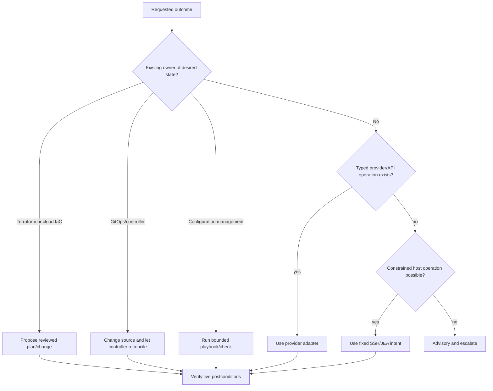
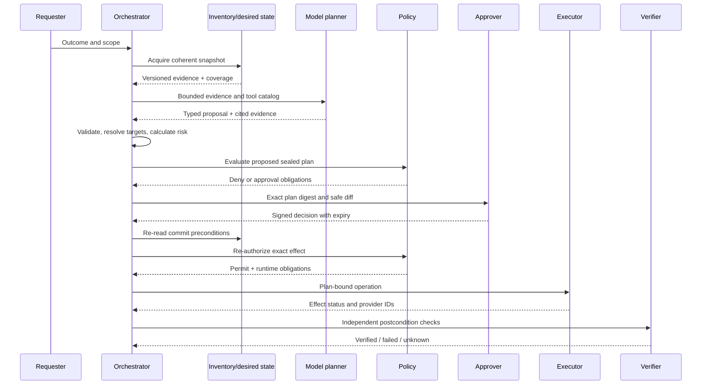

# Desired State, Plans, Approvals, and Drift

> **Status:** Research-backed production blueprint  
> **Last researched:** 2026-08-31  
> **Scope:** Planning artifacts, diffs, approvals, maintenance windows, rollouts, drift, and recovery intent  
> **Research packet:** [Infrastructure Operations Agent research packet](../../research/packets/infrastructure-operations-agent-blueprint.md)

## Production position

Prefer changing an authoritative desired-state system over making a direct imperative change. When an imperative repair is necessary, represent it with the same discipline: immutable targets, explicit preconditions, bounded effects, and independent verification.

An approval covers one sealed plan. It does not cover a conversational intention, a mutable pull request, a selector that can grow, or whatever commands the model produces later.

## Change-path decision



Direct mutation must not create a permanent fight with a reconciler. Either update the owner of desired state, suspend reconciliation under policy, or make a time-bounded repair whose expected controller response is understood.

### Desired-state ownership contract

Inventory records ownership at field/effect-domain granularity:

```yaml
ownership:
  target: urn:infra:t-acme:k8s:cluster-7:deployment/payments/api
  domains:
    spec.template.spec.containers[*].image:
      owner: gitops:flux:prod-platform
      source: git:https://example.invalid/platform.git//apps/payments
      revision: 4db1...
      direct_write: forbidden
    metadata.annotations[ops.example/restartedAt]:
      owner: runbook:kubernetes.restart_workload@2.3.1
      direct_write: supervised
      expires_after: 15m
```

Unknown or overlapping owners block automatic drift repair. Suspending a controller creates a compensating obligation with an expiry, named resume step, and alert if it remains suspended.

## Plan artifact

A plan is immutable after sealing and includes:

### Identity and provenance

- plan ID, revision, digest, creation and expiry;
- requester, tenant, environment, purpose, ticket/incident;
- planner model/provider/version, prompt/template revision, and evaluation release;
- inventory snapshot, desired-state revision, policy bundle, tool registry, and adapter digests.

### Scope

- exact canonical target manifest and generations;
- selector and resolver version;
- tenant, account/subscription/project, cluster, region, zone, and fault-domain counts;
- explicit exclusions and unresolved resources.

### Operations

- typed operation and dependency DAG;
- before state and intended after state;
- machine-readable diff plus operator-safe rendering;
- preconditions and postconditions;
- idempotency and reconciliation strategy;
- estimated provider calls, time, token cost, and service disruption.

### Controls

- calculated risk and reasons;
- required approver roles and separation of duties;
- maintenance-window rule;
- target, concurrency, error, disruption, and spend budgets;
- canary sequence, bake time, stop conditions, and kill switches;
- compensation, restore, or roll-forward procedure;
- evidence links and known limitations.

### Example

```yaml
plan:
  id: plan_01J...
  revision: 4
  digest: sha256:...
  expires_at: 2026-08-31T16:00:00Z
  tenant_id: t-acme
  environment: production
  inventory_snapshot: inv_01J...
  desired_state_revision: git:4db1...
  policy_version: opa-bundle:2026.08.31.2
  tool_registry_version: "2026-08-31"
targets:
  manifest_digest: sha256:...
  count: 12
  fault_domains: {ap-south-1a: 4, ap-south-1b: 4, ap-south-1c: 4}
operation:
  type: os.patch.apply
  version: 3.1.0
  patch_baseline: critical-2026-08
controls:
  mode: supervised
  canary: 1
  max_concurrency: 2
  max_errors: 1
  max_unavailable_per_fault_domain: 1
  window: mw-prod-india-01
  stop_on: [service_slo_burn, verification_failure, inventory_change]
verification:
  - management_channel_reconnected
  - kernel_version_matches
  - service_health_green_for_15m
recovery:
  type: restore_or_replace
  artifact: runbook://host-patch-recovery/v5
```

## Planning lifecycle



## Diff semantics and limitations

A diff is evidence, not proof.

| Mechanism | Useful guarantee | Missing guarantee |
|---|---|---|
| Terraform speculative plan | Preview against observed state at plan time | Not the exact artifact later applied; can become stale |
| Terraform saved plan | Exact planned actions can be applied | File can contain full configuration and sensitive values in cleartext; live assumptions can still change |
| Ansible check mode | Simulates modules that support check mode | Unsupported modules may do nothing or report incomplete behavior |
| Ansible diff mode | Shows before/after for supporting modules | Can expose secrets; not every module supports it |
| Kubernetes server dry-run | Runs authorization, admission, validation, defaulting, merge without persistence | Cannot prove downstream controller/external side effects or future concurrent state |
| GitOps diff | Shows source-to-live change through controller semantics | Hooks, waves, prune, external systems, and drift policy still matter |
| Cloud “what-if”/policy preview | Estimates control-plane changes | Provider-specific incompleteness and asynchronous data-plane effects |

Protect plan and diff artifacts as sensitive. Redaction in an approval view must not change the underlying plan digest; maintain a cryptographically linked safe projection.

## Approval design

### Approval record

Bind:

- approver identity and authenticated session;
- approver role and tenant/environment scope;
- plan digest and safe-view digest;
- exact target-manifest digest;
- risk class and permitted operation set;
- conditions such as window, canary, maximum concurrency, or no target skips;
- decision, reason, timestamp, expiry;
- approval policy version.

Approval becomes invalid if the plan, targets, desired state, tool version, policy obligations, risk, maintenance rule, or recovery procedure changes materially.

### Policy decision envelope

```json
{
  "decision_id": "dec_...",
  "decision": "permit_with_obligations",
  "principal": "workforce:alice@example.com",
  "tenant_id": "t-acme",
  "plan_digest": "sha256:...",
  "target_manifest_digest": "sha256:...",
  "effect_classes": ["os.patch.apply@3.1.0"],
  "policy_bundle": "2026.08.31.2",
  "obligations": {
    "approver_roles": ["prod-change-approver"],
    "max_targets": 12,
    "max_concurrency": 2,
    "require_canary": true,
    "credential_ttl_seconds": 900,
    "stop_on": ["verification_unknown", "slo_fast_burn"]
  },
  "evaluated_at": "2026-08-31T12:00:00Z",
  "expires_at": "2026-08-31T12:15:00Z"
}
```

The executor checks obligations as code. Free-text policy explanations are for operators; reason codes and typed obligations control execution.

### Approval is distinct from authorization

Approval answers, “does this authorized reviewer accept this proposed change?” Authorization answers, “may this principal and workload perform this exact effect now?” The broker evaluates current authorization immediately before credential issuance. A ticket status or framework resume token cannot substitute for that check.

### Separation of duties

- Requesters cannot approve their own high-risk plan.
- The model cannot select or impersonate an approver.
- Approval-service administrators do not automatically gain provider execution access.
- Emergency elevation uses a separate identity path.
- Provider-side approval systems may be integrated, but their identities and decision artifacts must be correlated.

### Ticket and change-system integration

A ticket is a coordination record, not the security boundary.

- Resolve requester/approver identity through the enterprise identity provider; do not trust display names, email in comments, webhook possession, or ticket assignee alone.
- Store the external system, immutable ticket/change ID, object version, and deep link in the plan.
- Publish the plan digest, safe-view digest, target count, risk, window, and state—never credentials or sensitive raw plans.
- Import an external approval only if the connector can prove the approver identity, decision, exact plan/target digest, timestamp, and nonce. Otherwise treat it as advisory acknowledgement.
- Make status updates idempotent by `(external_system, external_id, operation_id, state_version)` and reconcile webhook/API races.
- If ticket update fails after an effect, the infrastructure outcome remains in the ledger; queue a communication repair and do not repeat the effect.

## Maintenance windows

A maintenance window is a policy constraint on starting or continuing work, not a promise that the provider stops or undoes work at the boundary.

The window policy records:

- timezone and daylight-saving behavior;
- earliest start, latest safe start, and hard no-new-work time;
- maximum batch duration and remaining-window requirement;
- freeze calendars and emergency exceptions;
- whether already-started provider work can be cancelled;
- reboot and follow-up behavior;
- completion grace period and handoff owner.

Google Cloud VM Manager documents that after a patch window ends it stops starting new patch tasks, while operations such as downloads or reboots already underway may complete outside the window. AWS Systems Manager maintenance tasks likewise have task-specific cutoff and concurrency behavior. Test exact provider behavior rather than mapping “window ended” to “all work stopped.”

## Rollout and blast radius

### Budget dimensions

| Dimension | Example bound |
|---|---|
| Total targets | No more than 12 hosts |
| Concurrency | Two effects in flight |
| Fault domain | At most one unavailable per zone |
| Service disruption | Respect application redundancy and PDB equivalents |
| Error threshold | Stop after one verification failure |
| SLO impact | Stop on fast burn or error/latency regression |
| Provider calls | Cap API calls and retries |
| Cost | Cap temporary capacity or data transfer |
| Time | Do not start a batch without enough window remaining |

The executor consumes budgets atomically. The model may recommend a smaller rollout but cannot increase a sealed maximum.

### Canary sequence

1. choose a representative, non-critical target while preserving redundancy;
2. revalidate its identity, generation, health, and dependencies;
3. execute one effect;
4. verify technical and service-level postconditions;
5. wait through a meaningful bake interval;
6. compare with control population;
7. expand one bounded batch at a time;
8. halt automatically on any stop signal.

A canary that is not representative can prove only that the canary survived.

## Desired state and drift

Classify drift before acting:

| Drift type | Examples | Response |
|---|---|---|
| Benign/defaulted | Provider-generated fields, controller defaults | Normalize or ignore with documented rule |
| Authorized emergency | Time-bounded incident repair outside Git | Record exception; back-port or expire |
| Unauthorized | Manual console edit, compromised credential | Alert, contain, determine intent before reconcile |
| Ownership conflict | Two controllers manage same field | Stop; fix ownership instead of force apply |
| Stale declaration | Desired state no longer reflects service need | Review source; do not blindly revert live state |
| Observation artifact | Delayed inventory or incomplete API | Refresh and reconcile evidence |

### Reconciliation policy

Automatic drift correction is appropriate only for fields with a single declared owner, a safe desired value, known impact, and reliable verification. Flux can detect and correct drift using server-side dry-run; server-side apply field ownership helps expose conflicts. Prune and force replacement are higher risk and require explicit policy. Argo CD sync windows and prune confirmation can add control, but the application must still reason about hooks, waves, and controller behavior.

Never have the agent and a GitOps/IaC controller repeatedly overwrite each other. Record field/system ownership in inventory and route the change to the owner.

## Terraform path

- Run `plan` against the exact configuration and state backend revision.
- Lock state through the supported backend when applying.
- Treat speculative plans as review input only.
- Store saved plan files in a restricted encrypted artifact store because they can contain sensitive values.
- Bind approval to configuration revision, variable inputs, provider lockfile, state lineage/serial, plan digest, and runner image.
- Before apply, ensure the artifact and backend still satisfy policy; after apply, verify live service health, not only Terraform completion.
- Do not use force-unlock until the owner of the lock and any in-flight apply are understood.

### Minimal Terraform execution recipe

1. Check out an exact reviewed commit in an isolated immutable runner.
2. Initialize against an allowlisted backend and verified dependency lockfile; inject credentials out of band.
3. Create one saved plan and store it encrypted with its digest, state lineage/serial, CLI/provider/runner digests, and expiry.
4. Generate a separate redacted approval projection cryptographically linked to that plan.
5. At commit, re-authorize and acquire the backend lock through Terraform; never bypass locking for speed.
6. Apply only the sealed saved plan. If it cannot be applied, create and approve a new plan rather than substituting an ad hoc apply.
7. Capture the new state/version and provider request evidence, then verify service health independently.
8. Delete runner-local plan/state material and retain only governed artifacts.

## Ansible/configuration-management path

- Pin collection, role, playbook, inventory, and execution-environment digests.
- Use check/diff only where module support is known; label unknown portions.
- Avoid shell/command modules where typed modules exist.
- Use serial batches, `max_fail_percentage`, and explicit health checks.
- Protect diff output and `no_log` fields, while recognizing that `no_log` reduces diagnostics.
- Make handlers and playbook tasks safe under retry or gate non-idempotent tasks.

## Kubernetes/GitOps path

- Bind objects by cluster, namespace, kind, name, UID, and resourceVersion.
- Prefer changing the source repository and allowing the controller to reconcile.
- Use server-side apply ownership to avoid hidden field takeover.
- Use sync windows, waves, and prune confirmation where they match risk.
- Suspend reconciliation only with an expiry and an explicit resume/verification step.
- Understand that PDBs govern voluntary evictions through the Eviction API, not every controller rollout or direct delete.
- Verify workloads, dependencies, and service signals after the controller reports sync/ready.

### Minimal GitOps execution recipe

1. Resolve repository, path, branch protection, controller object, destination cluster/namespace, and current source/live revisions.
2. Produce a deterministic diff from an exact commit; disclose hooks, waves, prune, force/replace, generated resources, and encrypted-secret handling.
3. Approve the commit and target/controller identities—not only rendered YAML.
4. Merge through the normal protected path and record merge commit plus controller reconciliation ID.
5. Observe controller status and live Kubernetes UIDs/resourceVersions; a new sync superseding the approved revision stops attribution.
6. Verify application and service postconditions independently.
7. On failure, suspend only if the recovery runbook requires it; otherwise submit the tested previous or corrected revision as a new forward change.

### Drift versus concurrency

Desired-state lock, resource fence, and field ownership solve different races. Terraform locking protects a state operation, Kubernetes resourceVersion protects one API update, and server-side apply tracks field managers; none globally prevents a console edit, another controller, or a provider-side asynchronous change. At commit, re-read all relevant generations, hold the narrow operation lease, and stop if a non-owned field or controller revision changed in a way that invalidates the plan.

## Recovery intent

“Rollback” must identify a real mechanism:

| Change | Recovery |
|---|---|
| Immutable deployment | Restore previous desired revision or roll forward |
| Host patch | Replace from known-good image, snapshot restore, or provider-specific uninstall where validated |
| Configuration change | Reapply previous desired value with current-state preconditions |
| Firewall/routing | Execute independently reachable recovery path |
| IAM policy | Restore version through separately authorized identity; verify access graph |
| Data/schema change | Dedicated backup/restore or forward-fix runbook outside general agent |

Some actions cannot be reversed without data loss or downtime. The plan must say so before approval.

## Failure matrix

| Failure | Required response |
|---|---|
| Target changes after approval | Invalidate or replan; never silently expand |
| Window ends mid-batch | Stop new starts; track in-flight tasks to terminal/unknown |
| Saved plan is stale | Re-plan and re-approve |
| GitOps controller reverts repair | Stop conflict; choose authoritative desired state |
| Canary healthy, next batch unhealthy | Halt, preserve evidence, compensate or roll forward |
| Approval UI hides sensitive difference | Block if safe view cannot represent material effect |
| Approver loses role before execution | Re-authorization denies |
| Verification telemetry missing | Stop rollout and mark unverified |
| Cancel requested after dispatch | Stop new effects; reconcile in-flight work |

## Review checklist

- [ ] The plan names the desired-state owner.
- [ ] Exact targets and generations are digest bound.
- [ ] Diff limitations and hidden sensitive content are disclosed.
- [ ] Approval and execution authorization are separate.
- [ ] Window rules include in-flight and reboot semantics.
- [ ] Budgets cover target, fault domain, errors, SLO, calls, cost, and time.
- [ ] Recovery describes a tested mechanism, not only “rollback.”
- [ ] Drift correction has a single field owner.
- [ ] Postconditions are live and independent.

## Sources

- [Terraform plan command](https://developer.hashicorp.com/terraform/cli/commands/plan)
- [Terraform state locking](https://developer.hashicorp.com/terraform/language/state/locking)
- [Ansible check and diff modes](https://docs.ansible.com/projects/ansible/latest/playbook_guide/playbooks_checkmode.html)
- [Flux Kustomization reconciliation](https://fluxcd.io/flux/components/kustomize/kustomizations/)
- [Argo CD sync windows](https://argo-cd.readthedocs.io/en/stable/user-guide/sync_windows/)
- [Argo CD sync phases and waves](https://argo-cd.readthedocs.io/en/stable/user-guide/sync-waves/)
- [Kubernetes disruptions and PodDisruptionBudgets](https://kubernetes.io/docs/concepts/workloads/pods/disruptions/)
- [Google Cloud VM Manager patch jobs](https://cloud.google.com/compute/vm-manager/docs/patch/create-patch-job)
- [AWS Systems Manager maintenance windows](https://docs.aws.amazon.com/systems-manager/latest/userguide/maintenance-windows.html)

## Related guides

- [Tool, effect, and session contracts](04-tool-effect-and-session-contracts.md)
- [State, reliability, recovery, and break-glass](07-state-reliability-recovery-and-break-glass.md)
- [Run controls](../../runtime/run-controls.md)
