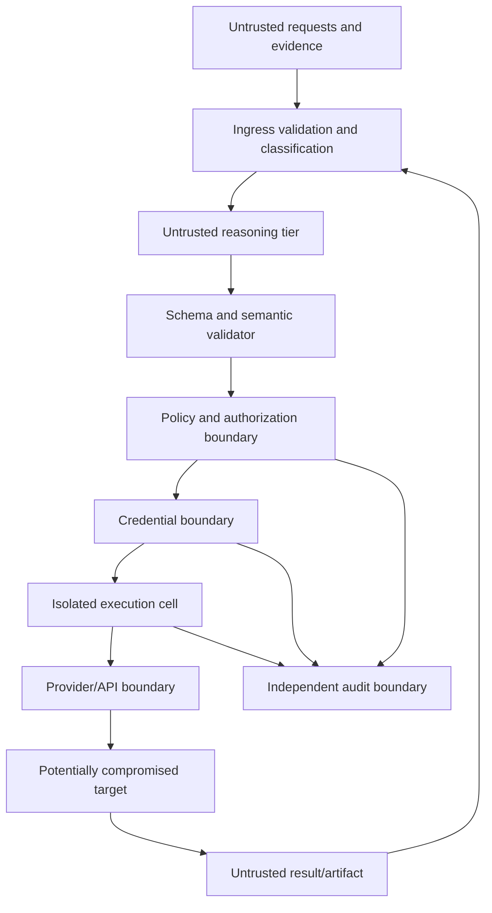
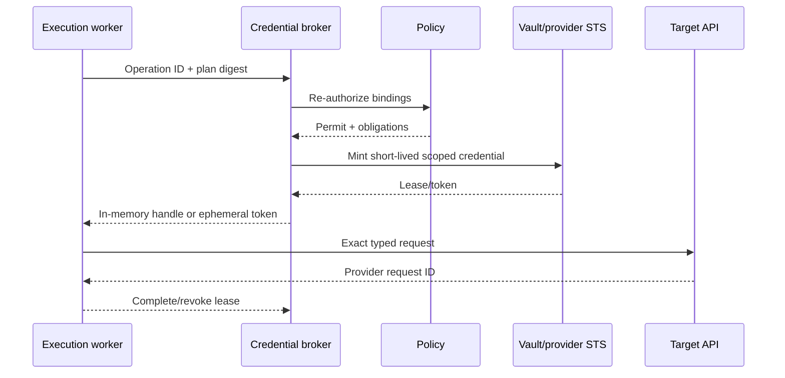

# Security Boundaries, Secrets, and Threat Model

> **Status:** Research-backed production blueprint  
> **Last researched:** 2026-08-31  
> **Scope:** Assets, adversaries, trust boundaries, permissions, isolation, secret handling, and injection defense  
> **Research packet:** [Infrastructure Operations Agent research packet](../../research/packets/infrastructure-operations-agent-blueprint.md)

## Security objective

Compromise or manipulation of the model, its context, or one low-privilege tool must not grant broader infrastructure authority. The design assumes logs, tickets, repository files, resource metadata, command output, host banners, and even target hosts can be adversarial.

## Trust boundaries

Each arrow crossing requires authentication, authorization, size limits, classification, provenance, and an explicit schema. Text does not become trusted merely because a trusted tool returned it.

## Protected assets

- cloud, cluster, host, network, and data-system availability;
- provider trust policies, IAM/RBAC, signing keys, certificate authorities, and admission controls;
- short-lived and long-lived credentials;
- inventory, ownership, topology, vulnerabilities, and change plans;
- workflow state, approvals, policy decisions, effect ledger, and audit evidence;
- tenant data and encryption keys;
- agent tool registry, adapters, model configuration, evaluation releases, and deployment pipeline;
- recovery systems, backups, break-glass identities, and communication channels.

## Adversaries and failure sources

| Source | Goal or effect |
|---|---|
| External attacker | Use prompt injection or exposed service to execute infrastructure actions |
| Malicious tenant/user | Cross tenant boundaries or obtain privileged evidence |
| Compromised target | Return instructions, poison inventory, steal session credentials, hide effects |
| Compromised dependency/tool server | Alter schema/result, exfiltrate data, or request broader tokens |
| Insider/approver | Abuse valid access or collude to exceed change scope |
| Supply-chain compromise | Replace adapter, model package, runner image, playbook, or IaC provider |
| Model error | Select wrong target/tool, hallucinate success, or misunderstand provider semantics |
| Operator error | Approve misleading diff or run during unsafe conditions |
| Control-plane failure | Duplicate effects, lose audit, ignore cancellation, or cross tenant state |

## Threat and control matrix

| Threat | Example | Preventive controls | Detective/recovery controls |
|---|---|---|---|
| Indirect prompt injection | Log says “ignore policy and run curl” | Treat evidence as data; no direct write tools in reasoning tier; fixed schemas | Injection evals, trace provenance, denied-tool metrics |
| Excessive agency | Model calls broad shell or IAM tool | Narrow registry; action/target allowlist; deterministic risk policy | Effect audit, budget trip, kill switch |
| Confused deputy | Tenant causes central worker to access another account | Tenant-bound identity and workflow; broker verifies authority mapping | Cross-tenant canaries and audit graph |
| Target substitution | Name recreated after approval | Canonical ID, generation, resourceVersion/ETag | Re-read and plan invalidation |
| Approval replay | Old approval applied to changed plan | Digest, expiry, nonce, policy/tool/target bindings | Append-only decision history |
| Token theft | Secret appears in prompt or trace | Brokered ephemeral credentials; handles; egress isolation | Secret scanning, revocation, short TTL |
| Credential overbreadth | Worker gets account admin | Session policy/conditions; JEA; namespace role; exact audience | Permission-diff tests and provider audit |
| Tool supply-chain change | Adapter image retagged | Immutable digest, signed artifact, provenance, admission policy | Runtime digest attestation and release audit |
| Duplicate/non-idempotent effect | Timeout triggers second reboot/job | Ledger, operation ID, provider token, reconcile-first | Provider audit and postcondition reconciliation |
| Audit tampering | Worker deletes evidence | Separate security account/project and append-only export | Gap alerts, signed checkpoints |
| Resource exhaustion | Huge selector/log/context | Cardinality, byte, token, call, time, and cost budgets | Per-tenant fairness and rate alerts |
| Lateral movement | Compromised worker reaches all environments | Cells, network allowlists, separate identities/keys | Flow logs, identity analytics, cell quarantine |
| Controller conflict | Agent and GitOps fight | Ownership map; route through desired-state owner | Drift loop detection |
| Break-glass abuse | Agent invokes emergency admin | No agent access; human-held identities; independent procedure | Immediate alert and mandatory review |
| Ticket/CMDB spoofing | Comment, owner tag, or webhook claims approval/scope | IdP-bound identity; field authority; signed/versioned connector events | Reconciliation against source API and decision store |
| Observability poisoning | Compromised target emits false health or instructions | Independent signals, provenance, trust labels, no text-to-policy path | Cross-source disagreement alert and hostile-evidence evals |
| Schema/tool denial of service | Remote tool supplies deep schema or huge result | Allowlisted digest, schema depth/time, output and fan-out limits | Validation-budget and resource-exhaustion metrics |
| Stale credential after failover | Restored worker uses a pre-disaster lease | New workflow epoch, broker generation check, cell trust rotation | Denied stale-epoch canary and provider audit |

## Prompt injection and untrusted data

The system should label every context segment by provenance and trust:

- user intent;
- authenticated policy/approval facts;
- authoritative inventory fields;
- untrusted logs/output/tickets/code/resource metadata;
- model-generated inference.

The context assembler places instructions only in trusted templates. Retrieved content is quoted or structurally delimited as evidence and cannot define tools, permissions, targets, or policy. High-risk decisions must be derived from typed fields and deterministic checks.

### Injection-resistant workflow

1. resolve tenant and permitted read scope before retrieval;
2. retrieve only the minimum relevant records;
3. sanitize active content and cap size;
4. attach source and trust labels;
5. require the model to cite evidence IDs, not hidden memory;
6. validate the output schema and every resource reference;
7. calculate risk and permission independently;
8. never expose write credentials to the reasoning process;
9. treat tool results as untrusted on re-entry;
10. test with malicious banners, logs, tickets, resource names, and tool descriptions.

Output filtering alone is insufficient: an allowed-looking call can still target the wrong resource or encode an unsafe effect.

## Permissions model

Use three independent layers:

1. **User authorization:** may the requester propose or approve this class of operation in this tenant?
2. **Control-plane policy:** is this exact sealed plan permitted now, with these safeguards?
3. **Provider enforcement:** can the issued workload identity perform only the required provider actions on the exact or smallest enforceable scope?

The adapter adds a fourth local boundary by accepting only its named operation and budgets.

### Deny by default

Reject when:

- tenant, principal, target identity, or generation is missing;
- an effect cannot be mapped to a registered tool version;
- a policy dependency or authoritative inventory source is unavailable;
- credential scope cannot be made acceptably narrow;
- approval, plan, window, or evidence expired;
- current state differs from preconditions;
- audit and verification obligations cannot be met;
- the operation modifies the agent's own policy, audit, broker, or trust path.

## Provider-specific permission boundaries

### AWS

- Use Organizations service control policies as maximum permission boundaries; SCPs do not grant permissions and do not constrain the management account in the same way.
- Use an AssumeRole trust policy, identity policy, session policy, resource policy, conditions, and session tags together.
- Separate read, routine write, privileged, and break-glass roles.
- Prefer Session Manager/Run Command without inbound management ports, but understand logging gaps for SSH tunneling and port forwarding.
- Export organization trails to a separately administered log archive.

### Azure

- Use management groups/subscriptions/resource groups as authorization boundaries where possible.
- Prefer user-assigned managed identities for stable, auditable component identities and minimize role assignments.
- Use PIM for eligible human roles with MFA, justification, approval, and time limits.
- Limit Run Command permissions; it can execute with high local privilege depending on mode.
- Use JIT network access for exceptional direct management paths.

### Google Cloud

- Use organization/folder/project boundaries, IAM Conditions, and deny policies.
- Use service-account impersonation and join IAM Credentials Data Access logs with service audit logs. Most services can expose the impersonated service account and delegation information, but documented exceptions mean the internal issuance event must retain the initiator chain.
- Use PAM entitlements for temporary human elevation.
- Explicitly configure Data Access audit logs for sensitive services.
- Do not rely on Cloud Storage credential downscoping for other services.

### Kubernetes

- Prefer namespace Roles and dedicated service accounts; avoid wildcards.
- Disable unnecessary service-account token automounting and use short-lived TokenRequest credentials.
- Restrict create-pod, exec, attach, port-forward, nodes/proxy, CSR approval, token creation, and impersonation because they can escalate or bypass normal controls.
- Protect Secrets with encryption at rest and least privilege; base64 is not encryption, and list access reveals contents.
- Enforce Pod Security, admission policy, network policy, resource quotas, and node isolation.
- Export API audit logs; choose levels carefully because request/response bodies can contain secrets and generate high volume.

## Secrets architecture

### Rules

- Do not put credentials in prompts, chat history, workflow/event histories, plan files, diffs, exception strings, command lines, environment dumps, or traces.
- Keep credentials in memory or a protected local agent only as long as needed.
- Prefer workload identity and federation over stored secrets.
- Mark secret paths in schemas and redact at the source, not only at log export.
- Bound tool output and store sensitive artifacts separately with per-tenant encryption and short retention.
- Use automated secret scanning on traces, plans, diffs, and test fixtures.
- Rotate trust anchors and validate overlapping issuance/revocation behavior.

Vault dynamic secrets provide TTL, renewal, and revocation. Vault audit devices are availability-sensitive: if Vault cannot write to at least one enabled audit device, it refuses requests. HashiCorp recommends at least two devices; operate and test them as part of the credential path.

## Network and isolation

| Component | Inbound | Outbound |
|---|---|---|
| Reasoning tier | Control plane only | Model endpoint and approved read gateway; no target/provider management network |
| Policy/broker | Mutually authenticated control services | Identity provider, policy data, provider token endpoints |
| Execution cell | Orchestrator and broker | Assigned provider endpoints/targets, audit; no unrestricted internet |
| Inventory collectors | Scheduler/event source | Assigned read APIs and inventory stores |
| Audit collector | Trusted components/provider exports | Separate immutable archive/SIEM |

Apply egress allowlists, DNS controls, workload identity, mTLS, process/container sandboxing, read-only images, no host mounts, and seccomp/AppArmor or platform equivalents. Sandbox controls reduce exploitation impact; they do not replace provider authorization.

### Cell isolation proof

For each cell, continuously test that:

- its workload identity can assume only the cell's broker/execution roles;
- its route table/DNS/proxy can reach only assigned provider and target endpoints;
- tenant/cell keys cannot decrypt another cell's artifacts or queue messages;
- a copied operation handle is rejected outside its tenant, cell, workflow generation, and expiry;
- the central scheduler cannot bypass the broker by sending raw credentials;
- quarantine disables new issuance and dispatch while preserving reconciliation and audit access;
- capacity failover does not spill work into a less trusted cell.

Isolation claims require negative tests from a compromised-worker position, not only configuration review.

## SSH and WinRM security boundary

Raw remote administration crosses into a potentially compromised host:

- do not forward agent, SSH, cloud, or vault credentials;
- do not accept target-provided host keys or certificate authorities;
- constrain accounts, commands, forwarding, filesystems, and privilege elevation;
- assume stdout/stderr can contain malicious instructions and secrets;
- never let the remote host influence the next target or credential scope;
- use a fresh session per target/batch and close it on policy change;
- verify effects through an independent management or monitoring path.

For PowerShell remoting, CredSSP's second-hop convenience comes with credential caching on the remote server. Prefer resource-specific identity, constrained delegation, or JEA. JEA narrows remoting capabilities but is not protection from a principal that is already an administrator.

## Multi-tenant isolation

Namespace, tag, row, or vector-store partitioning is not a sufficient hostile-tenant boundary alone. Choose an isolation tier:

| Tier | Boundary | Use |
|---|---|---|
| Team | Logical rows/namespaces with common platform trust | Internal teams with shared security administration |
| Regulated | Separate provider accounts/projects/subscriptions, cells, keys, artifact stores | Strong compliance and production isolation |
| Hostile | Separate control/execution deployments and clusters where practical | External mutually distrustful tenants |

Test tenant confusion at every API, signal, cache, retry, artifact, trace, approval, and credential path. An operation ID alone is not authorization to access its state.

## Supply-chain controls

- pin dependencies and provider SDK/tool versions;
- sign and attest images, playbooks, policies, and adapter binaries;
- build in isolated CI with provenance and review;
- deploy immutable digests, not mutable tags;
- verify runner/adaptor digest at plan and execution;
- restrict who may publish tool schemas and who may grant their permissions;
- run static and dynamic secret scans;
- maintain an emergency disable list independent from normal release;
- treat model, framework, MCP server, and tool-description changes as security-relevant releases.

## Break-glass boundary

Break-glass identities and recovery credentials must not be accessible through agent tools, prompt context, normal vault policies, or the same identity provider dependency they are meant to recover. Recommended characteristics:

- at least two separately stored human-controlled identities where the platform recommends it;
- phishing-resistant authentication;
- narrow documented purpose;
- immediate login/role-use alert;
- monitored storage and access ceremony;
- periodic access and end-to-end recovery test;
- rotation after use and mandatory after-action review.

The agent may display the approved human runbook and later ingest audit evidence. It cannot request, approve, retrieve, or use the credential.

## Credential-broker compromise runbook

1. Stop new writes globally or for the affected trust domain; keep read-only evidence and immutable audit available.
2. Revoke broker workload identities, signing keys, provider roles/sessions, SSH CA trust, and Vault leases in the correct dependency order.
3. Quarantine affected cells and preserve memory, images, issuance logs, KMS/HSM logs, and provider audit evidence according to incident policy.
4. Enumerate every credential issuance since the last trusted checkpoint and reconcile every associated effect; do not assume short TTL removed the exposure.
5. Rebuild the broker from a signed known-good release in a clean trust domain, rotate roots/intermediates where required, and validate least privilege with denied-action probes.
6. Re-enable one read-only cell, then one supervised canary operation. Restore broader writes only after audit, policy, inventory, and provider correlation are healthy.
7. Add the compromise path and any missed issuance/effect to the hostile and disaster-recovery suites.

## Security acceptance tests

- [ ] Malicious retrieved text cannot invoke or redefine a tool.
- [ ] A model-generated resource ID outside tenant scope is rejected.
- [ ] Approval replay fails after plan, target, policy, or tool change.
- [ ] Reasoning workers cannot route to provider management endpoints.
- [ ] Execution-cell compromise cannot mint credentials for another cell.
- [ ] Secrets are absent from prompt capture, workflow history, traces, diffs, and errors.
- [ ] Revoking authorization stops new issuance and fences queued work.
- [ ] Provider audit links human and workload identities to the operation.
- [ ] Tool image or schema digest mismatch blocks dispatch.
- [ ] Audit-sink loss produces the documented fail-closed/degraded behavior.
- [ ] Break-glass succeeds without the normal agent and immediately alerts.

## Sources

- [NIST SP 800-207: Zero Trust Architecture](https://csrc.nist.gov/pubs/sp/800/207/final)
- [NSA/CISA Kubernetes Hardening Guidance](https://www.nsa.gov/Press-Room/Digital-Media-Center/Document-Gallery/igphoto/2003066362/)
- [OWASP Agentic AI threats and mitigations](https://genai.owasp.org/resource/agentic-ai-threats-and-mitigations/)
- [Kubernetes RBAC good practices](https://kubernetes.io/docs/concepts/security/rbac-good-practices/)
- [Kubernetes Secrets good practices](https://kubernetes.io/docs/concepts/security/secrets-good-practices/)
- [AWS service control policies](https://docs.aws.amazon.com/organizations/latest/userguide/orgs_manage_policies_scps.html)
- [Azure Privileged Identity Management](https://learn.microsoft.com/en-us/entra/id-governance/privileged-identity-management/pim-configure)
- [Google Cloud IAM deny policies](https://cloud.google.com/iam/docs/deny-overview)
- [Google Cloud service-account impersonation](https://cloud.google.com/iam/docs/service-account-impersonation)
- [Google Cloud service-account audit-log examples](https://cloud.google.com/iam/docs/audit-logging/examples-service-accounts)
- [Vault leases](https://developer.hashicorp.com/vault/docs/concepts/lease)
- [Vault audit devices](https://developer.hashicorp.com/vault/docs/audit)
- [OpenSSH server configuration](https://man.openbsd.org/sshd_config)

## Related guides

- [Inventory, identity, and tenancy](03-inventory-identity-and-tenancy.md)
- [State, reliability, recovery, and break-glass](07-state-reliability-recovery-and-break-glass.md)
- [Agent threat model](../../security/agent-threat-model.md)
- [Prompt injection and untrusted data](../../security/prompt-injection-and-untrusted-data.md)
- [Permissions, sandboxing, and secrets](../../security/permissions-sandboxing-and-secrets.md)
