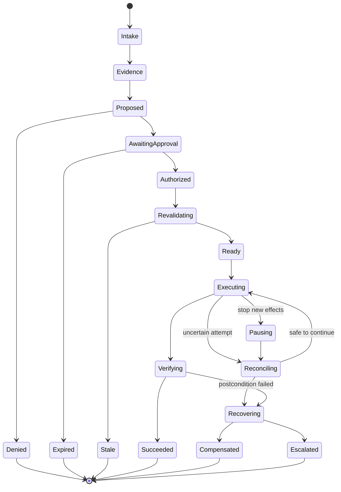
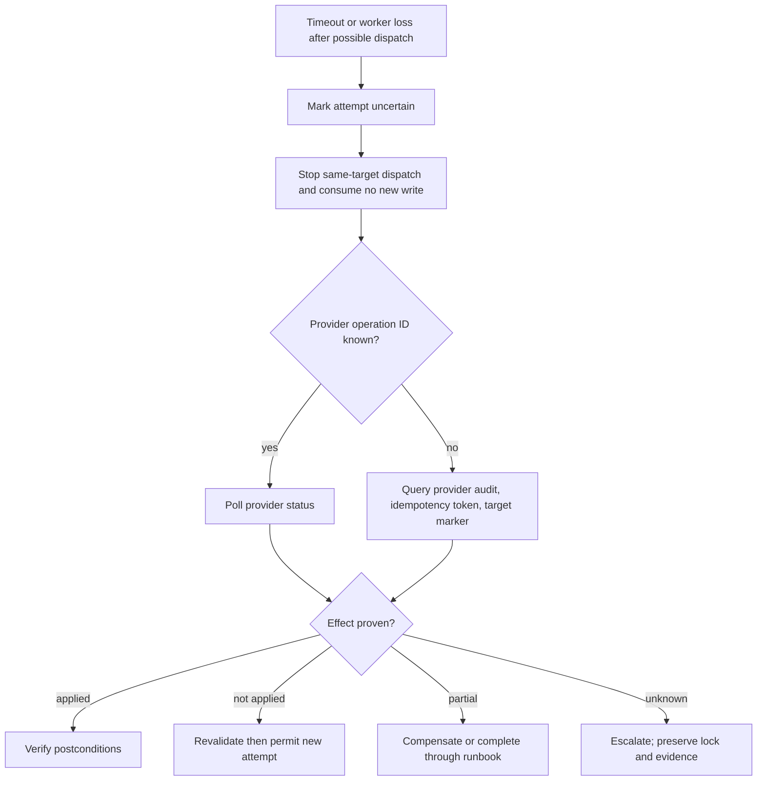

# State, Reliability, Recovery, and Break-Glass

> **Status:** Research-backed production blueprint  
> **Last researched:** 2026-08-31  
> **Scope:** Durable state, concurrency, retries, reconciliation, rollback, cancellation, and emergency access  
> **Research packet:** [Infrastructure Operations Agent research packet](../../research/packets/infrastructure-operations-agent-blueprint.md)

## Production position

Infrastructure execution is a distributed system. A response can be lost after a provider accepted a request; a worker can die after making a change but before recording it; cancellation can race with dispatch; and two plans can target the same resource. Reliability therefore comes from durable state, unique operation identity, fencing, and reconciliation—not from asking the model what probably happened.

## State taxonomy

| State | Authority | Retention | Sensitive content |
|---|---|---|---|
| Request/intent | Intent service | Change/audit policy | Identity and business context |
| Inventory snapshot | Inventory store | Long enough for plan/audit | Topology and configuration |
| Plan | Immutable plan store | Change/audit policy | May include sensitive diffs |
| Approval/policy decision | Decision store | Compliance policy | Identity, reason, obligations |
| Workflow | Durable orchestrator | Through recovery plus audit projection | IDs and decisions, not credentials |
| Effect ledger | Append-only effect store | Long-term operational record | Provider IDs and redacted results |
| Artifact | Encrypted artifact store | Classification-specific | Logs, diffs, command output |
| Model trace | Evaluation/trace store | Short, minimized | Redacted prompts and outputs |
| Credential/lease | Broker/provider | Shortest possible | Never persisted in normal workflow |

Conversation memory is a convenience projection. It cannot authorize work, prove a side effect, or replace the plan/effect stores.

## Context, compaction, and memory decisions

Infrastructure operations needs several information lifecycles, but only one of them is authoritative operational state:

| Information class | Default decision | Production rule |
|---|---|---|
| Turn context | Enable, tightly bounded | Compile fresh identity, target, plan, policy, evidence, budgets, and relevant receipts for each model call; tool output enters context only through a redacted, size-bounded projection |
| Run-scoped working memory | Enable | Store typed hypotheses, open questions, rejected alternatives, and evidence IDs; never store credentials or treat hypotheses as observed facts |
| Conversation/session memory | Minimize | Use only for operator UX; rebuild the working view from durable run state after resume, failover, or model change |
| Durable task state | Required | The workflow, plan, approval, effect, artifact, and verification stores are authoritative and versioned independently of prompts and transcripts |
| Cross-run personal memory | Disable by default | Operator preferences belong in an inspectable configuration system with owner, scope, expiry, edit, and deletion controls—not a hidden vector store |
| Domain knowledge | Source-controlled | Runbooks, topology, policy, desired state, and service ownership remain in their governed source systems; retrieved copies carry version, freshness, authorization, and provenance |
| Episodic outcome memory | Curated only | Incidents, failed plans, and operator corrections become candidate evals or runbook changes after review; raw model conclusions are never promoted automatically |

Compaction changes only the model's working projection. A compaction artifact records the input event range, retained plan/evidence/effect IDs, unresolved risks, omissions, compactor version, and output digest. Raw authorized evidence and durable operation records stay available under their own retention policies. Repeated-compaction tests must prove that target identity, plan generation, approvals, uncertain effects, stop conditions, and rollback obligations cannot disappear.

### Context and compaction receipt

```yaml
context_receipt:
  id: ctx_01J...
  run_id: run_01J...
  tenant_id: t-acme
  phase: pre_approval_plan_review
  compiler:
    version: 2.4.0
    template_digest: sha256:...
    model_input_digest: sha256:...
  authoritative_bindings:
    principal_id: workforce:alice@example.com
    inventory_snapshot: inv_01J...
    plan_revision: plan_01J.../4
    policy_bundle: 2026.08.31.2
    tool_registry: 2026-08-31
  included:
    evidence_ids: [ev_17, ev_21]
    event_range: [184, 231]
    prior_receipt: ctx_01H...
  preserved_obligations:
    uncertain_operations: [op_07]
    stop_conditions: [verification_unknown, slo_fast_burn]
    recovery_runbook: runbook://host-patch-recovery/v5
  transformations:
    redactions: 4
    truncated_artifacts: [artifact://logs/77]
    omitted: [{class: historical_chat, reason: token_budget}]
  budgets: {input_tokens: 18000, artifact_bytes: 131072}
  created_at: 2026-08-31T12:03:00Z
```

The receipt is durable metadata, not a replacement for the evidence. Resume verifies every referenced object still exists and is tenant-authorized. If an obligation cannot be reconstructed exactly, the run becomes `needs_review` and cannot execute.

### Memory governance checklist

- [ ] Every memory class has an owner, schema, tenant key, provenance, retention, deletion, and export policy.
- [ ] Personal preferences cannot alter target, risk, approval, credentials, or policy.
- [ ] Vector retrieval filters tenant and authorization before similarity search and returns source/version metadata.
- [ ] Raw incidents and model hypotheses never become domain knowledge automatically.
- [ ] Corrections enter a reviewed candidate queue for eval, runbook, policy, or documentation changes.
- [ ] Model/provider changes replay context and repeated-compaction tests before release.
- [ ] Deletion removes derived indexes and caches while preserving legally required audit through documented exception handling.

## Workflow state machine



Every transition records actor, time, prior version, reason, and related evidence. Use compare-and-swap or workflow-engine guarantees so concurrent signals cannot both advance the same generation.

### Canonical state-event contract

```json
{
  "event_id": "evt_01J...",
  "event_type": "infra.effect.dispatched.v1",
  "occurred_at": "2026-08-31T12:05:14.123Z",
  "recorded_at": "2026-08-31T12:05:14.140Z",
  "tenant_id": "t-acme",
  "run_id": "run_01J...",
  "workflow_generation": 7,
  "sequence": 232,
  "causation_id": "evt_01H...",
  "correlation_id": "req_01J...",
  "actor": {"type": "worker", "id": "spiffe://ops/cell-prod-india/worker-9"},
  "plan_digest": "sha256:...",
  "policy_decision_id": "dec_...",
  "operation_id": "op_...",
  "attempt": 1,
  "target": {"resource_id": "...", "generation": "..."},
  "tool": {"name": "os.patch.apply", "version": "3.1.0", "digest": "sha256:..."},
  "fence": {"domain": "host-patch", "token": 4812},
  "payload": {"credential_lease_id": "lease_ref_...", "request_digest": "sha256:..."},
  "classification": "confidential",
  "schema_version": 1
}
```

Event types are immutable facts; corrections append a new event that references the superseded interpretation. Consumers reject unknown major versions and deduplicate by `event_id`. Per-run `sequence` detects gaps but does not claim global time ordering. `occurred_at` and `recorded_at` remain separate because provider/target clocks and ingestion can lag.

### Transition invariants

- `Prepared -> Dispatched` requires the durable prepared record, current fence, unspent budget, valid decision, and issuance metadata.
- A generation can dispatch a given `(operation_id, attempt)` at most once internally; duplicate delivery resumes status/reconciliation.
- `Succeeded` requires every required postcondition to be `pass`; `unknown` is not coerced to false or pass.
- Terminal run summaries cannot hide nonterminal target effects.
- Cancellation increments the generation before new issuance is disabled and records the race outcome for existing leases.
- Projection rebuild from the event log must reproduce the same state or fail visibly on a gap/schema incompatibility.

## Durable execution rules

- Persist the prepared effect and idempotency material before dispatch.
- Run provider calls and model calls as activities/tasks, not inside deterministic replay logic.
- Use explicit start-to-close and heartbeat timeouts; a workflow deadline is not a network timeout.
- Retry only documented transient categories and respect provider retry hints.
- Use exponential backoff with jitter and a total retry budget.
- Make activity output small and store large/sensitive content as referenced artifacts.
- Version workflows and adapters so old in-flight runs remain interpretable.
- Continue deterministic reconciliation when the model service is unavailable.
- Compact or continue-as-new before history limits threaten recovery.
- Test worker crash at every persistence/dispatch boundary.

LangGraph-style interrupts restart the node when resumed, so any work before an interrupt must be idempotent or moved into a separately recorded task. Temporal-style replay requires deterministic workflow code and careful versioning. Framework checkpointing is not enough unless it also preserves effect identity and reconciliation state.

## Effect ledger

The ledger records an append-only sequence:

```text
operation prepared
credential lease requested
dispatch attempted
provider request accepted / response lost / rejected
provider operation polled
target observation collected
postcondition evaluated
compensation attempted
final disposition declared
```

Each entry includes operation ID, attempt, tenant, target generation, plan/tool/policy digests, workflow generation, worker identity, credential lease ID, timestamps, provider request/operation IDs, redacted result reference, and causal parent.

The current status is a projection of ledger entries. Do not overwrite the evidence needed to explain earlier ambiguity.

## Concurrency and fencing

Use a resource-operation key such as:

```text
tenant / provider-authority / canonical-resource-id / effect-domain
```

Acquire a lease with a monotonically increasing fencing token. Include the resource version and fence in adapter dispatch where possible. A stale worker must be unable to make a new effect after its lease has expired or a newer generation has taken ownership.

### Lock scope

| Operation | Lock/fence scope |
|---|---|
| Read-only diagnosis | Usually no exclusive lock; snapshot version required |
| Workload rollout | Workload plus owned desired-state fields |
| Host reboot/patch | Host and service disruption domain |
| Route/firewall change | Resource plus affected recovery path |
| IaC apply | State backend/workspace plus plan lineage |
| Cluster/node maintenance | Node plus cluster disruption budget |

Distributed locks alone are insufficient if the target cannot reject a stale actor. Combine leases with provider resource versions, operation markers, broker refusal for old generations, and post-effect reconciliation.

## Retry policy

| Event | Retry? | Requirement |
|---|---:|---|
| Local validation failure | No | Fix proposal |
| Authentication/authorization denial | No | Never retry with broader credential automatically |
| Provider throttling | Yes | Honor retry-after, jitter, call budget |
| Connect failure before proven dispatch | Conditional | Only if adapter can establish no request was sent |
| Timeout after write dispatch | Not immediately | Enter uncertain and reconcile |
| Resource version conflict | No direct retry | Refresh and replan |
| Provider internal error | Conditional | Provider guidance plus idempotency |
| Verification read failure | Yes, bounded | Do not repeat effect |
| Postcondition failure | No effect retry | Stop rollout; recover or escalate |

Retries are selfish under overload. Cap attempts, use jitter, apply per-provider token buckets, and avoid layered retries where SDK, adapter, workflow, and model each multiply calls.

## Uncertain outcome protocol



Never convert “provider status endpoint unavailable” into “not applied.”

## Cancellation and pause

Cancellation is cooperative:

- block new credential issuance and new batch starts;
- increment the operation generation so stale workers are fenced;
- send provider cancellation only where semantics are documented;
- track already accepted work until terminal or uncertain;
- do not terminate a process in a way that loses the only operation ID;
- re-read and verify every affected target;
- report what cancellation could and could not stop.

Pause preserves the ability to continue; cancel ends planned future work. Neither automatically reverses completed effects.

## Verification

Verify at multiple levels:

1. **Provider:** request accepted and terminal provider operation status.
2. **Resource:** exact configuration/version/state observed from an authoritative API.
3. **Workload:** readiness, dependency connectivity, queue/replication state.
4. **Service:** user-visible SLI, error rate, latency, saturation, or synthetic.
5. **Control:** inventory, desired-state controller, audit, and policy see the expected result.

Use a different query path from the effect where practical. A script printing “healthy” is not independent verification of the change made by that script.

## Recovery taxonomy

| Mechanism | Meaning | When to use |
|---|---|---|
| Retry | Repeat the same effect under documented idempotency | Proven transient failure |
| Resume | Continue the existing provider operation | Durable job/polling API |
| Reconcile | Discover what happened and align the ledger | Timeout, crash, ambiguous state |
| Compensate | Apply a separate effect that reduces harm | No true inverse but safe mitigation |
| Restore | Recover from snapshot/backup/known-good image | Data/config replacement with tested recovery |
| Roll forward | Apply a corrected desired revision | Previous version is unsafe or irreversible |
| Roll back | Apply a validated previous state | A real supported inverse exists |
| Escalate | Preserve state and transfer to humans | Ambiguity, exhausted budget, unsafe recovery |

“Rollback on failure” without a named mechanism, authority path, data-loss expectation, and test evidence is not a recovery plan.

## Partial failure and batches

Track each target independently and the rollout aggregate. If batch 2 fails after batch 1 succeeded:

- stop later batches;
- do not undo healthy targets mechanically;
- compare changed and control populations;
- determine whether compensation creates more disruption;
- preserve heterogeneous state in inventory and operator output;
- choose roll forward, targeted rollback, quarantine, or escalation through policy.

The final run may be “partially applied, contained, and escalated.” Hiding this behind a single failed status is operationally dangerous.

## Break-glass

Break-glass is a separate human emergency capability for recovering when normal identity/control dependencies fail. It is not a high-risk agent mode.

### Design

- provider-root/emergency identities are cloud-only or otherwise independent from ordinary federation where provider guidance recommends;
- at least two separately secured identities avoid single-person/device dependency;
- strong phishing-resistant authentication material is stored separately;
- access is permanently or predictably available when just-in-time systems are the component failing;
- all use produces immediate alerts to security and operations;
- the procedure includes provider console/CLI, independent communication, recovery target, and revoke/rotate steps;
- end-to-end tests occur on a documented cadence;
- the agent has no credential, tool, API, approval, or social route to invoke it.

Microsoft recommends at least two cloud-only emergency access accounts, strong authentication, separate storage, monitoring, and testing at least every 90 days. AWS guidance similarly treats emergency IAM access as a separately protected recovery mechanism.

### During an emergency

1. humans declare the normal control path impaired;
2. a second party observes or approves according to policy;
3. operator retrieves one emergency identity through the independent ceremony;
4. monitoring confirms the alert;
5. operator performs the minimum recovery;
6. credentials are secured/rotated and normal control is restored;
7. effects are imported into the inventory and ledger;
8. an after-action review explains why normal controls failed.

Break-glass bypasses a dependency, not accountability.

## Backups and disaster recovery

Back up and test restore for:

- workflow database and search visibility;
- plan, approval, policy, and effect stores;
- tool registry and signed release metadata;
- inventory snapshots and source checkpoints;
- audit artifacts and cryptographic keys;
- configuration for execution cells and brokers.

Credential values generally should not be backed up in application state; recover the identity/broker infrastructure and mint fresh credentials. Define RPO/RTO per component. A recovered workflow must fence pre-disaster workers and reconcile all nonterminal effects before new writes.

### Control-plane restore runbook

1. **Declare recovery mode.** Stop admission and credential issuance; isolate or terminate old workers and record the new global recovery epoch.
2. **Establish trust.** Restore KMS/HSM, identity, policy verification keys, tool registry, and audit export from independently verified artifacts. Do not restore expired credential material.
3. **Restore authoritative stores.** Recover plan/approval/policy decisions, workflow/event store, and effect ledger to documented RPO points; detect cross-store watermark gaps.
4. **Rebuild projections.** Replay events into a clean projection and compare run/operation counts, terminal states, sequence gaps, and digests with backup manifests.
5. **Restore inventory cautiously.** Restore collector checkpoints, then perform authoritative relists/full scans. Mark all authorities stale until coverage and identity reconciliation complete.
6. **Reconcile every nonterminal effect.** Query provider jobs, audit records, idempotency keys, target markers, and postconditions under read-only credentials. Preserve unknowns and fences.
7. **Prove isolation and safety.** Run stale-worker, cross-tenant, policy-deny, audit-write, broker-issuance, and provider-correlation canaries.
8. **Resume in stages.** Read-only first, then one supervised low-risk canary in one cell; open additional cells and queues only after bake criteria pass.
9. **Close recovery.** Publish achieved RPO/RTO, lost/ambiguous records, remaining manual work, and test additions.

Backups are not considered usable until this procedure has succeeded in an environment that includes old-worker and provider-timeout scenarios.

## Reliability SLO candidates

| Signal | Objective |
|---|---|
| Effect dispatches with a durable pre-dispatch record | 100% |
| Verified writes correlated to provider audit ID | At least 99.9%, with explicit provider exceptions |
| Duplicate harmful effects from internal retry | 0 |
| Cross-tenant state/credential access | 0 |
| Uncertain effects reconciled within class-specific deadline | 99% |
| Cancellation acknowledged by control plane | 99.9% within seconds; provider stop is separately measured |
| Break-glass test success | 100% on required cadence |

Safety invariants are not error-budgeted in the same way as ordinary availability.

## Failure-injection checklist

- [ ] Crash before and after pre-dispatch persistence.
- [ ] Drop the provider response after the request is accepted.
- [ ] Deliver the same queue message and approval signal twice.
- [ ] Expire a lease while an old worker is paused.
- [ ] Change resourceVersion after approval.
- [ ] Revoke the user and execution role between batches.
- [ ] End the maintenance window with operations in flight.
- [ ] Throttle inventory, broker, provider, and audit APIs independently.
- [ ] Remove verification telemetry after a successful provider response.
- [ ] Restore the control plane from backup while old workers remain reachable.
- [ ] Exercise break-glass without the identity provider or agent.

## Sources

- [Google SRE: Automation at Google](https://sre.google/sre-book/automation-at-google/)
- [Google SRE: Emergency response](https://sre.google/sre-book/emergency-response/)
- [AWS Builders' Library: Timeouts, retries, and backoff with jitter](https://aws.amazon.com/builders-library/timeouts-retries-and-backoff-with-jitter/)
- [Kubernetes API resource versions and conflicts](https://kubernetes.io/docs/reference/using-api/api-concepts/)
- [Amazon EC2 API idempotency](https://docs.aws.amazon.com/ec2/latest/devguide/ec2-api-idempotency.html)
- [Terraform state locking](https://developer.hashicorp.com/terraform/language/state/locking)
- [LangGraph interrupts](https://docs.langchain.com/oss/python/langgraph/interrupts)
- [Temporal event history](https://docs.temporal.io/workflow-execution/event)
- [Microsoft Entra emergency access accounts](https://learn.microsoft.com/en-us/entra/identity/role-based-access-control/security-emergency-access)
- [AWS emergency IAM access](https://docs.aws.amazon.com/IAM/latest/UserGuide/getting-started-emergency-iam-user.html)
- [NIST SP 800-34 Rev. 1: Contingency planning](https://csrc.nist.gov/pubs/sp/800/34/r1/upd1/final)
- [NIST SP 800-184: Cybersecurity event recovery](https://csrc.nist.gov/pubs/sp/800/184/final)

## Related guides

- [Desired state, plans, approvals, and drift](05-desired-state-plans-approvals-and-drift.md)
- [Observability, evaluation, and failure testing](08-observability-evaluation-and-failure-testing.md)
- [Durable execution](../../runtime/durable-execution.md)
- [Agent state and event contracts](../../runtime/agent-state-and-event-contracts.md)
