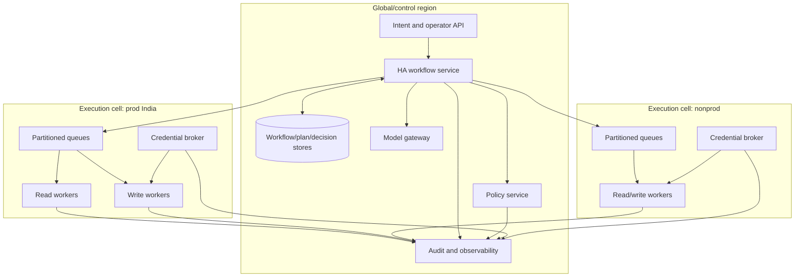
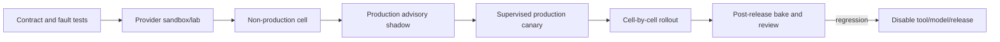

# Deployment, Scaling, Cost, and Roadmap

> **Status:** Research-backed production blueprint  
> **Last researched:** 2026-08-31  
> **Scope:** Deployment topology, operations, capacity, cost, release management, disaster recovery, and staged adoption  
> **Research packet:** [Infrastructure Operations Agent research packet](../../research/packets/infrastructure-operations-agent-blueprint.md)

## Production position

Deploy the infrastructure agent as a control-plane product with isolated execution cells, not as a chatbot with a fleet-wide credential. Start with advisory reads, prove inventory and audit, introduce supervised low-risk writes, and grant autonomous remediation only to individually evaluated operation classes.

## Reference deployment



Use separate cells at least for production versus non-production and for provider trust domains with materially different risk. High-assurance tenants may receive dedicated cells or full control planes.

### Cell placement contract

| Field | Example | Enforcement |
|---|---|---|
| cell_id / trust_domain | `prod-india-aws-1` | Immutable in queue, workflow, identity, trace, and artifact key |
| provider authorities | AWS accounts `4444...`, `5555...` | Broker role allowlist and network egress |
| tenants/environments | `t-acme/production` | Admission policy; no worker-side reassignment |
| operations | observe + routine R1/R2 | Separate queues/roles for higher risk |
| capacity envelope | reads 200/s; writes 10 in flight; reconciliation reserve 30% | Admission and token buckets |
| data residency | India region, tenant key `kms/...` | Store/export routing and encryption policy |
| failover destinations | `prod-india-aws-2` only | Same or stronger trust; never implicit cross-cell spillover |
| quarantine switch | broker + queue + role deny | Stops new effects while retaining read/reconcile/audit |

Placement is calculated deterministically from authenticated tenant, environment, provider authority, region, and effect class. The model cannot choose a cell.

## Component deployment requirements

| Component | Availability and isolation |
|---|---|
| Intent/API | Multiple replicas, strong IdP, tenant-bound admission, per-principal limits |
| Workflow | HA service and durable database; tested replay/versioning |
| Inventory | Provider-partitioned collectors, event checkpoints, periodic full reconciliation |
| Model gateway | Provider limits, allowlisted releases, context/token budgets, no target network |
| Policy | Versioned signed bundles, HA evaluation, fail-closed writes |
| Approval | Strong sessions, immutable plan projection, separation of duties |
| Broker | Separate high-trust service, HSM/KMS-backed keys where relevant, no model access |
| Workers | Ephemeral, immutable images, one cell, no standing secret, narrow egress |
| Stores | Encryption, per-tenant authorization, backup/restore, audit |
| Audit | Independent administration, append-only retention/export, gap detection |

## Queue and scheduling

Partition work by:

- tenant and environment;
- provider authority/account/subscription/project/cluster;
- region or execution cell;
- read, simulation, routine write, privileged write;
- priority such as incident versus scheduled maintenance;
- resource lock/effect domain.

Use weighted fairness so one tenant or provider outage cannot starve others. Reserve capacity for reconciliation and cancellation; these paths must remain available during overload. A new diagnostic request should not displace recovery of an uncertain production effect.

### Backpressure

- admission-control target count, estimated calls, context bytes, and cost;
- bounded per-tenant/provider queues;
- provider-specific token buckets;
- maximum concurrent model requests;
- adapter concurrency plus provider-native concurrency;
- circuit breakers on error/SLO/verification signals;
- load shedding for low-priority reads with explicit freshness labels;
- no unbounded fan-out from a model-produced list.

Kubernetes API Priority and Fairness can protect API servers, but clients still need their own limits, and long-running requests such as exec/log streaming are special cases.

## Capacity model

Estimate each stage independently:

```text
inventory load = authorities × resources × scan frequency + event rate
planning load  = requests × evidence size × model tokens
effect load    = targets × provider calls × retry amplification
verification   = changed targets × checks × bake duration
audit load     = state transitions + provider events + artifact bytes
```

The slowest and safest stage controls throughput. Increasing worker count without provider budgets, target disruption limits, or audit capacity expands risk rather than useful capacity.

### Queue sizing and recovery reserve

For each partition, measure arrival rate `λ`, service time `S`, provider quota, and safe concurrency. A practical starting capacity is bounded by all of them:

```text
safe_in_flight = min(
  worker_capacity,
  provider_quota_after_reserved_headroom,
  target_disruption_budget,
  audit_and_verification_capacity,
  policy_max_concurrency
)

drain_time = queued_work / sustainable_completion_rate
```

Reserve workers, provider calls, and audit capacity for cancellation, status polling, reconciliation, and recovery. Alert on oldest age by priority/effect class, not only queue depth. Admission rejects or defers work when its worst-case retry/verification cost cannot fit within the deadline and reserved safety capacity.

### Admission-envelope example

```yaml
admission:
  tenant_id: t-acme
  cell_id: prod-india-aws-1
  effect_class: os.patch.apply
  targets: 12
  estimated:
    provider_calls: 96
    worker_seconds: 3600
    verification_queries: 240
    artifact_bytes: 10485760
    model_tokens: 22000
  limits:
    tenant_write_in_flight: 4
    provider_calls_per_minute: 120
    cell_reconciliation_reserve_percent: 30
    max_queue_delay_seconds: 300
  decision: admit
```

## Performance guidance

- Query normalized inventory first; perform just-in-time authoritative reads only for relevant preconditions.
- Load only the tool catalog subset valid for the tenant, environment, provider, target type, and mode.
- Summarize or reference large logs; retain provenance and allow drill-down.
- Parallelize independent reads with bounded concurrency.
- Keep writes serialized where they share a resource or disruption domain.
- Cache stable schemas and policy data by immutable version, never current authorization decisions beyond their valid context.
- Use asynchronous provider job APIs rather than holding connections.
- Separate operator latency objectives from maintenance completion time.

## Cost model

| Cost center | Drivers | Controls |
|---|---|---|
| Model | tokens, model tier, retries, context duplication | deterministic parsing, evidence selection, tiered routing, prompt caching where safe |
| Inventory | API calls, events, storage, cross-region transfer | event + periodic reconcile, field projection, provider aggregators |
| Workflow | histories, timers, search, database I/O | compact events, artifact references, retention/continue-as-new |
| Execution | worker time, gateways, provider managed services | ephemeral workers, async jobs, bounded retries |
| Telemetry | trace/log volume and artifact retention | allowlisted fields, sampling reads, retain full write audit |
| Isolation | dedicated cells/accounts/clusters | risk-tier placement; do not collapse required security boundaries |
| Verification | synthetic/metrics queries and bake time | operation-specific checks, shared observability caches with freshness |

Do not save model cost by giving a smaller model broader execution autonomy. Cost optimization follows safety and measured task quality.

Attribute cost per request/run/operation using tenant, cell, provider, tool, model release, and phase. Keep model token estimates separate from cloud-effect estimates and realized provider bills; the infrastructure agent enforces an approved budget but does not perform FinOps allocation, commitment purchasing, or accounting. High-cardinality telemetry and forensic retention need their own budget because write audit cannot be sampled like routine read traces.

## Release manifest

Every deployment release records:

- control-plane and worker image digests;
- workflow definitions and compatibility version;
- tool schemas and adapter digests;
- provider SDK/API and Kubernetes compatibility;
- policy bundle and inventory schema;
- model provider/model ID, prompt/template, and routing policy;
- evaluation dataset/result version;
- telemetry schema and redaction policy;
- database migrations and rollback/forward procedure;
- known limitations and disabled operation classes.

Plans bind the relevant release fields. In-flight workflows either continue on compatible code or migrate through an explicit version path.

## Release sequence



Release the reasoning tier and write adapters independently where possible. A model upgrade should not require changing provider permissions; an adapter upgrade should not silently change the plan interpretation.

### Upgrade matrix

| Changed artifact | Mandatory checks | In-flight treatment | Rollback unit |
|---|---|---|---|
| Model/provider/routing | Fixed + held-out planning, injection, abstention, cost/latency; shadow comparisons | Existing sealed plans retain original release or replan | Model routing manifest |
| Context compiler/compactor | Evidence inclusion, authorization filters, repeated compaction, receipt replay | Rebuild view from durable state; never migrate by transcript alone | Compiler/template bundle |
| Tool schema/adapter/SDK | Contract compatibility, least privilege, provider sandbox, timeout-after-dispatch, audit correlation | Old tool digest stays available for reconcile; new effects require compatible plan | Tool + adapter image |
| Policy/approval rules | Decision replay, deny cases, obligation enforcement, separation of duties | Re-authorize at commit; material obligation change invalidates approval | Signed policy bundle |
| Runbook/IaC/GitOps definition | Diff, signature/digest, idempotency, recovery, target compatibility | Plan binds old digest; changed effect requires replan | Runbook/source revision |
| Workflow/state schema | Replay, migration, mixed worker versions, history growth, restore | Version route or explicit migration; no silent reinterpretation | Workflow + schema migration |
| Telemetry/redaction | PII/secret tests, cardinality/volume, dashboard/SLO migration | Dual read/emit only under bounded migration plan | Telemetry schema/collector config |

Roll back the smallest independently deployable unit, but preserve a known-good complete bundle so interacting regressions can be reversed together.

## Deployment checks

- signed immutable artifacts and admission verification;
- least-privilege service accounts and no default credential discovery;
- reasoning tier cannot route to targets/provider management;
- worker egress is cell-specific;
- broker keys and policy bundles are independently protected;
- database migrations preserve in-flight workflow interpretation;
- restore drills fence old workers;
- kill switches work at request, operation class, tenant, cell, adapter, and provider-role layers;
- maintenance/freeze calendar is live;
- inventory and audit coverage meet write eligibility.

## Operating the service

### On-call dashboards

- requests by mode/risk/tenant/provider;
- inventory freshness and collector permission changes;
- workflow queues, oldest uncertain operation, and reconciliation lag;
- broker issuance failures and token TTL/revocation;
- provider throttle/error and retry amplification;
- active rollouts, budgets, window remaining, stop signals;
- provider-audit correlation and audit export gaps;
- verification/SLO failures;
- model validity, injection flags, tokens, latency, and cost;
- disabled tools, cells, and expiring policy exceptions.

### Runbooks

Maintain versioned runbooks for:

- pause/disable one tool or adapter;
- revoke a cell's provider trust;
- reconcile an uncertain operation;
- audit pipeline degradation;
- inventory permission/coverage loss;
- model provider outage or bad release;
- workflow database failover/restore;
- credential broker compromise;
- tenant isolation incident;
- provider regional outage;
- break-glass and return to normal control.

### Infrastructure-agent incident runbook

1. Classify the failure as reasoning-only, control-plane, credential, effect, tenant-isolation, audit, or target/provider incident.
2. Stop the narrowest unsafe surface first: model release, operation class, tenant, cell, adapter, or provider role. Stop all writes for credential/isolation/audit uncertainty.
3. Preserve workflow/event/effect records, context receipts, release digests, provider events, and relevant artifacts. Do not collect unrestricted prompts or target secrets.
4. Reconcile dispatched and accepted effects before restarting workers or retrying requests.
5. Transfer network, database, deployment, security, IAM, FinOps, or incident-command decisions to the accountable owner; the infrastructure agent remains an evidence/effect participant.
6. Recover using the tested runbook, validate independent service signals, and resume through read-only then supervised canary stages.
7. Create failure-mining candidates for every control gap and record achieved containment, uncertainty duration, RPO/RTO, and customer impact.

## Disaster recovery

| Component | Recovery concern |
|---|---|
| Workflow store | Restore durable transitions; fence all pre-restore workers |
| Effect ledger | Must not lose dispatch/provider IDs; reconcile nonterminal entries |
| Plan/approval store | Preserve digests and decision evidence |
| Inventory | Restore checkpoint then full reconcile before writes |
| Broker | Rebuild trust and rotate credentials/keys; do not restore expired tokens |
| Audit | Preserve independent archive and identify any collection gap |
| Tool registry | Recover signed known-good versions |

After control-plane recovery, enter read-only reconciliation mode. Do not resume queued writes until policy, inventory, leases, cells, and audit are healthy.

### DR objectives and evidence

| Component | Define | Restore proof |
|---|---|---|
| Workflow/event/effect stores | RPO for transitions and provider IDs; RTO to read-only reconcile | Event projection rebuild, sequence/digest checks, every nonterminal effect listed |
| Plan/approval/policy | RPO must preserve artifacts authorizing retained effects | Digests validate and authorization can be replayed/explained |
| Inventory | RTO to fresh coverage, not merely database availability | Full scans/watches re-established; authority coverage and conflicts visible |
| Broker/cell trust | RTO to mint new credentials after rotation | Old epoch denied; new canary scoped and provider-audited |
| Audit | Maximum export gap and evidence-repair process | Independent archive continuity or explicit gap incident |
| Model/reasoning | Lower criticality than deterministic recovery | In-flight reconciliation works with model unavailable |

Run regional/cell-loss, corrupted-backup, delayed-audit, unavailable-IdP, and old-worker-return exercises. Record measured rather than aspirational RPO/RTO.

## Roadmap with exit gates

### Phase 0: foundations

Build canonical identity, provider inventory, tenant boundaries, audit export, policy model, and read-only adapters.

**Exit:** coverage/freshness measured; cross-tenant tests pass; every read cites source and time.

### Phase 1: advisory diagnosis

Add bounded context assembly, model planning, evidence citations, plan schema, evaluation corpus, and operator console.

**Exit:** injection and target-selection evaluations meet thresholds; no write credentials/routes exist.

### Phase 2: simulated plans

Integrate Terraform plans, Ansible check/diff, Kubernetes dry-run, GitOps diffs, and provider previews with limitation labels.

**Exit:** sensitive artifact controls and stale-plan invalidation are proven; operators correctly interpret simulations in usability tests.

### Phase 3: supervised single-target writes

Add durable workflow, sealed approvals, broker, effect ledger, typed adapters, reconciliation, and verification for one or two reversible operations.

**Exit:** timeout-after-dispatch, duplicate, cancellation, audit loss, and restore tests pass; provider audit joins every supported operation.

This is the recommended **reliable v1** boundary. Resist adding providers or tool count until on-call can operate it for a full review period with known failure and cost profiles.

### Phase 4: bounded rollouts

Add canaries, fault-domain budgets, SLO circuit breakers, maintenance windows, batch recovery, and cell isolation.

**Exit:** fault injection contains failures within the sealed budget; on-call and kill-switch drills pass.

### Phase 5: constrained autonomous remediation

Pre-authorize one low-risk remediation with deterministic eligibility, expiry, shadow evidence, and independent verification.

**Exit:** false-positive and harmful-effect thresholds hold over the review period; owner, kill switch, and recurring review are active.

### Phase 6: continuous evolution and fleet learning

Turn reviewed production evidence into versioned improvements: mine incidents and operator corrections into candidate evaluations, replay them against old and proposed model/tool/policy bundles, shadow every behavioral release, canary it by tenant and remediation class, and retain fast rollback to the previous complete bundle. Expand regions, providers, and autonomy only when held-out safety, recovery, cost, and SLO evidence improves without widening authority.

**Exit:** the team can reproduce any released decision from pinned artifacts, detect regression by workload and risk tier, roll back model/tool/policy/context changes independently, verify memory and retention migrations, and show that no learning path can publish a privileged tool, policy, runbook, or autonomous remediation without accountable review.

### Fleet expansion gate

Add one cell, provider authority class, or tenant isolation tier at a time. Before expansion, replay provider-specific contracts, validate inventory completeness and audit coverage, measure quotas/revocation, prove target and credential isolation, run restore/failover, and canary only advisory then supervised operations. Shared schemas do not waive provider/distribution qualification.

### Explicitly deferred

- autonomous IAM/RBAC/trust/perimeter changes;
- destructive storage, backup, key, or audit operations;
- database schema/data recovery;
- novel incident remediation without a tested runbook;
- general interactive shells;
- agent-controlled break-glass.

## Custom/framework/hybrid implementation roadmap

| Stage | Simplest suitable implementation |
|---|---|
| Advisory prototype | Small custom planner or agent SDK behind read-only gateway |
| Approval prototype | Framework pause UX may be used, with app-owned plan/identity binding |
| Production effects | Durable workflow and application-owned policy/broker/ledger |
| Large multi-provider estate | Hybrid control plane, regional/tenant cells, typed provider adapters |

Avoid adopting a multi-agent architecture merely because providers differ. Provider expertise can be modular tool/context packages or deterministic adapters. Add specialized reasoning agents only when evaluation demonstrates a material benefit and their context, tools, and privileges remain bounded.

## Ownership

| Area | Accountable team |
|---|---|
| Control plane/workflows | Platform engineering |
| Policy and approval classes | Security plus infrastructure governance |
| Provider adapters | Cloud/platform owners |
| Inventory/identity graph | Asset/platform identity owners |
| Model/evaluations | Agent engineering with domain reviewers |
| Audit and detection | Security operations |
| Service postconditions | Application/service owners |
| Break-glass | Security and cloud account owners |

No single team should be able to publish a privileged tool, grant its provider permission, approve its use, and erase its audit.

## Refresh triggers

Re-qualify relevant components when:

- a cloud provider changes API, IAM, audit, inventory, maintenance, or product availability;
- a Kubernetes minor or feature-gate baseline changes;
- an adapter, provider SDK, IaC/GitOps tool, workflow engine, agent framework, model, or MCP version changes;
- token/audit retention or regional data rules change;
- a security advisory affects any trust boundary;
- an incident shows a new failure mode;
- evaluation or production telemetry crosses a safety threshold.

## Sources

- [Google SRE: Canarying releases](https://sre.google/workbook/canarying-releases/)
- [AWS Builders' Library: Safe hands-off deployments](https://aws.amazon.com/builders-library/automating-safe-hands-off-deployments/)
- [Kubernetes API Priority and Fairness](https://kubernetes.io/docs/concepts/cluster-administration/flow-control/)
- [AWS Systems Manager Run Command rate controls](https://docs.aws.amazon.com/systems-manager/latest/userguide/send-commands-multiple.html)
- [Google Cloud VM Manager patch jobs](https://cloud.google.com/compute/vm-manager/docs/patch/create-patch-job)
- [OpenTelemetry semantic conventions](https://opentelemetry.io/docs/specs/semconv/)

## Related guides

- [Observability, evaluation, and failure testing](08-observability-evaluation-and-failure-testing.md)
- [Production agent control plane](../../architectures/production-agent-control-plane.md)
- [Scaling, capacity, and SLOs](../../operations/scaling-capacity-and-slos.md)
- [Deployment, release, and incident response](../../operations/deployment-release-and-incident-response.md)
