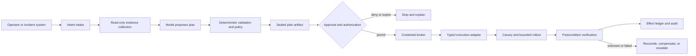

# Infrastructure Operations Agent Blueprint

> **Status:** Research-backed production blueprint  
> **Last researched:** 2026-08-31  
> **Scope:** Agents that observe, plan, and safely operate VPS, cloud, and Kubernetes infrastructure  
> **Research packet:** [Infrastructure Operations Agent research packet](../../research/packets/infrastructure-operations-agent-blueprint.md)

## Production position

An infrastructure agent should be an **untrusted planner inside a deterministic operations control plane**. The model may interpret intent, collect evidence, propose a plan, and explain results. It must not be the component that decides whether a principal is authorized, whether a plan is still current, which credentials to mint, or whether a side effect succeeded.

The recommended design is hybrid:

- application-owned inventory, identity, policy, approval, credential, effect-ledger, rollout, and verification services;
- a durable workflow runtime for waits, retries, and recovery;
- typed provider adapters for cloud APIs, Kubernetes, SSH, and WinRM;
- an LLM for bounded reasoning and operator communication;
- optional agent-framework conveniences for tool schemas, model routing, traces, and pause/resume ergonomics.

This separation is the main safety property. Framework approval prompts and structured tool calls are useful interfaces, not authorization or transaction boundaries.

## What this blueprint covers

| Guide | Decision it owns |
|---|---|
| [Purpose, operating model, and requirements](01-purpose-operating-model-and-requirements.md) | Goals, non-goals, autonomy modes, requirements, and risk tiers |
| [Reference architecture and technology choices](02-reference-architecture-and-technology-choices.md) | Components, runtime and language choices, and custom/framework/hybrid alternatives |
| [Inventory, identity, and tenancy](03-inventory-identity-and-tenancy.md) | Resource identity, discovery, freshness, credential brokerage, and tenant isolation |
| [Tool, effect, and session contracts](04-tool-effect-and-session-contracts.md) | Read/write separation, typed effects, SSH/WinRM/API boundaries, and reconciliation |
| [Desired state, plans, approvals, and drift](05-desired-state-plans-approvals-and-drift.md) | Sealed plans, diffs, authorization, windows, rollouts, and drift handling |
| [Security boundaries, secrets, and threat model](06-security-boundaries-secrets-and-threat-model.md) | Threats, policy enforcement, isolation, secret handling, and injection defenses |
| [State, reliability, recovery, and break-glass](07-state-reliability-recovery-and-break-glass.md) | Durable state, idempotency, uncertain outcomes, rollback, and emergency access |
| [Observability, evaluation, and failure testing](08-observability-evaluation-and-failure-testing.md) | Audit lineage, SLOs, evaluations, fault injection, and acceptance gates |
| [Deployment, scaling, cost, and roadmap](09-deployment-scaling-cost-and-roadmap.md) | Cells, capacity, release operations, economics, disaster recovery, and staged rollout |

## Start with the least agentic solution

Before building an execution agent, ask whether a deterministic mechanism already solves the work:

1. a dashboard, inventory query, or fixed diagnostic runbook for observation;
2. a reviewed Terraform/Ansible/GitOps change for declared configuration;
3. a provider-native automation document or typed internal runbook for routine imperative work;
4. a model-assisted planner only when intent or evidence genuinely needs interpretation;
5. supervised execution only after the same deterministic executor is safe without the model;
6. constrained autonomy only for a named remediation class with production evidence.

This order keeps the useful part of the agent—evidence synthesis and plan drafting—without replacing controllers, pipelines, or runbooks that already provide stronger semantics.

## Control flow

The execution path must not reuse model context as authoritative state. Every write re-reads the target, rechecks the policy and window, and obtains a short-lived, operation-scoped credential.

## Non-negotiable invariants

1. **No authority from prose.** A prompt, chat role, ticket comment, or model assertion never grants infrastructure permission.
2. **No write without a sealed plan.** The approved artifact identifies exact targets, intended changes, preconditions, budgets, policy and tool versions, expiry, and verification.
3. **Approval is not authorization.** Both are evaluated, and authorization is repeated immediately before credential issuance and commit.
4. **Read and write capabilities are separate.** They use different tool registries, identities, credentials, network paths, and rate budgets.
5. **Credentials are short-lived and scoped.** The model never receives reusable private keys, refresh tokens, kubeconfigs, or vault root material.
6. **Every effect has an identity.** Operation IDs, idempotency keys, target versions, and an append-only effect ledger make retries and reconciliation possible.
7. **Unknown is not success.** A timeout after dispatch enters an uncertain state; it is reconciled before any retry.
8. **Blast radius is enforced outside the model.** Target count, fault-domain, concurrency, error, disruption, and spend limits are hard controls.
9. **Verification is independent.** Success means observed postconditions and health signals, not a zero exit code or a provider acknowledgement.
10. **Break-glass remains human controlled.** Emergency access bypasses failing dependencies where necessary, but never audit, alerting, or after-action review.

## Operating modes

| Mode | Model may do | Human or policy gate | Suitable work |
|---|---|---|---|
| Advisory | Read, diagnose, draft commands and plans | Human executes elsewhere | Initial rollout, novel incidents, high-risk or irreversible work |
| Supervised execution | Read and propose; executor runs a sealed plan | Named approver plus live authorization | Routine changes, maintenance, bounded incident actions |
| Constrained autonomous remediation | Select from pre-approved remediations and execute within budgets | Pre-authorization; real-time policy and circuit breakers | Known, reversible, low-risk failure modes with reliable verification |

Autonomy is a property of a specific remediation class, target scope, and policy version—not a global switch on an agent.

## Category boundary

The infrastructure operations agent owns compute/platform resource inventory and bounded repair. It may call or hand off to adjacent systems, but it does not absorb their authority.

| Adjacent category | Infrastructure agent may | Infrastructure agent must hand off |
|---|---|---|
| Network operations | Read dependency/reachability evidence; request an approved network runbook | Routing, DNS, firewall, load-balancer, certificate, or traffic-policy design and recovery |
| Database operations | Read service dependency health; restart a host only under the database runbook | SQL, schema, backup/restore, replication, failover, and data-integrity decisions |
| DevOps/deployment | Inspect desired revisions and trigger an already-governed pipeline | Build, artifact promotion, application rollout policy, and release ownership |
| SRE/incident response | Contribute evidence and execute an incident-authorized infrastructure action | Incident command, user-impact prioritization, communications, and root-cause ownership |
| FinOps | Enforce a sealed spend/resource budget and report estimated cost | Allocation, forecasting, commitments, accounting, and financial authorization |
| IAM/security | Request an operation-scoped identity and obey policy | Designing/granting roles, trust, break-glass, containment authority, or security adjudication |

When work crosses a boundary, the plan records the owning system/team, handoff ID, accepted input contract, and return evidence. A shared ticket does not merge authority.

## Risk classification

| Risk | Examples | Default treatment |
|---|---|---|
| R0: observe | Inventory query, metrics, logs, configuration read | Automatic, redacted, rate limited |
| R1: reversible local | Restart one stateless replica, clear a safe cache | Autonomous only after evidence and health checks |
| R2: bounded service change | Roll a deployment, patch a small canary set | Supervised; canary and automatic halt |
| R3: broad or privileged | IAM, firewall, control-plane, database failover | Multi-party approval and specialist runbook |
| R4: irreversible or existential | Destructive data operation, root trust change, global policy | Keep outside general agent execution; dedicated ceremony |

Risk is raised by ambiguity, stale inventory, unverified backup, missing rollback, cross-tenant scope, control-plane impact, or an active incident that invalidates normal assumptions.

## Deployment baseline

The blueprint is provider-neutral but intentionally uses provider-native controls:

- AWS IAM/STS, Systems Manager, Organizations, Config, Resource Explorer, and CloudTrail;
- Azure managed identities, PIM, Run Command, Arc, Policy, Resource Graph, and Activity Log;
- Google Cloud service-account impersonation, IAM Conditions/Deny, PAM, VM Manager, Cloud Asset Inventory, and Audit Logs;
- Kubernetes RBAC, short-lived service-account tokens, dry-run, server-side apply, watches, audit, Pod Security, and disruption controls;
- OpenSSH certificates and constrained principals for Unix hosts;
- WinRM over an authenticated encrypted channel and Just Enough Administration for Windows;
- Terraform, Ansible, Flux, or Argo CD where desired-state systems already own the resource.

These products are adapters, not the architecture. Their availability and exact semantics vary by account, region, version, and feature lifecycle.

## Version baseline and refresh policy

The source behavior in this blueprint was checked on 2026-08-31 against then-current official documentation. Particularly volatile surfaces are:

- Kubernetes API and feature-gate behavior;
- MCP transport, authorization, extension, and task semantics (the 2026-07-28 specification changed all four materially);
- agent-framework pause/resume and durable-execution behavior;
- cloud inventory retention, session logging, and maintenance-window semantics;
- OpenTelemetry generative-AI semantic conventions, now maintained separately from the main semantic-conventions repository;
- provider product availability, quotas, and deprecation notices.

Refresh the blueprint before adopting a new provider API version, Kubernetes minor, workflow runtime, identity mechanism, or model/tool protocol. Also refresh within 30 days of a security advisory or product deprecation affecting an execution path. See the [research packet](../../research/packets/infrastructure-operations-agent-blueprint.md#version-and-volatility-baseline) for explicit baselines and contradictions.

## Suggested reading paths

**Architect or reviewer:** 01 → 02 → 05 → 06 → 07 → 08.

**Tool-adapter implementer:** 03 → 04 → 05 → 07.

**Platform operator:** 03 → 06 → 08 → 09.

**Security assessor:** 01 → 03 → 04 → 06 → 07.

## Related repository guides

- [Production agent control plane](../../architectures/production-agent-control-plane.md)
- [Tool contracts](../../tools/tool-contracts.md)
- [Durable execution](../../runtime/durable-execution.md)
- [Execution boundaries](../../runtime/execution-boundaries.md)
- [Idempotency and side effects](../../reliability/idempotency-and-side-effects.md)
- [Permissions, sandboxing, and secrets](../../security/permissions-sandboxing-and-secrets.md)
- [Observability and tracing](../../evaluation/observability-and-tracing.md)
