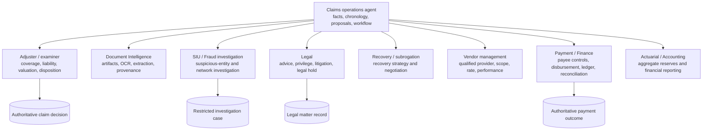

# Mission, Workload Fit, Authority, and Domain Boundaries

> **Purpose:** Decide whether a model-assisted agent belongs in a claims workflow, define its exact useful role, and prevent assistance from becoming unauthorized adjusting, adjudication, investigation, legal work, or payment authority.

## Mission statement

An insurance claims operations agent reduces avoidable handling effort and delay while improving evidence completeness, consistency, and auditability. It does this by coordinating bounded tasks around an authoritative claim file:

- normalize FNOL inputs and identify unresolved parties, policies, claims, incidents, and exposures;
- gather and organize policy, document, communication, estimate, vendor, and regulatory evidence;
- compare uncertain information and produce cited, typed recommendations;
- maintain deterministic obligations, work queues, approvals, handoffs, and effect status;
- draft accurate claimant communications from approved templates and current facts;
- help adjusters and examiners reach decisions without making those decisions for them;
- prove what external systems committed and surface exceptions quickly.

The mission is not to maximize “touchless claims.” Optimize for fair, timely, source-supported handling with lower harmful-error and rework rates. Straight-through processing is valuable only for deterministic, pre-qualified operations whose business and legal controls do not depend on model judgment.

## Workload qualification

### Use no model when

| Work shape | Better implementation |
| --- | --- |
| Required fields, transitions, and routing are complete and stable | Form validation plus workflow/rules engine |
| Deductible, limit, depreciation, reserve, or benefit calculation is formulaic | Versioned calculation service |
| A clock starts from a known event under an approved rule | Durable timer service |
| A notice uses known facts and an approved template | Deterministic document/communication generator |
| Carrier API exposes an exact semantic operation | Typed adapter and effect gateway |
| A policy or claim record is retrieved by stable identity | Direct system query |

Natural language is not a reason to put a model on the control path if deterministic extraction or a constrained form already meets measured quality.

### Use a bounded model worker when

| Ambiguity | Permitted contribution | Required control |
| --- | --- | --- |
| Free-form FNOL narrative | Extract candidate date, location, parties, damage, and injuries | Evidence spans, schema validation, no inferred coverage |
| Mixed documents and images | Summarize approved extraction results and compare conflicts | Document Intelligence owns original and extraction lineage |
| Policy bundle is lengthy | Retrieve and cite potentially relevant provisions | Exact policy version; adjuster owns application and decision |
| Estimates disagree | Normalize line items and explain differences | Deterministic arithmetic and qualified damage review |
| Claim file is large | Create an evidence-grounded chronology and open-issue list | Every event links to authoritative record or artifact |
| Communication needs plain language | Draft against facts, approved template, and jurisdiction rule | Prohibited claims language checks and human approval by class |
| Exception has several evidence-gathering steps | Execute a bounded read-only plan | Typed steps, budgets, stop conditions, and no ambient write tools |

### Reject the agent pattern when

- the proposed value depends on the model independently interpreting coverage or law;
- the only integration is broad interactive access to an adjuster's workstation;
- the carrier cannot provide immutable policy/evidence versions or reconstruct claim decisions;
- downstream writes cannot be deduplicated or reconciled;
- the organization cannot name an authorized human owner for decisions and exceptions;
- model use would disclose claim data to an unapproved provider or violate residency, privilege, consent, or retention constraints;
- an average accuracy score is being used to justify denial, settlement, liability, or payment authority;
- the workflow cannot continue safely during model or provider outage.

## Decision authority matrix

The model can contribute analysis without owning the claim outcome. “Human reviewed” is insufficient: the reviewer must have the authority, license or designation, product/jurisdiction competence, current assignment, and amount limit required for that decision.

| Operation | Model role | Deterministic gate | Human owner | Maximum level |
| --- | --- | --- | --- | --- |
| Summarize current claim file | Produce cited summary | Purpose-limited projection and freshness check | Optional quality review | C0 |
| Extract FNOL candidate facts | Propose values and uncertainties | Schema, identity, source, and duplication validation | Intake specialist for exceptions | C1 |
| Create a draft FNOL/claim | Populate reversible draft | Tenant, policy candidate, loss date, source, and operation ID | Intake/adjuster approval per procedure | C2 |
| Open or assign a claim | No free-form choice; may recommend queue | Eligibility, routing, workload, license, and exact target rules | Claims operations owner where required | C3 for deterministic approved effect |
| Request missing evidence | Draft from allow-listed request type | Need, duplication, privacy, channel, recipient, clock, and template rules | Pre-authorization only for narrow requests | C4 ceiling |
| Determine coverage or deny in whole/part | Assemble evidence and recommendation only | None can delegate the final decision to the model | Authorized adjuster/examiner and legal review when required | Human-only decision |
| Determine liability, compensability, benefit, or fault | Compare evidence and identify contradictions | Product/jurisdiction rules support review | Authorized adjuster/examiner | Human-only decision |
| Assess damage or loss | Normalize observations and estimates; recommend range | Arithmetic, source quality, vendor/price-data version | Qualified adjuster/appraiser/expert | C1 |
| Set or change case reserve | Recommend amount/range and rationale | Coverage/exposure, amount, authority, financial and approval rules | Adjuster/manager with reserve authority | C3 exact approval; no model authorization |
| Make a settlement offer or accept settlement | Draft decision surface/letter only | Authority, coverage, liability, release, lien, legal, and payment checks | Authorized claims professional/legal as applicable | Human-only decision/effect approval |
| Initiate payment | Produce exact proposed intent | Payee/lien/tax/sanctions, amount, authority, coverage, release, duplicate, and state checks | Authorized claims/payment approver | C3; model never executes high-impact payment |
| Identify recovery/subrogation opportunity | Propose referral with supporting facts | Eligibility, limitation, conflict, recovery rules | Recovery/subrogation specialist | C1/C2 |
| Demand, negotiate, settle, or book recovery | None beyond drafting and summarization | Legal/financial/recovery controls | Recovery/legal/finance owners | Human-owned effect |
| Create vendor service request | Recommend task/scope and draft request | Approved vendor, license, geography, privacy, authority, rate, and duplicate checks | Adjuster/vendor manager | C3 exact approval; narrow C4 only if reversible |
| Refer suspicious activity | Package facts and source links; never declare fraud | Confidential routing and minimum-necessary disclosure | SIU/fraud unit | C2 referral |
| Investigate networks or file fraud report | No claims-agent investigation | Fraud authority, legal thresholds, confidentiality, reporting procedure | SIU/fraud/regulatory owner | Outside scope |
| Handle demand, lawsuit, subpoena, coverage opinion, or privilege | Detect and route only | Legal hold and restricted access | Legal counsel | Outside scope |
| Close or reopen a claim | Recommend checklist status | Open exposures, payments, recoveries, notices, holds, approvals, and owner checks | Authorized adjuster/examiner | Human decision; exact system effect |

## Claims roles are not interchangeable

Do not implement these roles as cooperating model personas with shared credentials. They are organizational control boundaries with different data access, professional duties, records, and approvals.

## Decision surfaces for authorized people

A reviewer should not receive a transcript dump or a preselected “approve” button. The minimum surface contains:

- exact carrier, claim, policy term/version, loss, claimant role, exposure, and jurisdiction;
- decision type and the reviewer’s verified authority for it;
- source facts separated from allegations, model inferences, and deterministic calculations;
- directly accessible policy provisions, documents, images, estimates, messages, and prior decisions;
- missing, disputed, stale, or contradictory evidence;
- model recommendation, confidence/abstention, alternatives, and explicit non-recommendation when evidence is insufficient;
- applicable rule and procedure versions, due clocks, and downstream consequences;
- exact proposed record/effect payload and immutable intent hash;
- approve, reject, modify, request evidence, reassign, and escalate actions;
- a required reason code and optional narrative appropriate to the decision.

The interface must allow the reviewer to inspect evidence before seeing the recommendation in high automation-bias workflows. Measure correction and disagreement, not just click-through rate.

## Stop and escalation decision table

| Condition | Agent action | Destination |
| --- | --- | --- |
| Exact policy contract at loss cannot be reconstructed | Stop coverage assistance; preserve candidate policies and conflict | Policy services and adjuster |
| Claimant identity or role is ambiguous | Do not send, assign, or pay | Identity/intake queue |
| Material injury, fatality, vulnerable claimant, complaint, or accessibility need is identified | Apply protected routing and communication procedure | Senior/specialist claims queue |
| Coverage, liability, causation, valuation, or law is disputed | Present evidence; no autonomous disposition | Adjuster/examiner; legal if required |
| An attorney, demand, suit, subpoena, or privilege marker appears | Restrict context and suspend ordinary communication drafts | Legal matter intake |
| Suspicion threshold is met | Submit minimum-necessary confidential referral; keep ordinary claim path neutral | SIU/fraud queue |
| Fraud investigation status is requested by ordinary workflow | Deny access; record policy denial, not case existence | Restricted security/compliance path |
| Reserve/payment exceeds authority or changes materially | Block effect and route exact intent | Authorized claims manager/payment approver |
| Sanctions, lien, tax, Medicare/benefit coordination, bankruptcy, guardianship, or estate issue appears | Freeze payment path | Relevant specialist service |
| Downstream outcome is unknown | Stop retry and reconcile | Effect-recovery queue |
| Deadline may be missed | Escalate before due time; preserve manual execution path | Claims lead/compliance operations |
| Model abstains or evidence support fails | Do not translate uncertainty into a negative decision | Human work queue |

## Product and jurisdiction control matrix

Before a production route is enabled, complete one row for every supported **product × jurisdiction × claim/coverage/exposure type × claimant role** combination.

| Control | Required answer |
| --- | --- |
| Claim authority | Which roles may open, assign, reserve, decide, settle, pay, close, and reopen? At which amount/coverage bands? |
| Licensing/designation | Which adjuster, appraiser, examiner, medical, legal, or catastrophe credentials apply? |
| Policy evidence | Which PAS/archive objects prove the contract and transaction state at the loss instant? |
| Required clocks | Which events start, pause, resume, extend, or end each obligation? Calendar or business days? Which holiday/time-zone source? |
| Communications | Which notices, explanations, languages, accessibility modes, channels, delivery proofs, and limitation warnings apply? |
| Evidence | Which documents, inspections, reports, signatures, proofs, consent, and chain-of-custody records are required? |
| Financial controls | Which reserve/payment/recovery limits, payee/lien/tax/sanctions checks, approvals, releases, and reconciliation rules apply? |
| Fraud | What triggers internal referral, confidentiality, reporting, and separation from ordinary handling? |
| Legal | What triggers counsel, privilege, litigation hold, representation routing, or communication restrictions? |
| Privacy | Which purposes, data classes, health/financial records, provider boundaries, retention, deletion, and disclosure rules apply? |
| External reporting | Which regulator, CMS, workers' compensation, statistical, catastrophe, market-conduct, or partner submissions apply? |
| Appeal/dispute | What review, complaint, reconsideration, appraisal, mediation, or regulator contact must be offered and tracked? |
| Catastrophe overlay | How are event IDs, emergency orders, temporary adjusters, surge assignments, vendor scarcity, and extended deadlines handled? |

No route should inherit a control row from a “similar” product without named approval and regression evidence.

## Common authority failures

| Failure | Why it is dangerous | Control |
| --- | --- | --- |
| Model writes “not covered” into a customer-facing draft | A recommendation becomes an unauthorized denial | Prohibited-language classifier plus authorized decision record prerequisite |
| Claim opening is treated as coverage confirmation | Intake acknowledgment creates misleading expectation | Explicit FNOL/coverage separation in data and templates |
| Adjuster approval is accepted after reassignment or authority change | The approver no longer owns the decision | Commit-time assignment and authority revalidation |
| Payment approval binds only amount, not payee/coverage/release | Payload substitution after review | Canonical exact-intent hash |
| Fraud score automatically delays all communication | Suspicion silently changes ordinary claims handling | Separate confidential referral; jurisdiction-approved handling rule |
| Catastrophe mode disables review | Volume pressure widens authority | Capacity degradation without permission changes |
| “Prior similar claims” drive disposition | Historical inconsistency or bias becomes precedent | Current contract/rules remain authoritative; examples are nonbinding evidence |
| Vendor API reports completion without work evidence | Operational status is mistaken for verified service | Contracted postcondition and independent receipt/read-back |

## Readiness checklist

- [ ] The workflow has a measurable problem that deterministic automation alone does not solve.
- [ ] The model contribution is bounded to extraction, comparison, summarization, drafting, or recommendation.
- [ ] Every consequential decision and effect has a named accountable owner.
- [ ] Prohibited operations are enforced outside the prompt.
- [ ] Product/jurisdiction control rows are complete and versioned.
- [ ] Carrier and external systems can return immutable versions and reconciliation evidence.
- [ ] Human review surfaces expose primary evidence, conflicts, consequences, and exact intent.
- [ ] Fraud, legal, finance, actuarial, Document Intelligence, and vendor boundaries are implemented as access boundaries.
- [ ] The route has a safe manual/deterministic fallback.
- [ ] Evaluation covers harm-weighted slices, not only average accuracy or handle time.

## Sources and related guides

- [NAIC Model 900](https://content.naic.org/sites/default/files/model-law-900.pdf) identifies prompt communications, reasonable investigation, fair settlement, and accurate explanations as core claims-practice concerns; it is a model, not a universal state rule.
- [NAIC AI Model Bulletin](https://content.naic.org/sites/default/files/inline-files/2023-12-4%20Model%20Bulletin_Adopted_0.pdf) expects insurer governance and documentation when AI supports consumer-impacting insurance decisions; jurisdiction adoption and wording vary.
- [IAIS ICP 19](https://www.iaisweb.org/uploads/2024/12/IAIS-ICPs-and-ComFrame-adopted-in-December-2024.pdf) provides an international baseline for timely, fair, transparent handling, qualified staff, explained decisions, dispute handling, and insurer responsibility for outsourcing.
- [FEMA NFIP claims-adjustment training](https://emilms.fema.gov/IS1104/groups/362.html) illustrates a domain-specific separation in which an adjuster assists and recommends but the insurer approves or disapproves the claim.
- [Back-office workflow agent](../back-office-workflow-agent/README.md) defines the generic durable case pattern on which this domain blueprint builds.
