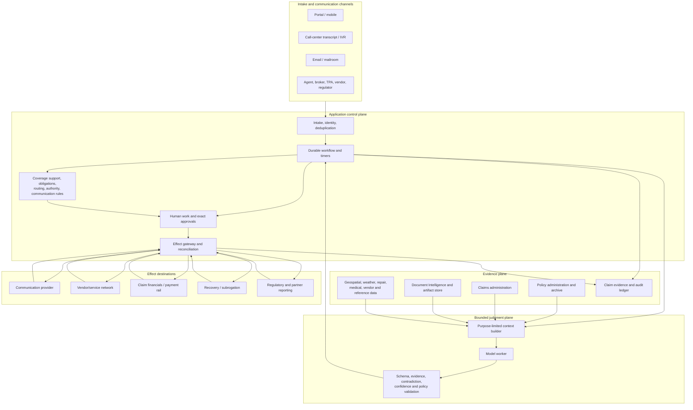
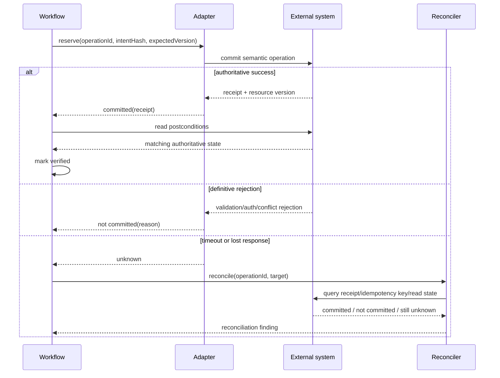

# Reference Architecture, Runtime Selection, and Integrations

> **Purpose:** Define a production architecture in which model judgment is useful but policy, state, authority, effects, and evidence remain under deterministic application control.

## Recommended architecture

Use a **durable claim-operations coordinator with bounded stateless model workers**. Separate five planes:

1. **Control plane** — identity, claim-work state, assignments, clocks, budgets, approvals, cancellation, authorization, and recovery.
2. **Evidence plane** — policy snapshots, original artifacts, extractions, photos, estimates, reports, communications, provenance, and versions.
3. **Judgment plane** — model-assisted extraction, comparison, chronology, drafting, and recommendation.
4. **Decision plane** — deterministic rules plus authorized human decisions for coverage, liability, valuation, reserves, settlement, referral, and closure.
5. **Effect plane** — narrow adapters, exact approvals, operation identities, receipts, read-back, reconciliation, and correction.



The coordinator, not the model, decides which model task may run, which evidence it may see, which schema it must return, and what happens after validation. A model response cannot call a commit adapter directly.

## Component responsibilities

| Component | Owns | Must not own |
| --- | --- | --- |
| Intake gateway | Authenticated source, received time, tenant, payload limits, basic schema, channel receipt | Coverage inference or duplicate merge by prose |
| Identity service | Policy/claim/party/vendor candidates, deterministic matches, ambiguity state | Silent model-selected identity |
| Durable coordinator | Work-item state, timers, assignment, retries, cancellation, budgets, event ordering | Claim-system financial truth |
| Policy evidence adapter | Exact term/version/forms/endorsements/transaction snapshot and source receipt | Legal interpretation or claim disposition |
| Claim projection adapter | Current claim, incidents, exposures, assignments, reserves, financial and communication status | Long-term shadow copy without freshness semantics |
| Document/evidence service | Immutable originals, derivatives, extraction lineage, source anchors, review state | Payment or filing authorization |
| Rules service | Versioned obligations, routing, formulas, authority, communication and effect prerequisites | Free-form policy interpretation |
| Context builder | Minimum-necessary, freshness-checked, labeled model input | Unfiltered file dump or hidden cross-tenant retrieval |
| Model worker | Typed extraction, comparison, summary, draft, recommendation, abstention | Workflow transition, approval, authorization, direct effect |
| Validation gateway | Schema, evidence coverage, contradiction, allowed action, confidence, prohibited language | Deciding whether the underlying claim is covered |
| Human work service | Assignment, qualified reviewer, review surface, decision and reason | Acting under a generic shared identity |
| Effect gateway | Exact intent, commit-time policy, idempotency, adapter call, receipt, reconciliation | Creating new business intent during retry |
| Evidence ledger | Append-only decision/effect lineage needed to reconstruct handling | High-volume sensitive diagnostic traces |
| Observability platform | Redacted metrics, traces, logs, alerts, cost, queue health | Authoritative claim or audit record |

## Runtime and framework selection

The claims workflow needs durable waits, event correlation, timers, versioning, human tasks, exact retry control, and recovery. A process-local agent loop cannot provide these guarantees by itself.

| Option | Use when | Strength | Main risk | Position |
| --- | --- | --- | --- | --- |
| Existing carrier workflow/case platform | It already owns assignments, timers, authority, and claim lifecycle | Lowest integration and operating complexity | Product-specific limits and release coupling | Prefer when it meets recovery and audit needs |
| General durable workflow engine | Long waits, many adapters, human tasks, event replay, and catastrophe scale exceed carrier workflow | Durable timers, retries, signals, and recovery | Determinism/versioning discipline and another platform to operate | Recommended when justified |
| BPM/case-management platform | Business teams need explicit modeled tasks, SLAs, and case discretion | Human work and regulatory process visibility | Model integration may be bolted on or overly generic | Strong alternative |
| Queue plus database state machine | One narrow workflow with few transitions and integrations | Simple, explicit, inexpensive | Easy to underbuild timers, concurrency, and recovery | Acceptable only with tested invariants |
| Agent framework as top-level runtime | Prototype or isolated read-only analyst | Fast model/tool orchestration | Weak lifecycle, authority, replay, and effect semantics | Do not use as claims control plane |
| Multi-agent framework | Independently owned computational tasks with no shared authority | Parallelism in rare bounded analysis | Persona handoffs obscure accountability and add nondeterminism | Usually reject |

Use an agent SDK only inside the bounded judgment worker if it materially improves structured tool calling, tracing, or provider portability. The surrounding application still owns workflow and effects. Compare the project options in [custom loop versus framework versus workflow engine](../../comparisons/custom-loop-vs-framework-vs-workflow-engine.md).

## Language selection

Choose the language that matches the carrier integration and operating environment. Do not create a second runtime only for model calls.

| Environment | Practical default | Notes |
| --- | --- | --- |
| Existing JVM or .NET carrier services | Java/Kotlin or C#/.NET | Strong types, mature integration/security stacks, low operational novelty |
| API-centric workflow and adapters | TypeScript/Node.js or the existing service language | Good schema/tool ergonomics; enforce decimal/time and cancellation discipline |
| Model/evaluation-heavy isolated workers | Python | Strong evaluation/data ecosystem; keep business invariants in application services |
| High-throughput edge adapter | Existing platform language; Go where already supported | Avoid introducing Go solely for theoretical efficiency |

Money uses decimal/fixed-point domain types, not binary floating point. Instants include time zone and source calendar. Every schema and canonicalization function is versioned across languages.

## Model selection and routing

Select models by evaluated claim task, not general benchmark rank.

| Route | Model requirement | Typical input | Controls |
| --- | --- | --- | --- |
| Narrative field extraction | Strong structured output and evidence spans | Short FNOL narrative | Closed schema, no tools, abstention |
| File chronology | Long-context synthesis with reliable citation behavior | Curated event/evidence projection | Chunk manifests, source IDs, contradiction check |
| Estimate comparison | Table and arithmetic support | Approved line items and photos | Deterministic calculations; no final value |
| Policy support | Retrieval and exact citation | Version-pinned policy bundle | Provision-level evidence; no coverage conclusion |
| Communication draft | Controlled generation and multilingual quality | Approved facts/template slots | Prohibited-language and required-content checks |
| Bounded investigation support | Tool use with planning discipline | Purpose-limited read adapters | Step/tool/time/token budgets and no commit tools |

Use the smallest evaluated model that meets the slice threshold. Routing never widens data or tool permissions. A fallback model must pass the same task-specific and harm-specific gates; provider failover is a behavior release, not an invisible retry.

## Integration contract pattern

Every adapter advertises capability, version, authority, freshness, idempotency, reconciliation, and data-boundary semantics.

```json
{
  "adapterId": "claim-system.reserve.v2",
  "tenantId": "carrier-123",
  "capability": "propose-or-commit-case-reserve",
  "mode": "read|stage|commit|reconcile",
  "schemaVersion": "2.1",
  "authn": "delegated-workload-identity",
  "authzPolicy": "claim-authority-2026-08",
  "freshness": {
    "observedAt": "2026-08-31T10:15:00Z",
    "resourceVersion": "claim-etag-441"
  },
  "idempotency": {
    "semanticOperationId": true,
    "payloadMismatchRejected": true
  },
  "outcome": {
    "receiptType": "authoritative-transaction-id",
    "statusRead": true,
    "readBack": true,
    "ambiguousTimeoutRepresentable": true
  },
  "dataBoundary": {
    "allowedClasses": ["claim-financial-summary"],
    "region": "configured-per-tenant",
    "retention": "application-policy"
  }
}
```

Reject adapters that cannot distinguish validation failure, authorization denial, conflict, throttling, transient transport failure, accepted-asynchronous work, committed success, and unknown outcome.

## Integration map

### Core carrier systems

| Integration | Read requirements | Write/effect requirements | Important failure |
| --- | --- | --- | --- |
| Policy administration and archive | Carrier, policy number, term, transaction, forms, endorsements, named insureds, risk, effective timestamps, cancellation/reinstatement, source version | Usually read-only from claims path | Current policy returned instead of contract at loss |
| Claims administration | Claim/incident/exposure/coverage/party/assignment/reserve/financial/communication projections with version | Semantic operations for draft/open/assign/reserve/note/close/reopen; exact permissions and reconciliation | Lost update, duplicate claim, wrong exposure, stale assignment |
| Customer/party/master data | Role-specific identity, verification, consent, contact preference, accessibility and representation | Controlled correction workflow, never model overwrite | Insured, claimant, payee, or attorney conflated |
| Document/evidence platform | Immutable artifact ID, digest, media/page manifest, extraction version, anchors, review state | New intake event or review task only | Cleaned derivative replaces original; extraction lacks provenance |
| Communication platform | Approved channel, template, locale, address, consent/preferences, delivery state | Semantic message ID, exact content hash, send receipt, delivery/bounce status | Duplicate notice, wrong recipient, silent template drift |
| Identity/authority/approval services | Actor, assignment, license/designation, value limit, conflicts, delegation, approval state | Exact authorization decision and immutable approval receipt | Reviewer lost authority before commit |

### Assessment and field-service data

| Integration | Use | Boundary |
| --- | --- | --- |
| Repair/estimating platforms | Compare approved line items, labor/material versions, taxes, depreciation, supplements | Vendor estimate is evidence, not final claim value |
| Photo/video/geospatial/weather/hazard data | Corroborate date, location, event, damage pattern, access, and catastrophe grouping | External data may be stale, incomplete, licensed, or probabilistic; it never proves coverage or causation alone |
| Telematics/IoT/vehicle/property data | Add event observations with device/source metadata | Consent, purpose, retention, device reliability, and contestability required |
| Medical/bill/benefit data | Support authorized product-specific review | Health information segregation, specialist interpretation, and benefit rules required |
| Vendor/service network | Qualification, availability, service request, appointment, work status, invoice evidence | Carrier retains responsibility; payment and contracting are separate effects |

### Financial, recovery, and reporting systems

| Integration | Claims-agent role | Independent gate |
| --- | --- | --- |
| Claim financial subledger | Read reserve/payment/recovery status; propose exact claim financial intent | Authority, coverage/exposure, amount, period, duplicate, and state validation |
| Payment orchestration/bank/check/EFT | No direct open-ended tool; consume verified payment receipt | Payee identity, liens, sanctions, tax, release, segregation of duties, fraud/legal holds, approval |
| General ledger and treasury | Consume reconciled accounting status only where needed | Finance owns posting, cash, bank reconciliation, period control, and corrections |
| Recovery/subrogation | Create opportunity/referral; read assigned status | Recovery specialist owns demand, negotiation, allocation, deductible handling, and closure |
| Regulatory/statistical reporting | Stage evidence-bearing report payload | Product/jurisdiction-specific reporter identity, schema, validation, due date, receipt, correction |
| CMS Section 111 or workers' compensation EDI | Detect applicability and prepare data only under configured routes | Responsible reporting entity and reporting agent procedures, current guide/implementation profile, specialist approval |

[CMS Section 111](https://www.cms.gov/medicare/coordination-benefits-recovery/mandatory-insurer-reporting) assigns reporting duties for applicable liability, no-fault, and workers' compensation arrangements and maintains a versioned NGHP user guide. The [IAIABC Claims EDI standard](https://www.iaiabc.org/edi-claims) uses jurisdictional profiles and event/element/edit tables; Release 3.1 documents were updated January 2026. Neither should be generalized across products or jurisdictions.

## Standards and vendor examples

Standards reduce mapping cost; they do not make records authoritative or effects safe.

| Source | Useful role | Do not infer |
| --- | --- | --- |
| [ACORD P&C data standards](https://www-dev.acord.org/standards-architecture/acord-data-standards/Property_Casualty_Data_Standards) | Shared insurance vocabulary and transaction structures for carrier/partner mappings | That every carrier implements the same profile or lifecycle semantics |
| IAIABC Claims EDI 3.1 | Workers' compensation first/subsequent report structures and jurisdictional implementation artifacts | Universal workers' compensation requirements |
| CMS NGHP Section 111 guides | Current responsible-reporting rules, fields, response files, and corrections for covered reporting | That a model may determine reportability without configured rules and specialists |
| [X12 health-care transaction flows](https://x12.org/flow/health-care) | Healthcare claim/remittance exchange where applicable | Property/casualty claim payment semantics or carrier ledger status |
| Guidewire ClaimCenter Cloud API 2026.03 documentation | Concrete example of policy retrieval, claims objects, financials, approval, and concurrency behavior | A vendor-neutral domain contract or proof of configured carrier behavior |

For example, Guidewire documents a pattern in which the claim system retrieves a policy subset from the policy administration system for adjudication ([graph-based policy retrieval](https://docs.guidewire.com/cloud/cc/202603/cloudapica/cloudAPI/topics/507-SpecificUseCases/05-policy-retrieval/c_graph_based_policy_retrieval.html)). It also distinguishes payments, checks, payees, and approval-grouped check sets ([creating checks](https://docs.guidewire.com/cloud/is/202603/cloudapibf/cloudAPI/ClaimCenter/financials/check-creating.html)). Those are useful adapter tests, not assumptions about another carrier's objects or control configuration.

## Sync, async, and event handling

Use synchronous calls for short, bounded reads and validation. Use durable asynchronous work for document processing, vendor dispatch, communications, reporting, approvals, payment, and any operation whose latency or completion can outlive an HTTP request.



Events are hints until validated. Deduplicate by producer event ID plus semantic identity, order by aggregate version where available, and re-read authoritative state before consequential action. Webhook delivery order cannot be trusted during retry or catastrophe backlog.

## Build versus buy decision table

| Capability | Buy/configure when | Build when | Never delegate blindly |
| --- | --- | --- | --- |
| Core claims/PAS | Existing platform is authoritative | Replacing it is a separate transformation program | Model project |
| Durable workflow | Managed/existing platform meets timers, replay, tenancy, and audit | Requirements are narrow and team can operate it | In-memory agent state |
| Document Intelligence | Provider passes local quality, security, evidence, residency, and cost tests | Specialized formats/control require local pipeline | Provider confidence as final truth |
| Estimating/hazard/reference data | Licensed source has coverage and versioned data | Proprietary evidence materially differentiates handling | Opaque value as binding settlement amount |
| Communication delivery | Provider supplies exact content/recipient receipt and status | Regulatory or residency constraint requires internal delivery | “Accepted” as delivered |
| Payment rail | Finance-approved system already owns payee and reconciliation controls | Only as enterprise finance capability | Claims model credentials |
| Agent SDK | Bounded worker needs its structured tools/tracing and passes tests | Small direct loop is simpler | Workflow, policy, approval, or effect ownership |

## Adapter qualification checklist

- [ ] Exact product/API version, support window, quotas, regions, and change process are recorded.
- [ ] Authentication uses tenant/purpose-scoped workload or delegated identity; no shared human credentials.
- [ ] Read freshness and resource version are explicit.
- [ ] Write schema names a semantic operation, target, expected version, preconditions, and postconditions.
- [ ] Stable idempotency or deterministic reconciliation exists; payload mismatch under the same operation ID is rejected.
- [ ] Async acceptance, commit, delivery, and business completion are different statuses.
- [ ] Timeout, partial completion, cancellation, and late callback behavior are tested.
- [ ] Pagination, truncation, size limits, time zones, calendars, decimals, currencies, attachments, and encoding are tested.
- [ ] Source and destination receipts are retained in the claim evidence ledger.
- [ ] Data fields, provider subprocessors, retention, training use, residency, deletion, and incident duties are approved.
- [ ] Connector/model output is treated as untrusted input and schema-validated.
- [ ] Version upgrade, rollback, dual-read/shadow, and reconciliation migration procedures exist.

## Architecture failure modes

| Failure | Detection | Containment |
| --- | --- | --- |
| Model worker receives raw carrier credentials | Credential inventory and egress test | Remove credentials; route all effects through gateway |
| Policy copy in claim system diverges from PAS/archive | Version/source mismatch check | Preserve both snapshots; block coverage assistance |
| Adapter maps claimant to payee automatically | Role/identity invariant failure | Require explicit payee authority and verification |
| Event arrives before claim projection is updated | Event/resource version mismatch | Delay and re-read; do not act on event payload alone |
| Communication provider accepts but never delivers | Delivery reconciliation age alert | Retry only under channel policy; alternate/manual path |
| Vendor marks task complete without artifact | Missing postcondition/evidence | Keep task unverified and route exception |
| API upgrade changes default fields or authority behavior | Contract/shadow regression | Pin version, block release, rollback adapter |
| Provider failover changes model behavior | Behavior version mismatch | Treat as controlled release; manual/deterministic fallback |

## Related guides

- [Adapter qualification and operational claims playbooks](11-adapter-qualification-and-operational-playbooks.md)
- [State, events, effects, reconciliation, and recovery](06-state-events-effects-reconciliation-and-recovery.md)
- [Security, privacy, permissions, and audit](08-security-privacy-permissions-and-audit.md)
- [Tool contracts](../../tools/tool-contracts.md)
- [Durable execution](../../runtime/durable-execution.md)
- [Idempotency and side-effect safety](../../reliability/idempotency-and-side-effects.md)
