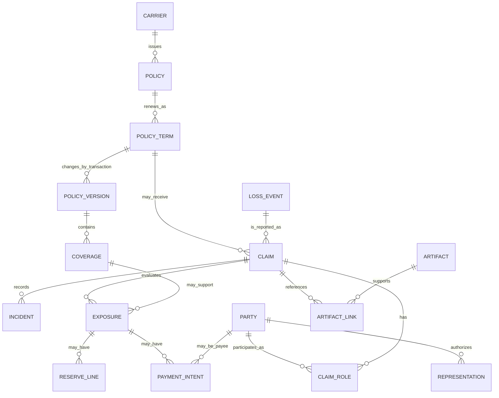
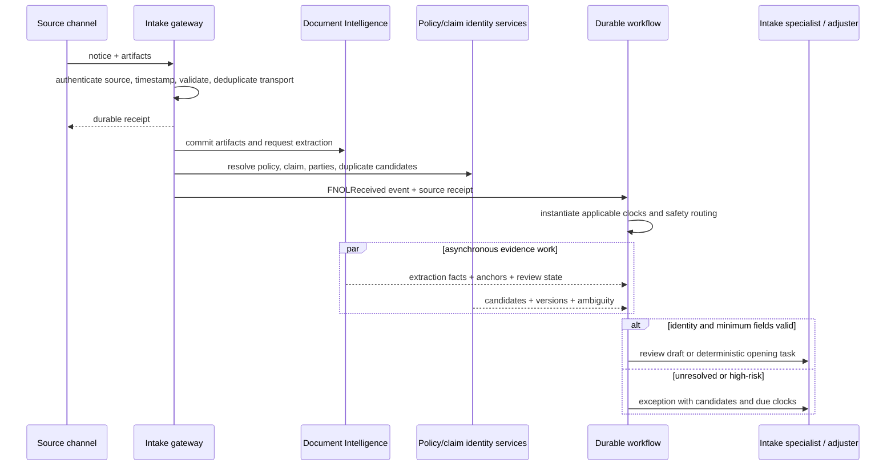

# Claim Identity, FNOL, Evidence, and Document Handoff

> **Purpose:** Establish the exact policy, claim, loss, parties, artifacts, and facts in scope before model assistance can influence claim handling.

## Identity is a graph, not one claim number

A claim number identifies a carrier record. It does not by itself identify the policy contract at loss, every claimant, each coverage or exposure, the loss event, an injured person, an authorized representative, a payee, a vendor, or a recovery counterparty.



Treat `insured`, `policyholder`, `claimant`, `third-party claimant`, `beneficiary`, `injured worker`, `dependent`, `driver`, `occupant`, `witness`, `attorney`, `guardian`, `estate representative`, `lienholder`, `mortgagee`, `repairer`, `medical provider`, and `payee` as typed, time-bounded roles. One party may hold several roles; several parties may share one role. Role does not imply authority to receive information or money.

## Canonical identities and version semantics

Create a carrier-owned mapping for every object below before building model context. A display number, name, address, vendor score, or document filename is never a stable join key. Store both **effective time** (when a fact or contract applied) and **system time** (when the platform learned or changed it) wherever late notice, endorsement backdating, corrections, or replay can change the answer.

| Object | Stable identity and scope | Version or time semantics | Never conflate with |
| --- | --- | --- | --- |
| Policy | Immutable carrier-scoped `policyId`; policy number is an alias | Transaction stream plus archived contract manifest; observed system version and effective interval | Current PAS summary or claim-system copy |
| Policy term | `termId` under one policy | Inception/expiration with time zone and precision; cancellation, reinstatement, rewrite, and renewal remain distinct transactions | Calendar year or latest renewal |
| Endorsement/form | Carrier form ID + edition + transaction ID + attached policy version | Signed/issued/effective times and supersession; preserve the exact bytes and digest | A similarly titled current template |
| Coverage | Coverage ID within a policy-version graph; lineage ID only when carrier rules prove continuity | Effective interval, status, limits, deductibles, currencies, scheduled items, and source transaction | Exposure, coverage decision, or “coverage type” text |
| Insured role | Party ID + typed insured role + policy/term scope | Effective interval and role-source version; named, additional, omnibus, and alleged insured states stay distinct | Policyholder, claimant, beneficiary, contact, or payee |
| Claim | Immutable tenant/carrier `claimId`; claim number is display/search data | Optimistic source version/event sequence; reopen and supplement append history | Loss event, incident, or FNOL |
| Exposure/feature | Claim-scoped `exposureId` linked to one claimant, incident, and candidate/accepted coverage as the product requires | Source version and lifecycle; coverage/claimant relinking is an explicit reviewed event | Claim, reserve line, damage item, or payment |
| FNOL | Immutable notice ID plus channel receipt/event ID | Received time is immutable; corrections and later notices are linked supplements, not overwrite | Claim creation or coverage acceptance |
| Party | Tenant/carrier master `partyId` with source-system crosswalk | Names, contacts, representation, verification, consent, and roles have separate effective/system versions | A name, phone number, address, household, or organization alias |
| Property/insured item | Stable vehicle, building, unit, scheduled item, equipment, or other asset ID inside product scope | Asset description, ownership/interest, garaging/location, condition, and policy scheduling are independently versioned | Loss location, mailing address, geocode, or damaged item observation |
| Evidence | Immutable `artifactId` + byte digest for an original; separate observation/fact IDs for claims about it | Artifact renditions and extraction/review runs append versions with page/region anchors | OCR text, model summary, authenticity proof, or business fact |
| Estimate | Provider/carrier estimate ID + revision ID; line items have stable line IDs where supported | Revision, price/database version, labor/tax/market/geography basis, author and observed time | Assessment, invoice, approved amount, reserve, or final value |
| Reserve | Exposure/coverage/cost-type reserve-line ID plus immutable transaction ID | Posted transaction sequence, currency, effective/posted time, approval and reversal/correction lineage | Model recommendation, payment, statutory reserve, or actuarial estimate |
| Assessment | Claim/exposure assessment ID + provider/type ID | Score/finding time, provider model/rules version, input snapshot and expiry; a newer score does not erase the old one | Verified fact, fraud determination, causation, liability, or adjudication |
| Payment | Separate payment intent, claim transaction, payee instruction, disbursement/check/EFT, and settlement IDs linked by one operation | Amount/currency/payee/coverage and approval bind a version; issued, cleared, stopped, voided, returned, and reconciled are distinct states | Reserve, invoice, communication, or API success |
| Communication | Communication intent ID + immutable rendered artifact + recipient/channel attempt ID | Template/locale/rule/fact versions, approval, send attempt, provider receipt and delivery state append | Draft, conversation, obligation completion, or proof of receipt |
| Referral | Claim/exposure-scoped referral ID + specialist system/case cross-reference | Reason/factual evidence version, compartment, owner, status and disclosure rules; resubmission links to prior referral | Fraud finding, legal conclusion, vendor order, or ordinary claim note |
| Catastrophe event | Carrier event ID; external declaration/hazard IDs are source references | Peril, geometry, time window, declaration/order and matching-rule versions; association is time-stamped and reversible | Causation, policy coverage, duplicate claim, or universal deadline overlay |
| Decision | Immutable authorized decision ID scoped to exact claim/exposure/issue | Human principal/authority, evidence/policy/rule versions, decided/effective time, reason and supersession/correction link | Recommendation, approval click, state transition, or message text |
| Effect | Semantic `operationId` for one exact business intent; provider IDs are receipts/cross-references | Intent hash, preconditions, approval, dispatch attempts, outcome state, reconciliation and compensation lineage | Tool call, HTTP request, provider `2xx`, or desired outcome |

### Identity acceptance test

For every join used by a recommendation or effect, produce the stable IDs, aliases received, authoritative owner, source version, effective interval, retrieval receipt, ambiguity state, and crosswalk evidence. Test corrected names, reused policy numbers, rewritten terms, same-address CAT claims, claimant/payee differences, duplicate notices, estimate supplements, and claim reopen. If the exact target cannot be reconstructed after restart, the mapping is not production-ready.

## Minimal identity contract

```json
{
  "claimIdentityVersion": 7,
  "tenantId": "carrier-123",
  "carrierId": "naic-or-internal-carrier-id",
  "claim": {
    "claimId": "immutable-internal-id",
    "claimNumber": "display-number",
    "sourceSystem": "claims-core",
    "sourceVersion": "etag-or-sequence",
    "state": "open",
    "catastropheEventId": null
  },
  "policy": {
    "policyId": "immutable-policy-id",
    "policyNumber": "display-number",
    "termId": "2026-term-id",
    "policyVersionId": "transaction-version-at-loss",
    "archiveManifestId": "exact-contract-bundle",
    "effectiveFrom": "2026-01-01T00:00:00-05:00",
    "effectiveTo": "2027-01-01T00:00:00-05:00",
    "retrievedAt": "2026-08-31T09:00:00Z",
    "sourceReceipt": "pas-read-receipt"
  },
  "loss": {
    "lossEventId": "stable-event-id",
    "reportedLossAt": "2026-08-29T15:20:00-05:00",
    "timePrecision": "minute|day|range|unknown",
    "timeZoneSource": "reported-location",
    "locationId": "normalized-location-id",
    "causeAllegation": "hail",
    "verificationState": "alleged|corroborated|disputed|unknown"
  },
  "roles": [
    {
      "partyId": "party-44",
      "role": "first-party-claimant",
      "effectiveFrom": "2026-08-29T15:20:00-05:00",
      "identityStatus": "verified",
      "authorityStatus": "contact-authorized",
      "sourceRefs": ["fnol-artifact:page-1", "policy:declarations"]
    }
  ],
  "unresolved": []
}
```

The contract stores reported and verified states separately. Do not mutate an allegation into a fact; create a new observation or verification record.

## Identity resolution sequence

1. Resolve tenant and carrier from authenticated channel configuration, not user prose.
2. Preserve the received policy number, claim number, names, contacts, loss time, and location literally.
3. Normalize formats without overwriting literal values.
4. Query the policy administration/archive and claims systems using deterministic keys.
5. Rank candidates only if exact keys fail; expose why each candidate matched.
6. Check policy term and transaction state against the loss instant, including time zone and precision.
7. Search duplicate claim candidates using carrier-approved deterministic features.
8. Resolve each party and role independently; verify representation and communication authority.
9. Create an ambiguity record when more than one plausible target remains.
10. Require an authorized person or deterministic master-data rule to bind an ambiguous identity.

The model may rank candidate policies or claims and explain textual similarity, but it cannot silently select a target for communication, coverage reasoning, reserve, payment, recovery, or vendor work.

## Duplicate decision table

| Evidence | Interpretation | Action |
| --- | --- | --- |
| Same authenticated source message/event ID | Transport duplicate | Reuse intake receipt; do not create a second FNOL |
| Same exact artifact digest from same source | Byte duplicate | Preserve new intake event; reuse processing only if policy permits |
| Same policy, loss time/location, parties, cause, and damaged item with high deterministic match | Possible business duplicate | Link candidate; human or approved rule merges/relates |
| Same catastrophe and address but different coverage, unit, claimant, or damage | Possibly separate claim/exposure | Do not merge by catastrophe/address alone |
| Similar narrative but different loss date or policy term | Likely separate loss | Keep separate; record similarity if useful |
| Existing closed claim receives new evidence/supplement | Reopen/supplement candidate | Route under reopen rules; do not create or mutate silently |
| Third-party notice and insured notice describe same event | Cross-channel duplicate candidate | Relate sources and preserve distinct notifier roles |

A duplicate claim has financial, claimant-rights, fraud, reporting, and audit consequences. Do not train the model to maximize merge rate.

## FNOL is a notice event, not a decision

An FNOL record preserves what was reported, by whom, through which channel, and when the carrier or agent received it. It may contain incomplete or conflicting data. Accepting notice should not wait for the model or for all evidence.

### FNOL intake contract

```json
{
  "fnolId": "immutable-fnol-id",
  "tenantId": "carrier-123",
  "channel": "portal|phone|email|agent|api|mail",
  "sourceActor": {
    "actorId": "authenticated-or-declared-id",
    "actorType": "insured|claimant|representative|agent|vendor|unknown",
    "authenticationLevel": "strong|basic|unverified"
  },
  "receivedAt": "2026-08-31T09:11:23Z",
  "sourceReceipt": "channel-receipt-id",
  "literalReport": {
    "policyNumber": "as-received",
    "lossAt": "as-received",
    "location": "as-received",
    "description": "as-received",
    "injuryIndicator": "yes|no|unknown",
    "emergencyIndicator": "yes|no|unknown"
  },
  "artifacts": ["artifact-id-1"],
  "extractionRunId": "model-derived-values-run",
  "identityState": "resolved|ambiguous|unresolved",
  "duplicateState": "new|candidate|confirmed-duplicate",
  "acknowledgmentObligationId": "clock-instance-id",
  "claimDraftOperationId": "stable-operation-id",
  "schemaVersion": "1.0"
}
```

### FNOL flow



The source acknowledgment must be generated from durable receipt and obligation state. Do not wait for OCR, model summary, duplicate adjudication, or policy retrieval if the applicable rule requires prompt acknowledgment.

## Safety routing at intake

| Signal | Immediate deterministic handling | Model contribution |
| --- | --- | --- |
| Injury, fatality, unsafe property, emergency services, vulnerable person | Route to trained priority queue and emergency procedure | Extract/support only; never give emergency or medical assurances beyond approved script |
| Represented claimant or attorney communication | Verify representation; apply legal/communication routing | Summarize with restricted access |
| Complaint, regulator, executive escalation, or bad-faith allegation | Create complaint/escalation record and clock | Classify candidate; human confirms |
| Catastrophe/event surge | Associate candidate CAT event without deciding causation or coverage | Compare reported location/time to event evidence |
| Language/accessibility need | Select approved accessible channel/interpreter workflow | Draft translation only through approved evaluated route |
| Suspicious indicator | Create confidential referral candidate without changing ordinary intake response | Package facts; do not accuse or disclose |
| Potential sanctions, lien, Medicare, bankruptcy, estate, guardian, or minor | Set specialist flag before financial effects | Extract candidate facts only |
| Cybersecurity threat or malicious artifact | Quarantine and security route | No direct model ingestion |

## Evidence model

Separate six record types:

| Record | Meaning | Example |
| --- | --- | --- |
| Artifact | Exact received or created bytes plus metadata and digest | PDF, photo, audio, estimate, letter |
| Observation | Literal value seen or measured in a source | “Loss date: 8/29/26” on form page 1 |
| Normalized fact candidate | Typed interpretation with provenance | `2026-08-29`, precision `day` |
| Verification | Result of an authoritative or expert check | Policy term active at reported time |
| Inference/recommendation | Model or analyst judgment | Damage may be consistent with hail; inspect roof |
| Decision | Authorized claim disposition | Adjuster accepts coverage for named exposure |

### Evidence fact contract

```json
{
  "factId": "fact-901",
  "claimId": "claim-123",
  "field": "loss.location.postalCode",
  "literalValue": "10001",
  "normalizedValue": "10001",
  "valueState": "observed|derived|verified|disputed|missing|illegible|not-applicable",
  "source": {
    "artifactId": "artifact-12",
    "artifactVersion": 1,
    "page": 2,
    "region": [0.10, 0.22, 0.41, 0.27],
    "sourceSystem": "document-evidence",
    "sourceRecordVersion": "extract-v4"
  },
  "derivation": {
    "extractor": "document-intelligence-route-2",
    "modelPromptVersion": "fnol-extract-1.4",
    "normalizationRuleVersion": "address-3.2"
  },
  "confidence": {
    "localCalibrationSlice": "typed-fnol-clean-scan-en",
    "score": 0.93,
    "thresholdDecision": "accept-candidate"
  },
  "review": null,
  "createdAt": "2026-08-31T09:14:00Z"
}
```

Provider confidence is not a probability of business correctness. Thresholds come from local, field-specific calibration and harm, not a universal score.

## Document Intelligence handoff

Claims operations never treat a PDF-to-text call as the evidence pipeline. Follow the [Document Intelligence blueprint](../document-intelligence-agent/README.md):

1. commit the exact received bytes and intake metadata before parsing;
2. quarantine, identify type, scan, and render in an isolated environment;
3. preserve a page/media manifest and every derivative's lineage;
4. classify/split/extract with page/region/span anchors;
5. distinguish missing, illegible, conflicting, and not-applicable;
6. route field/document exceptions to qualified review;
7. return a versioned extraction bundle, never an unaudited text blob;
8. link accepted facts into the claim without copying away their provenance;
9. reprocess as a new extraction version and diff, never a silent overwrite.

The claims agent sends a narrow task such as “extract invoice line items under schema X” or “identify dates and parties from FNOL form Y.” It does not ask the document agent to decide coverage, liability, fraud, repair reasonableness, payment eligibility, or claim disposition.

## Evidence completeness and contradiction handling

```json
{
  "evidenceRequirementId": "property-roof-estimate-v3",
  "claimId": "claim-123",
  "scope": {"exposureId": "roof-1"},
  "requirements": [
    {
      "type": "damage-photos",
      "cardinality": "1+",
      "states": ["received", "quality-review-required"],
      "satisfiedBy": ["artifact-21", "artifact-22"]
    },
    {
      "type": "itemized-estimate",
      "cardinality": "1",
      "states": ["missing"],
      "satisfiedBy": []
    }
  ],
  "contradictions": [
    {
      "field": "loss.date",
      "factIds": ["fact-1", "fact-2"],
      "materiality": "policy-term-selection",
      "resolutionState": "open"
    }
  ],
  "computedAt": "2026-08-31T09:20:00Z",
  "ruleVersion": "property-intake-2026-08"
}
```

Completeness rules may determine whether a work item is ready for review; they cannot determine a negative claim outcome. Avoid repetitive requests for information already present. NAIC Model 900 identifies duplicated verification that unreasonably delays investigation/payment as an unfair-practice concern in its model baseline.

## Evidence request decision table

| Condition | Request action |
| --- | --- |
| Required item absent and not previously requested | Stage one approved, purpose-limited request |
| Item present but extraction uncertain | Send to Document Intelligence review before asking claimant again |
| Two sources conflict materially | Ask a precise clarification or route expert review; preserve both sources |
| Item exists in another authorized carrier system | Retrieve internally if permitted; do not burden claimant |
| Request would duplicate an earlier fulfilled proof | Do not request; link existing evidence |
| Request could reveal SIU/legal strategy or privileged reasoning | Route to SIU/legal communication owner |
| Deadline or limitation impact is possible | Adjuster/compliance review of wording and timing |
| Requested data exceeds purpose or consent | Reject or narrow request |

## Chain of custody and authenticity limits

Artifact digest, source authentication, digital signature validation, capture metadata, device attestation, and transfer logs can strengthen provenance. None alone proves the depicted event occurred, the document is truthful, or the signer had authority. Record:

- exact bytes, digest algorithm/value, size, media type, and received timestamp;
- source channel, authenticated actor/delegation, transport receipt, and original filename/headers;
- all parsers, scanners, renderers, transformations, redactions, and extraction versions;
- page/crop/span relationships used by model and reviewer;
- access, export, annotation, review, and disclosure events required by policy;
- any gaps, unsupported formats, missing pages, metadata conflicts, or suspected manipulation.

Use qualified forensic/security processes for authenticity disputes. The model may identify an anomaly for review; it must not declare forgery or fraud.

## Failure modes

| Failure | Consequence | Control |
| --- | --- | --- |
| Current renewal selected instead of term at loss | Wrong coverage and limits considered | Loss-instant term/version binding and archive manifest |
| A model invents a missing loss time | Wrong policy or clock starts | Precision/unknown states and evidence requirement |
| Claimant contact is treated as verified payee | Privacy breach or misdirected payment | Role-specific identity and independent payee verification |
| Duplicate FNOL creates duplicate claims | Financial, reporting, and claimant confusion | Transport and business duplicate layers with stable receipt |
| OCR text replaces original artifact | Lost legal/provenance evidence | Immutable original and derivative lineage |
| Extraction reprocessing silently changes accepted facts | Audit and decision drift | New version, diff, impact analysis, reviewer state |
| Similar catastrophe claims become “memory” | Cross-claim leakage and biased disposition | Purpose-limited retrieval and curated non-authoritative examples |
| Malicious attachment changes tool behavior | Unauthorized data/tool access | Quarantine, isolation, untrusted-content labeling, no direct effects |

## Intake and evidence readiness checklist

- [ ] Exact carrier/tenant and authenticated source are known.
- [ ] FNOL receipt is durable and clocks do not wait for model completion.
- [ ] Policy, claim, loss, party, role, incident, exposure, payee, vendor, and CAT identities are separate.
- [ ] Ambiguous identity blocks consequential targeting.
- [ ] Duplicate transport and business claims are handled separately.
- [ ] Reported, observed, normalized, verified, inferred, and decided values remain distinct.
- [ ] Original artifacts are immutable and every extraction retains page/span provenance.
- [ ] Provider confidence is locally calibrated by field and risk slice.
- [ ] Contradictions and missing evidence are visible and have owners.
- [ ] Evidence requests avoid duplication and use approved privacy/communication rules.
- [ ] Reprocessing creates a new version and impact review.

## Related guides and sources

- [Tool results, artifacts, and provenance](../../tools/tool-results-artifacts-and-provenance.md)
- [Prompt injection and untrusted data](../../security/prompt-injection-and-untrusted-data.md)
- [Guidewire graph-based policy retrieval example](https://docs.guidewire.com/cloud/cc/202603/cloudapica/cloudAPI/topics/507-SpecificUseCases/05-policy-retrieval/c_graph_based_policy_retrieval.html)
- [FEMA NFIP Claims Manual, March 2025](https://www.fema.gov/sites/default/files/documents/fema_rsl_nfip-claims-manual_06032025.pdf), which illustrates the importance of policy declarations, forms, endorsements, terms, and claim-file evidence in one specialized program.
