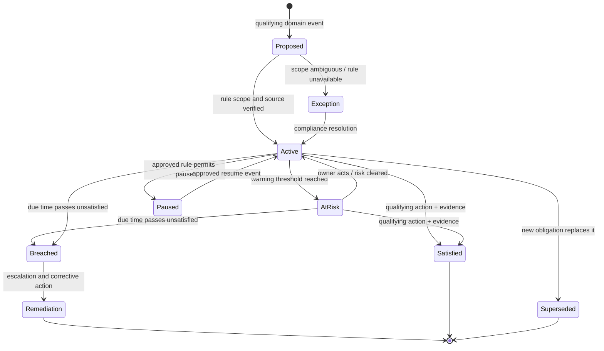

# Coverage Versions, Regulatory Clocks, and Claimant Communications

> **Purpose:** Ensure that coverage assistance uses the exact contract and that every claimant-facing obligation is computed, owned, generated, delivered, and evidenced under the applicable current rule.

## Coverage evidence before coverage reasoning

Coverage is a contract- and jurisdiction-dependent decision. The claims agent may retrieve and organize potentially relevant provisions, test for missing evidence, and draft a recommendation. It does not make the final coverage decision or send a denial.

### Minimum coverage evidence bundle

| Element | Required evidence |
| --- | --- |
| Carrier and product | Legal carrier, underwriting company, product/line, jurisdictional form set |
| Policy identity | Policy ID/number, term ID, renewal relationship, source system/archive receipt |
| Contract at loss | Declarations, base form, schedules, endorsements/riders, amendments, notices incorporated into contract |
| Transaction timeline | New business, renewal, endorsement, cancellation, nonrenewal, lapse, reinstatement, rewrite, binder, audit, effective times |
| Loss | Reported/verified instant and precision, time-zone basis, location, event, cause allegation |
| Party and risk | Named insureds, additional insureds, beneficiaries, locations/vehicles/property/persons, interests and roles |
| Coverage structure | Coverage ID/type, limits/sublimits, aggregate/occurrence state, deductible/retention, conditions, exclusions, extensions |
| Claim context | Incident and exposure, prior decisions/payments, other insurance, reservations, disputes, representation |
| Rule context | Jurisdiction, product, claimant type, policy/regulatory rule versions, emergency/CAT overlays |
| Uncertainty | Missing pages, conflicting versions, ambiguous dates/roles, legal issue, unsupported interpretation |

A policy subset copied into the claim system can support work but may not by itself be the archived contract. Compare the claim snapshot to the policy administration/archive source and preserve both versions when they differ.

## Coverage-support contract

```json
{
  "coverageReviewId": "review-88",
  "claimId": "claim-123",
  "exposureId": "exposure-roof-1",
  "policyEvidence": {
    "termId": "term-2026",
    "policyVersionId": "txn-17",
    "archiveManifestId": "bundle-901",
    "forms": [
      {"formId": "base-form", "edition": "configured-edition", "digest": "sha256:..."},
      {"formId": "endorsement-a", "edition": "configured-edition", "digest": "sha256:..."}
    ],
    "retrievalReceipt": "pas-receipt-44"
  },
  "loss": {
    "instant": "2026-08-29T15:20:00-05:00",
    "precision": "minute",
    "verification": "corroborated"
  },
  "candidateProvisions": [
    {
      "provisionId": "form:page:section",
      "citation": "artifact/page/region",
      "relevanceRationale": "model-derived, nonbinding"
    }
  ],
  "facts": ["fact-1", "fact-2"],
  "conflicts": [],
  "recommendation": {
    "disposition": "escalate|insufficient-evidence|candidate-covered|candidate-not-covered|mixed",
    "rationale": "source-backed recommendation only",
    "modelPromptVersion": "coverage-support-2.1"
  },
  "requiredHumanDecision": {
    "decisionType": "coverage",
    "role": "authorized-adjuster-or-examiner",
    "deadlineInstanceId": "clock-55"
  },
  "schemaVersion": "1.0"
}
```

`candidate-not-covered` is an internal recommendation state, never a customer-facing denial and never a terminal claim state. Its use should be evaluated separately because it can create automation bias; some deployments should omit the label and present only evidence/conflicts.

## Coverage decision rules

| Condition | Agent behavior |
| --- | --- |
| Exact policy bundle and loss instant are established | Retrieve/cite potentially relevant provisions and facts |
| Loss time is a range crossing transaction/term boundary | Preserve both contract candidates; block recommendation |
| Cancellation, lapse, reinstatement, binder, rewrite, or missing endorsement is disputed | Route to policy services/adjuster/legal as required |
| Claim-system policy copy differs from archive/PAS | Show diff and source receipts; do not choose silently |
| Provision requires legal interpretation or conflicts with law/order | Route to authorized legal/compliance review |
| Evidence is insufficient to apply a condition/exclusion | State insufficiency; do not convert to adverse finding |
| Coverage decision is partial or conditional | Require typed per-coverage/exposure human decision and explanation |
| Denial/reservation/limitation communication is proposed | Require decision record, cited contract/rule, exact approved template, and authorized review |

## Regulatory clocks are versioned domain data

Do not hard-code “acknowledge in 15 days” or let the model calculate deadlines from prose. A clock depends on jurisdiction, product, claimant type, event, calendar definition, time zone, exceptions, emergency orders, representation, and effective date.

The [NAIC Model 902](https://content.naic.org/sites/default/files/model-law-902.pdf), for example, defines calendar days and includes model timeframes for acknowledgment, replies, acceptance/denial, continuing-status letters, limitation notice, and payment. Its state-adoption chart and local law must be checked. California's 2026 catastrophe claims guide describes California-specific calendar-day duties and disaster rules, while a [Texas Hurricane Beryl order](https://www.tdi.texas.gov/orders/documents/20248743.pdf) extended certain statutory deadlines by 15 days for a defined event and affected counties. These examples prove why a number without jurisdiction and source is unsafe.

### Obligation rule contract

```json
{
  "obligationRuleId": "ca-property-claim-acknowledgment",
  "version": "2026-01-09",
  "status": "approved",
  "scope": {
    "jurisdiction": "US-CA",
    "product": "residential-property",
    "claimantRole": "configured",
    "eventType": "claim-notice-received",
    "catastropheOverlay": "optional-overlay-id"
  },
  "trigger": {
    "sourceEvent": "FNOLReceived",
    "timestampField": "recordedAt",
    "timeZone": "carrier-approved-rule"
  },
  "due": {
    "duration": 15,
    "unit": "calendar-day",
    "countingConvention": "versioned-rule",
    "holidayCalendarId": null,
    "endOfDayRule": "versioned-rule"
  },
  "pauseResume": [],
  "exceptions": ["payment-made-within-period"],
  "requiredAction": "send-or-record-acknowledgment-and-assistance",
  "requiredContentTemplateFamily": "property-acknowledgment",
  "source": {
    "authority": "approved-local-law-or-procedure",
    "citation": "exact section",
    "effectiveFrom": "2026-01-09",
    "effectiveTo": null,
    "verifiedAt": "2026-08-31",
    "verifiedBy": "claims-compliance-owner"
  }
}
```

The example illustrates shape, not a legal conclusion. Production values must come from approved local authority.

### Obligation instance contract

```json
{
  "obligationInstanceId": "clock-55",
  "claimId": "claim-123",
  "ruleId": "approved-rule-id",
  "ruleVersion": "2026-01-09",
  "triggerEventId": "evt-fnol-1",
  "triggeredAt": "2026-08-31T09:11:23Z",
  "dueAt": "2026-09-15T23:59:59-07:00",
  "calendarTrace": {
    "timeZone": "America/Los_Angeles",
    "calendarId": "calendar-day-rule-v1",
    "overlays": []
  },
  "state": "open|satisfied|superseded|paused|breached|cancelled",
  "owner": {"queueId": "property-intake-ca", "assigneeId": null},
  "satisfaction": null,
  "recomputedFrom": null
}
```

Persist the calculation trace. If a rule or catastrophe overlay changes, create a recomputation event showing old/new due dates, affected claims, reason, authorizer, and communication impact. Never silently rewrite history.

## Clock lifecycle



Only an approved rule can pause or extend a clock. Waiting for documents, model outage, queue backlog, fraud suspicion, vendor delay, or catastrophe volume does not automatically stop an obligation.

## Clock decision table

| Situation | Required behavior |
| --- | --- |
| Two rules appear applicable | Instantiate an exception, show both sources/calculations, escalate; do not let model choose |
| Local law differs from NAIC model | Use approved local rule; retain model as research context only |
| Business-day rule lacks holiday/calendar source | Block computed deadline; use approved manual control |
| Claim notice predates system ingestion | Preserve both received and recorded times; use legally approved trigger field |
| Loss time or jurisdiction changes | Re-evaluate scope and create versioned clock adjustment |
| Catastrophe order extends deadlines | Apply only to defined event, geography, line, period, and obligations; preserve original and adjusted due dates |
| Order expires or is amended | Version overlay; recompute affected open obligations and audit owner review |
| Communication bounces | Delivery obligation remains open unless approved rule says send attempt suffices |
| Required action completed but receipt missing | Do not mark satisfied; reconcile or obtain approved evidence |
| Due time passes | Mark breach, notify accountable people, preserve manual remediation; do not conceal by changing trigger |

## Communications are effects, not model messages

Claim communications can acknowledge notice, request evidence, give status, explain valuation, reserve rights, accept/deny coverage, communicate settlement, warn of limitation periods, provide complaint/review information, or confirm payment. These classes carry different authority and content requirements.

### Communication authority classes

| Class | Example | Default gate |
| --- | --- | --- |
| Informational internal | Work note, missing-evidence summary | C1 proposal; no claimant send |
| Routine administrative | Receipt acknowledgment, appointment reminder | Deterministic template; C3/C4 only in validated narrow route |
| Evidence request | Specific missing item or clarification | Need/duplication/privacy/template check; approval policy by product |
| Status update | Investigation incomplete, next step, delay reason | Clock/rule content and authorized factual state |
| Claim-determinative explanation | Valuation, depreciation, coverage, liability, partial acceptance/denial | Human decision and qualified review required |
| Legal/rights communication | Reservation, limitation warning, release, complaint/appeal rights, litigation response | Adjuster/legal/compliance exact approval |
| Financial communication | Settlement offer, payment explanation, recovery/deductible allocation | Human decision, approved financial intent, coverage mapping |
| Restricted investigation | SIU request or law-enforcement/regulatory communication | Separate confidential system; not ordinary claims route |

### Communication intent contract

```json
{
  "communicationOperationId": "comm-op-991",
  "claimId": "claim-123",
  "claimVersion": 44,
  "recipient": {
    "partyId": "party-44",
    "role": "first-party-claimant",
    "contactPointId": "verified-email-2",
    "representationCheckId": "rep-check-7"
  },
  "purpose": "status-update",
  "obligationInstanceIds": ["clock-55"],
  "template": {
    "templateId": "property-status-ca",
    "templateVersion": "2026-07-01",
    "locale": "en-US",
    "accessibilityMode": "standard"
  },
  "facts": [
    {"slot": "claimNumber", "sourceRef": "claim:123:v44"},
    {"slot": "reasonMoreTimeNeeded", "sourceRef": "adjuster-decision:77"}
  ],
  "renderedArtifactId": "artifact-out-55",
  "contentHash": "sha256:...",
  "approval": {
    "approvalId": "approval-66",
    "intentHash": "sha256:...",
    "expiresAt": "2026-09-02T12:00:00Z"
  },
  "channel": "email",
  "requiredDeliveryEvidence": "provider-message-and-delivery-status",
  "schemaVersion": "1.0"
}
```

The model can draft only designated slots. Required disclosures, regulator contacts, rights, headings, citations, and prohibited language are controlled by the template/rules service. Rendered content is hashed and approved; the delivery adapter may not regenerate it.

## Communication validation

Before send, validate:

- recipient identity, role, authority, representation, address, consent/preference, language, and accessibility need;
- claim, policy, coverage/exposure, decision, amount, and due-clock versions;
- template jurisdiction/product/effective date and required content;
- every factual slot against an authoritative source or approved decision;
- no unsupported promise, admission, denial, accusation, settlement, finality, threat, limitation, or investigation disclosure;
- attachments, privacy classification, redaction, and secure-channel requirements;
- approval authority, intent hash, expiry, and single/multi-use scope;
- semantic message operation ID and duplicate detection;
- delivery evidence and fallback/escalation plan.

## Explanation quality

The [IAIS claims-handling baseline](https://www.iaisweb.org/uploads/2024/12/IAIS-ICPs-and-ComFrame-adopted-in-December-2024.pdf) emphasizes timely status, explanations of claim-determinative factors, qualified staff, clear reasoning in disputes, and fair/transparent outsourced handling. The [FCA claims rules](https://handbook.fca.org.uk/handbook/icobs8) similarly require prompt and fair handling and reasonable guidance/status in their scope. These are not interchangeable jurisdictional rules, but they support a production design in which explanations are source-specific and contestable.

A good explanation identifies:

- the exact decision and whether it is complete, partial, provisional, or under review;
- the facts accepted, disputed, or still needed;
- the policy provision, law, rule, calculation, estimate, or expert evidence actually used;
- how claim-determinative factors such as deductible, limit, depreciation, betterment, salvage, allocation, or negligence were applied where relevant;
- who owns the next action, how to ask questions or dispute, and applicable approved rights/deadlines;
- no internal chain-of-thought, hidden fraud signal, privileged content, or irrelevant sensitive data.

## Template and rule release process

Treat a change to a template, translation, rule, calendar, channel, required disclosure, or prohibited-language policy as a behavior release:

1. identify affected product/jurisdiction/claimant/communication classes;
2. obtain claims-compliance/legal approval with source and effective date;
3. run exact rendering, required-content, source-binding, accessibility, locale, and adversarial tests;
4. shadow against open obligations without sending;
5. canary with deterministic comparison and delivery reconciliation;
6. pin in-flight intents to approved versions or explicitly re-render/reapprove;
7. retain rollback version and impact query;
8. audit every affected clock/template instance.

## Failure modes

| Failure | Consequence | Control |
| --- | --- | --- |
| Generic model clock applied as state law | Missed or premature action | Approved rule registry and source/effective date |
| Calendar days treated as business days | Deadline breach | Versioned calendar/counting trace |
| Catastrophe extension applied nationwide | Delayed unrelated claims | Event/geography/product/period-scoped overlay |
| Claim receipt timestamp overwritten by processing time | Incorrect clock start | Immutable source receipt plus recorded time |
| Policy endorsement missing from retrieval context | Unsupported coverage advice | Contract bundle completeness gate |
| Denial draft sent from model recommendation | Unauthorized adverse action | Decision-record prerequisite and prohibited-language gate |
| Status letter names SIU review | Confidentiality and investigation harm | Separate restricted lane and communication filter |
| Template changed after approval | Unapproved claimant message | Rendered artifact/content hash bound to approval |
| Provider “accepted” status marks obligation satisfied | Missed delivery | Required delivery evidence and reconciliation |
| Translation changes rights or policy meaning | Misleading communication | Approved translation memory, bilingual review/eval, version pinning |

## Readiness checklist

- [ ] Exact policy contract at loss, transaction history, and source receipt are available.
- [ ] Coverage recommendation and authorized decision are different record types.
- [ ] No model output can create or send a denial, admission, settlement, or reservation by itself.
- [ ] Every obligation rule names jurisdiction, product, claimant, trigger, calendar, source, effective dates, and owner.
- [ ] Catastrophe/emergency overlays are scoped, versioned, and reversible.
- [ ] Clock calculations retain a trace and are recomputed by events, not silently edited.
- [ ] Communication templates separate fixed controlled content from draftable facts.
- [ ] Recipient, representation, privacy, locale, and accessibility checks run before send.
- [ ] Approval binds exact rendered content, attachment set, recipient, channel, and deadline context.
- [ ] Accepted, sent, delivered, bounced, failed, and unknown communication states are distinct.
- [ ] Limitation, complaint, appeal/dispute, and regulator-contact content is owned by approved rules.
- [ ] Local legal/compliance owners review rules on every refresh trigger.

## Related guides and sources

- [Agent state and event contracts](../../runtime/agent-state-and-event-contracts.md)
- [California 2026 major-disaster claims guide](https://www.insurance.ca.gov/0200-industry/0050-renew-license/0200-requirements/upload/2026-Guide-for-Adjusting-Property-Claims-in-California-After-a-Major-Disaster_Final.pdf)
- [NAIC Model 902 state action page](https://content.naic.org/sites/default/files/model-law-state-page-902.pdf)
- [NAIC Market Conduct Annual Statement](https://content.naic.org/insurance-topics/market-conduct-annual-statement), a useful source of claims-timeliness and outcome metric definitions rather than a deadline rule.
