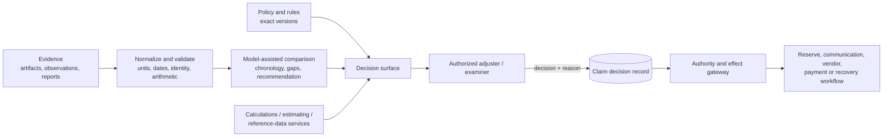

# Assessment Support, Reserves, Adjudication, and Specialist Referrals

> **Purpose:** Bound model assistance around damage/loss assessment and claim recommendations while preserving adjuster/examiner, finance, actuarial, SIU, legal, recovery, and vendor ownership.

## The model supports a decision; it does not become the decision-maker

Claims assessment combines observations, documents, policy terms, product rules, professional expertise, estimates, uncertainty, and sometimes legal judgment. The model may reduce review effort by structuring evidence and explaining differences. An authorized claims professional remains responsible for the outcome.



No model score, confidence, generated rationale, vendor estimate, image classification, historical settlement, or rules result substitutes for the decision record.

## Damage and loss assessment support

### Permitted tasks

- create an evidence-grounded chronology of the reported event, inspection, mitigation, repair, medical, work-loss, and communication history;
- normalize estimate line items, quantities, units, labor/material categories, taxes, depreciation, betterment, salvage, prior damage, and supplements;
- compare claimant, carrier, vendor, appraiser, medical, or expert reports without choosing the winning source;
- map photos or document evidence to asserted damaged items using explicit anchors;
- identify missing measurements, inaccessible areas, incompatible dates, duplicate items, arithmetic differences, or scope mismatches;
- retrieve current approved reference-data versions and show their limitations;
- propose inspection, expert, vendor, or additional-evidence tasks;
- generate an assessment range with assumptions for qualified review when the task has passed local calibration.

### Prohibited tasks

- declare that an image proves causation, pre-existing damage, fraud, liability, coverage, or repair necessity;
- invent unseen dimensions, quantities, condition, age, depreciation, market availability, medical causation, or earning loss;
- use an unlabeled historical claim outcome as a valuation rule;
- choose a cheaper vendor or estimate solely to reduce indemnity;
- alter a professional report or hide disagreement;
- make a final total-loss, disability, benefit, liability, compensability, settlement, or claim value decision;
- direct emergency, medical, legal, or safety action outside approved scripts and trained processes.

### Assessment evidence contract

```json
{
  "assessmentId": "assessment-77",
  "claimId": "claim-123",
  "exposureId": "exposure-1",
  "assessmentType": "property-damage",
  "scopeVersion": 5,
  "observations": [
    {
      "observationId": "obs-8",
      "item": "roof-slope-a",
      "attribute": "reported-damage",
      "value": "impact marks",
      "sourceRef": "artifact-21:page-or-image-region",
      "verification": "unverified-observation"
    }
  ],
  "estimates": [
    {
      "estimateId": "estimate-4",
      "source": "claimant-contractor",
      "version": "2026-08-30",
      "currency": "USD",
      "lineItemManifest": "artifact-extraction-version"
    }
  ],
  "referenceData": [
    {
      "sourceId": "approved-price-source",
      "edition": "2026-08",
      "geography": "configured-market",
      "licenseScope": "carrier-approved"
    }
  ],
  "calculations": {
    "serviceVersion": "claim-calc-3.4",
    "resultRef": "calc-result-99"
  },
  "modelComparison": {
    "runId": "run-55",
    "supportedFindings": ["finding-1"],
    "unsupportedOrConflicting": ["finding-2"],
    "abstentions": []
  },
  "requiredReviewer": "qualified-property-adjuster",
  "schemaVersion": "1.0"
}
```

## Assessment decision table

| Evidence state | Recommended workflow |
| --- | --- |
| Structured estimate, valid units, consistent photos, deterministic arithmetic | Model comparison plus qualified adjuster review |
| Photo quality, identity, date, location, or damaged-item mapping is uncertain | Request targeted evidence or inspection; no adverse inference |
| Estimate sources disagree materially | Show itemized diff, source/version, and assumptions; reviewer resolves |
| Causation, prior damage, code upgrade, medical necessity, disability, or professional standard is at issue | Route qualified expert and adjuster/examiner |
| Reference price has poor local coverage or is stale | Do not anchor settlement to it; seek current/local evidence |
| Calculation requires policy/legal interpretation | Separate deterministic calculation from authorized interpretation |
| Model range is outside calibrated domain or data slice | Abstain and use established manual process |
| Claimant disputes assessment | Preserve dispute, show reasoning/evidence, and use product/jurisdiction review process |

The FCA's [multi-firm review of vehicle valuations](https://www.fca.org.uk/publications/multi-firm-reviews/findings-multi-firm-review-insurers-valuation-vehicles), published in 2024 and updated in 2025, is useful production evidence rather than a universal valuation rule. It identified risks from unsupported blanket deductions, deliberately low initial offers, inconsistent revaluation outcomes, insufficient third-party oversight, and weak management information. The architectural response is case-specific evidence, transparent deductions, a real dispute path, no cost-suppression objective, and outcome monitoring across internal and outsourced routes.

## Reserve recommendations are not ledger or actuarial ownership

A claim-level case reserve is an operational estimate associated with claim exposure and authority. It is distinct from:

- payment authorization and disbursement;
- recovery reserve or realized recovery;
- general-ledger posting and financial close;
- statutory reporting classification;
- aggregate actuarial unpaid-claim estimates, IBNR, and reserve opinion work;
- capital, reinsurance, tax, or solvency decisions.

The [NAIC Accounting Practices and Procedures Manual](https://content.naic.org/sites/default/files/publication-app-manual.pdf) and [ASOP No. 43](https://www.actuarialstandardsboard.org/asops/propertycasualty-unpaid-claim-estimates/) illustrate why aggregate financial/actuarial reserve processes have separate standards and accountable owners. The claims agent can support a case-reserve recommendation; it does not replace accounting or actuarial judgment.

### Reserve recommendation contract

```json
{
  "reserveRecommendationId": "reserve-rec-44",
  "claimId": "claim-123",
  "exposureId": "exposure-1",
  "reserveLineId": "indemnity-property",
  "current": {"amount": "25000.00", "currency": "USD", "sourceVersion": "txn-991"},
  "proposed": {
    "amount": "42000.00",
    "currency": "USD",
    "range": {"low": "36000.00", "high": "50000.00"},
    "basis": "configured-case-reserve-basis"
  },
  "evidenceRefs": ["assessment-77", "policy-coverage-8", "estimate-4"],
  "assumptions": ["assumption-1"],
  "uncertainties": ["supplement-not-received"],
  "calculationResultId": "calc-result-99",
  "ruleVersions": ["reserve-guideline-2026-08"],
  "modelRunId": "run-56",
  "requiredApproval": {
    "role": "adjuster-or-manager-with-reserve-authority",
    "amountBand": "configured",
    "segregationRule": "configured"
  },
  "expiresAt": "2026-09-02T12:00:00Z",
  "schemaVersion": "1.0"
}
```

The effect gateway re-reads current reserve, claim/exposure/coverage state, authority, assignment, open holds, and financial period at commit. If anything changed, the approval is stale.

## Adjudication recommendation and human decision

### Decision record

```json
{
  "decisionId": "decision-220",
  "claimId": "claim-123",
  "claimVersion": 44,
  "scope": {
    "decisionType": "coverage|liability|compensability|valuation|settlement|closure",
    "coverageId": "coverage-8",
    "exposureId": "exposure-1"
  },
  "outcome": "typed-carrier-approved-outcome",
  "reasonCodes": ["configured-reason-code"],
  "rationaleArtifactId": "decision-rationale-1",
  "evidenceRefs": ["fact-1", "policy-provision-2", "assessment-77"],
  "ruleVersions": ["claims-procedure-2026-08"],
  "unresolved": [],
  "decisionMaker": {
    "actorId": "adjuster-19",
    "assignmentId": "assignment-7",
    "authorityDecisionId": "authz-441",
    "licenseOrDesignationRefs": ["configured-credential"]
  },
  "modelRecommendationId": "optional-rec-11",
  "decidedAt": "2026-08-31T12:00:00Z",
  "schemaVersion": "1.0"
}
```

The record identifies the decision-maker; the model is only a referenced input. Do not store model-generated chain-of-thought. Store concise evidence-linked rationale sufficient for operational and regulatory review.

### Human ownership table

| Decision | Human owner | Model support |
| --- | --- | --- |
| Coverage acceptance/denial/partial decision | Authorized adjuster/examiner; legal where required | Policy/fact bundle and conflicts |
| Liability/fault/compensability | Qualified adjuster/examiner | Chronology, source comparison, open questions |
| Damage/benefit/claim valuation | Adjuster/appraiser/examiner/qualified expert | Normalization, arithmetic, range and assumptions |
| Case reserve | Adjuster/claims manager within authority | Source-backed recommendation and change rationale |
| Settlement strategy and offer | Authorized claims professional/legal | Scenario summary, draft, effects checklist |
| Payment release | Claims/payment approver plus finance/compliance gates | Exact proposed intent and source mapping |
| Claim closure/reopen | Authorized adjuster/examiner | Checklist of open exposures, payments, recoveries, notices, holds |
| Dispute/complaint outcome | Independent qualified review path | File summary without hiding prior recommendation |

## Fraud referral boundary

Fraud screening is not claim adjudication, and a suspicious indicator is not proof. NAIC [Model 680](https://content.naic.org/sites/default/files/model-law-680.pdf) describes a model framework for reporting suspected fraudulent insurance acts, confidentiality, fraud units, and insurer antifraud initiatives. Local adoption and thresholds vary.

### Claims-agent responsibilities

- apply carrier-approved deterministic referral rules and locally evaluated model signals only as inputs;
- preserve literal facts, provenance, indicator version, threshold, and why a referral was created;
- send the minimum necessary packet to a restricted SIU/fraud system;
- maintain the ordinary claim workflow and clocks unless an approved rule changes handling;
- prevent SIU existence, scores, tactics, and confidential/privileged material from entering routine summaries or claimant communications;
- record referral receipt and restricted status without exposing investigative content.

### Outside scope

- declaring a claimant, insured, vendor, or professional fraudulent;
- searching broad entity/network data without SIU authority and purpose;
- conducting covert inquiry, pretexting, surveillance, or law-enforcement activity;
- deciding whether legal reporting thresholds are met;
- filing a regulatory/law-enforcement report;
- denying, delaying, or reducing a claim solely because a model score is high;
- sharing fraud data beyond approved recipients.

### Referral contract

```json
{
  "referralId": "referral-7",
  "claimId": "claim-123",
  "referralType": "fraud-review-candidate",
  "indicators": [
    {
      "indicatorId": "configured-rule-id",
      "version": "2026-08",
      "evidenceRefs": ["fact-8", "artifact-22"],
      "statement": "neutral factual description"
    }
  ],
  "claimHandlingState": "continues-under-approved-procedure",
  "minimumNecessaryPacketId": "restricted-packet-1",
  "destination": "siu-case-system",
  "confidentialityClass": "restricted-fraud",
  "createdBy": "workflow-rule-or-authorized-actor",
  "receipt": null,
  "schemaVersion": "1.0"
}
```

## Legal referral boundary

Route rather than interpret when the claim contains:

- attorney representation, lawsuit, subpoena, regulatory inquiry, preservation demand, or discovery;
- demand or settlement terms with legal consequences;
- coverage opinion, ambiguity, bad-faith allegation, waiver/estoppel issue, reservation, or rights dispute;
- privilege, work-product, litigation-hold, or confidentiality designation;
- guardianship, estate, bankruptcy, structured settlement, minors, liens, or complex releases requiring counsel;
- potential criminal, sanctions, or regulatory conflict.

The legal system decides access and privilege. Model summaries generated before or after counsel involvement are not automatically privileged. Do not mix legal-matter content into ordinary claim memory, evaluation data, or broad traces.

## Recovery and subrogation boundary

The claims agent may identify a potential recovery source from known facts: at-fault party/insurer, contract, salvage, deductible, contribution, other insurance, or responsible vendor. It may create a referral with limitation date candidates and evidence. A recovery specialist or legal owner decides pursuit, allocation, demand, negotiation, settlement, waiver, and closure.

| Step | Claims-agent role | Owner |
| --- | --- | --- |
| Opportunity detection | Propose with evidence and uncertainty | Recovery triage |
| Target identity and coverage | Suggest candidates; no contact | Recovery/identity specialist |
| Limitation/tolling | Surface approved clock, never legal conclusion | Recovery/legal |
| Demand package | Draft and organize evidence | Recovery/legal approval |
| Negotiation/settlement | Summarize positions only | Authorized recovery/legal professional |
| Recovery reserve | Recommend if carrier procedure permits | Claims/recovery authority |
| Receipt and allocation | Consume authoritative status | Recovery system and finance |
| Deductible/claimant reimbursement | Draft calculation/explanation | Product/jurisdiction rules, finance, recovery owner |

Guidewire's [recovery and recovery-reserve documentation](https://docs.guidewire.com/cloud/is/202603/cloudapibf/cloudAPI/ClaimCenter/financials/recoveries.html) is a useful example of separate expected and received recovery transactions. It is vendor-specific and does not define a carrier's legal or accounting procedure.

## Vendor and service-request boundary

Vendor effects can change cost, claimant experience, property access, medical handling, safety, privacy, and evidence. Before dispatch:

- resolve approved vendor/legal entity, service location, product, license/credential, insurance, contract/rate, sanctions, conflict, and performance status;
- define exact scope, maximum spend/authority, claimant consent/access, scheduling constraints, data fields, and prohibited subcontracting where applicable;
- prevent duplicate service orders and confirm cancellation/late-arrival behavior;
- separate vendor selection, service completion, invoice approval, and payment;
- require artifact/status postconditions rather than trusting “completed” text;
- retain carrier oversight and an alternate/manual route.

The model can recommend a type of service or summarize availability. It cannot choose a vendor based on undisclosed ranking, contract with it, expand scope, approve its invoice, or release payment.

## Payment gate

Even after an authorized claim decision or settlement, payment is a separate high-impact effect. Minimum gates include:

- current claim, coverage, exposure, reserve, and financial state;
- exact amount, currency, payment type, allocations, deductible, limit, prior payments, and remaining authority;
- verified payee legal identity, role, contact/bank/check destination, and authority to receive funds;
- lienholder, mortgagee, provider, attorney, guardian, estate, assignment, tax, Medicare/benefit-coordination, sanctions, fraud, legal, and bankruptcy checks as applicable;
- release/settlement conditions and partial/final/supplement classification;
- independent approval and segregation of duties at current authority limits;
- stable operation ID, duplicate search, downstream idempotency, receipt, delivery/clearing state, and claim/finance reconciliation.

OFAC's [insurance-industry sanctions guidance](https://ofac.treasury.gov/faqs/topic/1616) illustrates why a claim payment can require a sanctions-specific legal/compliance path. The claims model must not infer that a payment is permitted because coverage was accepted.

## Failure modes

| Failure | Harm | Control |
| --- | --- | --- |
| Image model labels damage as “pre-existing” | Unfair adverse handling | Treat as unverified observation; qualified review |
| Estimate arithmetic runs inside generation | Unreproducible value errors | Decimal calculation service with versioned inputs |
| Model recommendation preselects reviewer decision | Automation bias | Evidence-first surface, alternatives, disagreement metrics |
| Reserve recommendation posts automatically | Financial/authority breach | Separate exact approval and effect gateway |
| Case reserve treated as actuarial reserve | Misstated financial process | Explicit claims/finance/actuarial ownership boundary |
| Fraud score stops clocks or notices | Unfair delay and confidentiality risk | Separate referral path; approved handling rules only |
| SIU content appears in claimant status letter | Investigation and privacy harm | Restricted context and template filter |
| Subrogation lead triggers an unapproved demand | Legal/relationship harm | Recovery specialist authorization |
| Vendor “completion” releases payment | Unsupported disbursement | Service evidence, invoice approval, payment gate |
| Payee identity inherited from claimant role | Misdirected funds | Independent role, authority, lien, and destination verification |

## Review checklist

- [ ] Assessment observations, calculations, model findings, recommendations, and decisions are separate records.
- [ ] Every visual/document finding links to exact evidence and states its verification level.
- [ ] Money calculations are deterministic, versioned, and decimal-safe.
- [ ] Local evaluation covers the exact assessment task, source types, geography, and harm slices.
- [ ] An authorized adjuster/examiner records coverage, liability, valuation, settlement, and closure decisions.
- [ ] Reserve recommendations cannot bypass authority, assignment, period, or segregation checks.
- [ ] Claims reserves, payment, recoveries, finance ledger, and actuarial estimates remain distinct.
- [ ] Fraud referral is confidential, neutral, source-backed, and separated from investigation.
- [ ] Legal triggers restrict context and route to counsel-owned workflow.
- [ ] Recovery and vendor actions are proposals until qualified owners authorize them.
- [ ] Payment uses a separate exact intent and independent controls.
