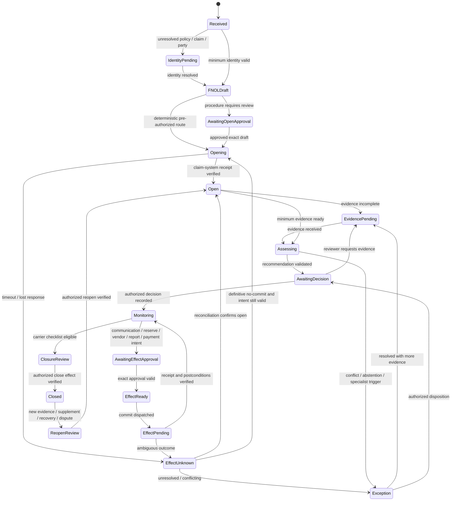
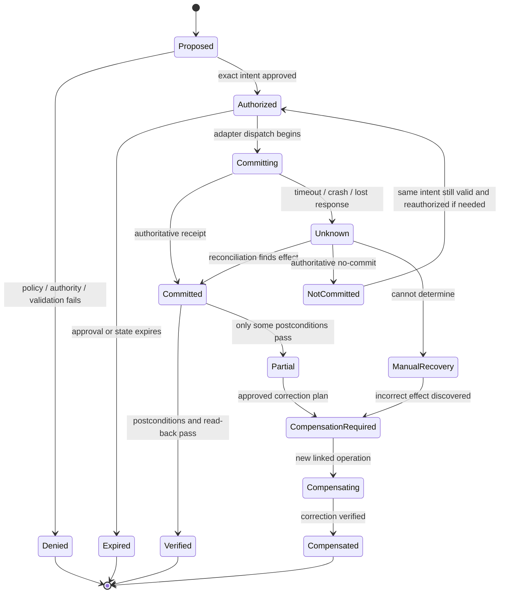

# State, Events, Effects, Reconciliation, and Recovery

> **Purpose:** Preserve correct claim handling under duplicate delivery, concurrency, long waits, retries, crashes, partial failure, stale approvals, and ambiguous external outcomes.

## Keep four kinds of state separate

| State | Authoritative owner | Example | Why separation matters |
| --- | --- | --- | --- |
| Claim domain state | Claims administration system | Claim open, exposure pending, reserve transaction posted, payment issued | Carrier system remains business record |
| Orchestration work state | Durable coordinator | Waiting for evidence, adjuster review due, effect unknown | Supports timers/retry without shadowing claim truth |
| Decision state | Authorized decision service/claim record | Coverage accepted for exposure X by adjuster Y | Proves accountability and reason |
| Effect state | Effect ledger and destination receipt | Payment operation committed and cleared; notice delivered | Distinguishes intent, commit, and verification |

Do not reduce an insurance claim to one linear model-generated status. A claim can have several incidents, coverages, exposures, parties, reviews, payments, recoveries, communications, and legal/fraud holds in different states at once.

## Claim-operation lifecycle

This state machine describes one orchestration work item, not the carrier's entire claim lifecycle.



`EvidencePending`, `AwaitingDecision`, `AwaitingEffectApproval`, `EffectUnknown`, and `Exception` are durable states with an owner, due time, escalation, cancellation, and reassignment. Model conversation history is not state.

## Event envelope

Use append-only domain/workflow events with source identity and aggregate version. An event describes something observed or decided; it does not authorize an unrelated effect.

```json
{
  "eventId": "evt-uuid",
  "eventType": "ClaimEvidenceReceived",
  "schemaVersion": "2.0",
  "tenantId": "carrier-123",
  "aggregate": {
    "type": "claim-work-item",
    "id": "work-77",
    "version": 19
  },
  "claimRef": {
    "claimId": "claim-123",
    "claimSourceVersion": "etag-44",
    "policyTermId": "term-2026"
  },
  "occurredAt": "2026-08-31T09:14:00Z",
  "recordedAt": "2026-08-31T09:14:02Z",
  "actor": {
    "principalId": "document-service",
    "actorType": "workload",
    "subjectActorId": "claimant-44"
  },
  "correlationId": "claim-123",
  "causationId": "fnol-event-1",
  "jurisdictionContextId": "jurisdiction-snapshot-8",
  "dataClassification": "restricted-claim",
  "payloadRef": "artifact-manifest-21",
  "sourceReceipt": "document-commit-receipt",
  "integrity": {"digest": "sha256:..."}
}
```

Store large/sensitive payloads in controlled artifact stores and reference them. Consumers enforce tenant, purpose, schema, version, authorization, and ordering. They must tolerate duplicate events.

## Event design rules

- Use past-tense facts such as `FNOLReceived`, `PolicySnapshotRetrieved`, `AdjusterDecisionRecorded`, and `PaymentReceiptObserved`.
- Use commands such as `SendClaimStatusNotice` only inside the effect gateway; do not publish intent as fact.
- Include both occurrence and recording times and declare which one drives each obligation.
- Never infer a claim-system commit from a queued command or webhook acceptance.
- Deduplicate transport by producer event ID; deduplicate business intent by semantic operation ID.
- If an event is out of order or references a future/missing aggregate version, delay and re-read authoritative state.
- Corrections append new events and link to the superseded record; they do not delete history.
- Event schema evolution must support replay or explicit migration; a model cannot interpret old payloads ad hoc.

## Model task contract

A model task is a bounded work request with no lifecycle or effect authority.

```json
{
  "taskId": "model-task-55",
  "taskType": "claim-file-chronology",
  "tenantId": "carrier-123",
  "claimId": "claim-123",
  "claimVersion": 44,
  "purpose": "adjuster-review",
  "inputManifestId": "context-manifest-9",
  "allowedTools": ["get_policy_excerpt", "get_evidence_fact"],
  "outputSchema": "claim-chronology-v3",
  "budgets": {"steps": 8, "toolCalls": 12, "tokens": 18000, "wallSeconds": 90},
  "stopConditions": ["identity-ambiguous", "privileged-content", "evidence-conflict-unresolvable"],
  "modelRouteVersion": "claims-synthesis-4",
  "expiresAt": "2026-08-31T10:00:00Z"
}
```

The coordinator validates the output, records the run/version, and chooses the next permitted transition. A task expiration or failure does not cancel claim clocks.

## Effect command contract

```json
{
  "operationId": "semantic-operation-id",
  "tenantId": "carrier-123",
  "claimId": "claim-123",
  "claimVersion": 44,
  "workItemId": "work-77",
  "effectType": "send-claim-status-notice",
  "effectClass": "communication",
  "adapterId": "communications-provider",
  "adapterVersion": "3.2",
  "target": {
    "system": "communication-platform",
    "resourceType": "message",
    "resourceId": "recipient-contact-point",
    "expectedVersion": "contact-v7"
  },
  "canonicalPayload": {
    "renderedArtifactId": "outgoing-artifact-55",
    "contentHash": "sha256:...",
    "recipientPartyId": "party-44",
    "channel": "secure-email"
  },
  "intentHash": "sha256:canonical-command-v2",
  "authorization": {
    "actorId": "adjuster-19",
    "assignmentId": "assignment-7",
    "policyDecisionId": "authz-441",
    "approvalId": "approval-66",
    "expiresAt": "2026-09-01T12:00:00Z"
  },
  "preconditions": [
    "claim-version-equals-44",
    "recipient-representation-current",
    "obligation-open",
    "no-legal-or-fraud-communication-hold"
  ],
  "postconditions": [
    "provider-message-id-exists",
    "exact-content-hash-accepted",
    "claim-file-notation-exists"
  ],
  "schemaVersion": "2.0"
}
```

Canonicalization is deterministic and versioned. Reusing an `operationId` with a different tenant, claim, effect type, target, payload, or intent hash is a security error.

## Effect state machine



`Unknown` is not failure; `Committed` is not verified; `Compensated` does not erase the original effect.

## Idempotency by business intent

Transport-level idempotency keys are necessary but insufficient. The stable semantic key should be derived from the carrier-approved business intent.

| Effect | Semantic identity inputs |
| --- | --- |
| Open claim | tenant, policy term, loss event, claimant/notifier context, operation purpose |
| Send notice | claim, obligation/communication purpose, recipient role/contact, template version, content hash |
| Reserve change | claim, exposure, reserve line, proposed transaction/version, authority context |
| Vendor request | claim, exposure, service type/scope, location, vendor, appointment or request version |
| Payment | claim, exposure/coverage allocations, settlement/decision, payees, amount/currency, payment type, release version |
| Recovery referral | claim/exposure, recovery type, target candidate, referral version |
| Regulatory report | reporter, jurisdiction/program, claim/reportable event, reporting period/version, submission type |
| Close/reopen | claim, decision/checklist version, requested terminal transition |

Changed intent gets a new ID. Retry, resume, failover, and replay reuse the original ID. Store operation ID and intent hash before dispatch in the same transaction as the workflow transition to `Committing`.

## Concurrency and stale-state controls

Claims are edited by people, batch jobs, vendors, and integrations concurrently. Before commit:

1. re-read claim/target resource version;
2. verify assignment, authority, approval, and deadline are current;
3. compare exact decision/evidence/template/rule versions bound to intent;
4. validate no new legal, SIU, sanctions, lien, payment, closure, or catastrophe hold conflicts;
5. use destination optimistic concurrency (ETag/checksum/version) where supported;
6. reject stale approval and return a reviewable diff;
7. never let last-write-wins silently overwrite a human update.

The Guidewire Cloud API's [lost-update and checksum documentation](https://docs.guidewire.com/cloud/is/202603/cloudapibf/cloudAPI/Optimizing-calls/lost-updates-and-checksums.html) is one concrete vendor example. Every adapter must verify its configured target behavior.

## Reconciliation contract

```json
{
  "reconciliationId": "recon-77",
  "operationId": "semantic-operation-id",
  "effectType": "claim-payment",
  "attempt": 3,
  "queriedAt": "2026-08-31T12:30:00Z",
  "authoritativeSources": [
    {"system": "claims-financials", "receipt": "txn-55", "state": "issued"},
    {"system": "payment-platform", "receipt": "pay-88", "state": "accepted"},
    {"system": "bank-or-check-status", "receipt": null, "state": "pending"}
  ],
  "finding": "committed-pending-delivery",
  "postconditions": {
    "claimTransactionPresent": true,
    "exactPayeeAmountMatch": true,
    "clearedOrDelivered": false
  },
  "nextAction": "continue-monitoring",
  "owner": "payment-reconciliation-queue",
  "schemaVersion": "1.0"
}
```

Reconciliation queries authoritative receipts/status and, where necessary, reads business state. Logs or the agent's memory are not proof. Define normal reconciliation cadence, maximum unknown age, escalation, and manual evidence for each effect class.

## Effect-specific gates and proof

| Effect | Commit-time gates | Verification |
| --- | --- | --- |
| Claim open/assign | identity, duplicate, policy candidate, route, license/designation, workload, exact draft | claim ID/number, source version, assignment in claims system |
| Communication | recipient/representation, template/content hash, decision facts, clock, approval, privacy/hold | provider receipt, exact content, channel status, claim-file notation |
| Reserve | claim/exposure/coverage/reserve line, amount, authority, current value, period/holds | authoritative reserve transaction and current total/read-back |
| Vendor request | approved vendor, scope, rate/limit, license, consent/access, duplicate, privacy | service request ID, accepted scope, appointment/status, required artifact |
| Regulatory report | reporter identity, applicability, schema, current guide/profile, due clock, approval | submission/response file, accepted/rejected fields, correction status |
| Payment | authorized decision, allocations, payees/liens/tax/sanctions, amount, reserve/limit, release, SoD | claim transaction, payment receipt, delivery/clearing, finance reconciliation |
| Recovery/subrogation | authorized opportunity, target, limitation, conflict, allocation, legal gate | recovery case/transaction, receipt, allocation and finance state |
| Close/reopen | no open exposure/task/effect/unknown, notices, payments, recovery/legal/fraud rules, authorized decision | carrier terminal/reopened state and audit event |

Payment, recovery, and vendor effects are never hidden as generic `update_claim` calls.

## Multi-system effects and partial failure

Avoid a distributed transaction across carrier, communication, vendor, payment, and finance systems. Model the saga explicitly.

Example payment-related sequence:

1. reserve exact approved payment intent and operation ID;
2. create claim financial/check/payment transaction;
3. submit to approved payment orchestration;
4. observe issue/delivery/clearing status;
5. reconcile claim subledger and finance/payment record;
6. send payment explanation under a separate communication operation;
7. correct by authorized void/stop/reissue/reversal operations if needed.

If step 2 commits and step 3 times out, do not create a new claim payment. Reconcile using the operation/reference IDs. If a stop or void is needed, create a new authorized compensation operation; never delete the original transaction.

## Cancellation semantics

Cancellation is requested, not assumed. The coordinator records:

- cancellation request actor/reason/time;
- current task/effect state and whether dispatch occurred;
- adapter cancellation capability and deadline;
- resulting state: `cancelled-before-commit`, `cancellation-pending`, `too-late`, `unknown`, or `cancelled-verified`;
- required claimant/vendor/finance communication and correction;
- late callbacks/events that must still be consumed and reconciled.

Stopping a model worker does not cancel an external effect. Revoking credentials stops future commits but cannot prove the destination did not act.

## Recovery playbooks

### Crash before dispatch

- Read effect ledger.
- If state is `Authorized` and approval/preconditions remain valid, resume with same operation ID.
- If expired/stale, return to approval; do not manufacture a success or failure.

### Crash or timeout after dispatch

- Mark `Unknown` durably.
- Query destination idempotency/receipt/status and read back target state.
- Do not retry until authoritative no-commit is established.
- Escalate at effect-specific unknown-age threshold.

### Partial multi-system outcome

- Freeze dependent effects.
- Record which postconditions passed and failed.
- Assign a recovery owner and preserve all receipts.
- Choose forward completion or compensation through policy and approval.
- Verify the correction across claim, destination, and finance/audit systems.

### Incorrect target or amount

- Activate effect kill switch for the affected class if systemic.
- Stop new sends/payments/vendor orders using the same release/configuration.
- Preserve evidence; notify claims, payment/finance, legal/compliance, privacy/security as applicable.
- Use destination-specific stop/void/reissue/reversal/correction procedure.
- Reconcile the whole affected cohort by release/version and operation IDs.

## Reopen semantics

Closed is not immutable finality. New evidence, supplement, dispute, recovery, payment return, legal action, catastrophe development, or regulatory correction may require reopen.

Reopen creates:

- a typed reason and triggering source event;
- an authorized decision and exact carrier operation;
- new work items and obligation instances where applicable;
- preserved prior decisions/effects rather than overwritten history;
- impact analysis for communications, reserves, payments, recovery, reporting, and model-derived summaries;
- a new context manifest that marks stale conclusions.

## Failure-invariant table

| Fault | Required invariant |
| --- | --- |
| Duplicate FNOL/webhook/queue delivery | At most one business operation per semantic intent; every intake receipt preserved |
| Out-of-order evidence and decision events | No transition against future/missing state; re-read current claim |
| Worker crash during model call | Claim clocks/work state remain durable; no effect authority is lost or created |
| Timeout after claim/payment/vendor/report commit | State becomes `Unknown`; no blind retry |
| Approval expires during queue delay | Commit denied; reviewer sees changed context |
| Human edits reserve/assignment concurrently | Stale model approval cannot overwrite |
| Catastrophe rule changes during open claim | Versioned recomputation; no historical clock rewrite |
| Late vendor/payment callback after cancellation | Event consumed and reconciled; not discarded |
| Telemetry outage | Claim/effect execution continues safely; audit evidence remains authoritative |
| Model provider outage | Intake, clocks, manual work, deterministic effects, and reconciliation remain available |

## Readiness checklist

- [ ] Claim, orchestration, decision, and effect state are different records.
- [ ] Every work state has legal transitions, owner, due time, cancellation, and escalation.
- [ ] Event schemas include tenant, aggregate version, occurrence/recording times, actor, source, and classification.
- [ ] Model tasks have closed schemas, tools, budgets, expiry, and stop conditions.
- [ ] Every effect has an operation ID and versioned canonical intent hash persisted before dispatch.
- [ ] Commit-time authorization revalidates target, state, assignment, authority, approval, and holds.
- [ ] The adapter represents unknown and partial outcomes.
- [ ] Reconciliation uses authoritative destination state and has age/error SLOs.
- [ ] Payment, vendor, report, recovery, communication, and close effects have separate gates/postconditions.
- [ ] Compensation is a new authorized effect and preserves the original.
- [ ] Reopen preserves prior history and invalidates stale summaries/recommendations.
- [ ] Crash, duplicate, reorder, concurrency, cancellation, and partial-failure tests pass.

## Canonical repository dependencies

- [Agent state and event contracts](../../runtime/agent-state-and-event-contracts.md)
- [Durable execution](../../runtime/durable-execution.md)
- [Idempotency and side-effect safety](../../reliability/idempotency-and-side-effects.md)
- [Tool contracts](../../tools/tool-contracts.md)
