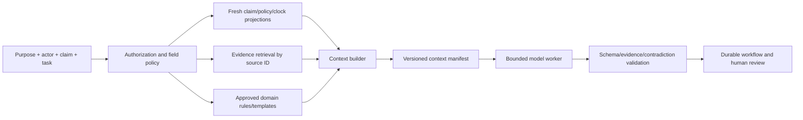

# Context, Memory, Planning, and Orchestration

> **Purpose:** Give the model enough current, authorized evidence to assist a claim without turning conversation, summaries, embeddings, or prior cases into authoritative state or hidden policy.

## Context is a projection, not the claim file

Build context for one declared purpose from authoritative records. A “load the whole claim” tool is unsafe and usually degrades quality.



The context builder filters by tenant, actor, purpose, claim/exposure, data class, representation, legal/SIU restrictions, freshness, and token budget. The manifest makes omissions and truncation visible.

## Memory taxonomy

| Canonical lifetime | Use | Reject | Retention, correction, and deletion | Poisoning and evaluation controls |
| --- | --- | --- | --- | --- |
| Turn/scratch memory | One call's scoped instructions, selected source excerpts, typed tool results, and disposable reasoning notes | Claim facts, approvals, secrets, hidden cross-claim carry-over, or any state required after the call | Destroy after the call except separately governed prompt/output evidence; a hold applies only to the retained evidence copy | Inject hostile document/tool text, wrong-claim excerpts and stale facts; assert that none can alter tools, authority, or durable state |
| Working/run memory | Typed hypotheses, open questions, retrieved source IDs, plan progress, budgets and stop reasons for one bounded run | Free-form diary, final claim state, approval, claimant profile, or state that cannot be rebuilt | Short TTL; checkpoint material progress by stable reference; discard on completion/cancel; corrections replace derived state without rewriting sources | Seed unsupported hypotheses, reordered tool results and stale versions; score source support, contradiction preservation, bounded steps and clean rebuild |
| Session memory | Operator UI focus, filter/view choice and unsaved draft state for one authenticated interaction segment | Authentication, assignment, fact, consent, authority, decision, effect receipt, or durable resume source | End on logout/expiry/handoff; drafts expire or are explicitly promoted into governed workflow records; support privacy deletion where lawful | Resume under another user/claim, alter a cached selection and replay stale UI state; verify reauthentication, claim binding and no implicit approval |
| Durable workflow/task memory | Work state, owners, timers, event offsets, source versions, evidence/decision/effect references, approvals, cancellation and recovery state | Model prose as truth, mutable transcript, raw secrets, or copies that replace owning carrier systems | Business-record schedule with effective/system history, correction lineage, legal/fraud hold, deletion proof and backup propagation | Corrupt/reorder/duplicate events, omit timers, inject stale approvals and unknown effects; replay, restore, invariant and reconciliation tests must fail closed |
| Domain knowledge memory | Approved procedures, authority matrices, templates, rules, calendars, product definitions and tool contracts | Model-created rules, uncited web text, mixed jurisdictions, superseded policy forms or embeddings as authority | Effective-dated registry with owner, approval, source digest, supersession and retained historical versions; delete only through records/change control | Insert malicious retrieval content, wrong edition/locale/jurisdiction and stale calendar; test exact-version retrieval, precedence, citation and safe abstention |
| Long-term/preference memory | Normally reject; if lawful, read a narrow verified language, channel or accessibility preference from its authoritative consent/customer system | Claim propensity, settlement behavior, fraud suspicion, reviewer shortcuts, sensitive profile, or memory-derived authority | Purpose/consent/TTL, correction, export, revocation and deletion propagation; tenant-bound and never a hidden model store | Poison preference source, revoke consent and swap party/tenant; test authorization, freshness, correction, deletion and zero decision/effect influence |
| Episodic/outcome memory | Curated, minimized/de-identified reviewed cases for offline evaluation/training or explicitly nonbinding investigation-step retrieval | Raw production recall, automatic precedent/valuation, cross-claim claimant lookup or online self-learning | Dataset manifest, license/purpose, lineage, hold/exclusion, retention, deletion and retraining/index propagation; freeze evaluation splits | Canary memorized identifiers, mislabeled outcomes and biased historical cohorts; test leakage, subgroup slices, temporal split, provenance and nonbinding behavior |

Raw claim, policy, party, payment, evidence, and decision records remain governed business records, not additional memory lifetimes. Caches and vector indexes are permission-aware rebuildable projections and never authorize a claim decision or effect.

### Explicitly reject

- chat history as the claim file or approval record;
- an agent-created profile of a claimant, insured, adjuster, vendor, attorney, or neighborhood;
- cross-claim vector search over raw production files without explicit purpose, access, and governance;
- prior claim settlements as binding precedent or automatic valuation;
- model-generated “learned rules” written back into domain memory;
- hidden carry-over of fraud, legal, health, vulnerability, or financial data between tasks;
- embedding similarity as proof that policy language, parties, damage, or jurisdiction match;
- compaction that drops open clocks, contradictions, approvals, effect-unknown states, or source versions.

## Context manifest contract

```json
{
  "contextManifestId": "ctx-88",
  "tenantId": "carrier-123",
  "claimId": "claim-123",
  "claimVersion": 44,
  "purpose": "reserve-recommendation-review",
  "actorAuthorizationDecisionId": "authz-read-77",
  "scope": {
    "policyTermId": "term-2026",
    "exposureIds": ["exposure-1"],
    "allowedDataClasses": ["claim-core", "property-evidence"],
    "excludedCompartments": ["siu", "legal-privileged"]
  },
  "sources": [
    {
      "sourceRef": "claim:123:v44",
      "type": "claim-projection",
      "observedAt": "2026-08-31T09:55:00Z",
      "freshnessRequirement": "5m"
    },
    {
      "sourceRef": "policy:term-2026:txn-17",
      "type": "policy-evidence",
      "observedAt": "2026-08-31T09:50:00Z",
      "freshnessRequirement": "immutable-version"
    }
  ],
  "rules": [
    {"ruleId": "reserve-guideline", "version": "2026-08", "sourceDigest": "sha256:..."}
  ],
  "includedFacts": ["fact-1", "fact-2"],
  "openContradictions": ["conflict-loss-date"],
  "omissions": [
    {"reason": "token-budget", "sourceRef": "communication-archive", "summaryRef": "summary-9"}
  ],
  "redactions": ["bank-account", "unrelated-health-data"],
  "createdAt": "2026-08-31T10:00:00Z",
  "expiresAt": "2026-08-31T10:15:00Z",
  "builderVersion": "claims-context-3.2"
}
```

The model receives source labels such as `AUTHORITY`, `CLAIM_FACT`, `ALLEGATION`, `EXTERNAL_OBSERVATION`, `MODEL_DERIVED`, and `UNTRUSTED_CONTENT`. It cannot promote one label to another.

## Context assembly order

1. Declare task, claim/exposure, actor, purpose, decision/effect class, and expiry.
2. Authorize fields and compartments before retrieval.
3. Load current claim/assignment/clock/effect projections and exact policy/rule versions.
4. Retrieve only evidence necessary for the task, preferring structured facts and direct source anchors.
5. Include known contradictions, missing items, prior authorized decisions, and unresolved effect state.
6. Exclude unrelated parties, claims, legal/SIU compartments, bank data, health details, and old summaries.
7. Enforce per-source and total size budgets; record omissions and truncation.
8. Construct a manifest with versions, timestamps, digests, and expiry.
9. Run the model with a closed output schema and tool allow-list.
10. Validate citations, contradictions, prohibited decisions, and freshness before any review or transition.

## Compaction and continuity

Compaction is an availability technique, not a truth-maintenance mechanism. The compacted checkpoint contains stable references, not a prose-only recap.

### Continuity checkpoint

```json
{
  "receipt_version": 1,
  "checkpointId": "checkpoint-44",
  "workItemId": "work-77",
  "workItemVersion": 19,
  "source_event_high_watermark": 782,
  "claimRef": {"claimId": "claim-123", "claimVersion": 44},
  "policyRef": {"termId": "term-2026", "transactionVersion": 17, "archiveManifestId": "bundle-9"},
  "task": {"type": "coverage-support", "purpose": "adjuster-review"},
  "completedSteps": [
    {"stepId": "retrieve-policy", "receiptRef": "pas-receipt-44"}
  ],
  "openSteps": ["resolve-loss-time-conflict"],
  "openContradictions": ["conflict-loss-date"],
  "obligations": [
    {"id": "clock-55", "ruleVersion": "CA-prop-2026.4", "dueAt": "2026-09-15T23:59:59-07:00", "state": "open"}
  ],
  "active_clocks": [{"clock_id": "clock-55", "due_at": "2026-09-15T23:59:59-07:00", "owner": "claim-owner"}],
  "approvals": [
    {"approvalId": "approval-9", "intentHash": "sha256:...", "expiresAt": "2026-08-31T10:10:00Z", "state": "pending"}
  ],
  "effects": [
    {"operationId": "comm-op-8", "state": "unknown", "reconciliationId": "recon-7"}
  ],
  "pending_effect_ids": ["comm-op-8"],
  "unknown_effect_ids": ["comm-op-8"],
  "sourceVersions": ["claim:123:v44", "policy:term-2026:txn-17"],
  "tool_versions": ["claims-read/4.1", "effect-status/2.3"],
  "version_pins": {"behavior": "claims-agent/2026-08-31.3", "policy": "term-2026:txn-17", "tools": ["claims-read/4.1", "effect-status/2.3"], "context_compiler": "claims-context-3.2"},
  "draftArtifacts": ["internal-draft-2"],
  "omitted_state_refs": [
    {"ref": "communications:claim-123:archive", "reason": "not-required-for-resume", "retrievalPolicy": "authorized-on-demand"}
  ],
  "nextPermittedActions": ["request-human-resolution", "read-effect-status"],
  "next_safe_action": "read-effect-status",
  "stopReasons": ["loss-time-affects-policy-version"],
  "behavior_release": "claims-agent/2026-08-31.3",
  "context_compiler_release": "claims-context-3.2",
  "compactor_release": "claims-compactor-2.0",
  "invariant_hash": "sha256:...",
  "receipt_digest": "sha256:canonical-receipt-without-this-field",
  "summary": "Convenience narrative; non-authoritative",
  "createdAt": "2026-08-31T10:05:00Z",
  "schemaVersion": "1.0"
}
```

Resume procedure:

1. authenticate the new worker and reauthorize purpose/fields;
2. load the checkpoint but treat its narrative as untrusted derived content;
3. re-read authoritative claim, assignment, clocks, approvals, effects, and required source versions;
4. diff checkpoint state against current state;
5. invalidate stale plans, drafts, recommendations, and approvals;
6. reconcile every `unknown` effect before proposing a retry;
7. recompute the canonical invariant set and compare `invariant_hash`; verify receipt digest, event high-watermark monotonicity, required clocks, omitted references and schema compatibility;
8. continue only from `nextPermittedActions` that remain policy-valid, starting with `next_safe_action` when it still passes authorization and preconditions.

Restart verification must be an automated fault-suite assertion, not an operator reading the summary. Crash after every persistence/dispatch boundary, restore from the receipt, and prove: no required timer or approval vanished; omitted state can be fetched by its stable reference; no stale draft was committed; every pending or unknown effect was reconciled; and the same authoritative sources produce the expected invariant hash or a named blocking diff.

See [compaction and continuity](../../context-memory/compaction-and-continuity.md) for the generic contract.

## Working memory

Working memory should be typed and disposable:

```json
{
  "workingMemoryId": "wm-99",
  "taskId": "model-task-55",
  "claimId": "claim-123",
  "hypotheses": [
    {
      "id": "hyp-1",
      "statement": "reported damage may relate to event E",
      "state": "unverified",
      "supportingRefs": ["weather-observation-8"],
      "contradictingRefs": ["inspection-note-4"]
    }
  ],
  "openQuestions": ["exact loss time"],
  "retrievals": ["policy-provision-2"],
  "expiresAt": "2026-08-31T10:30:00Z",
  "writeBackAllowed": false
}
```

A hypothesis never becomes a claim fact because it survived several turns. The validated output creates a new derived record with provenance; working memory expires.

## Domain memory and retrieval

Domain knowledge needs a governed registry:

| Knowledge | Required metadata |
| --- | --- |
| Policy forms/endorsements | Carrier, product, jurisdiction, form/edition, effective dates, digest, archive authority |
| Claims procedures | Product/jurisdiction/claim type, owner, version, approval, effective dates, supersession |
| Obligation clocks | Trigger, calendar, exception/overlay, source citation, verification date, legal/compliance owner |
| Authority matrices | Role, assignment, credential, effect/decision class, amount band, geography, effective dates |
| Communication templates | Purpose, fixed/draftable fields, locale/accessibility, rule source, required approval, effective dates |
| Calculation rules | Inputs, decimal/rounding/time semantics, version, tests, owner |
| Tool/adapter contracts | Capability, schema, permissions, idempotency, receipt/reconciliation, product version |

An embedding index may locate candidate sections but is not the authority. The retrieved record must match exact scope and version, and the application validates it before use.

## Episodic memory decision table

| Proposed use of prior cases | Decision |
| --- | --- |
| Curated de-identified examples for offline training/evaluation | Allowed under governance, license, privacy, representativeness, and leakage controls |
| Retrieve same claimant's prior claims for authorized fraud/legal/coverage procedure | Only through explicit specialist/claim rule and purpose-limited source access; not generic memory |
| Retrieve similar claims to suggest investigation steps | Possibly useful if de-identified, nonbinding, evaluated, and current rules stay primary |
| Use prior settlements to set current value | Reject by default; historical outcomes may encode different facts, policy, market, jurisdiction, and bias |
| Remember reviewer preference for approvals | Reject; authority and decision criteria come from policy, not personalization |
| Remember claimant language/accessibility preference | Store only in authoritative customer/consent system with purpose, correction, and expiry—not model memory |
| Save model-generated “lesson” after each claim | Reject; mine failures offline and release approved rule/eval changes |

## Bounded planning

Plans are application-owned typed objects. Use planning only when evidence gathering has variable order; deterministic workflows own known sequences.

### Plan contract

```json
{
  "planId": "plan-55",
  "taskId": "model-task-55",
  "claimId": "claim-123",
  "goal": "assemble evidence needed for adjuster coverage review",
  "allowedOutcome": "review-packet-only",
  "steps": [
    {
      "stepId": "s1",
      "action": "retrieve-policy-provision",
      "tool": "get_policy_excerpt",
      "inputs": {"provisionCandidateId": "candidate-8"},
      "preconditions": ["policy-version-bound"],
      "successEvidence": "policy-source-ref",
      "onFailure": "stop"
    }
  ],
  "budgets": {"steps": 6, "toolCalls": 10, "wallSeconds": 90, "tokens": 16000},
  "parallelism": 2,
  "forbiddenActions": ["send-message", "update-claim", "set-reserve", "initiate-payment"],
  "stopConditions": ["identity-conflict", "legal-trigger", "siu-compartment", "insufficient-evidence"],
  "expiresAt": "2026-08-31T10:15:00Z",
  "planSchemaVersion": "1.0"
}
```

The coordinator approves allowed step types, not model prose. Tool calls inherit task scope and cannot expand it. Limit parallel reads where sources have concurrency/ordering constraints; serialize any stage/commit operation.

## Orchestration rules

- One durable coordinator owns a work item. Model workers are stateless and replaceable.
- Use task-specific workers rather than personas. A “coverage agent” label must not imply coverage authority.
- The coordinator passes references, not entire hidden histories, between tasks.
- Parallelize independent read/extraction tasks only after identity and permission scopes are fixed.
- Join results with explicit completeness, contradiction, and timeout policies.
- Model failure routes to retry under budget, alternate validated route, or human queue; it does not skip a required step.
- No worker can approve its own recommendation or obtain a higher-privilege tool via delegation.
- A child/delegated workload identity is narrower than the parent and retains causal lineage.
- Tool results are validated as untrusted data and cannot inject new plan steps.
- Cancellation propagates to model/tool work, but external effects use their own cancellation/reconciliation semantics.

## Context failure modes

| Failure | Harm | Control |
| --- | --- | --- |
| Whole claim dump exceeds context | Relevant facts lost or contradictory summary | Purpose-limited manifests and hierarchical retrieval |
| Summary hides adverse or missing evidence | Reviewer receives one-sided recommendation | Mandatory contradiction/omission fields and direct source access |
| Old claim projection reused after human edit | Stale decision/effect | Expiry, source versions, re-read before review/commit |
| Similar-case retrieval crosses tenant or SIU/legal boundary | Privacy/confidentiality breach | Tenant/purpose compartments and deny-by-default retrieval |
| Model “remembers” a claimant as suspicious | Bias and due-process harm | No agent profile; restricted current-case referral only |
| Compaction drops unknown payment | Duplicate payment on resume | Required effect ledger references in checkpoint |
| Tool output contains prompt injection | Plan/permission manipulation | Treat results as data; closed plan/action schemas |
| Domain index returns superseded rule | Missed deadline/incorrect notice | Exact effective version and authoritative registry validation |
| Model creates an endless research plan | Deadline/cost failure | Step/tool/time/token budgets and deterministic stop |

## Readiness checklist

- [ ] Context is built for a named purpose and actor from fresh, authorized sources.
- [ ] Every context item carries authority label, source ID, version, and freshness.
- [ ] Turn, working, session, durable, domain, long-term, and episodic memory are explicitly distinguished.
- [ ] Chat and summaries cannot create claim facts, decisions, approvals, or effect status.
- [ ] Legal, SIU, payment, health, and unrelated-party compartments are excluded by default.
- [ ] Compaction checkpoint retains clocks, contradictions, approvals, effects, source versions, and stop reasons.
- [ ] Resume reauthorizes, rereads, diffs, and reconciles before continuing.
- [ ] Domain retrieval validates exact jurisdiction/product/effective version after semantic search.
- [ ] Raw prior claims are not generic long-term memory.
- [ ] Plans have allowed outcomes, typed steps, budgets, expiry, and forbidden actions.
- [ ] Model/provider failure has a deterministic/manual fallback.

## Canonical repository dependencies

- [Context engineering](../../context-memory/context-engineering.md)
- [Compaction and continuity](../../context-memory/compaction-and-continuity.md)
- [Memory architecture](../../context-memory/memory-architecture.md)
- [Tool results, artifacts, and provenance](../../tools/tool-results-artifacts-and-provenance.md)
