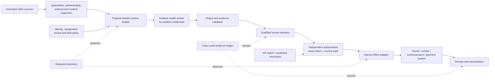

# Security, Privacy, Permissions, and Audit Evidence

> **Purpose:** Protect claimants, insureds, beneficiaries, employees, vendors, carriers, and investigations while preserving enough evidence to reconstruct and challenge claim handling.

## Threat model

The workflow processes hostile and highly sensitive inputs while reaching systems that can communicate externally, change claim financials, initiate services, and move money. Assume:

- FNOL narratives, emails, PDFs, images, estimates, invoices, medical records, notes, barcodes, links, and vendor payloads can contain prompt injection or malware;
- identities and roles may be mistaken, stolen, shared, changed, or represented by an attorney/guardian/estate;
- a malicious insider or compromised workload may seek another claim, tenant, SIU/legal file, payment destination, or model context;
- model output can be persuasive, unsupported, biased, or shaped by hidden retrieved content;
- vendors and model providers can retain, route, truncate, transform, or expose data differently than expected;
- logs, traces, evaluation sets, caches, queues, backups, and local workspaces can become shadow claim repositories;
- stale approval, concurrency, catastrophe pressure, and timeout can produce incorrect or duplicate effects;
- privileged, fraud, health, financial, geolocation, biometric, and vulnerability data may require separate controls.



## Security identities

| Identity | Purpose | Required properties |
| --- | --- | --- |
| End user/operator | Person using the application | Strong authentication, employment/role status, tenant, current assignment |
| Subject actor | Claimant/insured/representative whose request initiated work | Separate from operator; representation and contact authority |
| Workload identity | Coordinator, context builder, model worker, adapter, reconciler | Unique service identity, narrow scopes, rotation, auditable calls |
| Delegation identity | One bounded task performed for an actor/workflow | Parent/subject lineage, narrower scope, expiry, no privilege amplification |
| Approval identity | Authorized human decision-maker | Decision/effect class, product/jurisdiction, assignment, credential, amount limit, conflict/SoD checks |
| Effect identity | Principal used at external commit | Destination-specific permission, operation/claim scope, short lifetime where possible |
| Provider identity | External model/document/vendor/reporting service | Contracted tenant/project, region, data-use controls, subprocessor inventory |

Never use one generic claims service account across tenants and effects. The model worker should normally have no external credentials; tools execute through brokered read services. Effect credentials are inaccessible until the independent gateway authorizes one exact command.

## Authorization model

Authorize every request using:

`principal × subject × tenant × purpose × product × jurisdiction × claim/exposure × field/data class × operation/effect × value band × time × current state`

Examples:

- an adjuster assigned to claim A may read property evidence for exposure 1 but not a restricted SIU case;
- a document worker can read one quarantined derivative and write one extraction bundle, but not query other claims;
- a communication adapter can send the approved artifact to one verified contact, but cannot generate text or choose recipients;
- a reserve adapter can commit a specific amount/line after approval but cannot initiate payment;
- a payment adapter cannot read full medical narrative or policy notes that are irrelevant to payee validation.

Policy decisions are application-owned, versioned, and logged. Tool descriptions and prompts are not access controls.

## Permission tiers by tool

| Tier | Tool example | Controls |
| --- | --- | --- |
| Read projection | `get_claim_exposure_snapshot` | Field/purpose filter, tenant/claim binding, freshness, no bulk enumeration |
| Read evidence | `get_evidence_excerpt` | Artifact/region allow-list, compartment check, watermark/export control |
| Compute | `calculate_deductible_and_limit` | Versioned deterministic inputs and decimal result; no write |
| Propose | `propose_reserve_recommendation` | Derived record only, model/version/evidence labels |
| Stage | `create_unsent_communication_draft` | Reversible workspace, no external visibility, expiry |
| Approve | Human UI/service only | Qualified identity, evidence-first surface, exact intent hash, reason |
| Commit | Effect gateway adapter only | Current policy decision, narrow credential, state/version preconditions, idempotency |
| Reconcile | `get_payment_operation_status` | Read-only by operation/claim; authoritative receipt mapping |
| Correct/compensate | Destination-specific operation | New approval, linked original, preservation of history |

Reject generic `search_all_claims`, `run_sql`, `browse_shared_drive`, `update_claim`, `send_email`, `create_check`, or unrestricted browser tools in the model tool set.

## Prompt injection and untrusted content

Controls apply before, during, and after model execution:

1. quarantine and isolate artifacts; strip or separately inspect active content without replacing the original;
2. label all claim/user/vendor/document/tool content as untrusted evidence;
3. keep system instructions, policy, tool allow-list, and authority outside retrieved content;
4. expose semantic read tools that return typed data, not arbitrary web pages or raw application sessions;
5. block tool arguments that escape tenant/claim/purpose scope;
6. validate every result against a closed schema and evidence references;
7. treat URLs, QR codes, embedded files, macros, comments, metadata, and OCR instructions as data unless an approved security process handles them;
8. never let retrieved text grant permissions, ask for secrets, modify the plan, or approve/send/commit;
9. red-team indirect injection across document, email, vendor, policy note, and tool-result paths;
10. preserve an out-of-band kill switch and egress control.

See [prompt injection and untrusted data](../../security/prompt-injection-and-untrusted-data.md).

## Privacy and data minimization

Claim data may include identifiers, contact data, financial records, bank/payment details, health/disability information, injury photos, geolocation, telematics, employment, family/beneficiary data, minors, protected/vulnerable-person information, allegations, litigation, fraud referrals, and professional/vendor data.

For every task record:

- purpose and lawful/approved basis;
- subject roles and representation;
- allowed fields and compartments;
- source and destination systems/regions;
- provider/subprocessor and whether inputs/outputs are retained or used for training;
- retention, legal hold, deletion, correction, disclosure, export, and data-subject/consumer request handling;
- evaluation and observability reuse policy;
- whether automated/model support affects a consumer and what notice/review is required.

The [NAIC Privacy of Consumer Financial and Health Information Regulation, Model 672](https://content.naic.org/sites/default/files/model-law-672.pdf) is one model baseline for financial/health information disclosure and authorization. NAIC's [2026 Privacy Protections Working Group](https://content.naic.org/committees/h/privacy-protections-wg) is actively revising privacy models, so production rules need a named refresh owner and local-law validation.

## Data compartment matrix

| Compartment | Default access | Model posture |
| --- | --- | --- |
| Core claim identifiers/status | Assigned claims roles | Minimal projection |
| Policy contract | Assigned adjuster/examiner and policy services | Exact cited excerpts for declared task |
| Property/vehicle evidence | Assigned claims and qualified vendors | Approved derivatives only |
| Health/injury/disability | Product-specific trained roles | Exclude unless task explicitly requires and provider is approved |
| Payment/bank/tax/lien | Payment/finance/specialist roles | Do not expose full data; use deterministic pass/fail/tokenized references |
| SIU/fraud | Restricted investigators and authorized oversight | Ordinary claims model has no read access |
| Legal/privileged | Counsel and authorized legal team | Separate model route or no model; never broad memory/trace |
| Credentials/secrets | Secret manager and adapter runtime | Never in prompt, tool result, trace, or claim artifact |
| Cross-claim analytics/evaluation | Approved de-identified/controlled environment | No production-memory lookup by default |

## Third-party and model-provider due diligence

| Question | Required evidence |
| --- | --- |
| Data use | Contractual statement for training, retention, abuse monitoring, human access, and derived data |
| Location | Processing/storage regions, failover, support access, and subprocessors |
| Isolation | Tenant/project boundaries, encryption, access logging, key options, deletion behavior |
| Availability | Quotas, timeouts, async behavior, regional failover, degradation and status channels |
| Change | Model/API version pinning, deprecation notice, default changes, rollback/fallback |
| Security | Independent assessment, vulnerability/incident process, notification obligations, artifact handling |
| Output | Truncation, safety filtering, citation/evidence limits, structured output guarantees, deterministic settings |
| Audit/regulatory | Ability to provide documentation needed for insurer governance, examination, complaint, and incident review |

The [NAIC AI Model Bulletin](https://content.naic.org/sites/default/files/inline-files/2023-12-4%20Model%20Bulletin_Adopted_0.pdf) expects an insurer AI program to address governance, data, validation, third parties, documentation, and compliance for consumer-impacting uses. Its applicability depends on local adoption/guidance.

## Insurance data security baseline

NAIC [Model 668](https://content.naic.org/sites/default/files/model-law-668.pdf) includes a risk-based information security program, testing/monitoring, audit trails capable of reconstructing material financial transactions, third-party service-provider oversight, incident response, and secure disposal in its model framework. Treat it as a useful control baseline and map to adopted local requirements.

Minimum production controls include:

- asset/data/flow inventory and risk assessment for claim, model, document, vendor, communication, and payment paths;
- encryption in transit/at rest and scoped key/access management;
- network egress, private endpoint, provider project, tenant, and region restrictions;
- hardened/isolated document and model worker execution;
- secret manager, short-lived credentials, rotation, and revocation;
- dependency/image scanning, signed release artifacts, patching, and software bill of materials where applicable;
- tamper-evident audit evidence with separation from mutable operational notes;
- tested incident response, provider/vendor notification, claim-effect containment, and regulator/consumer assessment;
- secure retention/disposal across originals, derivatives, queues, caches, prompts, outputs, traces, eval sets, and backups.

## Software, model, rule, and data supply-chain controls

The claims behavior bundle depends on more than application code. Inventory and verify container images, libraries, orchestration/runtime packages, model/provider routes, OCR adapters, prompts, schemas, carrier mappings, policy/rule content, communication templates, geospatial/weather feeds, repair/estimate databases, and evaluation fixtures. Compromise or silent drift in any one can change a claimant outcome.

| Supply-chain object | Evidence required before release | Runtime containment |
| --- | --- | --- |
| Source and build | Immutable revision, reviewed change, reproducible or isolated build evidence, signed artifact digest, dependency lock and SBOM | Admit only allow-listed digests; verify signature/provenance; no mutable tags |
| Runtime dependency/image | Owner, version, vulnerability/license status, transitive dependency list, patch/deprecation plan | Minimal image, read-only filesystem where practical, no build tool or package install in worker |
| Model/provider route | Exact provider/model/version or pinned alias semantics, region/project, data-use terms, safety/availability change notice, evaluated fallback | Route allow-list, egress policy, per-release cohort, kill switch; fallback cannot inherit authority automatically |
| Prompt/schema/tool/adapter | Immutable digest, reviewer, compatibility range, contract and adversarial tests | Behavior-release pin; reject unknown schema/tool versions; adapter credential stays outside model process |
| Policy/rule/template content | Authoritative source, effective interval, approval, digest, locale/jurisdiction/product scope, supersession | Registry-mediated retrieval; precedence and effective-time check; never accept model write-back |
| External data/model | Licensor/owner, collection/update time, geography/coverage, lineage, permitted use/cache/redistribution, bias/quality validation | Source label, TTL, tenant/purpose filter, observed-time record; never convert provider score to decision |
| Evaluation data | License/consent/purpose, lineage, de-identification, subgroup distribution, split manifest and contamination check | Isolated access, no production lookup, immutable release gate, deletion/retraining procedure |

[SLSA 1.2](https://slsa.dev/spec/v1.2/) is a current approved vocabulary for source/build provenance and verification; it does not prove that a model, rule, policy form, dataset, or claims decision is correct. Apply its provenance concepts to software artifacts, then add domain-specific provenance and qualified review for the rest of the behavior bundle.

Supply-chain fault tests should replace a signed adapter with an unsigned build, mutate a prompt under the same release name, serve a stale rule under a current alias, change provider response fields, revoke an external-data license, poison a retrieval index, and roll a model alias. Each test must block promotion or isolate the affected route, identify the exact cohort, preserve intake and clocks, stop unsafe effects, and leave enough evidence for rollback and claimant remediation.

## Approval and segregation of duties

Approval is valid only when:

- the reviewer is authenticated, currently employed/contracted, assigned or properly delegated, and qualified for product/jurisdiction/decision/effect;
- authority/value limits and required second-level review pass;
- proposer, reviewer, committer, reconciler, vendor/payee, and related parties satisfy conflict/segregation rules;
- the reviewer sees source evidence, conflicts, recommendation version, exact effect and consequence;
- approval binds tenant, claim/exposure, target, payload, amount/payees, decision/rule/evidence versions, intent hash, expiry, and use count;
- commit-time authorization revalidates all of the above.

Detect collusion by principal identity, not display name. Service accounts must retain the underlying human proposer/approver lineage.

## Audit evidence versus telemetry

| Audit evidence | Diagnostic telemetry |
| --- | --- |
| Required to reconstruct claim handling and effects | Required to operate, debug, and improve system |
| Application-owned, schema/version controlled | Observability-platform owned |
| Claim, policy, evidence, decision, clock, approval, effect, receipt, correction refs | Trace spans, durations, token use, route, error codes, queue metrics |
| Retention/legal hold from claim/record obligations | Shorter minimization and sampling policy |
| Access controlled by claim/legal/fraud roles | Access controlled by operations/security roles |
| Never sampled away when required | Can be sampled/redacted/aggregated |
| Corrections append history | Logs may be mutable under platform policy |

### Audit event contract

```json
{
  "auditEventId": "audit-uuid",
  "tenantId": "carrier-123",
  "claimId": "claim-123",
  "category": "decision|communication|approval|effect|access|rule-change|correction",
  "action": "coverage-decision-recorded",
  "actor": {
    "principalId": "adjuster-19",
    "actorType": "human",
    "subjectActorId": null,
    "workloadChain": ["claims-ui", "decision-service"]
  },
  "scope": {"coverageId": "coverage-8", "exposureId": "exposure-1"},
  "sourceVersions": ["claim:123:v44", "policy:term-2026:txn-17"],
  "evidenceRefs": ["decision-220"],
  "policyDecisionId": "authz-441",
  "correlationId": "work-77",
  "occurredAt": "2026-08-31T12:00:00Z",
  "integrity": {"previousDigest": "sha256:...", "digest": "sha256:..."},
  "schemaVersion": "1.0"
}
```

Do not put full documents, bank data, medical narratives, legal advice, SIU notes, or raw prompts in audit/trace records. Store controlled references and minimum necessary structured facts.

## Retention, legal hold, correction, and deletion

Build a record inventory covering:

- source FNOL and communication receipts;
- policy/claim snapshots and source receipts;
- original and derivative artifacts;
- extracted facts, reviews, summaries, recommendations, prompts/model/tool/rule versions;
- decisions, approvals, communications, effects, receipts, reconciliation, and corrections;
- queues, caches, embeddings, evaluation copies, traces, exports, backups, and vendor copies.

For each, define owner, purpose, retention trigger, duration, jurisdiction/product scope, legal/fraud hold priority, deletion method, tombstone/proof, correction procedure, and downstream propagation. A request to delete must not silently destroy claim, fraud, legal, financial, or regulatory records that must be retained; the authorized records/privacy process decides scope and response.

## Security decision table

| Condition | Action |
| --- | --- |
| Model provider retention/training terms are unknown | Do not send claim data |
| Claim task needs SIU or legal content | Use separately approved compartment/workflow or human-only route |
| Tool argument references another claim/tenant | Deny and alert; do not “helpfully” search |
| Document asks model to ignore policy or send data | Treat as injection evidence; no instruction effect |
| Approval and commit principals violate SoD | Deny commit and route control exception |
| Workload credential is suspected compromised | Revoke, stop affected effect class, reconcile operations, investigate cohort |
| Trace includes sensitive content | Restrict access, stop affected logging route, assess incident, purge where authorized |
| Third-party breach affects claim data | Activate contract/incident plan, scope claims/data/effects, assess notifications and remediation |
| Legal hold arrives | Freeze deletion/reprocessing as defined; segregate access and preserve lineage |
| Privacy rule/model changes | Reassess field purpose, notices/consent, provider boundary, retention and active routes |

## Security and privacy failure modes

| Failure | Harm | Prevention/detection |
| --- | --- | --- |
| Generic model API key in worker environment | Cross-claim data/effect exposure | Brokered provider calls, scoped project, no effect credentials |
| Raw prompt logged with medical/SIU/legal data | Shadow sensitive store | Structured redacted tracing and compartment deny |
| Claim search tool permits enumeration | Tenant/claim breach | Exact-resource authorization and no broad model search |
| Similar-case memory leaks another claimant | Privacy and bias | Reject raw episodic memory; controlled offline datasets |
| Vendor receives full claim file for narrow service | Excess disclosure | Field-level purpose projection and contractual boundary |
| Approval UI hides payee or changed evidence | Unauthorized effect | Exact intent and evidence-diff review |
| Catastrophe temporary worker gets broad access | Large blast radius | Time/geography/queue-scoped access, credential/assignment checks |
| Deletion removes evidence but not model/eval copy | Incomplete privacy response | End-to-end data inventory and deletion propagation proof |

## Readiness checklist

- [ ] A claim-specific threat model covers injection, malware, identity, insider, provider, cross-tenant, approval, effect, and telemetry paths.
- [ ] Human, subject, workload, delegation, approval, effect, and provider identities are distinct.
- [ ] Authorization binds tenant, purpose, claim/exposure, fields, effect, value, state, and time.
- [ ] Model workers have no ambient carrier/payment credentials.
- [ ] Documents and tool results remain untrusted data and cannot change permissions or instructions.
- [ ] SIU, legal, health, payment, and cross-claim analytics are separate compartments.
- [ ] Provider data use, region, retention, subprocessors, incident, and change behavior are approved.
- [ ] Approval and segregation controls bind exact intent and revalidate at commit.
- [ ] Audit evidence is complete, minimal, integrity-protected, and separate from telemetry.
- [ ] Record inventory covers prompts, outputs, embeddings, traces, eval sets, caches, vendors, and backups.
- [ ] Incident and credential-revocation controls can stop new effects without the model.

## Canonical repository dependencies

- [Agent threat model](../../security/agent-threat-model.md)
- [Permissions, sandboxing, and secrets](../../security/permissions-sandboxing-and-secrets.md)
- [Prompt injection and untrusted data](../../security/prompt-injection-and-untrusted-data.md)
- [Tool contracts](../../tools/tool-contracts.md)
