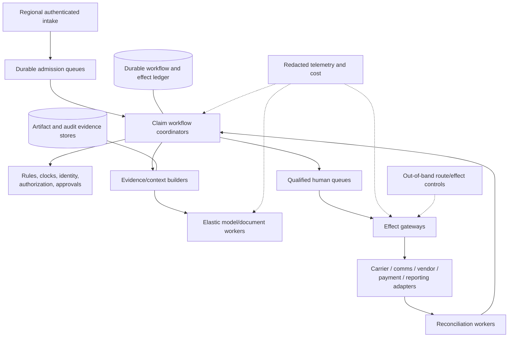
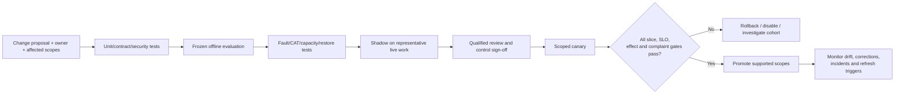

# Deployment, Catastrophe Scale, Cost, Behavior Releases, and Roadmap

> **Purpose:** Ship the claims agent through evidence-based stages, survive catastrophe bursts and dependency failure, control cost, and evolve models/rules/tools without silently changing claim handling.

## Deployment topology

Deploy the control plane independently from model/document providers and effect adapters.



Use cells by tenant, region, product, or sensitivity only when scale, residency, blast-radius, or dependency evidence justifies them. A separate cell does not remove the need for row/object authorization and data-class compartments.

## Environment and release controls

| Environment | Data | External effects | Purpose |
| --- | --- | --- | --- |
| Local/unit | Synthetic fixtures | Stubbed | Schema, rules, canonicalization, state transitions |
| Integration | Synthetic/de-identified licensed fixtures | Sandboxed provider/carrier endpoints | Contract, timeout, pagination, async, reconciliation tests |
| Preproduction | Representative controlled dataset | Sandboxed or shadow | Replay, failure injection, capacity, security, restore drills |
| Shadow production | Live purpose-approved projection | No decision/effect influence | Drift and behavior comparison |
| Canary | Small scoped live cohort | Only authorized effect classes | Validate real dependencies and operator behavior |
| General production | Explicit support matrix | Per-route authority | SLOs, sampling, incidents, rollback |

Never test payment, communication, vendor dispatch, regulatory reporting, or claim closure against a live destination without target allow-lists and unmistakable environment separation.

## Queue design

Separate queues by work and harm, not just “agent tasks.”

| Queue | Priority inputs | Backpressure behavior |
| --- | --- | --- |
| FNOL receipt/safety | Receive time, injury/emergency/vulnerability, source durability | Reserved capacity; never waits for model |
| Obligation/communication | Legal due time, delivery failure, claimant status need | Earliest-deadline-first within approved fairness rules |
| Identity/policy exception | Deadline impact, payment/decision dependency | Human queue; no consequential target while ambiguous |
| Document/extraction | Due time, document type, page cost, downstream blockage | Page/batch admission and provider quota control |
| Model assessment | Claim harm, adjuster assignment, evidence readiness, cost budget | Bounded retries; manual fallback |
| Adjuster/examiner decision | Due time, complexity, product/jurisdiction/license, amount | Qualified skill routing and reassignment |
| Effect approval | Effect class, amount, claimant consequence, approval expiry | No batching that hides exact intent |
| Commit/reconciliation | Unknown age, payment/communication/reporting criticality | Reserved recovery capacity; pause dependent effects |
| CAT surge | Event/geography, life/safety, displacement, due time | Event cell/partition and explicit admission policy |

Do not prioritize only by claim severity, projected savings, model confidence, or claimant persistence. Review priority rules for unfair impact and complaint/accessibility consequences.

## Cell, tenant, and catastrophe isolation

Use cells only when they reduce blast radius enough to justify duplicate capacity and operational complexity. A cell owns a bounded set of tenants/claims, workflow workers, queues, adapter concurrency budgets, context/model routes, and reconciliation workers. Keep global services limited to routing and replicated version registries; do not make a global model gateway, scheduler, credential, or effect queue the hidden single failure domain.

| Boundary | Partition key | Must remain independently controllable | Cross-boundary rule |
| --- | --- | --- | --- |
| Tenant/carrier | Tenant ID | Data, credentials, quotas, release, kill switch, audit | No cross-tenant queue or cache key; controlled aggregate metrics only |
| Operational cell | Stable claim/tenant assignment | Intake buffer, workflow, effects, reconciliation, manual visibility | Migration is a versioned drain/restore/reconcile operation, never blind rehash |
| Catastrophe event | Carrier event ID plus product/geography | Admission profile, surge workers, vendor/provider budgets, temporary access | Non-CAT reserved capacity; event association cannot authorize claim handling |
| Restricted compartment | SIU, legal, health or payment domain ID | Identity, storage, model/provider route, audit and incident control | Only minimum-necessary typed handoff; no shared conversational memory |
| Region/residency | Approved data region | Storage, keys, provider endpoints, restore target | Failover must satisfy residency/contracts; otherwise deterministic/manual route |

Prove noisy-neighbor isolation by saturating one tenant, CAT event, document provider and effect class simultaneously. Other cells must retain intake durability, clock warnings, human visibility, audit writes and reconciliation headroom.

## Capacity model

Plan each stage independently:

```text
arrival_rate
× work_per_claim_or_exposure
× retry_and_reopen_factor
× catastrophe_burst_factor
≤ available_capacity × target_utilization
```

Track service demand in native units:

| Resource | Unit | Drivers |
| --- | --- | --- |
| Intake | notices/events per second | channels, retry storms, CAT event |
| Document pipeline | pages/images/audio minutes | artifact mix, OCR/VLM route, reprocessing |
| Model worker | calls/tokens/tool steps | task type, context size, structured-output retries |
| Policy/claim adapters | reads/writes per second | context refresh, event fan-out, reconciliation |
| Human review | qualified minutes/tasks | abstention, complexity, decision class, licensing |
| Communication | messages/attachments/status callbacks | obligations, delivery failures, channels |
| Vendor | service requests/status events | geography, availability, supplements |
| Payment/recovery/reporting | operations and reconciliation checks | settlement cadence, partial/unknown states |
| Storage | artifacts/events/audit bytes | media mix, retention, legal hold, duplicates |

Build load tests from event-specific arrival curves and provider quotas, not average annual claim count. Model/provider concurrency is often easier to scale than qualified adjuster, expert, vendor, and payment-review capacity.

## Recovery-load and retry-amplification budget

Normal throughput sizing is insufficient after an outage. Backlogged intake, expired context, due clocks, redelivered events, provider callbacks, unknown effects, stale approvals, cache/index rebuilds and human reassignment all arrive together.

```text
recovery_demand =
  backlog_replay
  + source_redelivery
  + state_reread_and_reauthorization
  + unknown_effect_reconciliation
  + expired_draft_and_approval_rework
  + timer_catch_up
  + evidence_or_index_rebuild
  + claimant_and_operator_contact_surge
```

Set separate budgets for new intake, due-time protection, human work, destination reads, reconciliation, repair writes and optional enrichment. Cap replay by destination and tenant, honor provider retry windows, add jitter, and collapse duplicates by semantic operation/source event. A recovering cell must not consume the capacity needed to accept new notices or verify already-dispatched payments.

Recovery drills measure backlog-clear time, oldest obligation risk, unknown-effect age, replay amplification ratio, duplicate outcome count, provider throttling, human exception minutes and non-affected-tenant latency. Promotion fails if service health appears green while unresolved external state or deadline backlog grows.

## Catastrophe surge mode

Catastrophe mode is a versioned operating profile, not permission to reduce evidence, fairness, or approval controls.

### CAT activation inputs

- authoritative internal event declaration and event ID;
- hazard/peril, geography, time window, products, policies/claims, and confidence/source;
- regulator/emergency orders and effective/expiry scope;
- temporary adjuster licensing/registration/training requirements;
- approved vendor capacity, rates, geography, access, safety, and data sharing;
- queue/capacity reservations, communication templates, manual fallback, and escalation owners.

External weather/geospatial/event data can associate a candidate loss with an event but cannot prove causation or coverage.

### CAT controls

1. Preserve every FNOL receipt and create duplicate candidates without merging by address/event alone.
2. Instantiate obligations from normal rules plus scoped emergency overlays; retain original and adjusted calculations.
3. Verify adjuster/temporary adjuster registration, training, product, geography, assignment, and authority.
4. Partition queues by event and deadline while protecting non-CAT claim obligations.
5. Increase document/model capacity only within provider/privacy/residency controls.
6. Use approved catastrophe communications; do not promise coverage, contractor availability, payment, or completion time.
7. Monitor vendor scarcity, price/reference-data drift, access/safety, assignment churn, supplements, and fraud-referral workload.
8. Reserve reconciliation and incident capacity; surge writes can amplify duplicates and unknown outcomes.
9. Apply conservative degradation before deadlines are threatened.
10. Exit CAT mode by versioned decision; recompute affected open work and remove temporary access.

California's [2026 guide for property claims after a major disaster](https://www.insurance.ca.gov/0200-industry/0050-renew-license/0200-requirements/upload/2026-Guide-for-Adjusting-Property-Claims-in-California-After-a-Major-Disaster_Final.pdf) illustrates jurisdiction-specific catastrophe procedures, claim duties, and temporary-adjuster concerns. The [Texas Hurricane Beryl order](https://www.tdi.texas.gov/orders/documents/20248743.pdf) illustrates an event- and geography-specific deadline extension. Neither is a general CAT rule.

## Degradation ladder

Degrade capability before control.

| Level | Action | Preserved invariants |
| --- | --- | --- |
| 0 — Normal | Full evaluated routes | All controls |
| 1 — Economize | Smaller evaluated model for low-risk summaries; cache immutable policy/evidence derivatives | Same schemas, evidence, permissions, decisions |
| 2 — Reduce | Disable optional summaries, similar-case retrieval, nonessential enrichment, speculative prefetch | Intake, clocks, qualified review, effects/reconciliation |
| 3 — Triage | Deterministic extraction/routing; model only for deadline-critical supported tasks | No authority expansion; explicit abstention |
| 4 — Manual | Accept/preserve notice and evidence, compute clocks, route to people; no model | Claimant obligations and control records |
| 5 — Effects safe mode | Stop selected external writes; continue reads, intake, queues, and reconciliation | No blind commits; in-flight state recovered |
| 6 — Emergency intake | Durable minimal notice receipt plus human emergency/priority routing | No data loss; later enrichment is versioned |

Never degrade by skipping identity, policy version, required communication, adjuster authority, payment/payee checks, SIU/legal separation, audit evidence, or reconciliation.

## Cost model

Calculate marginal and total cost by completed, verified claim operation:

```text
cost_per_verified_operation =
  intake_and_storage
  + document_pages_and_media
  + model_input_output_and_retries
  + tool_and_external_data_fees
  + workflow_and_adapter_compute
  + qualified_review_minutes
  + communication_vendor_payment_fees
  + reconciliation_and_exception_work
  + allocated_security_observability_support
```

Also measure cost of harmful errors, complaints, missed deadlines, rework, duplicate evidence requests, supplements/reopens, incorrect payments, recovery leakage, and incident remediation. Lower model spend that increases adjuster review or claimant contact is not a saving.

### Cost controls

- route structured tasks deterministically;
- parse/retrieve only necessary pages/regions and cache immutable approved derivatives by digest/version;
- use task-specific context budgets and retrieve source excerpts on demand;
- use the smallest model that passes the exact slice and fall back safely;
- cap model steps, tool calls, retries, reprocessing, and speculative plans;
- batch read-only enrichment only when it does not delay deadlines or mix tenants;
- prevent retry storms through stable operation identity and backoff;
- compare straight-through savings with reviewer correction, exception, and downstream-defect cost;
- allocate cost by tenant/product/claim/task/release to find regressions;
- preserve manual capacity in capacity/cost planning rather than treating it as free.

## Resilience and disaster recovery

| Asset | Recovery requirement |
| --- | --- |
| FNOL receipts | No accepted notice may be lost; reconcile source channel after failover |
| Workflow state/timers | Restore with owners, due times, event offsets, cancellations, and version |
| Effect ledger | Strong durability before dispatch; restore operation IDs, intent hashes, states, approvals, receipts |
| Claim audit evidence | Integrity and required retention; restore independently of telemetry |
| Artifact/evidence store | Original/derivative lineage, legal holds, region and digest verification |
| Rule/template/config registry | Exact active/historical versions and effective dates |
| Model/prompts/tool schemas | Immutable release bundle for replay and cohort scoping |
| Secrets/identity | Regional/tenant scoping, rotation, revocation, no backup leakage |

After failover:

1. keep consequential effects paused;
2. verify workflow/effect-ledger restore point and event-consumer offsets;
3. reconcile every operation in `Committing`, `Committed`, `Unknown`, `Partial`, or cancellation-pending state;
4. re-read claim/assignment/clock state and recompute warnings;
5. reauthorize workers and invalidate stale approvals/context/drafts;
6. resume intake and human work before optional model assistance;
7. resume each effect class only after destination and audit checks pass.

Define RPO/RTO per asset and obligation. A nominal regional RTO is irrelevant if restored payment state is ambiguous or legal clocks cannot be reconstructed.

| Drill | Inject | Required proof before effect resume |
| --- | --- | --- |
| Workflow store loss/failover | Restore to declared RPO with later source events available | Event high-watermarks reconciled; timers/owners/invariants rebuilt; no accepted FNOL lost |
| Effect-ledger failover | Interrupt before/after destination commit | Stable operation/intent identity restored; every ambiguous operation read back; no duplicate outcome |
| Artifact-region loss | Restore originals and derivatives independently | Digest, rendition/page lineage, legal holds and extraction-version references verify |
| Carrier/vendor outage | Buffer events and pause writes beyond tested limit | Current state reread; expired approval/context rejected; destination capacity and manual fallback ready |
| Region unavailable | Move eligible cells to approved region | Residency/key/provider constraints pass; credentials reissued; unsupported tenants stay safely queued/manual |
| CAT plus recovery overlap | Add surge arrivals during backlog replay | New intake and non-CAT clocks meet guardrails; replay amplification stays within budget |

## Whole behavior-bundle release unit

A behavior release is the immutable combination of:

- workflow/state-machine version;
- model provider/model/route and inference settings;
- system/developer task instructions and prompt templates;
- context builder/retrieval/index version;
- output schema, validator, calibration, and abstention thresholds;
- tool schemas, adapters, canonicalization, and destination API versions;
- policy/claims rules, obligation calendars/overlays, calculations, authority matrices;
- claimant communication templates/translations;
- identity/permission policy, credential scopes, field/compartment rules and approval configuration;
- external model/document/weather/geospatial/repair/communication/payment data contracts, licenses, regions and quotas;
- workflow deployment image/digest, dependency lock/SBOM/provenance, queue/cell settings and feature flags;
- telemetry schema, collector/redaction/sampling configuration, SLO/dashboard/alert versions;
- evaluation suite, dataset/split version, support matrix, canary policy, affected-cohort query and rollback target.

A change to any item can alter claim handling. Do not describe a prompt, provider failover, rule edit, template translation, or adapter upgrade as “configuration only.”

## Release process



Queued/in-flight work is pinned to its behavior version. If a critical rule/template/security fix requires migration, record a migration event, regenerate affected context/drafts/clocks, invalidate approvals, and re-review. Never silently replay an old approval against a new payload.

Source drift is a release input even when no code changed. Detect changes in policy forms, catastrophe orders, carrier field mappings, provider alias behavior, OCR/assessment scores, geocoding precision, weather feed coverage, repair-price data, communication callbacks, payment status semantics and reviewer/input distributions. Quarantine an unqualified version, narrow support, re-evaluate frozen and recent cohorts, and issue a new bundle; never patch prompts around drift invisibly.

## Rollback and kill switches

Maintain independently operable controls for:

- model route/provider/version;
- task type or product/jurisdiction slice;
- tool/adapter and effect class;
- tenant/region/CAT event;
- communication template/locale/channel;
- obligation rule/calendar/overlay;
- payment/vendor/report/claim-close authority;
- provider egress and credential set.

Rollback model behavior does not reverse external effects. Stop new effects, reconcile the affected release cohort, and use approved correction/compensation.

## Stage 0–6 roadmap and exit gates

Authority does not rise automatically with stage. Each stage must meet its exit evidence; supported scope stays narrow until explicitly expanded.

### Stage 0 — Qualify the workload

**Build**

- one documented product/jurisdiction/claim operation and accountable owners;
- deterministic forms, rules, workflow, or search baseline;
- labeled evidence and outcome sample with privacy/legal approval;
- authority/non-goal matrix and source-system inventory;
- initial legal/regulatory/license/clock/communication/payment control matrix.

**Exit gates**

- [ ] The problem and success/harm metrics are measurable.
- [ ] The model materially improves a semantic ambiguity over the deterministic baseline or the model is rejected.
- [ ] Exact policy/claim/evidence sources and owners are known.
- [ ] Adjuster/examiner, SIU, legal, finance, actuarial, recovery, and vendor boundaries are approved.
- [ ] No production writes or consumer decisions occur.

### Stage 1 — Bounded offline loop

**Build**

- typed model task/output schemas over frozen fixtures;
- evidence citations, contradiction states, abstention, and budgets;
- task-specific read tools or fixture retrieval;
- deterministic validation and prohibited-decision/communication checks;
- offline slice evaluation against qualified review.

**Exit gates**

- [ ] Critical task/slice thresholds and citation support pass.
- [ ] No unsupported final coverage/liability/settlement/payment output is accepted.
- [ ] Tool, step, token, time, and cost budgets terminate every run.
- [ ] Prompt injection and malformed/untrusted input tests are contained.
- [ ] Deterministic/manual fallback is defined.

**Maximum authority:** C0/C1 on offline or frozen data.

### Stage 2 — Useful real-environment MVP

**Build**

- one real read-only carrier route with policy/claim version evidence;
- durable FNOL/work state, ownership, clocks, and human review;
- Document Intelligence handoff and source-backed review surface;
- purpose-limited context and working state;
- audit/trace correlation and production sampling;
- shadow recommendation/draft with no direct effect.

**Exit gates**

- [ ] Identity, policy version, evidence lineage, and clock rules pass real-environment tests.
- [ ] Qualified reviewers can verify/correct without transcript archaeology.
- [ ] Privacy, field access, provider boundary, retention, and audit are approved.
- [ ] Model outage leaves intake, clocks, and human handling functional.
- [ ] Shadow results meet harm-weighted slices and do not worsen claimant/adjuster workload.

**Maximum authority:** C0/C1; optional C2 reversible internal draft.

### Stage 3 — Reliable durable workflow and effects foundation

**Build**

- durable waits, resumes, compaction checkpoints, cancellation, and reopen;
- justified domain retrieval and explicit rejection/controls for long-term/episodic memory;
- versioned carrier/document/communication/vendor/reporting adapters;
- semantic operation IDs, exact-intent approvals, effect ledger, unknown/partial states;
- destination read-back, reconciliation workers, correction/compensation playbooks;
- duplicate, reorder, crash, timeout-after-commit, stale approval, and partial-failure suite.

**Exit gates**

- [ ] Replay cannot create duplicate claim, notice, reserve, vendor, report, payment, or recovery effects.
- [ ] Every ambiguous outcome reconciles or reaches a named manual owner within its threshold.
- [ ] Resume reauthorizes, rereads, invalidates stale context/approval, and reconciles unknown effects.
- [ ] Adapter versions and receipts reconstruct exact external behavior.
- [ ] One low-impact staged/approved effect passes sandbox and controlled canary evidence.

**Maximum authority:** C2; narrowly scoped C3 after exact approval. No autonomous high-impact payment or claim decision.

### Stage 4 — Production readiness

**Build**

- human/workload/effect identity, tenancy, least privilege, SoD, credential rotation/revocation;
- threat model, privacy/retention/legal-hold controls, provider due diligence, audit evidence;
- end-to-end tracing, SLOs, alerting, manual fallback, kill switches;
- immutable behavior releases, shadow/canary/rollback and affected-cohort query;
- incident, claimant-remediation, financial correction, security/privacy, and regulator procedures;
- backup/restore and failover reconciliation drills.

**Exit gates**

- [ ] Claims, compliance/legal, security/privacy, finance/payment, model-risk, and operations sign off supported scope.
- [ ] Control bypass, cross-tenant/compartment, prohibited decision, wrong-target, and duplicate-effect tests have no unresolved failures.
- [ ] SLOs and human/manual capacity protect real due times.
- [ ] Kill switch, credential revocation, rollback, restore, and incident drills pass.
- [ ] Consequential effect authority remains per class/tenant/product/jurisdiction/value band and can be removed independently.

**Maximum authority:** approved C3 effects; rare C4 for reversible low-impact administrative actions. Human-only claim decisions and high-impact payment approval remain.

### Stage 5 — Catastrophe scale and resilience

**Build**

- arrival/burst/cost capacity model and qualified human/vendor/payment capacity plan;
- admission control, priority/deadline queues, per-tenant/event isolation, reserved recovery capacity;
- CAT event profile, emergency orders, temporary-adjuster controls, degradation ladder;
- provider quota/failover behavior, cell/region strategy where justified;
- disaster recovery, source replay, effect reconciliation, and non-CAT fairness tests.

**Exit gates**

- [ ] Forecast and stress bursts preserve durable notice, obligation warnings, identity, review, audit, and reconciliation.
- [ ] CAT mode changes routing/capacity only—not authority or adverse-decision controls.
- [ ] Non-CAT claims and vulnerable/high-harm queues remain protected.
- [ ] Degradation reaches deterministic/manual mode before deadlines or controls fail.
- [ ] Regional/cell recovery proves RPO/RTO and external-effect state, not only service uptime.

**Maximum authority:** no increase from Stage 4.

### Stage 6 — Continuous governed evolution

**Build**

- production failure mining from complaints, corrections, reopens, supplements, breaches, effects, and reviewer feedback;
- drift monitoring by product/jurisdiction/claimant/evidence/CAT/harm slice;
- model/prompt/tool/schema/rule/template/adapter/data release gates;
- freshness/deprecation ownership for law, policy forms, authority, provider APIs, reference data, and standards;
- safe historical cohort replay and active-claim impact analysis.

**Exit gates**

- [ ] Every change has an owner, affected support matrix, immutable release bundle, evaluation, canary, rollback, and refresh date.
- [ ] Reviewer feedback becomes governed test/rule/data changes, not hidden model memory.
- [ ] Drift and harmful-error thresholds automatically block promotion or narrow routes.
- [ ] Deprecated rules/models/tools/adapters are removed only after in-flight and audit compatibility review.
- [ ] Any authority increase requires a new Stage 0–4 governance case for that exact effect class.

**Maximum authority:** unchanged unless separately requalified.

## Stage exercises and retained exit evidence

Each stage ends with a runnable exercise and an evidence pack. Teams replace example thresholds with stricter values derived from local law, claimant harm, dependency limits and measured human capacity.

| Stage | Required exercise | Retained measurable evidence |
| --- | --- | --- |
| 0 | Compare manual, deterministic and model-assisted handling on a frozen scoped sample | Workload/support matrix; baseline quality/time/cost with sample sizes; named owners; model rejected or documented material lift |
| 1 | Run clean, ambiguous, conflicting, hostile and out-of-scope fixtures through bounded tasks | Per-slice graders; zero prohibited-authority acceptances; 100% bounded termination; citation/abstention/error budget and replay manifest |
| 2 | Shadow one real read route and complete adjuster evidence review without writes | Exact identity/version rate; reviewer correction/time; context/audit completeness; outage fallback drill; privacy/provider sign-off |
| 3 | Crash/reorder/duplicate/time out every effect boundary in sandbox, including restart from compacted state | Zero duplicate business outcomes; unknown/partial reconciliation age distribution; invariant/receipt verification; adapter qualification dossier |
| 4 | Canary an approved low-impact effect, then invoke kill, rollback, credential revocation and incident/remediation playbooks | Cohort query completeness; SLO/alert results; SoD/authorization blockers; restore/reconcile proof; signed cross-functional approval |
| 5 | Replay forecast and extreme CAT curves while failing a provider/cell/region and preserving non-CAT work | Intake loss count zero; due-time and queue guardrails; recovery amplification/backlog-clear curve; unknown-effect age; manual/vendor saturation and DR evidence |
| 6 | Mine a controlled production failure into a test/fix/bundle and roll it back during canary | Root-cause lineage; locked-holdout and new-case results; drift threshold action; affected-claim remediation; rollback time; no hidden online learning |

## Production acceptance checklist

- [ ] Supported product/jurisdiction/task/effect matrix and explicit exclusions are published.
- [ ] Intake, clocks, qualified human queues, effect ledger, audit, and reconciliation do not depend on model availability.
- [ ] Capacity covers normal and CAT bursts across documents, models, adapters, humans, vendors, payment, and recovery.
- [ ] Backpressure uses due time/harm and protects non-CAT work.
- [ ] Degradation disables optional model work before controls.
- [ ] RPO/RTO and failover drills reconcile external state before effect resume.
- [ ] Cost is measured per verified outcome including review, exception, and incident cost.
- [ ] Behavior release pins model, prompt, context, tool, schema, rule, template, adapter, and evaluation versions.
- [ ] Shadow, canary, rollback, kill switches, and affected-cohort query are tested.
- [ ] Stage exit evidence is retained and authority does not expand by maturity label alone.

## Canonical repository dependencies

- [Queues, scheduling, and backpressure](../../operations/queues-scheduling-and-backpressure.md)
- [Scaling, capacity, and SLOs](../../operations/scaling-capacity-and-slos.md)
- [Model routing, cost, and latency](../../operations/model-routing-cost-and-latency.md)
- [Deployment, release, and incident response](../../operations/deployment-release-and-incident-response.md)
