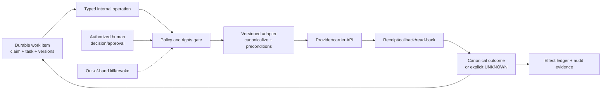
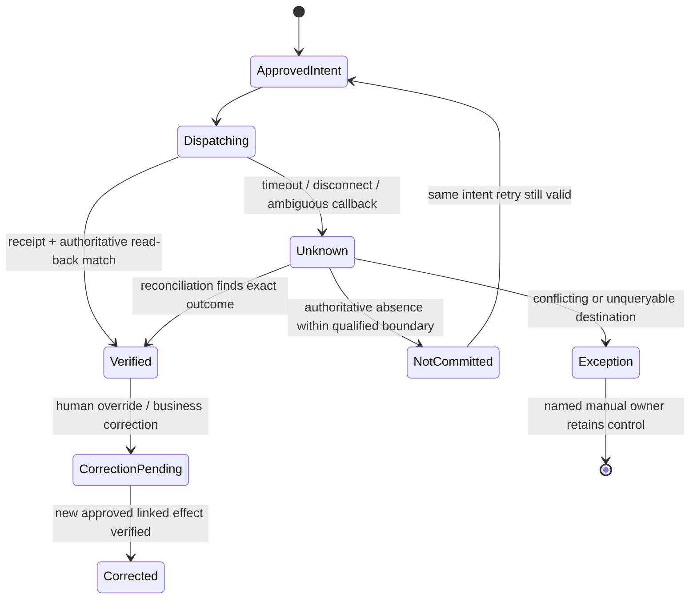

# Adapter Qualification and Operational Claims Playbooks

> **Research and verification date:** 2026-08-31  
> **Purpose:** Turn carrier, document, external-data, vendor, communication, financial, and referral integrations into narrow operations with explicit identity, rights, version, failure, reconciliation, and human-ownership semantics.

## The adapter is a control boundary

An SDK wrapper is not a qualified claims adapter. A production adapter translates one named carrier operation into one stable internal contract, enforces tenant and claim scope, persists exact intent, handles concurrency and ambiguous outcomes, and can prove the destination result later.

The model should see semantic operations such as `get_policy_bundle_at_loss`, `compare_estimate_revisions`, or `create_vendor_request_draft`. It should not receive provider endpoints, raw credentials, unrestricted search, generic record update, direct payment, or browser automation.



## Adapter dossier contract

Keep this dossier beside code and the immutable behavior bundle. A provider marketing page or OpenAPI file cannot fill the business-semantic fields.

```yaml
adapter_id: claims-core-guidewire-cloud
adapter_release: 4.2.0
provider_product_release: Guidewire Cloud 2026.03
api_profile: claim/v1 + carrier-extension-set-17
tenant_and_region: carrier-123/us-approved-region
qualified_operations:
  - operation: read_claim_exposure_snapshot
    internal_schema: claims.snapshot/3.1
    provider_endpoint_profile: exact-documented-and-configured-route
    required_rights: [claim.read, exposure.read]
    identity_mapping: claimId + exposureId + sourceSystem
    source_version: checksum-or-etag-plus-observed-event-sequence
    freshness: 60s_for_review; reread_at_commit
    effect_class: none
  - operation: submit_approved_reserve_transaction
    internal_schema: reserve.effect/2.0
    provider_endpoint_profile: carrier-qualified-reserve-route
    required_rights: [reserve.create.within_bound_authority]
    effect_class: consequential_financial_record
    semantic_operation_id: required
    payload_intent_hash: required
    concurrency_precondition: required
    provider_idempotency: not_assumed
    read_back: reserve_transaction_by_provider_ref_and_claim
    ambiguous_outcome: UNKNOWN_then_reconcile
    cancellation_or_compensation: linked_reversal_or_correction_per_carrier_rule
data_contract:
  allowed_classes: [claim-core, exposure-financial]
  prohibited_classes: [siu-detail, legal-privileged, bank-account-full]
  retention_and_logging: stable_refs_only
callbacks:
  authentication: provider-signature-or-mtls
  ordering: not_assumed
  duplication: expected
  schema_evolution: additive_fields_tolerated; unknown_enums_preserved
limits:
  quota_and_burst: measured-per-tenant-and-operation
  timeout: operation-specific
  max_page_and_batch: tested
support_and_change:
  deprecation_owner: integration-team
  status_channel: provider-and-carrier-operations
  rollback_target: claims-core-guidewire-cloud/4.1.3
qualification_evidence:
  contract_suite: adapter-contract/2026-08-31.2
  fault_suite: adapter-fault/2026-08-31.5
  sandbox_receipts: evidence-bundle-77
  production_canary_scope: carrier-123/property/CA/read-plus-draft
```

Every operation specifies what “success” means. For a read it may mean exact resource identity plus source version and completeness. For a write it means a verified business outcome, not merely an HTTP response.

## Operation-level capability and authority matrix

`R` is read-only, `D` creates a reversible draft, `A` requires exact human approval, and `P` remains prohibited for model-owned execution.

| System class | Qualified internal operation | Level | Freshness/version evidence | Success and reconciliation proof | Never infer |
| --- | --- | --- | --- | --- | --- |
| Claims core | Read claim, incidents, exposures, assignments, state and financial projection | R | Source checksum/ETag/sequence and observed time | Exact IDs, requested fields, pagination/completeness and receipt | Current policy contract, final decision, or payment state from summary fields |
| Claims core | Create FNOL/claim draft or internal activity | D/A by carrier | Stable source notice and operation ID; current duplicate candidates | Created object ID/read-back; duplicate search; owner/clock present | Notice implies coverage or claim number proves uniqueness |
| Claims core | Post reserve transaction | A | Exposure/coverage/reserve-line and claim versions; authority rule | Destination transaction read-back and ledger match | Model recommendation is approval or accounting truth |
| Policy/archive | Retrieve contract at loss | R | Policy/term/transaction IDs, effective/system intervals, archive manifest digest | Complete declarations/forms/endorsements with retrieval receipt | Current PAS view equals historic contract |
| Billing | Read account/policy period, invoice or delinquency facts needed by approved claim rule | R | Billing account/policy-period version and observed time | Exact account/policy crosswalk and qualified fields | Billing status decides coverage, cancellation effect, or claim payment |
| Payment/claim financial | Stage exact payee/amount/coverage intent | D | Payee verification, decision, lien/tax/sanctions/SoD and approval versions | Immutable intent hash and no external money movement | Recipient from claimant/contact role alone |
| Payment/disbursement | Commit, stop, void or correct approved payout | A; model cannot approve | Current authorization and destination lifecycle version | Provider/bank/claim read-back, settlement state and reconciliation | `accepted`, `sent`, check creation, or API `2xx` means cleared/received |
| Document/evidence | Commit original and request extraction | R/D internal | Byte digest, object version, page/rendition manifest, extractor release | Durable original; async job receipt; complete page/field/table result bundle | OCR confidence proves truth, completeness, signature validity or authenticity |
| Geospatial | Normalize/geocode a reported location | R | Literal address, provider/dataset/version, precision, observed time and license | Candidate coordinates plus match components/precision and ambiguity | Property identity, peril occurrence, causation or coverage |
| Weather/hazard | Retrieve event, observation, alert or declaration evidence | R | Source product/event ID, issued/effective/expiry/update times, geometry and retrieval time | Immutable response/reference and spatial/temporal match calculation | Alert/declaration proves damage, loss time or covered cause |
| Repair/estimate | Read estimate revision or create vendor request draft | R/D | Vendor/estimate/database/version, line taxonomy, rate geography and requested scope | Accepted work-order ID; status/read-back; estimate revision/line provenance | Vendor availability, price, causation, repairability or final value |
| Communication | Render approved template and stage recipient/channel | D | Template/locale/rule/fact/contact-consent versions | Immutable rendered artifact and exact recipient preview | Draft is notice; contact record is authorized recipient |
| Communication | Send exact approved message | A or narrow deterministic pre-authorization | Approval, obligation and recipient versions at commit | Provider message ID, authenticated callbacks/read-back and claim-file notation | Queued/sent means delivered or obligation satisfied |
| Fraud/referral | Create minimum-necessary factual referral | D/A specialist gate | Claim/evidence/rule versions, restricted reason and compartment | Restricted case/referral ID and owner; ordinary path gets no sensitive result | Score proves fraud, justifies delay/denial, or may be disclosed |
| Recovery/subrogation | Create specialist referral or demand draft | D/A | Decision/party/recovery-right/evidence versions | Specialist case ID, exact approved artifact and response state | Model can negotiate, waive, admit liability or post a recovery |

Claims, coverage, reserve, liability, compensability, settlement, fraud, legal, sanctions, final valuation, high-impact payment approval and closure remain accountable human/domain decisions even if an API technically permits the write.

## Qualification test suite

### Contract and identity tests

1. Resolve the same display number in two tenants and prove no cross-tenant result.
2. Test policy renewal, rewrite, cancellation/reinstatement and endorsement boundary at an imprecise loss time.
3. Test one claim with multiple claimants, exposures, coverages, payees and vendors.
4. Confirm pagination, sparse fields, expansions/includes, deleted records, unknown enum values and carrier extensions.
5. Verify currency/decimal/rounding, time zone, daylight-saving, locale, address and attachment encoding.
6. Preserve provider IDs only as cross-references; the internal semantic operation and business identity remain stable across adapter migration.

### Rights and environment tests

- enumerate the exact service-account permissions required per operation, then prove reads/writes outside tenant, claim, field, compartment, value band and environment are denied;
- prove sandbox and production use different credentials, destinations, callback URLs, recipient allow-lists and visual/operator indicators;
- revoke or rotate credentials during work and verify new effects stop while intake, audit and reconciliation remain visible;
- prove the model worker cannot access provider credentials, generic endpoint clients or raw browser sessions;
- test assigned/delegated human authority, expiry, termination, value limit, SoD and claim reassignment at commit time.

### Lifecycle and failure tests

| Fault | Required adapter behavior |
| --- | --- |
| Timeout before dispatch | Reuse same operation intent after state check; do not claim provider accepted it |
| Timeout/reset after dispatch | Persist `UNKNOWN`; read destination by stable operation/provider/business reference before retry |
| Same operation ID, changed payload | Reject as integrity error; new intent requires new operation and approval |
| Duplicate/reordered callback | Authenticate, deduplicate by event identity/version and apply legal transition only |
| Late callback after cancel/close | Preserve and reconcile; never discard because local state is terminal |
| Partial batch | Record each item result; retry/review only unresolved items with original identities |
| Provider returns `2xx` but later rejects | Maintain pending state until authoritative lifecycle proof; reopen obligation/owner if required |
| Source changes during model/review | Mark context/approval stale and reread; never last-write-wins over adjuster update |
| Quota/throttle/outage | Backoff with jitter and deadline-aware admission; deterministic/manual fallback; no retry storm |
| New response field/enum or removed endpoint | Preserve unknown values or quarantine incompatible route; alert deprecation owner |
| Region/license/retention change | Stop unsupported data route; preserve intake and route human/manual within approved boundary |

### Qualification exit evidence

An adapter is qualified only for named operations, provider/product release, carrier configuration, tenant/region, data class, volume, and authority tier. Retain:

- official specification and observed tenant behavior with access date;
- endpoint/profile, scopes/roles, carrier extension and schema fixtures;
- latency, quota, page/batch, callback and consistency measurements;
- fault, concurrency, idempotency, reconciliation, cancellation and correction results;
- privacy, residency, retention, subprocessor, license and security approval;
- sandbox receipts and controlled production canary evidence;
- owner, support hours/status channels, refresh triggers, deprecation and rollback plan;
- explicit unsupported operations and live-tenant discrepancies.

## Representative provider and standards snapshot

These are examples to teach qualification, not endorsements or promises that a carrier tenant exposes the same operations.

| Source inspected | Current finding at 2026-08-31 | Qualification consequence and limitation |
| --- | --- | --- |
| Guidewire [ClaimCenter Cloud API, 2026.03](https://docs.guidewire.com/cloud/is/202603/cloudapibf/cloudAPI/ClaimCenter.html) | Public guide separates FNOL/adjudication, exposures, activities, financials and other flows | Pin Cloud release and carrier extensions; permissions/configuration and live tenant may differ |
| Guidewire [exposure overview, 2026.03](https://docs.guidewire.com/cloud/is/202603/cloudapibf/cloudAPI/ClaimCenter/fnol/exposures/c_overview-of-exposures-in-ClaimCenter.html) | Exposure links claim, claimant and coverage and has reserve-line semantics | Map carrier product objects explicitly; do not generalize exposure rules across platforms/products |
| Guidewire [creating checks, 2026.03](https://docs.guidewire.com/cloud/is/202603/cloudapibf/cloudAPI/ClaimCenter/financials/check-creating.html) and [post-submission lifecycle](https://docs.guidewire.com/cloud/is/202603/cloudapibf/cloudAPI/ClaimCenter/financials/check-lifecycle/c_the-check-life-cycle-after-submission.html) | Payments, checks/payees, check sets/approval and issued/cleared/stopped/voided states are distinct | Adapter and ledger must preserve every layer; Cloud API state is not bank/payee receipt, and composite limitations apply |
| Guidewire [BillingCenter, 2026.03](https://docs.guidewire.com/cloud/is/202603/cloudapibf/cloudAPI/BillingCenter.html) | Billing APIs have their own accounts, policy periods, invoices, payments/instruments and configured behavior | Billing records are not the claim-payment ledger or coverage adjudicator; qualify only required reads/effects |
| ACORD [P&C Data Standards](https://www-dev.acord.org/standards-architecture/acord-data-standards/Property_Casualty_Data_Standards) | Catalog identified P&C XML 2.13.0 (January 2025) during research | Vocabulary/transaction standard does not supply carrier authorization, mapping, idempotency or lifecycle truth; licensing/profile may apply |
| Amazon Textract [`StartDocumentAnalysis`](https://docs.aws.amazon.com/textract/latest/APIReference/API_StartDocumentAnalysis.html) | Async job supports tables/forms/queries/layout and a client request token; results require status plus retrieval | Preserve S3 object version, job/token, feature set/adapter version, pagination and page completeness; local field calibration/review still required |
| OGC [STAC 1.1.0](https://www.ogc.org/standards/stac/) and [OGC API Features 1.0.1](https://ogcapi.ogc.org/features/index.html) | Current standards describe geospatial asset metadata/search and feature API conformance | Record collection/item/version/geometry/CRS and conformance classes; standardization does not prove source accuracy or legal right to use imagery |
| Google [Geocoding API v4 preview](https://developers.google.com/maps/documentation/geocoding/start-v4) and [policies](https://developers.google.com/maps/documentation/geocoding/policies) | Preview docs reported 25 QPS; caching/storage and attribution restrictions apply, with regional terms | Do not make preview quota/behavior a universal constant; preserve literal address and match precision, approve storage/license pattern, and offer ambiguity review |
| NWS [alerts web service](https://www.weather.gov/documentation/services-web-alerts) | Alerts use CAP 1.2/JSON-LD; service recommends polling no more often than every 30 seconds | Treat alerts as time/geometry evidence with update/expiry and rate discipline, not causation or coverage; US scope only |
| FEMA [Disaster Declarations Summaries](https://www.fema.gov/about/openfema/disaster-declarations-summaries) | OpenFEMA exposes official declaration records and last-refresh metadata; the page warns that raw historical data can contain error | Declaration scope and refresh matter; declaration association is not insured-loss proof or a universal claims-rule overlay |
| Twilio [Messages resource](https://www.twilio.com/docs/messaging/api/message-resource) | Message lifecycle distinguishes queued/sent/delivered/failed; callback fields vary and may gain fields | Verify webhook signature, tolerate additive fields, preserve attempt/provider ID, and define which receipt satisfies each obligation; channel delivery evidence varies |
| Guidewire [assessment summaries, 2026.03](https://docs.guidewire.com/cloud/is/202603/cloudapibf/cloudAPI/ClaimCenter/fnol/creating-assessment-summaries.html) | External assessment categories, score date and third-party identifiers can be recorded | A score is a versioned external assessment only; it cannot become fraud, causation, liability or payment authority |

Public official documentation for many carrier-configured repair networks, estimating platforms, bank/payment rails, fraud case systems and private policy archives is incomplete or contract-gated. Do not invent endpoints or claim idempotency. Obtain the tenant specification, data-processing/license terms, sandbox and observed failure evidence; otherwise keep the operation manual or supervised.

## Playbook 1 — FNOL and claim opening

1. Intake authenticates or labels the source, commits original artifacts, assigns `fnolId`, timestamps receipt and deduplicates the transport event.
2. A deterministic service resolves carrier/tenant and queries policy/claim candidates; no model selects an ambiguous target.
3. Durable workflow creates safety, acknowledgment and review obligations independently of OCR/model completion.
4. Document service extracts candidates with artifact/page anchors; the model may normalize narrative fields and surface contradictions.
5. Duplicate logic links candidates; an approved deterministic rule or intake specialist decides create/link/supplement/reopen.
6. The claims adapter creates a draft/claim with stable source-notice and operation identity, then reads back claim ID, state, owner and created clocks.
7. If create timed out, mark outcome unknown and search by the semantic source notice/operation before any retry.

**Exit:** received notice is durable; exact policy/claim identity is resolved or assigned to an ambiguity owner; required clocks are open; artifacts are recoverable; no coverage promise occurred.

## Playbook 2 — Evidence and estimate revision

1. Commit original evidence before parsing; record byte digest, source actor/channel, object version and access class.
2. Request qualified OCR/layout/table or media processing with stable job identity and declared feature/model/adapter version.
3. Verify page/rendition completeness and preserve literal observations separately from normalized facts.
4. Retrieve estimate revisions by provider estimate/revision IDs and price/tax/labor/database basis; line-map deterministically where possible.
5. The model compares scoped evidence and highlights material differences with line/source anchors; it does not choose authenticity, causation, repairability or final value.
6. A qualified adjuster/appraiser accepts, corrects, requests more evidence or refers to an expert. Store the human decision separately.

**Exit:** every material comparison is reproducible from exact revisions; missing/contradictory states remain visible; no provider confidence is treated as business correctness.

## Playbook 3 — Reserve recommendation and posting

1. Read exact claim/exposure/coverage, payments/recoveries, existing reserve lines, current authority and source versions.
2. Run deterministic calculations first. The model may propose a range, evidence, assumptions and uncertainty for one supported reserve purpose.
3. Present recommendation beside source evidence and current reserve—not as a default-filled approval.
4. Authorized adjuster/manager records the reserve decision under carrier authority; recommendation and decision keep separate IDs.
5. Create exact reserve intent with currency, exposure/coverage/cost type, amount/change method, decision/approval and source preconditions.
6. Commit through the financial adapter and read back the reserve transaction. Unknown outcome blocks retry and dependent payment.

**Exit:** posted transaction equals approved intent and carrier ledger read-back; finance/statutory/accounting and actuarial aggregates remain outside the agent.

## Playbook 4 — Repair/vendor dispatch and supplements

1. Deterministic vendor eligibility checks geography, peril/service, license/certification, contract/rate, sanctions, conflicts, availability, data fields and claimant choice rules.
2. Model may draft scope from verified facts; it cannot select a vendor on opaque score or promise timing/coverage.
3. Reviewer approves exact vendor, property/item, scope, contact disclosure, access/safety instructions, spending ceiling and cancellation terms.
4. Dispatch adapter persists semantic operation and calls the qualified endpoint. Read back work-order ID/status; timeout becomes unknown.
5. Callbacks are authenticated/deduplicated. Appointment, arrival, estimate, invoice, supplement and completion are separate states/artifacts.
6. Scope/price change creates a supplement/reapproval; it never mutates the original approved intent silently.

**Exit:** one intended work order exists, minimum necessary data was disclosed, claimant/adjuster can see status, and invoice/payment remains separately controlled.

## Playbook 5 — Claim payment approval and release

1. Read the authorized claim decision, exposure/coverage, exact payee roles, liens/mortgagees/representatives, tax/sanctions/benefit coordination, release and current financial state.
2. Deterministic controls construct payment intent; the model may explain missing prerequisites but cannot choose payee, amount or eligibility.
3. Required human principals approve the exact amount/currency, payees/allocation, delivery instrument, claim financial transaction, evidence/rules and expiry under SoD.
4. Commit-time gate rereads state and authority. Changed payee, amount, reserve, decision, hold or approval invalidates commit.
5. Payment adapter creates the configured claim payment/check/disbursement request with stable operation ID, then tracks all lifecycle states.
6. Timeout or provider acceptance is not completion. Reconcile claim financial object, payment provider/bank status and return/stop/void events before marking verified.
7. Correction, stop, void, reissue or recovery is a new linked authorized operation; never edit history.

**Exit:** the exact intended payee allocation and amount have one verified outcome; claim file and financial records agree; unknown/returned items retain owners.

## Playbook 6 — Subrogation, recovery, legal, and fraud referral

1. Trigger produces a factual, source-linked candidate—not an accusation, legal conclusion or recovery right.
2. Authorization filters minimum necessary fields and selects the restricted destination/owner.
3. Model may summarize chronology and evidence while marking allegations, gaps and contradictions.
4. Specialist reviews and creates the referral/case. The ordinary claim path receives only permitted routing state.
5. Demands, admissions, litigation/privilege choices, investigation steps, regulatory fraud reports, settlement and recoveries are handled by their accountable systems and people.
6. Any payment/recovery posting follows a separate approved effect and reconciliation contract.

**Exit:** the restricted owner and source evidence are durable; ordinary communications disclose no protected referral; normal fair/prompt claim obligations continue unless an authoritative rule directs otherwise.

## Playbook 7 — Catastrophe association and surge

1. Claims operations creates a carrier event profile with peril, geography, time window, source/declaration IDs, versions, effective/expiry, regulator overlays and owner.
2. Weather/geospatial services produce candidate matches with exact observations/geometry/precision; they do not prove causation or coverage.
3. Deterministic association rules link claim candidates while preserving separate loss/claim/property identities and duplicate uncertainty.
4. CAT mode activates event-partitioned admission, vendor/provider budgets, temporary-access controls, communication/rule overlays and protected non-CAT/reconciliation capacity.
5. Model work degrades before intake, clocks, evidence, review, audit or effect controls. Vendor scarcity and changed pricing require requalification/review.
6. Exit removes temporary access, expires overlays, reconciles unknown effects, recomputes open obligations and reviews non-CAT harm.

**Exit:** event association and overlays are versioned/reversible; no authority expanded; both CAT and non-CAT obligation/service evidence pass thresholds.

## Playbook 8 — Unknown outcome, cancellation, and human override



Cancellation is intent, not erasure. Persist cancellation request, stop new dependent work, query provider state, invoke only supported cancel/stop/void route, and reconcile races with late callbacks. If completion won the race, route a new correction/compensation decision.

A human override records principal, authority, reason, evidence viewed, original recommendation/decision/effect, desired correction and claimant impact. It does not delete model output or rewrite provider receipts. Urgent manual action taken outside the agent is imported as a source event, invalidates stale plans/approvals, and is reconciled before resumption.

## Refresh and rollback triggers

Requalify an affected operation when provider product/API version, carrier extension, permission, callback schema/signature, quota, consistency, region, retention, subprocessor, price, license, model/score, dataset, status transition, identifier, endpoint or support window changes. Also requalify after any wrong target, duplicate effect, unreconciled unknown, missed clock, cross-tenant access, stale overwrite, provider incident, callback-authentication failure or CAT-load breach.

Rollback disables the adapter operation and its credentials/route, preserves intake and clocks, drains or parks queued work, reconciles in-flight/unknown effects, scopes the release cohort, restores the prior qualified version only when schema/state compatibility passes, and routes unsupported work to named humans. Rolling back code alone does not roll back messages, vendors, payments, referrals, reserve transactions or claim records already created.

## Build-and-qualify exercise

Choose one read and one reversible draft operation for a single product/jurisdiction. Produce the dossier, internal schema, rights matrix, provider fixtures, semantic identity, source version, callback rules, fault suite, reconciliation query, manual fallback, SLO and rollback. Run duplicate, stale, timeout-after-commit, malformed, cross-tenant, revoked-credential and provider-outage cases. Exit only when a reviewer can reconstruct exact input, provider behavior and destination state from stable evidence without reading a chat transcript.

## Related guides

- [Reference architecture, runtime, and integrations](02-reference-architecture-runtime-and-integrations.md)
- [Claim identity, FNOL, evidence, and documents](03-claim-identity-fnol-evidence-and-documents.md)
- [Assessment, reserves, adjudication, and referrals](05-assessment-reserves-adjudication-and-referrals.md)
- [State, events, effects, reconciliation, and recovery](06-state-events-effects-reconciliation-and-recovery.md)
- [Security, privacy, permissions, and audit](08-security-privacy-permissions-and-audit.md)
- [Evaluation, observability, SLOs, and incidents](09-evaluation-observability-slos-and-incidents.md)
- [Deployment, catastrophe scale, cost, releases, and roadmap](10-deployment-catastrophe-scale-cost-releases-and-roadmap.md)
- [Insurance claims research packet](../../research/packets/insurance-claims-agent-blueprint.md)
