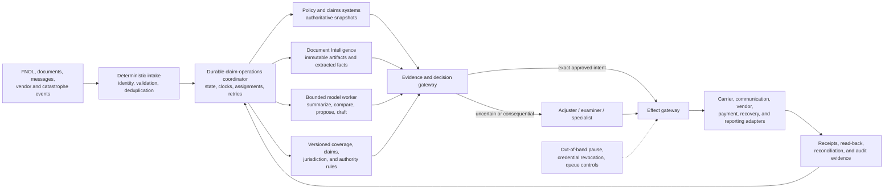

# Production Insurance Claims Operations Agent Blueprint

> **Research date:** 2026-08-31  
> **Status:** Pass 2 production design reference; validate every policy, jurisdiction, product, license, provider/tenant behavior, communication, payment, and reporting obligation before use  
> **Scope:** Policy and party identity, first notice of loss (FNOL), coverage-version evidence, claimant communications, evidence coordination, loss-assessment support, reserve and adjudication recommendations, adjuster/examiner handoff, controlled effects, reconciliation, and catastrophe operations

## Bottom line

The safe, useful insurance claims agent is a **durable claim-operations workflow with a bounded model worker**. It is not an autonomous adjuster, coverage authority, settlement negotiator, payment service, fraud investigator, or legal decision-maker.

Carrier systems own policy, claim, exposure, reserve, payment, recovery, assignment, and communication records. A jurisdiction-aware rules service owns deadlines and required notices. Authorized adjusters, examiners, claims managers, recovery specialists, and other licensed or designated people own consequential claim decisions. The model may organize evidence, extract or compare uncertain facts, draft communications, identify missing information, explain deterministic calculations, and make source-backed recommendations. It must not independently deny coverage, determine final liability, bind a settlement, disclose a fraud investigation, or execute a high-impact payment.

## Who should use this blueprint

- claims product and operations leaders defining the safe automation boundary;
- adjusters, examiners, team leads, special investigation units, recovery specialists, and catastrophe managers reviewing workflow ownership;
- architects and engineers designing policy, claims, document, vendor, communication, payment, and regulatory adapters;
- compliance, legal, privacy, security, model-risk, market-conduct, and internal-audit teams validating controls;
- evaluation and operations teams proving claim quality, timeliness, fairness, reliability, capacity, and recoverability.

This is a cross-line reference architecture, not a substitute for product-specific procedures. Property, auto, liability, workers' compensation, health, disability, life, catastrophe, specialty, and public-program claims have different evidence, licenses, clocks, benefits, appeals, and reporting duties.

## What done means

A production claim-assistance run is complete only when:

1. the carrier, tenant, policy term/version, claim, loss event, claimant, insured, exposures, payees, and vendors in scope are resolved or explicitly unresolved;
2. original artifacts and extracted facts retain provenance, and conflicting evidence remains visible;
3. applicable obligation clocks are computed from a versioned jurisdiction/product rule with source and effective dates;
4. recommendations identify evidence, assumptions, uncertainty, policy/rule versions, and the authorized human owner;
5. every consequential decision is recorded by an authorized adjuster, examiner, or specialist, not inferred from model text;
6. every external write is separately authorized, idempotent by business intent, and reconciled against the destination system;
7. claimant communications use the approved template and facts, preserve required disclosures, and have a delivery record;
8. payments, recoveries, subrogation, vendor work, regulatory reports, and legal or fraud referrals pass their independent gates;
9. the claim file can reconstruct what was received, considered, decided, communicated, changed, and verified;
10. required timers, monitoring, reopen rights, residual recoveries, and unresolved exceptions have durable owners.

An API `2xx`, a generated summary, or a model saying “claim complete” satisfies none of these conditions by itself.

## Non-goals and domain boundaries

| Neighbor or responsibility | Claims agent boundary | Accountable owner |
| --- | --- | --- |
| Document parsing, OCR, tables, handwriting, and immutable originals | Request evidence-bearing extraction; consume approved facts and artifact references | [Document Intelligence agent](../document-intelligence-agent/README.md) |
| Suspicious entities, collusion graphs, network analysis, case investigation, and regulatory fraud reporting | Package factual referral indicators without declaring fraud; do not expose a confidential referral in ordinary communications | [Fraud and AML investigation agent](../fraud-aml-investigation-agent/README.md), SIU, fraud unit, or regulator |
| Ordinary ledgers, cash disbursement, bank reconciliation, statutory accounting, and aggregate actuarial reserves | Supply an approved claim financial intent and consume receipts; never become the ledger | [Finance and accounting agent](../finance-accounting-agent/README.md), treasury, accounting, and actuarial functions |
| Coverage litigation, privilege, legal holds, demands, discovery, and legal advice | Detect and route legal matters; segregate privileged material | Legal counsel and legal-operations systems |
| Final coverage, liability, compensability, benefit, valuation, settlement, and claim closure decisions | Assemble evidence and recommend; never autonomously decide or deny | Authorized adjuster, examiner, claims manager, or designated committee |
| Sanctions, payee ownership, tax, lien, benefit-coordination, and payment-release controls | Require an authoritative pass; do not reason around a block | Compliance, payment, finance, and specialist services |

The insurer retains responsibility even when intake, adjustment, document processing, models, third-party administrators, or vendors are outsourced. The [IAIS Insurance Core Principles](https://www.iaisweb.org/uploads/2024/12/IAIS-ICPs-and-ComFrame-adopted-in-December-2024.pdf) use close oversight and ultimate insurer responsibility as the claims-outsourcing baseline.

## Non-negotiable invariants

1. **The transcript is not the claim file.** Authoritative facts, clocks, decisions, communications, and effects are structured and independently queryable.
2. **Notice is not coverage.** Accepting an FNOL or opening a claim does not promise that a loss is covered or a party is entitled to payment.
3. **Policy number is not policy evidence.** Coverage work binds the exact carrier, term, form, declarations, endorsements, transactions, effective times, jurisdiction, and loss instant considered.
4. **Insured, claimant, beneficiary, injured party, payee, lienholder, attorney, and vendor are different roles.** Never collapse them into one “customer” identity.
5. **Facts, allegations, observations, estimates, rules, recommendations, and decisions are separate records.** Each has a source and owner.
6. **Missing, conflicting, stale, illegible, disputed, not-applicable, and adverse are distinct states.** Unknown is never converted to “no.”
7. **The model is a proposer, never the authorizer.** Prompts cannot grant licenses, authority limits, settlement authority, or payment rights.
8. **Only an authorized human records a consequential claim decision.** This includes denial, partial denial, liability, compensability, settlement, high-impact reserve disposition, and claim closure.
9. **Every deadline comes from a versioned obligation record.** A generic model regulation, handbook, or historical rule is not a universal production clock.
10. **Required communications are deterministic effects.** Their facts, template, channel, approval, delivery, and claim-file notation are auditable.
11. **Fraud suspicion does not equal fraud.** The claims path packages a confidential referral; qualified investigators decide what to investigate and report.
12. **A case reserve recommendation is not an accounting entry or actuarial estimate.** The claims system, financial controls, and actuarial process retain ownership.
13. **Every external effect has a semantic operation ID.** Retry and resume reuse it; changed intent requires a new operation.
14. **Timeout after dispatch means `UNKNOWN`.** Reconcile before retrying a payment, notice, assignment, report, reserve change, or vendor order.
15. **Approval binds the exact effect.** Target, amount, payees, coverage/exposure, state version, rule version, evidence version, expiry, and intent hash cannot drift after review.
16. **Catastrophe pressure does not expand authority.** Capacity and degradation rules may change routing and latency, never decision or payment permissions.
17. **Untrusted claim content remains data.** Emails, notes, estimates, photos, OCR, PDFs, vendor payloads, and tool output cannot change system instructions or permissions.
18. **Audit evidence and telemetry are separate.** Sampling or trace retention cannot destroy the legal or operational claim record.
19. **The workflow works without the model.** It can accept notice, preserve evidence, compute clocks, queue people, and execute approved deterministic playbooks during model outage.
20. **One out-of-band control can stop new effects.** It must not depend on the model or the affected orchestration path.

## Recommended autonomy ceiling

Authority is granted per **claim workflow × product × jurisdiction × effect class × value/risk band × tenant**, not to an “agent” globally.

| Level | Capability | Claims examples | Default posture |
| --- | --- | --- | --- |
| **C0 — Observe** | Read a purpose-limited projection | Summarize file, list missing evidence, show due clocks | Launch baseline |
| **C1 — Propose** | Create a typed recommendation or draft | FNOL field candidates, assessment summary, reserve proposal, status-letter draft | Normal useful authority |
| **C2 — Stage** | Create a reversible pending object | Draft claim, review task, unsent approved-template communication, vendor request draft | Only after target and privacy tests |
| **C3 — Approved effect** | Commit one exact, independently approved effect | Send notice, update reserve, submit report, dispatch vendor, release eligible payment | Mature adapters with reconciliation |
| **C4 — Pre-authorized low-impact effect** | Commit a narrow, reversible action within deterministic policy | Internal routing tag, reminder, evidence request from an allow-listed template | Exceptional and explicitly budgeted |
| **C5 — Broad autonomous claims authority** | Decide coverage/liability/settlement or move money broadly | Autonomous denial, settlement, claim closure, high-impact payment | Prohibited target |

Even when a carrier permits automated low-value processing, the model must not itself determine that the case qualifies. A deterministic policy service evaluates eligibility, exclusions, value, authority, sanctions, fraud/legal holds, claim state, and current approvals at commit time.

## Architecture choices

| Workload | Best default | Why |
| --- | --- | --- |
| Stable structured intake and deterministic routing | Forms, rules, and workflow without a model | Cheaper, testable, and predictable |
| Variable notices and evidence with bounded schemas | Durable workflow plus model-assisted extraction and summary | Model handles semantic variation; application keeps control |
| Image or document interpretation | Document-intelligence pipeline plus human exception review | Preserves artifact identity, page evidence, and calibration |
| Long-tail claim investigation support | Bounded agent inside a durable claim workflow | Allows tool sequencing without giving the loop lifecycle authority |
| Coverage, liability, settlement, or payment decision | Human decision surface backed by deterministic rules and evidence | Required accountability and authority remain explicit |
| Legacy portal with no supported API | Narrow supervised UI automation only as a temporary adapter | Brittle, hard to secure, and difficult to reconcile |

Prefer one durable coordinator with typed workers and human roles. A “swarm” of virtual adjuster, fraud, legal, finance, and payment agents obscures authority without adding domain accountability.

## Authoritative records

| Record | Authoritative owner | Model access |
| --- | --- | --- |
| Policy contract, term, form, endorsements, limits, deductible, status | Policy administration system and policy archive | Read scoped snapshot and cited excerpts |
| Claim, incident, exposure/feature, assignment, reserve, financial status | Claims administration system | Read projection; propose bounded changes |
| Original evidence and extraction lineage | Document/evidence service | Read approved derivatives and evidence anchors |
| Obligation clocks and required communications | Versioned regulatory/rules service plus durable workflow timers | Explain; never invent or pause |
| Coverage/liability/settlement decision | Authorized claim-decision record | Draft recommendation only |
| Payment or recovery transaction | Claim financial subledger/payment/recovery system and finance records | Propose exact intent; consume receipt |
| Fraud/SIU case | Restricted investigation system | Submit minimum-necessary referral; no ordinary read-back |
| Legal matter and privilege | Legal matter system | Route and segregate; no general retrieval |
| Audit evidence | Application-owned claim evidence ledger | Contribute versioned derived records |
| Diagnostic telemetry | Observability platform | Redacted references only |

## Guide map

| Guide | Decision it supports |
| --- | --- |
| [Mission, workload fit, authority, and boundaries](01-mission-workload-fit-and-authority.md) | Whether an agent belongs and which actions remain prohibited |
| [Reference architecture, runtime, and integrations](02-reference-architecture-runtime-and-integrations.md) | How to split the control, judgment, evidence, decision, and effect planes |
| [Claim identity, FNOL, evidence, and document handoff](03-claim-identity-fnol-evidence-and-documents.md) | How to establish parties, policies, claims, loss events, artifacts, and source-backed facts |
| [Coverage versions, regulatory clocks, and communications](04-coverage-versions-regulatory-clocks-and-communications.md) | How to prevent stale-policy reasoning and missed or incorrect claimant notices |
| [Assessment, reserves, adjudication, and specialist referrals](05-assessment-reserves-adjudication-and-referrals.md) | What the model may recommend and how adjusters, examiners, SIU, legal, and recovery teams retain ownership |
| [State, events, effects, reconciliation, and recovery](06-state-events-effects-reconciliation-and-recovery.md) | How approved intent becomes one verified carrier, vendor, reporting, or financial outcome |
| [Context, memory, planning, and orchestration](07-context-memory-planning-and-orchestration.md) | How to preserve continuity without turning summaries or similar cases into authority |
| [Security, privacy, permissions, and audit](08-security-privacy-permissions-and-audit.md) | How to protect claimants, privileged material, tenants, credentials, and evidence |
| [Evaluation, tracing, SLOs, failure injection, and incidents](09-evaluation-observability-slos-and-incidents.md) | How to prove quality and containment before authority promotion |
| [Deployment, catastrophe scale, cost, releases, and roadmap](10-deployment-catastrophe-scale-cost-releases-and-roadmap.md) | How to ship, surge, degrade, recover, and evolve from Stage 0 through Stage 6 |
| [Adapter qualification and operational claims playbooks](11-adapter-qualification-and-operational-playbooks.md) | How to qualify each carrier/provider operation and run FNOL, evidence, reserve, vendor, payment, referral, CAT, cancellation, and unknown-outcome flows |

The [research packet](../../research/packets/insurance-claims-agent-blueprint.md) records the dated regulatory and integration baseline, source strengths, contradictions, decisions, limitations, and refresh triggers.

## Reader paths

| Reader | Recommended path |
| --- | --- |
| Claims product/operations owner | This overview → [mission and authority](01-mission-workload-fit-and-authority.md) → [identity/FNOL/evidence](03-claim-identity-fnol-evidence-and-documents.md) → [coverage/clocks/communications](04-coverage-versions-regulatory-clocks-and-communications.md) → [assessment and handoffs](05-assessment-reserves-adjudication-and-referrals.md) |
| Adjuster, examiner, claims manager, SIU, legal, recovery, or payment owner | [Mission and authority](01-mission-workload-fit-and-authority.md) → the relevant domain sections in [assessment and referrals](05-assessment-reserves-adjudication-and-referrals.md) → [effect gates](06-state-events-effects-reconciliation-and-recovery.md) |
| Architect or integration engineer | [Architecture and integrations](02-reference-architecture-runtime-and-integrations.md) → [identity/evidence contracts](03-claim-identity-fnol-evidence-and-documents.md) → [state/events/effects](06-state-events-effects-reconciliation-and-recovery.md) → [adapter qualification and playbooks](11-adapter-qualification-and-operational-playbooks.md) → [context and planning](07-context-memory-planning-and-orchestration.md) |
| Security, privacy, compliance, legal, audit, or model-risk reviewer | [Coverage/clocks/communications](04-coverage-versions-regulatory-clocks-and-communications.md) → [security/privacy/audit](08-security-privacy-permissions-and-audit.md) → [evaluation and incidents](09-evaluation-observability-slos-and-incidents.md) → [research packet](../../research/packets/insurance-claims-agent-blueprint.md) |
| Reliability, platform, catastrophe, or release operator | [State/effects/recovery](06-state-events-effects-reconciliation-and-recovery.md) → [evaluation/SLOs/incidents](09-evaluation-observability-slos-and-incidents.md) → [deployment/CAT/roadmap](10-deployment-catastrophe-scale-cost-releases-and-roadmap.md) |

## Minimal production slice

Start with one product, one jurisdiction, one intake channel, and one claim operation such as property FNOL evidence completeness or auto estimate comparison. Ship:

- deterministic identity resolution and duplicate handling;
- read-only policy and claim projections with exact versions;
- immutable evidence handoff to Document Intelligence;
- model-generated, cited summary and missing-evidence proposal;
- a versioned obligation clock and human-owned work queue;
- an adjuster decision surface that shows source evidence before recommendations;
- no direct financial effect and no autonomous claimant determination;
- trace, audit, evaluation, privacy, manual fallback, and incident controls.

Add one effect class only after its adapter can identify exact targets, bind an approval, survive duplicate delivery, represent an unknown outcome, reconcile from authoritative state, and prove a correction path.

## Top risks and mandatory stops

| Stop condition | Required response |
| --- | --- |
| Policy term/version, named insured, loss date, jurisdiction, coverage, claimant role, or claim identity is unresolved | Stop recommendation; resolve or route |
| Evidence conflicts, is missing, altered, illegible, stale, or lacks provenance | Preserve conflict; request evidence or human review |
| A clock rule is absent, stale, overridden, or ambiguous | Use the most conservative approved manual path; compliance owner resolves |
| Communication could deny, reserve rights, admit liability, bind coverage, settle, threaten limitation, or reveal investigation | Authorized adjuster/legal/compliance review before send |
| Payee, lien, tax, sanctions, medical-benefit coordination, authority limit, or release condition is unresolved | Block payment intent |
| Fraud signal appears | Create confidential minimum-necessary referral; do not label the claimant or alter ordinary communications without SIU direction |
| Legal representation, litigation, demand, subpoena, privilege, or hold appears | Route to legal workflow and restrict access |
| Effect receipt is missing or contradictory | Mark `UNKNOWN`; reconcile; never blind-retry |
| Catastrophe order, emergency license rule, or deadline extension changes | Pin the new overlay, recompute affected clocks, audit changes, notify owners |
| Model/tool/provider behavior changes outside an approved release | Disable affected route, preserve intake, and fall back to deterministic/manual handling |

## Canonical repository dependencies

- [Agent state and event contracts](../../runtime/agent-state-and-event-contracts.md)
- [Durable execution](../../runtime/durable-execution.md)
- [Tool contracts](../../tools/tool-contracts.md)
- [Tool results, artifacts, and provenance](../../tools/tool-results-artifacts-and-provenance.md)
- [Context engineering](../../context-memory/context-engineering.md)
- [Compaction and continuity](../../context-memory/compaction-and-continuity.md)
- [Memory architecture](../../context-memory/memory-architecture.md)
- [Idempotency and side-effect safety](../../reliability/idempotency-and-side-effects.md)
- [Prompt injection and untrusted data](../../security/prompt-injection-and-untrusted-data.md)
- [Permissions, sandboxing, and secrets](../../security/permissions-sandboxing-and-secrets.md)
- [Agent threat model](../../security/agent-threat-model.md)
- [Trajectory and reliability evaluation](../../evaluation/trajectory-and-reliability-evaluation.md)
- [Observability and tracing](../../evaluation/observability-and-tracing.md)
- [Deployment, release, and incident response](../../operations/deployment-release-and-incident-response.md)
- [Queues, scheduling, and backpressure](../../operations/queues-scheduling-and-backpressure.md)
- [Scaling, capacity, and SLOs](../../operations/scaling-capacity-and-slos.md)
- [Model routing, cost, and latency](../../operations/model-routing-cost-and-latency.md)

## Selected primary sources

- [NAIC Unfair Claims Settlement Practices Act, Model 900](https://content.naic.org/sites/default/files/model-law-900.pdf)
- [NAIC Unfair Property/Casualty Claims Settlement Practices Model Regulation, Model 902](https://content.naic.org/sites/default/files/model-law-902.pdf)
- [NAIC Model Bulletin on the Use of AI Systems by Insurers](https://content.naic.org/sites/default/files/inline-files/2023-12-4%20Model%20Bulletin_Adopted_0.pdf)
- [IAIS Insurance Core Principles and ComFrame, adopted December 2024](https://www.iaisweb.org/uploads/2024/12/IAIS-ICPs-and-ComFrame-adopted-in-December-2024.pdf)
- [FCA Insurance Conduct of Business Sourcebook, claims handling](https://handbook.fca.org.uk/handbook/icobs8)
- [California Department of Insurance 2026 major-disaster property claims guide](https://www.insurance.ca.gov/0200-industry/0050-renew-license/0200-requirements/upload/2026-Guide-for-Adjusting-Property-Claims-in-California-After-a-Major-Disaster_Final.pdf)
- [FEMA NFIP Claims Manual, March 2025](https://www.fema.gov/sites/default/files/documents/fema_rsl_nfip-claims-manual_06032025.pdf)
- [NAIC Insurance Data Security Model Law, Model 668](https://content.naic.org/sites/default/files/model-law-668.pdf)

## Baseline limitations and refresh triggers

This blueprint synthesizes sources available on **2026-08-31**. It is not legal advice and does not enumerate every jurisdiction, line, policy form, benefit program, consent rule, licensing requirement, limitation period, catastrophe order, or reporting obligation. The NAIC documents cited here are models unless adopted by a jurisdiction; examples from California, Texas, New York, FEMA/NFIP, CMS, the FCA, IAIS, ACORD, or a claims platform are not universal rules.

Refresh the affected guide immediately when a policy form or administration model changes; a jurisdiction changes claims, privacy, AI, licensing, limitation, payment, fraud, or reporting rules; a catastrophe or emergency order is issued or expires; a carrier changes authority limits or claims procedures; a vendor/API changes semantics; a model, prompt, tool, schema, template, rule, or data source changes; or an incident reveals a missed deadline, wrong party, unsupported decision, unfair outcome, duplicate/incorrect effect, privacy breach, or unreconciled financial state.
