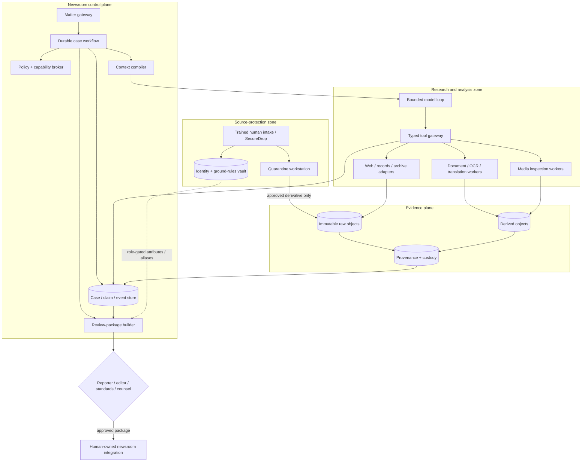
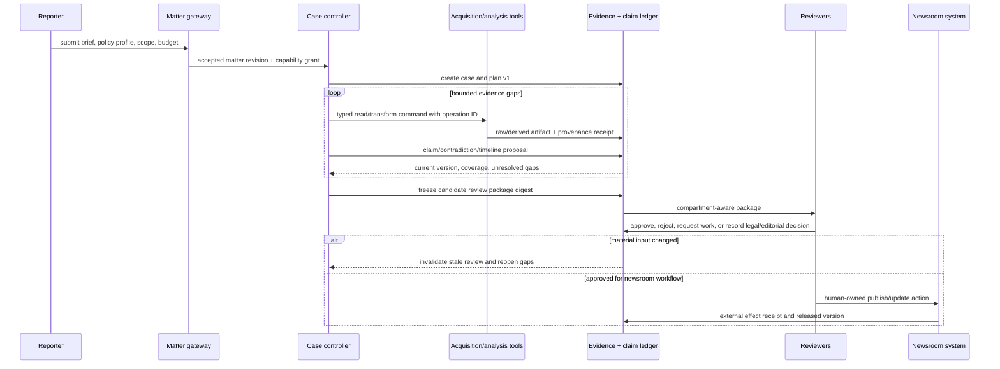

# Mission, Authority, and Reference Architecture

## Start with the deterministic alternative

Most newsroom research work should begin as ordinary software:

```text
matter form -> records/source register -> capture/import -> indexed evidence
-> human claim notes -> review checklist -> newsroom handoff
```

That system can already provide permissions, immutable originals, OCR queues, source registers, reminders, audit logs, and correction history. It is usually safer, cheaper, and easier to validate than an agent. Add model-directed behavior only when evaluation shows useful improvement on tasks such as adaptive search planning, lead selection, cross-document reconciliation, contradiction discovery, or generating bounded follow-up questions.

Do not use an agent merely to:

- submit a known public-records form;
- watch a known URL or RSS/API endpoint;
- transcribe or OCR a fixed batch;
- search a well-indexed corpus with a fixed query;
- populate a deterministic editorial checklist;
- render a package from already approved claim records.

Those are workflows, parsers, monitors, or renderers. The [agent-loop guidance](../../foundations/agent-loop.md) explains the generic boundary; this guide applies it to newsroom evidence.

## Mission contract

The agent’s narrow mission is:

> Within an approved matter, propose and execute bounded, authorized research and evidence-organization steps; preserve provenance and uncertainty; and produce compartment-aware review material for accountable newsroom professionals.

Success is an auditable improvement in coverage, contradiction discovery, reconciliation, or review time—not persuasive prose and not publication volume.

### Inputs

- immutable matter brief and revision;
- named reporter/editor owners;
- jurisdiction and newsroom-policy references, not inferred legal rules;
- allowed source classes, domains, APIs, time range, languages, and budgets;
- prohibited methods and topics requiring specialist review;
- source compartments and disclosure tiers;
- existing evidence, claims, entity records, timelines, and known gaps;
- deadlines and required fairness/contact milestones.

### Outputs

- versioned research-plan proposal and deltas;
- acquisition and transformation receipts;
- source-blind evidence records;
- attributed claim, contradiction, entity, and timeline proposals;
- explicit coverage gaps and unresolved alternatives;
- audience-specific review-package proposal;
- bounded failure, abstention, or escalation record.

No output is a legal opinion, editorial approval, authenticity guarantee, or publish instruction.

## Category separation

| Seam | Deep research | Document intelligence | Security investigation | Investigative journalism |
|---|---|---|---|---|
| Primary goal | cited synthesis | structured extraction | triage adversarial technical events | evidence-backed reporting package |
| Identity risk | source/corpus access | document/data subject | asset and actor identity | confidential human source and re-identification |
| Ground truth | claim support and citations | extraction labels/schema | telemetry, artifacts, analyst finding | attributed statements, authentic artifacts, independent corroboration, editorial review |
| Authority | research artifact release | field/case workflow | containment proposal | newsroom scope, fairness, legal/editorial gates, no publication |
| Recovery | resume search and verification | reprocess document/version | reconcile alert/effect | preserve source promises, story versions, correction/retraction lineage |
| Deployment | browser/search workers | OCR/document workers | private security plane | public acquisition plus isolated source and media-forensics zones |

The workload passes the registry’s separation test on identity, authority, evidence semantics, recovery, and deployment.

## Human authority model

| Decision | Agent may | Accountable owner |
|---|---|---|
| Investigation scope | identify ambiguity and propose a bounded question | reporter and assigning editor |
| Newsgathering method | select only from pre-approved read-only capabilities | reporter/editor; security and counsel where required |
| Source ground rules | display recorded terms and flag inconsistency | trained reporter/editor |
| Promise of anonymity/confidentiality | never make or alter it | reporter under newsroom policy and jurisdiction advice |
| Source identity access | request an approved blind attribute when necessary | source custodian / designated editor |
| Artifact authenticity | produce observations and a bounded assessment | trained visual/forensics reviewer |
| Corroboration | calculate declared independence/evidence criteria | reporter/editor decides adequacy |
| Contact/right of reply | draft questions from approved claims | reporter/editor sends and evaluates response |
| Public interest / harm | surface factors and missing facts | editor, standards, and counsel as applicable |
| Defamation/privilege/privacy/copyright | assemble relevant facts and provenance | qualified counsel and editorial leadership |
| Story wording | draft only from claim IDs | reporter/editor |
| Publish/correct/retract | no capability | authorized newsroom role |

Automation must not collapse “recommend,” “approve,” and “commit.” Use the [agent-user interaction protocol](../../protocols/agent-user-interaction-protocol.md) for generic approval mechanics, then bind each journalism approval to the role and package digest above.

## Workload and risk classes

| Class | Example | Default architecture | Additional boundary |
|---|---|---|---|
| J0 public verification | verify a public claim against official releases | deterministic workspace or one bounded loop | public-only egress; no source vault |
| J1 records/corpus | reconcile a large public-record production | durable case plus OCR/search workers | record-response versions and redaction metadata |
| J2 sensitive reporting | public evidence plus confidential interviews | compartmented hybrid | blind source tokens; export review; identity vault |
| J3 high-risk visual/OSINT | conflict imagery, vulnerable people, location clues | isolated forensic workers plus specialist review | doxxing, trauma, biometric, and re-identification controls |
| J4 pre-publication high consequence | serious allegation, emergency injunction risk, active danger | durable workflow with mandatory editorial/security/legal gates | no model-generated external communication or CMS write |

Classification is an admission decision. A model cannot downgrade a matter to gain tools.

## Reference architecture



### Why this split is minimal, not ornamental

- Source identity requires a stronger adversary model and smaller operator set than public research.
- Untrusted files require execution containment that an orchestration service should not provide.
- Evidence originals and derived indexes have different mutation and retention rules.
- The model benefits from a compact projection, while reviewers and recovery require the complete durable ledger.
- Publication credentials create irreversible public effects and are unnecessary for evidence assistance.

## End-to-end architecture slice



The consequential effect—publication or correction—occurs after authority leaves the agent boundary.

## State ownership

Keep these records separate, following [agent state and event contracts](../../runtime/agent-state-and-event-contracts.md):

| Record | Source of truth |
|---|---|
| Matter scope and prohibited methods | matter gateway / policy store |
| Run, step, wait, cancellation, and budget | case controller |
| Source identity and ground rules | identity vault |
| Raw and derived artifact bytes | governed object store |
| Acquisition, transform, access, and custody events | provenance ledger |
| Claim/entity/timeline current view | versioned domain ledger |
| Approval and review decision | signed/authorized review record |
| Publication/update/correction outcome | newsroom system plus effect receipt |
| Trace, logs, metrics | telemetry; diagnostic only |

A workflow checkpoint is not evidence that a story was published. A CMS response timeout is not permission to retry blindly. A model transcript is not a source register.

## Planning and orchestration choice

Use fixed phases with adaptive decisions inside them:

```text
admit -> inventory -> plan -> acquire/transform -> reconcile -> verify gaps
-> freeze package -> human review -> external workflow -> observe outcome
```

The model may propose queries, select an approved tool, or open a gap. It may not skip admission, rewrite prior evidence, move identity data, create a new capability, satisfy its own review, or mark publication complete.

One controller is the default. Parallel work is allowed only when branches are independent by evidence target and access compartment. Never fan out confidential source material merely to gain model diversity. Multi-agent synthesis is rejected until a single-loop baseline and repeated evaluation show a material benefit.

## Framework and language selection

### Prefer a custom controller when

- there are fewer than roughly a dozen stable tools;
- one bounded loop finishes within a process lifetime;
- approvals can be represented as ordinary suspended case state;
- the team can directly test every transition.

### Add a durable workflow when

- records requests, interviews, reviews, or embargoes pause for hours or months;
- exact-once-looking external operations require reconciliation;
- source/case retention outlives application deployments;
- multiple worker types and operational owners need explicit leases and queues.

### Use an SDK only as an adapter

An SDK may supply structured output, tool calling, tracing, or session helpers. Application-owned schemas, policy, identity, evidence, approvals, and terminal state remain outside it. Pin framework, model, prompt, parser, and tool-adapter versions in the run manifest.

## Acceptance questions

- Can the whole public-only workflow run with source identity infrastructure disabled?
- Can confidential-source intake operate while the model plane and public egress are offline?
- Can a reporter reconstruct a claim without reading model reasoning?
- Can policy stop a prohibited method before a network or filesystem effect?
- Can a case resume after an upgrade with the same source promises, evidence, contradictions, and budgets?
- Can the agent be disabled while deterministic records, evidence review, and correction workflows continue?
- Can security staff prove that telemetry and derived indexes do not reveal source identity?

## Related repository guidance

- [Execution boundaries](../../runtime/execution-boundaries.md)
- [Durable execution](../../runtime/durable-execution.md)
- [Planning and replanning](../../orchestration/planning-and-replanning.md)
- [Tool contracts](../../tools/tool-contracts.md)
- [Deep-research architecture](../deep-research-agent/architecture-and-stack-selection.md)

