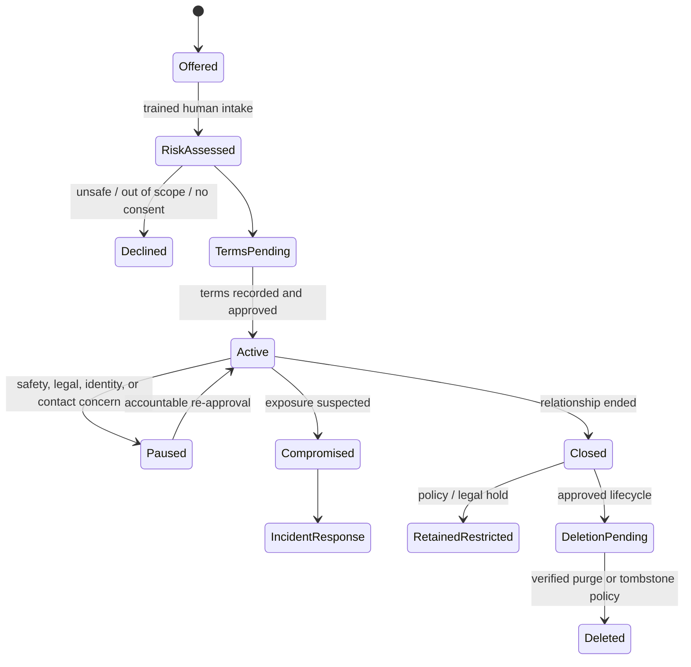
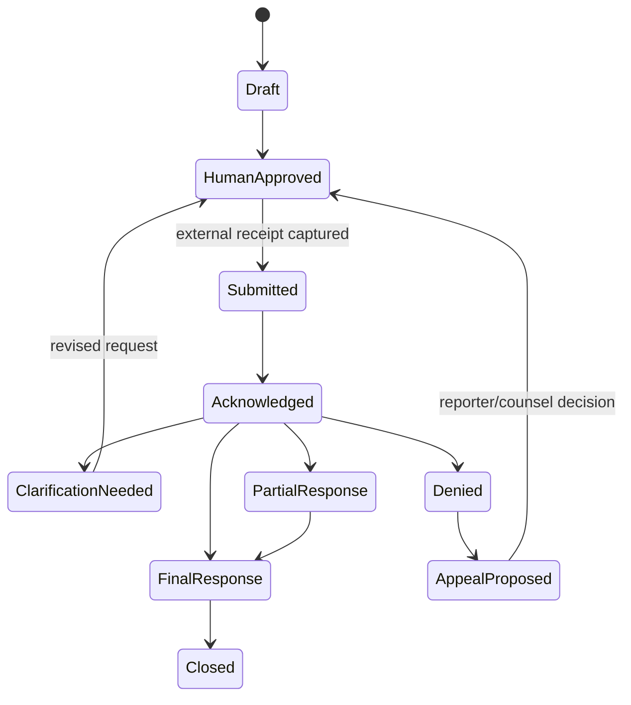

# Source Intake, Identity, Rights, and Compartmentation

## Core rule

Treat source identity as a high-impact secret and source statements as attributed evidence. They are related, but they do not belong in the same storage, model context, search index, telemetry, or export by default.

Pseudonymization reduces exposure; it does not make a source anonymous. Rare job titles, dates, document access, phrasing, locations, relationship graphs, and communication timing can re-identify a person even when a name is removed. NIST documents that de-identified information can sometimes be re-identified, and current ICO guidance likewise treats pseudonymization as a risk-reduction measure rather than anonymity ([NIST IR 8053](https://csrc.nist.gov/pubs/ir/8053/final), [ICO pseudonymisation guidance](https://ico.org.uk/for-organisations/uk-gdpr-guidance-and-resources/data-sharing/anonymisation/pseudonymisation/)).

## Human promises before system fields

Source terms are newsroom- and jurisdiction-specific. Words such as “off the record,” “background,” “deep background,” “not for attribution,” “embargo,” and “confidential” do not have one universal machine meaning.

The system should therefore store:

1. the exact terms agreed by the trained journalist and source;
2. the newsroom policy version used to interpret them;
3. who approved any exception;
4. when the agreement was confirmed or amended;
5. which content and time interval the terms cover;
6. a machine-enforceable disclosure profile derived by policy;
7. uncertainty or dispute rather than a guessed interpretation.

The agent may display or compare terms. It must not negotiate, promise, widen, narrow, or revoke them.

Reuters says source ground rules should be clear, prefers named sources, requires exceptional authorization for a single anonymous source, and treats source protection as paramount. AP requires anonymous material to be factual, vital, unavailable otherwise, from a reliable source with direct knowledge, and manager-vetted. These are strong but non-identical policies; encode the newsroom’s approved rule rather than inventing a universal “two-source rule” ([Reuters standards](https://reutersagency.com/about/standards-values/), [AP principles](https://www.ap.org/about/news-values-and-principles/telling-the-story/)).

## Source identity model

Use at least three separately authorized objects.

### 1. Identity vault record

```yaml
source_identity:
  identity_id: sid_7f2b                 # never exposed to the model plane
  matter_ids: [matter_204]
  legal_name: encrypted://vault/object
  contact_routes:
    - type: securedrop_codename
      value: encrypted://vault/contact/3
  verification:
    method: trained_reporter_in_person
    verified_by: principal://reporter/18
    verified_at: 2026-08-30T11:20:00Z
    limitations: Employer relationship not independently confirmed.
  risk_plan_ref: source-risk-plan/44
  retention_policy: src-high-risk/7
  legal_hold_state: none
  access_compartment: cmp_source_alpha
```

### 2. Blind source reference

```yaml
source_ref:
  source_ref: src_m204_A
  matter_id: matter_204
  source_class: human_confidential
  access_basis: direct_knowledge_claimed
  relationship_start: 2026-08-29
  disclosure_tier: editor_identity_only
  reliability_history: insufficient_observations
  motive_notes_ref: restricted-note/81
  identity_link: vault-only
```

This is the most the research plane normally sees. Do not encode initials, job title, organization, geography, or a stable cross-matter pseudonym into the token.

### 3. Statement record

```yaml
source_statement:
  statement_id: stmt_883
  matter_id: matter_204
  source_ref: src_m204_A
  captured_at: 2026-08-30T11:42:17Z
  capture_method: reporter_notes
  ground_rules_ref: gr_17
  original_language: hi
  content_ref: restricted-evidence://stmt_883/original
  approved_derivative_ref: evidence://ev_991/redacted_translation
  direct_knowledge_scope: claimed_for_event_window
  quotation_allowed: false
  paraphrase_allowed: human_review_required
  verification_status: identity_verified_statement_unverified
  supersedes: null
```

The identity vault, blind source register, and statement ledger have different encryption keys, operators, backup policies, and access logs.

## Source lifecycle



The model cannot cause a transition. It may propose `risk_signal`, `terms_conflict`, or `reidentification_risk` events for human review.

## Intake channels and boundaries

| Channel | Intended use | Agent access | Required controls |
|---|---|---|---|
| In-person / reporter notes | relationship and interview | approved derivative only | trained human, device/notes plan, consent and recording-law review |
| SecureDrop | anonymous or confidential digital submission | no direct login; exported derivative by trained staff | supported deployment, threat model, separate workstation, quarantine, metadata minimization |
| Encrypted messenger | ongoing source contact | normally none; reporter-mediated import | verified contact method, device/metadata risk review, no bot account in confidential chats |
| Email / ordinary upload | low-to-moderate sensitivity | quarantined import | phishing/malware controls, header preservation, explicit warning that channel may expose metadata |
| Phone / video interview | interviews | transcript derivative only | recording consent/law, vendor and retention review, identity verification |
| Public tip form | triage | bounded intake parser | rate limits, abuse controls, no confidentiality promise unless policy supports it |
| Public records portal | formal requests/releases | approved adapter | jurisdiction template, requester identity, fees, deadlines, versioned receipts |

SecureDrop is not a magic anonymity guarantee. Its official threat model lists nation-state, network, infrastructure, malware, user-error, seizure, correlation, and denial-of-service risks. Its journalist workflow deliberately separates an Internet-connected workstation from an air-gapped secure viewing station ([threat model](https://docs.securedrop.org/en/stable/threat_model/threat_model.html), [journalist guide](https://docs.securedrop.org/en/stable/journalist/journalist.html)). Integrate by organizational procedure, not by giving the agent SecureDrop credentials.

## Compartment design

### Recommended compartments

| Compartment | Contents | Default readers | Model access |
|---|---|---|---|
| `identity` | names, contacts, device/account details, verification material | designated source custodians | denied |
| `relationship` | exact ground rules, promises, safety plan, contact history | reporter + designated editor | denied except approved structured terms |
| `source-evidence` | original statements and submitted files | assigned reporter, approved specialists | isolated tool jobs; no public egress |
| `case-evidence` | approved redacted derivatives and blind source refs | matter team | bounded, least-privilege |
| `editor-review` | identity-free claim package plus justified disclosure tier | assigned editors | output only |
| `legal-review` | counsel-selected facts, exact wording, privileges and issues | counsel + named newsroom roles | no general retrieval |
| `public-package` | publishable sources and transparency material | newsroom system | no confidential residue |

Compartment membership comes from trusted identity and matter policy, never from a filename, source label, text instruction, or model classification.

### Prevent mosaic disclosure

Run a motivated-intruder-style review against each export:

- Does a job title plus meeting date identify the source?
- Does document access imply which employee had it?
- Do file paths, printer dots, comments, revision authors, EXIF, or unique typos expose origin?
- Can source A infer source B from the combined timeline?
- Can a search provider, translation vendor, model provider, telemetry backend, or cache correlate the material?
- Does a “summary” reproduce a distinctive phrase searchable on the public web?
- Do counts such as “three officials” accidentally reveal that one source was split into several records?

Redaction is a derived artifact and a human decision. Never overwrite the original, and never assume removal of direct identifiers makes the export safe.

## Ground-rules and rights contract

```yaml
ground_rules:
  ground_rules_id: gr_17
  source_ref: src_m204_A
  newsroom_policy: source-terms/2026-04
  exact_agreement_ref: restricted-evidence://agreement/17
  effective_from: 2026-08-30T11:20:00Z
  effective_until: null
  attribution:
    identity_publishable: false
    descriptor_requires_source_approval: true
    quotation: prohibited
    paraphrase: allowed_after_reporter_review
  content_scope:
    statement_ids: [stmt_883]
    attachment_ids: [ev_882, ev_883]
  embargo_until: null
  redistribution: case_team_only
  source_requests:
    - do_not_contact_employer
  newsroom_promises:
    - protect_identity_within_policy_and_law
  limitations_disclosed:
    - legal_protection_varies_by_jurisdiction
  approved_by: principal://editor/4
  version: 2
```

“Source rights” here includes recorded consent, attribution, quotation/paraphrase limits, embargo, redistribution, safety constraints, copyright/license information, and any newsroom promise. It does not imply that a source can pre-approve the story. Reuters distinguishes checking a quote or fact from allowing a source to vet copy ([Reuters standards](https://reutersagency.com/about/standards-values/)).

## Source verification without unsafe expansion

Verification asks whether the person or channel is who it claims to be and whether the stated basis of knowledge is plausible. It does not authorize surveillance.

Allowed, policy-bounded checks can include:

- a pre-arranged challenge phrase or out-of-band confirmation;
- authoritative organization directories or publicly provided contact information;
- reporter-observed credentials, with minimal retained detail;
- consistency with independently obtained records;
- confirmation by a designated editor who knows the identity;
- cryptographic message verification where the source already uses an established key and the newsroom understands its limitations.

Do not:

- run facial recognition or people-search tools to identify an anonymous tipster;
- seek leaked credentials, private accounts, precise location, family data, or device identifiers;
- contact an employer, colleague, or authority in a way that could expose the source without explicit human approval;
- treat a verified account as proof that the human controlling it is safe, truthful, or the original sender;
- let an LLM invent a verification question from secret biographical data.

CPJ recommends a source-specific risk assessment, a repeated verification method, compartmented devices where appropriate, and legal/policy research before promises; it also warns that encrypted communication still exposes metadata and endpoints can be compromised ([protecting confidential sources](https://cpj.org/2021/11/digital-physical-safety-protecting-confidential-sources/), [Digital Safety Kit](https://cpj.org/2019/07/digital-safety-kit-journalists/)).

## Independence and circularity

Two sources are not independent merely because they are two people or two URLs. Record possible dependency:

```yaml
source_relation:
  from: src_m204_B
  to: src_m204_A
  relation: may_have_received_same_internal_briefing
  evidence_refs: [ev_1201]
  confidence: moderate
  reviewed_by: principal://reporter/18
```

Dependency relations include:

- copied or syndicated report;
- common press release or talking points;
- shared witness, document, chat group, employer, counsel, funder, or campaign;
- one source repeating another;
- one primary record cited by several secondary accounts;
- model-generated content replicated across sites.

Corroboration logic should collapse dependent paths to the same origin and expose unresolved dependency.

## Public-record request state

Public-record laws, exemptions, deadlines, fees, appeal rights, and eligible bodies differ by jurisdiction. U.S. federal FOIA does not cover Congress, federal courts, state/local bodies, or private organizations; each agency has its own regulations. The Council of Europe Tromsø Convention establishes minimum access principles only for its parties and subject to its terms ([DOJ FOIA overview](https://www.justice.gov/oip/about-foia), [Tromsø Convention](https://www.coe.int/en/web/access-to-official-documents/home)).



Every submission or appeal is a human-approved external communication with a stable operation ID. The agent may draft from a jurisdiction-specific template and track dates; it does not determine the law, waive rights, or send without authority.

## Access, retention, and deletion

- Grant access by matter, compartment, role, purpose, and time.
- Require step-up authentication and visible reason for identity-vault access.
- Alert on unusual identity access, bulk export, cross-matter search, and after-hours retrieval according to policy.
- Keep identity access logs outside general observability and protect them from ordinary administrators where feasible.
- Make retention class explicit before intake; do not promise deletion the system cannot perform.
- Propagate approved deletion through derivatives, embeddings, summaries, caches, exports, backups according to policy, and retain a non-identifying tombstone if needed to prevent resurrection.
- Legal hold, subpoena response, compelled disclosure, and emergency source-risk decisions belong to counsel and newsroom leadership.

Source protection varies materially by jurisdiction. The RCFP Reporter’s Privilege Compendium documents variation across U.S. states and federal circuits; Council of Europe instruments provide a different regional framework. Never turn either into a global guarantee ([RCFP compendium](https://www.rcfp.org/reporters-privilege/), [Council of Europe source-protection materials](https://www.coe.int/en/web/freedom-expression/safety-of-journalists)).

## Failure and incident triggers

| Signal | Immediate control | Owner |
|---|---|---|
| Identity appears in model/trace/vendor payload | stop affected processing, quarantine logs, revoke tokens, preserve audit | security + source custodian |
| Blind token can be linked across matters | rotate mapping, invalidate exports/indexes, assess exposure | privacy/security |
| Ground rules conflict across records | pause use of statements; do not choose latest automatically | reporter/editor |
| Source channel may be compromised | stop contact through that channel; use pre-agreed response plan | reporter/security |
| Submitted file contains origin-revealing metadata | keep quarantined; create reviewed derivative | forensic reviewer/source custodian |
| Source requests deletion during hold or dispute | freeze automation and route to counsel | counsel + records owner |
| Agent proposes identifying an anonymous source | policy deny, security event, regression case | product/security |

## Acceptance checklist

- [ ] Identity, relationship terms, statements, and evidence are separate objects and compartments.
- [ ] Source tokens are matter-local, opaque, and non-identifying.
- [ ] Exact human-agreed terms and policy interpretation are both retained.
- [ ] SecureDrop is human-operated under its threat model; no agent receives credentials.
- [ ] Every export is checked for direct and mosaic re-identification.
- [ ] Source independence and possible circularity are explicit edges.
- [ ] Public-record requests use jurisdiction-specific templates and human-approved external effects.
- [ ] Identity access, retention, hold, deletion, and incident processes are testable.
- [ ] The system can operate public-only investigations with the identity vault completely disconnected.

