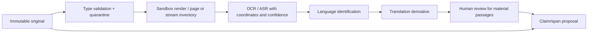
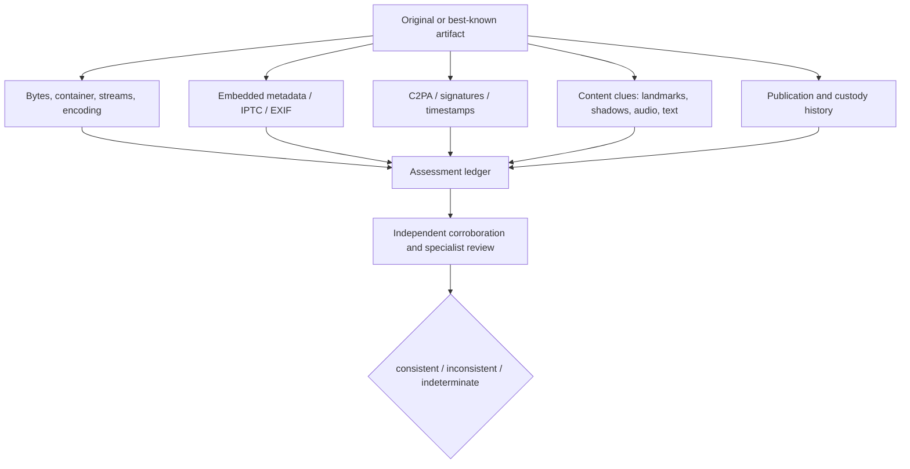

# Evidence Acquisition, Provenance, and Authenticity

## Five questions, not one “verified” flag

For each artifact, assess separately:

1. **Acquisition:** what bytes or representation were obtained, from where, when, by whom, under what authority and coverage?
2. **Integrity:** are these bytes unchanged since acquisition, and is each derivative reproducible?
3. **Origin/provenance:** what evidence connects the artifact or assertions to a creator, device, account, custodian, or publication history?
4. **Content authenticity:** is the media or document consistent with being what it purports to be, with what limitations?
5. **Context and factual support:** does it depict or establish the event, time, place, identity, and claim for which it is being used?

A cryptographic digest answers a narrow integrity question after acquisition. It does not prove who created the file or whether its content is true. C2PA likewise provides tamper-evident provenance assertions under a trust model, not a value judgment that content is factual ([C2PA 2.3 specification](https://spec.c2pa.org/specifications/specifications/2.3/specs/C2PA_Specification.html), [C2PA explainer](https://c2pa.org/specifications/specifications/2.2/explainer/Explainer.html)).

## Evidence object model

| Object | Example | Mutation rule |
|---|---|---|
| Acquired representation | downloaded PDF, HTTP response, original image, API response | immutable; new acquisition is a new object |
| Capture bundle | WARC/WACZ, request/response headers, screenshot, session notes | immutable; may be incomplete |
| Derived representation | OCR text, transcript, translation, extracted frame, normalized table | reproducible transform linked to inputs |
| Observation | “frame 381 contains a blue road sign” | versioned statement with locator and observer/tool |
| Authenticity assessment | C2PA valid under trust list X; metadata conflicts with caption | versioned assessment, never overwrites raw findings |
| Evidence edge | artifact/span supports, contradicts, limits, or contextualizes claim | append or supersede with reviewer and reason |
| Review artifact | montage, annotated image, timeline, source map | interpretation with complete lineage |

An artifact can be genuine yet misleading, altered for legitimate editorial reasons, or stripped of provenance by a platform. Absence of metadata or Content Credentials is `unknown`, not proof of fabrication.

## Acquisition receipt

```yaml
acquisition:
  acquisition_id: acq_441
  matter_id: matter_204
  operation_id: op_fetch_7d1
  collector: service://public-fetch/3
  authority:
    capability: public_https_get
    grant: grant_m204_public_4
  source:
    locator: https://agency.example/report.pdf
    source_class: official_publication
    platform_account_id: null
  request:
    method: GET
    requested_at: 2026-08-31T04:10:03Z
    redirect_chain_ref: artifact://headers/991
  response:
    completed_at: 2026-08-31T04:10:05Z
    status: 200
    media_type: application/pdf
    declared_length: 4812011
    truncated: false
  artifact:
    object_ref: raw://sha256/8ca...
    byte_length: 4812011
    sha256: 8ca...
  capture:
    tls_peer_summary_ref: receipt://tls/77
    archive_requested: true
    screenshot_ref: null
  limitations:
    - Live server content may change after capture.
  tool:
    name: acquisition-gateway
    version: 2.4.1
    policy_version: public-fetch/19
```

Preserve safe request details, response headers, redirects, content length, truncation, pagination, authentication class, tool build, and policy version. Credentials and source-identifying network data belong in protected references, not the general receipt.

## Public web and archive capture

### Minimum capture ladder

1. Save the response bytes and headers returned to the approved client.
2. Compute an organization-approved digest immediately and store bytes content-addressably.
3. Record canonical and requested URLs, redirects, retrieval time, client/tool version, access mode, and completeness.
4. Capture a standards-based web archive when the page and policy justify it.
5. Add a human-readable screenshot only as a derived rendering, not as the sole evidence.
6. Record archive-provider captures and Memento datetime negotiation separately from the newsroom’s own acquisition.
7. Re-fetch only as a new version; never replace the earlier representation.

WARC is an ISO-standardized web-archive container that can retain request, response, metadata, and related records. WACZ can package WARC data with indexes and a manifest. RFC 7089 defines Memento time negotiation. None guarantees complete capture of dynamic pages ([Library of Congress WARC description](https://www.loc.gov/preservation/digital/formats/fdd/fdd000236.shtml), [WACZ description](https://www.loc.gov/preservation/digital/formats/fdd/fdd000586.shtml), [RFC 7089](https://www.rfc-editor.org/rfc/rfc7089.html)).

### Archive drift and false precision

Record:

- archive provider and capture identifier;
- requested datetime, returned datetime, and the difference;
- original URI, replay URI, and embedded-resource capture times;
- missing resources, replay errors, crawler exclusions, login walls, client-side rendering, and platform transcoding;
- whether a page changed during the crawl;
- whether the archive exposes the exact bytes or only a rendered replay.

The Library of Congress notes that a site cannot be harvested instantly and dynamic content may change during capture; the resulting archive may never have existed as one simultaneous page. The UK Government Web Archive states that captures are representations, not full backups, and lists interactive and embedded content that may not work ([LOC archived-web quality](https://www.loc.gov/preservation/digital/formats/content/webarch_quality.shtml), [UK archive limitations](https://www.nationalarchives.gov.uk/webarchive/find-a-website/limitations/)).

## Public records and official data

An “official” source establishes that an institution published or released something. It does not make every assertion complete or correct.

For each records release preserve:

- request and appeal versions;
- acknowledgement, fee, extension, withholding, redaction, and final-response letters;
- production batch and item order;
- native filenames, folder structure, manifests, and record identifiers;
- redaction markings and stated exemptions without guessing hidden content;
- checksums supplied by the producer and independently computed digests;
- whether the release is certified, unofficial, draft, corrected, or superseded;
- scope gaps, missing attachments, corrupted files, and search methodology if disclosed.

Access regimes are jurisdiction-specific. The adapter may store deadlines and templates selected by a human; it must not infer entitlement or advise evasion. DOJ’s FOIA guide is a current U.S. federal reference and is updated on a rolling basis; UNESCO’s access-to-information monitoring shows broad international adoption with differing implementation and exemptions ([DOJ FOIA guide](https://www.justice.gov/oip/doj-guide-freedom-information-act-0), [UNESCO access-to-information laws](https://www.unesco.org/en/access-information-laws)).

## Social and platform evidence

Social content is volatile, copied, personalized, region-dependent, and frequently transcoded.

Capture, when authorized and permitted:

- platform name, account/page identifier, post ID, permalink, and retrieval method;
- displayed author, verification badge state, and profile fields as observations at capture time;
- published, edited, retrieved, and deleted/ unavailable times separately;
- text, media renditions, captions, replies/threads, quoted-post ancestry, and visible engagement counts with timestamps;
- API response pagination/coverage and fields omitted by the access tier;
- a rendered view only as supporting context;
- the earliest known version and downstream copies without treating them as independent.

Do not bypass login, rate, geographic, deleted-content, private-group, or access controls. Platform terms, APIs, fields, and retention change; pin adapter and schema versions. A post ID or badge is not proof of human identity. A screenshot is easy to fabricate and difficult to search or reprocess; seek a platform-native object, API record, archive, or independent capture.

## Document, OCR, transcription, and translation pipeline



Rules:

- verify file type from bytes; do not trust the extension;
- reject or isolate macros, scripts, external entities, embedded files, links, fonts, and decompression bombs;
- preserve page/frame/time coordinates for every extracted token;
- record engine, model/data pack, language, preprocessing, confidence, errors, and resource limits;
- never “correct” OCR in place; store a reviewed transcription as another derivative;
- keep original-language text next to translation and mark translator type and reviewer;
- material quotes require human review against the source and, when translated, explicit quotation policy;
- do not send source-protected material to a third-party OCR/translation service without approved data, retention, training, residency, and subpoena-risk review.

Tesseract supports multiple structured outputs and many languages, but its own documentation says input quality often must be improved. That supports treating OCR as a transform with error evidence, not authoritative text ([Tesseract repository](https://github.com/tesseract-ocr/tesseract)).

## Media authenticity workflow

Use a converging-evidence process rather than a detector verdict.



### Mechanical inspection

- use byte-identification, container parsers, and tools such as `ffprobe` in a sandbox;
- extract frames and audio without overwriting the input;
- preserve command/configuration, tool build, output, exit class, and hashes;
- treat timestamps, codec tags, EXIF, and editing-software fields as assertions that may be absent, rewritten, inconsistent, or forged;
- compare multiple renditions and locate transcoding boundaries.

`ffprobe` can expose container, stream, frame, packet, and timecode information in machine-readable formats; it does not interpret whether the recorded event is truthful ([official ffprobe documentation](https://ffmpeg.org/ffprobe.html)). IPTC photo metadata standardizes descriptive, administrative, rights, and digital-source fields, but metadata remains one evidence channel ([IPTC Photo Metadata Standard](https://iptc.org/standards/photo-metadata/iptc-standard/)).

### C2PA handling

Persist:

- artifact digest and manifest-store location;
- validator and C2PA specification version;
- well-formed, valid, trusted, and asset-binding statuses separately;
- trust-list name/version, signer chain summary, revocation and timestamp results;
- assertions and ingredients as untrusted claims until contextual review;
- missing, redacted, orphaned, inaccessible, recovered soft-binding, or unknown-provenance statuses;
- validator raw result and human interpretation.

C2PA 2.3, released December 2025, added further asset support and validation/version declarations. Refresh against the current specification and validator releases before deployment. A valid trusted credential can attest that a known signer made tamper-evident assertions; it cannot prove that a staged scene depicts reality. Credentials can also be absent or removed ([C2PA 2.3 version history](https://spec.c2pa.org/specifications/specifications/2.3/specs/C2PA_Specification.html), [C2PA implementation guidance](https://spec.c2pa.org/specifications/specifications/2.3/guidance/Guidance.html)).

### Synthetic-media detectors

Treat detector output as experimental forensic evidence:

```yaml
detector_result:
  detector_id: synthetic-image-detector/X
  model_version: digest:...
  input_artifact: raw://sha256/...
  preprocessing_version: prep/4
  output_score: 0.83
  calibrated_for:
    media_types: [face_image]
    distributions: [benchmark_A]
  out_of_distribution_signals: [platform_reencoded, unknown_generator]
  threshold_version: threshold/7
  conclusion: indeterminate
```

Never map a score directly to “fake” or “real.” Test cross-generator, cross-dataset, demographic, compression, crop, screenshot, adversarial, and ordinary edit conditions. NIST highlights the gap between research accuracy and real-world usability, generalization, post-processing, and anti-forensics. DF40 reports that limited forgery diversity and evaluation protocols can mask generalization problems ([NIST Forensics Deepfake Evaluation](https://www.nist.gov/programs-projects/guardians-forensic-evidence), [DF40 paper](https://proceedings.neurips.cc/paper_files/paper/2024/file/34239f60eca7ce9bee5280aaf81362d8-Paper-Datasets_and_Benchmarks_Track.pdf)).

## Open-source verification

The Berkeley Protocol provides a useful professional baseline for identifying, collecting, preserving, verifying, and analyzing digital open-source information. It warns that platforms strip/transcode metadata, circular reporting and decontextualization affect content analysis, and human-feature identification can require trained experts ([Berkeley Protocol](https://humanrights.berkeley.edu/wp-content/uploads/2024/02/Berkeley-Protocol.pdf)).

For a visual item, test at least:

- earliest discoverable publication and origin claims;
- location through independent, non-sensitive landmarks and geospatial sources;
- time through sun/weather/event/traffic evidence with declared resolution and provider history;
- objects, insignia, language, signage, and known versions;
- audio continuity, waveform/spectrum clues, and independently confirmed speakers;
- reverse-image/keyframe matches and older reuse;
- alternative explanations, including legitimate editing, parody, simulation, miscaptioning, or wrong date/place.

Do not use face, gait, voice, license-plate, or other biometric identification unless newsroom policy, law, proportionality, specialist competence, and human approval explicitly allow it. A model resemblance judgment is not identification.

## Evidence and provenance schema

```yaml
evidence_item:
  evidence_id: ev_991
  matter_id: matter_204
  class: acquired_representation
  sensitivity: newsroom_confidential
  source_ref: src_m204_A
  acquired_by: principal://reporter/18
  acquired_at: 2026-08-30T11:42:17Z
  acquisition_ref: acq_441
  object_ref: raw://sha256/8ca...
  digest: {algorithm: sha256, value: 8ca...}
  format: application/pdf
  coverage:
    pages_expected: 84
    pages_present: 81
    truncation: suspected
  derived_from: null
  transformations: []
  access_compartment: cmp_source_alpha
  rights_ref: rights_72
  authenticity_assessments: [auth_55]
  integrity_state: verified_since_acquisition
  retention_policy: src-high-risk/7
```

Provenance can be mapped to W3C PROV entities, activities, and agents for interchange, but the application still needs matter, source, sensitivity, authority, and review semantics ([W3C PROV overview](https://www.w3.org/TR/prov-overview/)).

## Tool and integration decisions

| Capability | MVP choice | Production constraint | Do not claim |
|---|---|---|---|
| Public web | restricted HTTPS fetcher + browser capture when needed | SSRF defense, terms/rate policy, immutable response, rendering isolation | complete page or stable live state |
| Archives | query provider + own WARC/WACZ capture | capture-time mismatch, missing dynamic resources, provider independence | archived snapshot is complete truth |
| Social | official API/export where available; manual approved capture otherwise | account/post IDs, versioned fields, deletion/coverage, no bypass | badge/account proves speaker identity |
| Public records | registry + portal/email adapters | jurisdiction templates, human-approved submissions, batch manifests | legal right or complete production |
| Document/OCR | offline sandbox first | coordinates, confidence, language packs, reviewed material fields | extracted text equals original |
| Translation | approved local/provider adapter | original retained, confidentiality review, human review of material wording | translated quote is exact without review |
| Media inspection | offline parsers, frames, metadata, C2PA validator | pinned tools, safe inputs, raw outputs, specialist escalation | detector/metadata proves real or fake |
| SecureDrop | no direct agent integration | trained human export from supported environment | anonymity or security guarantee |
| Newsroom/legal | package exchange only | audience redaction, digest, approval and receipt | approval or publication from API availability |
| Third party | capability-specific adapter | contract, auth, terms, data use, residency, retention, rate, schema, incident plan | vendor score is ground truth |

## Failure matrix

| Failure | Detection | Safe state | Recovery |
|---|---|---|---|
| Fetch changed during capture | inconsistent resources/timestamps | retain partial capture with limitation | new acquisition; compare versions |
| Archive replay differs by provider | digest/resource mismatch | preserve each provider view | locate primary bytes or independent captures |
| OCR silently drops pages | page inventory mismatch | derivative invalid for full-text claims | re-render/OCR; human check missing pages |
| Translation changes allegation strength | bilingual review discrepancy | affected claim blocked | revised translation and claim wording |
| Parser crashes on hostile file | sandbox alert/resource limit | raw quarantined, no preview in control plane | specialist process or reject |
| C2PA validates forged scene history | contextual evidence conflicts | provenance result retained; authenticity unresolved | corroborate origin/event; specialist review |
| Detector false positive after recompression | distribution/perturbation test fails | no binary verdict | report calibrated limitation; other methods |
| Hash stored after bytes were transformed | acquisition workflow mismatch | custody indeterminate | reacquire original; document gap |
| Third-party API returns partial page | pagination/coverage contract fails | result incomplete | resume from cursor or alternate source |

## Acceptance checklist

- [ ] Acquisition, integrity, provenance, content authenticity, context, and claim support are separate fields.
- [ ] Raw bytes never change; every derivative has complete transform lineage.
- [ ] Web captures record dynamic/archive limitations and capture-time differences.
- [ ] Social captures retain platform identity, version, coverage, and ancestry without claiming account identity proof.
- [ ] OCR, transcription, and translation retain coordinates, versions, confidence, original text, and material human review.
- [ ] Metadata and C2PA assertions are treated as evidence, not truth guarantees.
- [ ] Synthetic-media detector use is calibrated, distribution-aware, reproducible, and never a binary release gate alone.
- [ ] Hostile formats cannot execute in the orchestrator or general reporter workstation.
- [ ] Third-party data flows are approved by sensitivity and contract, not chosen by model convenience.

