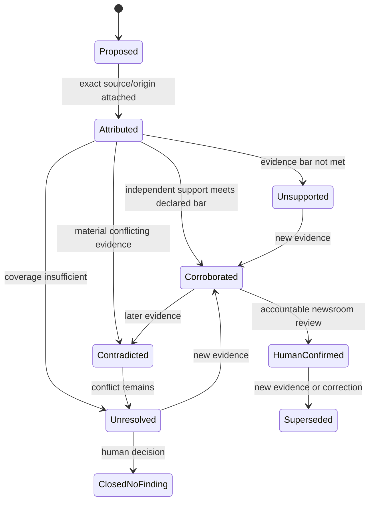
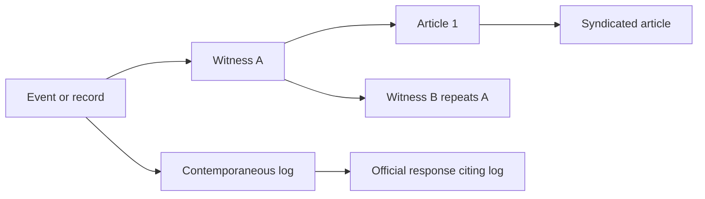

# Claims, Contradictions, Entities, and Timelines

## The claim graph is the editorial reasoning substrate

A story draft is a lossy projection. The durable substrate should contain attributed propositions, evidence spans, entity hypotheses, temporal intervals, contradictions, and human decisions. Drafts can then change without erasing how the newsroom knew—or did not know—each material statement.

## Epistemic types

Every material statement has exactly one primary type at a given version:

| Type | Required fields | Allowed transition |
|---|---|---|
| `allegation` | exact proposition, origin, target, attribution, contested status | may be corroborated, contradicted, withdrawn, or remain unresolved; never silently becomes fact |
| `source_statement` | source ref, statement artifact/span, ground rules, direct-knowledge claim | may support an allegation/fact; remains what the source said |
| `observation` | observer/tool, artifact locator, method, time, limitations | may be reproduced, rejected, or superseded |
| `authentic_artifact` | precise origin/integrity/authenticity bar and assessment | may support content/context claims; does not self-authenticate embedded assertions |
| `corroborated_fact` | narrow fact, evidence bars, independent paths, contradictions, reviewer | may be superseded or corrected by later evidence |
| `inference` | premises, assumptions, alternatives, reasoning method, uncertainty | requires editorial review before external wording |
| `editorial_conclusion` | accountable human decision, approved wording, supporting facts | human-owned only |
| `publication_effect` | story/revision, operation ID, channel, receipt, visible status | observed external state, not model output |

Use `context`, `definition`, and `procedure` as supporting record types if useful, but do not let them blur the eight primary categories.

## Claim record

```yaml
claim:
  claim_id: clm_204
  matter_id: matter_204
  version: 4
  type: corroborated_fact
  proposition: The procurement committee met on 2026-04-18.
  subject_refs: [ent_committee_7]
  predicate: held_meeting
  object_refs: []
  time:
    earliest: 2026-04-18T09:00:00+05:30
    latest: 2026-04-18T12:00:00+05:30
    precision: date_confirmed_time_interval
    timezone_source: meeting_notice
  attribution: newsroom_corroboration
  evidence_edges:
    supports: [edge_71, edge_72]
    contradicts: [edge_88]
    limits: [edge_91]
  independence_set: indep_12
  evidence_bar: newsroom/factual-central/5
  status: human_confirmed
  uncertainty:
    level: moderate
    rationale: Attendance list remains incomplete.
  gaps:
    - Whether all named attendees were present.
  author:
    type: agent_proposal
    run_id: run_44
  confirmed_by: principal://reporter/18
  supersedes: clm_204_v3
```

Do not store only `confidence: 0.91`. Confidence is not status, evidence quality, source independence, or authority.

## Claim lifecycle



`HumanConfirmed` means the newsroom accepted the narrow evidence classification, not that the claim is legally safe or publishable. Legal/editorial approval is a separate record.

## Evidence edges

```yaml
evidence_edge:
  edge_id: edge_71
  claim_id: clm_204
  evidence_id: ev_minutes_14
  locator:
    type: page_region
    page: 3
    bbox: [0.12, 0.31, 0.78, 0.47]
    text_hash: sha256:...
  relation: supports
  support_scope: establishes_scheduled_date_and_attendees_list
  does_not_establish:
    - every listed person attended
    - decisions were made as described elsewhere
  origin_path: origin_meeting_records
  evaluator:
    type: human
    principal: principal://reporter/18
  created_at: 2026-08-31T05:22:00Z
```

Relations should include at least `supports`, `contradicts`, `limits`, `contextualizes`, `defines`, `quotes`, and `derived_from`. A topical source is not automatically supporting evidence.

## Source and evidence independence

Corroboration requires independent paths to the underlying event or fact. Represent an origin graph:



The graph above contains at most two potentially independent origin paths (`W1` and `D`), not five sources. `W2`, `A1`, and `A2` inherit from `W1`; `R` may inherit from `D`. The system should propose dependency edges and make uncertain independence visible to the reporter.

An independence set records:

- origin path ID;
- evidence creator/custodian;
- whether the path is contemporaneous;
- possible shared briefing, document, witness, employer, counsel, or platform ancestry;
- whether sources had an opportunity to coordinate;
- whether the evidence was generated by the same automated or model system;
- reviewer decision and residual uncertainty.

Do not count “two models agreed,” “two search engines returned it,” or “two sites copied it” as corroboration.

## Contradiction ledger

Contradictions are durable objects, not prompt instructions to choose a winner.

```yaml
contradiction:
  contradiction_id: con_55
  matter_id: matter_204
  proposition_a: clm_204_v4
  proposition_b: clm_319_v2
  class: temporal_conflict
  materiality: central
  possible_explanations:
    - different meeting sessions
    - timezone conversion error
    - one record created retrospectively
    - one source is mistaken
  discriminating_questions:
    - Obtain the room-access log for 09:00–13:00 local time.
    - Confirm the timezone encoded in the calendar export.
  status: open
  disposition: null
  reviewer: principal://reporter/18
```

### Contradiction classes

| Class | Example | Typical next step |
|---|---|---|
| direct factual | one source says paid; ledger says unpaid | inspect definitions, time, scope, and authoritative records |
| temporal | dates differ | normalize clocks and effective/version times |
| entity | same name may refer to two people | block merge and seek stable identifiers/context |
| scope/definition | “employees” excludes contractors in one dataset | record definition and denominator |
| version | revised report conflicts with cached copy | preserve both and supersession history |
| translation/OCR | negation or number differs | inspect original and reviewed derivative |
| source dependency | “independent” accounts share origin | collapse paths; lower corroboration |
| provenance/context | genuine image has false caption | keep authenticity and contextual claim separate |
| omission | record set lacks expected attachment | record coverage gap; do not infer content |

Possible dispositions are `resolved_a`, `resolved_b`, `scope_split`, `version_supersession`, `both_can_be_true`, `source_dependency_found`, `unresolved`, and `editorial_exclusion`. Every disposition keeps the original conflict and reason.

## Entity resolution

Entity resolution is a proposal-and-review workflow, not an automatic cleanup step.

```yaml
entity:
  entity_id: ent_person_44
  matter_id: matter_204
  type: person
  canonical_label: Restricted Person 44
  labels:
    - value: A. Kumar
      source: ev_81
    - value: Amit K.
      source: ev_99
  identifiers:
    - type: official_registry_id
      value_ref: restricted://identifier/71
      source: ev_registry_4
  merge_status: provisional
  candidates: [ent_person_57]
  disambiguators:
    - employer_at_effective_time
    - city
  sensitivity: personal_sensitive
  reviewed_by: null
```

Rules:

- scope IDs by matter/tenant even if the label is public;
- retain every observed alias and source;
- distinguish a person from an account, organization role, device, address, company, and legal entity;
- represent role membership with effective time;
- never use source identity tokens as public entity IDs;
- require review before a merge affects a material claim;
- support split/undo without rewriting history;
- avoid biometric or protected-trait inference unless explicitly authorized and specialist-reviewed;
- expose ambiguity in packages instead of selecting the most famous match.

## Timeline model

Investigations contain multiple clocks:

- event time;
- document creation and effective time;
- recording/capture time;
- platform publication and edit time;
- archive capture time;
- newsroom acquisition time;
- source statement time;
- analysis and review time;
- story publication/correction time.

```yaml
timeline_event:
  timeline_id: tl_901
  matter_id: matter_204
  event_type: meeting
  entity_refs: [ent_committee_7]
  time:
    earliest: 2026-04-18T09:00:00+05:30
    latest: 2026-04-18T12:00:00+05:30
    precision: three_hour_interval
    timezone: Asia/Kolkata
    timezone_basis: explicit_in_notice
    clock_quality: unknown
  observed_at: 2026-08-31T05:22:00Z
  evidence_refs: [ev_minutes_14, ev_calendar_7]
  ordering_basis: explicit_start_time
  causal_links: []
  uncertainty_notes:
    - Minutes were signed three weeks after the meeting.
```

Do not infer causal order from arrival order or timestamps with incompatible precision. “Published before” is not “caused.” Represent uncertain times as intervals and record calendar/version assumptions. Date-only records must not gain invented midnight timestamps.

## Claims across time

Every claim needs:

- `asserted_at`: when the source or newsroom asserted it;
- `observed_at`: when the evidence was inspected;
- `effective_from` / `effective_until`: when the proposition applies;
- `source_version`: which record or page version supports it;
- `reviewed_at`: when a human accepted its state;
- `fresh_until` or refresh trigger when volatility matters.

A statement can be correct for one effective period and stale later. Supersession does not imply that the earlier version was an error.

## Worked example: from allegation to package

```text
Allegation A:
  “Vendor X received the award before bids closed.”

Source statement S1:
  Confidential source says the result was communicated on April 17.

Observations O1/O2:
  O1: procurement portal shows bids closed April 18 17:00 local.
  O2: email artifact contains “approved” and an April 17 header.

Authenticity assessment AA1:
  Email bytes are stable since acquisition; sender identity and server origin remain unresolved.

Contradicting evidence E3:
  Signed award notice is dated April 22, but does not establish when the decision was made.

Corroborated fact F1:
  Bid submission remained open on the public portal until April 18 17:00 local.

Inference I1:
  The April 17 message may indicate a pre-close decision, but “approved” could refer to an internal draft.

Editorial conclusion EC1:
  Human editor decides whether the evidence supports describing the process as predetermined.
```

The agent may propose A, O, F, and I records with citations. It cannot generate EC1 as a fact.

## Claim-to-draft rule

Do not draft from raw retrieved text. Draft from an intermediate form:

```yaml
draft_statement:
  text: Records show the bidding portal remained open until 5 p.m. on April 18.
  claim_ids: [clm_F1]
  evidence_edges: [edge_portal_capture, edge_archive_capture]
  epistemic_type: corroborated_fact
  attribution_rendering: newsroom_records_show
  materiality: central
  wording_constraints:
    - Do not say that no bid could be accepted after this time.
  freshness_checked_at: 2026-08-31T07:10:00Z
```

The renderer checks that every material factual sentence maps to permitted claim states. Editorial conclusions and allegations require human-owned labels and attribution.

## Completion and abstention

A claim branch is complete only when one of these is durable:

- evidence bar met and human confirmed;
- contradicted with reviewed disposition;
- unresolved with explicit gap and consequence;
- excluded by human editorial decision;
- no longer material because the story scope changed;
- work stopped for safety, authority, cost, deadline, or access limits.

“Could not find evidence” means only that the declared search coverage did not find it. It is not proof of absence.

## Acceptance checklist

- [ ] Every material statement has one explicit epistemic type.
- [ ] Allegations and source statements retain attribution even when corroborated.
- [ ] Evidence edges identify exact spans and what they do not establish.
- [ ] Corroboration collapses circular or shared-origin paths.
- [ ] Contradictions survive resolution and include alternatives/discriminating tests.
- [ ] Entity merges are reversible, sourced, time-aware, and reviewed when material.
- [ ] Timeline events preserve multiple clocks, precision, zone, and uncertainty.
- [ ] Claims carry effective/version/freshness time, not only creation time.
- [ ] Drafts render from claim IDs; raw retrieved text cannot bypass the ledger.
- [ ] Unknown and unresolved are safe terminal outcomes.

## Related guides

- [Evidence, citations, and verification](../deep-research-agent/evidence-citations-and-verification.md)
- [Agent state and event contracts](../../runtime/agent-state-and-event-contracts.md)
- [Tool results, artifacts, and provenance](../../tools/tool-results-artifacts-and-provenance.md)

