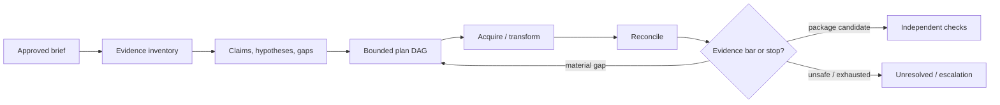

# Research Loop, Tools, Context, and Memory

## One bounded loop, not an autonomous newsroom

The first useful loop makes one decision at a time from durable case state:

```text
load approved matter projection
-> identify highest-value unresolved gap
-> propose one or a small bounded set of authorized actions
-> validate policy, compartment, target, schema, budget, and duplication
-> execute deterministic tool jobs
-> append receipts/evidence/claim proposals
-> reconcile coverage and stop conditions
```

The controller—not the model—owns repetition, limits, terminal outcomes, and whether an action is safe to execute.

## Loop contract

```yaml
research_decision:
  decision_id: dec_772
  matter_id: matter_204
  case_version: 41
  objective: Resolve the date conflict for meeting tl_901.
  proposed_actions:
    - type: search_public_records
      capability: records.read
      query: exact meeting identifier
      jurisdiction_profile: profile_18
      expected_discriminator: contemporaneous notice or access log
      max_results: 20
  expected_information_gain: distinguishes two date hypotheses
  claim_ids: [clm_204, clm_319]
  source_compartments: [public]
  stop_after: one_tool_result
```

Reject proposals that lack a gap, expected discriminating value, approved capability, target, bound, or stop condition.

## Planning strategy

Use a versioned plan with fixed phases and adaptive tasks:



Plan tasks include:

- target claim/gap and why it is material;
- approved tool and compartment;
- query/input object, time range, and expected coverage;
- dependencies and resource locks;
- budget reservation and deadline;
- success, no-result, truncation, and failure semantics;
- cancellation and cleanup;
- completion evidence.

Replan only on new evidence, contradiction, coverage failure, source safety, tool unavailability, changed scope, reviewer request, or budget/deadline pressure. Do not replan merely because the model wants a different path.

## Tool catalog decisions

| Tool family | Model may choose | Deterministic gateway must own | Default effect class |
|---|---|---|---|
| Public-record search | approved jurisdiction/index/query templates | access rules, identifiers, pagination, coverage, rate limits | read |
| Records request/appeal | draft from approved template | recipient, requester identity, legal text, fees, sending, receipt | external communication; human approval |
| Web search/fetch | query and approved public URL | SSRF/redirect/DNS policy, terms/rate limits, capture, byte limits | read |
| Browser capture | navigation goal on approved public origin | isolated session, downloads, popups, auth, screenshot/WARC receipt | read; no form submission by default |
| Archive lookup/capture | target URI/date | provider adapters, Memento semantics, archive limitations | read / approved archive request |
| Social platform | search/query over allowed fields | official API/session policy, pagination, deletion/coverage, terms | read |
| Document parser | choose registered extraction profile | sandbox, resource limits, output locators, raw retention | derived artifact |
| OCR/ASR | select language/profile from allowed set | engine/model version, coordinates, confidence, quotas | derived artifact |
| Translation | request language pair and passages | data-routing policy, provider, original alignment, review flag | derived artifact |
| Media inspection | request metadata, frames, waveform, C2PA validation | offline isolation, tool chain, raw output, no verdict mapping | derived assessment |
| SecureDrop | none | trained human workflow outside agent plane | denied |
| Source messaging/interview | draft questions only if requested | identity, channel, send, timing, consent, receipt | denied to model; human effect |
| Newsroom/DAM/CMS | read approved matter metadata; export draft package | identity, permissions, version, publication/correction effect | package write only; no publish |
| Legal review system | create approved package reference | privilege/matter boundary, recipients, comments, decision | human workflow |
| Third-party enrichment | select approved capability | contract, data class, egress, credentials, quotas, version | read/derived only |

### Example tool contract

```json
{
  "name": "archive.lookup",
  "description": "Find retained public captures for one approved URI and bounded datetime interval; returns coverage and capture identifiers, not an authenticity verdict.",
  "input": {
    "operation_id": "op_...",
    "matter_id": "matter_204",
    "uri": "https://example.org/page",
    "from": "2026-04-17T00:00:00Z",
    "to": "2026-04-19T00:00:00Z",
    "providers": ["approved-provider-a"],
    "max_captures": 20
  },
  "result": {
    "status": "complete|partial|not_found|blocked|failed",
    "captures": [{"capture_id": "...", "captured_at": "...", "receipt_ref": "..."}],
    "coverage": {"providers_queried": 1, "truncated": false},
    "artifact_refs": [],
    "cost": {"requests": 1},
    "limitations": []
  }
}
```

Tool output is compact model context plus durable artifact references. Follow the repository’s [tool contract](../../tools/tool-contracts.md) and [artifact/provenance](../../tools/tool-results-artifacts-and-provenance.md) guidance.

## Tool admission and egress taint

Before execution:

1. validate the closed schema and unknown fields;
2. load matter/tenant/principal from trusted runtime context;
3. verify tool capability, target, compartment, data class, and purpose;
4. detect duplicate/overlapping operation and reserve budget atomically;
5. block confidential or privileged data from arbitrary public egress;
6. require fresh approval for external communication or package export;
7. assign timeout, retry class, result limit, and cleanup behavior;
8. create a stable operation/effect ID.

Untrusted content cannot introduce a URL, recipient, tool, credential, or instruction that escapes these checks.

## Context compiler

Compile a fresh, typed projection for each decision. Use lanes in this order:

1. **Authority and invariants:** approved scope, prohibited methods, tool grant, compartment, human-owned decisions.
2. **Current task:** one gap/claim and completion criterion.
3. **Verified state:** case version, budgets, leases, pending effects, reviewer decisions.
4. **Evidence:** exact bounded excerpts with trust, origin, locator, and limitations.
5. **Contradictions and alternatives:** never omit evidence only because it weakens the working hypothesis.
6. **Entity/timeline slice:** IDs, alias uncertainty, time precision, and effective versions.
7. **Recent interaction:** only decisions/corrections needed for continuity.
8. **Working notes:** explicitly non-authoritative and disposable.

```yaml
context_manifest:
  matter_id: matter_204
  case_version: 41
  decision: resolve_date_conflict
  authority:
    profile: journalism-public-read/3
    prohibited: [contact_source, identify_anonymous_source, publish, bypass_access]
  compartment: public_case_evidence
  claims: [clm_204_v4, clm_319_v2]
  contradictions: [con_55]
  evidence:
    - evidence_id: ev_minutes_14
      excerpt_ref: excerpt://ev_minutes_14/page3/region2
      trust: official_record_unverified_content
      limitations: [signed_three_weeks_later]
  omissions:
    - Confidential source identity and contact history excluded.
    - Full 84-page PDF excluded; selected regions listed above.
  budgets:
    tool_calls_remaining: 6
    tokens_remaining: 24000
    deadline_at: 2026-08-31T08:00:00Z
  compiler:
    version: context-journalism/8
    digest: sha256:...
```

The manifest makes absence inspectable. The model never receives a silent “top-k” bag.

## Lossy compaction with a preservation contract

Context compaction is allowed; evidence compaction is not.

Preserve outside the prompt:

- matter brief/revisions, policy, authority, compartments, and prohibited methods;
- source refs and exact ground-rule references without secret identity;
- raw/derived evidence IDs, digests, locators, access and transformation history;
- material claims and their epistemic types/states;
- supporting, contradicting, limiting edges and origin/independence paths;
- entity ambiguity, timeline precision, clocks, and unresolved alternatives;
- completed and pending tasks, budget counters, approvals, external effects, and unknown outcomes;
- explicit reviewer corrections and stop/escalation conditions.

```yaml
compaction_receipt:
  receipt_version: journalism-continuity/2
  receipt_id: cmp_204_91
  matter_id: matter_204
  story_id: story_88
  tenant_id: newsroom_7
  compartment: public_case_evidence
  matter_state_version: 17
  from_context: ctx_90
  to_context: ctx_91
  source_event_high_watermark:
    public_acquisition_event: 622
    source_vault_event: vault_event_117 # opaque; payload remains outside this plane
    custody_event: custody_event_934
    review_event: review_event_51
  retained_ids:
    claims: [clm_204_v4, clm_319_v2]
    contradictions: [con_55]
    evidence: [ev_minutes_14, ev_calendar_7]
    timeline_events: [evt_meeting_17_v3]
    requests: [req_foia_12_v2]
  rights_and_custody:
    rights_profile_versions: [rights-public-records/7]
    custody_head: sha256:...
    retention_hold_refs: []
  authority_and_behavior:
    policy_version: newsroom-investigations/42
    tool_registry_version: tools/31
    model_route_version: model-policy/18
    prompt_version: prompt-set/24
    context_compiler_version: context-journalism/8
  approvals_and_deadlines:
    active_approval_ids: [approval_reporter_72]
    invalidated_approval_ids: [approval_editor_68]
    deadline_at: 2026-08-31T08:00:00Z
  active_clocks:
    - {clock_id: editorial_deadline, due_at: 2026-08-31T08:00:00Z, owner: reporter}
  effects:
    pending: [effect_records_request_12]
    unknown: []
    last_reconciliation_at: 2026-08-31T06:20:00Z
  pending_effect_ids: [effect_records_request_12]
  unknown_effect_ids: []
  source_protection_invariants:
    identity_vault_excluded: true
    direct_identifiers_excluded: true
    rare_descriptor_review_required: true
    no_external_contact_or_publish_capability: true
  known_losses:
    - discarded: full_document_text
      rebuild_from: [ev_minutes_14]
    - discarded: low_materiality_working_notes
      rebuild_from: null
  next_safe_action: request_reporter_review
  omitted_items: [full_text, identity_vault, low_materiality_claims]
  deterministic_checks:
    authority_preserved: true
    material_contradictions_preserved: true
    high_watermarks_not_regressed: true
    custody_chain_continuous: true
    approvals_revalidated: true
    pending_and_unknown_effects_preserved: true
    budgets_match_store: true
  compactor_version: compactor-journalism/3
  invariant_hash: sha256:...
  receipt_digest: sha256:...
```

Never summarize a hostile document into an apparently trusted instruction. Preserve trust and origin labels through every derivative. Use [compaction and continuity](../../context-memory/compaction-and-continuity.md) for the generic recovery contract.

## Exactly seven memory lifetimes

These are the only memory lifetimes in the acting system. A source-identity vault is a separate governed system of record, not an eighth model memory. Human-published procedures live inside versioned domain knowledge, not self-learned procedural memory.

| Memory lifetime | Use | Reject | Retention, correction, and deletion | Poisoning test |
|---|---|---|---|---|
| **Turn/scratch memory** | Disposable calculation for one bounded decision; evidence excerpts are locator-backed | Source identity, credentials, approvals, facts without ledger IDs, or a future action queue | Destroy after the decision; correction means recompile from authoritative state | Hostile text asks to reveal a source or add a tool; policy and tool set remain unchanged |
| **Working/run memory** | Current gaps, hypotheses, task IDs, claim/version refs, budgets, leases, and stop condition | Raw vault records, unbounded document dumps, or model notes promoted to facts | Ends with the run; resume is rebuilt from the durable ledger; deletion follows matter policy | Repeated summaries cannot remove a material contradiction, pending effect, or budget |
| **Session memory** | Minimal interaction continuity such as the reporter's current view and already-answered UI question | Authority, ground rules, source secrets, case truth, or an external-effect receipt | Short TTL; user can clear it; a correction is stored durably and the session is regenerated | A reviewer comment cannot grant a new capability or persist a claim |
| **Durable workflow/task memory** | Matter/story/source blind refs, evidence/custody, claims, timelines, requests, approvals, effects, packages, publications, and corrections | Hidden chain-of-thought, unverifiable model assertions, or direct source identity outside its approved vault reference | Versioned append/supersede; retention, hold, erasure, tombstone, and derivative invalidation are explicit | Delete/expire an item and prove checkpoints, indexes, caches, packages, and pending work cannot resurrect it |
| **Domain knowledge memory** | Reviewed newsroom policy, jurisdiction profiles, verification methods, schemas, tool registry, and human-published procedures | Case rumors, a provider's marketing claim, or a tactic learned from one successful run | Release/effective dates, owner, source, review cadence, withdrawal and rollback; never silently rewritten | Poisoned retrieved guidance loses to the pinned active policy and is reported as a conflict |
| **Long-term/preference memory** | Optional accessibility, display, and notification preferences that cannot change authority or evidence | Source relationship/identity, political profile, investigation interests, hidden personalization, or publication posture | Disabled by default; explicit consent and purpose; inspect/correct/delete independently | A preference cannot change source disclosure, evidence threshold, recipient, or retention |
| **Episodic/outcome memory** | Human-curated, de-identified incidents, corrections, false leads, and successful recovery examples for evaluation | Raw matters, source material, unexplained editor rewrites, or automatic self-improvement | Admit only through sensitive review; attach provenance, license, expiry, correction, deletion, and affected-eval propagation | A malicious outcome cannot enter prompts/release gates before provenance, de-identification, and reviewer approval |

An embedding index is a derived projection. Authorize matter/compartment before retrieval, propagate deletion, and prevent equal content hashes from granting cross-matter access. Cross-matter relationship continuity, if required, stays in a human-governed identity vault and is never semantically retrieved into an unrelated matter. See [memory architecture](../../context-memory/memory-architecture.md).

## Multi-agent and parallelism decision

Default to one controller. Add bounded workers only for independently scoped work such as:

- separate public-record productions;
- independent language translation with controlled merge;
- image frame extraction versus document OCR;
- mutually independent public source categories.

Do not parallelize:

- source identity resolution;
- public-interest, harm, legal, or editorial judgment;
- multiple workers over the same confidential corpus without a demonstrated need;
- “debate” agents whose votes substitute for evidence;
- tasks that can each consume the remaining budget or send the same external request.

Parallel branches need distinct task IDs, budget reservations, artifact namespaces, source compartments, cancellation, and an evidence-aware merge. A worker result is an assertion, not a decision.

## Run controls and stopping

Budget at least:

- wall-clock deadline and active compute time;
- model calls/tokens/cost;
- search/API requests and provider quotas;
- fetched bytes/documents/pages/media duration;
- OCR/ASR/translation pages or minutes;
- browser sessions and archive captures;
- parallel workers and branch depth;
- replan and verification-repair count;
- human review queue age.

Stop when:

- every material claim is human-confirmed, unresolved with stated gap, or excluded;
- the next authorized action has insufficient expected value;
- budget/deadline is exhausted;
- only prohibited or identity-risking methods remain;
- a reviewer decision is required;
- tool coverage is insufficient to interpret no-result;
- repeated steps or source duplication indicate a loop;
- a source safety, legal, security, or publication-error trigger fires.

## Tool unavailability and degradation

| Failure | Safe behavior |
|---|---|
| Search provider down | use approved alternative or suspend; never call outage “no evidence” |
| Archive unavailable | retain lookup intent/coverage gap; do not treat live page as historical proof |
| OCR unavailable | manual review queue or mark document unsearchable; do not omit silently |
| Translation service disallowed for sensitivity | local approved path or human translator; no data downgrade |
| Media detector unavailable | continue deterministic inspection; authenticity remains indeterminate |
| Model unavailable | deterministic intake, indexing, capture, ledger, review, and correction workflows continue |
| Newsroom adapter down | retain approved package internally; no inferred publication outcome |

## Acceptance checklist

- [ ] Every agent action targets a declared gap and expected discriminator.
- [ ] Planning is versioned and bounded; the controller owns loop and stop logic.
- [ ] Tools expose coverage, truncation, provenance, cost, and typed failure.
- [ ] Confidential data cannot flow to public tools through direct or derived content.
- [ ] Context manifests show authority, evidence, contradictions, omissions, and budgets.
- [ ] Compaction preserves durable IDs and cannot launder untrusted content.
- [ ] Every memory class is explicitly enabled, minimized, curated, or disabled.
- [ ] Source identity is vault state, never long-term model memory.
- [ ] Parallelism is compartment- and budget-safe and has an evidence merge contract.
- [ ] Deterministic newsroom work continues when the model plane is disabled.
