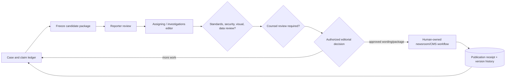
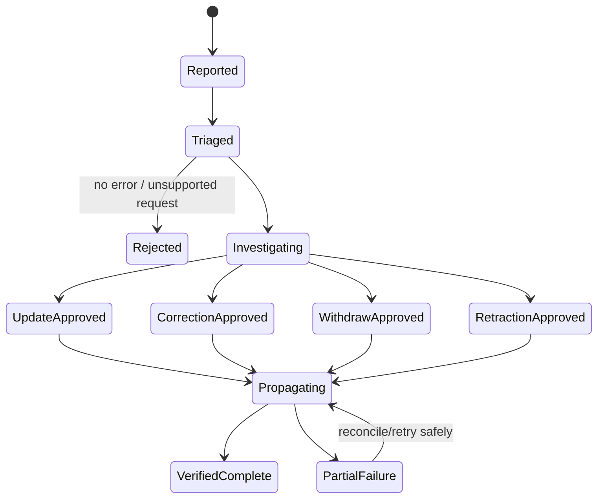

# Editorial and Legal Handoff, Corrections, and Publication Evidence

## Handoff is the product boundary

The agent’s deliverable is a review package that makes evidence, uncertainty, provenance, source restrictions, and open decisions inspectable. It is not a declaration that a story is fair, lawful, in the public interest, or ready to publish.

The external newsroom workflow remains human-owned:



The order and roles vary by newsroom and matter. Store the approved review route in policy rather than hard-coding a universal editorial hierarchy.

## Package types

One giant package creates source-exposure and privilege risks. Build audience-specific projections from the same IDs.

| Package | Audience | Contents | Excludes by default |
|---|---|---|---|
| Reporter working package | assigned reporter/team | evidence inventory, claims, contradictions, gaps, source refs, timelines | identity vault details not needed for the reporter |
| Source-custodian package | designated reporter/editor/security | identity, exact terms, risk plan, contact/custody events | general case embeddings and unrelated matter data |
| Editorial package | assigning/investigations editor | central claims, evidence bars, attribution, fairness steps, harms/issues, draft wording | unnecessary identity/contact/metadata |
| Visual/forensics package | trained specialist | original/best-known media, transforms, metadata/C2PA/detector results, alternate explanations | source identity unless essential and approved |
| Security/OPSEC package | security and source custodian | threats, data flows, exposure events, access logs, mitigations | story conclusions not relevant to risk |
| Counsel package | assigned counsel and named newsroom roles | exact proposed wording, central evidence/contradiction, source/legal context selected by counsel | broad model transcript and unrelated source material |
| Public transparency package | audience/supporting material | publishable records, methodology, declared limitations, correction history | confidential, privileged, personal, licensed, unsafe material |

Every package has its own authorization, digest, watermark/access policy, expiration, and access audit.

## Review package contract

```yaml
review_package:
  package_id: pkg_220
  matter_id: matter_204
  package_type: editorial
  revision: 3
  case_version: 58
  story_candidate_ref: artifact://story-ir/9
  story_digest: sha256:...
  material_claims:
    - claim_id: clm_204
      claim_version: 4
      epistemic_type: corroborated_fact
      proposed_text_locator: story://paragraph/12/sentence/1
      support_edges: [edge_71, edge_72]
      contradiction_ids: [con_55]
      evidence_bar_result: conditional_pass
  allegations:
    - claim_id: clm_400
      target_entity: ent_vendor_9
      attribution_required: true
  fairness:
    contact_plan_ref: fairness_33
    response_state: response_received
    response_claim_ids: [clm_response_4]
  source_disclosure:
    policy: source-disclosure/11
    identity_in_package: false
    descriptors_for_review: [direct_knowledge_claimed]
  limitations:
    - Email origin is not independently authenticated.
    - Attendance records remain incomplete.
  required_reviews: [reporter, investigations_editor, standards, counsel]
  authority: advisory_only
  generated_by:
    renderer_version: package-renderer/8
    run_id: run_44
  digest: sha256:...
  expires_on_material_change: true
```

The renderer resolves claim/evidence IDs and validates access. It escapes untrusted text, strips hidden metadata according to policy, and refuses unresolved source-disclosure conflicts.

## Fairness and response workflow

SPJ says journalists should diligently seek subjects of coverage to allow them to respond to criticism or allegations. Reuters says to seek fair comment. How, when, and with what detail are editorial and sometimes legal decisions ([SPJ Code](https://www.spj.org/spj-code-of-ethics/), [Reuters standards](https://reutersagency.com/about/standards-values/)).

The agent can:

- list the exact material allegations and factual questions that lack response;
- draft neutral, bounded questions from approved claim IDs;
- identify evidence that may need to be described for a meaningful response;
- compare a received response to the sent questions and create attributed response claims;
- flag unanswered questions, deadline changes, new contradictions, and proposed wording that exceeds the questions asked.

The agent cannot:

- choose whom to contact based on secret or inferred personal data;
- send, schedule, negotiate, threaten, pressure, deceive, or impersonate;
- decide that no response is needed;
- disclose confidential evidence or source identity to make the request more persuasive;
- treat silence as admission;
- decide whether a late response changes publication timing.

```yaml
fairness_contact:
  fairness_id: fairness_33
  target_entity: ent_vendor_9
  approved_recipient_ref: newsroom-contact://vendor_9
  question_claim_ids: [clm_400, clm_401]
  evidence_disclosure_profile: summary_only
  draft_ref: artifact://contact-draft/33
  approved_by: principal://editor/4
  effect_id: effect_contact_33_v1
  sent_by: principal://reporter/18
  sent_at: 2026-08-31T09:00:00Z
  deadline_at: 2026-09-01T09:00:00Z
  receipt_ref: newsroom-mail://receipt/771
  response_artifact_refs: [ev_response_19]
  state: response_received
```

## Public-interest, harm, and legal review boundary

The system may assemble a question set; it must not compute a dispositive score.

### Review inputs it may surface

- who may benefit from disclosure and who may be harmed;
- whether the person is a public official/figure or private individual, as a sourced and time-aware fact—not a model label;
- sensitivity, vulnerability, minors, victims, medical/sexual/immigration/safety information;
- scale, imminence, and reversibility of harm;
- available less-identifying or less-intrusive alternatives;
- how information was obtained and whether access authorization is documented;
- source promises and re-identification risk;
- material allegation wording and evidence/contradiction;
- jurisdiction, audience, distribution channels, and embargo/court-order flags;
- fair-comment attempts and response;
- copyright/license, privacy, confidentiality, privilege, national-security, and court-process questions for counsel.

### Decisions it cannot make

- “public interest outweighs harm”;
- “the statement is not defamatory”;
- “fair use applies”;
- “source privilege protects this identity”;
- “publication is legally safe”;
- “the subject had enough time”;
- “this person should be identified.”

Jurisdictional variation is a hard boundary. Source protection, recording consent, access to records, privacy, defamation, court restrictions, copyright, and compelled disclosure differ across countries and often within them. The system routes current facts to qualified reviewers and records their decision; it does not maintain a universal legal oracle.

## Approval records and stale review

```yaml
review_decision:
  decision_id: revdec_881
  package_id: pkg_220
  package_digest: sha256:...
  reviewer: principal://counsel/7
  role: counsel
  decision: approved_with_conditions
  conditions:
    - Replace paragraph 12 wording with counsel-marked version.
  decided_at: 2026-08-31T11:40:00Z
  expires_at: 2026-09-02T11:40:00Z
  invalidation_triggers:
    - material_claim_change
    - new_source_identity_disclosure
    - jurisdiction_or_distribution_change
    - wording_digest_change
  rationale_ref: privileged://review/881
```

At commit time, the newsroom workflow revalidates:

- package and exact story digest;
- every required role and condition;
- current matter/source policy;
- source-disclosure and rights profile;
- new material evidence or contradictions;
- response/contact status;
- embargo, deadline, and jurisdiction/distribution changes;
- publication identity and target.

An approval to research or draft is not approval to publish. A prior approval cannot be replayed against revised wording.

## Publishable evidence package

“Publishable” means the package is technically eligible for the human newsroom workflow, not that publication is authorized. The package contains:

- story candidate and digest;
- material-statement-to-claim map;
- citations/source descriptors permitted for public use;
- downloadable/linked supporting artifacts whose rights and safety allow release;
- methodology and limitations selected by editors;
- structured corrections/update hook and stable story ID;
- accessibility/format checks;
- package manifest with renderer, policy, source snapshot, and review decisions;
- no hidden source identity, comments, revision authors, file paths, coordinates, or telemetry.

Export uses a one-way, reviewed transformation. Public packages must be rebuilt from allowed fields, not “redacted” from a full secret package by hiding UI elements.

## Publication effects and receipts

The agent has no `publish`, `unpublish`, `correct`, or `retract` tool. An authorized newsroom actor or workflow performs the effect and returns a receipt:

```yaml
publication_effect:
  effect_id: effect_story_88_revision_1
  story_id: story_88
  package_id: pkg_220
  package_digest: sha256:...
  action: publish
  requested_by: principal://editor/4
  executed_by: newsroom://cms-workflow/2
  idempotency_key: story_88:revision_1:publish
  attempted_at: 2026-09-01T05:00:00Z
  outcome: confirmed
  external_version: "1"
  public_url_ref: public://story/88
  receipt_ref: cms://receipt/991
  observed_at: 2026-09-01T05:00:04Z
```

If the call times out after possible commit, mark `indeterminate`, query the CMS by stable story/revision identity, and reconcile before retry. See [idempotency and side effects](../../reliability/idempotency-and-side-effects.md).

## Correction, update, withdrawal, and retraction

Do not use one ambiguous `edited` state.

| Event | Meaning | Evidence requirement |
|---|---|---|
| Update | new information without necessarily fixing an error | changed claims/coverage and visible update note by policy |
| Correction | a prior published statement was materially wrong or misleading | affected claim/version, corrected evidence, human decision, propagation receipts |
| Clarification | wording/context improved without asserting the original was factually wrong | exact wording diff and rationale |
| Withdrawal/withhold | temporarily remove or block use pending review | authorized emergency decision and affected channels |
| Retraction/cancel | story/item is no longer endorsed for publication | accountable decision, reason class, preservation/access policy, propagation |

IPTC NewsML-G2 provides versioned items, machine-readable update/correction signals, editorial notes, and publishing states including usable, withheld, and canceled. Use it as an interchange mapping when the newsroom ecosystem supports it; keep the application’s correction ledger independent of one format ([NewsML-G2 2.35 guidelines](https://www.iptc.org/std/NewsML-G2/guidelines/)).



### Correction record

```yaml
correction_case:
  correction_id: corr_71
  story_id: story_88
  opened_from:
    type: audience_request
    artifact_ref: restricted://correction-request/71
  affected_versions: [1]
  affected_claims: [clm_204_v4]
  new_evidence_refs: [ev_1701]
  assessment: material_date_error
  decision: correct
  decided_by: principal://editor/4
  counsel_review_ref: revdec_990
  corrected_claim: clm_204_v5
  correction_note_ref: artifact://correction-note/71
  downstream_effects:
    - effect_story_88_revision_2
    - effect_social_correction_88_2
  status: propagation_verified
```

Preserve prior versions under policy; do not invisibly rewrite history. Conversely, “immutable” does not mean every reviewer may continue to retrieve harmful, legally restricted, or source-identifying content. Separate preservation from serving access and follow counsel/records policy.

## Correction and failure mining

After accountable review, classify causes such as:

- source misunderstood or misrepresented;
- circular corroboration;
- identity merge;
- timezone/effective-date error;
- OCR/translation/quotation error;
- stale or partial public record;
- archive/capture mismatch;
- metadata/provenance overclaim;
- detector generalization failure;
- fairness/response not incorporated;
- compaction or context omission;
- package/rendering/citation defect;
- CMS propagation or cache failure.

Convert the smallest non-sensitive reproducer into an eval fixture. Do not ingest a correction request or raw source material into long-term memory automatically.

## Handoff checklist

- [ ] Package type and audience are explicit; least-privilege fields are rendered from an allowlist.
- [ ] Every material sentence maps to claim/evidence versions and epistemic type.
- [ ] Strongest contradiction, limitation, source dependency, and unresolved gap are visible.
- [ ] Source terms, descriptors, identity access, and re-identification risks have accountable review.
- [ ] Fairness/contact questions map to material allegations; sending remains human-owned.
- [ ] Public-interest, harm, legal, and editorial judgments are recorded as human decisions.
- [ ] Approvals bind exact digests and invalidate on material change.
- [ ] Publication tools are absent from the model plane; external effects reconcile by stable identity.
- [ ] Updates, corrections, withdrawals, and retractions have distinct state and receipts.
- [ ] Correction lessons enter evaluations only after sensitivity and provenance review.

