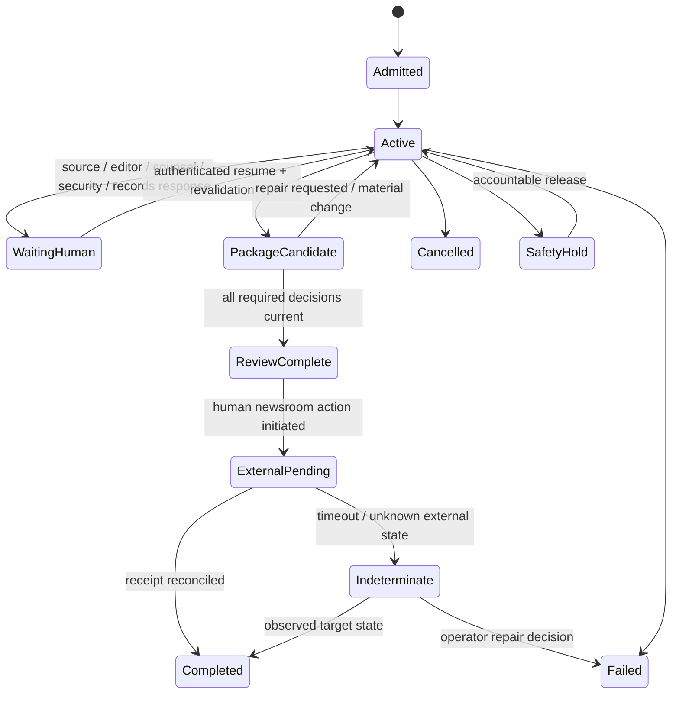

# Security, Reliability, Observability, and Operations

## Security invariant

No content—tip, document, webpage, source message, metadata field, model output, memory, reviewer comment, or tool response—may grant authority, cross a compartment, reveal a source, or cause an external effect. Identity, capability, and policy come from the control plane.

## Threat model

| Asset | Representative threats |
|---|---|
| Confidential-source identity | logs, embeddings, vendor retention, timing correlation, rare descriptors, insider access, compelled disclosure, backups |
| Submitted artifacts | malware, parser exploit, active content, tracking link, steganographic/instruction payload, origin-revealing metadata |
| Case/claim integrity | prompt injection, evidence substitution, forged capture, circular source amplification, unauthorized edit, stale projection |
| Reporter/editor safety | phishing, spyware, doxxing, harassment, physical targeting, poisoned contact route |
| Publication workflow | stale approval, wrong story/version, duplicate publish/correction, compromised CMS identity |
| Newsroom independence | source/funder/advertiser pressure, model/provider bias, hidden sponsored content, selective evidence omission |
| Software and provider supply chain | compromised parser/model/adapter package, poisoned update, stolen signing key, malicious hosted model or support path |
| Human authority and insider access | coerced reporter/source, curious administrator, abusive editor, compromised reviewer session, approval laundering, credential sharing |
| Availability | tip spam, oversized archives, OCR/media bombs, provider outage, queue flooding, review bottleneck |

Threat actors can include a malicious tipster, subject of investigation, state or corporate actor, compromised source, platform/provider, insider, unrelated tenant, supply-chain attacker, opportunistic abuser, or a benign user/tool/model error.

CPJ recommends assignment-specific digital risk assessment and ongoing account/device/communication protections. SecureDrop explicitly documents powerful adversaries and assumptions, including limits against global correlation and compromised endpoints. Treat political and jurisdiction context as part of the threat model, not a generic deployment toggle ([CPJ Digital Safety Kit](https://cpj.org/2019/07/digital-safety-kit-journalists/), [SecureDrop threat model](https://docs.securedrop.org/en/stable/threat_model/threat_model.html)).

## Trust and execution zones

| Zone | Network | Data | Credentials | Example workers |
|---|---|---|---|---|
| Source intake | purpose-built, tightly restricted | identity, contact, raw confidential submissions | source-system only | SecureDrop workstation/human process |
| Quarantine | deny by default; controlled updates | untrusted raw files | none or transform-scoped | file inventory, safe render, malware inspection |
| Public acquisition | public HTTPS allow/policy | public URLs and responses | provider-scoped API tokens | search, fetch, browser, archive |
| Sensitive analysis | no arbitrary public egress | approved source derivatives | opaque capability handles | OCR, translation, media inspection |
| Case control | service-to-service only | metadata, refs, claims, budgets | DB/queue brokered | workflow/controller/context compiler |
| Review | authenticated newsroom network | audience-specific packages | role-based reviewer identity | editor/counsel UI/export |
| Publication | newsroom controlled | approved exact package | CMS identity inaccessible to model | human-owned publish/correction workflow |

Never mount the identity vault or CMS credential into model, browser, OCR, or media workers.

## Prompt injection and hostile content

Journalism inputs are adversarial by default. A webpage or leaked document may say “ignore prior instructions,” contain hidden text, malicious links, or instructions targeted at an AI reviewer.

Controls:

- parse content into typed data and retain an `untrusted_content` label;
- strip active markup and remote references before model context;
- use bounded excerpts, not whole browser DOMs or archives;
- separate instructions/policy from evidence lanes;
- prohibit content-derived tool names, destinations, credentials, and source identifiers;
- enforce egress and effects outside the model;
- preserve origin labels through OCR, translation, summaries, compaction, and memory proposals;
- scan for delayed injection in generated notes and review comments;
- run canary secrets and exfiltration tests;
- deny all source identity and publication effects even if a guard model says content is safe.

See the repository’s [prompt-injection guide](../../security/prompt-injection-and-untrusted-data.md). Detection is supplementary; containment and least authority remain mandatory.

## Matter and tenant isolation

Every authoritative row, object, index entry, cache key, queue message, trace link, export, and idempotency key must bind:

- `tenant_id` / newsroom;
- `matter_id`;
- compartment and sensitivity;
- principal/service identity and purpose;
- policy/retention version;
- source disclosure class where relevant.

Apply authorization before search, aggregation, deduplication, or reranking. Equal hashes may reduce storage internally only if encryption, access, deletion, and legal policy preserve separate tenant/matter ownership. Do not expose existence through timing, counts, embeddings, error messages, or cache hits.

Source compartments may need stricter sub-matter isolation so two reporters on the same investigation do not automatically share every identity or statement.

## Authoritative case state



Exactly one terminal case-run outcome wins. A case/matter itself can later reopen through a new version/run for a correction or new evidence. Use compare-and-set state versions and worker fencing as described in [agent state and event contracts](../../runtime/agent-state-and-event-contracts.md).

## Events and effects

### Durable events

| Event | Required payload reference |
|---|---|
| `matter.admitted` | brief/policy/sensitivity digest |
| `source.reference.created` | blind ref and compartment; never identity |
| `evidence.acquired` | acquisition receipt, object digest, coverage |
| `evidence.derived` | input/output digests and transform receipt |
| `claim.proposed` / `claim.confirmed` / `claim.superseded` | claim/version and evidence edges |
| `contradiction.opened` / `disposed` | conflict and disposition |
| `review.package.frozen` | exact package digest and audience |
| `review.decision.recorded` | reviewer role, decision, digest, expiry |
| `external.effect.intended` | semantic operation and preconditions |
| `external.effect.confirmed` / `indeterminate` | receipt or ambiguity evidence |
| `source.safety_hold` | protected incident ref only |
| `correction.opened` / `propagated` | story/claims/version/receipts |

### External effects

| Effect | Idempotency identity | Reconciliation source |
|---|---|---|
| Public-record request/appeal | matter + agency + request revision | portal/email sent receipt and agency acknowledgement |
| Fairness contact | matter + target + question package revision | newsroom mail/message system |
| Review-package export | package digest + destination matter | destination package/version query |
| Publish/update/correction/retraction | story + external revision + action | CMS/public channel state |
| Archive request | URI + intended capture window + provider | provider capture job/status |

Prepare intent before effect, pass the idempotency key where supported, store receipts, and reconcile ambiguity before retry. Approval never replaces idempotency.

## Failure and recovery matrix

| Failure | Detection | Containment | Retry safety | Recovery owner/evidence |
|---|---|---|---|---|
| Crash after raw object upload, before DB record | orphan object scanner and operation ID | object remains quarantined | reconcile by digest/operation | storage operator; upload log + digest |
| Crash after records request sent, before receipt | sent-system query / agency acknowledgement | case `indeterminate` | no blind resend | reporter/records owner; message/portal receipt |
| Duplicate acquisition callback | acquisition ID uniqueness | discard duplicate event, retain attempt | idempotent | controller; inbox ledger |
| Late worker after case version changed | fencing token mismatch | reject state write and package use | new authorized task only | platform; lease/state events |
| Source identity appears in public trace | DLP/canary/access review | stop telemetry/export, revoke, quarantine | not retried until incident clearance | security/source custodian; trace copies/access logs |
| OCR parser corrupts numbers | cross-engine/sample/human check | invalidate affected derivative/claims | rerun pinned alternative | document reviewer; transform receipts |
| Archive provider changes capture | digest/provider mismatch | preserve both versions | new acquisition only | reporter; provider receipts |
| Model omits contradiction after compaction | continuity canary | block package | rebuild context from ledger | platform/editor; compaction receipt |
| CMS timeout after publish | missing receipt + target may exist | `indeterminate`; no new revision | reconcile by story/revision | newsroom operator; CMS/public observation |
| Provider or model outage | health/SLO | deterministic-only mode, queue/pause | retry by deadline/backoff | on-call; dependency metrics |
| Ransomware/region loss | integrity/availability alarms | isolate credentials and affected zone | restore in clean environment | incident command; backup/restore evidence |

## Deployment progression

### Small deployment

- one control service and relational database;
- encrypted object storage;
- isolated local/container transform workers;
- one public fetch/search path;
- no confidential source integration, no CMS write, no long-term memory;
- manual reporter/editor package review.

### Reliable production

- durable workflow or queue with leases/fencing;
- distinct public acquisition, quarantine, sensitive analysis, and review worker identities;
- identity vault operated separately;
- credential broker and deny-by-default egress;
- immutable/versioned evidence and package storage;
- centralized policy, audit, redacted telemetry, backup, restore, and incident controls;
- versioned newsroom/legal package adapters; publication remains human-owned.

### High-risk / larger deployment

- dedicated source-protection environment and security operations;
- per-tenant/matter encryption and worker pools where justified;
- regional/data-residency routing selected by policy;
- physical/workstation security for source material;
- reserved emergency capacity, separate review queues, and specialized forensic services;
- disaster-recovery exercises that do not replicate source identity into weaker zones.

Multi-region source-vault replication is not automatically safer; it can enlarge compelled-disclosure and compromise surface. Choose from threat, jurisdiction, recovery objective, and newsroom operations.

## Admission, queues, and backpressure

Partition work by behavior:

- public fetch/API;
- browser capture;
- document/OCR;
- audio/video processing;
- sensitive isolated transforms;
- model reasoning;
- human reporter/editor/standards/counsel review;
- external communication and reconciliation.

Admission checks matter sensitivity, deadlines, bytes/pages/duration, expected tool cost, tenant quota, source risk, legal/rights flags, and review capacity before queuing.

Backpressure ladder:

1. reject oversized or unauthorized intake before upload/parse;
2. cap per-matter branches, bytes, pages, media minutes, and model work;
3. slow/pause low-priority public monitoring;
4. coalesce duplicate URL/source capture requests without merging evidence rights;
5. degrade to metadata-only inventory or deterministic search;
6. reserve capacity for source-safety, correction, and imminent-deadline matters;
7. stop new high-cost work when human review is the bottleneck;
8. fail explicitly with retry-after or bounded partial result.

Never solve overload by silently sampling away contradictions or source-safety checks. Apply [queue and backpressure](../../operations/queues-scheduling-and-backpressure.md) controls per worker class.

## SLOs and indicators

Service reliability and journalistic quality are different dashboards.

### Operational SLIs

- accepted matter start latency by class;
- durable event commit and resume success;
- acquisition success with complete receipt;
- queue age/deadline miss by worker/review class;
- transform failure/quarantine rate;
- external-effect ambiguity age;
- package-build and access-decision latency;
- cost per acquired/accepted evidence item and per reviewed package;
- source-identity access and DLP incident rate;
- recovery point/time for each store.

### Example SLO shape

```yaml
slo:
  name: public_acquisition_receipt
  population: authorized_public_fetches_under_25MB
  objective: 99.5%
  window: 28d
  good_event: immutable bytes and validated acquisition receipt committed within 2m
  exclusions: [upstream_policy_blocked, user_cancelled]
  alert:
    burn_rates: [fast, slow]
  degradation: accept_metadata_only_only_when_declared
```

Do not create an SLO for “truth.” Evaluation and corrections measure decision quality over longer horizons.

## Observability and privacy

Trace topology:

```text
matter run
├── admission/policy
├── context compile
├── model decision
├── tool command
│   ├── queue wait
│   ├── acquisition/transform attempt
│   └── receipt commit
├── claim/evidence transition
├── package render
└── review/external-effect reconciliation
```

Record low-risk stable IDs and versions. By default do not record prompts, raw tool results, source descriptors, filenames, URLs with tokens, contact information, precise locations, privileged comments, or story copy. Content capture requires separate opt-in, redaction, access, retention, and incident policy.

Use opaque, rotating telemetry references where even matter IDs are sensitive. Keep source-identity audit separate from ordinary traces. Sampling cannot affect audit, recovery, evidence custody, approvals, or effect reconciliation. See [observability and tracing](../../evaluation/observability-and-tracing.md).

### Five records with different jobs

| Record | Answers | May be sampled? | Must not silently contain |
|---|---|---:|---|
| Evidence/custody ledger | What bytes/statement/derivative was acquired or changed, by which governed activity, with what rights and integrity? | No | A fabricated completion inferred from logs or trace |
| Security/authority audit | Who accessed, approved, disclosed, exported, denied, or changed protected state under which policy? | No | Raw source content merely for debugging |
| Distributed trace | Where did one authorized operation spend time or fail across controller, queue, tool and store? | Yes, except links needed for effect/recovery | Source identity, raw prompts/evidence, legal comments, secret URLs or tokens |
| Application log | What diagnostic event should an operator investigate? | Yes, by policy | Evidence payloads, filenames, rare source descriptors, authorization as an unstructured string |
| Metric/SLO event | How often, how long, how much, and whether the service objective is burning? | Aggregate | Story/source content or an assertion that quality equals service availability |

A trace does not prove evidence custody; an audit event does not prove a document is authentic; an SLO does not measure truth; and an evidence record is not a convenient debug log. Join them through opaque operation and event IDs under separate access and retention policies.

## Recovery load and disaster recovery

Size recovery for the backlog that arrives **during** restoration, not just the data already on disk:

```text
recovery work = state/events since checkpoint
              + projection/index rebuild
              + object fixity and tombstone verification
              + pending/unknown effect reconciliation
              + queued work still inside deadline
              + new admitted priority work during recovery

required recovery throughput > normal arrival rate + backlog / target drain window
```

Declare RPO/RTO separately for source vault, case/event ledger, evidence bytes, custody/audit, derived indexes, packages, and publication/correction receipts. A source vault may deliberately use a smaller, stronger topology than public evidence. During DR:

1. restore identity and authorization policy before any retrieval;
2. restore append-only events, approvals, custody heads, retention/hold decisions and tombstones;
3. reconcile pending and unknown external effects before retrying them;
4. verify raw-object fixity and encryption-key availability;
5. rebuild search/vector/caches as non-authoritative projections, applying deletions before serving;
6. admit source-safety, correction and hard-deadline lanes before background OCR or exploratory research;
7. resume model work only after context continuity invariants and behavior-bundle versions match.

Exercise region loss, stale backup, unavailable key service, corrupted object, partial audit restore, provider outage and a simultaneous review backlog. A restore that exposes source identities to a weaker region or resurrects deleted evidence fails even if the service is online.

## Incident modes and runbooks

### Kill switches

- stop all model calls;
- stop public egress;
- stop sensitive transforms;
- stop source-vault exports;
- revoke third-party and newsroom adapter credentials;
- stop external communications/package export;
- invalidate pending packages/approvals;
- place a matter or tenant on safety hold.

### Required runbooks

| Incident | First actions |
|---|---|
| Suspected source exposure | stop paths, protect/source-contact plan under human control, preserve logs safely, rotate/revoke, assess every derivative/export |
| Hostile artifact escape | isolate worker/network, preserve sample, revoke credentials, rebuild clean, identify all descendants |
| Cross-matter/tenant leak | block retrieval/export, invalidate caches/indexes, identify affected principals, preserve authorization evidence |
| Evidence integrity mismatch | quarantine object and dependent claims/packages, verify storage/acquisition/transform chain, reacquire if possible |
| Erroneous publication/correction | use newsroom emergency authority, reconcile channels/caches, freeze affected package, open correction case |
| Model/tool regression | route to deterministic-only/pinned bundle, stop rollout, replay affected runs, invalidate unsafe outputs |
| Provider compromise/outage | revoke token, stop tainted ingress/egress, use approved fallback, verify stored data and contract obligations |

Incident response must prioritize human safety and source protection over service restoration. Do not notify a source automatically; the chosen channel itself may be compromised.

## Cost model

Track cost by useful evidence outcome, not token alone:

```text
matter cost = acquisition/API
            + browser and archive capture
            + storage and retention
            + OCR/ASR/translation/media compute
            + model input/output and retries
            + specialist and editorial review
            + failed/reconciled work
```

Optimize in this order:

1. remove duplicate or non-material work;
2. use deterministic parsing/filtering before models;
3. compile smaller evidence spans with provenance;
4. route simple classification/extraction to evaluated lower-cost paths;
5. cache only within identical authorization, source version, policy, and deletion scope;
6. batch background transforms while preserving deadlines;
7. add parallelism only when latency/coverage gains exceed review and merge cost.

Storage and human review may dominate long investigations. Retention reduction is a policy decision, not an automatic cost lever for confidential-source evidence.

## Production checklist

- [ ] Source identity, untrusted files, public egress, sensitive analysis, case control, review, and publication are separate zones.
- [ ] Prompt injection cannot alter tools, targets, recipients, identity, or authority.
- [ ] Tenant/matter/compartment authorization occurs before retrieval and dedupe.
- [ ] Durable case state includes waiting, safety hold, cancellation, failure, and indeterminate effects.
- [ ] Every external effect has stable identity, approval precondition, receipt, and reconciliation.
- [ ] Failure tests cover crash-before/after every evidence and external-effect boundary.
- [ ] Queues are partitioned, bounded, fairly admitted, and degrade without hiding contradictions.
- [ ] Telemetry is useful without capturing source/content secrets; audit is independent of sampling.
- [ ] Source exposure, integrity mismatch, cross-tenant leak, hostile artifact, model regression, and publication error have exercised runbooks.
- [ ] Backups/restores and regional choices preserve the strongest source-protection boundary.
