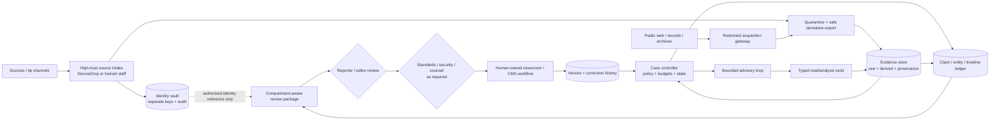

# Investigative Journalism and Source Verification Agent Blueprint

> **Status:** Pass 2 research-backed production blueprint
>
> **Research baseline:** 2026-08-31
>
> **Maturity:** Advisory architecture; high-risk deployments require newsroom, security, privacy, and jurisdiction-specific legal review
>
> **Evidence:** [Investigative journalism agent research packet](../../research/packets/investigative-journalism-agent-blueprint.md)

This blueprint describes an evidence-centered assistant for reporters and newsroom reviewers. It can organize an approved investigation, acquire authorized public material, preserve representations, propose source and claim links, expose contradictions, and assemble review packages. It is not an autonomous reporter, investigator, lawyer, editor, or publisher.

The recommended production shape is a **hybrid, bounded advisory system**:

- deterministic services own matter admission, identities, source compartmentation, evidence custody, policy, budgets, durable state, approvals, exports, and correction history;
- one model-directed loop may choose among approved read-only searches, propose follow-up questions, and draft structured claims from the evidence it is allowed to see;
- specialist OCR, translation, archive, and media-forensics jobs run as typed, reproducible tools, not as hidden reasoning;
- reporters, editors, security staff, and counsel retain investigation scope, source handling, fairness, public-interest assessment, legal judgment, and publication authority.

The center of the design is the **case/evidence ledger**, not a chat transcript and not a model summary.

## Scope and target readers

Use this area to design systems that must:

- receive public records, web captures, social posts, documents, audio, images, video, and source statements without losing origin or transformation history;
- protect confidential-source identity and reduce re-identification risk across tools, telemetry, exports, and review roles;
- distinguish what a person alleged from what an artifact shows and from what a newsroom has corroborated;
- reconcile entities, aliases, dates, time zones, versions, and conflicting accounts;
- preserve uncertainty, missing coverage, archive drift, translation/OCR limitations, and synthetic-media detector limitations;
- assemble compartment-aware reporter, editor, standards, security, and counsel review packages;
- keep correction, update, withdrawal, and retraction evidence connected to the claims and story versions they affect;
- recover a long-running investigation after failure without duplicating records requests or silently changing accepted evidence.

The primary readers are newsroom product and platform engineers, investigative and data journalists, research editors, visual-investigations teams, standards editors, security engineers, records specialists, and counsel responsible for the surrounding review process.

## Non-goals and absolute boundaries

This system must not:

- expose, infer, rank, or reveal confidential-source identities to people or services outside an approved compartment;
- promise anonymity or confidentiality, set source ground rules, or decide whether a promise can legally be kept;
- obtain material through credential theft, access-control bypass, pretexting, unlawful recording, malware, covert surveillance, or another illegal or unauthorized method;
- contact a source, subject, family member, employer, or authority without an explicit human-owned communication workflow;
- fabricate a source, quote, screenshot, record, signature, provenance chain, or media artifact;
- present a hash, metadata field, C2PA credential, detector score, archive capture, or model judgment as an authenticity guarantee;
- decide public interest, proportionality, fairness, defamation, privilege, contempt, privacy, copyright, national-security, or other legal risk;
- autonomously publish, unpublish, correct, retract, identify a person, accuse wrongdoing, or trigger a real-world consequence;
- replace reporters, editors, standards staff, security specialists, forensic experts, translators, records officers, or counsel.

Legal access is not the same as ethical justification to publish. The [SPJ Code of Ethics](https://www.spj.org/spj-code-of-ethics/) states that distinction directly. The adopted SPJ code remains the 2014 code at this research date; the [August 2026 revision is a proposal](https://www.spj.org/spj-ethics-code-revision-project-2026/), not a silently substituted standard.

## Keep eight epistemic objects separate

The words “verified” and “authentic” are too coarse for an investigative system. Use separate records:

| Object | Meaning | What it does **not** establish |
|---|---|---|
| Allegation | A contested proposition attributed to a speaker, filing, post, tip, or other origin | That the proposition is true |
| Source statement | What a particular source said under recorded ground rules and circumstances | Independent corroboration or absence of motive/error |
| Observation | A reproducible description made by a reporter, tool, or system from specified material | The cause, identity, or broader implication |
| Authentic artifact | An artifact whose origin/integrity claim meets a stated evidence bar | That its depicted event or embedded assertion is truthful or complete |
| Corroborated fact | A narrow factual proposition supported under the newsroom’s declared independence and evidence rules | An editorial or legal conclusion beyond that proposition |
| Inference | Reasoning from facts and assumptions, with alternatives and uncertainty | Direct observation or proof |
| Editorial conclusion | A human-owned interpretation or characterization approved through newsroom review | A machine-verifiable fact or legal determination |
| Publication effect | The externally visible issue, update, correction, withdrawal, or retraction and its receipt | That the underlying conclusion will never change |

An object can influence another only through an explicit edge. A source statement does not become a fact by being repeated, and an authentic document can contain a lie.

## Representative workflows

1. **Public-record investigation:** register a jurisdiction-specific request, ingest releases and withholding letters, preserve each response, OCR and reconcile names/dates, create claim and gap records, and hand a traceable package to the reporter.
2. **Confidential submission:** let trained newsroom staff acquire an encrypted submission from an approved secure-drop environment, create a blind source token, inspect files in an isolated workstation, export only approved derivatives, and prevent the general research plane from seeing identity material.
3. **Visual verification:** preserve the original file and acquisition receipt, inspect metadata and C2PA assertions, extract frames, compare geospatial/temporal clues, retain competing explanations, and route specialist questions without declaring “real” or “fake.”
4. **Conflicting accounts:** separate each attributed statement, test source independence, identify circular reporting, reconcile entity aliases and time intervals, seek disconfirming evidence, and surface unresolved contradictions.
5. **Editorial and counsel handoff:** generate a digest-bound review package containing material claims, strongest support and contradiction, source-disclosure tiers, fairness/contact attempts, unresolved gaps, limitations, and proposed wording—never a publish command.
6. **Correction or retraction review:** link a correction request or new artifact to the released claim graph, reconstruct what was known at each version, propose affected statements, and preserve the human decision and downstream publication receipts.

## System context and trust boundaries

The model plane has no direct path to the identity vault, source-channel administration, credentials, arbitrary outbound messaging, or the production CMS. “Available” never means “authorized”; apply the repository’s [execution-boundary model](../../runtime/execution-boundaries.md).

## Component map

| Component | Owns | Must never infer from model text |
|---|---|---|
| Matter gateway | purpose, owner, jurisdiction flags, sensitivity, retention, accepted scope | legal authority or ethical justification |
| Source intake and vault | source identity, contact channel, promises/ground rules, risk plan, compartment membership | identity from a blind token |
| Acquisition gateway | authorized fetches, API terms, robots/rate policy, capture receipts, archive requests | permission to bypass access controls |
| Quarantine and transform workers | malware-safe inspection, metadata extraction, OCR, transcription, translation, frame extraction | safety or authenticity from successful parsing |
| Evidence store | immutable originals, derived artifacts, digests, locators, custody and access events | cross-matter deduplication rights from equal hashes |
| Case controller | state, plans, budgets, leases, approvals, cancellation, terminal status | scope expansion or publication readiness |
| Claim/entity/timeline ledger | typed propositions, evidence edges, aliases, contradictions, uncertainty, versions | final truth from confidence alone |
| Context compiler | least-privilege projection for one decision, provenance, trust labels, omissions | authority from retrieved content |
| Review-package builder | deterministic, audience-specific views and redactions | publish authorization |
| Newsroom adapters | read or approved draft-package exchange, version receipts | editorial decision or CMS credentials for the model |

## Architecture and runtime choices

| Path | Use when | Reject when |
|---|---|---|
| Deterministic records workspace | requests, evidence capture, OCR queues, claim entry, and review checklists follow known steps | the investigation needs adaptive lead selection across uncertain evidence |
| One bounded custom loop | a small tool catalog and strict case schema are sufficient | long waits, many integrations, or crash recovery exceed a process-local run |
| SDK/framework inside the boundary | structured tool calling, streaming, and tracing save implementation time | framework state would become the evidence, approval, or identity system of record |
| Durable workflow + bounded agent step **(recommended v1+)** | public-record delays, human approvals, retries, and multi-day cases must resume safely | a narrow prototype can be proven with a simpler controller |
| Multi-agent fan-out | independent public-source branches measurably improve recall and each branch has a safe compartment | branches share confidential identity, publish authority, or an ambiguous merge contract |

Start with one process, a relational database, governed object storage, isolated transform workers, and a small queue. Python is usually the practical analysis-worker choice because of document/media tooling; TypeScript is credible for a newsroom integration/control plane; Go or Rust fit hardened acquisition or high-throughput gateways. Use the team’s operable runtime and keep language boundaries at typed messages. See [runtime-language selection](../../languages/README.md) rather than treating language as an agent capability.

## Read in this order

| Guide | Decision it helps make |
|---|---|
| [Mission, authority, and architecture](01-mission-authority-and-reference-architecture.md) | Qualify the workload, assign human authority, select the smallest architecture, and trace an investigation end to end |
| [Source intake, identity, rights, and compartmentation](02-source-intake-identity-rights-and-compartmentation.md) | Protect source identity, record ground rules and rights, and keep high-risk material out of general tools |
| [Evidence acquisition, provenance, and authenticity](03-evidence-acquisition-provenance-and-authenticity.md) | Capture public/web/social/document/media evidence and make bounded authenticity assessments |
| [Claims, contradictions, entities, and timelines](04-claims-contradictions-entities-and-timelines.md) | Build a claim graph that preserves attribution, independence, uncertainty, aliases, and temporal conflict |
| [Research loop, tools, context, and memory](05-research-loop-tools-context-and-memory.md) | Constrain planning, tool use, context compilation, lossy compaction, and every memory class |
| [Editorial and legal handoff, corrections, and publication evidence](06-editorial-legal-handoff-corrections-and-publication-evidence.md) | Produce reviewable packages while leaving fairness, legal, editorial, and publication decisions with professionals |
| [Security, reliability, observability, and operations](07-security-reliability-observability-and-operations.md) | Threat-model the workload, recover ambiguous work, isolate matters, operate queues, and respond to incidents |
| [Evaluation, adversarial testing, and evolution](08-evaluation-adversarial-testing-and-continuous-evolution.md) | Test evidence quality, source safety, trajectories, failures, and model/tool/corpus changes |
| [Zero-to-production roadmap and reference contracts](09-zero-to-production-roadmap-and-reference-contracts.md) | Build stages 0–6 with explicit authority, state, recovery, evaluation, and exit gates |
| [Adapter qualification and worked investigation lifecycle](10-adapter-qualification-and-worked-investigation-lifecycle.md) | Qualify live search, records, forensic, storage, newsroom, and notification surfaces and rehearse source-safe intake through publication ambiguity and correction |

## Non-negotiable invariants

1. The general model context never contains source identity unless a specifically approved workflow proves it is necessary; a blind `source_ref` is the default.
2. Raw artifacts are immutable. Every OCR, transcript, translation, crop, frame, redaction, normalization, and summary is a new derived object with tool/version/configuration lineage.
3. Evidence origin, byte integrity, content authenticity, contextual accuracy, and factual support are separate assessments.
4. Every material claim links to supporting, contradicting, and limiting evidence or is explicitly `unsupported`, `unresolved`, or `editorial_only`.
5. Corroboration counts independent evidence paths, not URLs, repetitions, model votes, or articles copying one origin.
6. Time is represented with source, precision, zone, and uncertainty. Publication time is not event time.
7. No model-generated citation, quote, identity merge, or source-independence assertion bypasses deterministic validation and accountable review.
8. Untrusted documents, websites, social posts, and tool output remain data through parsing, retrieval, compaction, and memory admission.
9. Editorial, standards, security, and legal approvals bind to a specific package digest and expire when material evidence, wording, policy, or jurisdiction changes.
10. Publication, correction, withdrawal, and retraction are human-owned external effects with stable operation IDs and independently observed receipts.

## Stop and escalation conditions

Stop model-directed work and route to the named human owner when:

- source identity or a rare combination of details may have leaked across a compartment;
- a source may face immediate physical, digital, employment, immigration, or legal danger;
- malware, device compromise, targeted phishing, or surveillance is suspected;
- access rights, recording law, court restrictions, legal hold, or retention duties are unclear;
- the requested method implies impersonation, bypass, surveillance, prohibited re-identification, or another unauthorized act;
- a material allegation lacks the newsroom’s required corroboration or the subject has not received the required fair opportunity to respond;
- authenticity findings conflict, detector results are out of distribution, or the original artifact cannot be obtained;
- a reviewer package could expose a source through filenames, metadata, timing, wording, graph links, or telemetry;
- an external write is indeterminate, an approval is stale, or a released story may contain a material error.

## Anti-patterns

| Anti-pattern | Failure it creates | Required replacement |
|---|---|---|
| `two URLs = corroborated` | Counts syndication, circular reporting, or a shared upstream error as independence | Cluster information origins and record directness/dependencies |
| `valid signature = true content` | Confuses integrity or signer provenance with contextual and factual accuracy | Assess custody, signer, content, context, and claim support separately |
| `no metadata = fake` | Penalizes legitimate media whose metadata was stripped or never created | Record absence as absence and corroborate through other evidence |
| `detector score = authenticity verdict` | Hides distribution shift, calibration, post-processing, and unknown generators | Preserve the score as a limited forensic signal and escalate consequential cases |
| `pseudonym = anonymous` | Ignores mappings, rare details, timing, and graph-based re-identification | Isolate identity, minimize joins, and run mosaic-risk review |
| `all evidence in one prompt or vector index` | Creates source leakage, stale context, and cross-matter retrieval | Compile least-privilege context from matter-scoped authoritative state |
| `model summary replaces the artifact` | Loses exact wording, layout, ambiguity, and provenance | Keep immutable originals and locator-backed derivatives |
| `agent vote = independent verification` | Multiple models can repeat the same evidence and failure mode | Seek materially independent sources/methods and accountable review |
| `automatic entity merge` | Contaminates claims, timelines, and source-safety decisions | Use reversible candidates with evidence and human approval |
| `approval once, reuse forever` | Applies review to changed evidence, wording, policy, or jurisdiction | Bind approvals to package/policy digests and invalidate on material change |
| `retry the write` | Duplicates records requests, source contact, exports, or corrections | Use intent, idempotency key, effect receipt, and reconciliation |
| `publishable means publish` | Converts an evidence package into unauthorized editorial action | Keep publishing credentials and decisions outside the agent boundary |
| `overwrite the correction` | Destroys publication lineage and downstream impact evidence | Version the release and track correction/retraction propagation |

## Staged build path

| Stage | Outcome |
|---:|---|
| 0 | Prove a deterministic research and records workspace is insufficient; define non-goals and a manual baseline |
| 1 | Add one read-only, bounded advisory loop over a frozen public corpus; no confidential sources or writes |
| 2 | Deliver a useful MVP with authorized public acquisition, immutable evidence, claims, timelines, and reporter review |
| 3 | Add durable case state, source compartmentation, safe transforms, idempotency, reconciliation, and versioned integrations |
| 4 | Add production identity, matter isolation, threat controls, SLOs, release gates, runbooks, and incident response |
| 5 | Add measured queues, fair admission, isolated worker pools, degradation, disaster recovery, and cost controls |
| 6 | Mine corrections and failures into governed evaluations; gate every model, tool, corpus, schema, and policy change |

The complete contract for every stage is in the [zero-to-production roadmap](09-zero-to-production-roadmap-and-reference-contracts.md).

## Definition of done

A production candidate is done only when an authorized reviewer can answer from durable records:

- What was the approved investigation question, jurisdiction context, time boundary, and prohibited method set?
- Which identity compartment knew each source, and who accessed it?
- What exact artifact or source statement underlies each material claim?
- Which transformations, versions, clocks, archives, detectors, or translations influenced the assessment?
- Which evidence contradicts the working account, and which alternatives remain unresolved?
- Which contact and fairness steps were attempted, by whom, under what approved wording, and with what receipt?
- Which specific package did each reporter, editor, standards reviewer, security reviewer, or counsel review?
- What changed after publication, who decided the correction or retraction, and where was it propagated?

If the answer depends on trusting an opaque transcript, a confidence score, or the model’s self-report, the system is not production-ready.

## Primary evidence baseline

- [Reuters Journalistic Standards](https://reutersagency.com/about/standards-values/)
- [Associated Press news values and principles](https://www.ap.org/about/news-values-and-principles/telling-the-story/)
- [SPJ Code of Ethics](https://www.spj.org/spj-code-of-ethics/)
- [European Fact-Checking Standards Network Code](https://efcsn.com/code-of-standards/)
- [Berkeley Protocol on Digital Open Source Investigations](https://humanrights.berkeley.edu/publications/berkeley-protocol-on-digital-open-source-investigations/)
- [SecureDrop threat model](https://docs.securedrop.org/en/stable/threat_model/threat_model.html)
- [CPJ Digital Safety Kit](https://cpj.org/2019/07/digital-safety-kit-journalists/)
- [C2PA 2.3 specification](https://spec.c2pa.org/specifications/specifications/2.3/specs/C2PA_Specification.html)
- [IPTC NewsML-G2 2.35 guidelines](https://www.iptc.org/std/NewsML-G2/guidelines/)
- [W3C PROV overview](https://www.w3.org/TR/prov-overview/)
