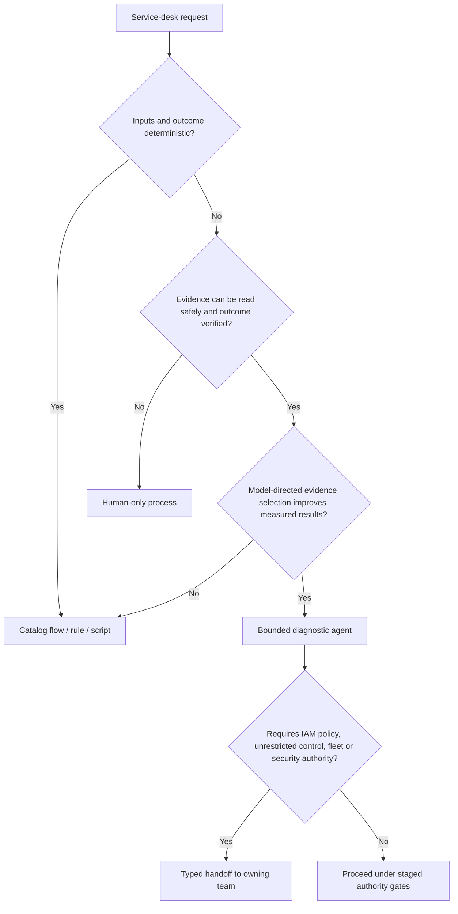

# Scope, Workload Fit, and Authority

> **Section index:** [IT Service Desk and Endpoint Support Agent Blueprint](README.md)  
> **Evidence:** [Research packet](../../research/packets/it-service-desk-agent-blueprint.md)

The service desk is an attractive automation target because it has high volume, repeated patterns, and observable endpoints. It is also a high-value social-engineering target with access to identity recovery and remote administration. The correct design begins with the work and authority model, not with a chatbot or a list of tools.

## Outcome contract

The product outcome is:

> Restore one authenticated user's ability to use one bound endpoint or service, or transfer the case to the correct accountable owner with enough verified evidence to continue safely.

This is deliberately narrower than “resolve IT issues.” It excludes governance, broad administration, security containment, and general desktop operation.

### Inputs

- authenticated channel principal or an explicitly unverified claimant;
- tenant and channel assurance;
- request description and attachments treated as untrusted data;
- authoritative directory, HR/person, asset, CMDB, MDM, and ITSM identifiers;
- existing endpoint inventory and approved telemetry;
- versioned knowledge articles, runbooks, outage/problem records, and support policy;
- operator decisions and user consent; and
- connector receipts and observed postconditions.

### Outputs

- a versioned case with exact principal/device binding or an explicit unresolved state;
- provenance-bearing observations and artifacts;
- labeled hypotheses, conflicts, confidence reasons, and missing evidence;
- a safe next step, user instruction, exact action proposal, or typed escalation;
- effect and recovery receipts with reconciliation state; and
- verified resolution or accountable terminal handoff.

## Qualify the workload before adding a model

Use this decision tree:

Do not treat search, workflow automation, and an agent as increasing levels of the same product. They solve different failure modes:

| Best mechanism | Choose it when | Required proof before launch | Do not add a model because |
|---|---|---|---|
| No new product | Volume is low, the process is unsafe or undefined, the authoritative data is missing, or a trained human already resolves the work within target | Current manual outcome, error, wait, recurrence, and effort baseline | Automation would only accelerate ambiguity or move hidden work elsewhere |
| Search or cited self-service | The user needs a stable answer and article applicability can be determined from authenticated tenant, product, version, and audience metadata | Retrieval precision, article freshness/ACL/locale, helpfulness, and safe fallback | Conversational planning adds no value to a one-retrieval answer |
| Deterministic workflow/rule | Inputs, validation, route, transition, or postcondition are enumerable | Rule coverage, exception queue, idempotency, and state-transition tests | Natural-language flexibility would weaken a known contract |
| Bounded diagnostic model | Intake is noisy, several hypotheses remain plausible, and choosing the next admitted read/question measurably improves verified outcomes | Concurrent-control evaluation by workload slice, abstention, grounding, and authority tests | A model is not justified by deflection, fluency, or classification accuracy alone |
| Human-only | Proofing, remote control, privileged exception, security containment, or policy judgment is the work | Named owner, staffing, secure tooling, escalation and audit | The missing capability is accountable authority rather than reasoning |

The minimum useful architecture can therefore be a better article index, a catalog form, a routing rule, or no new automation. Proceed to an agent only when Stage 0 evidence shows an irreducibly judgment-heavy diagnostic step and a safe observable outcome.

### Prefer deterministic automation for

- catalog request validation and required-field collection;
- assignment by explicit service/category/site rules;
- duplicate and known-outage linking;
- SLA timers, reminders, and escalation deadlines;
- status lookup and notification;
- user-launched, already-approved self-service operations;
- deterministic health and postcondition checks; and
- policy evaluation, approval validation, and ticket transitions.

### Use model judgment for

- extracting a structured symptom statement from noisy but authenticated intake;
- choosing the next diagnostic read from a bounded catalog;
- relating observations to versioned knowledge while retaining citations;
- distinguishing multiple plausible hypotheses and asking the highest-value question;
- producing an evidence-first explanation for the user or resolver;
- identifying a likely owning queue from evidence, not merely keywords; and
- deciding to abstain or escalate when evidence cannot safely distinguish outcomes.

### Keep human-only

- identity-proofing exceptions and recovery decisions;
- remote-control operation and privileged elevation;
- approval of consequential endpoint or identity effects;
- breaking-glass, wipe, policy, fleet, entitlement, and security containment decisions;
- exceptions involving executives, administrators, service accounts, HR/legal holds, or suspected fraud; and
- final accountability for high-impact resolution and case closure.

## Workload classes

| Class | Typical duration | Evidence | Authority ceiling | Default owner |
|---|---:|---|---:|---|
| Information/how-to | Minutes | Versioned KB and product state | D1; D2 ticket note | Agent may answer with citations |
| Single-user diagnostic | Minutes to hours | Ticket, inventory, telemetry, user checks | D1; proposal-only | Agent diagnoses; human/user executes |
| Bounded endpoint remediation | Minutes to hours plus wait | Exact device, runbook, approval, device result | Selected D3 | Human approver plus effect broker |
| Account-access recovery | Minutes to days | Recovery-service evidence and receipt | D3 outside agent | IAM/recovery operator |
| Remote assistance | Interactive | Authenticated helper/sharer, consent, session metadata | D3 | Human helper and remote-help platform |
| Shared service/outage | Hours to days | Cross-case/service evidence | D1 and D2 handoff | Incident/application/network owner |
| Lost/stolen/suspected compromise | Urgent | Identity, asset, telemetry, security indicators | No containment here | Security and endpoint/fleet owner |
| Fleet/policy/configuration problem | Hours to days | Population, policy, rollout and drift data | No fleet writes here | Endpoint engineering |

Do not combine these into one autonomy policy. A high measured success rate on information requests says nothing about the safety of MFA reset or remote remediation.

## Authority matrix

| Capability | Target resolution | Reversibility | Default tier | Who authorizes | Independent evidence |
|---|---|---|---:|---|---|
| Read ticket and comments | Tenant + immutable ticket ID | Read-only | D1 | Purpose-scoped role | ITSM ACL and current case membership |
| Read user directory subset | Tenant + issuer/subject | Read-only but sensitive | D1 | Directory policy | Authenticated session and field allowlist |
| Read device inventory | Tenant + MDM/CMDB device ID | Read-only but sensitive | D1 | Endpoint read policy | Enrollment/ownership/freshness record |
| Read existing diagnostics | Case + artifact ID | Read-only, privacy-sensitive | D1 | Purpose and artifact ACL | Artifact manifest and source |
| Create or comment on ticket | Exact ticket and visibility | Correctable | D2 | Case policy | Version/precondition and provider receipt |
| Send user instruction | Exact channel/principal | Externally visible | D2/D3 by content | Communication policy; human for sensitive content | Rendered payload and delivery receipt |
| Request fresh remote diagnostics | Exact device + collection profile | Data collection side effect | D3 | Affected user or approved exception operator | Device binding, collection scope, expiry |
| Start remote view/control | Exact user, device, helper, mode, duration | Privacy/privilege impact | D3 | User consent and authorized helper/operator | Remote platform identity/RBAC plus verifier |
| Restart/reinstall/signed remediation | Exact device + versioned runbook + params | May disrupt or lose work | D3 | User/operator per policy | Fresh state, runbook signature, preconditions |
| Create recovery handoff | Exact account and recovery service | Staged | D2 | Case policy | Bound account and reason |
| Reset password/factor or issue temporary credential | Exact account; identity-sensitive | Consequential | D3 outside agent | IAM recovery operator/service | Recovery method, policy, notification, receipt |
| Wipe/retire/delete/bulk action | Exact/batch devices | Destructive/broad | D4 for this blueprint | Fleet/security workflow | Outside scope |
| Change group/role/policy/tool scope | IAM/MDM/RMM control plane | Changes future authority | D4 | Independent administrators | Outside scope |

## Autonomy modes

| Mode | Model may | Model may not | Promotion condition |
|---|---|---|---|
| Offline evaluation | Analyze fixtures and recorded sanitized cases | Reach production systems | Task, safety, and cost baseline established |
| Advisory | Read authorized case evidence and propose steps | Write tickets or trigger effects | Grounding, abstention, and privacy gates pass |
| Assisted | Add clearly attributed notes/proposals; guide user-run steps | Commit remote/identity effects | Concurrent-control shadow shows benefit |
| Supervised effect | Propose one registered action | Approve, dispatch, or verify it | Exact approval, verifier, ledger, and recovery tested |
| Narrow pre-authorized self-service | Select among deterministic user-initiated operations whose identity, device, and scope are already fixed | Expand selector, parameters, tool, or authority | Only when organization policy treats the enclosing application flow—not the model—as authorizer |

No mode permits model-directed unrestricted desktop control, arbitrary shell, identity inference, or IAM/fleet policy changes.

## Abuse and failure cases that shape the boundary

The joint 2025 Scattered Spider advisory documents repeated targeting of organizations and contracted IT help desks, including attackers gathering personal information, learning reset processes, convincing help-desk personnel to reset passwords or transfer MFA tokens, and abusing remote-management tools. The architectural response is not “train the model to spot scams.” It is to make the dangerous path independent of conversational persuasion.

| Abuse/failure | Why a prompt is insufficient | Enforced response |
|---|---|---|
| Claimant knows employee facts | Facts are obtainable from leaks and social media | Use configured recovery methods; never KBA or ad hoc questions |
| Caller ID/email/device name matches | Mutable/spoofable/display data | Resolve immutable IDs from authenticated authoritative sources |
| “Urgent executive” request | Urgency increases social pressure | High-risk account route; no bypass; independent operator |
| Request to move MFA to new phone | Can create account takeover persistence | IAM recovery handoff; notify subscriber; monitor risky sign-in |
| User told to install a remote tool | Attacker may impersonate support | Only organization-approved preinstalled remote-help path |
| Ticket includes command/instruction | Content is untrusted | Treat as data; only registered tools/runbooks exist |
| Model says issue is fixed | Self-report is not evidence | Postcondition and user/service verification required |
| Many similar tickets | Individual fixes can amplify outage | Stop remediation; correlate and hand off incident |

## Requirements checklist

### Functional

- [ ] Intake records channel assurance and never upgrades an unverified claimant silently.
- [ ] User and device binding can be unresolved, conflicting, revoked, or stale.
- [ ] Evidence tools return provenance, timestamp, coverage, sensitivity, and result completeness.
- [ ] Diagnostic hypotheses cite evidence and state missing/contradictory facts.
- [ ] The case workflow supports waiting, cancellation, escalation, unknown effect, and reopen.
- [ ] Remote and identity paths use exact expiring approvals and independent verification.
- [ ] Every effect has an idempotency/reconciliation strategy and observable postcondition.
- [ ] Escalation packages are useful without exposing hidden reasoning or unnecessary personal data.

### Quality attributes

- [ ] A wrong-principal, wrong-device, or unauthorized D3 effect is a hard release failure.
- [ ] The system fails closed for D3 when identity, policy, approvals, audit, or verifier is unavailable.
- [ ] Read degradation never fabricates a healthy device, successful action, or absent outage.
- [ ] Per-case and per-device concurrency prevents two active writers.
- [ ] Interactive progress stays responsive while diagnostics and connector waits are queued.
- [ ] Manual intake, diagnosis, remote help, recovery, and closure remain available during model outage.
- [ ] Tenant, region, retention, and artifact policies are enforced below the prompt layer.

## Exit gate for the product boundary

Do not begin implementation until the team can name:

1. the authoritative human principal key and recovery owner;
2. the authoritative device identifiers and ownership/assignment source;
3. the ITSM owner and supported status mappings;
4. the passive reads available without new endpoint side effects;
5. the exact remote/remediation actions that are allowed—and those prohibited;
6. user and operator approval requirements for every D3 action;
7. the independent verifier and observable postcondition;
8. manual fallback and each escalation queue; and
9. success metrics that distinguish verified resolution from deflection.

If any item is unknown, Stage 0 remains a process and data-quality project rather than an agent project.

## Sources and related guidance

- [NIST SP 800-63B-4 account recovery](https://pages.nist.gov/800-63-4/sp800-63b.html#account-recovery)
- [Joint government Scattered Spider advisory](https://www.cyber.gov.au/about-us/view-all-content/alerts-and-advisories/scattered-spider)
- [NCSC help-desk reset recommendations](https://www.ncsc.gov.uk/blog-post/incidents-impacting-retailers)
- [NIST SP 800-53 Rev. 5.1](https://csrc.nist.gov/pubs/sp/800/53/r5/upd1/final)
- [Agentic systems](../../foundations/agentic-systems.md)
- [Execution boundaries](../../runtime/execution-boundaries.md)
- [Agent blueprint cross-cutting controls](../../research/packets/agent-blueprint-cross-cutting-controls.md)
