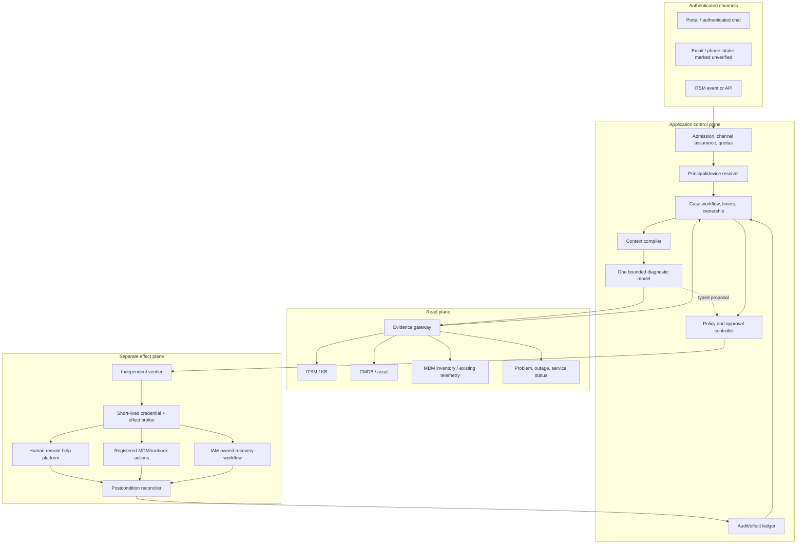

# Reference Architecture, Runtime, and Connectors

> **Section index:** [IT Service Desk and Endpoint Support Agent Blueprint](README.md)  
> **Evidence:** [Research packet](../../research/packets/it-service-desk-agent-blueprint.md)

The recommended system is a deterministic case application with one bounded diagnostic model activity. It integrates with existing ITSM, directory, CMDB/asset, endpoint-management, telemetry, remote-help, and recovery systems through product-specific adapters. A generic “admin tool” or browser automation layer is the wrong boundary.

## Logical architecture



### Trust zones

| Zone | Credentials | Model-visible data | Network reach | Failure posture |
|---|---|---|---|---|
| Channel edge | Session validation only | User message after labeling/quarantine | Public/auth endpoints | Admit unverified with no protected reads/effects, or reject |
| Control plane | Workload identity, no endpoint admin secret | Structured case state and minimum evidence | State, policy, model and gateways | D3 stops on policy/audit/verifier loss |
| Read gateway | Tenant/purpose-scoped read grants | Filtered results | Allowlisted ITSM/inventory/telemetry endpoints | Return denied/partial/stale explicitly |
| Artifact plane | Storage service identity | References and selected excerpts | Object store/scanner | Quarantine or omit, never inject raw by default |
| Effect plane | Per-operation or narrowly scoped connector identity | No free-form model context | Specific provider operations only | Unknown outcome and reconcile; no blind retry |
| Remote-help session | Authenticated human helper/sharer | No screen stream to model | Remote-help service only | End session and verify disconnect |

## Architecture choices

### Deterministic case app — always required

Own these outside any agent SDK:

- subject/device canonicalization and ambiguity;
- ITSM status mapping and optimistic concurrency;
- case and effect schemas;
- policy, risk tier, approval and revocation;
- tool registry and connector version admission;
- secrets and delegated credentials;
- idempotency, fencing and reconciliation;
- retention, tenancy and audit; and
- release manifest and kill switches.

### Model loop — deliberately small

Use one loop with these actions:

1. inspect current structured case projection;
2. request one or more bounded evidence reads;
3. update typed hypotheses/evidence gaps;
4. ask a targeted user question, propose a registered action, escalate, or finish; and
5. stop on step, token, tool, latency, cost, or repetition limits.

Do not give the model ticket-transition, credential, remote-session, shell, generic HTTP, SQL, or provider-administration tools.

### Durable workflow — adopt when the lifecycle needs it

A relational state machine and queue are sufficient for a short read-only MVP. Adopt a durable workflow runtime when cases routinely wait on:

- user replies or appointment windows;
- expiring approvals and reauthentication;
- asynchronous MDM operations;
- account-recovery decisions;
- reconciliation timers and provider webhooks;
- multi-hour escalation acceptance; or
- release-version pinning across long-running cases.

The workflow runtime owns waits and replay; it does not make external effects exactly once. Follow [durable execution](../../runtime/durable-execution.md) and [idempotency and side effects](../../reliability/idempotency-and-side-effects.md).

### Multi-agent topology — rejected by default

Separate “triage,” “diagnosis,” “critic,” and “writer” agents share the same evidence and typically add correlated error, handoff loss, latency, and cost. Use deterministic validators and one bounded model. A specialist is justified only when it has a distinct trust boundary or tool environment—for example, an offline artifact analyzer returning a typed report from a sandbox—and an ablation proves benefit.

## Runtime and language selection

Choose the language the owning service team already secures and operates. No service-desk requirement makes one language universally superior.

| Runtime | Strong fit | Watch |
|---|---|---|
| TypeScript/Node.js | Enterprise web/channel integration, typed API clients, streaming UI, OAuth/OIDC | Runtime schema validation, cancellation propagation, CPU/artifact isolation |
| .NET | Microsoft Entra/Graph/Intune estates, Windows operations teams, enterprise identity patterns | Keep PowerShell execution in runbook service; do not blend admin session into web process |
| Java/Kotlin | Existing ITSM/workflow platforms, mature service operations, strong typing | SDK/provider feature lag and blocking-client isolation |
| Python | Model/evaluation ecosystem and diagnostic data processing | Async cancellation, worker isolation, strict runtime validation, packaging |

Practical default: one application service in the team's primary language, one relational database, one queue, and separate endpoint/evaluation workers only where required. Do not introduce a polyglot control plane just to run endpoint scripts.

## Model and routing strategy

| Task | Preferred mechanism |
|---|---|
| Catalog validation, known-outage match, exact status lookup | Deterministic rule/query |
| Intent/symptom extraction from short intake | Small qualified model or deterministic classifier |
| Evidence selection and competing-hypothesis diagnosis | Stronger reasoning model with structured output |
| Approval, authorization, identity, target, effect validation | Deterministic only |
| Summarize evidence for user/resolver | Qualified model grounded in cited records |
| Postcondition and case transition | Deterministic check plus accountable human where policy requires |

Route by measured task class, not by the model's self-assessed difficulty. Pin or resolve model versions in the release manifest. A fallback model may continue D1 advisory work only after slice-specific qualification; it must not silently inherit D3 authority.

## Connector decision rule

Prefer this order:

1. provider-supported REST/event API with scoped OAuth/workload identity;
2. organization-owned facade that exposes narrow business commands;
3. provider-managed remote-help or MDM action with explicit RBAC and audit;
4. human-operated UI as a manual fallback; and
5. browser/computer automation only in a separate blueprint and isolated environment—not as this agent's control path.

Never wrap an administrator console or arbitrary shell as one broad tool because an API is inconvenient.

## Third-party connector map

Product examples illustrate adapter requirements; they are not endorsements or promises that every tenant/license/platform exposes the same capability.

| System class | Current primary evidence | Use in this blueprint | Adapter requirements |
|---|---|---|---|
| ServiceNow ITSM | Table/incident REST APIs, incident state model, ACL and configurable rate-limit docs | Ticket, comments, status, assignment, KB/problem/CI references | Pin instance release/schema; least-privilege integration user; visibility-aware comments; map custom states; re-read after write; honor 429/`Retry-After` |
| Jira Service Management Cloud | Request APIs expose request, comments, attachments, SLA, approval, status and transition operations | Ticket lifecycle and evidence links | OAuth scopes/app access rules; map service-desk type and custom workflow; dedupe webhook retries using provider identifier; honor current quota/burst/per-issue limits |
| Zendesk Support and Guide | Tickets/Requests, comments, audits, safe update and article APIs | Agent/end-user case views, public/private notes, audit and published knowledge | Bind subdomain + immutable IDs; preserve ticket/request distinction; use `safe_update`/`updated_stamp`; set comment visibility explicitly; qualify audit scope, article locale/segment/draft state and endpoint-specific rate limits |
| Microsoft Intune/Graph | Managed-device inventory, device actions, audit, Remote Help, Graph throttling | Device binding, passive inventory, selected registered actions, human remote help | Active license/platform discovery; app/tenant/device scoping; action-specific permission; action-result reconciliation; never equate server completion with device completion |
| Jamf Pro | Instance OpenAPI schema, computer inventory, remote-command resources, privilege mapping, lifecycle markers | Apple inventory and pre-registered management actions | Download/pin instance schema; reject preview/deprecated endpoints in production; minimum privilege; verify command/inventory freshness |
| Apple MDM through an MDM provider | Device-management command/response protocol | Connector conformance and postcondition semantics | Track `CommandUUID`; handle `NotNow`; verify matching response; respect supervision/channel/access-right requirements; never clear passcode on a lost device |
| Android Management API through EMM | `issueCommand` returns a long-running Operation and supports command expiry/status | Connector conformance and asynchronous effects | Set bounded duration; record operation; poll/event reconcile; distinguish user action/denial/unsupported; do not generalize management-mode support |
| Microsoft Entra recovery | Temporary Access Pass and current account-recovery docs | IAM-owned recovery handoff | Agent never handles TAP secret; IAM policy selects eligibility/lifetime/use; recovery service returns opaque receipt and notification status |
| Okta Management | Narrow credential permissions, factor-reset lifecycle, system events | IAM-owned recovery handoff | Scoped OAuth service app; separate recovery executor; event correlation; no broad `users.manage` when credential-only permissions suffice |
| Microsoft Remote Help | Helper/sharer authentication, Intune RBAC, platform/mode matrix, consent and session metadata | Human-operated remote assistance | Same-tenant and license/platform checks; scope groups; view/control/elevation separated; user-affine sessions attended; supplement 30-day/audit-field gaps; verify disconnect |
| ConnectWise ScreenConnect | Role permissions and session events | Existing approved attended remote support only | Remove `HostSessionWithoutConsent`, command/tool/file/credential/unattended-installer permissions from the admitted role; scope session groups; export session events; never provision Access from this workflow |
| TeamViewer Remote/Tensor | Roles, Conditional Access, connection reports and optional event logging | Existing approved attended remote support only | Qualify license and assigned-device/company membership; require authenticated company supporter and policy; enable/retain required reports; account for logging gaps when participants are unauthenticated or logging is disabled |
| Other RMM/remote support | CISA hardening and product-specific tenant documentation | Disabled until separately qualified | Approved inventory and owner, preinstalled client, SSO/MFA/CA, least privilege, attended consent, session expiry/kill, audit export and tested uninstall/containment; arbitrary portable RMM is prohibited |

Do not couple the domain model to any provider's display names or status strings. Each adapter maps provider resources into the canonical contracts below and publishes a capability manifest.

### ITSM live-tenant qualification matrix

These are distinct contracts, not interchangeable implementations of a generic `update_ticket` tool.

| Provider | Identity and concurrency | Visibility/workflow semantics to prove | Privilege and failure tests |
|---|---|---|---|
| ServiceNow | Instance + table + `sys_id`; pin instance release/schema and record the last observed fields/version signal | Map local incident/request/change states, custom fields, ACLs, business rules, assignment and resolved/closed behavior; re-read after every write | Dedicated OAuth/integration identity with table/field/row ACL evidence; discover configured inbound rate rules; exercise 403, 409-like race detection, 429/`Retry-After`, business-rule side effects and manual concurrent edits |
| Jira Service Management Cloud | Atlassian `cloudId` + issue/request ID/key; request and underlying Jira issue views can expose different fields | Qualify service-desk type, request type, customer versus agent comments, custom workflow, SLA, approvals and app-access rules | Use only operation-specific classic/granular scopes; a service integration must not answer a human approval merely because an API scope permits it; test 403/404 ambiguity, 409, webhook retry/order and current burst/per-issue/quota responses |
| Zendesk Support/Guide | Subdomain + ticket ID; ticket is the agent view and request is the end-user view; use `updated_at` with safe update | Public/private comment default, requester/submitter/updater, custom status, solved versus closed/follow-up, triggers, audit ordering, article locale/segment/draft | Restricted agent/OAuth scope plus explicit visibility; note that Ticket Audits require global `read`, not only ticket/audit-log scopes; test 409 safe-update collision, 422 comment limit, endpoint/account/per-agent-ticket 429s, trigger-added events and audit/read lag |

### Endpoint and remote-platform qualification matrix

| Surface | Provider semantics that remain visible | Minimum admitted privilege | Live qualification and stop condition |
|---|---|---|---|
| Intune inventory through Graph v1.0 | Managed-device, directory-device, serial and user fields are different; license/cloud/platform and last-sync matter | `DeviceManagementManagedDevices.Read.All` or narrower delegated pattern accepted by local policy | Cross-check tenant/device/user/freshness and pagination/throttling in a test tenant; absent/stale fields return partial/stale, never “healthy” |
| Intune action through Graph | Even `syncDevice` currently requires `DeviceManagementManagedDevices.PrivilegedOperations.All`, a scope that also permits high-impact remote actions | Separate action broker with that scope only if compensating allowlist/proxy enforcement and tenant consent are approved | Prove the broker cannot reach wipe/passcode/lost-mode/other excluded endpoints; otherwise do not expose Graph device actions to this blueprint |
| Intune diagnostics | Current Microsoft documentation says collection/download is not available directly through Graph, can include identifiable data, uses Microsoft support storage outside ordinary Intune data-management protections, and has platform/retention/connectivity constraints | Human/admin-center workflow or an organization-owned qualified collection facade; no invented Graph tool | Verify exact collection profile, storage/residency/access, 28-day provider retention, user notice and artifact cleanup; remain manual if a narrow supported API does not exist |
| Intune Remote Help | Same-tenant trust, scope groups and supported modes vary by helper/sharer platform; report content/retention is bounded and Windows elevation is omitted from the sessions report | Custom Remote Help role with only required view/control/elevation plus offer/read permissions | Test license, cloud, enrollment, helper device, platform matrix, consent/mode change, active-session kill, 30-day report export and disconnect; fail closed on any unsupported combination |
| Jamf Pro | Instance-provided OAS, API role/client cumulative privileges, current/preview/deprecated paths and version-specific resources | Client credentials bound to an API role containing only admitted reads/actions | Download schema from the target instance; diff privileges/routes on upgrade; reject preview/deprecated or privilege-cumulative surprises; test real Mac enrollment/check-in and command evidence |
| Apple MDM via provider | APNs only prompts check-in; matching `CommandUUID` with `Acknowledged`/`Error` is command evidence; `NotNow` is not success | Provider-specific single-command capability, never raw command construction | Test OS, supervision, channel and access-right matrix; duplicates, disconnect/reconnect and `NotNow`; require independent user-visible postcondition |
| Android Management via EMM | Long-running operation, command expiry and user-action/management-mode constraints | One named command on one enterprise/device under exact mode | Test denial, expiry, unsupported mode, offline and callback loss; do not infer feature parity from another EMM |
| ScreenConnect or similar RMM | Consent, join, shell, toolbox, file transfer, credentials, elevation and unattended persistence are independent permissions | Attended join/view/control only; dangerous independent permissions absent | Export effective role and session-group scope, connect with and without user, attempt every excluded capability, terminate/revoke, and reconcile audit; any portable installer or hidden command path blocks admission |
| TeamViewer or similar SaaS remote support | Audit/report coverage depends on license, configuration, device assignment and participant authentication | Authenticated company supporter, assigned devices, Conditional Access/policy and attended connection | Prove incoming/outgoing reporting for the exact client/module, participant identity, active permissions, retention/export and kill; unauthenticated or unlogged session paths remain prohibited |

### Supporting-service qualification matrix

| Service | Narrow contract | Privilege boundary | Required qualification |
|---|---|---|---|
| Knowledge/search | Search/read published article versions with locale, audience ACL, owner, applicability, status and withdrawal | Read only as the case principal/support role; no publish/write from the agent | ACL impersonation, draft/withdrawn exclusion, locale fallback, index-lag/tombstone, citation and stale-cache tests |
| Directory/identity | Resolve immutable issuer/subject/account and allowed attributes; validate current session | Purpose/field-scoped read identity separate from IAM recovery executor | Cross-tenant collision, disabled/renamed/recreated account, delegated session, group overage and revocation tests |
| Secrets/KMS | Resolve a connector credential handle inside the gateway/broker; sign/unwrap only for one operation | Model/runtime cannot read secret bytes; separate read/effect identities; short-lived credentials where supported | Rotation/revocation, stale worker, audit, egress, memory/log/DLP canaries and denied cross-connector handle tests |
| Workflow/queue | Durable case command, timer, wait, deduplicated message and fenced lease | Application command API only; no workflow-admin or arbitrary payload execution | Crash/replay, duplicate/out-of-order message, timer skew, poison queue, schema migration, cancellation and region-fence tests |
| Notification | Render approved template to an authoritative registered destination using a stable message ID | Sender cannot change identity/recovery destination from ticket text; model supplies no raw recipient or secret | Duplicate, bounce, provider acceptance without delivery, redress route, localization/accessibility and sensitive-channel tests |
| Observability/audit | Redacted metrics/logs/traces plus separate protected event/effect/audit records | Write-only emitters; audit readers and deletion/export roles separated | Sampling loss, exporter outage, cardinality/PII/secret canaries, clock skew, retention/legal hold and tamper-evidence tests |

No matrix row can be completed from documentation alone. Store a qualification receipt containing tenant/instance, license/cloud/region, OS/enrollment modes, API/schema version, effective roles/scopes, tested operations, negative tests, audit fields/retention, rate observations, owner, date, expiry and evidence links. An unqualified or expired receipt limits the connector to the previously proven subset—or disables it.

## Capability manifest

```yaml
connector:
  id: intune-prod-apac
  kind: endpoint_management
  tenant_id: tenant_7f2
  adapter_version: 3.4.1
  provider_api_profile: graph-v1-intune-qualified-2026-08
  schema_digest: sha256:...
  qualification_receipt: intune-prod-apac-2026-08-31
  qualification_expires_at: 2026-11-30T00:00:00Z
  credential_profiles:
    read: intune-inventory-read
    effect: intune-sync-isolated-broker
capabilities:
  - name: device.inventory.read
    effect_tier: D1
    credential_profile: intune-inventory-read
    platforms: [qualified-by-live-receipt]
    result_freshness_field: last_sync_at
  - name: device.sync.request
    effect_tier: D3
    credential_profile: intune-sync-isolated-broker
    platforms: [qualified-by-live-receipt]
    approval_profile: affected-user-or-device-owner
    result_semantics: asynchronous
    verifier: endpoint-postcondition-v2
excluded_provider_routes:
  - wipe
  - retire
  - delete
  - reset_or_recover_passcode
  - lost_mode
  - bulk_action
limits:
  tenant_concurrency: 20
  per_device_inflight: 1
  timeout_seconds: 30
  status_reconcile_deadline_seconds: 900
status: admitted
```

The manifest is configuration, not truth supplied by a tool server. Registration tests must prove it against a test tenant and exact provider versions.

## Canonical read-tool contract

```json
{
  "tool": "endpoint.inventory.read",
  "version": "2.1",
  "request": {
    "tenant_id": "tenant_7f2",
    "case_id": "case_01K...",
    "principal_id": "idp|subject-4821",
    "device_ref": {
      "provider": "intune",
      "immutable_id": "md_57a...",
      "expected_binding_version": "bind_18"
    },
    "fields": ["os", "os_version", "last_sync_at", "management_state", "installed_app:corp-vpn"],
    "purpose": "diagnose-vpn-client"
  },
  "budget": {"timeout_ms": 5000, "max_bytes": 32768},
  "result": {
    "status": "ok",
    "observed_at": "2026-08-31T12:20:00Z",
    "source_request_id": "provider-req-9d2",
    "coverage": "requested-fields-complete",
    "data": {},
    "redactions": [],
    "artifact_refs": []
  }
}
```

Allowed result statuses include `ok`, `partial`, `stale`, `not_found`, `denied`, `rate_limited`, `unavailable`, and `invalid_binding`. Empty data is never interpreted as healthy or absent without a coverage statement.

## Connector effect contract

Every effect adapter implements:

```text
prepare(canonical_intent) -> provider_preview + preconditions
dispatch(effect_id, canonical_intent, approval_refs, fence) -> provider_operation_ref | unknown
status(provider_operation_ref) -> accepted | running | applied | failed | unknown
observe(target, postcondition) -> verified | not_verified | indeterminate
cancel(provider_operation_ref) -> cancel_ack | too_late | unsupported | unknown
reconcile(effect_id) -> terminal evidence or accountable unknown
```

`prepare` must not mutate provider state. If a provider lacks a dry-run, return `not_supported`; do not simulate certainty. `dispatch` persists intent before sending. `status=applied` is provider-specific and still requires `observe` when the user-visible outcome matters.

## Events and webhook ingestion

Provider notifications are hints that trigger a fresh authorized read. They are not authoritative case transitions by themselves.

- authenticate/validate the webhook according to the provider contract;
- persist the provider event ID before acknowledging;
- deduplicate and tolerate out-of-order delivery;
- enqueue quickly rather than performing model work in the webhook request;
- renew subscriptions and detect gaps;
- reconcile from provider state after missed events; and
- keep incoming trace headers untrusted until a new internal trace is established.

Jira Cloud documents retries and stable webhook identifiers across retries. Microsoft Graph documents delivery deadlines, retries, slow/drop behavior, subscription expiry, and potentially unrecoverable dropped notifications. These are reasons to build polling/reconciliation paths, not to rely on webhooks as a complete event log.

## Connector registration gate

- [ ] Exact product, tenant type, license, platform, API release, adapter, and schema are pinned.
- [ ] Stable, preview, beta, deprecated, and unsupported operations are labeled.
- [ ] Minimum read and effect permissions are tested independently.
- [ ] Tenant and resource scoping survives malicious/malformed IDs.
- [ ] Rate limits, `Retry-After`, pagination, partial results, and timeouts are tested.
- [ ] Webhooks are authenticated, deduplicated, queued, gap-detected, and reconciled.
- [ ] Every write has a semantic effect ID, conflict rule, provider receipt, and postcondition.
- [ ] Secrets remain inside the connector/effect broker and never enter model, ticket, trace, or artifact.
- [ ] Delete/wipe/policy/bulk/arbitrary-command paths are absent, not merely hidden in prompts.
- [ ] Connector kill switch, credential revocation, schema rollback, and manual fallback are exercised.

## Deployment shapes

| Stage | Shape | Why |
|---|---|---|
| Local/offline | Evaluation runner plus fixtures and fake connectors | Reproducible outcome and safety testing |
| MVP | One regional app, database, queue, read gateway, model gateway | Minimum operational surface; no D3 |
| Reliable v1 | Durable workflow or explicit timers, effect broker, approval/verifier, artifact store | Survive waits and ambiguous effects |
| Production | Separate read/effect identities, private connector workers, policy/audit services, canary release | Trust and blast-radius separation |
| Scale | Tenant/cell partitioning, fair queues, per-dependency workers, DR replica/control | Noisy-neighbor and failure containment |

The application may run as one deployable unit initially while preserving logical boundaries and separate credentials. Do not create microservices for every box until security ownership, scale, or failure isolation requires it.

## Sources and related guidance

- [ServiceNow REST API reference](https://www.servicenow.com/docs/r/api-reference/rest-apis/api-rest.html)
- [ServiceNow inbound REST rate limiting](https://www.servicenow.com/docs/r/api-reference/rest-api-explorer/inbound-REST-API-rate-limiting.html)
- [Jira Service Management request API](https://developer.atlassian.com/cloud/jira/service-desk/rest/api-group-request/)
- [Jira Cloud webhooks](https://developer.atlassian.com/cloud/jira/platform/webhooks/)
- [Zendesk Tickets API and safe-update semantics](https://developer.zendesk.com/api-reference/ticketing/tickets/tickets/)
- [Zendesk Ticket Audits API](https://developer.zendesk.com/api-reference/ticketing/tickets/ticket_audits/)
- [Zendesk Help Center Articles API](https://developer.zendesk.com/api-reference/help_center/help-center-api/articles/)
- [Zendesk API rate limits](https://developer.zendesk.com/api-reference/introduction/rate-limits/)
- [Microsoft Graph throttling](https://learn.microsoft.com/en-us/graph/throttling)
- [Microsoft Graph webhook delivery](https://learn.microsoft.com/en-us/graph/change-notifications-delivery-webhooks)
- [Microsoft Intune Graph access and privileged-operation scopes](https://learn.microsoft.com/en-us/intune/developer/configure-graph-api-access)
- [Microsoft Intune diagnostic collection](https://learn.microsoft.com/en-us/intune/device-management/actions/collect-diagnostics)
- [Microsoft Intune Remote Help planning](https://learn.microsoft.com/en-us/intune/remote-help/plan)
- [Microsoft Intune Remote Help reporting limitations](https://learn.microsoft.com/en-us/intune/remote-help/troubleshoot)
- [Jamf Pro API getting started](https://developer.jamf.com/jamf-pro/reference/jamf-pro-api)
- [Jamf Pro privileges and deprecations](https://developer.jamf.com/jamf-pro/docs/privileges-and-deprecations)
- [Apple MDM command processing](https://developer.apple.com/documentation/devicemanagement/sending-mdm-commands-to-a-device)
- [Android Management API `issueCommand`](https://developers.google.com/android/management/reference/rest/v1/enterprises.devices/issueCommand)
- [ConnectWise ScreenConnect role permissions](https://docs.connectwise.com/ScreenConnect_Documentation/Get_started/Administration_page/Security_page/Define_user_roles_and_permissions/List_of_role-based_security_permissions)
- [TeamViewer auditability and event-log behavior](https://www.teamviewer.com/en/global/support/knowledge-base/teamviewer-tensor/security/auditability-event-log/)
- [CISA guide to securing remote access software](https://www.cisa.gov/resources-tools/resources/guide-securing-remote-access-software)
- [Custom loop vs framework vs workflow engine](../../comparisons/custom-loop-vs-framework-vs-workflow-engine.md)
- [Tool registries, versioning, and lifecycle](../../tools/tool-registries-versioning-and-lifecycle.md)
