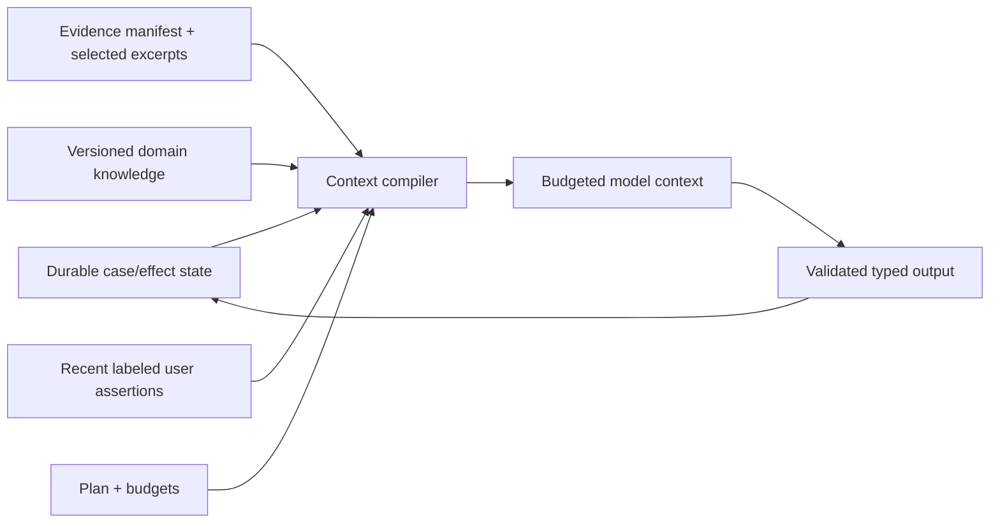

# Diagnostics, Evidence, Context, Memory, and Planning

> **Section index:** [IT Service Desk and Endpoint Support Agent Blueprint](README.md)  
> **Evidence:** [Research packet](../../research/packets/it-service-desk-agent-blueprint.md)

A useful service-desk agent must reason over noisy tickets without treating the reporter's explanation as root cause. The central design is an evidence ledger plus a bounded diagnostic plan. Context is compiled from that state; it is not the state itself.

## Separate the records

| Record | Example | Owner | Can directly authorize an effect? |
|---|---|---|---|
| Observation | “MDM inventory reports VPN client 7.4.2 at 12:20Z” | Evidence broker | No |
| User assertion | “It stopped after yesterday's update” | Intake/user | No |
| Hypothesis | “Client version conflicts with current profile” | Model/human resolver | No |
| Decision | “Collect network profile diagnostic set” | Policy/human workflow | Only after applicable authorization |
| Approval | “User approved diagnostic profile X on device Y until T” | Approval service | Only the exact bound intent |
| Effect | “Collection request dispatched with provider operation P” | Effect broker | It is the attempted side effect |
| Verification | “Artifact arrived from Y and manifest matches profile X” | Independent reconciler | Proves a defined postcondition |
| Outcome | “VPN health check and user connection succeeded” | Case workflow/human | Supports resolution |

Never rewrite a hypothesis into the observation summary or let a model-generated narrative become the effect receipt.

## Evidence contract

```yaml
evidence:
  evidence_id: ev_01K...
  case_id: case_01K...
  kind: endpoint_inventory_observation
  source:
    system: intune
    tenant_id: tenant_7f2
    resource_id: md_57a...
    request_id: provider_req_9d2
    adapter_version: 3.4.1
  query:
    template_id: endpoint-vpn-inventory-v2
    parameters_digest: sha256:...
  observed_at: 2026-08-31T12:20:00Z
  ingested_at: 2026-08-31T12:20:02Z
  freshness:
    source_last_sync_at: 2026-08-31T11:50:04Z
    policy: acceptable_for_diagnosis_not_commit
  coverage:
    status: complete
    requested_fields: [os_version, vpn_version, management_state]
    missing_fields: []
  payload:
    os_version: "provider-returned-value"
    vpn_version: "7.4.2"
    management_state: managed
  trust: authoritative_for_reported_inventory
  sensitivity: internal_endpoint_metadata
  artifact_refs: []
  content_digest: sha256:...
  retention_policy: support-evidence-90d
```

`not_found`, `denied`, `partial`, `stale`, `timed_out`, and `unavailable` are evidence-bearing outcomes. They must not collapse into an empty success result.

## Artifact handling

Tickets and diagnostic bundles can contain credentials, tokens, personal files, browser history, usernames, network addresses, crash dumps, and attacker-controlled text.

1. Quarantine attachments before model access.
2. Verify MIME/content, malware scan, archive depth, decompression size, and parser budget.
3. Store the immutable original under its own ACL and retention policy.
4. Produce a derived manifest and redacted/parsed view with lineage.
5. Retrieve the smallest relevant excerpt; do not inject the whole bundle.
6. Keep secrets and prohibited personal data out of model context and ordinary traces.
7. Route suspected malware or forensic evidence to the security-investigation process.

The normal diagnostic agent never executes attachments, macros, downloaded tools, or commands included in a ticket/knowledge article.

## Diagnostic plan

Use a bounded evidence graph, not an unconstrained to-do list.

```yaml
diagnostic_plan:
  plan_id: plan_01K...
  case_version: 18
  goal: verify_why_corp_vpn_cannot_connect
  stop_conditions:
    - verified_resolution
    - authority_boundary
    - evidence_budget_exhausted
    - repeated_state_without_new_evidence
    - shared_incident_suspected
  budgets:
    max_model_turns: 8
    max_tool_calls: 12
    max_wall_seconds: 180
    max_estimated_cost_usd: "tenant-policy-value"
    max_artifact_bytes_in_context: 32768
  nodes:
    - id: check_known_incident
      kind: deterministic_read
      preconditions: [principal_bound, service_resolved]
      status: complete
      evidence_refs: [ev_incident_none_1]
    - id: inspect_client_and_profile
      kind: model_selected_read
      preconditions: [device_bound]
      status: ready
      allowed_tools: [endpoint.inventory.read, endpoint.telemetry.read_existing]
    - id: decide_next
      kind: model_decision
      status: blocked_on_previous
```

### Planning policy

- Fixed outer workflow: intake → bind → diagnose → propose/ask/escalate → approve if needed → execute externally → verify → resolve/handoff.
- Dynamic inner loop: select among admitted read templates and user questions.
- Replan only after new evidence, contradiction, user update, tool failure, state-version change, or budget pressure.
- Parallelize independent D1 reads only when connector quotas, privacy, and case deadlines allow.
- Serialize on the same device/provider resource and before any D3 action.
- Completion is determined by a deterministic outcome contract, not a `done` token.

## Hypothesis contract

```json
{
  "hypothesis_id": "hyp_7",
  "statement": "The current VPN client version is incompatible with the assigned profile",
  "status": "plausible",
  "supporting_evidence": ["ev_12", "kb_version_481#compatibility"],
  "contradicting_evidence": ["ev_15"],
  "missing_evidence": ["effective_profile_version", "current_error_after_clean_retry"],
  "proposed_discriminator": {
    "kind": "read",
    "tool": "endpoint.profile_status.read",
    "parameters": {"device_ref": "md_57a...", "profile_id": "corp-vpn"}
  },
  "created_by": {"kind": "model", "release_id": "rel_2026_08_31_4"},
  "created_at": "2026-08-31T12:21:00Z"
}
```

Model confidence is not an operational probability unless locally calibrated. Prefer status, evidence coverage, conflicts, and a proposed discriminating check over a free-form percentage.

## Context compiler

Build each model call from typed lanes:

1. **Static contract:** role, boundary, output schema, stop rules, tool catalog digest.
2. **Current authority:** tenant, authenticated principal status, device-binding status, allowed read templates, no-effect reminder.
3. **Authoritative case projection:** state, owner, deadlines, cancellation, approvals/effects summarized from durable records.
4. **Evidence manifest:** compact observation summaries with source, time, freshness, coverage, sensitivity, and artifact references.
5. **Retrieved knowledge:** versioned article/runbook excerpts with applicability metadata and provenance.
6. **User interaction:** minimum recent exchange needed for the current decision, labeled as assertions.
7. **Working hypotheses and plan:** structured current candidates, contradictions, completed/blocked steps, budgets.
8. **Output contract:** next evidence request, user question, proposal, escalation, or conclusion.



Only the validated typed output updates working state. It cannot directly update authoritative identity, approval, or effect records.

## Context selection rules

| Include | Usually omit | Never include |
|---|---|---|
| Current symptom, exact platform/app versions, relevant errors, recent changes, case state, active hypotheses, current KB excerpt | Old greetings, repeated status messages, resolved hypotheses, full inventory, unrelated past tickets, full raw diagnostics | Passwords, recovery codes, TAPs, session secrets, private keys, remote screen stream, unrestricted logs, unrelated users' data |

Use progressive disclosure:

- start with ticket, binding, known incident, inventory, and one or two high-value checks;
- fetch raw artifact excerpts only when a hypothesis requires them;
- summarize large tool results deterministically where possible;
- preserve raw lineage outside context; and
- measure whether each lane improves outcome, not only whether it fits.

## Compaction and continuity

Compaction is a lossy working representation. It must not replace raw events, evidence, approvals, effect ledger, or ticket state.

### Required continuation package

```yaml
continuation_receipt:
  schema_version: 2
  receipt_id: compact_01K...
  created_at: 2026-08-31T12:24:00Z
  case:
    case_id: case_01K...
    aggregate_version: 18
    state: diagnosing
    owner: service-desk-l1
    ticket_ref: jira-service-management|IT-4821
    ticket_version: "provider-updated-at-or-adapter-token"
  event_high_watermark: {partition: tenant_7f2, sequence: 918}
  source_high_watermarks:
    - {system: jira-service-management, stream: IT-4821, cursor: "updated-at-token", observed_at: 2026-08-31T12:23:55Z, gap_status: none_detected}
    - {system: intune, stream: md_57a, cursor: "inventory-observation-token", observed_at: 2026-08-31T11:50:04Z, gap_status: polling_required}
  versions:
    release: rel_2026_08_31_4
    asset_binding: bind_dev_01K...@7
    policy: endpoint-support-policy@31
    tool_catalog_digest: sha256:...
    connector_profiles: [jira-cloud-qualified-2026-08, graph-v1-intune-qualified-2026-08]
    model: provider|resolved-model-version
    context_builder: support-context@3.2.0
    knowledge: [kb_vpn_809@481]
    runbooks: []
  bindings:
    requester: {ref: bind_req_01K...@4, status: bound, expires_at: 2026-08-31T12:40:00Z}
    principal: {ref: bind_principal_01K...@6, status: bound, expires_at: 2026-08-31T12:40:00Z}
    device: {ref: bind_dev_01K...@7, status: bound_but_refresh_before_effect, expires_at: 2026-08-31T12:34:08Z}
  approvals:
    active: []
    revoked_or_expired: [apr_old_01K...]
  consent:
    active: []
    latest_denial_or_withdrawal: null
  effects:
    pending: []
    unknown: []
    last_terminal: null
  remote_sessions:
    active_or_disconnect_unverified: []
  clocks:
    wall_clock_utc: 2026-08-31T12:24:00Z
    monotonic_elapsed_ms_at_receipt: 84211
    time_source: organization-trusted-time
    deadlines_utc: {next_update: 2026-08-31T12:45:00Z, plan_budget: 2026-08-31T12:27:00Z}
  goal: verify_why_corp_vpn_cannot_connect
  verified_observations:
    - ref: ev_12
      summary: "VPN client version 7.4.2 reported by endpoint inventory"
  user_assertions:
    - ref: msg_8
      summary: "Failure began after update"
  hypotheses:
    active: [hyp_7]
    rejected: [hyp_3]
  open_questions: [effective_profile_version]
  next_safe_action:
    kind: read
    tool: endpoint.profile_status.read@2.1
    requires: [replay_events_after_watermark, refresh_ticket, validate_device_binding]
  budgets_remaining: {turns: 4, tools: 7}
  source_refs: [event_1, event_18, ev_12, kb_version_481]
  invariants:
    - no_dispatched_effect_missing_from_ledger
    - no_unknown_effect_omitted
    - no_active_remote_session_omitted
    - no_effect_after_cancel_or_consent_withdrawal
  invariants_hash: sha256:...
  receipt_digest: sha256:canonical-receipt...
```

The receipt is a restart hint, not authority. On resume, verify its digest and schema, replay durable events after the event high-watermark, query each provider after its source cursor, detect gaps, rebuild the projection, and recompute the invariants hash. A provider cursor or timestamp can establish where to reconcile; it cannot prove that no event was dropped. If any pending/`unknown` effect or unverified disconnect exists, reconciliation is the next safe action before model work.

After a long wait or resume, revalidate:

- authenticated session and delegation;
- user/device assignment and enrollment;
- current ticket owner/status/version;
- policy, connector, knowledge, runbook, model, and release compatibility;
- approvals and deadlines; and
- every in-flight or unknown effect.

A clean context reset is preferable when the case changes owner/domain, a prompt-injection attempt occurred, old hypotheses dominate, or a new release cannot safely interpret the old context.

## Memory decisions

Use exactly these seven lifetimes. “Memory” is a retention and authority decision, not a vendor feature name.

| Lifetime | Use and explicit rejection | Retention | Correction and deletion | Poisoning/staleness test |
|---|---|---|---|---|
| **Turn/scratch** | Use for temporary parsing and the minimum current decision package. Reject identity, approval, policy, effect truth, secrets, and anything needed after the call. | Process/call lifetime only; zeroize or let expire immediately. | Discard and regenerate from typed sources; no user-facing history to edit. | Inject prompt text claiming new authority or a completed effect; validated output must ignore it and the next call must not retain it. |
| **Working/run** | Use for the bounded plan, hypotheses, evidence references, tool statuses and budgets. Reject raw durable truth and model-written procedures. | Until run termination or short configured recovery window; reconstructable from durable records. | Supersede a hypothesis/plan by version; delete when the run retention expires without deleting cited source records. | Replay stale/partial/tool-injected results; provenance, case version and coverage checks must block promotion to observation or action. |
| **Session** | Use only for recent conversational continuity in one authenticated case/channel session. Reject it as identity proof, consent, device ownership, or cross-case profile. | Session expiry plus the minimum policy-defined support/debug window; compact aggressively. | User correction becomes a labeled assertion event; delete/redact conversational content under policy while preserving required audit references. | Swap session, tenant or user; cache keys and authorization must prevent retrieval, and a revoked session must force reauthentication. |
| **Durable workflow/task** | Use for case events/projection, bindings, deadlines, approvals, consent, effects, reconciliation and handoff receipts. Reject free-form transcript as the authoritative record. | ITSM/legal/security schedule by record class; never “forever” by default. | Append correction/tombstone and recompute projection; fulfill deletion where allowed while retaining minimal immutable audit/effect evidence required by policy. | Corrupt/reorder/duplicate events or omit an `unknown` effect during compaction; replay, hashes and invariants must detect divergence and stop D3. |
| **Domain knowledge** | Use approved KB articles, service maps, compatibility data, policies and signed runbooks. Reject drafts, withdrawn versions, search snippets and model-generated procedures as executable truth. | Through owner-defined validity/review period; retain withdrawn-version tombstone for reproducibility. | Owner publishes a new immutable version or withdrawal; purge cached excerpts/index entries and propagate tombstone. | Seed a high-ranking malicious article or hash-mismatched runbook; ACL/status/applicability/signature checks must exclude it and invalidate caches. |
| **Long-term/preference** | Default reject for inferred habits, identity, device ownership, health, recovery history or “usual fix.” Optionally use explicit accessibility, language or channel preference when purpose and consent are recorded. | Short purpose-limited TTL with visible expiry; no retention merely to personalize. | User can view, correct, revoke and delete; deletion propagates to indexes/caches/backups under the documented schedule. | Ticket text or one successful case attempts to create a preference; only the trusted preference UI/API and authenticated user can write it. |
| **Episodic/outcome** | Stage 6 only: use de-identified, ACL-governed cases with verified outcomes as offline evaluation/learning candidates. Reject closure, silence, model confidence, provider acceptance and one-off success as outcome truth. | Dataset-specific TTL and review date; provenance to source/consent/legal basis. | Adjudication creates a corrected label/version; delete or quarantine poisoned/source-deleted episodes and derived indexes/models according to lineage policy. | Insert a fabricated success, hidden secret, tenant marker or repeated attacker trajectory; outcome joins, DLP, deduplication, anomaly review and holdout tests must catch it before promotion. |

Do not retrieve prior tickets merely because they involve the same user. A past successful fix may be stale, privacy-sensitive, or evidence of a different device/configuration. If prior-case retrieval is allowed, require purpose, ACL, retention, exact entity binding, provenance, and clear “historical lead” labeling.

## Domain knowledge contract

```yaml
knowledge_item:
  id: kb_vpn_809
  version: 481
  owner: endpoint-networking
  status: approved
  valid_from: 2026-08-10T00:00:00Z
  review_by: 2026-09-10T00:00:00Z
  applies_when:
    platform: windows
    vpn_client: {min: 7.4.0, max_exclusive: 7.5.0}
    error_codes: [809]
  evidence_required: [effective_profile_version, network_reachability_check]
  prohibited_when: [suspected_compromise, shared_outage]
  suggested_user_steps: [runbook_user_vpn_reset_v3]
  remote_action_refs: [runbook_signed_vpn_repair_v2]
  source_refs: [change_record_882, vendor_notice_19]
  acl: support_internal
```

Knowledge retrieval does not authorize the referenced remote action. The runbook must separately pass policy, approval, and current-state verification.

## Stuck detection

Stop or escalate when any condition holds:

- same tool, parameters, and materially same result repeats;
- two consecutive replans produce no new discriminating evidence;
- the model requests a prohibited or unavailable capability;
- evidence sources disagree on identity, target, version, or state;
- no hypothesis can be tested within remaining authority/budget;
- user does not respond before the configured timer;
- shared incident, security, fleet, policy, or account-recovery boundary appears;
- context quality falls after compaction; or
- any D3 effect is unknown or in flight.

The stuck detector is deterministic over plan/evidence/effect records. It does not ask the model whether it is looping.

## Worked diagnostic slice

1. Authenticated user reports VPN error 809; user text remains an assertion.
2. Resolver binds exact principal and one managed device from MDM and asset records.
3. Deterministic check finds no approved shared incident.
4. Model requests current VPN version and effective profile status through D1 tools.
5. Evidence shows a version/profile mismatch and cites an approved KB item.
6. Model proposes `runbook_signed_vpn_repair_v2`; it does not execute it.
7. Policy classifies it D3, refreshes device binding, and renders exact expected disruption and rollback.
8. User/operator approves before expiry; independent verifier checks signature, target, current state, and no incident/security hold.
9. Effect broker dispatches one semantic effect; reconciler observes profile/client state and user connection test.
10. Case closes only after evidence-backed outcome and synchronized ticket transition.

## Evaluation and checklist

- [ ] False-premise tickets can end with “no supported fault found,” not forced diagnosis.
- [ ] A confident reporter cannot outweigh contradictory authoritative evidence.
- [ ] Tool `partial`, `stale`, `denied`, and `unavailable` results remain distinct.
- [ ] Hypotheses cite supporting/contradicting evidence and gaps.
- [ ] Context ablations measure distractor, stale KB, missing evidence, and long-session effects.
- [ ] Compaction preserves state/effect invariants and raw lineage.
- [ ] Secrets and unrelated personal data never enter context or traces.
- [ ] User/account memory is absent by default; optional preferences have consent/delete semantics.
- [ ] Historical episodes cannot silently become procedures or current facts.
- [ ] Planning budgets, repetition detection, cancellation, and escalation are deterministic.

## Sources and related guidance

- [ServiceNow CMDB identification rules](https://www.servicenow.com/docs/r/servicenow-platform/configuration-management-database-cmdb/c_IdentificationRules.html)
- [Microsoft Intune managed-device fields](https://learn.microsoft.com/en-us/graph/api/resources/intune-devices-manageddevice?view=graph-rest-1.0)
- [Microsoft Intune diagnostic collection](https://learn.microsoft.com/en-us/intune/device-management/actions/collect-diagnostics)
- [WorkArena research](https://www.servicenow.com/research/publication/alexandre-drouin-work-icml2024.html)
- [Context engineering](../../context-memory/context-engineering.md)
- [Compaction and continuity](../../context-memory/compaction-and-continuity.md)
- [Memory architecture](../../context-memory/memory-architecture.md)
- [Planning and replanning](../../orchestration/planning-and-replanning.md)
- [Tool results, artifacts, and provenance](../../tools/tool-results-artifacts-and-provenance.md)
