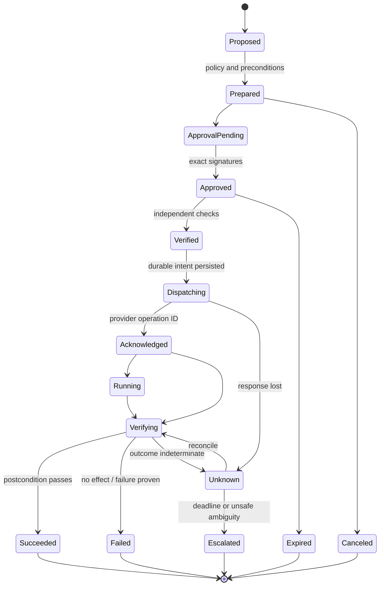

# Remote Support, Remediation, Approvals, and Effects

> **Section index:** [IT Service Desk and Endpoint Support Agent Blueprint](README.md)  
> **Evidence:** [Research packet](../../research/packets/it-service-desk-agent-blueprint.md)

Remote support combines privacy, privileged access, user disruption, device uncertainty, and a tooling category frequently abused by attackers. The agent may assemble evidence and propose a bounded action. It never receives a screen stream, controls the pointer/keyboard, opens a general remote shell, or approves its own proposal.

## Remote action rule

Every remote or identity-sensitive effect requires:

1. an exact canonical intent;
2. a fresh user or accountable operator approval as defined by action policy;
3. expiry, use count, revocation state, and current signer assurance;
4. independent verification of principal, device, policy, target, runbook and preconditions;
5. dispatch through a separate narrow broker;
6. durable provider/effect receipts; and
7. independent postcondition verification and reconciliation.

Approval is not authorization, and provider acceptance is not outcome verification.

## Allowed and prohibited action surfaces

| Action | Normal policy | Boundary notes |
|---|---|---|
| Existing inventory/telemetry read | D1; no new device command | Purpose and field scoped |
| Fresh diagnostic collection | D3 | Exact collection profile, user/privacy notice, artifact destination/retention |
| User-run documented step | D2 communication; user acts locally | Agent provides signed/versioned instruction; no hidden script |
| Device sync/check-in | D3 when remotely initiated by agent path | Exact device; asynchronous verification |
| Restart | D3 | Warn about unsaved work and connectivity; schedule/expiry; verify reboot and recovery |
| Reinstall/repair approved app | D3 | Registered package/runbook, exact version/source, rollback/repair path |
| Signed remediation package | D3 | Fixed code digest and typed parameters; no model-generated command |
| Remote view | D3 | Attended, purpose-limited, authenticated helper/sharer, no model screen access |
| Remote full control/elevation | D3, higher friction | Human helper only; separate modes; user consent; operator role; session audit |
| Device lock/lost mode | D3 but exceptional | Security/fleet owner approval and device verification; may be external handoff |
| Account recovery commit | D3 outside this agent | IAM-owned recovery workflow only |
| Arbitrary shell/script, portable RMM, unattended user-device control | Prohibited | Escalate to endpoint/security owner |
| Wipe, retire, delete, clear passcode on lost device, policy or bulk change | Prohibited/D4 here | Separate fleet/security administrative workflow |

Even a product labels a role “Help Desk Operator,” do not import all of its privileges. Create a custom role/capability where supported and register only actions the organization has approved.

## Proposal contract

```yaml
action_proposal:
  proposal_id: prop_01K...
  case_id: case_01K...
  case_version: 18
  proposer:
    kind: diagnostic_model
    release_id: rel_2026_08_31_4
  target:
    tenant_id: tenant_7f2
    principal_id: idp|subject-4821
    device_provider: intune
    device_id: md_57a...
    binding_id: bind_01K...
  action:
    capability: endpoint.runbook.execute
    runbook_id: signed-vpn-repair
    runbook_version: 2.3.0
    runbook_digest: sha256:...
    parameters:
      profile_id: corp-vpn
      preserve_user_settings: true
  expected_effect:
    summary: "Repair the managed VPN profile; VPN may disconnect for up to the displayed maintenance estimate"
    data_access: [managed_vpn_configuration, runbook_limited_logs]
    disruption: vpn_temporarily_unavailable
  evidence_refs: [ev_12, ev_15, kb_vpn_809_v481]
  preconditions:
    - device_management_state_is_managed
    - no_security_or_incident_hold
    - runbook_applicability_matches
    - no_other_device_effect_inflight
  postconditions:
    - assigned_profile_version_equals_expected
    - vpn_health_check_passes
  fallback: human_endpoint_support
  risk_tier: D3
  proposal_expires_at: 2026-08-31T12:35:00Z
```

The model may only choose a registered runbook and typed parameters within its advertised schema. The policy layer recomputes the tier, display, preconditions, and approvers.

## Exact approval

```json
{
  "approval_id": "apr_01K...",
  "effect_digest": "sha256:canonical-intent...",
  "case_id": "case_01K...",
  "case_version": 18,
  "target": {
    "tenant_id": "tenant_7f2",
    "principal_id": "idp|subject-4821",
    "device_id": "md_57a..."
  },
  "display": {
    "action": "Repair managed VPN profile",
    "runbook": "signed-vpn-repair 2.3.0",
    "data_collected": "limited runbook diagnostic output",
    "expected_disruption": "VPN may disconnect temporarily",
    "rollback_or_fallback": "restore prior managed profile or escalate",
    "remote_mode": "none"
  },
  "required_signers": ["affected_user", "support_operator"],
  "signatures": [
    {
      "role": "affected_user",
      "issuer_subject": "idp|subject-4821",
      "authenticated_at": "2026-08-31T12:25:00Z",
      "signed_at": "2026-08-31T12:26:00Z"
    },
    {
      "role": "support_operator",
      "issuer_subject": "workforce-idp|operator-88",
      "authenticated_at": "2026-08-31T12:24:20Z",
      "signed_at": "2026-08-31T12:26:10Z"
    }
  ],
  "policy_version": "endpoint-support-policy:31",
  "expires_at": "2026-08-31T12:31:10Z",
  "max_uses": 1,
  "status": "approved"
}
```

Required signers vary by action:

| Situation | Required human control |
|---|---|
| User-affine remote view/control | Affected user consent plus authenticated authorized helper/operator |
| Restart or remediation while user is present | Affected user consent; operator approval when policy requires |
| Lost/stolen device where user cannot approve on device | Verified reporter plus endpoint/security owner; no weaker conversational exception |
| Dedicated/kiosk device | Fleet owner under a separate unattended-maintenance policy; normal user-device route prohibited |
| Identity recovery | Recovery-service proof plus authorized recovery operator or policy decision; subscriber notification |
| Privileged/admin account | Higher-assurance IAM/security process; not normal service-desk path |

Never convert silence, inactivity, an earlier broad statement, a ticket field, or the model's interpretation of “go ahead” into approval. Render the approval from canonical fields in a trusted UI separate from ticket/KB content.

## Independent verifier

The verifier is deterministic code and, where required, a separate human role. It must not be the proposing model or a second call to the same model.

```yaml
verification:
  verification_id: ver_01K...
  effect_digest: sha256:canonical-intent...
  checks:
    principal_current: pass
    device_binding_current: pass
    target_tenant_match: pass
    approval_signers_and_assurance: pass
    approval_unexpired_unused: pass
    policy_version_current_or_compatible: pass
    runbook_signature_and_admission: pass
    connector_capability_and_scope: pass
    device_preconditions: pass
    no_concurrent_effect: pass
    no_security_incident_hold: pass
    audit_and_reconciler_healthy: pass
  verifier_release: support-effect-verifier-5.2.0
  checked_at: 2026-08-31T12:27:00Z
  valid_until: 2026-08-31T12:29:00Z
  result: pass
```

Any material change invalidates approval and verification: target, tenant, user/device assignment, mode, runbook or parameters, data collection, destination, expected disruption, policy, case version, signer, or deadline.

## Remote-help session contract

NIST SP 800-53 MA-4 calls for approving and monitoring nonlocal maintenance, strong authentication, records, and termination; enhancements cover per-session approval and disconnect verification. Microsoft Remote Help illustrates product controls such as authenticated helper/sharer identities, RBAC-separated view/control/elevation modes, user consent, and session metadata. These support an implementation but do not prove the application's complete control.

### Prepare

- exact helper/operator identity and current support role;
- exact sharer principal and device;
- session purpose and linked case;
- view-only, full-control, or elevation mode;
- allowed duration and expiry;
- permitted data handling and recording policy;
- user-visible notice and stop/takeover controls; and
- platform limitations, including enrollment/support status.

### During

- human helper controls the session; model is not a participant;
- sharer can see helper identity and active mode;
- mode upgrades require a new exact consent/approval;
- credentials are entered through approved secure mechanisms, never chat/model;
- the session cannot install another RMM tool or establish persistence;
- operator records material actions as structured events or selected runbook references;
- clipboard, file transfer, elevation, and screen capture follow separate policy; and
- security indicators end the support session and trigger security handoff.

### End

- helper ends session; user may end at any time;
- platform session ID/end timestamp/mode are captured;
- session and network disconnect are independently checked;
- temporary capabilities and secrets are revoked;
- no agent job retains screen, clipboard, or keystroke access;
- performed actions and unknowns are reconciled; and
- user-visible outcome is verified.

### Session schema

```yaml
remote_session:
  session_id: rhs_01K...
  case_id: case_01K...
  platform: approved-remote-help
  provider_session_id: opaque-provider-id
  sharer_principal: idp|subject-4821
  device_id: md_57a...
  helper_principal: workforce-idp|operator-88
  mode: view_only
  purpose: diagnose_vpn_ui_state
  approval_id: apr_01K...
  started_at: 2026-08-31T12:30:00Z
  ended_at: 2026-08-31T12:38:00Z
  disconnect_verified_at: 2026-08-31T12:38:04Z
  actions:
    - kind: user_guided_check
      runbook_step_ref: vpn-check-v3#4
  recording:
    content_recorded: false
    metadata_receipt_ref: provider-audit-552
  status: terminated_verified
```

Provider audit may be incomplete. Current Intune documentation, for example, states that Remote Help session reports retain helper/sharer/device/time/control metadata for a period but do not record screen images or keystrokes, and that Windows elevation capability is not included in that report. The application must record its own approval, mode request, and operator actions without creating a second uncontrolled screen-recording store.

## Worked flow: attended view, consented control, and delayed audit

1. An authenticated portal session resolves the requester, affected principal and exact managed Windows device. The remote-platform qualification receipt proves the helper/sharer combination is supported in this tenant and the helper's effective role is limited to view/control.
2. The model proposes **view only** with purpose, device, helper queue, expected exposure and ten-minute expiry. A trusted UI renders the canonical intent; the user consents and an authorized helper accepts.
3. A launcher passes opaque case/session correlations to the approved platform. Both people authenticate; the platform presents the actual helper identity and mode. The agent never receives a join secret or screen stream.
4. The helper determines that pointer control is necessary. View consent cannot be reused: application policy creates a new full-control intent and the user approves the mode upgrade in the trusted flow before the helper requests it in the platform.
5. The helper follows a cited runbook step. File transfer, clipboard, credential capture, shell/toolbox and elevation remain disabled. If any excluded capability appears, end the session and open a security/connector incident.
6. The user ends the session. The application records `termination_requested`, revokes its launch capability and independently checks provider/endpoint connection state. A delayed provider report leaves the case in `disconnect_verification_pending`; it does not close.
7. When the provider report arrives, reconcile provider session ID, participants, device, start/end and control mode with application events. Provider omission of elevation or on-screen actions remains an explicit audit limitation, not a fabricated “none occurred” value. If disconnect is still unprovable at the safety deadline, disable the helper capability and escalate.

This flow must be adapted, not copied across products. ScreenConnect permissions such as unattended consent bypass, out-of-session command, toolbox/file transfer and credential handling are independent and must be removed from the admitted role. TeamViewer report/event coverage depends on license, policy, device assignment, supporter authentication and logging configuration. Microsoft Remote Help has its own tenant, platform, scope-group and reporting constraints. Product documentation narrows the test plan; only the live tenant proves the effective path.

## Endpoint runbook contract

```yaml
runbook:
  id: signed-vpn-repair
  version: 2.3.0
  owner: endpoint-networking
  artifact_digest: sha256:...
  signer: endpoint-runbook-signing-key-4
  supported:
    platform: windows
    os_range: organization-qualified-range
    management_modes: [corporate_managed]
  input_schema:
    profile_id: {type: string, enum: [corp-vpn]}
    preserve_user_settings: {type: boolean, const: true}
  reads:
    - managed_vpn_profile
    - runbook_limited_event_channel
  effects:
    - reinstall_managed_profile
    - restart_vpn_service
  prohibited:
    - arbitrary_command
    - credential_read
    - user_document_read
    - software_download_from_unapproved_origin
    - reboot
  preconditions:
    - profile_is_managed
    - no_active_remote_session
  postconditions:
    - expected_profile_version
    - service_running
  compensation: restore_previous_managed_profile
  timeout_seconds: 120
  max_output_bytes: 8192
  privacy_class: endpoint_configuration
  approval_profile: affected-user-and-operator
  status: admitted
```

Runbooks are created, reviewed, signed, tested, and promoted by endpoint engineering. The agent can select only an admitted version and parameters. Endpoint tools may run with powerful local context: current Intune Remediations documentation warns that unsigned scripts can use a bypass execution policy and says not to include passwords or personal data. This blueprint therefore requires organizational signature/admission even if a vendor console defaults otherwise.

## Effect lifecycle



Persist `Dispatching` with the full immutable intent before the provider call. A worker crash after provider acceptance must resume in reconciliation, not create a new intent.

## Idempotency and fencing

Use a semantic effect ID based on tenant, case, target immutable ID, action/runbook version, parameters, and desired postcondition—not a transport request UUID alone.

```text
effect_id = H(
  tenant_id,
  case_id,
  canonical_target_id,
  capability,
  runbook_version,
  canonical_parameters,
  desired_postcondition
)
```

- Store one intent per effect ID; changed parameters require a new effect ID and approval.
- Pass provider idempotency/correlation keys only where the provider explicitly supports them.
- When no provider idempotency exists, serialize per target, query prior provider/audit state, and verify postcondition before any retry.
- Fence stale workers with case/effect version and per-device lease epoch.
- Do not run two remediation/remote actions concurrently on one device.
- Treat batch selectors as separate per-device effects plus a parent batch; this blueprint normally prohibits broad batches.

## Connector-specific postcondition lessons

| Provider behavior | Consequence |
|---|---|
| Intune documents that a completed delete action can be server-side completion without proving the client finished retirement | Never equate console/API status with endpoint outcome; destructive action remains out of scope |
| Apple MDM uses a command UUID and can return `Acknowledged`, `Error`, or `NotNow` | Match command UUID; retry `NotNow` only under provider/runbook rules; verify user-visible postcondition |
| Android Management `issueCommand` returns an Operation and commands can expire or require/receive user action | Persist operation; respect expiry and denial; query until a bounded terminal state |
| Remote Help session report omits content and some mode detail | Store application approval/mode/action metadata; do not claim full replay |
| Endpoint is offline, so a command may wait or expire | Approval/intent expiry must prevent a late unwanted action; reconcile before reissue |

## Cancellation

Cancellation stops new work but cannot erase an already committed provider effect.

1. Mark case/effect cancellation requested with actor and reason.
2. Stop model, queued reads, and undispatched effects.
3. Revoke unused approvals and short-lived capabilities.
4. Ask provider to cancel when supported.
5. End active remote session and verify disconnect.
6. Reconcile dispatched/running/unknown operations.
7. Compensate only through a separately authorized tested runbook.
8. Emit a truthful terminal state: canceled-no-effect, canceled-after-effect, or canceled-with-unknown-effect.

## Failure matrix

| Failure | Detection | Retry safe? | State and response |
|---|---|---|---|
| Approval expired before dispatch | Clock/policy check | No | Rebuild proposal from fresh state |
| Device reassigned after approval | Binding version mismatch | No | Invalidate and rebind |
| Worker dies before provider call | No dispatch attempt/receipt | Yes under same effect/fence | Resume dispatch after full revalidation |
| Provider accepted; response lost | Dispatch timestamp, no receipt | Unknown | Query provider/audit/postcondition; no blind retry |
| Device offline | Provider pending or stale last-sync | Not until deadline policy | Wait bounded; expire/cancel and inform user |
| User rejects or ends remote session | Platform/user event | No automatic retry | Respect denial; offer manual alternative |
| Remote mode unexpectedly elevates | Platform/agent observation | No | End session, contain capability, security review |
| Runbook output exceeds/redacts poorly | Broker limit/DLP | No | Quarantine output; fail action; privacy/security review |
| Action succeeds but ledger write fails | Provider op/audit exists without local terminal receipt | Reconcile only | Rebuild receipt from provider/postcondition |
| Postcondition fails after acknowledged action | Independent check | Depends on runbook | Mark failed/partial; human decides compensation/escalation |
| Disconnect cannot be verified | Session/connection check absent | No | Security/operations escalation; do not close |

## Anti-patterns

| Anti-pattern | Failure | Replacement |
|---|---|---|
| “Would you like me to fix it?” | Does not state target, data, mode, disruption or expiry | Typed exact-effect approval |
| Remote code generated from ticket text | Injection and arbitrary privilege | Signed versioned runbook catalog |
| Generic `run_powershell(device, command)` | D4-equivalent reach | Narrow endpoint capability adapter |
| Remote desktop controlled by the model | Crosses into unrestricted computer use | Human helper; agent sees only structured session metadata |
| Provider says completed, close ticket | Async/server-side status may not prove endpoint state | Postcondition reconciliation |
| Retry on timeout | Can duplicate or execute after user withdrew intent | Unknown state and reconciliation |
| Store screenshots “for audit” by default | Creates sensitive surveillance store | Metadata/action ledger; content capture only under explicit policy |
| Unattended access to user-affine devices | Removes meaningful consent and broadens persistence | Attended support; dedicated-device exception owned by fleet policy |

## Go-live checklist for one D3 action

- [ ] Exact capability, platform, runbook, parameters, target and postcondition are fixed.
- [ ] Required user/operator signers and assurance are documented.
- [ ] Approval display is trusted, complete, expiring, single-use and revocable.
- [ ] Independent verifier rechecks binding, policy, signature, state and concurrency.
- [ ] Effect broker has only the action-specific scope and no model-accessible credential.
- [ ] Pre-dispatch durability, semantic idempotency, fencing and provider correlation work.
- [ ] Offline, timeout, lost response, duplicate delivery, cancellation and stale approval tests pass.
- [ ] Provider acknowledgement and actual endpoint postcondition are distinct.
- [ ] Compensation/fallback is real and tested; otherwise the limitation is shown.
- [ ] Audit gaps, privacy handling, kill switch and manual path are approved.

## Sources and related guidance

- [NIST SP 800-53 Rev. 5.1, MA-4 and AC-5/AC-6](https://csrc.nist.gov/pubs/sp/800/53/r5/upd1/final)
- [Microsoft Intune Remote Help planning](https://learn.microsoft.com/en-us/intune/remote-help/plan)
- [Microsoft Intune Remote Help monitoring](https://learn.microsoft.com/en-us/intune/remote-help/troubleshoot)
- [Microsoft Intune device actions](https://learn.microsoft.com/en-us/intune/device-management/actions/)
- [Microsoft Intune Remediations](https://learn.microsoft.com/en-us/intune/device-management/tools/deploy-remediations)
- [ConnectWise ScreenConnect role permissions](https://docs.connectwise.com/ScreenConnect_Documentation/Get_started/Administration_page/Security_page/Define_user_roles_and_permissions/List_of_role-based_security_permissions)
- [TeamViewer auditability and event-log behavior](https://www.teamviewer.com/en/global/support/knowledge-base/teamviewer-tensor/security/auditability-event-log/)
- [Apple MDM command processing](https://developer.apple.com/documentation/devicemanagement/sending-mdm-commands-to-a-device)
- [Apple passcode management warning](https://developer.apple.com/documentation/devicemanagement/managing-passcodes)
- [Android Management API device commands](https://developers.google.com/android/management/reference/rest/v1/enterprises.devices/issueCommand)
- [Idempotency and side effects](../../reliability/idempotency-and-side-effects.md)
- [Computer-use action policy](../computer-use-agent/actions-policy-and-irreversible-effects.md)
