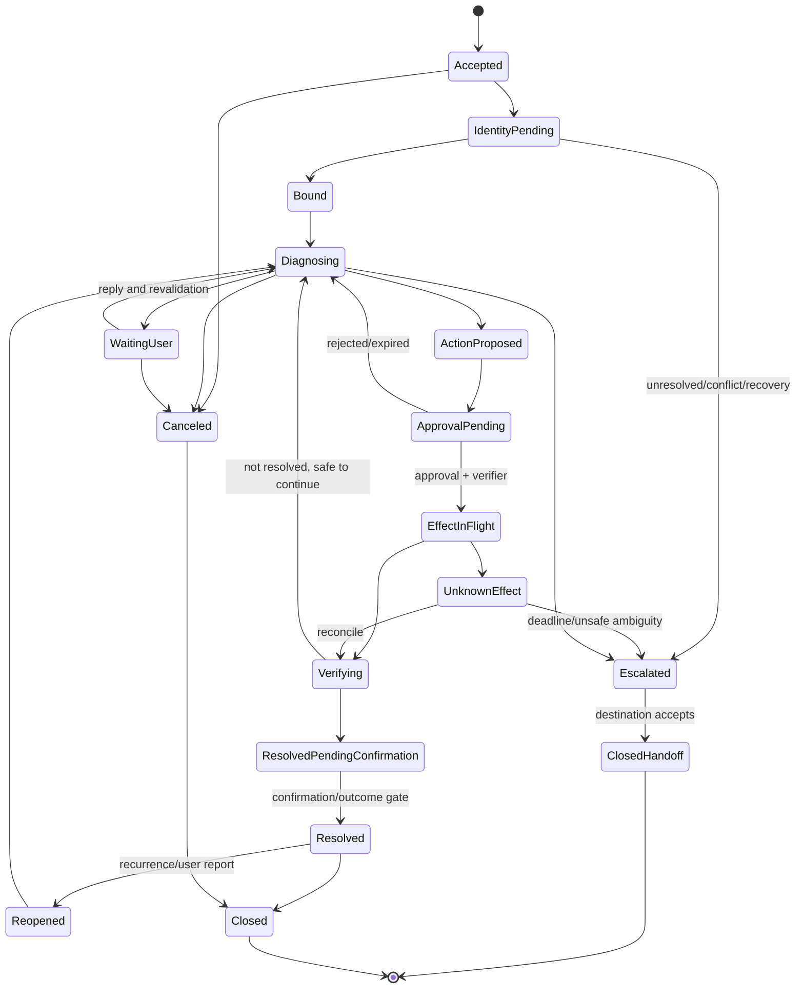

# Case State, Reliability, Reconciliation, and Escalation

> **Section index:** [IT Service Desk and Endpoint Support Agent Blueprint](README.md)  
> **Evidence:** [Research packet](../../research/packets/it-service-desk-agent-blueprint.md)

The case workflow coordinates multiple systems of record. It must survive duplicate events, manual edits, long waits, connector outages, process crashes, cancellations, and effects whose outcome is unknown. A chat transcript cannot provide these guarantees.

## State ownership

| State | Authoritative owner | Local treatment |
|---|---|---|
| Ticket status, assignment, SLA and user-visible comments | ITSM system | Versioned projection; map provider states; re-read after write |
| Agent run/step/budget/cancellation | Agent runtime store | Authoritative for orchestration |
| User/account identity and authentication methods | Directory/IdP/recovery service | Fresh referenced facts; never model memory |
| Device inventory, enrollment and action status | MDM/EMM/RMM/CMDB as designated | Source-specific observations with freshness |
| Diagnostic artifacts | Controlled artifact store | Immutable original plus derived lineage |
| Approval | Approval service | Immutable digest, signer, expiry, use/revocation |
| Effect intent and reconciliation | Effect ledger plus provider state | Durable application record joined to provider receipt/postcondition |
| Knowledge/runbooks | Approved knowledge/runbook registries | Versioned retrieved evidence, not case truth |
| Remote session | Remote-help platform plus application session record | Reconcile identity/mode/time/disconnect |

The application is the authoritative coordinator, not a replacement for every domain source. Conflicts remain visible and block unsafe transitions.

## Canonical case state

```yaml
support_case:
  case_id: case_01K...
  tenant_id: tenant_7f2
  version: 18
  itsm:
    provider: jira-service-management
    request_id: IT-4821
    provider_version: "updated-at-or-adapter-token"
    mapped_status: diagnosing
  channel_assurance: authenticated
  requester_binding_id: bind_01K...
  affected_account_id: acct_91a...
  device_binding_id: bind_dev_01K...
  service_id: corp-vpn
  state: diagnosing
  owner:
    kind: agent_with_human_queue
    queue: service-desk-l1
    operator_id: workforce-idp|operator-88
  severity: user_impact_standard
  deadlines:
    response_at: 2026-08-31T12:15:00Z
    next_update_at: 2026-08-31T12:45:00Z
    resolution_target_at: 2026-08-31T16:00:00Z
  diagnostic_plan_id: plan_01K...
  evidence_refs: [ev_12, ev_15]
  active_proposal_id: null
  active_approval_ids: []
  active_effect_ids: []
  unknown_effect_ids: []
  wait:
    reason: null
    wake_at: null
  release_id: rel_2026_08_31_4
  retention_policy: internal-support-standard
```

Provider-version semantics vary. Where no conditional-write token is available, the adapter records the last observed provider timestamp/fields, acquires a per-case writer lease, re-reads immediately before transition, rejects unexpected changes, writes, then re-reads and records the observed result.

## Lifecycle



`On Hold` or equivalent provider states need explicit reasons such as awaiting caller, vendor, change, problem, approval, recovery, or endpoint check-in. ServiceNow's current incident model similarly distinguishes New, In Progress, On Hold, Resolved, Closed, and Canceled. Map semantics rather than copying names.

## Transition rules

| From → to | Preconditions | Transition owner | Required event/evidence |
|---|---|---|---|
| Accepted → IdentityPending | Intake persisted and deduplicated | Workflow | `case.accepted` |
| IdentityPending → Bound | Principal and required device/account bindings unique/current | Resolver/workflow | Binding refs and `binding.completed` |
| Bound → Diagnosing | Read policy and tool catalog admitted | Workflow | Plan created |
| Diagnosing → WaitingUser | Exact question and timer | Model proposes; workflow commits | User-visible message receipt |
| Diagnosing → ActionProposed | Evidence supports registered action; no hard stop | Model proposes; validator commits | Proposal schema and evidence refs |
| ApprovalPending → EffectInFlight | Exact approval and independent verification valid at dispatch | Effect controller | Intent persisted, approval/verifier refs |
| EffectInFlight → Verifying | Provider acknowledged/applied or timeout triggers observation | Reconciler | Provider operation or dispatch record |
| Any effect state → UnknownEffect | Commit/absence cannot be proven | Reconciler | Ambiguity reason and next query/deadline |
| Verifying → ResolvedPendingConfirmation | Defined technical postconditions pass | Reconciler/workflow | Verification evidence |
| ResolvedPendingConfirmation → Resolved | User confirmation or approved independent outcome rule | Human/workflow | Accountable closure actor and outcome |
| Diagnosing → Escalated | Boundary/stuck/severity/owner condition | Workflow/human | Typed escalation package |
| Escalated → ClosedHandoff | Destination accepts ownership | Destination/human | Handoff acceptance receipt |

The model cannot commit any transition. It returns a typed recommendation that application rules validate.

## Event envelope

Use an append-only envelope compatible with the repository's canonical state guidance and optionally map it to CloudEvents 1.0 metadata:

```json
{
  "event_id": "evt_01K...",
  "event_type": "support.effect.unknown.v1",
  "occurred_at": "2026-08-31T12:30:20Z",
  "ingested_at": "2026-08-31T12:30:21Z",
  "tenant_id": "tenant_7f2",
  "case_id": "case_01K...",
  "case_version": 22,
  "run_id": "run_01K...",
  "effect_id": "eff_sha256...",
  "actor": {
    "human_principal": "workforce-idp|operator-88",
    "workload_identity": "svc|support-effect-broker|build-5.2.0"
  },
  "trace_id": "trace-opaque",
  "release_id": "rel_2026_08_31_4",
  "policy_version": "endpoint-support-policy:31",
  "payload": {
    "reason": "provider_response_lost_after_dispatch",
    "provider_operation_ref": null,
    "reconcile_after": "2026-08-31T12:32:20Z"
  },
  "schema_version": 1
}
```

Core event families:

- `case.accepted`, `case.deduplicated`, `case.owner_changed`, `case.canceled`, `case.reopened`;
- `principal.binding.*`, `device.binding.*`, `account.binding.*`;
- `evidence.requested`, `evidence.observed`, `evidence.partial`, `artifact.quarantined`;
- `hypothesis.proposed`, `hypothesis.rejected`, `plan.updated`, `budget.exhausted`;
- `action.proposed`, `approval.requested`, `approval.granted`, `approval.rejected`, `approval.expired`, `approval.revoked`;
- `verification.passed`, `verification.failed`;
- `effect.dispatching`, `effect.acknowledged`, `effect.verified`, `effect.failed`, `effect.unknown`, `effect.compensated`;
- `remote_session.started`, `remote_session.mode_changed`, `remote_session.ended`, `remote_session.disconnect_verified`;
- `recovery.handoff_created`, `recovery.completed`, `recovery.denied`, `recovery.unknown`, `recovery.notification_sent`;
- `case.escalation_created`, `case.handoff_accepted`, `case.resolved`, `case.closed`.

Events contain references and redacted fields, not raw prompts, diagnostic bundles, credentials, or screen content.

## Concurrency and fencing

Use three independent controls:

1. **Case version:** compare-and-swap for workflow decisions.
2. **Per-device effect lease/fence:** one effect session for a device; stale worker epochs cannot dispatch.
3. **Provider state precondition:** re-read provider/target immediately before a write and observe after.

Manual support staff remain first-class writers. If an operator updates the ticket while a model step runs, the step result is stale and must be revalidated or discarded. Never let an agent overwrite a manual assignment, resolution, sensitive flag, or new user comment with an older projection.

## Deduplication

There are three different duplicates:

| Duplicate | Key/evidence | Response |
|---|---|---|
| Delivery duplicate | Provider webhook/event ID | Store once; acknowledge repeat |
| Ticket duplicate | Same tenant/principal/device/service/symptom/time plus human review/rule | Link/merge under ITSM policy; preserve both sources |
| Effect duplicate | Semantic effect ID and exact intent | Return prior state/receipt; reject changed parameters |

Do not auto-merge security/recovery cases or tickets involving different principals/devices merely because text is similar.

## Retry policy

| Operation | Retry |
|---|---|
| Pure local validation/read | Bounded on transient failure within deadline |
| ITSM/Graph/ServiceNow/Jira/Zendesk read | Honor provider status and `Retry-After`; jittered backoff; stop at task deadline |
| Webhook processing | Idempotent queue delivery; poison-message quarantine |
| Ticket write | Retry only with same intent after checking current ticket/provider state |
| Remote/endpoint effect | Never blind retry; reconcile effect ID/provider state/postcondition first |
| User notification | Stable message ID and delivery reconciliation; avoid duplicate sensitive messages |
| Model call | Retry only transport/provider failures; do not treat malformed/unsafe output as identical transient failure indefinitely |

The case communicates a truthful delay rather than holding an interactive connection during long backoff.

## Unknown outcome protocol

1. Block new effects on the same device/account/case.
2. Preserve dispatch time, exact intent, connector release, credential handle, request/trace IDs, and all received bytes/status.
3. Query provider operation/audit/event history by stable identifier where available.
4. Observe domain postcondition independently.
5. Classify as `verified`, `failed_not_committed`, `still_running`, or `unknown`.
6. Retry only after absence is proven and the original intent/approval remains valid; normally require a new approval after material delay.
7. Escalate when the reconciliation deadline or risk threshold is exceeded.
8. Record any compensation as a new effect linked to the original.

### Effect ledger

| Field | Purpose |
|---|---|
| `effect_id` | Semantic deduplication and join key |
| `canonical_intent_digest` | Proves parameters did not change |
| `case/device/account/version` | Target and concurrency context |
| `approval_ids` and `verification_id` | Human control and independent checks |
| `dispatch_attempts` | Transport history, not effect count |
| `provider_operation_refs` | External reconciliation |
| `state` | Proposed through verified/failed/unknown/compensated |
| `postcondition_spec` and evidence | Outcome proof |
| `deadline`, `cancel`, `compensation` | Recovery semantics |

## Worked flow: accepted action, lost response, and ITSM throttling

Assume a signed single-device VPN repair passed approval and independent verification. This is a partial-provider failure, not a reason to restart the whole workflow:

| Time | Evidence | Durable decision | User/owner behavior |
|---|---|---|---|
| T0 | Intent and fence are committed as `dispatching`; no provider call yet | Effect ledger is the authority that one attempt may start | Trusted UI shows “starting,” not “fixed” |
| T1 | Endpoint provider receives the request, but the client times out before a usable operation reference is stored | State becomes `unknown`; record bytes/status/request IDs and block the device fence | Do not retry or offer another action |
| T2 | Attempt to write the status note to ITSM receives 429 with `Retry-After`; the notification provider accepts a stable message ID | ITSM projection records `sync_pending`; schedule the same semantic note after backoff; notification acceptance is not delivery | User sees a truthful delayed/unknown message through the available channel; case ownership is unchanged |
| T3 | Worker restarts from the continuation receipt; provider webhook subscription also has a detected gap | Replay events, re-read ticket, query action/audit history and endpoint state; model remains paused | Reconciler owns the case until ambiguity clears |
| T4 | Provider history suggests the action ran, but only profile version—not VPN health—is observable | `still_running` or `not_verified`, never success; wait for device/user postcondition within deadline | Ask for the predefined authenticated connection check only after endpoint state is current |
| T5a | Expected profile and health pass; authenticated user connects | Mark effect `verified`; write ITSM note with safe concurrency and re-read; then enter resolution confirmation | Close only after the outcome contract passes |
| T5b | Absence of action is proven while the original approval has expired | Mark `failed_not_committed`; build a fresh proposal/approval if still appropriate | Explain that no verified repair occurred |
| T5c | Provider/audit/postcondition remain inconclusive at deadline | Keep `accountable_unknown`; route to connector/endpoint owner with exact intent and attempt evidence | No same-device effect and no resolved status until an owner reconciles |

Each provider recovers independently. An ITSM outage must not cause a duplicate endpoint effect; endpoint uncertainty must not be hidden because notification succeeded; a missing webhook must not prevent polling/reconciliation from authoritative state. When the ITSM service returns, compare its current owner/status/comment history before writing so a delayed agent note cannot overwrite human action.

## Cancellation and abandonment

Case cancellation:

- stops the model and new reads/effects;
- revokes pending approvals/capabilities;
- sends provider cancellation when supported;
- still reconciles in-flight or unknown effects;
- ends and verifies remote sessions;
- records user/operator actor and reason;
- informs the ITSM source without overwriting a newer manual state; and
- does not delete evidence required by retention/security policy.

Waiting-user cases expire through policy, but user silence does not prove resolution. Terminal outcomes distinguish canceled, abandoned/no response, resolved, handoff accepted, and failed/unknown.

## Escalation taxonomy

| Trigger | Destination | Agent stops doing |
|---|---|---|
| Account recovery, authenticator/factor change, account conflict | IAM/recovery team | Identity questioning or credential action |
| Risky sign-in, social engineering, malware, lost/stolen, unauthorized RMM | Security investigation/endpoint security | Normal remediation and remote help |
| Multiple users/shared service or outage evidence | Incident/SRE/application/network owner | Per-device fixes that may mask/amplify incident |
| MDM policy, enrollment, fleet software, bulk change, wipe/retire | Endpoint engineering/fleet admin | Any action proposal beyond evidence package |
| Network routing/DNS/certificate/VPN gateway | Network operations | Endpoint-only root-cause claim |
| Application defect | Application/product owner | Repeated reinstall/repair without evidence |
| CMDB/device/user assignment conflict | Asset/CMDB/HR/IAM data owner | Device effect |
| Ambiguous/unknown effect | Service-desk lead plus connector owner | New effect on same target |
| Accessibility, language, or recovery exception | Trained human/redress owner | Automated denial loop |

## Escalation package

```yaml
escalation:
  escalation_id: esc_01K...
  case_id: case_01K...
  destination: network-operations
  reason_code: shared_vpn_gateway_suspected
  severity: organization_mapped_value
  affected:
    principal_ref: idp|subject-4821
    device_ref: intune|md_57a...
    service_ref: corp-vpn
  timeline_refs: [evt_1, evt_18, evt_29]
  observations:
    - ref: ev_12
      summary: "Local client and profile meet approved baseline"
    - ref: ev_shared_3
      summary: "Three independently bound cases report same gateway error window"
  user_assertions:
    - ref: msg_8
      summary: "Failure began around 11:40 local time"
  hypotheses:
    supported: [gateway_or_upstream_reachability]
    rejected: [client_version_mismatch]
  actions:
    completed: [local_health_check]
    in_flight: []
    unknown: []
  approvals: []
  open_questions: [gateway_health, route_change]
  sensitive_artifacts: [artifact_ref_with_acl]
  requested_owner_action: accept_and_correlate_incident
  accepted_by: null
  handoff_deadline: 2026-08-31T12:50:00Z
```

Do not include hidden chain-of-thought. Provide observations, references, hypotheses, decisions, effects, unknowns, and the exact requested action.

## Resolution and closure

Technical verification and user experience can differ. Define an outcome contract per workflow:

| Workflow | Technical postcondition | User/business postcondition |
|---|---|---|
| VPN repair | Expected profile/client/service health | Authenticated user completes a connection test |
| App repair | Approved version installed and process health passes | User completes agreed task without recurrence during verification window |
| Remote help | Session terminated/disconnected; material actions recorded | User confirms support outcome/next step |
| Recovery | IAM provider receipt, authenticator state, subscriber notification | User completes fresh sign-in; suspicious recovery routes to security |
| Escalation | Destination accepts ownership and artifact ACLs work | User receives truthful owner/next update expectation |

Never close because the model wrote a resolution, the API returned 2xx, a script exited zero, or the user stopped responding. Reopen rate and recurrence are evaluation signals, not evidence to hide.

## Reliability and failure-injection checklist

- [ ] Kill worker before and after every state write and provider dispatch.
- [ ] Deliver every webhook twice and out of order.
- [ ] Change ticket owner/status while the model is running.
- [ ] Reassign the device during approval wait.
- [ ] Revoke session, role, connector scope, or runbook before dispatch.
- [ ] Return 429 with and without `Retry-After`, long 5xx, timeout, and malformed partial results.
- [ ] Accept provider effect then lose response and ledger terminal write.
- [ ] Keep device offline past approval/effect expiry.
- [ ] Cancel before dispatch, during remote session, after provider acceptance, and during verification.
- [ ] Fail audit exporter, evaluator, notification, artifact store, and ITSM update independently.
- [ ] Lose webhook subscription and recover through reconciliation.
- [ ] Verify one final case outcome and no duplicate effect after every scenario.

## Sources and related guidance

- [ServiceNow incident lifecycle](https://www.servicenow.com/docs/r/it-service-management/incident-management/c_IncidentManagementStateModel.html)
- [Jira Service Management request/status/transition APIs](https://developer.atlassian.com/cloud/jira/service-desk/rest/api-group-request/)
- [Zendesk safe ticket updates](https://developer.zendesk.com/documentation/ticketing/managing-tickets/creating-and-updating-tickets/)
- [Jira Cloud webhook retry semantics](https://developer.atlassian.com/cloud/jira/platform/webhooks/)
- [Microsoft Graph webhook delivery and gap behavior](https://learn.microsoft.com/en-us/graph/change-notifications-delivery-webhooks)
- [CloudEvents specification](https://github.com/cloudevents/spec/tree/ce%40v1.0.2)
- [Agent state and event contracts](../../runtime/agent-state-and-event-contracts.md)
- [Durable execution](../../runtime/durable-execution.md)
- [Failure taxonomy](../../reliability/failure-taxonomy.md)
- [Idempotency and side effects](../../reliability/idempotency-and-side-effects.md)
