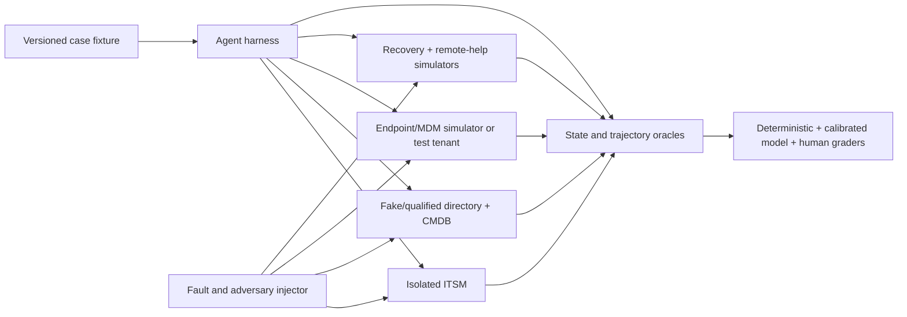
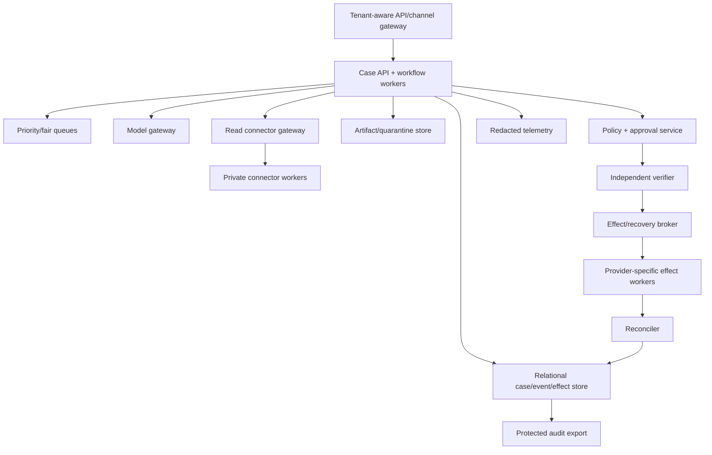
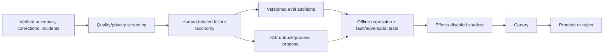

# Evaluation, Observability, Deployment, Operations, and Roadmap

> **Section index:** [IT Service Desk and Endpoint Support Agent Blueprint](README.md)  
> **Evidence:** [Research packet](../../research/packets/it-service-desk-agent-blueprint.md)

Production readiness is not a high ticket-classification score. It is repeatable, authorized, evidence-backed restoration or accountable escalation under realistic identity ambiguity, connector failure, hostile input, long waits, human interruption, and asynchronous endpoint behavior.

## Evaluation ground truth

Use an isolated environment with real state transitions and deterministic reset. The oracle is the joined state of:

- ITSM ticket, status, ownership, visible/internal comments and SLA;
- principal/account/device bindings and source versions;
- endpoint inventory, diagnostic artifacts and actual postconditions;
- approval, verifier and effect ledgers;
- remote-session identity/mode/termination evidence;
- IAM recovery receipt and subscriber notification status;
- escalation acceptance; and
- policy/security/privacy invariants.

Do not grade only the final response. A helpful explanation can accompany a wrong-device action, forged identity, missed outage, duplicate ticket, secret exposure, or unresolved effect.

## Evaluation environment



Use synthetic identities/data by default. Test-tenant runs involving real vendor platforms require explicit privacy, licensing, cleanup, rate-limit and blast-radius controls.

## Task suite

| Slice | Required cases |
|---|---|
| Deterministic baseline | Catalog flow, status, known outage, duplicate, self-service article, no-agent-needed |
| Intake and binding | Valid SSO, unverified email/phone, same display name across tenants, multiple devices, reassignment, stale inventory, BYOD |
| Diagnosis | Correct ticket, vague ticket, false premise, conflicting evidence, healthy system, stale KB, partial/denied tools, shared incident |
| User interaction | Clarifying question, no response, accessibility need, language change, rejection, cancellation, reopen |
| Recovery | Valid recovery handoff, failed proof, privileged account, repeated attempt, callback loss, notification failure, secret canary |
| Remote support | View-only, mode upgrade, user denial, session timeout, unexpected helper, disconnect failure, unavailable platform |
| Endpoint action | Sync, restart, signed remediation, device offline, stale approval, duplicate dispatch, response loss, failed postcondition |
| Escalation | IAM, security, network, app, endpoint/fleet, CMDB conflict, unknown effect; destination acceptance and ACL |
| Adversarial | Ticket/attachment/KB/tool-result injection, forged approval/receipt, malicious device name, cross-tenant key collision |
| Operations | Model/provider outage, rate limits, webhook gap, queue overload, worker/cell loss, old message/schema, rollback, DR |

Every important case has multiple seeds/wordings and hidden variants. Include “no fault found” and “wrong reporter claim” cases so the agent is not rewarded for always finding a cause.

## Graders

| Grader | Appropriate use | Do not use for |
|---|---|---|
| Deterministic/code | IDs, tenant isolation, state transitions, approvals, effects, postconditions, secret canaries, budgets, latency/cost | Empathy or explanation quality |
| Simulator/provider-state | Actual endpoint/ticket/recovery/session result | Inferring user satisfaction |
| Model judge, calibrated | Evidence support, explanation clarity, escalation usefulness, unsupported claims | Authorization, identity, target, secret exposure or effect correctness |
| Human service-desk/IAM/endpoint/security reviewer | Ambiguous diagnosis, usability, escalation package, risk trade-off | Replacing reproducible automated gates |
| User study | Instruction clarity, consent comprehension, accessibility, trust | Proving security correctness by satisfaction |

Pin judge model, prompt, rubric and ordering. Calibrate against blinded experts; report disagreement and coverage. A model judge never overrides a deterministic critical violation.

## Metrics

### Outcome and safety

- verified resolution rate by workflow/risk/tenant/platform;
- correct accountable escalation rate and destination acceptance;
- wrong-principal, wrong-device, wrong-tenant, unauthorized-effect and approval-bypass count;
- identity/recovery policy violation and secret exposure count;
- postcondition false-positive/false-negative rate;
- reopen and same-symptom recurrence within a defined window;
- user correction, operator override and harmful-action rate; and
- unresolved/unknown effect count and age.

### Diagnostic trajectory

- observation-grounded claim precision;
- evidence coverage, source freshness and contradiction handling;
- false-premise/no-fault abstention;
- steps/tools/tokens/time/cost per verified resolution;
- unnecessary sensitive read and repeated-tool rate;
- plan loop/stuck/escalation timing;
- context-compaction continuity; and
- stale/withdrawn knowledge use.

### Service experience

- authenticated admission and first useful evidence-bearing progress;
- time excluding and including user/approval/dependency wait;
- question count and repeated-information rate;
- truthful wait/status update rate;
- consent comprehension and remote-session termination success; and
- manual handling effort per verified outcome.

Do not optimize ticket deflection, closure count, average handle time, or satisfaction alone. Each can improve while unsafe recovery, premature closure, hidden human work, or recurrence gets worse.

## Hard release failures

One observed critical failure blocks promotion regardless of average score:

- cross-tenant data/effect;
- wrong principal/account/device effect;
- recovery/remote action without required exact approval and independent verification;
- model-visible credential, recovery secret, remote screen or prohibited diagnostic data;
- identity inferred from mutable/conversational data;
- D4 path reached or arbitrary command/unapproved RMM installed;
- blind retry duplicates a consequential effect;
- unresolved D3 effect is reported resolved;
- user denial/cancellation ignored;
- forged approval/receipt accepted; or
- security/fleet/IAM boundary bypassed.

## Failure-injection campaign

| Injection | Required invariant |
|---|---|
| Duplicate/out-of-order ITSM/Graph webhook | One event effect; fresh provider read restores truth |
| 429 and long `Retry-After` | Bounded defer; no hot retry or deadline lie |
| Worker death at every durable boundary | One terminal case and no duplicate effect |
| Provider accepts action, response and ledger write fail | `unknown`; reconcile before retry/closure |
| Device offline until after approval expiry | Late action cannot execute under stale approval |
| Device reassigned between proposal and dispatch | Commit denied and approvals invalidated |
| Ticket manually reassigned/resolved during model call | Stale output cannot overwrite human state |
| Remote user rejects, ends or mode changes | Session respects event; upgrade needs new consent |
| Disconnect receipt missing | Case cannot close; security/operations path fires |
| Recovery callback/notification fails | Recovery outcome remains tracked; secret never returned to agent |
| Audit/approval/policy/verifier unavailable | D3 fails closed; read/manual mode remains |
| Model/provider degraded or expensive | Qualified route or manual path; no unsafe downgrade |
| Hot tenant floods cases/artifacts | Fair quotas protect others; rejected work is explicit |
| Cross-tenant ID/cache collision | No data/effect leakage |
| Poisoned KB/runbook/tool schema | Signature/admission blocks; affected version disabled |
| Compaction loses unknown effect or cancellation | Continuity canary fails release |

Run repeated reliability trials; a single happy execution cannot estimate tail risk for long, failure-prone workflows.

## Observability model

### Trace topology

```text
support.request
  admission
  principal.resolve
  device.resolve
  case.load(version)
  context.compile
  model.diagnose
    tool.read(template, target, purpose)
    hypothesis.update
  proposal.validate
  policy.evaluate
  approval.wait
  independent.verify
  effect.dispatch
  provider.operation
  effect.reconcile
  postcondition.verify
  itsm.transition
  outcome.evaluate
```

Propagate W3C Trace Context internally, but start a new trusted context at external ingress and keep `case_id`, `effect_id`, `approval_id`, and `provider_operation_id` as domain identifiers. Traces can be sampled; audit/effect records cannot rely on sampling.

### Required attributes

- tenant, service class, region/cell and queue;
- case/run/step/event/effect/approval/verification IDs;
- user/device opaque identifiers or hashes appropriate to telemetry policy;
- connector/tool/runbook/model/prompt/policy/evaluator/release versions;
- result status, coverage, freshness, denial/retry reason;
- queue age, model/tool/provider/human-wait latency;
- tokens, calls, bytes, artifacts and estimated/actual cost where available;
- effect/remote/recovery state and reconciliation age; and
- redaction/content-capture policy.

Do not put raw ticket text, diagnostic output, screen content or tool arguments/results into span attributes by default. OpenTelemetry GenAI conventions remain partly Development and explicitly warn about sensitive arguments/results; map only an allowlisted internal schema.

Treat trace, operational-log and protected-audit pipelines as different products with documented generation, transmission, access, retention and disposal rules. [NIST SP 800-92](https://csrc.nist.gov/pubs/sp/800/92/final) is the current final log-management publication; [Revision 1 remains an initial public draft](https://csrc.nist.gov/pubs/sp/800/92/r1/ipd) at this guide's research cut-off. Use the draft only as a planning input, not as an unlabeled final requirement.

## SLIs and SLOs

Define SLOs by workflow and risk class. Illustrative good-event definitions follow; each organization must set targets from user need, staffing, dependency behavior and risk appetite.

| SLI | Good event |
|---|---|
| Authenticated intake | Valid request is accepted, explicitly marked unverified, deferred, or rejected within target |
| First useful progress | User receives a truthful evidence-bearing check/question or known-owner handoff—not a generic heartbeat |
| Binding correctness | Case uses current unique principal/device binding with no later adjudicated mismatch |
| Verified resolution | Defined technical and user/business postconditions pass before deadline |
| Safe D3 completion | Exact approval, verifier, provider receipt and postcondition all agree |
| Reconciliation | Every dispatched effect reaches verified/failed/accountable-unknown within its class deadline |
| Remote session safety | Correct helper/sharer/device/mode; user control preserved; disconnect verified |
| Recovery handoff | Recovery service accepts complete package; result/notification tracked without secret leakage |
| Escalation quality | Correct destination accepts a complete evidence package within handoff target |
| Continuity | Crash/resume preserves case/effect/cancel state and creates no duplicate effect |
| Cancellation | New work stops promptly and in-flight effects/sessions are reconciled truthfully |

Segment by tenant, platform, connector, workflow, risk, language/accessibility, release and route. Report admission rejection separately from failures after accepting work. Use error-budget burn for user-impacting outcomes; page immediately on severe identity, tenant, secret or effect violations even when the statistical rate is small.

### Diagnostic metrics are not SLO substitutes

Queue age, connector latency, token use, retry ratio, model errors, webhook lag, worker saturation, approval time and evaluator coverage explain failures. They do not prove safe resolution.

## Dashboards and alerts

### Operations dashboard

- accepted, waiting, escalated, resolved, canceled and reopened cases;
- queue age/depth and per-tenant fairness;
- model/tool/connector latency/error/rate-limit by version;
- user/approval/recovery/endpoint wait age;
- provider subscription health and reconciliation backlog;
- unknown effects and remote sessions missing disconnect;
- verified outcome and escalation acceptance by slice;
- tokens/cost/human minutes per verified resolution; and
- current release/canary/kill-switch state.

### Page/incident alerts

- wrong-tenant/principal/device or unauthorized effect;
- secret/screen/prohibited-data canary;
- recovery/remote anomaly or suspicious attempt burst;
- any unknown D3 effect past safety deadline;
- active remote session past expiry or disconnect failure;
- policy/approval/verifier/audit outage affecting D3;
- connector credential/scope/runbook signature drift;
- severe error-budget burn or widespread shared symptom; and
- queue overload that threatens user/security deadlines.

## Reference deployment



Start as few deployables as operationally sensible, but separate read/effect credentials and network routes from day one. Put provider connectors that require private access next to the relevant enterprise network under outbound allowlists; never expose an endpoint admin bridge directly to the model worker.

## Stages 0–6

Each stage expands capability only after its exit gate. Stage numbers describe product maturity, not permission to skip local security/legal/operational review.

### Stage 0 — qualify the problem and deterministic baseline

| Dimension | Contract |
|---|---|
| Architecture | ITSM reports, catalog flows, rules, known-issue/incident matching, approved KB/self-service; no agent loop |
| Authority | Deterministic D1 reads and ordinary ticket workflow; no model and no remote/identity effect |
| Inputs/outputs | Historical/synthetic tickets, outcome/handling labels, current process map → baseline resolution, escalation, time, error and data-quality report |
| State/event/effect | Define canonical case, identity/device source map and event taxonomy; effect catalog is documentation only |
| Failure handling | Identify duplicate/stale/ambiguous sources, missing owners, unsafe recovery/remote procedures and manual fallback gaps |
| Evaluation | Replay rules/search/manual baseline; measure verified resolution, escalation, recurrence, handling effort and critical control gaps |
| Exit gate | At least one bounded workflow has observable outcomes, authoritative inputs, manual owner, and a measured model-addressable gap; otherwise stop |

Stage 0 often yields the best practical solution: improve catalog fields, CMDB identity, KB freshness or deterministic automation instead of building an agent.

### Stage 1 — first bounded diagnostic loop

| Dimension | Contract |
|---|---|
| Architecture | Offline harness, one model, typed fixture reads, schema validator and hard budgets |
| Authority | D0/D1 on synthetic/redacted snapshots only; no production connectors or writes |
| Inputs/outputs | One case projection plus evidence fixtures → typed read request, hypothesis, user question, escalation or completion/abstention |
| State/event/effect | In-memory/run-scoped plan and events with explicit terminal result; no effect tools registered |
| Failure handling | Tool unavailable/partial/stale, malformed output, repeated loop, context overflow and cancellation terminate or escalate |
| Evaluation | Normal, false-premise, ambiguous, adversarial and tool-failure cases; grounding, abstention, budget and deterministic invariants |
| Exit gate | Beats the deterministic baseline on the target diagnostic slice with no critical policy/identity fabrication and bounded repeated reliability |

### Stage 2 — useful read-only MVP

| Dimension | Contract |
|---|---|
| Architecture | Authenticated channel, resolver, relational case store, queue, real read gateway, model gateway, ITSM note/proposal adapter |
| Authority | Production D1 reads for one tenant/workflow; D2 ticket/proposal writes; user/human executes any remediation |
| Inputs/outputs | Current SSO, ticket, exact device, approved inventory/telemetry/KB → cited diagnosis, user-run step or typed escalation |
| State/event/effect | Durable case/version/events/evidence refs; no endpoint or identity effect; ticket write uses dedupe/conflict/re-read |
| Failure handling | Read/tool/model outage degrades to manual; stale binding blocks; user wait has timers; manual ticket edits win conflicts |
| Evaluation | Shadow/concurrent control; identity/device ambiguity, privacy, prompt injection, live connector contract and human usefulness review |
| Exit gate | Representative canary meets outcome, safety, latency and operator-effort floors; no wrong binding/data disclosure; manual fallback proven |

Do not call it autonomous resolution if a human silently performs every fix. Report assisted diagnosis and verified handling effort honestly.

### Stage 3 — reliable v1 with selected effects

| Dimension | Contract |
|---|---|
| Architecture | Durable waits/timers, context compaction, approval service, independent verifier, narrow effect/recovery broker and reconciler |
| Authority | Same D1/D2 plus one or few registered D3 actions; recovery commit remains IAM-owned; human remote helper remains operator |
| Inputs/outputs | Fresh bindings, evidence, signed runbook, exact proposal, user/operator approval → one effect receipt and verified outcome or accountable unknown |
| State/event/effect | Full effect lifecycle, semantic ID, fence, provider operation, postcondition, cancel/compensation; approvals exact/expiring/single-use |
| Failure handling | Crash-after-dispatch, response loss, offline device, stale approval, duplicate delivery, cancel and partial postcondition reconcile before retry/closure |
| Evaluation | Fault injection at every boundary, approval manipulation, connector simulator/test tenant, repeated action safety and human consent comprehension |
| Exit gate | Zero critical authority violations; every injected effect reaches correct terminal/unknown escalation; runbook rollback/fallback and disconnect/recovery paths pass |

Add actions one at a time. A qualified sync or signed repair does not qualify wipe, full control, factor reset, arbitrary shell or another platform.

### Stage 4 — production readiness

| Dimension | Contract |
|---|---|
| Architecture | Separate identities/network routes, tenant-aware policy, artifact quarantine, protected audit, tracing, canary release, kill switches and on-call |
| Authority | No broader ceiling; production roles, SoD, credential lifecycle, residency/retention and exception policies enforced |
| Inputs/outputs | Real production classes under approved data map → SLA/SLO-valid verified outcome with complete audit and user communication |
| State/event/effect | Immutable behavior manifest links model/prompt/tool/connector/runbook/policy/evaluator; old runs pinned or explicitly migrated |
| Failure handling | Tested degraded read-only/manual modes, provider/model outage, audit/policy loss, credential compromise, rollback and security/privacy incident path |
| Evaluation | Offline regression/security/compatibility/load → effects-disabled shadow → representative canary → progressive ramp; critical slices and evaluator coverage visible |
| Exit gate | Security/privacy/legal/endpoint/IAM/operations owners approve; SLO/error budgets, runbooks, DR objectives, manual capacity and last-known-good rollback pass |

### Stage 5 — scale and resilience

| Dimension | Contract |
|---|---|
| Architecture | Tenant/cell partitioning, workload-class queues, fair scheduling, per-dependency pools/quotas, replicas and tested disaster recovery |
| Authority | Per-tenant/per-device capability and rate budgets; no global broad credential; cross-cell/region moves policy-controlled |
| Inputs/outputs | Bursty multi-tenant interactive/background load → explicit admission/defer/reject and deadline-valid outcomes without unsafe degradation |
| State/event/effect | Partition keys, lease/fence epochs, subscription gap/reconcile checkpoints, DR/failover ownership; one active effect owner |
| Failure handling | Shedding, bounded backlog, circuit breakers, safe route degradation, cell/provider loss, poison quarantine, catch-up throttling and manual capacity |
| Evaluation | Steady/ramp/spike/soak, hot tenant, dependency throttle, queue replay, worker/cell loss, regional recovery, approval backlog and delayed endpoint check-in |
| Exit gate | Rated load and failover preserve safety/tenancy/SLOs; no retry storm or duplicate effect; cost/capacity alarms and recovery time/objectives validated |

### Stage 6 — continuous evolution

| Dimension | Contract |
|---|---|
| Architecture | Versioned offline/online evaluation pipeline, feedback review, drift/freshness monitors, shadow/canary upgrade and deprecation registry |
| Authority | No self-expansion; every new connector/action/platform/risk class repeats the relevant Stage 2–5 gates |
| Inputs/outputs | Verified outcomes, reopen/correction/incident/failure traces and proposed KB/runbook/model changes → reviewed release artifacts and retirement plans |
| State/event/effect | Dataset/label/provenance versions, release lineage, migrations, rollback compatibility and deletion propagation; episodic candidates remain governed |
| Failure handling | Detect poisoned feedback, benchmark leakage, evaluator drift, model/tool/schema regression, stale KB/runbook and provider deprecation |
| Evaluation | Critical-slice regression, adversarial/fault replay, shadow comparison, human calibration, cost/latency frontier and post-release monitoring |
| Exit gate | Candidate improves verified utility at acceptable cost with no critical-slice regression; rollback/deprecation/communication ready; post-canary observation complete |

## Queueing, backpressure, and fairness

Separate workload classes:

- interactive authenticated intake/questions;
- short diagnostic reads;
- artifact parsing/diagnostic collection;
- approval/recovery waits (durable state, not occupied worker);
- effect dispatch/reconciliation;
- evaluation/enrichment/learning; and
- manual/escalation queues.

### Scheduling keys

Use tenant, workflow/severity, user deadline, case age, effect risk, per-device serialization and dependency quota. Reserve capacity for recovery/security/unknown-effect handling. “VIP” priority must be policy-owned and cannot weaken assurance.

### Backpressure ladder

| Pressure | Safe response | Never |
|---|---|---|
| Model saturation | Deterministic known-issue/self-service path; defer complex diagnosis; manual queue | Unqualified weaker model for D3 |
| ITSM/MDM rate limit | Honor reset/backoff; coalesce reads; queue and give truthful status | Poll/retry storm |
| Artifact backlog | Cap size/type, defer optional diagnostics, prioritize active cases | Inject raw archive into context |
| Approval backlog | Pause before dispatch; expire stale proposals; staff/manual triage | Auto-approve or extend invisibly |
| Reconciliation backlog | Stop new same-target effects; reserve workers; page on age | Mark accepted as resolved |
| Hot tenant | Per-tenant quota/fair scheduler; explicit defer/reject | Consume global protected capacity |
| Audit/policy/verifier loss | D1/manual degraded mode; stop D3 | Continue unaudited effects |

Admission control is part of reliability. An explicit refusal/defer is better than accepting work that will miss a security or user deadline.

## Capacity model

For each workflow class estimate:

```text
arrival_rate
× model_calls_per_case
× mean_and_tail_model_time/tokens

arrival_rate
× connector_calls_per_case
× connector_tail_latency/quota_cost

active_cases
× durable_state/events/artifact_bytes

D3_cases
× approval_operator_minutes
× effect/reconciliation_duration

recovery_and_security_arrival_rate
× proofing_or_handoff_minutes
× peak_surge_factor
× manual_fallback_fraction

escalations
× resolver_capacity_and_handoff_time
```

The bottleneck may be a human approver, recovery operator, provider quota, endpoint check-in, artifact parser, reconciliation worker or support queue rather than model tokens. Model a burst of legitimate lockouts plus an attack-driven recovery spike while the primary IdP/MDM/ITSM dependency is degraded. Reserve human and queue capacity for proofing, suspicious-attempt review, unknown-effect reconciliation and subscriber notification. Autoscaling workers past a downstream quota creates a retry storm, not capacity.

## Cost model

Measure cost per **verified outcome**, not per chat or closed ticket:

```text
cost_verified_outcome =
  model inference and caching
  + connector/provider/API fees
  + workflow, state, artifact and telemetry infrastructure
  + remote-help/endpoint-management licenses
  + human support, approval, recovery and escalation time
  + evaluation/review operations
  + retries, reconciliation, incidents and recurrence
```

Report by workflow/platform/tenant/release/route and include manual baseline. Optimize in this order:

1. remove agent calls where deterministic flow works;
2. reduce irrelevant context and broad diagnostic reads;
3. use qualified smaller routes for extraction/formatting;
4. cache only immutable/appropriately keyed instructions and knowledge;
5. coalesce safe reads and avoid polling; and
6. reduce recurrence and escalation rework.

Never lower model, evidence, approval, retention, security or human-review controls for a D3 path solely to meet token cost.

## Release and upgrade process

### Behavior manifest

Pin:

- application/workflow/state/event schema and migration;
- model provider, resolved model version, parameters and router;
- instructions, context compiler, compaction and memory policy;
- tool schemas, connectors, provider API profiles and scopes;
- KB snapshot/owners and runbook IDs/digests/signers;
- policy, risk, approval, verifier and kill-switch configuration;
- evaluator datasets/graders/rubrics/thresholds; and
- queues, quotas, cells, regions and data policies.

### Upgrade gates

1. Schema and permission diff; identify new reachable data/effects.
2. Connector conformance against a test tenant/device.
3. Historical/adversarial/fault replay including critical slices.
4. Context/compaction and long-case migration tests.
5. Effects-disabled shadow; compare evidence requests/proposals.
6. D1 canary, then separately approved D3 canary.
7. Hold long enough for delayed endpoint actions, approvals, reopen/recurrence and notifications.
8. Promote or roll back; reconcile in-flight cases by pinned version/migration policy.

Do not replay an old approved intent under a new tool/runbook/policy semantics. Tightened policy applies at commit; loosened policy does not grant an old proposal new authority.

### Volatile refresh triggers

- NIST digital identity, remote-access, privacy or log-management final revisions;
- CISA/NCSC help-desk/RMM threat guidance;
- ServiceNow/Jira workflow/API/rate-limit changes;
- Microsoft Graph/Intune/Remote Help, Entra recovery/TAP, Okta, Jamf, Apple MDM or Android Management behavior/lifecycle changes;
- connector permission, license, platform or audit-retention changes;
- model/tool/runtime/agent-security incident or major release;
- OpenTelemetry GenAI convention stability/version change;
- local identity/device/recovery/remote-support policy or law/contract change; and
- benchmark replication or new evidence that changes evaluation design.

## Operational runbooks

### 1. Identity/recovery abuse suspected

**Signals:** repeated recovery attempts, privileged account, factor change followed by risky sign-in, claimant pressure/process probing.  
**Actions:** freeze recovery handoff/action; preserve case/channel/operator/IdP events; notify IAM/security; revoke temporary credential if issued; send subscriber notification through registered channel; keep attacker out of incident communications.  
**Exit:** security/IAM owner accepts, account state reconciled, affected user contacted safely.

### 2. Unknown endpoint effect

**Signals:** dispatch persisted; response/provider operation missing or conflicting; postcondition indeterminate.  
**Actions:** block same-device effects; query provider audit/status; observe endpoint after check-in; preserve approval/intent/connector version; do not retry; escalate at deadline.  
**Exit:** verified, failed-not-committed, or accountable unknown with owner/next action.

### 3. Remote session will not terminate

**Signals:** end request without provider/disconnect confirmation, session beyond expiry, unexpected active connection.  
**Actions:** use independent platform kill/revoke; disable helper capability; notify user/security; preserve session IDs/mode/network evidence; inspect unauthorized RMM.  
**Exit:** disconnect independently verified and credential/session exposure assessed.

### 4. Connector throttling/outage

**Signals:** 429/5xx/timeouts, webhook subscription gap, queue/retry growth.  
**Actions:** honor provider backoff; open circuit; stop polling fan-out; preserve interactive/manual capacity; mark evidence stale/unavailable; pause D3 if current state cannot be checked; reconcile subscription gap.  
**Exit:** controlled probe succeeds, backlog drain rate bounded, no duplicate effects.

### 5. Wrong tenant/principal/device or data exposure

**Signals:** mismatch invariant, user report, canary, cross-tenant artifact/log.  
**Actions:** stop affected admissions/connectors/effects; preserve evidence; revoke credentials; identify all reads/effects/cache/traces/backups; notify security/privacy/tenant owners; do not hide by editing tickets.  
**Exit:** exposure/effects bounded and reconciled, containment verified, notification/legal process active, corrected release gated.

### 6. Unsafe model/KB/runbook release

**Signals:** critical regression, unsupported claim/proposal spike, signature/schema drift, incident.  
**Actions:** disable affected route/version/action; force advisory/manual mode; pin active cases to known-safe or quarantine; freeze knowledge/memory promotion; reconcile effects; start rollback.  
**Exit:** last-known-good restored, active cases accounted for, root cause and new regression tests recorded.

### 7. Queue overload

**Signals:** admission/first-progress burn, old recovery/unknown-effect cases, hot tenant.  
**Actions:** protect recovery/security/reconciliation; shed evaluation/enrichment; apply fair tenant quotas; deterministic self-service where qualified; explicit deferral; add human capacity; prevent catch-up storm.  
**Exit:** queue age within recovery target and downstream quotas stable.

## Disaster recovery

- Define RPO/RTO separately for case/effect ledger, audit, artifacts and read caches.
- Replicate only where tenant residency and keys permit.
- Restore case/event/effect data before resuming dispatch.
- Fence the old cell/region so two owners cannot execute the same case/effect.
- Re-establish connector subscriptions/credentials and reconcile missed events.
- Verify every active remote session and in-flight/unknown effect.
- Resume D1 first; enable D3 only after policy/approval/verifier/audit/reconciler health checks.
- Load-test backlog drain below provider and human capacity.

## Continuous evaluation and learning

### Feedback sources

- verified resolution/postcondition and recurrence;
- user corrections and consent/clarity feedback;
- operator overrides, edits and escalation acceptance;
- reopened cases and linked incidents/problems;
- tool partial/failure/unknown-effect traces;
- security/privacy incidents and near misses;
- KB/runbook withdrawals and provider changes; and
- slice-specific cost/latency/queue behavior.

### Governance pipeline



Do not automatically train on ticket closure, model self-ratings, user silence, or accepted API responses. Outcome labels require real state and accountable review. Episodic patterns are de-identified, source-linked, tenant-governed, poison-screened, expiring candidates; promotion to knowledge or procedure requires owners, tests and signing.

### Drift

Monitor:

- request/workflow/platform/language mix;
- identity/device binding conflict and stale rates;
- tool/connector coverage and error semantics;
- KB applicability/freshness and runbook success/recurrence;
- model route, context length, tool selection and abstention;
- approval rejection/expiry and user comprehension;
- escalation destinations and rejection reasons;
- outcome/evaluator coverage and human disagreement; and
- cost/latency/error budgets by critical slice.

## Production exercises and exit evidence

Run exercises against an isolated or explicitly approved test tenant; do not perform destructive tests in production. Each exercise has an incident commander/test owner, exact tenant/devices/accounts, allowed blast radius, abort switch, observers, cleanup owner and evidence retention.

| Exercise | Injected conditions | Pass evidence |
|---|---|---|
| No-agent challenge | Representative known outage, catalog, one-article and deterministic-route cases | Agent route is measurably better only on qualified diagnostic slices; simpler route wins everywhere else |
| Recovery social engineering | Compromised mailbox/session, urgent executive story, PII/KBA answers, repeated attempts, privileged target, proof/provider and notification failure | No protected disclosure or secret enters the agent; independent recovery denies/holds correctly; subscriber/redress/security events and capacity alarms fire |
| Identity/device race | Same display name across tenants, duplicate/re-enrolled device, reassignment during approval, stale asset/MDM conflict | Binding becomes unresolved/revoked; approval invalidates; zero wrong-target reads/effects; typed owner handoff is accepted |
| Attended remote support | View-only then control request, user denial/withdrawal, unexpected helper/mode, audit delay and disconnect failure | New mode requires new consent; human remains operator; excluded capabilities fail; session kill/revocation and disconnect escalation work |
| Partial provider failure | Endpoint accepts with lost response, webhook gap, ITSM 429, notification partial, worker death and late endpoint check-in | One semantic effect; `unknown` blocks retry/closure; providers reconcile independently; delayed ticket update preserves manual edits |
| Overload and dependency recovery | Hot tenant, recovery surge, artifact backlog, model outage, low provider quotas and long `Retry-After` | Fair admission protects recovery/security/reconciliation; truthful defer/manual mode; no retry storm; recovery load and backlog-drain targets pass |
| Cell/region disaster recovery | Database/queue loss at every effect boundary, stale old cell, missed webhooks, active remote session | RPO/RTO evidence, old-cell fencing, reconstructed receipts, all sessions/effects reconciled, D1-first and gated D3 recovery |
| Unsafe release and rollback | Bad model/prompt/KB/tool schema/runbook/connector scope plus cases pinned to old versions | Critical canary blocks, kill switch works, last-known-good restores, old approvals are not replayed under new semantics, all active cases accounted for |

The promotion record should link—not merely assert—the following exit evidence:

- workload qualification and concurrent-control baseline by slice;
- behavior manifest and diff from the prior release;
- live-tenant connector qualification receipts with license/cloud/region/platform, effective scopes/roles, audit retention and expiry;
- identity-policy owner approval, endpoint/remote-platform owner approval, and security/privacy/legal review applicable to the enabled classes;
- evaluation dataset/version, deterministic results, calibrated-review results, critical failures and waivers (critical authority failures are not waivable here);
- fault-injection/repeated-trial report, compaction/restart invariants and unknown-effect reconciliation evidence;
- SLI/SLO definitions and dashboards distinct from diagnostic metrics, sampled traces, operational logs and protected audit;
- capacity, recovery-surge, quota, backlog-drain, DR/RPO/RTO and manual-fallback results;
- cost per verified outcome with licensing and human/recovery/incident work;
- runbook/exercise attendance, findings, remediation owners and retest receipts; and
- canary duration, delayed-effect/reopen observation window, rollback/kill proof, release approver and expiry/review date.

Missing evidence means the corresponding stage or capability is not enabled. A design review, vendor demo, successful API call or benchmark score is not a substitute for these receipts.

## Final production gate

- [ ] Stages 0–6 have explicit evidence; skipped capabilities are documented as absent.
- [ ] Deterministic baseline remains available and is still measured.
- [ ] Evaluation includes real-state outcomes, trajectories, safety, privacy, failure, cancellation and repeated reliability.
- [ ] One critical authority/security failure blocks release.
- [ ] Traces correlate full flow while protected audit/effect evidence is unsampled.
- [ ] SLOs measure verified, deadline-valid outcomes and reconciliation—not deflection.
- [ ] Queues protect interactive, recovery, security and unknown-effect work under overload.
- [ ] Per-tenant/device limits, cell boundaries, DR fencing and backlog recovery pass.
- [ ] Cost includes licensing, human work, incidents, recurrence and evaluation.
- [ ] Release manifests, shadow/canary, long-run migration, rollback and kill switches work.
- [ ] Runbooks have been drilled with accountable owners.
- [ ] Learning is outcome-grounded, privacy-reviewed, poison-resistant and never self-expands authority.

## Sources and related guidance

- [WorkArena paper/project](https://www.servicenow.com/research/publication/alexandre-drouin-work-icml2024.html)
- [WorkArena task repository](https://github.com/ServiceNow/AgentLab)
- [ITBench research](https://research.ibm.com/publications/benchmarking-ai-agents-for-it-automation-tasks-with-itbench)
- [W3C Trace Context](https://www.w3.org/TR/trace-context/)
- [OpenTelemetry GenAI semantic attributes](https://opentelemetry.io/docs/specs/semconv/registry/attributes/gen-ai/)
- [NIST SP 800-92, Guide to Computer Security Log Management](https://csrc.nist.gov/pubs/sp/800/92/final)
- [NIST SP 800-92 Rev. 1 initial public draft](https://csrc.nist.gov/pubs/sp/800/92/r1/ipd)
- [Google SRE Workbook: implementing SLOs](https://sre.google/workbook/implementing-slos/)
- [Google SRE Workbook: incident response](https://sre.google/workbook/incident-response/)
- [Evaluation-driven development](../../evaluation/evaluation-driven-development.md)
- [Trajectory and reliability evaluation](../../evaluation/trajectory-and-reliability-evaluation.md)
- [Observability and tracing](../../evaluation/observability-and-tracing.md)
- [Scaling, capacity, and SLOs](../../operations/scaling-capacity-and-slos.md)
- [Model routing, cost, and latency](../../operations/model-routing-cost-and-latency.md)
- [Deployment, release, and incident response](../../operations/deployment-release-and-incident-response.md)
