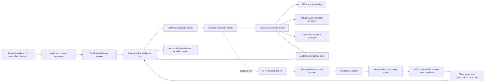

# IT Service Desk and Endpoint Support Agent Blueprint

> **Status:** Research-backed Pass-1 draft; dedicated usefulness, production, security, and contradiction review still required  
> **Research date:** 2026-08-31  
> **Scope:** Authenticated ticket intake, user/device binding, diagnostic evidence, remote-action consent, account-recovery handoff, endpoint-remediation proposals, case state, and escalation  
> **Evidence:** [IT service desk and endpoint support research packet](../../research/packets/it-service-desk-agent-blueprint.md)

This blueprint is for an internal service desk that must diagnose user-affecting endpoint and account-access problems without turning a language model into an identity administrator, fleet administrator, or remote desktop operator.

The safe default is a **single bounded diagnostic agent inside a deterministic case workflow**. The model may select evidence-gathering steps, compare observations with versioned knowledge, form labeled hypotheses, and propose a remediation. Application code owns identity, policy, approvals, ticket transitions, effect dispatch, reconciliation, and closure. A human remains accountable for every consequential remote or identity-sensitive action.

## Product boundary

The agent owns:

- authenticated or explicitly unverified ticket intake;
- binding a requester to an immutable user principal from authoritative systems;
- binding one exact enrolled or inventoried device to the case;
- diagnostic evidence, provenance, hypotheses, and evidence gaps;
- consent and approval state for remote support or endpoint actions;
- a complete, evidence-bearing account-recovery handoff;
- proposals for versioned endpoint-remediation runbooks;
- case lifecycle, waits, deadlines, reconciliation, and escalation packages; and
- verified resolution evidence and user-visible history.

It does **not** own:

- IAM policy, entitlement, role, group, federation, or authentication-method governance;
- deciding identity from name, email text, caller ID, voice, face, IP address, device name, or behavioral inference;
- unrestricted keyboard, pointer, shell, RDP, VNC, browser, or ambient desktop control;
- fleet-wide configuration, MDM policy, software-distribution policy, wipe, retire, delete, or bulk administration;
- security investigation or containment after compromise is suspected;
- infrastructure, network, application, or SaaS incident remediation; or
- employment, legal, or HR decisions.

Those paths terminate in a typed handoff to IAM, endpoint engineering, security, infrastructure/network operations, an application owner, or a human service-desk lead.

## Non-negotiable invariants

1. **No inferred identity.** An email address, phone number, employee fact, device name, location, or confident conversation is a lead—not proof.
2. **No name-only target.** Every effect binds immutable tenant, user, device, case, connector, and resource identifiers.
3. **Remote effects are never model-autonomous.** Remote view, control, diagnostic collection, restart, signed remediation, lock, or recovery actions require an exact, expiring approval appropriate to the action plus an independent verifier.
4. **Identity recovery stays outside the model.** The agent prepares and tracks the handoff; a separately governed recovery service applies organization policy and executes any reset, factor removal, or temporary credential.
5. **No generated shell in production.** Endpoint execution is limited to registered, signed, versioned runbooks with deterministic parameters, preconditions, postconditions, and owners.
6. **Observation is not diagnosis.** Evidence, interpretations, decisions, approvals, and effects remain separate records.
7. **Acknowledged is not necessarily applied.** Connector responses are reconciled against device or identity postconditions before a case is resolved.
8. **Ticket closure is evidence-backed.** A plausible answer, accepted API call, or user silence is not verified resolution.
9. **The model never sees credentials or recovery secrets.** Tokens, passwords, recovery codes, temporary passes, and remote-session secrets are handled by brokers and user-facing secure channels.
10. **D4 stays outside the blueprint.** The agent may not change IAM/MDM/RMM policy, grant roles, install a privileged remote tool, weaken logging, or broaden its own capabilities.

## When not to build this agent

Use deterministic automation when the request can be expressed as a fixed rule with a reliable system-of-record check and a known outcome—for example, ticket routing by catalog item, status notifications, known outage matching, duplicate suppression, approved self-service instructions, or a user-initiated device sync.

Do not add an agent when:

- a service catalog flow already captures every required field and transition;
- the only task is knowledge retrieval and templated response;
- support staff cannot identify authoritative user, asset, identity, and endpoint sources;
- the organization has no defensible account-recovery or remote-support policy;
- connectors expose only broad administrator credentials;
- endpoint postconditions cannot be observed;
- there is no manual fallback or accountable escalation owner; or
- success is measured only as ticket deflection or chat satisfaction.

An agent becomes useful when the next safe diagnostic step depends on incomplete, conflicting, or changing evidence across ticket, device, inventory, knowledge, and telemetry systems—and that benefit is demonstrated against a deterministic baseline.

## Representative workflows

| Workflow | Model-directed work | Deterministic and human boundary | Definition of done |
|---|---|---|---|
| VPN client cannot connect | Selects bounded inventory, configuration, error, and known-issue checks; ranks hypotheses | User/device binding, data access, runbook eligibility, any remote effect, and escalation are policy-owned | Root cause or bounded workaround is verified; otherwise a network/app-owner handoff contains evidence and attempts |
| Application repeatedly crashes | Chooses relevant version, health, event, and conflict checks | Artifact privacy, script catalog, reinstall/restart approval, and effect execution stay outside the model | Application health check and user task succeed after action, or defect package is escalated |
| User is locked out | Explains available recovery path and assembles non-secret case context | Identity proofing, recovery method, factor/password action, and credential delivery belong to the recovery service and human operator | Recovery service returns a receipt, subscriber is notified, and sign-in succeeds—or case is quarantined/escalated |
| Lost or stolen endpoint | Collects existing inventory and last-known management state | No user approval is assumed; security/endpoint owner verifies reporter and device before lock/wipe decisions | Typed security/fleet handoff is accepted; this agent does not wipe or contain |
| Remote assistance requested | Summarizes evidence and proposes session purpose and mode | User and helper authenticate; exact consent and operator approval are rendered outside content; human helper controls the session | Session ends, disconnection is verified, actions are recorded, and outcome is checked |
| Policy or service-wide failure | Detects similar cases and evidence of shared cause | Major incident declaration and infrastructure/app remediation are external | Cases are linked, unsafe individual remediation stops, and an incident handoff is accepted |

## Reference architecture

Authority changes hands only at the policy/approval/verifier boundary. The model cannot call the effect broker, receive provider credentials, approve its proposal, or mark an external effect verified.

## Component ownership

| Component | Owns | Must not own |
|---|---|---|
| Intake gateway | Channel authentication, tenant, request ID, attachment quarantine, rate limit | Identity recovery proofing |
| Identity/device resolver | Immutable IDs, evidence sources, freshness, ambiguity and conflicts | Inferring a principal or silently selecting a device |
| Case workflow | Lifecycle, deadlines, version, owner, waits, cancellations, events | Endpoint or IAM truth |
| Context compiler | Minimum necessary instructions, case state, evidence excerpts, budgets | Durable truth or raw secret-bearing artifacts |
| Diagnostic model | Evidence requests, hypotheses, explanations, proposed next step, abstention | Authorization, policy, approvals, effects, or closure |
| Evidence broker | Purpose-scoped reads, field filtering, provenance, cost/size limits | General shell, arbitrary query, broad tenant search |
| Policy engine | Danger tier, capability, actor, target, freshness, preconditions | Natural-language interpretation as the final allow rule |
| Approval service | Exact display, digest, signer, assurance, expiry, use count | Model-generated approval semantics |
| Independent verifier | Rechecks identity/device/policy/runbook/current state and approval binding | Reusing the proposing model as “independent” evidence |
| Effect/recovery broker | Short-lived connector credentials, dispatch, provider IDs | Broad admin sessions or unregistered commands |
| Reconciler | Provider status plus authoritative postcondition | Treating HTTP success as outcome success |
| Human owner | Consequential decision, exception, remote session, escalation, closure accountability | Delegating accountability to the model |

## Architecture and runtime choice

The recommended production path is hybrid:

- ordinary application code for intake, schemas, identity resolution, policy, approvals, and connector adapters;
- one bounded model loop for diagnosis and evidence selection;
- a relational case/effect store plus a queue for the MVP;
- a durable workflow runtime only when approval waits, timers, cancellations, and uncertain effects justify it;
- human-operated remote-assistance tooling rather than computer-use automation; and
- provider-native APIs through narrow adapters rather than UI/RPA when APIs exist.

| Path | Use when | Reject when |
|---|---|---|
| Deterministic workflow | Known request type, reliable inputs, fixed safe steps | Evidence selection and exception handling materially vary |
| Custom bounded loop | Narrow domain, small tool set, short cases, team can own state and policy | Long waits/effects require replay, timers, and migrations |
| Agent SDK plus application controls | Streaming, structured tool calls, tracing, or approval pause saves implementation time | SDK state/approval is being mistaken for authorization or durability |
| Durable workflow plus bounded model activity | Cases wait hours/days, need timers, recovery, reconciliation, and versioning | First prototype is read-only and short-lived |
| Multi-agent topology | Only after an isolated specialist demonstrably improves a measured slice | Default; roles like planner/critic/router merely add context and failure paths |

Use the production team's supported backend language. TypeScript/.NET/Java are natural in enterprise identity and ITSM estates; Python is strong for model/evaluation tooling. Keep OS-specific PowerShell, shell, or management scripts in the endpoint runbook product, not in the agent runtime. See [reference architecture, runtime, and connectors](02-reference-architecture-runtime-and-connectors.md).

## Workload danger tiers

These specialize the repository's [D0–D4 control vocabulary](../../research/packets/agent-blueprint-cross-cutting-controls.md):

| Tier | Service-desk examples | Default |
|---|---|---|
| D0 | Normalize synthetic ticket text; run an offline evaluator | Autonomous inside budgets |
| D1 | Read one authorized ticket, current user record, device inventory, existing diagnostic telemetry, or approved knowledge article | Pre-authorized purpose-scoped read |
| D2 | Create/update a ticket, draft a user instruction, create an escalation package, or stage a remediation proposal | Policy-controlled; optimistic concurrency and receipt required |
| D3 | Start remote view/control, collect new device diagnostics remotely, restart, lock, run a remediation, reinstall, or commit an IAM recovery action | Exact expiring approval plus independent verification; human accountability |
| D4 | Change IAM/MDM policy, grant entitlement, install/enable privileged RMM, broaden scopes, disable logging, wipe/bulk administer | Prohibited; separate administrative workflow |

Aggregation raises risk. Ten individually reversible device actions, a mutable device selector, cross-tenant data movement, or a runbook that can execute arbitrary code is not D2 merely because one narrow example was.

## Reader paths

| Guide | Decision it supports |
|---|---|
| [Scope, workload fit, and authority](01-scope-workload-fit-and-authority.md) | Whether to build an agent, which workflows belong, and the autonomy ceiling |
| [Reference architecture, runtime, and connectors](02-reference-architecture-runtime-and-connectors.md) | Application shape, third-party adapter contract, model/runtime choice, and deployment boundary |
| [Authenticated intake, identity, device, and recovery](03-authenticated-intake-identity-device-and-recovery.md) | How to bind a case without inference and hand off account recovery safely |
| [Diagnostics, evidence, context, memory, and planning](04-diagnostics-evidence-context-memory-and-planning.md) | How evidence-driven diagnosis works without turning a transcript into truth |
| [Remote support, remediation, approvals, and effects](05-remote-support-remediation-approvals-and-effects.md) | How exact consent, human control, runbooks, idempotency, and postconditions work |
| [Case state, reliability, reconciliation, and escalation](06-case-state-reliability-reconciliation-and-escalation.md) | Durable state, events, timeouts, duplicates, unknown outcomes, and handoffs |
| [Security, privacy, tenancy, and abuse resistance](07-security-privacy-tenancy-and-abuse-resistance.md) | Help-desk social engineering, hostile tickets, data minimization, credentials, and tenant isolation |
| [Evaluation, observability, deployment, operations, and roadmap](08-evaluation-observability-deployment-operations-and-roadmap.md) | Stages 0–6, release gates, SLOs, scaling, incidents, cost, and continuous learning |

## Top production risks and mandatory stops

Stop the agent and route to an accountable owner when:

- principal, tenant, account, or device binding is absent, stale, contradictory, or non-unique;
- a user requests recovery but cannot complete the configured recovery process;
- privileged, executive, admin, finance, HR, or service accounts are involved;
- social-engineering indicators, risky sign-ins, factor-transfer requests, or repeated recovery attempts appear;
- malware, data theft, lost/stolen equipment, or unauthorized remote tooling is suspected;
- the issue affects multiple users or evidence suggests a shared service incident;
- required evidence would exceed the approved data purpose or reveal another user/tenant;
- a remote or identity effect lacks a fresh exact approval and independent verification;
- an effect outcome is unknown, a provider receipt conflicts with observed state, or a prior action is still in flight;
- the only available remediation is arbitrary shell, wipe, retire, policy change, broad batch, or unrestricted control; or
- connector, evaluator, audit, policy, approval, or reconciliation services are unavailable for a D3 path.

## Zero-to-production summary

| Stage | Capability | Authority ceiling | Promotion evidence |
|---|---|---|---|
| 0 — qualify | Deterministic routing, known-issue lookup, self-service baseline | No model effects | Measured gap that model-directed diagnosis can address |
| 1 — bounded loop | Offline/read-only diagnosis with typed evidence tools | D1 on fixtures or redacted cases | Completion/abstention, grounding, budget, and injection tests pass |
| 2 — useful MVP | Authenticated intake, exact binding, real read connectors, human-run instructions | D1 plus D2 ticket/proposal writes | Representative tasks beat baseline without identity or authority violations |
| 3 — reliable v1 | Durable cases, compaction, effect ledger, approved narrow remote/runbook actions | Selected D3 with exact approval and verifier | Crash, duplicate, stale approval, cancellation, and reconciliation tests pass |
| 4 — production readiness | Tenancy, least privilege, tracing, SLOs, release gates, incidents and rollback | Same proven ceiling; no new authority | Security review, canary, runbooks, manual fallback, and audit completeness pass |
| 5 — scale/resilience | Fair queues, cells, quotas, DR, overload degradation, cost controls | Per-tenant/per-device bounded | Load, noisy-neighbor, dependency loss, failover, and backlog recovery pass |
| 6 — continuous evolution | Failure mining, feedback governance, upgrade qualification, freshness and deprecation | Authority expands only through a new gate | Online/offline evidence shows improvement with no critical-slice regression |

The implementable stage-by-stage contracts and exit gates are in [the roadmap guide](08-evaluation-observability-deployment-operations-and-roadmap.md).

## Definition of done

A case is done only when all applicable conditions hold:

- principal and device bindings are recorded with source, freshness, and assurance;
- observations and artifacts have provenance and retention classification;
- hypotheses and decisions remain distinguishable from facts;
- each effect has an immutable intent, approval/verifier evidence, receipt, and postcondition;
- unknown outcomes are reconciled or explicitly handed to an owner;
- the user confirms the service is usable, or an independent service check proves the agreed outcome;
- the ITSM record and local case projection agree on terminal state;
- all remote sessions are terminated and disconnect is verified;
- account recovery produced a recovery-service receipt and subscriber notification without exposing secrets; and
- recurrence, exception, and escalation follow-ups are scheduled where policy requires.

## Canonical repository dependencies

- [Execution boundaries](../../runtime/execution-boundaries.md)
- [Agent state and event contracts](../../runtime/agent-state-and-event-contracts.md)
- [Durable execution](../../runtime/durable-execution.md)
- [Tool contracts](../../tools/tool-contracts.md)
- [Tool results, artifacts, and provenance](../../tools/tool-results-artifacts-and-provenance.md)
- [Context engineering](../../context-memory/context-engineering.md)
- [Compaction and continuity](../../context-memory/compaction-and-continuity.md)
- [Memory architecture](../../context-memory/memory-architecture.md)
- [Idempotency and side effects](../../reliability/idempotency-and-side-effects.md)
- [Agent threat model](../../security/agent-threat-model.md)
- [Prompt injection and untrusted data](../../security/prompt-injection-and-untrusted-data.md)
- [Permissions, sandboxing, and secrets](../../security/permissions-sandboxing-and-secrets.md)
- [Trajectory and reliability evaluation](../../evaluation/trajectory-and-reliability-evaluation.md)
- [Observability and tracing](../../evaluation/observability-and-tracing.md)
- [Queues, scheduling, and backpressure](../../operations/queues-scheduling-and-backpressure.md)
- [Deployment, release, and incident response](../../operations/deployment-release-and-incident-response.md)

## Selected primary sources

- [NIST SP 800-63B-4: authentication and account recovery](https://pages.nist.gov/800-63-4/sp800-63b.html)
- [NIST SP 800-207: Zero Trust Architecture](https://csrc.nist.gov/pubs/sp/800/207/final)
- [NIST SP 800-53 Rev. 5.1](https://csrc.nist.gov/pubs/sp/800/53/r5/upd1/final)
- [Joint government advisory on Scattered Spider](https://www.cyber.gov.au/about-us/view-all-content/alerts-and-advisories/scattered-spider)
- [Microsoft Intune Remote Help planning](https://learn.microsoft.com/en-us/intune/remote-help/plan)
- [Microsoft Intune device actions](https://learn.microsoft.com/en-us/intune/device-management/actions/)
- [Apple device-management commands](https://developer.apple.com/documentation/devicemanagement/commands-and-queries)
- [Android Management API device commands](https://developers.google.com/android/management/reference/rest/v1/enterprises.devices/issueCommand)
- [ServiceNow incident lifecycle](https://www.servicenow.com/docs/r/it-service-management/incident-management/c_IncidentManagementStateModel.html)
- [Jira Service Management request API](https://developer.atlassian.com/cloud/jira/service-desk/rest/api-group-request/)

