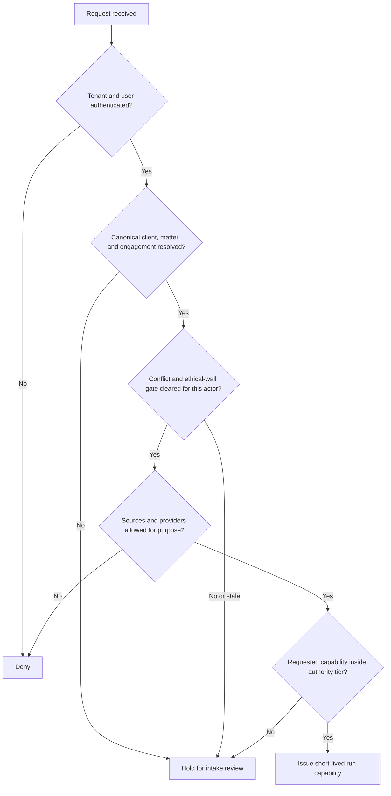

# Mission, Boundaries, Identity, and Authority

## Operational mission

The agent reduces the clerical and analytical load around matters and contracts while preserving professional accountability. Its useful verbs are **organize, retrieve, compare, draft, flag, and propose**. Those verbs are deliberately weaker than interpret, advise, negotiate, accept, waive, authorize, or sign.

The application must be able to answer four questions before every run and every effect:

1. **Who is represented?** The canonical client and matter, not merely the user who uploaded a file.
2. **What work is authorized?** The engagement, purpose, contract family, jurisdictions, and exclusions.
3. **Which material may be used?** Matter-scoped sources, approved playbooks, and allowed providers.
4. **Who can decide or act?** A current role and authority record for this exact decision or effect.

## Professional authority matrix

| Activity | Agent | Legal operations | Qualified lawyer or authorized legal professional | Business owner or signer |
|---|---|---|---|---|
| Resolve duplicate entity candidates | Propose with evidence | Verify registry data | Decide conflict-relevant identity when ambiguous | Confirm business relationship |
| Open workspace | Prepare | Execute after intake controls | Accept representation and clear conflicts | Supply facts |
| Classify confidentiality | Suggest label | Apply approved policy | Decide privilege and work-product treatment | Respect access constraints |
| Compare language to playbook | Perform and cite | Triage workflow | Interpret and select negotiation position | Approve business trade-off |
| Draft fallback language | Propose | Route and track | Approve legal text | Approve commercial intent |
| Calculate deadline | Extract trigger and compute candidate | Validate inputs and calendar | Accept authoritative legal rule and date | Own operational response if assigned |
| Prepare signature package | Assemble exact package | Validate checklist | Approve execution formalities and final terms | Establish authority and sign |
| Issue or release legal hold | Propose workflow support | Operate approved process | Decide issuance, scope, changes, and release | Preserve as instructed |

Local law, professional rules, organizational delegation, and engagement terms can require stricter allocation. The table is a minimum separation, not a universal statement of who may practice law.

## Category seams

| Incoming or outgoing artifact | Producer | Consumer | Contract at the seam |
|---|---|---|---|
| Extracted text and source spans | Document Intelligence | Legal operations | Original digest, extraction version, page/paragraph anchors, render, confidence, warnings |
| Regulatory change candidate | Regulatory Intelligence | Legal professional, then legal operations | Official source, effective dates, version diff, jurisdiction assertion, unresolved applicability |
| Patent family or claim evidence | Patent/IP Research | Legal professional | Publication identity, family graph, claim spans, search provenance; no infringement conclusion |
| Supplier award | Procurement | Legal operations | Selected legal entity, commercial owner, approved business terms, sourcing status |
| Control evidence request | Compliance Audit | Legal operations | Purpose, scope, minimum artifact, authority, due date; never unrestricted matter access |
| Accepted obligation | Legal operations | Contract owner or compliance process | Exact clause, contract version, owner, trigger rule, due rule, approval, evidence requirement |

If a downstream workflow needs a new interpretation, it returns to the authorized legal decision-maker. It must not reinterpret an upstream artifact silently.

## Identity is layered

A single `party_name` field is unsafe. Store separate, linked identities:

```yaml
identity_bundle:
  tenant_id: ten_01
  client_id: cli_482
  matter_id: mat_2026_0142
  engagement_id: eng_991
  organization:
    organization_id: org_730
    legal_name: Example Holdings Limited
    registry_authority: Companies House
    registry_id: "01234567"
    lei: null
    aliases: [Example Holdings]
    resolution_status: verified
    evidence_artifact_ids: [art_registry_11]
  person:
    person_id: per_208
    account_id: acct_633
    employer_organization_id: org_730
    asserted_role: Director
    identity_assurance: provider_asserted
  authority:
    authority_record_id: auth_902
    action: sign_contract
    scope: contract_77_version_9
    granted_by: board_resolution_4
    valid_from: 2026-08-01T00:00:00Z
    valid_until: 2026-09-30T23:59:59Z
    verification_status: counsel_approved
```

An LEI identifies an eligible legal entity under ISO 17442; it does not prove beneficial ownership or an individual's signing power. NIST SP 800-63 identity assurance concerns a natural person's digital identity; it does not prove corporate authority. OpenID Connect authentication says which account authenticated; application authorization still decides what that account may do.

## Matter and engagement contract

```yaml
matter:
  matter_id: mat_2026_0142
  tenant_id: ten_01
  canonical_client_ids: [cli_482]
  counterparty_ids: [org_730]
  engagement_id: eng_991
  purpose: review_supplier_msa
  engagement_scope:
    included: [contract_review, negotiation_support]
    excluded: [tax_advice, employment_advice, signature_authority]
  jurisdiction_assertions:
    governing_law_candidate: England and Wales
    forum_candidate: courts_of_england_and_wales
    operational_locations: [GB, IN]
    status: needs_counsel_confirmation
  information_classes_allowed: [confidential, asserted_privileged]
  provider_policy_id: pp_14
  ethical_wall_id: wall_18
  responsible_professional_id: per_17
  lifecycle_state: intake_pending
  source_artifact_ids: [art_engagement_letter_2]
  policy_version: matter_policy_7
```

Jurisdiction fields are assertions with provenance and review status. Governing law, forum, service location, data location, professional admission, counterparty location, and subject-matter rules are different dimensions; do not collapse them into a country code.

## Authority-before-analysis gate



The run capability binds tenant, user, matter, purpose, source set, tool set, information classes, maximum effect tier, expiry, and policy version. Workers never infer authority from a prompt or document.

## Consequence classification

| Proposed action | Default tier | Required control |
|---|---:|---|
| Summarize an authorized version | D0 | Source citations and no cross-matter retrieval |
| Read a specific CLM record | D1 | Object-level authorization and field minimization |
| Save a private internal draft | D2 | Proposed status, owner, rollback or deletion route |
| Send redline to named counterparty counsel | D3 | Exact bytes, digest, recipients, privilege/confidentiality review, approval expiry, delivery receipt |
| Change final clause acceptance | D4 | Agent cannot do it |
| Decide that a communication is privileged | D4 | Qualified legal decision only |
| Release a legal hold | D4 | Qualified legal decision plus controlled execution |

Never downgrade a consequential effect because the connector calls it a normal API operation.

## Refusal and escalation rules

The agent abstains and creates a review item when:

- a client, counterparty, affiliate, prospective client, or former client cannot be resolved confidently;
- the engagement letter or assigned matter does not cover the requested work;
- conflict status is missing, stale, overridden, or based only on fuzzy name matching;
- jurisdictions disagree or the applicable rule source is not current;
- a document appears to belong to another matter or ethical wall;
- the source is incomplete, corrupted, unsigned where signature matters, or missing referenced schedules;
- counsel's requested task would cause the agent to make a reserved legal decision;
- approval does not bind the exact effect payload; or
- an external effect is `Unknown` and has not been reconciled.

Escalation contains the minimum necessary evidence, the unresolved choice, possible operational consequences, and a safe default such as read-only or no-send. It does not broadcast matter content to a generic support queue.

## Boundary verification checklist

- [ ] Canonical client, matter, engagement, parties, and aliases are versioned.
- [ ] Conflict and ethical-wall results have source, reviewer, timestamp, and expiry.
- [ ] Engagement inclusions and exclusions are machine-enforced.
- [ ] Jurisdiction dimensions are separate assertions, not a single guessed field.
- [ ] Every tool and effect has a deterministic authority check.
- [ ] Professional and business decisions have named human owners.
- [ ] Upstream category artifacts retain identity and provenance.
- [ ] D4 activities cannot be enabled by prompt, model output, or ordinary admin configuration.

## Key sources

- [ABA Model Rules of Professional Conduct](https://www.americanbar.org/groups/professional_responsibility/publications/model_rules_of_professional_conduct/) and [Rule 1.6 confidentiality](https://www.americanbar.org/groups/professional_responsibility/publications/model_rules_of_professional_conduct/rule_1_6_confidentiality_of_information/)
- [ABA Rule 1.7 current-client conflicts](https://www.americanbar.org/groups/professional_responsibility/publications/model_rules_of_professional_conduct/rule_1_7_conflict_of_interest_current_clients.ssologout/) and [Rule 1.18 prospective clients](https://www.americanbar.org/groups/professional_responsibility/publications/model_rules_of_professional_conduct/rule_1_18_duties_of_prospective_client/)
- [NIST SP 800-63-4 digital identity guidelines](https://pages.nist.gov/800-63-4/)
- [OpenID Connect Core 1.0](https://openid.net/specs/openid-connect-core-1_0.html)
- [ISO 17442-1:2020 LEI overview](https://www.iso.org/standard/78829.html)

